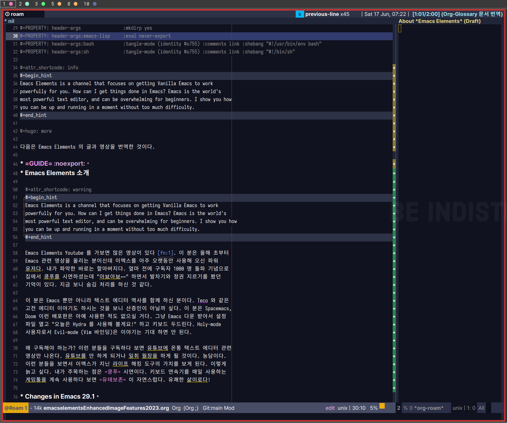

<!-- gid:20230614T125100 -->
[TOC]

[[TIP("이 노트에 대하여")]] 유튜브 채널 Emacs Elements는 기능 소개를 넘어 이맥스의 생활감을 보여준다. 버전 변화, 팁, 사용 맥락을 친근하게 전달해 진입 장벽을 낮추는 기록이 모여 있다. [[/TIP]] BIBLIOGRAPHY Related-Notes - [유튜브 자막 스크립트 자동번역](https://notes.junghanacs.com/notes/20230927T140000/)

## [2023-06-14 Wed 12:51]

Emacs Elements 는 올해 나에게 가장 도움이 많이 된 Emacs 유튜브 채널이다. 그 중에서도 "Changes in Emacs 29" 과 PDF 활용법, Emacs 설치 방법 등은 아주 유용한 최신 팁이다.

다음은 Emacs Elements 의 글과 영상을 번역한 것이다.

## [2025-01-26 Sun 18:19] 근황?

유튜브 채널도 없어졌다. 무슨 일인가?

## Emacs Elements 소개

Emacs Elements is a channel that focuses on getting Vanilla Emacs to work powerfully for you. How can I get things done in Emacs? Emacs is the world's most powerful text editor, and can be overwhelming for beginners. I show you how you can be up and running in a moment without too much difficulty.

Emacs Elements Youtube 를 가보면 많은 영상이 있다&nbsp;[^fn:1]. 이 분은 올해 초부터 Emacs 관련 영상을 올리는 분이신데 이맥스를 아주 오랫동안 사용해 오신 파워 유저다. 내가 파악한 바로는 할아버지다. 얼마 전에 구독자 1000 명 돌파 기념으로 집에서 쿵푸를 시연하셨는데 "아뵤아뵤~~" 하면서 발차기와 정권 지르기를 봤던 기억이 있다. 지금 보니 숨김 처리를 하신 것 같다.

이 분은 Emacs 뿐만 아니라 텍스트 에디터 역사를 함께 하신 분이다. Teco 와 같은 고전 에디터 이야기도 하시는 것을 보니 산증인이 아닐까 싶다. 이 분은 Spacemacs, Doom 이런 배포판은 아예 사용한 적도 없으실 거다. 그냥 Emacs 다운 받아서 설정 파일 열고 "오늘은 Hydra 를 사용해 볼게요!" 하고 키보드 두드린다. Holy-mode 사용자로서 Evil-mode (Vim 바인딩)은 이야기는 기대 하면 안 된다.

왜 구독해야 하는가? 이런 분들을 구독하다 보면 유튜브에 온통 텍스트 에디터 관련 영상만 나온다. 유튜브를 안 하게 되거나 일취 월장을 하게 될 것이다. 농담이다. 이런 분들을 보면서 이맥스가 지닌 라이프 해킹 도구의 가치를 보게 된다. 이렇게 늙고 싶다. 내가 주목하는 점은 `쿵푸` 시연이다. 키보드 연속기를 매일 사용하는 게임툴을 계속 사용하다 보면 `유태보존` 이 자연스럽다. 유쾌한 삶이로다!



## Changes in Emacs 29.1

`================================` <https://github.com/emacs-mirror/emacs/blob/master/etc/NEWS.29> [Enhanced Image Features in Emacs 29 - YouTube](https://youtu.be/VRKqkpcA6AI)

5000 line document

Ahead-of-time native compilation can now be requested using '--with-native-compilation=aot' during configuration. This option requests ahead-of-time (AOT) native compilation, which means that all the Lisp files in the Emacs tree will be compiled to native code during the build and installation process.

Support for the WebP image format has been added.

Emacs can be built with pure GTK, allowing it to work on any window system supported by GDK.

Emacs now supports Unicode Standard version 15.0.

New command to change the font size globally. To increase the font size, type 'C-x C-M-+' or 'C-x C-M-='; to decrease it, type 'C-x C-M--'; to restore the font size, type 'C-x C-M-0'.

New command 'find-sibling-file'. This command jumps to a file considered a "sibling file", which is determined according to the new user option 'find-sibling-rules'.

New command 'rename-visited-file'. This command renames the file visited by the current buffer by moving it to a new name or location, and also makes the buffer visit this new file.

'delete-process' is now a command.

'restart-emacs'

'count-words' will now report buffer totals if given a prefix. Without a prefix, it will only report the word count for the narrowed part of the buffer.

'count-words' will now report sentence count when used interactively.

'write-file' will now copy some file mode bits. If the current buffer is visiting a file that is executable, the 'C-x C-w' command will now make the new file executable, too.

Emacs now has several new methods for inserting Emoji.😀 The Emoji commands are under the new 'C-x 8 e' prefix. New command 'emoji-insert' (bound to 'C-x 8 e e' and 'C-x 8 e i'). New command 'emoji-recent' (bound to 'C-x 8 e r').

New command-line option '-r'/'--reuse-frame' for emacsclient. With this command-line option, Emacs reuses an existing graphical client frame if one exists; otherwise it creates a new frame.

'M-SPC' is now bound to 'cycle-spacing'. Formerly it invoked 'just-one-space'. The actions performed by 'cycle-spacing' and their order can now be customised via the user option 'cycle-spacing-actions'.

New user option 'copy-region-blink-predicate'. By default, when copying a region with 'kill-ring-save', Emacs only blinks point and mark when the region is not denoted visually, that is, when either the region is inactive, or the 'region' face is indistinguishable from the 'default' face.

New user option 'dired-free-space'. Dired will now, by default, include the free space in the first line instead of having it on a separate line.

doc-view can now generate SVG images when viewing PDF files. If Emacs is built with SVG support, doc-view can generate SVG files when using MuPDF as the converter for PDF files, which generally leads to sharper images.

New command 'package-update'. This command allows you to upgrade packages without using 'M-x list-packages'.

New command 'package-update-all'. This command allows updating all packages without any queries.

New commands 'package-recompile' and 'package-recompile-all'. These commands can be useful if the ".elc" files are out of date (invalid byte code and macros).

New command 'package-vc-install'. Packages can now be installed directly from source by cloning from their repository.

New command 'scratch-buffer'. This command switches to the "**scratch**" buffer. If "**scratch**" doesn't exist, the command creates it first. You can use this command if you inadvertently delete the "**scratch**" buffer. (global-set-key (kbd "&lt;f8&gt;") 'scratch-buffer)

New commands for navigating completions from the minibuffer. When the minibuffer is the current buffer, typing 'M-&lt;up&gt;' or 'M-&lt;down&gt;' selects a previous/next completion candidate from the "**Completions**" buffer and inserts it to the minibuffer.

'recentf-mode' now uses abbreviated file names by default. This means that e.g. "/home/foo/bar" is now displayed as "~/bar".

New command 'recentf-open'. This command prompts for a recently opened file in the minibuffer, and visits it.

use-package: Declarative package configuration. use-package is now shipped with Emacs.

New commands 'image-crop' and 'image-cut'.

New theme 'leuven-dark'.

## Enhanced Image Features in Emacs 29

`=================================` New commands 'image-crop' and 'image-cut'

i c i x

image-dired-slideshow-start

'S'

Image-Dired now displays thumbnails for PDF files

The command 'bookmark-set' (bound to 'C-x r m') is now supported in the thumbnail view

'image-dired-thumb-size' increased to 128

### Navigation and marking commands now work in image display buffer.

The following new bindings have been added:

-   'n', 'SPC' =&gt; 'image-dired-display-next'
-   'p', 'DEL' =&gt; 'image-dired-display-previous'
-   'm' =&gt; 'image-dired-mark-thumb-original-file'
-   'd' =&gt; 'image-dired-flag-thumb-original-file'
-   'u' =&gt; 'image-dired-unmark-thumb-original-file'

### New command 'image-dired-unmark-all-marks'.

It removes all marks from all files in the thumbnail and the associated Dired buffer, and is bound to 'U' in the thumbnail and display buffer.

### New command 'image-dired-do-flagged-delete'.

It deletes all flagged files, and is bound to 'x' in the thumbnail buffer. It replaces the command 'image-dired-delete-marked', which is now an obsolete alias.

### PDF support.

Image-Dired now displays thumbnails for PDF files. Type 'RET' on a PDF file in the thumbnail buffer to visit the corresponding PDF.

## PDF Software in Linux

<https://youtu.be/C7HWTLXD9L4>

-   This video is only _partly_ about Emacs
-   Review and a rant
-   PDF viewers aplenty: `evince`, `okular`, `Google Chrome`
-   `Okular` helpful for filling out forms and inserting signatures
    -   (Create your signature in Gimp and make it transparent)
    -   `gimp` 를 설치하라.
-   `Okular` also is able to read text aloud easily.
-   Another excellent option is `xournal++`, which also allows one to reorder pages in a pdf, something you cannot do in okular or evince.
-   OCR `tesseract`. Command line tool.
-   This script will convert all pdfs in a given folder to txt
-   `gImageReader` also does this through a graphic user interface, and allows good control.
-   `pdfarranger` - rearranges pages
-   The Emacs package `pdf-tools` can help view, annotate, and bookmark PDFs and teh built in `image-dired` can sort through PDFs. Its pdf editing capabilities are lacking.
-   But there is a problem: some pdfs are not readable in _ANY_ Linux application e.g. my IRP-5 file One has to use `Adobe Acrobat` to view the file The only other PDF viewer that will show the file is `Master PDF Editor` 다운로드 <https://code-industry.net/free-pdf-editor/#get>

-   Installing a working version of Adobe Reader on Linux is near impossible. Much of the functionality has been removed. You cannot print an abnormal pdf to pdf.
-   `Adobe Acrobat` will not install on Linux and that is by design of Adobe. It is not because `wine` cannot handle it.
-   It is only available through a Virtual Machine

<!--listend-->

```bash
sudo apt install okular okular-extra-backends -y
sudo apt install xournalpp -y
sudo apt install -y tesseract-ocr tesseract-ocr-kor tesseract-ocr-eng
sudo apt install -y tesseract-ocr-kor-vert tesseract-ocr-script-hang tesseract-ocr-script-hang-vert

sudo apt install -y poppler-utils
sudo apt install -y pdfarranger

# GIMP
sudo apt install -y gimp gimp-data-extras gimp-help-ko gimp-help-en

# Inkscape
sudo apt install -y inkscape

# pip install pdf2image
```

```text
In the poppler-utils packages there is the utility pdftoppm capable of converting pages from a pdf file to ppm, png or jpeg format:

pdftoppm -png file.pdf prefix
will produce prefix-01.png etc. for each page. By default the resolution is 150dpi. Increase the resolution (for higher quality output) as follows:

pdftoppm -rx 300 -ry 300 -png file.pdf prefix

To print only one page, use

pdftoppm -f N -singlefile -png file.pdf prefix
where N is the page number, beginning with 1.
```

SHELL

```bash
# sudo apt install okular okular-extra-backends -y
# sudo apt install xournalpp -y
# sudo apt install -y tesseract-ocr tesseract-ocr-kor tesseract-ocr-eng
# sudo apt install -y tesseract-ocr-kor-vert tesseract-ocr-script-hang tesseract-ocr-script-hang-vert
# sudo apt install -y poppler-utils

if [ ! -d "$1" ]; then
        echo -e "$1 is not a valid directory"
        exit 1
fi

PWD=$(pwd)

# Set the default directory
# default_dir="/home/red/Desktop/pdfs"
# default_dir="~/Documents/pdf/"
default_dir=$(cd "$1" ; pwd)
echo -e "DIR-PATH $src"

# Navigate to the default directory
cd "$default_dir"

# List all PDF files (both lowercase and uppercase) in the directory
pdf_files=( $(find . -maxdepth 1 -iname "*.pdf") )

# Prompt the user to choose a PDF file, or select "All" to convert all files
echo "Select a PDF file or choose 'All' to convert all files:"
select pdf_choice in "${pdf_files[@]}" "All"; do
        break
done

if [[ "$pdf_choice" == "All" ]]; then
        files_to_convert=("${pdf_files[@]}")
else
        files_to_convert=("$pdf_choice")
fi

for pdf_file in "${files_to_convert[@]}"; do
        # Extract the name of the PDF file without the extension
        pdf_name=$(basename "$pdf_file" .pdf)

        # Convert the PDF to TIFF images
        /usr/bin/pdftoppm -tiff "$pdf_file" "${pdf_name}_output_"

        # Use Tesseract OCR to convert TIFF images to text and save it in a text file
        for file in "${pdf_name}_output_"*.tif; do
                /usr/bin/tesseract "$file" "${file%.*}" -l eng
        done

        # Concatenate all text files into a single file with the same name as the PDF
        cat "${pdf_name}_output_"*.txt > "${pdf_name}_raw.txt"

        # Post-process the text file to replace "|" with "I"
        sed 's/|/I/g' "${pdf_name}_raw.txt" > "${pdf_name}.txt"

        # Remove temporary text files
        # rm "${pdf_name}_output_"*.txt
        # rm "${pdf_name}_raw.txt"

        # Remove temporary TIFF files
        # rm "${pdf_name}_output_"*.tif

        echo "The text from the PDF '$pdf_name' has been saved to '${pdf_name}.txt'"
done

cd "$PWD"
```

## How to insert pairs quickly without fancy packages

For this solution to work you must ensure that `delete-selection-mode` is enabled.

`SPC v` expand-region 으로 선택한다. evil 이 별로 인가? 적당한 커맨드를 모르는 것일 뿐이다. 다음 라인에 복사하니까 문장을 복북하고 볼드로 바꾸는게 쉽지 않다. 아니면 그냥 org 커맨드로 하면 된다. 이게 편하다.

기본 `M-w` kill-ring-save 이다. 복사하는 것이다. 이게 기본 키 하나를 잡고 있는 것은 엄청난 일이다. 귀한 키배열을 가지고 있는 만큼 중요하다는 말일거다.

kill-sentence kill- 시리즈가 많이 있다. 다음에 함수를 기존 것을 교체하라는 것이다. 좋은 것인가?! 아예 kill 시리즈를 뭉탱이로 관리하는 것은 어떤가 싶다. 여튼 기존 세팅 보다는 편하다. 근데 얼마나 쓸 지 모르는 일.

```lisp
(defun my-kill-ring-save-keep-selection ()
  (interactive)
  (when (use-region-p)
    (let ((beg (region-beginning))
          (end (region-end)))
      (kill-ring-save beg end)
      (setq deactivate-mark nil))))

(global-set-key (kbd "M-w") 'my-kill-ring-save-keep-selection)
```

_Integer placerat tristique nisl._ BOLD

_Integer placerat tristique nisl._ ITALICS

"Integer placerat tristique nisl." QUOTES

`(global-set-key (kbd "M-w") 'my-kill-ring-save-keep-selection)` MARK AS CODE

[^fn:1]: <https://www.youtube.com/@emacselements>
