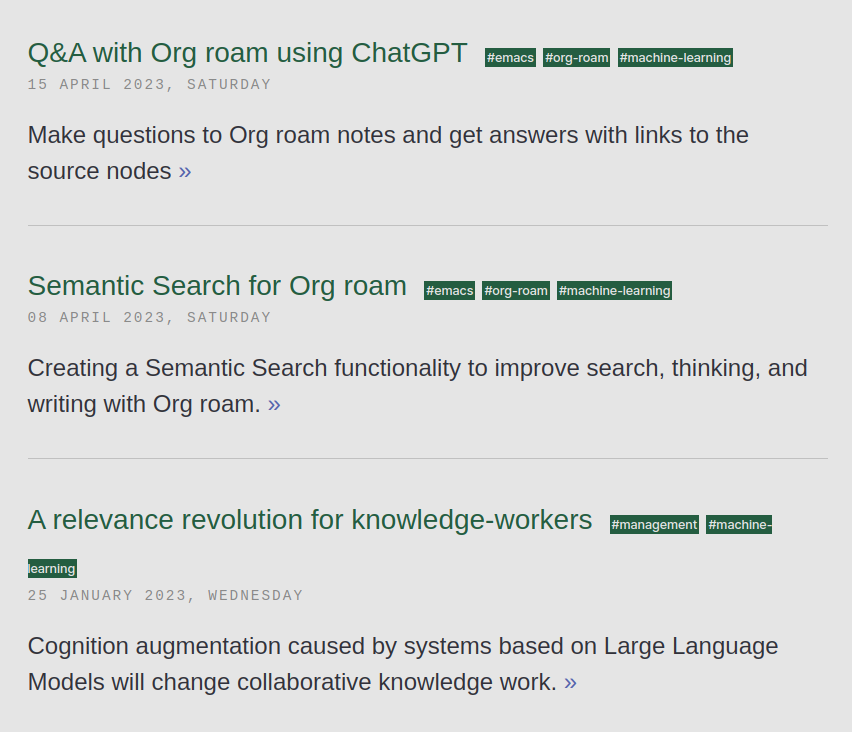

<!-- gid:20230710T064200 -->
[TOC]

[[TIP("이 노트에 대하여")]] 이 노트는 Luis Moneda의 시맨틱 검색, AI 어시스턴트, 구성가능한 LLM 애플리케이션 실험을 모은다. 지식노동자의 메모 환경을 검색과 대화 중심으로 재구성하려는 흐름이 읽힌다. [[/TIP]] Building applications with LLMs through composability [contacts::Luis Moneda - lgmoneda - lgmoneda.github.io](https://wikidocs.net/380486.md#bb7e4557-5f1e-4b8e-8f0e-990dccb6873a/)

## 관련링크

### Luis Moneda 2024 "A messy version of an ai assistant in Emacs I’ve been iterating to find out what is useful.

(Luis Moneda 2024a)

A messy version of an ai assistant in Emacs I’ve been iterating to find out what is useful. Notes in <https://lgmoneda.github.io/> - assistant-settings.el

### Luis Moneda 2023 "A relevance revolution for knowledge-workers"

(Luis Moneda 2023a)

Cognition augmentation caused by systems based on Large Language Models will change collaborative knowledge work.

### Luis Moneda 2024 "lgmoneda/dot-emacs"

(“Lgmoneda/Dot-Emacs” 2024)

My Emacs config files

### TODO Luis Moneda 2023 "Semantic Search for Org roam"

(Luis Moneda 2023b)

Creating a Semantic Search functionality to improve search, thinking, and writing with Org roam.

### Moneda, Luis 2024 "Cognitive joy tooling #1: the Catalyst AI assistant, design review and 90-days retrospective"

(Luis Moneda 2024b)

My experience using a catalyst agent that engages me when I use Org and Org Roam Cognitive joy tooling #1

Summary

본 글은 저자가 개발한 Emacs 기반의 AI 어시스턴트 "Catalyst Assistant" 90일 사용 후기를
다룹니다. 주요 기능은 개인 노트(Org Roam), 할 일 목록, 일정 관리에 대한 심층적인
질의응답 및 연관 노트 제안입니다.

주요 내용은 다음과 같습니다:

1 세 가지 주요 기능:

1 의미 기반 검색 (Semantic Search): 4895개 노드에 대한 효과적인 검색 및 관련 노트
  제시
2 질의응답 (Q&amp;A): 사용빈도가 낮아 유용성이 낮다고 판단
3 Catalyst Assistant: 생각을 촉진하고 자기 성찰을 돕는 AI 어시스턴트. 개인의 일정,
  할 일, Org Roam 노트 변경 사항을 모니터링하고, 관련 정보를 제공하며, 질문에
  답하고, 글쓰기 과정에서 피드백을 제공하는 기능

2 Catalyst Assistant 구조: Org 파일 변경 로그를 모니터링하여 AI 모델에 입력하고,
  프롬프트 기반으로 다양한 루틴을 실행합니다. (아침/저녁 루틴, 지속적 검토 등)

3 상호작용 방식: 채팅, 수동 루틴 실행, 사전 설정된 루틴을 통한 자동 피드백 등 세 가지
  방식을 제공합니다.

4 장점: 자동 피드백 기능은 글쓰기 과정에서 유용하며, 생각을 정리하고 잊기 쉬운 부분을
  상기시켜주는 데 효과적입니다.

5 단점: 연관 노트 제안 기능의 정확도가 낮고, 환각(hallucination) 현상이 간헐적으로
  발생하며, 마크다운 포맷팅 및 메모리 기능에 문제가 있습니다.

6 결론: Semantic Search 만큼 중추적인 역할은 아니지만, 향후 개선을 통해 더욱 유용한
  도구가 될 가능성을 보여줍니다. 향후 버전에서는 에이전트 기반 시스템으로 개선할
  계획입니다.

### Sharing Org Roam content | lgmoneda

(Luis Moneda 2025a)

### Cognitive joy tooling #2: textual topography

(Luis Moneda 2025b) Cognitive joy tooling \\#2 Moneda, Luis Profiling a text’s characteristics using embeddings and plots 2025

### Cognitive joy tooling #3: Closing the creation-application gap of my knowledge base using auto-segmentation, colors, and semantic search

(Luis Moneda 2025c) Cognitive joy tooling \\#3 Moneda, Luis Segmenting what I read or write to make me inspect my personal notes more often 2025

## [blog | lgmoneda](http://lgmoneda.github.io/blog/)

[2025-04-06 Sun 14:33]

### Article

-   11 Jan 2025 » [Sharing Org Roam content](http://lgmoneda.github.io/2025/01/11/sharing-org-roam-content.html)
-   04 Jan 2025 » [Cognitive joy tooling #2: textual topography](http://lgmoneda.github.io/2025/01/04/intro-textual-topography.html)
-   19 Oct 2024 » [Cognitive joy tooling #1: the Catalyst AI assistant, design review and 90-days retrospective](http://lgmoneda.github.io/2024/10/19/catalyst-assistant-90-days.html)
-   06 Jul 2024 » [Invariance in Machine Learning #4: Invariant Random Forest](http://lgmoneda.github.io/2024/07/06/invariant-random-forest.html)
-   28 Oct 2023 » [Spotting hallucination in LLMs using similarity variance](http://lgmoneda.github.io/2023/10/28/spotting-hallucination-with-similarity-variance.html)
-   15 Apr 2023 » [Q&amp;A with Org roam using ChatGPT](http://lgmoneda.github.io/2023/04/15/q-and-n-with-org-roam-chatgpt.html)
-   08 Apr 2023 » [Semantic Search for Org roam](http://lgmoneda.github.io/2023/04/08/semantic-search-for-org-roam.html)
-   25 Jan 2023 » [A relevance revolution for knowledge-workers](http://lgmoneda.github.io/2023/01/25/relevance-revolution-knowledge-work.html)
-   28 Oct 2022 » [On Project management for Data Science](http://lgmoneda.github.io/2022/10/28/project-management-data-science.html)
-   06 Jul 2022 » [A Random Time Robust Forest](http://lgmoneda.github.io/2022/07/06/random-time-robust-forest.html)
-   13 Jun 2022 » [Time Robust Tree experiments on real datasets](http://lgmoneda.github.io/2022/06/13/experiments-time-robust-tree.html)
-   26 Mar 2022 » [Continuous Performance Calibration](http://lgmoneda.github.io/2022/03/26/continuous-performance-calibration.html)
-   22 Mar 2022 » [Ang Li's example on the Unit Selection problem with counterfactual logic](http://lgmoneda.github.io/2022/03/22/li-unit-selection-problem-example.html)
-   12 Mar 2022 » [The Manager-report expectations doc](http://lgmoneda.github.io/2022/03/12/manager-report-expectations-doc.html)
-   23 Feb 2022 » [Defining a starter project in Data Science](http://lgmoneda.github.io/2022/02/23/starter-project-for-ds.html)
-   03 Dec 2021 » [Introducing the Time Robust Tree - invariance in Machine Learning #3](http://lgmoneda.github.io/2021/12/03/introducing-time-robust-tree.html)
-   27 May 2021 » [Exploring invariance in Machine Learning #2: Invariant Risk Minimization](http://lgmoneda.github.io/2021/05/27/invariant-risk-minimization.html)
-   23 Feb 2021 » [On "Why greatness cannot be planned" and how data science happens in the industry](http://lgmoneda.github.io/2021/02/23/on-why-greatness-cannot-be-planned.html)
-   21 Feb 2021 » [Exploring invariance in Machine Learning #1: Invariant Causal Prediction](http://lgmoneda.github.io/2021/02/21/invariant-causal-prediction.html)
-   19 Feb 2021 » [An introduction to Independent Causal Mechanisms](http://lgmoneda.github.io/2021/02/19/causal-invariance.html)
-   12 Jan 2021 » [Spurious correlation, machine learning, and causality](http://lgmoneda.github.io/2021/01/12/spurious-correlation-ml-and-causality.html)
-   07 Dec 2020 » [Temporal feature selection with SHAP values](http://lgmoneda.github.io/2020/12/07/temporal-feature-selection-with-shap-values.html)
-   29 Feb 2020 » [A sane internet experience](http://lgmoneda.github.io/2020/02/29/a-sane-internet-browsing-experience.html)
-   12 Jan 2020 » [An one on one guide when talking to leadership](http://lgmoneda.github.io/2020/01/12/one-on-one-guide.html)
-   15 Oct 2019 » [Book summary: The Power of Less](http://lgmoneda.github.io/2019/10/15/the-power-of-less-summary.html)
-   17 Feb 2019 » [The pessimist and the optmistic view of bias in Machine Learning](http://lgmoneda.github.io/2019/02/17/ml-bias-doomed-or-safe.html)
-   01 Jun 2018 » [Judea Pearl's ladder of causation](http://lgmoneda.github.io/2018/06/01/the-book-of-why.html)
-   06 Mar 2018 » [Using Orange: a visual tool for Data Science!](http://lgmoneda.github.io/2018/03/06/using-orange.html)
-   21 Jan 2018 » [Find yourself a job!](http://lgmoneda.github.io/2018/01/21/find-yourself-a-job.html)
-   15 Mar 2017 » [A brief introduction to Emacs Lisp for people with programming background](http://lgmoneda.github.io/2017/03/15/elisp-summary.html)
-   19 Feb 2017 » [A solution for the reload modules problem in Emacs Python Shell](http://lgmoneda.github.io/2017/02/19/emacs-python-shell-config-eng.html)
-   02 Apr 2016 » [hello world!](http://lgmoneda.github.io/2016/04/02/hello-world.html)

(“Lgmoneda/Dot-Emacs” 2024)

## 2023-07-10 Survey

[2023-07-10 Mon 09:56] LangChain 관련 조사. 아래 lgmoneda 님의 블로그에서 엄청난 인사이트를 확인한 바 있다. 나의 투두 중에 하나이다.&nbsp;[^fn:1] - [랭체인](https://wikidocs.net/380737)

조만간 아래 문서는 정리를 해서 올릴 예정이다.

(Luis Moneda 2023b)

-   "Semantic Search for Org roam" Luis Moneda 2023
-   Creating a Semantic Search functionality to improve search, thinking, and writing with Org roam.

몇 가지 관련 링크만 넣어둔다.

-   LangChain JS/TS Doc&nbsp;[^fn:2]
-   LangChain + Org-mode&nbsp;[^fn:3]
-   LangChain Github Clone&nbsp;[^fn:4]

## Related-Notes

## BIBLIOGRAPHY

  “Lgmoneda/Dot-Emacs.” 2024. [https://github.com/lgmoneda/dot-emacs](https://github.com/lgmoneda/dot-emacs).
  Luis Moneda. 2023a. “A Relevance Revolution for Knowledge-Workers.” January 25, 2023. [http://lgmoneda.github.io/2023/01/25/relevance-revolution-knowledge-work.html](http://lgmoneda.github.io/2023/01/25/relevance-revolution-knowledge-work.html).
  ———. 2023b. “Semantic Search for Org Roam.” April 8, 2023. [http://lgmoneda.github.io/2023/04/08/semantic-search-for-org-roam.html](http://lgmoneda.github.io/2023/04/08/semantic-search-for-org-roam.html).
  ———. 2024a. “A Messy Version of an Ai Assistant in Emacs I’ve Been Iterating to Find out What Is Useful. Notes in Https://Lgmoneda.Github.Io/.” 2024. [https://gist.github.com/lgmoneda/6764fd712660b9bd0eb9870f66778ee6](https://gist.github.com/lgmoneda/6764fd712660b9bd0eb9870f66778ee6).
  ———. 2024b. “Cognitive Joy Tooling #1: The Catalyst Ai Assistant, Design Review and 90-Days Retrospective.” October 19, 2024. [https://lgmoneda.github.io/2024/10/19/catalyst-assistant-90-days.html](https://lgmoneda.github.io/2024/10/19/catalyst-assistant-90-days.html).
  ———. 2025a. “Sharing Org Roam Content.” 2025. [http://lgmoneda.github.io/2025/01/11/sharing-org-roam-content.html](http://lgmoneda.github.io/2025/01/11/sharing-org-roam-content.html).
  ———. 2025b. “Cognitive Joy Tooling #2: Textual Topography.” January 4, 2025. [https://lgmoneda.github.io/2025/01/04/intro-textual-topography.html](https://lgmoneda.github.io/2025/01/04/intro-textual-topography.html).
  ———. 2025c. “Cognitive Joy Tooling #3: Closing the Creation-Application Gap of My Knowledge Base Using Auto-Segmentation, Colors, and Semantic Search.” February 9, 2025. [https://lgmoneda.github.io/2025/02/09/cognitive-joy-tooling-3-closing-the-creation-application-gap-of-my-knowledge-base-using-auto-segmentation-colors-and-semantic-search.html](https://lgmoneda.github.io/2025/02/09/cognitive-joy-tooling-3-closing-the-creation-application-gap-of-my-knowledge-base-using-auto-segmentation-colors-and-semantic-search.html).

[^fn:1]: <http://lgmoneda.github.io/2023/04/08/semantic-search-for-org-roam.html>
[^fn:2]: <https://js.langchain.com/docs>
[^fn:3]: <https://python.langchain.com/docs/modules/data_connection/document_loaders/integrations/org_mode>
[^fn:4]: <https://github.com/junghan0611/langchainjs>
