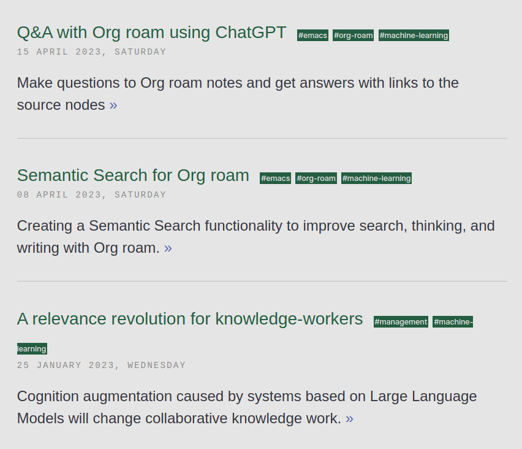

<!-- gid:20230710T064200 -->
[[TIP("이 노트에 대하여")]]
이 노트는 Luis Moneda의 시맨틱 검색, AI 어시스턴트, 구성가능한 LLM 애플리케이션 실험을 모은다. 지식노동자의 메모 환경을 검색과 대화 중심으로 재구성하려는 흐름이 읽힌다.
[[/TIP]]

<!-- provenance:source:start -->
[[TIP("원본·최신본")]]
이 페이지는 한국어 검색과 읽기를 위한 WikiDocs 미러입니다. [원본·최신본은 가든](https://notes.junghanacs.com/bib/20230710T064200/)에 있습니다. 최신 수정 내용·백링크·태그·히스토리·댓글·출처 정보는 원본 가든에서 확인하세요.

- 작성: `2023-07-10T06:42:00+09:00`
- 최근 수정: `2026-08-01T13:13:00+09:00`
[[/TIP]]
<!-- provenance:source:end -->

[TOC]

## 히스토리

-   [2026-08-01 Sat 13:13] @mitsein/claude-sonnet-5 — 관련메타·관련노트·한 줄 신설, 빈 Related-Notes 스텁을 관련노트로 대체. 서지(참고문헌)는 손대지 않음.
-   [2025-04-06 Sun] 블로그 아티클 목록 갱신 (하단 blog 섹션)
-   [2023-07-10 Mon 09:56] LangChain 조사 중 발견, 스크린샷과 함께 기록
-   [2023-07-10 Mon 06:42] 생성

## 관련메타

-   [개인지식관리](https://notes.junghanacs.com/meta/20230919T132700/) — org-roam 수천 개 노드를 실제 재사용으로 잇는 지식관리 실험가라는 축.
-   [비서 도우미 튜터 에이전트 에이전틱 챗봇](https://notes.junghanacs.com/meta/20250512T132547/) — Catalyst Assistant, 아침/저녁 루틴을 도는 개인 AI 비서 실험.

## 관련노트

-   [힣: 에이전트 생존 그리고 마이크로뷰 - 매크로뷰](https://notes.junghanacs.com/notes/20251122T210521/) — 힣이 모네다의 마이크로뷰(생업·구현력)를 자신의 매크로뷰(존재·창조)와 대비해 다시 서술한 자리.
-   [랭체인](https://notes.junghanacs.com/meta/20241026T121432/) — 모네다의 글을 계기로 시작한 랭체인 조사.

## 한 줄

> org-roam 수천 개 노드를 시맨틱 검색과 개인 AI 비서로 다시 잇는, 생업 위에 쌓은 마이크로뷰의 실험가.

Building applications with LLMs through composability

## 관련링크

### 2026 Ten years of blogging

(Moneda 2026)

Moneda, Luis 2026

Reflecting on my activity on this blog

### Luis Moneda 2024 "A messy version of an ai assistant in Emacs I’ve been iterating to find out what is useful.

(Luis Moneda 2024a)

A messy version of an ai assistant in Emacs I’ve been iterating to find out what is useful. Notes in <https://lgmoneda.github.io/> - assistant-settings.el

### Luis Moneda 2023 "A relevance revolution for knowledge-workers"

(Luis Moneda 2023a)

Cognition augmentation caused by systems based on Large Language Models will change collaborative knowledge work.

### Luis Moneda 2024 "lgmoneda/dot-emacs"

(“Lgmoneda/Dot-Emacs” 2024)

My Emacs config files

### TODO Luis Moneda 2023 "Semantic Search for Org roam"

(Luis Moneda 2023b)

Creating a Semantic Search functionality to improve search, thinking, and writing with Org roam.

### Moneda, Luis 2024 "Cognitive joy tooling #1: the Catalyst AI assistant, design review and 90-days retrospective"

(Luis Moneda 2024b)

My experience using a catalyst agent that engages me when I use Org and Org Roam

#### Cognitive joy tooling #1

### Sharing Org Roam content | lgmoneda

(Luis Moneda 2025a)

### Cognitive joy tooling #2: textual topography

(Luis Moneda 2025b) Cognitive joy tooling \\#2 Moneda, Luis Profiling a text’s characteristics using embeddings and plots 2025

### Cognitive joy tooling #3: Closing the creation-application gap of my knowledge base using auto-segmentation, colors, and semantic search

(Luis Moneda 2025c) Moneda, Luis Segmenting what I read or write to make me inspect my personal notes more often 2025

## [blog | lgmoneda](http://lgmoneda.github.io/blog/)

## 2023-07-10 Survey

[2023-07-10 Mon 09:56]

LangChain 관련 조사. 아래 lgmoneda 님의 블로그에서 엄청난 인사이트를 확인한 바 있다. 나의 투두 중에 하나이다.&nbsp;[^fn:1]

-   [랭체인](https://notes.junghanacs.com/meta/20241026T121432/)

조만간 아래 문서는 정리를 해서 올릴 예정이다.

(Luis Moneda 2023b)

-   "Semantic Search for Org roam" Luis Moneda 2023
-   Creating a Semantic Search functionality to improve search, thinking, and writing with Org roam.

몇 가지 관련 링크만 넣어둔다.

-   LangChain JS/TS Doc&nbsp;[^fn:2]
-   LangChain + Org-mode&nbsp;[^fn:3]
-   LangChain Github Clone&nbsp;[^fn:4]

[^fn:1]: <http://lgmoneda.github.io/2023/04/08/semantic-search-for-org-roam.html>
[^fn:2]: <https://js.langchain.com/docs>
[^fn:3]: <https://python.langchain.com/docs/modules/data_connection/document_loaders/integrations/org_mode>
    
    ## BIBLIOGRAPHY
    
    
- “Lgmoneda/Dot-Emacs.” 2024. [https://github.com/lgmoneda/dot-emacs](https://github.com/lgmoneda/dot-emacs).
- Luis Moneda. 2023a. “A Relevance Revolution for Knowledge-Workers.” January 25, 2023. [http://lgmoneda.github.io/2023/01/25/relevance-revolution-knowledge-work.html](http://lgmoneda.github.io/2023/01/25/relevance-revolution-knowledge-work.html).
- ———. 2023b. “Semantic Search for Org Roam.” April 8, 2023. [http://lgmoneda.github.io/2023/04/08/semantic-search-for-org-roam.html](http://lgmoneda.github.io/2023/04/08/semantic-search-for-org-roam.html).
- ———. 2024a. “A Messy Version of an Ai Assistant in Emacs I’ve Been Iterating to Find out What Is Useful. Notes in Https://Lgmoneda.Github.Io/.” 2024. [https://gist.github.com/lgmoneda/6764fd712660b9bd0eb9870f66778ee6](https://gist.github.com/lgmoneda/6764fd712660b9bd0eb9870f66778ee6).
- ———. 2024b. “Cognitive Joy Tooling #1: The Catalyst Ai Assistant, Design Review and 90-Days Retrospective.” October 19, 2024. [https://lgmoneda.github.io/2024/10/19/catalyst-assistant-90-days.html](https://lgmoneda.github.io/2024/10/19/catalyst-assistant-90-days.html).
- ———. 2025a. “Sharing Org Roam Content.” 2025. [http://lgmoneda.github.io/2025/01/11/sharing-org-roam-content.html](http://lgmoneda.github.io/2025/01/11/sharing-org-roam-content.html).
- ———. 2025b. “Cognitive Joy Tooling #2: Textual Topography.” January 4, 2025. [https://lgmoneda.github.io/2025/01/04/intro-textual-topography.html](https://lgmoneda.github.io/2025/01/04/intro-textual-topography.html).
- ———. 2025c. “Cognitive Joy Tooling #3: Closing the Creation-Application Gap of My Knowledge Base Using Auto-Segmentation, Colors, and Semantic Search.” February 9, 2025. [https://lgmoneda.github.io/2025/02/09/cognitive-joy-tooling-3-closing-the-creation-application-gap-of-my-knowledge-base-using-auto-segmentation-colors-and-semantic-search.html](https://lgmoneda.github.io/2025/02/09/cognitive-joy-tooling-3-closing-the-creation-application-gap-of-my-knowledge-base-using-auto-segmentation-colors-and-semantic-search.html).
- Moneda, Luis. 2026. “Ten Years of Blogging.” July 31, 2026. [https://lgmoneda.github.io/2026/07/31/ten-years-of-blogging.html](https://lgmoneda.github.io/2026/07/31/ten-years-of-blogging.html).
    
[^fn:4]: <https://github.com/junghan0611/langchainjs>
