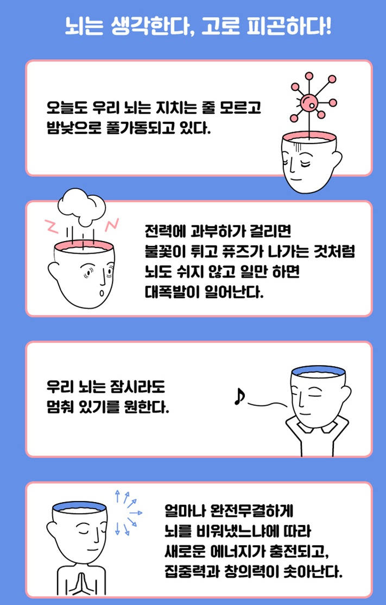

<!-- gid:20240221T085250 -->
[TOC]

[[TIP("이 노트에 대하여")]]
이 노트는 뇌를 쉬게 하는 일과 뇌를 연결하는 일을 함께 다루는 비르바우머의 연구 세계를 담는다. 감금증후군, 행복감, 자기조절, 뇌-컴퓨터 인터페이스가 인간 의식의 한계를 새롭게 비춘다.
[[/TIP]]

## 히스토리

-   [2025-05-26 Mon 10:55] (마틴 피스토리우스 2017), (장 도미니크 보비 2015)이 두 책을 잊으면 안된다.

(외르크 치틀라우 2013) 공동저자도 빠로 빼자. 뇌는 탄력적이다는 경기사이버도서관에 있네.

-   [2024-02-21 Wed 08:52] [박문호 자연과학세상](https://wikidocs.net/382260) 덕분에 알게 된 책. 놀랍도록 흥미롭다.

## Related-Notes

-   [외르크치틀라우 너드 뇌과학](https://wikidocs.net/382343)
-   [힣: 포춘쿠키 삶과죽음 삶으로서일 도서목록](https://wikidocs.net/381411)

## BIBLIOGRAPHY

- 외르크 치틀라우. 2013. <i>너드 - 아웃사이더</i>. Translated by 유영미. [https://m.yes24.com/goods/detail/11343734](https://m.yes24.com/goods/detail/11343734).
- 마틴 피스토리우스. 2017. <i>엄마는 내가 죽었으면 좋겠다고 말했다</i>. Translated by 이유진. [http://www.yes24.com/Product/Goods/36928226](http://www.yes24.com/Product/Goods/36928226).
- 장 도미니크 보비. 2015. <i>잠수종과 나비</i>. [http://www.yes24.com/Product/Goods/20310773](http://www.yes24.com/Product/Goods/20310773).
- 닐스 비르바우머, and 외르크 치틀라우. 2015. <i>뇌는 탄력적이다 - 뇌과학</i>. Translated by 오공훈. [https://m.yes24.com/goods/detail/17970884](https://m.yes24.com/goods/detail/17970884).
- ———. 2018. <i>머리를 비우는 뇌과학</i>. [https://www.yes24.com/Product/Goods/67217345](https://www.yes24.com/Product/Goods/67217345).

## 머리를 비우는 뇌과학

(닐스 비르바우머 and 외르크 치틀라우 2018)

-   "머리를 비우는 뇌과학" 닐스 비르바우머 and 외르크 치틀라우 2018
-   매년 노벨상 후보로 거론되는 세계 최고의 뇌과학자가 말하는이제껏 뇌과학이 말하지 않은 뇌 비우기의 비밀우리 뇌는 왜 텅 빈 상태를 원하는가?이제껏 뇌과학이 말하지 않은 뇌 비우기의 비밀우리가 인간의 두뇌에 대해 논하거나, 전문가들이 연구하는 뇌과학 이야기를 듣...
-   Empty Brain -- Happy Brain: How Thinking Is Overrated

### 책소개

매년 노벨상 후보로 거론되는 세계 최고의 뇌과학자가 말하는 이제껏 뇌과학이 말하지 않은 뇌 비우기의 비밀

우리 뇌는 왜 텅 빈 상태를 원하는가? 이제껏 뇌과학이 말하지 않은 뇌 비우기의 비밀

우리가 인간의 두뇌에 대해 논하거나, 전문가들이 연구하는 뇌과학 이야기를 듣다 보면 가장 많이 언급되는 부분은 당연히 '무궁무진한 뇌의 능력'이다. 머리를 굴릴수록 잠재된 플러스 알파까지 끄집어낼 수 있다거나, 뇌가 알고 보면 엄청나게 유연하고 가소성 있는 기관임을 강조한다. 회복 탄력성이라는 놀라운 복원력 또한 빼놓을 수 없다. 하지만 독일의 대표적인 뇌과학자이자 이 책의 저자인 닐스 비르바우머는 전혀 다른 관점으로 인간의 두뇌를 이야기한다. 바로 "우리 뇌는 텅 빈 상태를 원하고 있다"는 주장이다. 이 책에서 끊임없이 이야기하는 '텅 빈 상태'나 '텅 빈 뇌'라는 말은 단순히 복잡한 머리를 식히는 휴식의 개념이 아니다. 수 초간 혹은 수 시간 동안이라도 사고와 감각이 멈춰서는 '무(無)'의 상태를 접하는 일을 말한다. 이는 마치 전력에 과부하가 걸려 불꽃이 튀고 퓨즈가 나갔을 때 일단 두꺼비집부터 내리는 행위를 비유로 들 수도 있겠다. 이때 두꺼비집을 내리는 행위가 바로 뇌를 텅 비우는 시도와 연결된다. 책의 일부 내용을 미리 읽어보실 수 있습니다. 미리보기

#### 뇌는 생각한다, 고로 피곤하다!

### 책 속으로

자연은 이 뇌 영역을 지칠 줄 모르고 밤낮으로 일하는 생각 펌프로 창조했다. 대뇌피질을 이렇게 활동하도록 내버려둔다면 대뇌피질의 뉴런은 사방에서 전하를 계속 생성할 것이고 결국 전하는 너무나 많아질 것이다. 그렇게 되면 단순히 발작 수준을 뛰어넘는, 아주 강력하고 당사자를 압도하는 대폭발이 일어나게 될 것이다. (중략) 이런 상황에 이르지 않으려면 두꺼비집이 설치되어야 한다. 두꺼비집 역할을 하는 것은 시상과 여기에 속한 신경전달물질 및 뉴런이다. \_본문 83쪽 중에서

많은 사람은 텅 빈 상태에서 어떤 방식으로든 이득을 얻는다고 증언한다. 어떤 이는 텅 빈 상태를 느낀 뒤에 "연료가 가득 채워진 듯한" 느낌이 든다고 밝힌다. 또 어떤 이는 텅 빈 상태로부터 창의적인 충동과 새로운 관점을 얻는다고 말한다. 아울러 명상을 하면 이와 비슷한 방향의 이득을 얻는다는 연구 결과도 있다. (중략) 텅 빈 상태는 긍정적인 효과와 연관이 있다는 견해는 사실이므로 당연히 보상중추에서 활성화가 강하게 일어날 수 있다. 텅 빈 상태를 추구할 가치가 있는 것으로 여기고 긍정적인 차원의 텅 빈 상태를 만들어내려 노력해도 괜찮을 것이다. \_본문 113쪽 중에서

환자들은 감금 상태의 단계가 심각할수록 삶의 질을 묻는 질문에 긍정적으로 반응하는 경우가 아주 많았다. 다름 아닌, 온몸이 감금 상태에 빠져 더 이상 아무것도 변하지 않는다는 것을 알고 있는 환자들이 그런 반응을 보이는 것이었다. 그들은 유난히 삶에 강하게 집착하는 것으로 보였다. \_본문 284쪽 중에서

이 책은 단순히 이론을 소개하는 과학서 범주에 머무르지 않고 독자에게 고통과 번민이 덜한 삶을 살 수 있는 방법도 구체적으로 제시한다. 이 또한 『머리를 비우는 뇌과학』이 지닌 독창적인 요소 중 하나다. "도대체 텅 빈 상태에 대해 책을 쓸 수 있는 것이 가능한가? 닐스 비르바우머와 외르크 치틀라우는 이렇게 쉽게 상상이 잘 가지 않는 작업을 거뜬히 해냈다"는 독일 아마존 어느 서평자의 격찬은 바로 내가 이 책을 읽고 느낀 소감이기도 하다. \_'옮긴이의 말' 중에서 --- 본문 중에서

### 목차

-   머리말 | 낙하산을 타고 텅 빈 상태로 뛰어들다
-   1장 무언가 항상 움직여야 한다 : 왜 인간은 텅 빈 상태를 삶에서 몰아냈을까?
-   2장 마침내 자유로워지다 : 철학자들, 텅 빈 상태를 성찰한 선구자
-   3장 긍정적인 자극을 찾아서 : 텅 빈 상태에서의 뇌파
-   4장 방어체계에서 빠져나오다 : 생각을 비우게 하는 뇌의 영역
-   5장 디폴트 모드 네트워크 : 자동 조종 장치를 켠 뇌
-   6장 무의미가 행복이다 : 아무 일도 일어나지 않는다면 우리는 어떻게 될까?
-   7장 텅 빈 상태에 이르려면 어떻게 훈련할까? : 섬엽의 활성화, 그리고 선 명상
-   8장 무아지경을 향한 욕망 : 섹스, 종교, 뇌전증의 공통점
-   9장 리듬 혹은 그루브의 미학 : 음악은 우리를 어떻게 이끌까
-   10장 텅 빈 상태라는 질병 : 그리고 이 질병을 어떻게 다루어야 할까
-   11장 잘못된 몸에 깃든 올바른 삶 : 감금증후군 환자의 행복
-   맺음말 | 텅 빈 상태는 삶의 처음이자 끝이다
-   옮긴이의 말 | '텅 빔'을 향한 도발적인 뇌과학서

### 출판사 리뷰

다소 애매하게 여겨지는 '뇌를 비우다'라는 표현은, 이 책의 저자가 카운슬러나 심리학자가 아닌 뇌과학자라는 점을 떠올린다면 단순한 '쉼'을 이야기하는 것이 아님을 알 수 있다. 뉴런이 활성화되면 특정한 뇌파 패턴이 형성되는데, 이때 8~12헤르츠의 알파파(정상적인 성인이 긴장을 풀고 쉬는 상태에서 활성화되는 뇌파의 하나)가 발생하면서 텅 빈 상태의 최적지에 도달할 수 있다. 이를테면 피곤한 상태에서 머릿속으로 따뜻한 욕조에 몸을 담그고 누워 있을 때를 떠올리면 알파파가 방출되는 것과 같다. 물론 알파파가 발생할 때만 텅 빈 상태가 되는 것은 아니다. 선불교에서 '공(空)의 상태에 이르는 훈련'이라 일컫는 깊은 명상의 수준에 이를 때에는 30~100헤르츠의 감마파(극도로 긴장하거나 복잡한 정신 활동을 수행할 때 활성화되는 뇌파의 하나)가 발생한다. 그렇기에 뇌파가 느려야만 텅 빈 상태에 이른다고 생각해서는 안 된다. 사실 이 책의 저자도 고백하기를, '텅 빈 상태'에 대해서는 한마디로 정의내릴 수 없다고 한다. 두 저자 역시 텅 빈 뇌의 상태를 정의내리기 위해 수많은 토의를 거치면서 서로의 생각과 새로운 시각을 발견할 수는 있었지만, '이것이다'라는 정의까지는 내리지 못했다. 다만 분명한 것은, 욕조에 몸을 담근 최적의 휴식이나 수면을 통해 '텅 빈 상태'를 만날 수도 있지만, 명상이나 섹스, 스카이다이빙 같은 스포츠나 특정한 리듬이 만들어내는 재즈연주 등 흔히 말하는 무아지경의 상태에서도 일순간 '텅 빔'을 경험할 수 있다고 한다. 그리고 그 텅 비우기의 경험은 인간에게 생각보다 무해하지 않고, 오히려 휴식과 치유, 창의력과 에너지를 주는 결과로 이어질 수 있음을 여러 실험과 데이터를 통해 증명하고 있다.

멍 때리기 혹은 몰입과 자극으로 텅 빈 상태를 만날 수 있다?

할리우드 배우 제프 브리지스, 비틀스의 존 레논, 육상선수 칼 루이스 등 이들에게는 공통된 휴식 방법이 있었다. '부유탱크'가 그것이다. 사람 한 명이 몸을 누이면 꽉 들어찰 만한 견과류 모양의 탱크인데, 이 탱크에 사해(死海)처럼 사람이 떠 있을 수 있을 농도의 소금물을 체온과 비슷한 수온으로 채워 넣고 그 안에 사람이 들어가 둥둥 떠 있게 하는 것이다. 일단 이곳에 들어가면 청각, 시각, 촉각 외에도 자기 몸에 대한 고유 감각이 줄어들어 기분이 꽤 좋아지거나 긴장이 풀리는 것을 온몸으로 느끼게 된다. 실제 테스트에 참여한 사람들은 '감각이 풀어진' 상태에서 새롭고 창의적인 아이디어가 떠올랐다고 보고했다. 연구진은 명상을 할 때도 이와 비슷한 현상을 관찰할 수 있었다. 이렇듯 텅 빈 상태가 되면 뇌파의 바다에서 절대적이고 무관심한, 즉 집중력이라는 바위가 불쑥 튀어나온다. 뇌에서 약한 고주파의 집중력을 향상시키는 뇌파가 불쑥 튀어나오는 것이다. 우리가 '멍 때리기'라는 다소 희화적인 표현으로 '아무 생각 없음'을 표현하고 있지만, 실제로 이 멍 때리기의 시간을 얼마나 완전무결하게 뇌 비우기의 시간으로 활용하느냐에 따라 참된 휴식과 에너지 충전의 기회로 삼을 수 있다는 얘기다. 그런가 하면 저자는 특히 '텅 빈 상태'를 만들기 위한 또 하나의 종류로 몰입과 자극을 강조한다. 인간의 일상 가운데 무아지경이라는 말로 표현할 수 있는 순간들에 무엇이 있을까 생각해보라. 절정을 체험하는 섹스, 수많은 군인들이 한 치의 흐트러짐 없이 발맞추어 걷는 동보(同步) 행진, 단순한 멜로디라도 리듬과 비트가 강한 재즈나 록 음악을 듣는 일 등 몰입 혹은 자극의 순간이 오면 뉴런이 저주파 알파파나 세타파 패턴으로 발사된다. 이 패턴은 긴장이 풀린 각성 상태나 잠들기 직전의 몽롱한 단계에서 나타나는 패턴이기도 하다.

『머리를 비우는 뇌과학』은 뇌가 텅 빈 상태를 필요로 하는 이유는 물론, 텅 빈 상태에 이르는 메커니즘을 상세히 설명한다. 하지만 위에 적은 일상에서의 체험뿐만 아니라 저자는 더욱 급진적인 상황까지 이 주제에 대입시킨다. 바로 텅 빈 상태라는 질병이라 이름 붙일 수 있는, 다름 아닌 뇌전증(간질), 우울증, 루게릭병, 치매 등이 그것이다. 저자는 당연히 치명적으로 인식되는 이들 질환이 사실은 생각만큼 극단의 좌절을 겪을 병이 아니라고 한다. 이러한 질환을 앓는 환자는 결국 자아를 망각하고 텅 빈 상태에 이르는데, 이 상태가 전혀 두렵거나 괴롭지 않으며 오히려 평온과 고요를 느낄 수 있다는 것이다. 일견 거센 반박과 비난을 받을 수 있는 이러한 주장에 대해 뇌과학자인 저자는 실제 감금증후군 환자(루게릭병으로 인한 전신마비 환자)의 뇌에 측정 칩을 장착했다. 그러고는 그에게서 평온과 행복감이 들 때 방출되는 뇌파와 전류의 변화를 발견하며 이 사실을 증명해냈다.

이 실험을 통해 저자는 감금증후군 환자들이 기쁘고 즐거워하는 상태에서 뇌 속의 연상회가 강하게 활성화되는 것을 확인했다. 이 연상회가 활성화되면 봉쇄 신호를 편도체와 다른 방어체계 부위에 보내게 되는데, 이때 방어체계가 차단되는 과정은 긍정적인 텅 빈 상태를 체험하기 위한 바탕이 된다. 마비환자가 텅 빈 상태에 도달하여 평온을 찾는다는 저자의 급진적인 주장이 과학적으로 증명된 셈이다. 이는 오히려 건강한 사람들이 일상에서 이러한 텅 빈 상태에 도달하는 것이 더 힘들다는 이론으로 바꿀 수 있다. 건강한 사람들에게는 주변 사물이 대개 부정적인 의미로 다가오는 경우가 많아 텅 빈 상태와 같은 무의미한 경지에 다다르기가 어렵다. 그렇기에 최소한 이따금씩이라도 '텅 빔'을 체험하기 위한 시도들, 가령 스포츠나 섹스, 음악, 명상, 부유탱크, 그 밖에 여러 가지 '비우는 기술'을 끌어다 이용해야 한다. 감금증후군 환자들은 이 모든 것을 뛰어넘은 '텅 빈 기술'을 굳이 추구하지 않아도 만날 수밖에 없는 사람들이다. 더 중요한 사실은, 이들이 이러한 텅 빈 상태를 행복하게 여긴다는 점이다.

너무 과대평가된 뇌의 능력, 하지만 뇌는 잠시라도 멈춰 있길 원한다

이 책의 독일어판 원서 제목은 『뇌는 과대평가되었다(Denken wird uberschatzt)』이다. 뇌의 영역과 구조, 여러 기관의 고유 기능, 뇌파와 호르몬의 메커니즘을 설명하는 부분을 읽다 보면 저명한 이 뇌과학자가 일반 독자들이 읽는 과학 교양서에 이토록 전문적인 설명을 애써 곁들인 이유가 무얼까 되짚어보게 된다. 그 이유는 이 책의 원서 제목처럼 그동안 우리가 뇌의 역할과 기능에 대해 너무나 과대평가해왔으며, 기대 이상의 잠재력을 요구하는 우를 범했기 때문이다. 단순히 "생각을 비워라"라는 조언이 아니라, 뇌와 정신의 정확한 메커니즘을 알려줌으로써(혹은 증명함으로써) 뇌의 기능을 과신하지 말라는 저자의 간절한 주문이다. 뇌 또한 인체의 한 부분이기에 장시간 전류를 차단한 채 로그아웃 되어 있는 시간이 절실하다. 또는 무력해지고 손상된 근육을 물리치료 받는 것처럼, 자극과 몰입의 뇌파를 만듦으로써 에너지를 재충전하는 것 또한 필요하다. 이 책에서 언급하는 '텅 빈 뇌'는 바로 그 지점을 말하고 있다. 『머리를 비우는 뇌과학』이 다루는 분야는 과학만이 아니다. 뇌과학은 물론 철학, 종교, 심리학을 종횡무진 넘나든다. 과학과 인문학이 이상적으로 결합되어, 인간의 두뇌에 대한 '통섭'의 시각으로 텅 빈 뇌에 대해 다룰 수 있는 모든 면을 두루 거론한다. 세계적인 뇌과학자 닐스 비르바우머와 과학저술가인 외르크 치틀라우, 이 두 저자는 전작인 『뇌는 탄력적이다』라는 책도 함께 저술하여 뇌과학을 더욱 종합적인 사고로 다룰 수 있는 내공을 증명하였다. 뇌의 가소성과 복원력 등 우리 뇌가 어디까지 진화하며 능력을 발휘할 수 있을까에 초점을 맞춘 전작과 달리, 이 책 『머리를 비우는 뇌과학』은 원제대로 '생각은 과대평가'되었으며, 텅 빈 상태야말로 인간의 삶의 기원이자 마지막이라는 점을 적극 강조한다.

뇌를 비운다는 개념과 표현은 정통 뇌과학에서 그간 잘 다뤄오지 않은 문제다. 그리고 앞서 말했듯 저자들 자신조차도 텅 빈 뇌에 대한 정확한 정의를 내리지 못했다. 다만 생각하고 감각으로 느끼는 평상시의 의식에서 벗어난 백지 상태, 혹은 극한의 몰입과 자극의 상태를 '텅 빈 뇌'의 도착점으로 보고 있다. 이렇게 추상적이면서 난해하기까지 한 주제를 저자들은 방대하고 정교한 실험 데이터를 통해 구체적으로 입증하면서 설득력을 얻는다. 그리고 그 끝에는 삶과 죽음이 언급된다. 철학자 쇼펜하우어는 삶과 죽음이 공통된 것이라 믿어 의심치 않았다. 출생은 무에서 나오고 죽음은 무로 돌아간다는 것, 그러므로 죽음을 두려워하는 것은 어리석다고 했다. 죽음에 임박했다가 기적적으로 다시 살아난 여러 사람의 증언에 따르면, 심장이 멈춘 순간 평화와 쾌적함에 사로잡혔고 더 나아가 극도의 행복을 느꼈다고 한다. 저자가 이 책의 맺음말에서 내는 결론 또한 마찬가지다. 텅 빈 상태의 완전무결한 마무리인 죽음을 두려워할 필요가 없다는 것. "텅 빈 상태의 긍정성을 생각하면 죽음을 두려워할 필요가 없다"는 이 말은, 우리의 삶 또한 고통과 번민에 사로잡혀 보낼 필요가 없다는 말의 연장선이기도 하다. 만만치 않은 철학과 전문적인 뇌과학 이론이 수시로 등장하기에 독자들은 계속 머리를 굴리며 이 책을 읽을 수밖에 없을 것이다. 하지만 이 책을 다 읽고 나면 누구나 '그래, 생각에 집착하지 말자. 때로는 마음을 비우고 머리를 비우며 현실적인 고통에서 떠나보는 연습을 하자'라는 마음을 먹게 될 것이고, 그것이 바로 저자가 원하는 결론이다. 이 책의 부제처럼 너무 많은 생각이 우리를 망가뜨리기 때문이다.

## 뇌는 탄력적이다 - 뇌과학

(닐스 비르바우머 and 외르크 치틀라우 2015)

-   닐스 비르바우머 and 외르크 치틀라우 오공훈 2015
-   《뇌는 탄력적이다》는 세계 최고의 뇌-컴퓨터 인터페이스 권위자인 닐스 비르바우머가 실제 임상실험을 하며 얻은 흥미롭고 공신력 있는 뇌과학 지식이 담긴 책이다. 지금까지 출간된 뇌과학 책은 기억력 향상을 위한 자기계발이나 뇌와 인간의 존재를 다루는 인문학 책이 ...
-   당신이 똑똑해지기 위해 알아야 할 뇌과학의 모든 것

### 책소개

《뇌는 탄력적이다》는 세계 최고의 뇌-컴퓨터 인터페이스 권위자인 닐스 비르바우머가 실제 임상실험을 하며 얻은 흥미롭고 공신력 있는 뇌과학 지식이 담긴 책이다. 지금까지 출간된 뇌과학 책은 기억력 향상을 위한 자기계발이나 뇌와 인간의 존재를 다루는 인문학 책이 주류였다. 이에 반해 《뇌는 탄력적이다》는 우리가 주체가 되어 뇌를 조절하여 원하는 효과를 얻는 방법을 소개한다. 천재들과 일반인 그리고 뇌질환자의 뇌에서 혈류량, 뇌파, 뇌 온도 데이터를 얻은 후 행동과 사고를 조절하여 인지능력과 자가 치유력을 인위적으로 향상시키는 방법을 찾아낸 것이다.

### 서문 - 우리 뇌는 어디까지 변화할 수 있을까?

### 1장 이기적인 뇌

-   기대와 보상으로 똑똑한 뇌 만들기

### 2장 인간 진화의 예기치 않은 행운

-   끝없는 뇌가소성

### 3장 뇌의 가장 극적인 고백

-   감금증후군 환자가 커밍아웃을 하다

### 4장 병원 침대에서 스키와 축구를 즐기는 방법

-뇌-컴퓨터 인터페이스로 세상과 소통하다

### 5장 오른쪽 뇌가 없으면 왼쪽 뇌로 산다

-   죽은 동료의 임무를 이어받는 뇌세포들

### 6장 아우토반에서 광란의 질주로 트라우마 치료하기

-   약 안 먹고 강박증과 우울증 치료하는 법

### 7장 사이코패스는 사이보그가 아니다

-   뇌에게 불안과 공포를 가르치기

### 8장 인류의 숙원, 치매를 정복하라

-   해마를 살찌우는 노인들

### NEXT 9장 자신의 뇌를 조종하는 아이들

-   성장을 방해하는 ADHD 치료제, 언제까지 먹일 것인가?

### NEXT 10장 우리 모두 천재(서번트)가 될 수 있다

-   무의식에서 놓치는 정보를 의식적으로 흡수하기

### 11장 뇌는 중독을 원한다

-   게임, 포르노, 담배, 알코올의 유혹을 어떻게 뿌리칠 것인가

### 책 속으로

뇌라는 기관을 '생각 펌프'라고 묘사했다. 마치 뇌를 기계로 묘사한 것처럼 들리겠지만 이만큼 뇌를 잘 설명하는 놀라운 표현은 없을 것이다. 사실 뇌는 뭔가를 '수 송'하는 역할을 할 뿐이지만 다른 한편으로는 별도의 펌프를 필요로 하지 않으며, 이 때문에 절대 자기 정체를 표면적으로 드러내지 않기 때문이다. 독자들이 이 책을 읽고 '생각 펌프'가 활기를 띨 정도로 자극을 받는 것, 그리고 이런저런 놀라운 일을 표면으로 길어 올리는 데 성공하기를 빈다. -서문 (p.17)

일본 군마대학교 나리타 코스케成田 耕祐교수가 이끄는 연구팀은 유년기를 '지나친 부성애'와 '지나친 모성애' 속에서 자란 사람들은 전전두엽 피질에 있는 회색 뇌 구성 물질이 혼자 놀이터에서 뛰놀던 피실험자들보다 뚜렷하게 적었다. 부모의 과잉보호는 쥐의 뇌 성장을 저해한 텅 빈 우리처럼 자녀의 뇌 발달에 역효과를 초래한다는 것이 사실로 밝혀진 것이다. -2장 (p.56)

슈투트가르트에서 판사로 봉직하며 신뢰 받은 인물인 한스 페터는 8년 동안 한스-페터는 생을 유지했을 뿐만 아니라 기쁜 마음으로 삶에 참여했다. 이 시기에 그가 특히 애정을 품고 열의를 보였던 활동은 텔레비전에서 축구 경기 및 스키 활강 경주를 시청하는 것이었다. 그는 예전에는 이 스포츠를 직접 즐겼다. 우리는 사지가 완전히 마비된 사람들은 이제 다시는 움직일 수 없기 때문에 뇌에서 운동 패턴이 사라져 스포츠에 대한 관심이 고갈될 게 틀림없다고 여겼다. 그럼에도 불구하고 이 슈투트가르트 출신 판사는 스포츠 종목에 대한 애정을 충실하게 유지했다. 3장 (p.121)

행동치료가 행해진 초창기에는 사이코패스를 다루기 위해 전기 충격을 활용했다. 예를 들어 사이코패스 성범죄자에게 여러 포르노 영화를 보여준다. 피실험자가 폭력 장면이 나올 때 발기의 징후가 나타나면 측정기가 성기에 닿으며, 이때 측정기가 보낸 신호는 컴퓨터에 전달된다. 피실험자는 즉시 심한 감전을 당하게 된다. 장면을 주시할 때 드는 욕망을 제어하고 동시에 뇌에 부정적인 느낌을 강렬하게 보내기에는 충분하다. 이와 반대로 폭력 성향이 전혀 없는 포르노 영화를 욕망으로 가득 찬 상태에서 주시하는 경우에는 감전 처벌을 받지 않으며, 심지어 때로는 보상을 받는다. 전기 충격으로 치료하는 방법은 상당한 성공을 거두었다. 7장 (p.203)

뉴로피드백은 주의력 결핍 과잉행동 장애ADHD를 위해 활용 가능하다. 발광 다이오드가 달린 두건은 수영 모자처럼 가볍기 때문에 아이들은 두건을 쓰고 여기저기 돌아다니며 뇌 혈류를 발생시키는 법을 익히게 된다. 그리고 이 뇌 혈류는 행동을 억제하는 작용을 한다. 주의력 결핍 장애 아동 대부분은 잠시도 몸을 가만 두지 못한다. 그 이유는 현재 상황을 잘 처리하지 못하고, 이때 느낀 좌절감을 충동적인 공격 행동으로 발산하기 때문이다. 그래서 아이들에게 과잉행동은 일차적인 증상이 아니라 주의력 결핍의 결과로 나타나는 현상이다. 그리고 바로 이 증상에 뇌파 측정과 뉴로피드백이 커다란 도움이 된다. -9장 (p.259)

이 실험을 프로이트가 봤다면 '무의식을 의식하는 과정이 어떻게 수백 시간의 정신분석 치료가 아닌, 한 시간짜리 뉴로피드백 치료 두 번으로 가능하다는 말인가?' 하고 의아해할지도 모른다. 김산정이 진행한 연구에서 트레이닝하는 시간이 그리 오래 걸리지 않았기 때문이다. 이 밖에도 그녀의 실험에서 인간이 무의식 중에 무의식을 조절하고 통제하는 법을 배울 수 있다는 점이 밝혀지기도 했다. 실험 참가자 누구도 자신이 어떻게 뇌 의식 체계의 혈류에 영향을 끼쳤는지 자신 있게 진술하지 못했다. 그럼에도 불구하고 서번트 효과는 분명히 발생했다. 즉 누구나 서번트증후군을 발생시킬 수 있다는 것은 상상 속에서나 가능한 일이 결코 아닌 것이다. -10장 (p.281)

"생명 유지 장치 스위치를 꺼달라"는 외침, "어느 시점에 이르면 자기 스스로 정한 이별"을 실행해달라고 요구하는 외침, 의지를 품고 서명했던 환자가 자기 생명 처분권을 이행할 수 있도록 해달라는 외침은 다만 상상력이 부족한 표현일 뿐이다. 심각한 부상을 입고 온몸이 완전히 감금 상태에 있는 사람들이 자신은 여전히 행복하다고 여길 가능성을 확실하게 배제할 수 없기 때문이다. 오히려 정반대로 환자 상당수는 자신이 행복하다고 말한다. 뇌는 모든 것을 할 수 있으며, 또한 아무것도 하지 않을 수 있기 때문이다 -11장 (p.312) \_\__본문 중에서 펼쳐보기 출판사 리뷰 세계적인 뇌-컴퓨터 인터페이스 전문가 닐스 비르바우머가 밝혀낸 뇌의 무한한 가능성!

《뇌는 탄력적이다》는 세계 최고의 뇌-컴퓨터 인터페이스 권위자인 닐스 비르바우머가 실제 임상실험을 하며 얻은 흥미롭고 공신력 있는 뇌과학 지식이 담긴 책이다. 지금까지 출간된 뇌과학 책은 기억력 향상을 위한 자기계발이나 뇌와 인간의 존재를 다루는 인문학 책이 주류였다. 이에 반해 《뇌는 탄력적이다》는 우리가 주체가 되어 뇌를 조절하여 원하는 효과를 얻는 방법을 소개한다. 천재들과 일반인 그리고 뇌질환자의 뇌에서 혈류량, 뇌파, 뇌 온도 데이터를 얻은 후 행동과 사고를 조절하여 인지능력과 자가 치유력을 인위적으로 향상시키는 방법을 찾아낸 것이다.

약물 치료로 뇌질환을 완벽히 치료한다거나 인간은 평생 뇌를 10%밖에 활용하지 못한다는 잘못된 뇌과학 상식이 퍼져 있다. 저자는 이를 실제 임상실험을 통해 거짓으로 밝혀내었다. 명상이나 뉴로피드백 치료를 통해 평소 뇌 활용도를 올리는 것을 비롯해 ADHD 아동이나 뇌졸중, 치매 환자의 증상도 예방하고 치료하는 데 성공했다. 특히 서번트 증후군(천재 증후군)을 인위적으로 발생시킨 임상실험은 저명한 과학잡지 〈네이처Nature〉에 실릴 정도로 큰 유명세를 탔다.

최신 뇌과학의 놀라운 사실이 담겨 있는 이 책은 출간 즉시 독일 베스트셀러가 되었으며 유럽의 공신력 있는 과학자와 과학매체 전문가들에게서 "흥미로운 임상 실험을 통해 뇌과학의 혁신을 이루는 데 성공했다"는 평과 함께 '오스트리아 2015 올해의 과학책'에 선정되었다.

흥미로운 뇌과학 실험들

1.  아우토반에서의 광란의 질주로 공포증 극복하기

보석상 홀스트는 교통사고에 관한 한, 세상에서 가장 불행한 사람이다. 그는 불과 몇 년 사이에 고속도로 교통사고를 다섯 번이나 당했고, 다섯 번째 사고를 당한 날 투신자살을 시도했다. 다행히 목숨을 건졌지만 그는 두 번 다시 운전대를 잡지 않으려 했다.

저자는 정신 치료와 항우울제, 아편제도 듣지 않는 홀스트를 대면 치료 방식으로 치료하기로 했다. 운전 공포증을 치료하기 위해 그를 자신의 차에 태운 후 아우토반에서 광란의 질주를 한 것이다. 저자는 무모한 추월을 계속하며 무법자처럼 달렸다. 홀스트는 조수석에서 대소변을 싸고 몇 번이고 구토를 했다. 저자는 이 과정을 서른 번 반복하면서 홀스트의 뇌에 '사고는 일어나지 않는다'는 메시지를 각인시켰다. 홀스트는 자동차를 타도 '안전하다'는 사실을 깨달았다.

홀스트는 다시 운전대를 잡을 수 있었고 치료는 성공했다. 남은 것은 중고차시장에서 상품 가치를 상실한 저자의 메르세데스 벤츠뿐이었다.

1.  흡연자의 뇌에 흐르는 도파민 폭포를 확인하다

흡연자라면 담배를 입에 물고 있는데도 빈 담배갑을 보며 급히 편의점을 달려가는 자신을 발견할 때가 있을 것이다. 이 행동은 언뜻 '이따 다시 사러 가기 귀찮으니까'라고 해명할 수 있지만, 사실은 전형적인 중변연 도파민 시스템의 작동에 따른 것이다.

중독의 근원은 '곧 기쁘고 즐거울 것이다'라는 예상에 있다. 자극을 받은 중변연 도파민 시스템은 어떤 행동을 하고 싶은 충동을 불러일으킨다. 이는 흡연자의 예에서 명확히 발견할 수 있다. 흡연자의 뇌는 흡연을 하기 직전에 도파민 수치가 최고조에 이른다. 만약 담배를 못 피울 경우에는 도파민 수치가 더 오른다. 담배를 입에 물고 불을 붙이면 오히려 도파민 수치가 떨어진다. 이것이 바로 담배를 입에 문 흡연자가 빈 담배갑을 보며 안절부절 못하는 이유다.

1.  런던 택시운전사들의 비대해진 뇌

런던 유니버시티 칼리지의 엘리노어 맥과이어와 캐서린 울레트 연구팀은 런던 택시운전사들의 해마가 다른 일반인에 비해 훨씬 비대하다는 사실을 밝혀냈다. 연구팀은 런던 택시 운전면허를 취득하기 위해 4년간 교육 과정에 등록한 79명의 뇌를 MRI 스캔했다. 79명의 해마 크기는 거의 비슷했다. 4년이 흘러 교육과 자격 시험이 끝난 후 합격자 39명의 뇌와 불합격자 40명의 뇌를 대조해봤다.

성공적으로 교육 과정을 마친 참가자들만이 해마 크기가 뚜렷하게 증가했다. 이 밖에도 합격자들은 공간 방향 감각과 인지 능력을 측정하는 테스트에서도 훨씬 좋은 결과를 얻었다. 이는 그들의 뇌가 임의로 변화한 것이 아니라 기능 면에서 개선되었다는 사실을 뜻한다. 이 실험은 뇌의 가소성을 증명했다는 데 큰 의의가 있다.

세계 최초로 밝혀진 뇌과학 사실들

닐스 비르바우머 연구팀은 '뇌-컴퓨터 인터페이스' 기술을 이용한 임상실험에서 1/1000 초 단위의 사진 인식 실험이나 뇌의 충격파를 알파벳 문자로 바꾸는 실험을 진행했다. 저자는 뇌에 직접 전극을 연결하거나 기능성 자기공명 촬영(fMRI) 등 최신 뇌-컴퓨터 인터페이스 기술을 활용함으로써 자신의 가설을 과학적 사실로 증명하기도 했다.

1.  한국인 김산정 연구원이 서번트 증후군(천재 증후군)을 인위적으로 발생시키다.

서번트 증후군이란 자폐증이나 지적장애를 가진 이들 가운데 일부가 경이로운 완전기억능력을 보이는 경우를 뜻한다. '자폐적 석학autistic savant'이라고도 불리며, 독자들에게는 영화 《레인맨》에서 더스티 호프맨이 이 증후군 환자를 연기한 것으로 유명하다.

닐스 비르바우머는 서번트 증후군을 인위적으로 일으키기 위한 열쇠를 뇌 영역의 혈류에서 찾았다. 연구팀은 건강한 일반인에게 뉴로피드백neurofeedback을 이용해 뇌 트레이닝을 실시했다. 영역의 혈류를 강화시켰고 뉴런 시스템도 더욱 활성화되어 인식 능력이 개선되었다. 이 실험은 놀랍게도 저자와 같은 연구팀인 한국인 뇌과학자 김산정 연구원이 주도했다.

실험은 뉴로피드백으로 뇌 영역의 혈류를 강화한 피험자는 순간적으로 나타났다 사라지는 사진의 얼굴 표정을 기억하는 방식으로 진행되었다. 결과는 놀라웠다. 평소에는 절대 인식하지 못했던 0.015초 ~0.03초 사이의 얼굴 표정을 파악하게 되었다. 0.015초~0.03초는 전의식의 영역으로서 볼 수는 있지만 뇌에 '저장'할 수 있는 시간보다 짧은 시간이었다.

이 실험의 의의는 정보를 여과하지 않고 그대로 받아들여 저장하는 서번트 증후군 환자처럼, 피험자들도 세계 최초로 무의식의 영역에 들어온 정보를 의식의 영역에 저장하는 것이 가능했던 것이다.

1.  세계 최초로 감금증후군 환자와 직접 의사소통을 하다.

한스 페터(hans peter)는 눈조차 깜빡이지 못하는 감금증후군(전신 마비) 환자다. 닐스 비르바우머 의료팀은 피터 한스 페터와 뇌-컴퓨터 인터페이스로 직접 의사소통하는 데 성공했다. 이는 세계 최초로 뇌와 인간이 직접 대화를 한 사례다.

한스 페터의 눈은 정상이었기 때문에 모니터에 표시되는 알파벳을 보고 뇌 전위를 느리게 하여 특정 문자를 선택하는 방식으로 또한 전신마비 환자들은 스포츠에 대한 관심이 사라진다는 예상을 깨고 한스 페터는 축구와 스키 중계 프로그램을 매우 즐겨 시청했다. 한스 페터는 뇌-컴퓨터 인터페이스를 자유자재로 활용했으며 저자에게 '파티 초대 편지'까지 보냈다. 한스 페터는 파티를 주관했으며 저자는 깔때기가 장착된 장치을 통해 그의 내장으로 이어진 관에 와인 한 잔을 채워주었다. 한스 페터는 8년 동안 생존했으며 의료진은 때때로 그의 얼굴에서 행복한 표정을 발견하곤 했다고 한다.

1.  컴퓨터 게임 같은 프로그램으로 ADHD를 치료하다.

여덟 살의 막시밀리안은 지능이 높지만 주의력 테스트에서 낙제를 받았다. 막시밀리안의 부모는 성장장애 부작용이 있는 리탈린을 먹이는 대신 뉴로피드백 치료를 택했다. 막시밀리안이 두피에 전극을 꼽고 하는 일은 단 한 가지다. '로켓을 높게 쏘아 올리는 것'뿐이다. 조종법은 따로 있는 게 아니다. 전두엽에서 느린 뇌 전위를 높이면 되는 것이었다. 이는 말이나 문자로 설명할 수 있는 것이 아니다.

생각하거나, 뭔가를 느끼면 되는 것이다. 로켓을 하늘 높이 쏘아 올리는 것에 성공하면 축하하는 음악이 울리고, 이것을 10번 반복하면 부모는 아이에게 장난감을 선물했다. 막시밀리안의 뇌가 보상을 받은 것이다.

아이들은 자신의 뇌를 조절하는 법을 성인보다 빨리 배운다. 연구팀은 이에 더해 근적외분광분석법NIRS near infrared spectroscopy으로 ADHD 환자 치료에 큰 성과를 거뒀다. NIRS를 통해 뇌 혈류를 발생시키는 법을 배운 아이들은 상황 인식 능력이 개선되고, 이에 따라 폭력성과 과잉행동도 줄어들었다. 뉴로피드백은 부작용이 큰 리탈린(ADHD 치료제)의 훌륭한 대안으로 떠올랐다. 성장장애를 걱정할 필요가 없으며, 뇌의 주도권을 약이 아니라 아이 자신이 쥐고 있기 때문에 장기적인 치료를 받지 않아도 되었다. 실제로 뉴로피드백으로 치료를 받은 ADHD 환자들은 2년 후에도 대부분 양호한 집중력을 보였다.

## DONE 하지만 주의력 결핍 장애는 불가피한 재앙이 아니다. 정신 산만한 교수의 영원한 '원형'인 알버트 아인슈타인Albert Einstein도 주의력 결핍 장애에 시달렸다. 마찬가지로 볼프강 아마데우스 모차르트Wolfgang Amadeus   Mozart, 토마스 에디슨Thomas Edison, 토마스 만Thomas Mann, 존 레넌John Lennon, 존 F. 케네디John F. Kennedy, 심지어 인도 해방 투쟁을 이끌었던 '위대한 영혼' 마하트마 간디Mahatma Gandhi도 주의력 결핍 장애로 고통 받았다.   뇌는 탄력적이다 중에서

## DONE 11:13 뇌는 탄력적이다 - 약물 치료와 천재 서번트

(닐스 비르바우머 and 외르크 치틀라우 2015) 여기서 뒤에 나오는 이야기.

-   약물 치료가 효과
-   리탈린 이야기가 나온다. 한국에는 판매 안함.

서번트증후군의 50퍼센트만 자폐증 환자다. 나머지는 일반인으로 잘 지낸다? 비범한 능력을 위한 방법은?

-   '전의식'을 통해서 빠르게 파악한다. 전주의 인지를 관장하는 영역 활성도 높음
