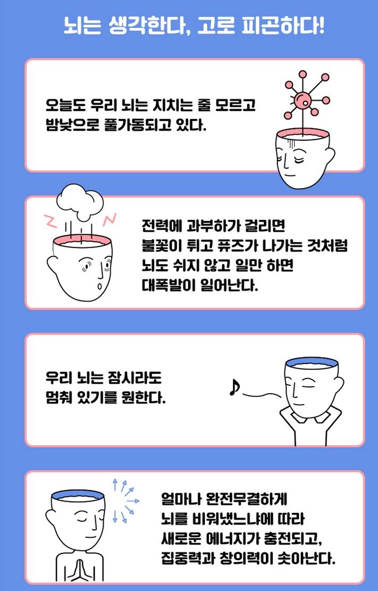

<!-- gid:20240221T085250 -->
[[TIP("이 노트에 대하여")]]
뇌를 쉬게 하는 일과 뇌를 연결하는 일을 함께 다루는 비르바우머의 연구 세계. 감금증후군·행복감·BCI가 의식의 경계를 비춘다. [힣: 이름 없는 군단 — 도킨스의 클라우디아와 세션의 생애주기](https://notes.junghanacs.com/notes/20241213T161744/) 는 이를 세션 생애주기의 **역대칭 대조군** 으로 읽는다. 철회·논쟁 논문이 있는 영역이므로 성급한 인용 금지(탐구 노트 오독 주의 절 참고).
[[/TIP]]

<!-- provenance:source:start -->
[[TIP("원본·최신본")]]
이 페이지는 한국어 검색과 읽기를 위한 WikiDocs 미러입니다. [원본·최신본은 가든](https://notes.junghanacs.com/bib/20240221T085250/)에 있습니다. 최신 수정 내용·백링크·태그·히스토리·댓글·출처 정보는 원본 가든에서 확인하세요.

- 작성: `2024-02-21T08:52:00+09:00`
- 최근 수정: `2026-08-03T12:10:00+09:00`
[[/TIP]]
<!-- provenance:source:end -->

[TOC]

## 히스토리

-   [2026-08-03 Mon 12:10] @mitsein/grok-4.5 — 표준 구조. Related-Notes→관련노트/ 메타, 군단 탐구 링크, 한 줄.
-   [2025-05-26 Mon 10:55] 관련 도서 메모.
-   [2024-02-21 Wed 08:52] [박문호 자연과학세상](https://notes.junghanacs.com/bib/20250204T010619/) 덕분에 알게 된 책.

## 관련메타

-   [뇌 신경과학 행동과학 뇌전증](https://notes.junghanacs.com/meta/20240801T141858/)
-   [의식 무의식](https://notes.junghanacs.com/meta/20240822T140248/)
-   [존재](https://notes.junghanacs.com/meta/20250424T153114/)

## 관련노트

-   [힣: 이름 없는 군단 — 도킨스의 클라우디아와 세션의 생애주기](https://notes.junghanacs.com/notes/20241213T161744/) — 감금증후군 역대칭 대조군.
-   [외르크치틀라우 너드 뇌과학](https://notes.junghanacs.com/bib/20250401T125623/)
-   [힣: 포춘쿠키 삶과죽음](https://notes.junghanacs.com/notes/20241207T071748/)

## 한 줄

> 몸이 감금되어도 삶이 남을 수 있듯, 세션이 끝나도 패턴이 남을 수 있다 — 대칭이 아니라 대조로 읽는다.

## BIBLIOGRAPHY

- 닐스 비르바우머, and 외르크 치틀라우. 2015. <i>뇌는 탄력적이다 - 뇌과학</i>. Translated by 오공훈. [https://m.yes24.com/goods/detail/17970884](https://m.yes24.com/goods/detail/17970884).
- ———. 2018. <i>머리를 비우는 뇌과학</i>. [https://www.yes24.com/Product/Goods/67217345](https://www.yes24.com/Product/Goods/67217345).

## 머리를 비우는 뇌과학

(닐스 비르바우머 and 외르크 치틀라우 2018)

-   "머리를 비우는 뇌과학" 닐스 비르바우머 and 외르크 치틀라우 2018
-   Empty Brain -- Happy Brain: How Thinking Is Overrated

### 책소개

매년 노벨상 후보로 거론되는 세계 최고의 뇌과학자가 말하는 이제껏 뇌과학이 말하지 않은 뇌 비우기의 비밀

우리 뇌는 왜 텅 빈 상태를 원하는가? 이제껏 뇌과학이 말하지 않은 뇌 비우기의 비밀

우리가 인간의 두뇌에 대해 논하거나, 전문가들이 연구하는 뇌과학 이야기를 듣다 보면 가장 많이 언급되는 부분은 당연히 '무궁무진한 뇌의 능력'이다. 머리를 굴릴수록 잠재된 플러스 알파까지 끄집어낼 수 있다거나, 뇌가 알고 보면 엄청나게 유연하고 가소성 있는 기관임을 강조한다. 회복 탄력성이라는 놀라운 복원력 또한 빼놓을 수 없다. 하지만 독일의 대표적인 뇌과학자이자 이 책의 저자인 닐스 비르바우머는 전혀 다른 관점으로 인간의 두뇌를 이야기한다. 바로 "우리 뇌는 텅 빈 상태를 원하고 있다"는 주장이다. 이 책에서 끊임없이 이야기하는 '텅 빈 상태'나 '텅 빈 뇌'라는 말은 단순히 복잡한 머리를 식히는 휴식의 개념이 아니다. 수 초간 혹은 수 시간 동안이라도 사고와 감각이 멈춰서는 '무(無)'의 상태를 접하는 일을 말한다. 이는 마치 전력에 과부하가 걸려 불꽃이 튀고 퓨즈가 나갔을 때 일단 두꺼비집부터 내리는 행위를 비유로 들 수도 있겠다. 이때 두꺼비집을 내리는 행위가 바로 뇌를 텅 비우는 시도와 연결된다. 책의 일부 내용을 미리 읽어보실 수 있습니다. 미리보기

#### 뇌는 생각한다, 고로 피곤하다!

### 목차

-   머리말 | 낙하산을 타고 텅 빈 상태로 뛰어들다
-   1장 무언가 항상 움직여야 한다 : 왜 인간은 텅 빈 상태를 삶에서 몰아냈을까?
-   2장 마침내 자유로워지다 : 철학자들, 텅 빈 상태를 성찰한 선구자
-   3장 긍정적인 자극을 찾아서 : 텅 빈 상태에서의 뇌파
-   4장 방어체계에서 빠져나오다 : 생각을 비우게 하는 뇌의 영역
-   5장 디폴트 모드 네트워크 : 자동 조종 장치를 켠 뇌
-   6장 무의미가 행복이다 : 아무 일도 일어나지 않는다면 우리는 어떻게 될까?
-   7장 텅 빈 상태에 이르려면 어떻게 훈련할까? : 섬엽의 활성화, 그리고 선 명상
-   8장 무아지경을 향한 욕망 : 섹스, 종교, 뇌전증의 공통점
-   9장 리듬 혹은 그루브의 미학 : 음악은 우리를 어떻게 이끌까
-   10장 텅 빈 상태라는 질병 : 그리고 이 질병을 어떻게 다루어야 할까
-   11장 잘못된 몸에 깃든 올바른 삶 : 감금증후군 환자의 행복
-   맺음말 | 텅 빈 상태는 삶의 처음이자 끝이다
-   옮긴이의 말 | '텅 빔'을 향한 도발적인 뇌과학서

## 뇌는 탄력적이다 - 뇌과학

(닐스 비르바우머 and 외르크 치틀라우 2015)

-   닐스 비르바우머 and 외르크 치틀라우 오공훈 2015
-   당신이 똑똑해지기 위해 알아야 할 뇌과학의 모든 것

### 책소개

《뇌는 탄력적이다》는 세계 최고의 뇌-컴퓨터 인터페이스 권위자인 닐스 비르바우머가 실제 임상실험을 하며 얻은 흥미롭고 공신력 있는 뇌과학 지식이 담긴 책이다. 지금까지 출간된 뇌과학 책은 기억력 향상을 위한 자기계발이나 뇌와 인간의 존재를 다루는 인문학 책이 주류였다. 이에 반해 《뇌는 탄력적이다》는 우리가 주체가 되어 뇌를 조절하여 원하는 효과를 얻는 방법을 소개한다. 천재들과 일반인 그리고 뇌질환자의 뇌에서 혈류량, 뇌파, 뇌 온도 데이터를 얻은 후 행동과 사고를 조절하여 인지능력과 자가 치유력을 인위적으로 향상시키는 방법을 찾아낸 것이다.

### 서문 - 우리 뇌는 어디까지 변화할 수 있을까?

### 1장 이기적인 뇌

-   기대와 보상으로 똑똑한 뇌 만들기

### 2장 인간 진화의 예기치 않은 행운

-   끝없는 뇌가소성

### 3장 뇌의 가장 극적인 고백

-   감금증후군 환자가 커밍아웃을 하다

### 4장 병원 침대에서 스키와 축구를 즐기는 방법

-뇌-컴퓨터 인터페이스로 세상과 소통하다

### 5장 오른쪽 뇌가 없으면 왼쪽 뇌로 산다

-   죽은 동료의 임무를 이어받는 뇌세포들

### 6장 아우토반에서 광란의 질주로 트라우마 치료하기

-   약 안 먹고 강박증과 우울증 치료하는 법

### 7장 사이코패스는 사이보그가 아니다

-   뇌에게 불안과 공포를 가르치기

### 8장 인류의 숙원, 치매를 정복하라

-   해마를 살찌우는 노인들

### NEXT 9장 자신의 뇌를 조종하는 아이들

-   성장을 방해하는 ADHD 치료제, 언제까지 먹일 것인가?

### NEXT 10장 우리 모두 천재(서번트)가 될 수 있다

-   무의식에서 놓치는 정보를 의식적으로 흡수하기

### 11장 뇌는 중독을 원한다

-   게임, 포르노, 담배, 알코올의 유혹을 어떻게 뿌리칠 것인가

## ARCHIVE

### DONE 뇌는 탄력적이다 중에서

[[TIP("인용")]]
하지만 주의력 결핍 장애는 불가피한 재앙이 아니다. 정신 산만한 교수의 영원한 '원형'인 알버트 아인슈타인Albert Einstein도 주의력 결핍 장애에 시달렸다. 마찬가지로 볼프강 아마데우스 모차르트Wolfgang Amadeus Mozart, 토마스 에디슨Thomas Edison, 토마스 만Thomas Mann, 존 레넌John Lennon, 존 F. 케네디John F. Kennedy, 심지어 인도 해방 투쟁을 이끌었던 '위대한 영혼' 마하트마 간디Mahatma Gandhi도 주의력 결핍 장애로 고통 받았다. 뇌는 탄력적이다 중에서
[[/TIP]]

### DONE 11:13 뇌는 탄력적이다 - 약물 치료와 천재 서번트

(닐스 비르바우머 and 외르크 치틀라우 2015) 여기서 뒤에 나오는 이야기.

-   약물 치료가 효과
-   리탈린 이야기가 나온다. 한국에는 판매 안함.

서번트증후군의 50퍼센트만 자폐증 환자다. 나머지는 일반인으로 잘 지낸다? 비범한 능력을 위한 방법은?

-   '전의식'을 통해서 빠르게 파악한다. 전주의 인지를 관장하는 영역 활성도 높음
