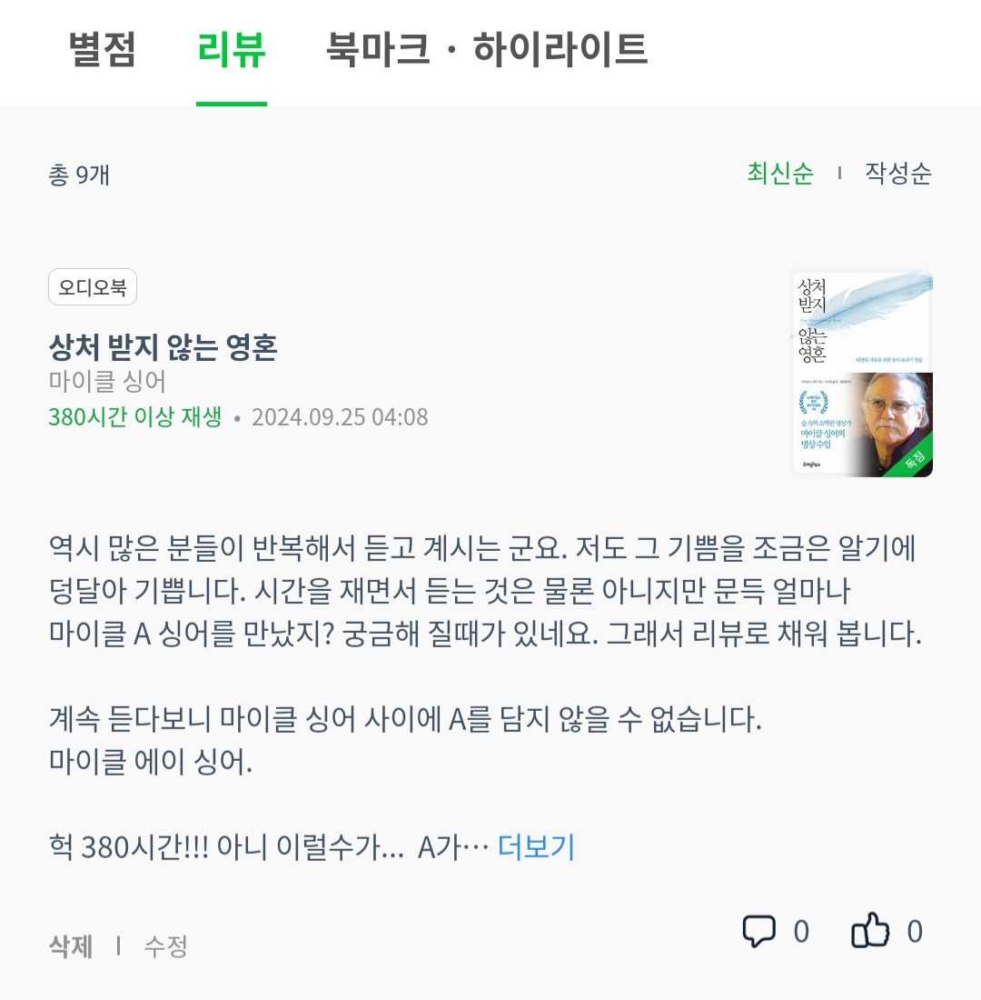

<!-- gid:20240326T214306 -->
[[TIP("이 노트에 대하여")]]
마이클 싱어의 책들과 생애를 따라 내면의 자유와 내맡김의 수행을 살핀다. 상처받지 않는 영혼, 될 일은 된다, 삶이 당신보다 더 잘 안다를 함께 읽으며 저항을 놓는 태도를 배운다.
[[/TIP]]

<!-- provenance:source:start -->
[[TIP("원본·최신본")]]
이 페이지는 한국어 검색과 읽기를 위한 WikiDocs 미러입니다. [원본·최신본은 가든](https://notes.junghanacs.com/bib/20240326T214306/)에 있습니다. 최신 수정 내용·백링크·태그·히스토리·댓글·출처 정보는 원본 가든에서 확인하세요.

- 작성: `2024-03-26T21:43:00+09:00`
- 최근 수정: `2024-12-05T16:59:00+09:00`
[[/TIP]]
<!-- provenance:source:end -->

[TOC]

## 마이클 에이 싱어 Michael Alan Singer 사부님"

(마이클 싱어 1947)

Michael Alan "Mickey" Singer (or Michael A. Singer; born 6 May 1947) is an American author, journalist, motivational speaker, and former software developer. Singer is best known for his writings on spirituality, meditation, and New Age philosophy, and two of his books on the subject, The Untethered Soul (2007) and The Surrender Experiment (2015), were New York Times bestsellers. Singer established the Temple of the Universe, a yoga and meditation center in Alachua, Florida, in 1975. Singer is also involved in the medical software industry. In 1981, he co-founded Medical Manager, now called Greenway Health, which marketed software that helped medical practitioners manage and digitize their billing records. In 2002, Medical Manager and its subsidiaries were bought by WebMD, in an acquisition valued at roughly 5 billion. Singer continued his work in physician software strategies at WebMD, before resigning in 2005.

마이클 앨런 "미키" 싱어(또는 마이클 A. 싱어, 1947년 5월 6일생)는 미국의 작가, 저널리스트, 동기 부여 연설가, 전직 소프트웨어 개발자입니다. 싱어는 영성, 명상, 뉴에이지 철학에 관한 저술로 가장 잘 알려져 있으며, 이 주제에 관한 그의 저서 중 두 권인 The Untethered Soul(2007)과 The Surrender Experiment(2015)는 뉴욕타임스 베스트셀러에 올랐습니다. 싱어는 1975년 플로리다주 알라추아에 요가 및 명상 센터인 템플 오브 더 유니버스를 설립했습니다. 싱어는 의료 소프트웨어 산업에도 관여하고 있습니다. 1981년에는 의료진이 청구 기록을 관리하고 디지털화하는 데 도움이 되는 소프트웨어를 판매하는 Medical Manager(현재 Greenway Health)를 공동 설립했습니다. 2002년에는 Medical Manager와 그 자회사를 약 50억 달러에 인수한 WebMD에 인수되었습니다. Singer는 2005년에 사임하기 전까지 WebMD에서 의사 소프트웨어 전략 업무를 계속했습니다.

## 상처받지 않는 영혼: 내면의 자유를 위한 놓아보내기 연습 이균형

(마이클 싱어 2014)

현대인을 위한 마음공부 그리고 마음의 곤경에서 빠져나오기 위한 탈출법 뉴욕타임스 베스트셀러 1위의 심리학 에세이 심리학으로 마음을 해부하고, 동양의 지혜로 상처를 치유하다! 심리˙치유 에세이의 전설! 뉴욕타임스 베스트셀러 1위, 아마존 심리학 1위에 빛나는 마이클 싱어의 책. 한국과 인연이 깊은 저자의 한국어판 서문과 성해영 교수의 감수와 함께 완전판으로 돌아온 이 작품은 '여행 갈 때 반드시 챙겨가야 할 책'으로 유명해진 심리, 치유서의 전설적 저술이다. 역자는 추가되거나 누락된 원고의 번역과 함께 새로운 감각으로 작품 전체를 다듬어 완전판의 가치를 더했다. 미국의 한 TV 프로그램을 통해 소개된 이래, 지금도 여전히 분야 1위를 지키며 식을 줄 모르는 사랑을 받고 있는 이 책의 성공 비결은 외부의 조건에서 자신의 행복을 찾으려 했던 사람들의 시선을 각자의 내면으로 돌리게 한 데 있다. 그리고 그 작은 변화는 거대한 자기 혁명의 시작이 되었다. The Untethered Soul

-   Untethered soul

### 책소개

현대인을 위한 마음공부 그리고 마음의 곤경에서 빠져나오기 위한 탈출법 뉴욕타임스 베스트셀러 1위의 심리학 에세이 심리학으로 마음을 해부하고, 동양의 지혜로 상처를 치유하다! 심리˙치유 에세이의 전설!

뉴욕타임스 베스트셀러 1위, 아마존 심리학 1위에 빛나는 마이클 싱어의 책. 한국과 인연이 깊은 저자의 한국어판 서문과 성해영 교수의 감수와 함께 완전판으로 돌아온 이 작품은 '여행 갈 때 반드시 챙겨가야 할 책'으로 유명해진 심리, 치유서의 전설적 저술이다. 역자는 추가되거나 누락된 원고의 번역과 함께 새로운 감각으로 작품 전체를 다듬어 완전판의 가치를 더했다.

미국의 한 TV 프로그램을 통해 소개된 이래, 지금도 여전히 분야 1위를 지키며 식을 줄 모르는 사랑을 받고 있는 이 책의 성공 비결은 외부의 조건에서 자신의 행복을 찾으려 했던 사람들의 시선을 각자의 내면으로 돌리게 한 데 있다. 그리고 그 작은 변화는 거대한 자기 혁명의 시작이 되었다.

추천의 글 옮긴이의 글 한국어판 서문 감사의 글 들어가는 글

### PART 1 잠든 의식을 일깨우기

#### 제1장 마음의 소리

#### 제2장 마음속 룸메이트와 결별하기

#### 제3장 당신은 누구인가

#### 제4장 깨어 있는 자아

### PART 2 에너지를 경험하기

#### 제5장 열려 있기

#### 제6장 가슴을 정화하기

#### 제7장 닫는 습관 깨기

### PART 3 자기를 놓아 보내기

#### 제8장 지금 놓아 보내지 않으면 떨어진다

#### 제9장 마음속 가시 빼내기

#### 제10장 마음과 새로운 관계 맺기

#### 제11장 고통의 층 너머로 가기

### PART 4 그 너머로 가기

#### 제12장 벽 허물기

#### 제13장 심리적 한계 넘기

#### 제14장 가짜 덩어리 놓아 보내기

### PART 5 삶을 살기

#### 제15장 조건 없이 행복하기

#### 제16장 저항을 다루는 법

#### 제17장 죽음이 주는 의미

#### 제18장 중도의 비밀

#### 제19장 사랑 가득한 신의 눈으로 보라

### 380시간 청취

[2024-09-25 Wed 07:52]

역시 많은 분들이 반복해서 듣고 계시는 군요. 저도 그 기쁨을 알리게 덩달아 기쁩니다. 시간을 재면서 듣는 것은 물론 아니지만 문득 얼마나 마이클 A 싱어를 만났지? 궁금해 질 때가 있네요. 그래서 리뷰로 채워 봅니다. 계속 듣다보니 마이클 싱어 사이에 A를 담지 않을 수 없습니다.

마이클 에이 싱어.

헉! 380시간 아니 이럴수가... A가 없으면 어색할 정도가 되긴 했군요.

### 들어지는 몇 안되는 책

[2024-01-15 Mon 12:38]

귀한 책이다.

## 마이클 싱어 2016 "될 일은 된다: 내맡기기 실험이 불러온 엄청난 성공과 깨달음" 김정은

(마이클 싱어 2016)

Life Knows Better! 이것은 그저 숲 속의 소박한 명상가였던 저자가 자기 삶의 흐름을 무조건 신뢰하기로 결심한 이후로 펼쳐진 40년간의 경이로운 여정에 관한 책이다. 마이클 싱어의 '내맡기기' 실험은 바로 이 간단한 질문으로부터 시작되었다. - 마음속에 현실의 대안을 지어내놓고 그것을 내 것으로 만들기 위해 현실과 싸우는 게 더 나은 걸까, 아니면 내가 원하는 바는 내려놓고 완벽한 우주를 창조해낸 그 힘에 내맡기는 게 더 나은 걸까? 이 실험은 속세를 떠나자는 것이 아니다. 오히려 삶 속으로 뛰어들어 더 이상 개인적인 욕망과 두려움에 좌지우지되지 않는 자리에서 살자는 것이다. 우주의 계획은 우리 마음이 상상할 수 있는 것보다 스케일이 언제나 훨씬 더 크다 이 책은 듣기 좋은 성공담으로만 채워진 책이 아니다. 오히려 이 책의 백미는, 마이클 싱어가 비리를 저지른 부하직원의 농간으로 FBI와 힘겨운 법정공방을 벌이게 되는 순간부터라고 할 수 있다. 그는 명예롭지 못하게 회사에서 물러나면서도 여전히 삶의 흐름을 신뢰했고, 평소 미뤄왔던 명상서 집필에 전념할 좋은 기회로 여겼다. 결과적으로 미정부는 그에 대한 기소를 취하했고, 그는 뉴욕타임즈 종합 베스트셀러 1위의 작가가 되었다. 이제는 숲 속의 소박한 명상가로 다시 돌아간 그의 '내맡기기' 실험은 여전히 현재진행형이다.

-   The Surrender Experiment

## 마이클 싱어 2023 "삶이 당신보다 더 잘 안다: 숲속 현자의 내맡김 수업" 이균형

(마이클 싱어 2023)

『삶이 당신보다 더 잘 안다』는 우리 시대의 영적 스승 마이클 싱어가 출간한 『상처받지 않는 영혼』의 완결판에 해당하는 책이다. '내면의 자유를 어떻게 얻을 것인가'라는 주제를 본격적으로 다루기로는 무려 15년 만의 작품이다. 이번 책에서 저자는 인간의 곤경을 넘어서 해방된 삶으로 나아가는 여정과 그 구체적인 방법론을 다룬다. 『상처받지 않는 영혼』이 내면세계의 입문서라면, 『삶이 당신보다 더 잘 안다』는 내면의 수행을 본격적으로 안내하는 실습서이다. 이번 신작을 통해 독자들은 내면의 평화와 조건 없는 행복으로 가득한 인생의 비결을 깨달을 수 있을 것이다. Living untethered : beyond the human predicament

## Related-Notes

-   [bib/ 문숙 위대한 일은 없다 영성 유튜버 '2024-02-16 2025-04-18](https://wikidocs.net/381877)
-   [bib/ 루퍼트셸드레이크 과학자 영성 충만한삶 '2024-03-27 2025-06-04](https://wikidocs.net/381911)
-   [bib/ 에크하르트톨레 1948 영성가 사상가 고요 지혜 고통체 '2024-04-19 2025-03-08](https://wikidocs.net/381915)
-   [bib/ 아니타무르자니: 나로살아가는기쁨 거짓신념 엠패스 영성 직관 '2024-06-10 2026-03-08](https://wikidocs.net/381963)
-   [bib/ 필립셸드레이크 영성이란 무엇인가 - 옥스포드 개론서 '2024-07-13](https://wikidocs.net/382005)
-   [bib/ U.G.크리슈나무르티 영성가 그런 깨달음은 없다 '2024-08-02 2026-02-27](https://wikidocs.net/382027)
-   [bib/ 길희성 심도학사 종교다원주의 영성가 '2025-02-12](https://wikidocs.net/382272)
-   [bib/ 람다스 RamDass 영성가 하버드 심리학 요가 '2025-03-12 2025-03-12](https://wikidocs.net/382304)
-   [bib/ 이현주 구도자 영성가 (1944) '2025-03-22 2025-03-22](https://wikidocs.net/382311)
-   [bib/ 라마나마하리쉬 있는 그대로 가르침 영성 깨달음 '2025-08-07 2025-08-07](https://wikidocs.net/382499)
-   [meta/ 영성 '2023-10-24 2025-06-03](https://wikidocs.net/380537)
-   [meta/ 기예인 지식인 예술가 사상가 영성가 구도자 사색가 '2024-02-24 2025-02-14](https://wikidocs.net/380555)
-   [notes/ 힣: 영성: 알아차림 마음챙김 훈련 도구 - 창조적 인간론 '2023-01-28](https://wikidocs.net/381051)

## BIBLIOGRAPHY

- 마이클 싱어. 1947. “마이클 싱어 Michael Alan Singer - 사부님.” [https://en.wikipedia.org/w/index.php?title=Michael_Alan_Singer&#38;oldid=1211221068](https://en.wikipedia.org/w/index.php?title=Michael_Alan_Singer&oldid=1211221068).
- ———. 2014. <i>상처받지 않는 영혼: 내면의 자유를 위한 놓아보내기 연습</i>. Translated by 이균형. 서울: 라이팅하우스. [https://www.yes24.com/Product/Goods/12981014](https://www.yes24.com/Product/Goods/12981014).
- ———. 2016. <i>될 일은 된다: 내맡기기 실험이 불러온 엄청난 성공과 깨달음</i>. Translated by 김정은. 서울: 정신세계사. [https://www.yes24.com/Product/Goods/29078257](https://www.yes24.com/Product/Goods/29078257).
- ———. 2023. <i>삶이 당신보다 더 잘 안다: 숲속 현자의 내맡김 수업</i>. Translated by 이균형. 고양: 라이팅하우스. [https://www.yes24.com/Product/Goods/123146766](https://www.yes24.com/Product/Goods/123146766).
