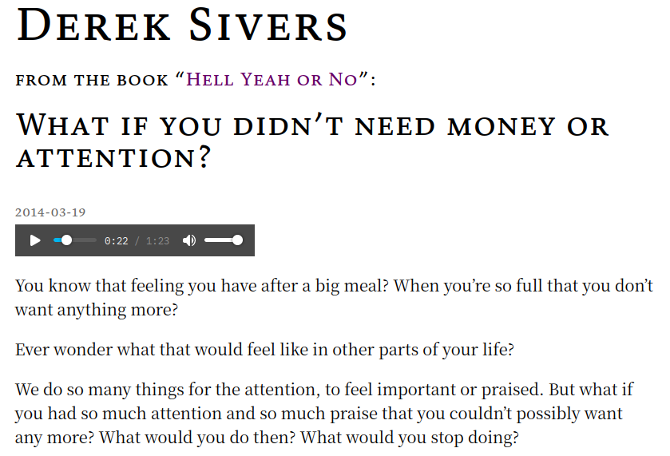

<!-- gid:20240326T223142 -->
[TOC]

[[TIP("이 노트에 대하여")]] 데릭 시버스의 글과 책은 삶을 복잡하게 설명하기보다 선택 기준을 단순하게 세운다. 무엇에 예스하고 무엇을 거절할지, 그리고 자기 삶을 자기 언어로 설계하는 감각을 익히게 한다. [[/TIP]] Related-Notes - [올리버버크먼 4000주 불완전주의 삶의유한함 받아들임](https://wikidocs.net/382132)

## BIBLIOGRAPHY

  데릭 시버스. 2020. <i>진짜 좋아하는 일만 하고 사는 법: 인생에 극적인 전환점을 만드는 마인드셋 업그레이드</i>. Translated by 정지현. 서울: 현대지성. [https://books.google.co.kr/books?id=Dsr1EAAAQBAJ](https://books.google.co.kr/books?id=Dsr1EAAAQBAJ).
  ———. 2021. <i>How to Live 어떻게 살 것인가</i>. [https://sive.rs/h](https://sive.rs/h).
  ———. 2024. <i>Useful Not True</i>. [https://sive.rs/u](https://sive.rs/u).

## Derek Sivers

[2024-03-25 Mon 15:10] <https://sive.rs/> 홈페이지를 보라 - [소리내어읽기: 텍스트음성변환 한국어지원](https://wikidocs.net/381169)

quest 이거다. 내가 생각했던 바. 글을 쓰고 진심으로 읽어서 오디오를 넣는 것이다. 낭독을 연습 안 할 수가 없다. 

## 2020 HELL YEAD OR NO: 진짜 좋아하는 일만 하고 사는 법

(데릭 시버스 2020)

> Useful wisdom. Simple profound mental models to guide your decisions. 유용한 지혜. 결정을 내리는 데 도움이 되는 단순하고 심오한 정신 모델.

HELL YEAH OR NO: What’s worth doing

### 프롤로그

### 1장. 나처럼 사는 건 나밖에 없다

#### 01 돈도, 관심도 더 이상 필요 없다면 당신은 무엇을 할 텐가?

#### 02 당신의 생산성을 끌어올려주는 관점

#### 03 말이 아닌 행동에서 진정한 가치관이 드러난다

#### 04 과거의 타이틀에 더 이상 매이지 마라

#### 05 그 일을 왜 하는가?

#### 06 나 자신으로 살면 언제나 반대에 부딪힐 것이다

#### 07 모방하라. 우리는 불완전한 거울이다

#### 08 과거의 생각이 미래의 나를 정의해서는 안 된다

#### 09 대중이 보는 나는 ‘진짜 나’가 아니다

#### 10 성격은 당신의 미래를 예측한다

#### 11 물고기는 자신이 물속에 있다는 것을 모른다

#### 12 당신은 현재 지향적인가, 미래 지향적인가?

#### 13 작은 행동이 자기 인식을 바꾼다

### 2장. 위대한 것들을 위해 좋은 것들 거절하기

#### 14 그럭저럭 좋은 것들에 빠져 위대한 것을 놓치지 마라

#### 15 거의 모든 것을 거절하라

#### 16 이제 나는 누구의 도구도 아니다

#### 17 맨 처음 떠오르는 대답을 믿지 마라

#### 18 스트레스를 확실히 줄여주는 작은 변화

#### 19 좋아하는 것 포기하기: 인생에 새로운 일이 생기려면

#### 20 게임에 참여하기 전에 결말을 생각해 볼 것

#### 21 외롭지만 바쁜 왕자의 삶

#### 22 나쁜 마음 상태에서 벗어나는 방법

### 3장. 인생의 진로를 바꾸는 스마트한 생각법

#### 23 인생의 속도 제한을 푸는 법

#### 24 여유를 가져도 96%는 비슷하다

#### 25 연결 끊기

#### 26 예상 밖의 장소와 엉키지 않은 목표

#### 27 극도로 의욕이 없을 때

#### 28 은메달리스트가 아니라 동메달리스트처럼 생각하라

#### 29 좋아하는 일은 간단해 보인다

#### 30 미루지 않는 방법: ‘그리고’를 ‘또는’으로 바꿔라

#### 31 선택지는 항상 두 개 이상이다

#### 32 조언을 활용하는 가장 현명한 방법

#### 33 인생의 전략을 바꾸어야 할 때

#### 34 당신이 10년간 해낼 수 있는 일을 과소평가하지 마라

### 4장. 관점의 힘: 즐거운 변화의 시작

#### 35 나는 내가 보통 이하라고 생각한다

#### 36 다 내 잘못이다

#### 37 나는 틀리는 게 좋다

#### 38 대선율 노래하기

#### 39 일어날 일은 일어난다

#### 40 원래 그런 것은 세상에 없다

#### 41 성게 껍질 232개

#### 42 전화위복의 지혜

### 5장. 좋아하는 일을 하면서 돈을 많이 버는 방법

#### 43 나에게는 당연하지만 누군가에게는 놀라울 수 있다

#### 44 행복하고 똑똑하고 유용한 선택

#### 45 좋아하는 일을 하면서 돈을 많이 버는 방법

#### 46 하지 않으면 견딜 수 없는 일은 무엇인가?

#### 47 자신감을 잃었을 때 마음 추스르기

#### 48 길을 걷는 자가 길을 정해야 한다

#### 49 사람들이 부탁하기 전까지는 사업을 시작하지 마라

#### 50 육아와 명상의 공통점

#### 51 그래, 밀트, 나 다시 글을 쓸게

### 6장. 단단한 편견을 깨는 생각 전환의 기술

#### 52 배운 것을 잊고 다시 배우는 능력

#### 53 성공하는 사람들의 단 한 가지 습관

#### 54 사람들을 멍청하다고 생각하면 안 되는 이유

#### 55 그들이 아니라 내가 중요하다

#### 56 남자와 여자는 똑같다

#### 57 새로운 나라에 가서 살아보라

#### 58 손가락이 아니라 달을 봐라

#### 59 때로는 과도한 보상이 필요하다

#### 60 의미를 부여하지 않아도 된다

### 7장. 내 인생에 언제나 ‘예스’라고 말하기

#### 61 꾸준함이 천재성을 이기는 순간

#### 62 위대한 목표는 심지어 만질 수도 있다

#### 63 삶에서 영감을 증폭시키는 법

#### 64 나의 72가지 미래

#### 65 열정과 목적을 찾다가 지쳤다면

#### 66 두렵다면 도전하라

### Contents:

#### OPENING

##### [About this book](https://sive.rs/hy1)

#### UPDATING IDENTITY

##### [What if you didn’t need money or attention?](https://sive.rs/full)

##### [You don’t have to be local](https://sive.rs/local)

##### [Actions, not words, reveal our real values](https://sive.rs/arv)

##### [Keep earning your title, or it expires](https://sive.rs/expire)

##### [Why are you doing?](https://sive.rs/why)

##### [Some will always say you’re wrong](https://sive.rs/wrong)

##### [Imitate. We are imperfect mirrors.](https://sive.rs/mirror)

##### [Loving what I used to hate](https://sive.rs/hate)

##### [The public you is not you](https://sive.rs/publicu)

##### [Character predicts your future](https://sive.rs/character)

##### [Fish don’t know they’re in water](https://sive.rs/fish)

##### [Are you present-focused or future-focused?](https://sive.rs/time)

##### [Small actions change your self-identity](https://sive.rs/actid)

#### SAYING NO

##### [If you’re not feeling “hell yeah!” then say no](https://sive.rs/hyn)

##### [Saying no to everything else](https://sive.rs/no2)

##### [Art is useless, and so am I](https://sive.rs/useless)

##### [I’m a very slow thinker](https://sive.rs/slow)

##### [Tilting my mirror (motivation is delicate)](https://sive.rs/tilt)

##### [Quitting something you love](https://sive.rs/quit)

##### [How will this game end?](https://sive.rs/game)

##### [Solitary socialite](https://sive.rs/soso)

##### [Getting out of a bad state of mind](https://sive.rs/bad)

#### MAKING THINGS HAPPEN

##### [There’s no speed limit](https://sive.rs/kimo)

##### [Relax for the same result](https://sive.rs/relax)

##### [Disconnect](https://sive.rs/dc)

##### [Unlikely places and untangled goals](https://sive.rs/unun)

##### [When you’re extremely unmotivated](https://sive.rs/unmo)

##### [Think like a bronze medalist, not silver](https://sive.rs/bronze)

##### [Imagining lots of tedious steps? Or one fun step?](https://sive.rs/steps)

##### [Procrastination hack: change “and” to “or”](https://sive.rs/andor)

##### [There are always more than two options](https://sive.rs/options)

##### [Beware of advice](https://sive.rs/advice)

##### [Switch strategies](https://sive.rs/switch)

##### [Don’t be a donkey](https://sive.rs/donkey)

#### CHANGING PERSPECTIVE

##### [I assume I’m below average](https://sive.rs/below-average)

##### [Everything is my fault](https://sive.rs/my-fault)

##### [I love being wrong](https://sive.rs/lw)

##### [Singing the counter-melody](https://sive.rs/counter)

##### [What are the odds of that?](https://sive.rs/odds)

##### [two three four ONE, two three four ONE](https://sive.rs/fela)

##### [232 sand dollars](https://sive.rs/232)

##### [My favorite fable](https://sive.rs/horses)

#### WHAT’S WORTH DOING?

##### [Obvious to you. Amazing to others.](https://sive.rs/obvious)

##### [Happy, Smart, and Useful](https://sive.rs/hsu)

##### [How to do what you love and make good money](https://sive.rs/balance)

##### [What do you hate not doing?](https://sive.rs/hatenot)

##### [You don’t need confidence, just contribution.](https://sive.rs/contrib)

##### [Let pedestrians define the walkways](https://sive.rs/walkways)

##### [Don’t start a business until people are asking you to](https://sive.rs/asking)

##### [Parenting : Who is it really for?](https://sive.rs/pa)

##### [OK Milt, I’ll start writing again](https://sive.rs/milt)

#### FIXING FAULTY THINKING

##### [Unlearning](https://sive.rs/unlearning)

##### [Subtract](https://sive.rs/subtract)

##### [Smart people don’t think others are stupid](https://sive.rs/ss)

##### [The mirror: It’s about you, not them.](https://sive.rs/you-not-them)

##### [Assume men and women are the same](https://sive.rs/mw)

##### [Moving for good](https://sive.rs/mfg)

##### [Learning the lesson, not the example.](https://sive.rs/metaphor)

##### [Overcompensate to compensate](https://sive.rs/compensate)

##### [Projecting meaning](https://sive.rs/meaning)

#### SAYING YES

##### [After fifteen years of practice](https://sive.rs/15-years)

##### [Goals shape the present, not the future.](https://sive.rs/goals)

##### [Seeking inspiration?](https://sive.rs/io)

##### [Possible futures](https://sive.rs/futures)

##### [If you think you haven’t found your passion…](https://sive.rs/passion)

##### [Whatever scares you, go do it](https://sive.rs/scares)

## NEXT 2021 How to Live 어떻게 살 것인가

[2024-11-22 Fri 13:48] (데릭 시버스 2021)

[How to Live | Derek Sivers - sive.rs](https://sive.rs/h)

> My masterpiece. Best thing I’ve ever made. My soul in a book. 내 걸작. 내가 만든 최고의 작품. 책에 담긴 내 영혼.

### How to Live: 27 conflicting answers and one weird conclusion

27개의 상반된 답변과 하나의 이상한 결론

Not quite non-fiction, not quite self-help. It’s a work of art about conflicting philosophies. 논픽션도 아니고 자기계발서도 아닙니다. 상충하는 철학에 대한 예술 작품입니다.

Many books believe they know how you should live. But each book disagrees with the next. In “How to Live”, each chapter believes it knows how you should live. And each chapter disagrees with the next. 많은 책들이 어떻게 살아야 하는지 알고 있다고 믿지만, 각 책들은 서로 동의하지 않습니다. '어떻게 살 것인가'에서는 각 장이 어떻게 살아야 하는지 알고 있다고 믿습니다. 그리고 각 장은 다음 장과 동의하지 않습니다.

One chapter makes a compelling argument for why you should be completely independent, keeping all options open. The next chapter argues why you should commit to one career, one place, and one person. 한 장에서는 모든 옵션을 열어두고 완전히 독립해야 하는 이유에 대해 설득력 있게 설명합니다. 다음 장에서는 한 직업, 한 장소, 한 사람에게만 전념해야 하는 이유를 설명합니다.

One chapter persuades you to be fully present, and experience each moment. The next, to delay gratification and invest for the future. 한 장에서는 온전히 현재에 집중하고 매 순간을 경험하라고 설득합니다. 다음 장에서는 만족을 미루고 미래를 위해 투자하라고 말합니다.

Which one is right? Which does the author believe? All of them. It's a philosophy of conflicting philosophies. 어느 쪽이 맞을까요? 저자는 어느 쪽을 믿나요? 모두 다요. 상충하는 철학의 철학입니다.

A very unique and thought-provoking book. Meant for reflection as much as instruction. 매우 독특하고 생각을 자극하는 책입니다. 교육만큼이나 성찰을 위한 책입니다.

113 incredibly succinct pages of profound insights. No philosophers are quoted. No -isms are named. Only actionable directives. The end result feels more like poetry than prose. 113페이지에 걸친 심오한 통찰이 놀라울 정도로 간결하게 담겨 있습니다. 철학자의 말을 인용하지 않았습니다. 어떤 -주의도 명명되지 않았습니다. 오직 실행 가능한 지시어만 있습니다. 최종 결과는 산문이라기보다는 시처럼 느껴집니다.

### 목차

1.  [Be independent.](https://sive.rs/htl01)
2.  [Commit.](https://sive.rs/htl02)
3.  [Fill your senses.](https://sive.rs/htl03)
4.  [Do nothing.](https://sive.rs/htl04)
5.  [Think super-long-term. 장기적으로 생각하세요.](https://sive.rs/htl05)
6.  [Intertwine with the world. 세상과 소통하세요.](https://sive.rs/htl06)
7.  [Make memories.](https://sive.rs/htl07)
8.  [Master something.](https://sive.rs/htl08)
9.  [Let randomness rule. 무작위성이 지배하게 하세요.](https://sive.rs/htl09)
10. [Pursue pain.](https://sive.rs/htl10)
11. [Do whatever you want now. 지금 원하는 대로 하세요.](https://sive.rs/htl11)
12. [Be a famous pioneer. 유명한 선구자가 되세요.](https://sive.rs/htl12)
13. [Chase the future.](https://sive.rs/htl13)
14. [Value only what has endured. 오래 지속된 것만 소중히 여기세요.](https://sive.rs/htl14)
15. [Learn.](https://sive.rs/htl15)
16. [Follow the great book. 위대한 책을 따르세요.](https://sive.rs/htl16)
17. [Laugh at life.](https://sive.rs/htl17)
18. [Prepare for the worst. 최악의 상황에 대비하세요.](https://sive.rs/htl18)
19. [Live for others.](https://sive.rs/htl19)
20. [Get rich.](https://sive.rs/htl20)
21. [Reinvent yourself regularly. 정기적으로 자신을 재발견하세요.](https://sive.rs/htl21)
22. [Love.](https://sive.rs/htl22)
23. [Create.](https://sive.rs/htl23)
24. [Don't die.](https://sive.rs/htl24)
25. [Make a million mistakes. 수많은 실수가 있을 수 있습니다.](https://sive.rs/htl25)
26. [Make change.](https://sive.rs/htl26)
27. [Balance everything.](https://sive.rs/htl27)
28. [Conclusion](https://sive.rs/htl28)

## NEXT 2024 Useful Not True

(데릭 시버스 2024)

[Useful Not True | Derek Sivers - sive.rs](https://sive.rs/u)

> Doubt everything. No beliefs are true. Adopt what works for you now. 모든 것을 의심하세요. 확실한 믿음은 없습니다. 지금 자신에게 맞는 것을 채택하세요.

## 홈페이지

[Derek Sivers](https://sive.rs/)

What I’m doing now

(This is [a now page](https://nownownow.com/about), and if you have your own site, [you should make one](https://nownownow.com/about), too.)

Updated June 15th, 2024, from my home in New Zealand. It’s the middle of winter here. Windy, cold, sideways rain. Very productive.

Final edits to “[Useful Not True](https://sive.rs/u)”

If you want advance access to my next book, buy “Useful Not True” now at [sivers.com](https://sivers.com/)

I’ve been working on this almost full-time for two years, and I’m so excited to be almost done. I’m super-happy with it, but still improving it.

surprised at the comfort of Shanghai

Just spent five days in Shanghai, China, and it’s so nice! Especially 梧桐区 - AKA the [Former French Concession](https://www.chinahighlights.com/shanghai/attraction/french-concession.htm), one of the nicest neighborhoods I’ve ever experienced in any city in the world. Cycling around every day on shared bicycles.

The people are kind. The trains are efficient and not over-crowded. The streets are clean. Trashcans (+ recycling) everywhere. The AliPay and WeChat systems for QR mobile app payments are surprisingly great.

And biggest surprise of all: it’s quiet with relatively clean air thanks to every motorcycle and most cars being 100% electric. The motorbikes especially are absolutely silent. 50 of them will go right by you, completely inaudible. Amazing. Intriguing. Makes me want to learn Chinese and spend more time there, getting to know many of the cities. But especially retuning to that adorable 梧桐 区.

redesign of [nownownow.com](https://nownownow.com/)

I visited all 2300 /now pages to see who’s current, and deleted the ones that are gone. Then I changed the [nownownow.com home page](https://nownownow.com/) to browse by location or search profiles for text.

cuddly pet rats

I would never have predicted this, but my boy heard from a friend that rats are wonderful pets, so three weeks ago we got two twin boy rats. They just want to cuddle and sleep all the time. They’re so sweet, never bite, and don’t even smell. They poop in a litter box! See [this video](https://www.youtube.com/watch?v=NLFIno6pJE8) for an example of what rats are like as pets.

rat
