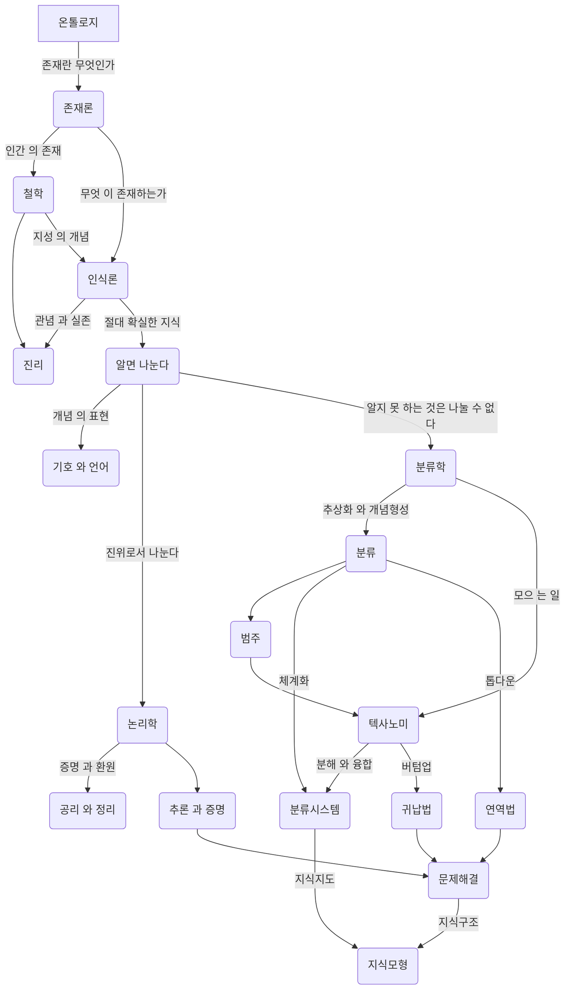
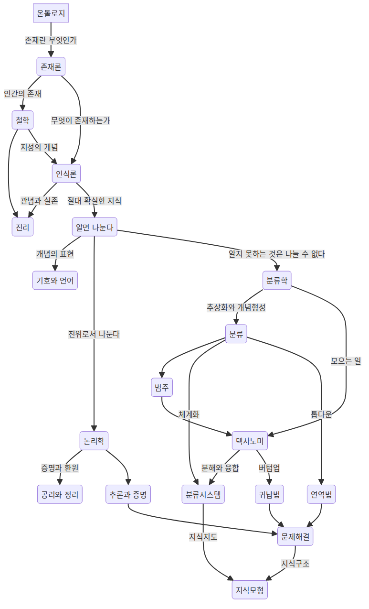

<!-- gid:20240402T011718 -->
[TOC]

[[TIP("이 노트에 대하여")]]
이 노트는 기록, 정보, 지식을 잇는 온톨로지 알고리즘의 큰 지형을 따라간다. 분류, 편집, 하이퍼텍스트, 정보시스템을 묶어 지식구조화의 기반 개념을 살피는 데 유용하다.
[[/TIP]]

## 온톨로지 알고리즘 1: 기록 정보 지식 의 세계

(타카시 사이토 2008)

-   타카시 사이토 최석두 and 한상길

폭소노미 (folksonomy)

### 소개

기록정보학 을 가로지르고, 필요불가결하며, 그것 의 전통적 계승인 온톨로지 알고리즘 을 재구축 하는 데 목적 을 두고 있는 책이다. 이 책은 온톨로지 알고리즘 은 인간 의 지성 을 밝히 는 지식 모형이며, 이것 은 인간 의 지적 과정 의 원점이라고도 하는 "알기" 위해서 "나눈다"는 소박한 인식론 에서 출발하여 역사학, 논리학, 수학, 언어학, 기호론, 분류학 등 리버럴 아츠에 의해 그 기초 원리 가 확립되었다고 이야기하고 있다. 또한 컴퓨터 의 출현에 따라 정보과학, 인지과학, 지식 공학, 소프트웨어 공학, 기록정보학 등 학제학 의 지식 모형으로서 새롭게 연구되고 있는 온톨로지 의 면면 과 구조 를 상세하게 밝혀내고 있다.

### 1. 전체상 - 큰 그림 을 보라!

#### IT 사회 &amp; 온톨로지 알고리즘

#### 기록

#### 정보

#### 관점

#### 온톨로지 알고리즘 의 발전 사이클

##### 기록 사이클 과 기록 알고리즘

##### 정보 사이클 과 정보 알고리즘

##### 지식 사이클 과 지식 알고리즘

#### 주제

#### 기록정보학 의 연구 초점

#### 정보 시스템

#### 지식 연구

#### 온톨로지 알고리즘 &gt; 영역

#### K-Map &amp; 재귀적 온톨로지 알고리즘

#### 온톨로지 알고리즘 &gt; 영역

기초 원리
: 역사학 논리학 수사학 언어학 기호론

분류학 정보과학, 인지과학, 지식 공학, 기록정보학

### 2. 기록 :

#### 편집 &amp; 온톨로지 알고리즘

#### 책 : 편집

#### 하이퍼텍스트

##### 참조형 링크 와 계층형 링크

##### 브라우징 과 정보 의 미아

##### 네비게이션

##### World Brain

##### 유사 하이퍼텍스트

##### 하이퍼텍스트 시스템

#### 아이디어 생성

##### 오소링

###### 구조화 편집

<!--list-separator-->

-  주크박스형 시뮬레이션형

<!--list-separator-->

-  노드 와 링크 의 규제

###### 정보 매핑

<!--list-separator-->

-  인포메이션 블록 의 종류

<!--list-separator-->

-  하이퍼트레일

##### 라이팅 스페이스

##### 편집공학

#### 편집 &amp; 온톨로지 알고리즘

고쳐 쓰다 -&gt; 편집 드라마 &gt; 무엇인가?

#### 책의 편집

-   책의 구조 &gt; 목차 중심 =&gt; 정적 제한
-   도형
-   비선형 &gt; 참조형 관계 각주 / 주석 칼럼 기사 / 타 문서 참조)
-   문장 계층 구조
-   

#### 하이퍼텍스트

원래 인간 의 사고 &gt; 비선형적인 구조 책을 만드려면 선형 으로 바꿔야 함.

### 3. 정보

#### 기록정보학

#### 주제 분석

##### 색인화

##### &gt; 목적

##### &gt; 실례

##### &gt; 범주

##### &gt; 순서

##### 주관적 온톨로지

##### 속성 :and 속성값

##### 주제 분석 &gt; 연구 과제

##### 상호 간의 거리 계산

##### 인용 색인

#### 내용 분석

##### 다변량 분석

##### 의미공간 &gt; 분석

#### 정보 시스템

##### 유니텀

##### 검색 모형

##### 데이터베이스 관리 시스템

##### 정보검색 시스템

#### 디지털 도서관

##### 도서관 모형

##### 메타 데이터

##### 정보 푸시 와 정보 풀

##### SDI 디지털 도서관

##### 차분 정보 &gt; 배포

### 4. 지식 의 지식

지식 의 뿌리 - 철학 철학 =&gt; 논리학 수학 언어학 철학 의 원점 :: 온톨로지 =&gt; 사물 의 속성 을 나타내 는 개념 과 그 체계화 안다 나눈다 라는 말의 구분 에서 시작.

#### 철학

```text
고양 이 이며, 그 중 에서 흰 고양이 가 적어도 한 마리 는 존재한다.
```

:exist x (cat (x) :and white (x))

:exist 존재기호 ~이 있다, ~가 존재한다. ~가 실존한다.

```text
:exist x (cat (x) :and white (x))
$\forall$ , $\exist$
```

-   [학문 이 서로 돕는 다는 것 : 현상학적 학문이론 과 일반체계이론 의 이중주](https://wikidocs.net/381919) 여기에 좋은 주제 가 들어 있다.
-   적절한 활용 방법이?!

##### 인식론

-   인식 하는 지성인 관념
-   대응설
-   정합설
-   실용주 의

칸트 순수오성 개념 즉

##### 형이상학

##### 나눈다 &amp; 안다

##### 분해 와 종합

#### 개념 &amp; 범주

##### 개념

##### 외연 &amp; 내포

##### 범주

##### 칸트 &gt; 범주

##### 개념 분류

##### 개념 정의

#### 논리학

##### 형식화

##### 삼단논법

##### 명제 논리

##### 술어 논리

##### 양화 기호 - 보편양화사

##### 기호논리학

##### 연역법 &amp; 귀납법

##### 논리철학 - 비트겐슈타인

#### 수학

##### 수학적 온톨로지

##### 알고리즘

#### 기호론 &amp; 의미론

##### 커뮤니케이션 모형

##### 기호 &amp; 그 역할

##### 기호 표현 &amp; 기호 내용

##### 기호론

##### 개념 형성 &amp; 의미 작용

##### 의미론

##### 표시 의 &amp; 공시 의

#### 언어학 &amp; 자연언어 처리

##### 언어 모형 의 작용

##### 언어적 지식

##### 말

##### 언어학

##### 생성 문법

##### 격 문법

##### 자연언어 처리 시스템

###### 형태소 해석

###### 통어 해석

###### 의미 해석

###### 담화 해석

### 5. 분류학 :and 분류 시스템

분류학 &amp; 분류 시스템

#### 생물 분류

#### 텍사노미

#### 추상화 &amp; 개념 형성

#### 분류 &gt; 관점

#### 분류 시스템 &gt; 탄생

#### 도서 분류 시스템

##### DDC

##### NDC

##### 패싯 분류

##### UDC

#### 시소러스

##### 시소러스 원리

##### 유서

##### 정보검색 시스템 &gt; 시소러스

##### 롤 &amp; 링크

##### 개념 사전

##### 의미 표현 방식

### 6. 지식 모형

지식 모형

#### 다양한 지식

#### 해석학 모형

#### 정보 모형

#### 인공지능 의 지식 모형

#### 지식 공학 &gt; 지식 모형

#### 인지과학 &gt; 지식 모형

#### 소프트웨어 공학 의 지식 모형

#### 지식 관리 의 지식 모형

### 7. 지식 지도

#### 그림 의 특성

#### 프레임 모형 과 의미 네트워크

#### 자연언어 의 의미 도해 기법

#### 소프트웨어 공학 의 지식 지도

#### 비지니스에서 의 지식 지도

#### 검색 의 지식 지도

### 8. 온톨로지 알고리즘 의 구현

#### 시맨틱 웹

#### 케이 에이전트

#### 케이 맵

#### 실험

#### 서지 암묵지 의 도구

### 찾아보기

-   1차정보

## <span class="org-hashtag">#온톨로지알고리즘</span> 지도 K-map

-   지식 모형
-   오성 -&gt; 지성

<!--listend-->





## Related-Notes

-   [지식그래프 온톨로지 인식론 지식론](https://wikidocs.net/380596)

## BIBLIOGRAPHY

  타카시 사이토. 2008. <i>온톨로지 알고리즘 1: 기록 정보 지식의 세계</i>. Translated by 최석두 and 한상길. 한울. [https://www.yes24.com/Product/Goods/87117232](https://www.yes24.com/Product/Goods/87117232).

## WORDLIST

-   분해 O
-   추상화 O
-   추론 O
-   공리 O
-   증명 O
-   기호 O
-   개념 O
-   관념 O
-   지성 O
-   무엇 X
-   인간 O
-   알고리즘 O
-   암묵지 O
-   검색 O
-   비지니스에서 X
-   공학 O
-   자연언어 O
-   모형 O
-   그림 O
-   관리 O
-   공시 O
-   표시 O
-   실용주 O
-   주제 O
-   일반체계이론 X
-   학문이론 X
-   학문 X
-   마리 X
-   고양이 X
-   고양 X
-   나타내 X
-   속성 O
-   사물 O
-   철학 O
-   지식 O
-   푸시 X
-   블록 O
-   링크 O
-   노드 X
-   정보 O
-   브라우징 X
-   사이클 O
-   구조 O
-   학제학 X
-   컴퓨터 O
-   원리 O
-   과정 O
-   이것 X
-   밝히 X
-   목적 O
-   그것 X
-   기록정보학 X
-   인식 O
-   돕는 X
-   구분 O
-   선형 O
-   인식론 O
-   재구축 X
