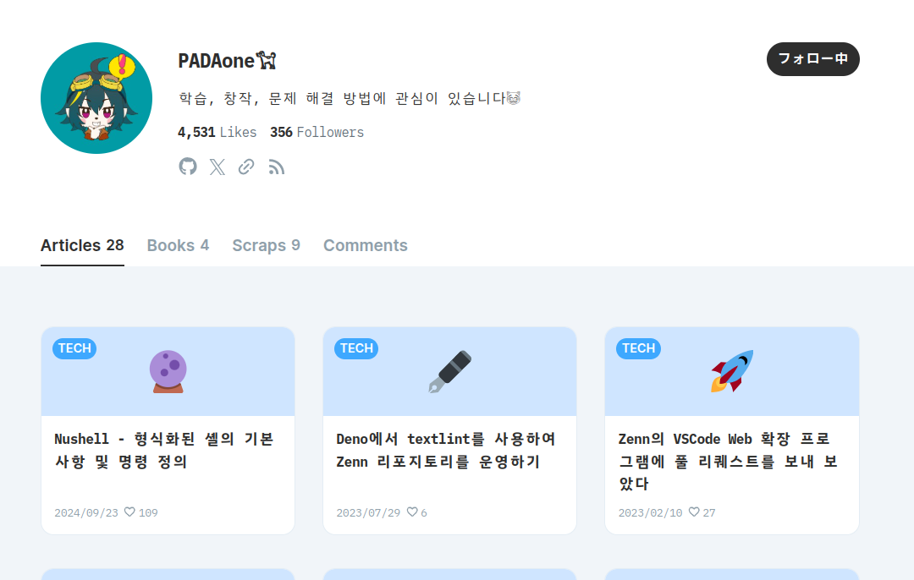
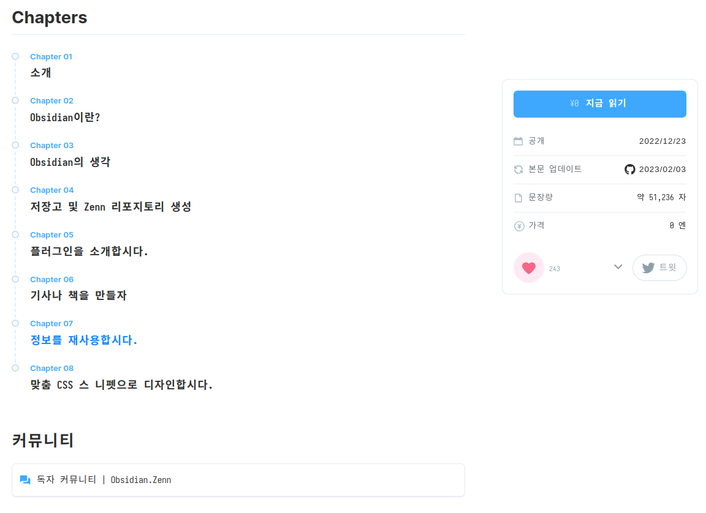
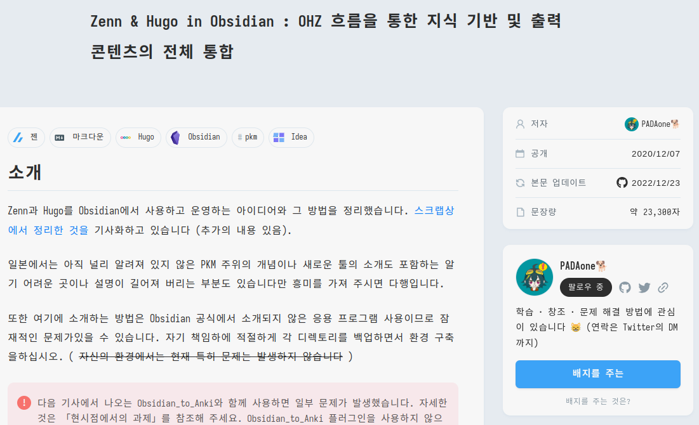

<!-- gid:20240424T151159 -->
[[TIP("이 노트에 대하여")]] PADAone의 글과 책, Zenn 자료를 통해 일본 옵시디언 실천을 따라간다. 개인 지식관리와 공개 글쓰기를 어떻게 연결하는지 살피는 데 좋은 참고축이 된다. [[/TIP]] ZENN 페이지 <https://zenn.dev/estra>  obsidian with zenn (“Obsidian.Zenn” 2022) <https://zenn.dev/estra/books/obsidian-dot-zenn> 차세대 노트 테이킹 도구 인 Obsidian 을 사용하여 Zenn 에서 기사와 책을 만드십시오! 무료 책이라 좋다. 구성을 보면 저장소 생성이 있다. 이게 핵심이 아닌가? 그리고 커뮤니티를 보라. 스크랩일 뿐이다. 여튼 여기에 독자 커뮤니티가 생성 된 것이다. 깔끔하다. 깃허브 주소 <https://github.com/yo-goto/zenn-public-repo/tree/main/books/obsidian-dot-zenn> <https://zenn.dev/estra/scraps/ac4d7c5450f4a7>  zenn hugo in obsidian [2023-07-25 Tue 14:56] (“Zenn &38; Hugo in Obsidian” 2020) <https://zenn.dev/estra/articles/ohzflow-zenn-hugo-obsidian> 이건 장난 아니다. 이 글은 좀 정리를 할 필요가 있겠다.  zenn-public-repo/books/obsidian-dot-zenn at main · yo-goto/zenn-public-repo (estra n.d.) - Zenn の無料記事用リポジトリ. Contribute to yo-goto/zenn-public-repo development by creating an account on GitHub. obsidian plugin development [2023-07-25 Tue 15:06] <https://zenn.dev/estra/articles/obsidian-plugin-dev_1> Related-Notes - [옵시디언](https://wikidocs.net/380827)

## BIBLIOGRAPHY

  estra. n.d. “Zenn-Public-Repo/Books/Obsidian-Dot-Zenn at Main · Yo-Goto/Zenn-Public-Repo.” Accessed March 27, 2025. [https://github.com/yo-goto/zenn-public-repo/tree/main/books/obsidian-dot-zenn](https://github.com/yo-goto/zenn-public-repo/tree/main/books/obsidian-dot-zenn).
  “Obsidian.Zenn.” 2022. December 23, 2022. [https://zenn.dev/estra/books/obsidian-dot-zenn](https://zenn.dev/estra/books/obsidian-dot-zenn).
  “Zenn &#38; Hugo in Obsidian.” 2020. December 7, 2020. [https://zenn.dev/estra/articles/ohzflow-zenn-hugo-obsidian](https://zenn.dev/estra/articles/ohzflow-zenn-hugo-obsidian).
