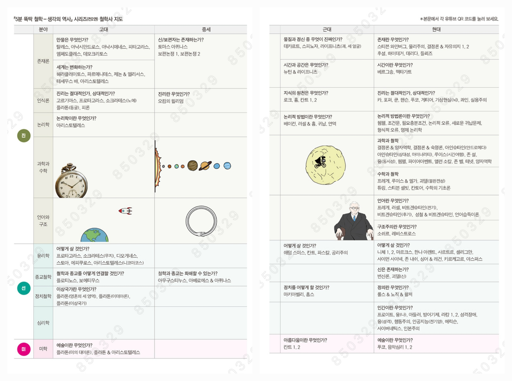

<!-- gid:20240522T135522 -->
[TOC]

[[TIP("이 노트에 대하여")]]
김필영의 책과 영상은 철학사를 한눈에 조망하려는 대중적 지도 역할을 한다. 철학과 과학, 사상사의 큰 흐름을 빠르게 붙잡고 싶을 때 유용하다.
[[/TIP]]

## BIBLIOGRAPHY

  김필영. 2018. <i>시간여행, 과학이 묻고 철학이 답하다</i>. [https://www.yes24.com/Product/Goods/64190123](https://www.yes24.com/Product/Goods/64190123).
  ———. 2023. <i>평범하게 비범한 철학 에세이</i>. [https://www.yes24.com/Product/Goods/119629184](https://www.yes24.com/Product/Goods/119629184).
  ———. 2024a. <i>뚝딱 철학 - 생각의 역사 1 고대중세근대</i>. [https://www.yes24.com/Product/Goods/124767712](https://www.yes24.com/Product/Goods/124767712).
  ———. 2024b. <i>뚝딱 철학 - 생각의 역사 2 현대</i>. [https://www.yes24.com/Product/Goods/124767704](https://www.yes24.com/Product/Goods/124767704).
  ———. n.d. “김필영 - 유튜버 철학자.” Accessed May 22, 2024. [https://www.yes24.com/Product/Search?domain=ALL&#38;query=%EA%B9%80%ED%95%84%EC%98%81&#38;authorNo=231857&#38;author=%EA%B9%80%ED%95%84%EC%98%81](https://www.yes24.com/Product/Search?domain=ALL&query=%EA%B9%80%ED%95%84%EC%98%81&authorNo=231857&author=%EA%B9%80%ED%95%84%EC%98%81).
  <i>2,500년 철학의 역사를 한눈에 지식 철학사 지도</i>. n.d. Accessed April 24, 2025. [https://www.youtube.com/watch?v=_jbyO22NlUs](https://www.youtube.com/watch?v=_jbyO22NlUs).

## 2,500년 철학의 역사를 한눈에 지식 철학사 지도

(<i>2,500년 철학의 역사를 한눈에 지식 철학사 지도</i> n.d.)

## 김필영 - 유튜버 철학자

-   (김필영 n.d.)
-   김필영
-   대학에서 전기공학을 전공하고 기업에서 관련 직종으로 30년을 근무했다. 직장을 다니면서 뒤늦게 철학을 공부하여 한국외대에서 철학박사 학위를 취득하고 강의했다. 공대 출신 회사원이 왜 철학 공부를 했을까? 저자 김필영은 어릴 적부터 일상적으로 막연한 불안을 느끼는 범불안장애에 시달렸다고 한다. 어릴 적의 막연한 불안은 청소년기를 거치면서 실존적 불안으로 바뀌고, 그러한 불안을 극복하고자 자연스럽게 철학과 심리학에 관심을 가지게 되었다. 그리고 세계가 무엇인지, 인간이 무엇인지에 대한 공부를 통해 불안을 어느 정도 극복할 수 있었다. 한때는 철학만 공부하고 싶은데 먹고사는 문제를 해결하기 위해 회사를 다니면서 스트레스를 받기도 했다. 하지만 지금 와서 생각해보니 회사 생활과 철학 공부를 병행한 것이 도움이 된 것 같다고 한다. 왜냐하면 사람에게는 광장과 밀실이 모두 필요한데, 회사 생활은 광장의 공간이 되었고 철학 공부는 밀실의 공간이 되었기 때문이다. 4년 전부터 유튜브 ‘5분 뚝딱 철학’ 채널을 운영하면서 철학의 대중화에 힘쓰고 있다. 촬영, 편집, 썸네일 작업까지 모두 직접 해서 매주 1편씩 올리고 있다. 힘들긴 하지만 구독자가 22만 명을 넘는 등 호응이 좋아 재미있게 하고 있다. 현재는 서울대, UNIST, 한국외대, 서울생활문화센터, 기업체, 문화센터, 고등학교 등에서 강연활동을 해오고 있으며, 철학 영어 콘텐츠 제작, 철학 NFT 제작, 철학 VR 전시 등을 준비하고 있다. 저서로는 2021년 ‘세종도서 교양부문’과 ‘올해의 청소년 도서’ 로 선정된 『5분 뚝딱 철학\\_생각의 역사』(1, 2권), 『5분 뚝딱 철학&ensp;철학툰』, 그리고 『시간여행, 과학이 묻고 철학이 답하다』가 있다.
-   

## 시간여행, 과학이 묻고 철학이 답하다

(김필영 2018)

-   김필영
-   시간여행은 정말 가능한가?시간이란 무엇인가? 이 물음 앞에 쉽게 대답을 내놓을 사람은 아마도 없을 것이다. 시간은 너무도 익숙해서 잘 알고 있는 듯 착각하게 되지만, 사실 시간이라는 개념만큼 알쏭달쏭하고 이해하기 어려운 것은 없다. 이와 더불어 우리가 강한 호...
-   2018

## 평범하게 비범한 철학 에세이

(김필영 2023)

-   

-   김필영
-   삶의 의미를 되묻는 26가지 스토리 철학은 어떻게 삶의 의미가 되는가? 우리의 삶은 평범하기도 하고 비범하기도 하다. 전체로 놓고 보면 우리의 삶은 너무나 평범하다. 우리 모두는 태어나서 늙고 병들고 죽는다. 알고 보면 그게 다이다. 하지만 그러한 평범한 삶의 여정 속에는 반짝반짝 빛나는 비범한 순간들이 있다. 그 반짝반짝 빛나는 비범한 순간은 아름다운 순간일 수도 있고, 깨달음의 순간일 수도 있고, 고통스러운 순간일 수도 있다. 하지만 비범한 순간들은 결국은 평범 속에 묻혀 버린다. 『평범하게 비범한 철학 에세이』는 묻히고 사라질 것 같은 그 비범한 순간들의 이야기이다. 영화를 보다가, 소설을 읽다가, 그림을 보다가, 여행을 하다가, 평범한 일상 속에서 포착한 반짝이는 비범한 순간들, 지극히 평범하지만 누구나 비범한 우리들의 이야기를 담았다. 어느 날, 철학이 내게 들어왔다. 철학 유튜브 1위, ‘5분 뚝딱 철학’ 김필영 박사의 삶의 의미를 되묻는 26가지 철학 스토리!
-   2023

## 뚝딱 철학 - 생각의 역사 1 고대중세근대

(김필영 2024a)

## 뚝딱 철학 - 생각의 역사 2 현대

(김필영 2024b)​

## 철학 지도

-   [지도: 지식 학문 철학](https://wikidocs.net/381546)

## 철학지도

[2025-04-22 Tue 22:34]

-   [용어사전: 조직모드 스프레스시트 변환](https://wikidocs.net/381246) 이렇게 관리하는게 더 편해 편집해서 테이블로 내보내면 되잖아.

### 고대 중세

|   | 분야       | 고대                                | 중세           |
|---|----------|-----------------------------------|--------------|
|   |            | **만물은 무엇인가?**                | 신/보편자는 존재하는가? |
|   | **존재론** | 탈레스, 아낙시만드로스, 아낙시메네스, 피티고라스, | 토마스 아퀴나스 |
|   |            | 엠페도클레스, 데모크리토스          | 보편논쟁 1, 보편논쟁 2 |
| 진 |            | **세계는 변화하는가?**              |                |
|   |            | 해라클레이토스, 파르메니데스, 제논 &amp; 엘리서스, |                |
|   |            | 테세우스 배, 아리스토텔레스         |                |
|   | **인식론** | **진리는 절대적인가?, 상대적인가?** | 진리란 무엇인가? |
|   |            | 고르기아스, 프로타고라스, 소크라테스(노예), | 오침의 월리엄  |
|   |            | 플라톤(동굴), 피론                  |                |
|   | **논리학** | 논리학이란 무엇인가?                |                |
|   |            | 아리스트텔레스                      |                |
|   |            |                                     |                |
|   | **윤리학** | 어떻게 살 것인가?                   |                |
|   |            | 프로타고라스, 소크라테스(무지),     |                |
|   |            | 디오개네스, 스토아, 에피쿠로스, 아리스트텔레스(나코마코스) |                |
|   | **철학과 종교** | 철학과 종교를 어떻게 연결할 것인가? |                |
|   |            | 플로티노스, 보에티우스              |                |
|   | **이상국가론** | 이상국가란 무엇인가?                |                |
|   |            | 플라톤(영혼의 세 영역), 플라톤(이데아론), 플라톤(이상국가) |                |
|   | **예술철학** | 예술이란 무엇인가?                  |                |
|   |            | 플라톤(미의 대어론), 플라톤 &amp; 아리스트텔레스 |                |

### 근대 현대

| 분야       | 근대                                     | 현대                                                             |
|----------|----------------------------------------|----------------------------------------------------------------|
| **존재론** | 물질과 정신 중 무엇이 진짜인가?          | 존재란 무엇인가?                                                 |
|            | 데카르트, 스피노자, 라이프니츠(단일성, 다중성) | 스티븐 와인버그, 물리주의, 결정론 &amp; 자유의지 1, 2 후설, 하이데거, 데리다, 들뢰즈 |
| **시간과 공간** | 시간과 공간은 무엇인가? 뉴턴 &amp; 라이프니츠 | 시간이란 무엇인가? 베르그송, 맥태거트                            |
|            |                                          |                                                                  |
| **인식론** | 지식의 원천은 무엇인가? 로크, 흄, 칸트 1, 2 | 진리는 절대적인가, 상대적인가? 퀸, 포퍼, 쿤, 핸슨, 푸코, 게티어, 가상현실(뇌), 실용주의 |
|            |                                          |                                                                  |
| **논리학** | 논리적 방법이란 무엇인가? 베이컨, 러셀 &amp; 흄, 귀납법, 연역법 | 논리적 방법론이란 무엇인가? 퀸, 조건문, 필요충분조건, 논리적 오류, 새로운 귀납문제, 형식적 오류, 명제 논리학 |
|            |                                          |                                                                  |
| **과학철학** |                                          | 과학과 철학: 결정론 &amp; 양자역학, 결정론 &amp; 숙명론, 아인슈타인(상대성), 존 설, 양자역학 |
| **수학철학** |                                          | 수학과 철학: 프레게, 괴델(불완전성), 튜링, 칸토어, 수학의 기초론 |
| **언어철학** |                                          | 언어란 무엇인가? 프레게, 러셀, 비트겐슈타인(전기/후기), 언어습득이론 |
| **구조주의** |                                          | 구조주의란 무엇인가? 소쉬르, 레비-스트로스                       |
| **윤리학** | 어떻게 살 것인가? 애덤 스미스, 칸트, 파스칼, 공리주의 | 어떻게 살 것인가? 니체, 마르크스, 한나 아렌트, 사르트르, 실존주의 |
| **정치철학** | 정치를 어떻게 할 것인가? 마키아벨리, 홉스 | 정의란 무엇인가? 롤스, 노직, 워즈워스                            |
| **심리철학** |                                          | 인간이란 무엇인가? 프로이트, 아들러, 행동주의, 인공지능, 인본주의 |
| **미학**   | 아름다움이란 무엇인가? 칸트 1, 2         |                                                                  |
| **종교철학** |                                          | 신은 존재하는가? 변신론, 괴델(신)                                |
