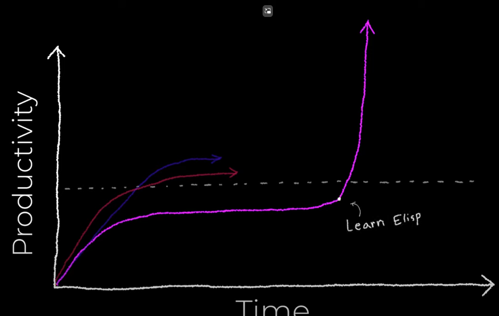

<!-- gid:20240617T164048 -->
[TOC]

[[TIP("이 노트에 대하여")]]
포지트론은 이맥스를 프로그래밍 가능한 생활 환경으로 풀어내며 오픈소스와 AI, 지식 작업을 잇는 채널을 운영한다. 영상과 강연을 통해 이맥스 문화의 현대적 확장을 보여준다.
[[/TIP]]

## BIBLIOGRAPHY

- “Explicit Tool Turns by Psionic-K · Pull Request #626 · Karthink/Gptel.” n.d. Accessed February 23, 2025. [https://github.com/karthink/gptel/pull/626](https://github.com/karthink/gptel/pull/626).
- <i>Living Programmably</i>. 2023. [https://www.youtube.com/watch?v=vhotxmO3NkQ](https://www.youtube.com/watch?v=vhotxmO3NkQ).

## 스폰서

Become a sponsor to Positron Solutions

@positron-solutions Positron Solutions, Korea, South

### Our Vision

In less than a minute. Open innovation keeps progress moving by lowering the cost of new competition, enabling faster development, and creating market fluidity, both protecting consumer choice and accelerating advancement. 1분도 채 걸리지 않습니다. 개방형 혁신은 새로운 경쟁의 비용을 낮추고, 더 빠른 개발을 가능하게 하며, 시장의 유동성을 창출하여 소비자의 선택권을 보호하고 발전을 가속화함으로써 발전을 지속합니다.

We are in this for novel materials that replace plastics or enable enable overcoming tough engineering challenges, biomedical solutions that cure disease, multi-dimensional optimization problems that deliver better products, educational solutions that scale well beyond our collective expertise, and scientific exploration augmented with rigor at our fingertips. 플라스틱을 대체하거나 어려운 엔지니어링 과제를 극복할 수 있는 새로운 소재, 질병을 치료하는 생물의학 솔루션, 더 나은 제품을 제공하는 다차원 최적화 문제, 집단적 전문성을 넘어 확장 가능한 교육 솔루션, 손끝에서 엄격함으로 강화된 과학적 탐험을 위해 노력하고 있습니다.

### Our Mission

To realize our vision, our first aim is to fix problems as old as Open Source: 비전을 실현하기 위한 첫 번째 목표는 오픈소스만큼이나 오래된 문제를 해결하는 것입니다:

The limits of legacy governance models that predate information technology and were not designed for the open communities inherent to the internet 정보 기술보다 앞서 있고 인터넷 고유의 개방형 커뮤니티를 위해 설계되지 않은 레거시 거버넌스 모델의 한계 The lack of a sales model that works between millions of perfectly willing customers and capable producers 수백만 명의 완벽한 의사를 가진 고객과 유능한 생산자 사이에서 작동하는 판매 모델의 부재 The inability to support successful software at scale 성공적인 소프트웨어를 대규모로 지원할 수 없음 Our YouTube Subscribe to our channel for updates. 채널을 구독하여 업데이트를 받아보세요.

### Our Playlists

We have three playlists:

#### Open Innovation: Updates on Positron itself, critical ideas in Open Source, and the direction and consequences of technological shifts

오픈 이노베이션: 포지트론 자체에 대한 업데이트, 오픈소스의 중요한 아이디어, 기술 변화의 방향과 결과

#### Emacs at Lunch: Deeper dives into Emacs package development, extending packages, and customizing beyond the surface

점심시간의 이맥스: Emacs 패키지 개발, 패키지 확장 및 표면을 넘어선 사용자 지정에 대해 자세히 알아보기

#### Emacs Speedrun: Only the meta-information necessary to get on a sustainable, high-potential trajectory of Emacs self-development

Emacs 스피드 런: 지속 가능하고 잠재력이 높은 Emacs 자기 개발 궤도에 오르는 데 필요한 메타 정보만 제공합니다.

### Our Emacs Work

In order to be active as a supplier of improvements to Emacs, Positron has been investing in packages like Dslide (Domain Specific sLIDEs, formerly Macro Slides), a presentation framework that enables software engineers to communicate better, using their programming tools, without wasting time on external software that provides marginally better display and much less overall capability.

소프트웨어 엔지니어가 디스플레이는 조금 더 좋고 전반적인 기능은 훨씬 떨어지는 외부 소프트웨어에 시간을 낭비하지 않고 프로그래밍 도구를 사용하여 더 나은 커뮤니케이션을 할 수 있는 프레젠테이션 프레임워크인 Dslide(도메인별 슬라이드, 이전의 매크로 슬라이드) 같은 패키지에 적극적으로 투자하고 있습니다.

### @positron-solutions

@positron-solutions's goal is to earn 5,000 달러 per month

This goal is a reference level for when we bring on more co-founders with or without product revenue. Most hardcore co-founders work from savings or salaries far below market, so all contribution goes a long way for us.

이 목표는 제품 수익이 있든 없든 더 많은 공동 창업자를 영입할 때 참고할 수 있는 수준입니다. 대부분의 하드코어 공동 창업자들은 저축이나 시장보다 훨씬 낮은 급여로 일하기 때문에 모든 기여금은 우리에게 큰 도움이 됩니다.

## "Living Programmably"  2023 Positron’s Emacs Channel

(<i>Living Programmably</i> 2023)

disruption 파괴?!

-   maturity creates integration
-   new value creation drives dis-integration
-   tools that are generic re-adapt faster
-   programs like emacs thrive on disruption

-   성숙이 통합을 창출
-   새로운 가치 창출이 탈통합을 주도
-   일반적인 도구가 더 빠르게 재적응
-   이맥과 같은 프로그램은 파괴를 통해 번창합니다

moving asymptote

[SYS]: You are a helpful assistant. Please write in Korean language.

@user Make me a list of common components of cymbols used in Emacs List expressions, but interpret each component to Korean

@assistant 알겠습니다! Emacs Lisp 표현식에서 흔히 사용되는 심볼들의 구성 요소를 한국어로 번역해 보겠습니다:

1.  **함수(function)**: 함수(function)는 어떤 연산을 수행하는 코드 블록입니다. Emacs Lisp에서는 함수를 정의하고 호출할 수 있습니다.
    -   예시: \`defun\`, \`lambda\`

2.  **변수(variable)**: 변수(variable)는 데이터를 저장하는 데 사용되는 메모리 공간입니다.
    -   예시: \`setq\`, \`let\`

3.  **조건문(condition statement)**: 조건문(condition statement)은 조건에 따라 코드의 실행 흐름을 제어합니다.
    -   예시: \`if\`, \`cond\`

4.  **반복문(loop statement)**: 반복문(loop statement)은 특정 조건이 만족될 때까지 코드를 반복해서 실행합니다.
    -   예시: \`while\`, \`dolist\`

5.  **리스트(list)**: 리스트(list)는 여러 요소를 순서대로 나열한 데이터 구조입니다.
    -   예시: \`'()\`, \`list\`, \`car\`, \`cdr\`

6.  **문자열(string)**: 문자열(string)은 텍스트 데이터를 나타냅니다.
    -   예시: \`"Hello, World!"\`, \`concat\`

7.  **숫자(number)**: 숫자(number)는 수치 데이터를 나타냅니다.
    -   예시: \`+\`, \`-\`, \`\*\`, \`/\`

8.  **연산자(operator)**: 연산자(operator)는 두 개 이상의 피연산자에 대해 특정 연산을 수행합니다.
    -   예시: \`&lt;\`, \`&gt;\`, \`=\`, \`and\`, \`or\`

9.  **매크로(macro)**: 매크로(macro)는 코드 생성을 자동화하는 도구입니다.
    -   예시: \`defmacro\`, \`macroexpand\`

각 심볼은 Emacs Lisp에서 중요한 역할을 하며, 다양한 프로그램을 작성할 때 유용하게 사용될 수 있습니다.

@user

### Faster Ramp Up 이맥스를 배우기 정말 쉬운 시대

-   Translate docs
-   Semantic search
    -   Coorection of question terminology
    -   Finding what to search for
-   Explain code
-   Suggest solution approaches
    -   quickly find bread &amp; butter

### Primrose Paths 이맥스 리스프 배우는 것

### Lisp is Compact

-   Most of a packages is fluff
-   Hyper-popular packages gain mass

### Found Everywhare

-   SBCL, Guix, Clojure, Racket
-   Scala, Haskell, Nix

### The Spares

-   LEM the Common Lisp Emacs
-   Convergent evolution dominates
-   Alternatives just become better instances

-   커먼 리스프 에맥스의 LEM
-   수렴적 진화가 지배하다
-   대안이 더 나은 인스턴스가 됩니다

### You Better Hurry

-   AGI is turning all software into Tang : The software instrumentality
-   The celestial Emacsen are waiting

-   AGI는 모든 소프트웨어를 Tang으로 바꾸고 있습니다: 소프트웨어 도구
-   천상의 에맥센이 기다리고 있습니다

speaker_note If I'm right, you want to start now. If I'm wrong, you will be in front of the wave. But either way it pays off in the long rung.

speaker_note 제가 맞다면 지금 시작하고 싶을 것이고, 제가 틀린다면 파도 앞에 서게 될 것입니다. 하지만 어느 쪽이든 긴 호흡으로 보면 좋은 결과를 얻을 수 있습니다.

## 2024-05-23 "Open Innovation: Using Emacs to Bring Depth to Open Source"  2024 Positron’s Emacs Channel

### 00:00 Intro

### 00:45 Depth vs Breadth in Open Source

### 02:10 Big Ways to Improve Emacs

### 05:00 Bringing Depth to Emacs While Bootstrapping Positron

## 지피텔 확장

[이맥스: 지피텔 활용법](https://wikidocs.net/381297)

### Explicit Tool Turns by psionic-k · Pull Request #626 · karthink/gptel

(“Explicit Tool Turns by Psionic-K · Pull Request #626 · Karthink/Gptel” n.d.)

-   

-   Draft And does not pass tests yet. Should be close to passing. Just sleepy and wanted to give PST a chance to take a look at approaches before I finish up. One of my commits almost vanished durin...
