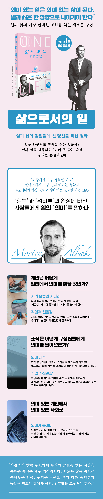

<!-- gid:20240721T222905 -->
[[TIP("이 노트에 대하여")]]
일을 생계 수단이 아닌 삶의 의미와 정체성의 문제로 바라보며 워라밸 담론을 비판적으로 성찰한다.
[[/TIP]]

<!-- provenance:source:start -->
[[TIP("원본·최신본")]]
이 페이지는 한국어 검색과 읽기를 위한 WikiDocs 미러입니다. [원본·최신본은 가든](https://notes.junghanacs.com/bib/20240721T222905/)에 있습니다. 최신 수정 내용·백링크·태그·히스토리·댓글·출처 정보는 원본 가든에서 확인하세요.

- 작성: `2024-07-21T22:29:00+09:00`
- 최근 수정: `2025-11-14T00:00:00+09:00`
[[/TIP]]
<!-- provenance:source:end -->

[TOC]

## 관련메타

-   [삶의철학라이프스타일문화](https://wikidocs.net/380534)

## BIBLIOGRAPHY

- 모르텐 알베크. 2021. <i>삶으로서의 일 : 일과 삶의 갈림길에 선 당신을 위한 철학</i>. Translated by 이지연. [https://m.yes24.com/Goods/Detail/101924220](https://m.yes24.com/Goods/Detail/101924220).

## 히스토리

-   [2025-11-14 Fri 07:36] 어쏠리즘에 하나 관련 글을 남았다. 자신을 버려야 가능한 것 관성을 벗어나려면 지구 탈출 속도로 발사되는 로켓이 되어야 한다.
-   [2025-08-20 Wed 08:51] 이 것이 1년지나 역시 화두다. 원라이프. 관조하는 삶과 연결이 되기도 한다. [한병철 피로사회 불안사회 서사의위기 리추얼의종말 정보의지배 관조하는삶 무위](https://wikidocs.net/382135)
-   [2024-08-19 Mon 17:46] 왜?! 거제도 여행 중에 W씨가 MQ 의미 지수를 이야기 했다. 이 책을 이야기하면서 나온 이야기다.

## 삶으로서의 일 : 일과 삶의 갈림길에 선 당신을 위한 철학

(모르텐 알베크 2021)

-   덴마크
-   의미 있는 일은 의미 있는 삶이 된다! 일과 삶의 가장 완벽한 조화를 찾는 새로운 방법

역사상 가장 풍요로운 시대, 우리는 일 때문에 가장 불행한 삶을 살고 있다. 일과 삶을 분리하는 '워라밸'만이 그 해답일까? 일을 하면서도 행복할 수는 없을까? 베스트셀러 철학자이자 경영인 모르텐 알베크가 워라밸을 넘어서 일과 삶을 조화시킬 새로운 방법, '의미'를 제시한다. 일과 삶이 하나임을 인정하고 그 둘을 관통하는 의미를 찾을 때 우리 삶은 온전해진다. 경영과 철학을 결합한 통합적 관점으로 일에서 의미를 찾는 방법부터 조직과 사회에서 의미를 추구할 수 있는 방법까지, 지금 우리에게 꼭 필요한 의미의 철학을 일깨워주는 안내서이다.

### 서장: 왜 우리는 행복하지 않을까

-   행복이라는 수수께끼
-   일하는 인간
-   만족, 행복, 의미의 차이

### 1장: 직장 밖의 나만이 진짜 나인가

-   삶을 쪼갤 수 있다는 거짓말
-   속도라는 새로운 신

### 2장: 어떻게 삶의 의미를 찾을 것인가

-   자기 통찰이 자기 인식을 낳는다
-   자기 인식이 자기 가치를 만든다
-   자기 가치가 자기 존중을 낳는다
-   의미: 실존적 면역 시스템

### 3장: 우리를 힘들게 하는 것은 무엇인가

-   워라밸은 답이 될 수 없다
-   "나를 내버려두세요"
-   도덕의 부재
-   리더십과 상호적 책임

### 4장: 우리는 일터를 사랑할 수 있을까

-   직업적 거리
-   아폴론과 디오니소스
-   상사를 사랑해야 하는 이유, 부하 직원을 사랑해야 하는 이유

### 5장: 의미 있는 일터는 어떻게 만들어지는가

-   IQ vs EQ vs MQ
-   의미 지수, MQ
-   성과 관리 2.0: MQ 분석
-   인적 자원 경영에서 인간 잠재력 리더십으로
-   워라밸이 아니라 일터의 유연성이 핵심이다
-   의미 대화

### 6장: 인본주의적 자본주의란 무엇인가

-   새로운 형태의 자본주의

### 7장: 충성이냐, 반란이냐

-   가치와 덕목의 차이
-   목적과 덕목을 이해하기
-   개인으로서 우리는 어디까지 가야 하는가
-   목적을 방어하기 위해 조직은 어디까지 가야 하는가

### 8장: 사회로서 우리는 어디까지 가야 하는가

-   GDP에서 행복 지수로, 다시 의미 지수로

### 책 속으로

'의미 있다meaningfulness'는 것은 욕구를 실현하거나 잠깐 기쁨이 샘솟는 것과는 다르다. 의미란 내 삶이 존엄하고 희망이 있다는 느낌이다. (...) 소속감을 느낄 때, 더 고차원적인 목적이 있을 때, 삶에서 나에게 딱 맞은 자리에 이미 와 있거나 아니면 적어도 그 자리를 향해 가고 있다고 생각할 때 느껴지는 것이 바로 의미다. --- p.32

시간을 나누면 삶이 나뉜다. 삶을 나누면 나 자신이 나뉜다. 이렇게 쪼개고 나면 삶의 각 부분이 서로 다른 요구를 유발하고 그것이 정당화된다. 직장 밖에서의 욕구나 열망은 직장 안에 있을 때 충족될 필요가 없다고 믿게 된다. (...) 그러나 우리는 오직 한 사람이다. 당연히 삶 전체를 통해 발전해나가야 할 한 명의 인간이다. --- p.45~46

오늘날 우리는 주로 사람들이 '통용되도록' 혹은 자기 자신을 마케팅할 수 있도록 교육한다. 시장에서 자기 자신을 최대한 높은 값을 받고 팔 수 있기를 바란다. 스스로를 위해 또 사회를 위해 최대의 이익을 만들어내기 위해서다. 그러면서 행복과 구원을 성취할 수 있기를 바란다. 그러나 소비를 통해 훌륭한 삶에 이를 수는 없다. 왜냐하면 의미는 전혀 다른 곳에서 발원하기 때문이다. 세상의 모든 부를 다 가져도 의미 있는 삶을 살 수는 없다. --- p.57

의미는 우리에게 실존적 면역 시스템 같은 역할을 한다. 의미는 우리가 압박을 받거나 슬픔에 잠겼을 때, 삶이 내리막일 때 반드시 발생하는 스트레스를 견뎌내고 대처할 수 있게 해준다. 우리가 기쁨이나 행복을 누릴 때에도 의미는 삶이 오르막일 때 반드시 발생하는 환희에 대처하게 해줄 뿐만 아니라 나의 자기 인식을 유지하게 해준다. --- p.88

사람은 기계보다 훨씬 더 깨지기 쉽다. 사람은 새로운 환경이나 새로운 책임, 동료, 목표, 기업 문화, 관리자가 주는 혼란에 민감하다. 인간은 편의대로 실컷 쓰면 되는 기술이나 기계가 아니다. 우리가 아무리 테플론으로 나 자신이나 서로를 코팅한다고 해도, 그 코팅 갑옷 아래에는 누군가가 나에게 견디라고 시킨 일을 생각하고 느끼고 기억하는 마음이 있다는 사실을 피할 수 없다. --- p.96

자본주의에 대한 전통적 이해, 지배적 이해는 합법적으로 돈을 버는 한, 이윤이 증가할 때 양심에 거리낄 것은 하나도 없다고 말한다. 그러나 우리는 더 이상 그게 사실이라고 우리 자신을, 서로를 속일 수 없다. --- p.174

### 출판사 리뷰

-   **덴마크 베스트셀러 1위**
-   **'세상에서 가장 행복한 나라' 덴마크에서 가장 많이 읽힌 철학자**
-   **MZ세대가 가장 일하고 싶어 하는 글로벌 기업 CEO**

일을 하면서도 행복할 수는 없을까? 일과 삶의 가장 완벽한 조화를 찾는 새로운 방법

영국에서 수만 명을 대상으로 연구한 결과 사람들은 출근보다 병에 걸려 앓아눕는 것이 더 낫다고 여겼다. 갤럽 보고서에 따르면 전 세계 노동력의 85퍼센트는 업무에 몰입하지 못하고 있다. 역사상 가장 풍요로운 시대, 우리는 일 때문에 가장 불행한 삶을 살고 있다. 일과 삶을 분리하는 '워라밸'만이 그 불행의 고리를 끊을 방법일까? 우리의 일이 이렇게 불행할 필요가 있을까? 일을 하면서도 행복할 수는 없는 걸까?

덴마크에서 가장 인기 있는 철학자이자 "세계에서 가장 영향력 있는 CMO(최고마케팅책임자) 100인" 모르텐 알베크는 《삶으로서의 일》(원제: One Life)에서 일과 삶을 분리하는 '워라밸'에 반기를 든다. 그에 따르면 워라밸은 근본적으로 잘못된 개념이다. '일터의 나'와 '집에서의 나'는 결국 한 사람이기 때문이다.

그는 이 워라밸 개념을 넘어서 일과 삶의 조화가 가능한 새로운 답을 제시한다. 바로 '의미'다. 그는 우리에게 일의 의미를 다시 생각해볼 것을 제안한다. 일의 '의미'가 삶의 '의미'와 일치할 때, 우리는 온전한 삶을 살 수 있다. 《삶으로서의 일》은 경영과 철학을 결합한 통합적 관점으로 개인이 일에서 의미를 찾는 방법뿐 아니라 조직과 사회에서 의미를 추구할 수 있는 방법까지 제시한다. 지금 우리에게 꼭 필요한 '의미'의 철학을 일깨워주며 덴마크에서 출간 즉시 베스트셀러에 올랐다.

워라밸은 환상에 불과하다! 우리의 삶에서 떨어져 나간 일 되찾기

"사랑하지 않는 무언가에 우리가 그토록 많은 시간을 쓴다는 사실은 매우 역설적이다. 이토록 많은 시간을 쏟아붓는 만큼, 우리는 일에도 삶의 다른 측면들과 똑같은 정도의 참여와 사랑, 친밀함을 요구해야 한다."_47쪽

싫든 좋든 일은 우리의 삶에서 아주 중요한 부분을 차지한다. 초조하게 퇴근 시간만 기다린 적이 있는가? 출근해야 한다는 생각에 일요일 저녁부터 마음이 무거워지는가? 퇴사만 하면 행복을 찾을 수 있을 것 같은가? 그렇다면 당신은 일을 고통스러운 것으로 인식하고 일과 최대한 거리를 두고 있는 것이다.

우리는 이 경계를 지울 필요가 있다. 직장에서의 일과 고민을 집으로까지 끌고 오라는 것이 아니다. 힘든 일을 무작정 긍정적으로 바라보라는 것도 아니다. 이 책은 일과 삶이 하나임을 인정하는 것, 그리고 일과 삶을 관통하는 '의미'를 찾는 것이 우리의 삶 전체를 고양할 수 있는 방법이라고 말한다.

의미란 무엇일까? 저자는 아리스토텔레스의 '행복'(유다이모니아, 최고선)을 예로 든다. 아리스토텔레스의 행복은 우리가 흔히 생각하는 기쁨, 황홀과 같은 감정이 아니었다. 인생에서 고수해야 할 윤리적 덕목, 혹은 삶의 태도였다. 저자는 그 관점을 이어받아 '의미'를 '실존적 면역 시스템'으로 명명한다. '의미'는 우리가 압박을 받거나 슬픔에 잠겼을 때도, 우리가 기쁨이나 행복을 누릴 때도 중심을 잡을 수 있게 해준다.

저자에 따르면 "소속감을 느낄 때, 더 고차원적인 목적이 있을 때, 삶에서 나에게 딱 맞은 자리에 이미 와 있거나 아니면 적어도 그 자리를 향해 가고 있다고 생각할 때" 우리는 '의미'를 느낀다. 예를 들면 내가 그저 부품으로 여겨지지 않을 때, 내가 하는 일이 사회에 도움이 될 때, 내가 삶에서 추구하는 가치가 회사의 가치와 일치할 때다. 이 '의미'는 우리의 성취와도 직결된다. 한 조사 결과에 따르면 자신의 일이 의미 있다고 생각하는 직원은 일이 그저 만족스러운 직원에 비해 생산성이 최고 다섯 배나 높다.

의미 있는 일은 의미 있는 삶이 된다 일과 삶의 균형을 넘어 일과 삶의 화해로 나아가는 법

\*개인은 어떻게 일터에서 의미를 찾는가? "우리는 출근 전과 퇴근 후에만 친밀함과 사랑을 경험하는 것으로 충분하다고 우리 자신을 속여왔다. 하지만 인간의 마음은 그런 식으로 작동하지 않는다. 그렇게 긴 시간 동안 친밀함을 느끼지 못하면서 삶이 여전히 의미 있기를 바랄 수는 없다."_100~101쪽 -자기 존중의 사다리: 의미를 찾기 위해서는 '자기 통찰' '자각' '자존감' '자기 존중'의 4단계 사다리를 올라야 한다. 스스로를 객관적으로 파악하고 중심을 잡아라. 자기 존중에 이르면 자신의 시간과 노력의 가치를 알게 되고, 해야 할 일과 하지 않아도 될 일을 구분하기가 더 쉬워진다. -직업적 친밀감: 많은 사람이 직장에서 사람들과 거리를 두고 싶어 하지만, 친밀감이 없는 일터에서 의미를 찾기란 불가능하다. 조직 차원에서 동료와 부하, 상사 간에 일상적인 작은 소통을 시작하라. -충성이냐, 반란이냐: 나의 삶과 조직이 서로 다른 방향으로 가고 있다면, 스스로 질문을 던져라. 충성할 것인가, 반란을 일으킬 것인가? 아무리 해도 답이 보이지 않는다면, 어디까지 노력할 것인지 선을 그어라.

\*조직은 어떻게 구성원들에게 의미를 불어넣는가? "관리자로서 당신은 직원들의 삶에서 상대적으로 큰 덩어리를 손에 쥐게 된다. 당신은 직원들이 병들지 않게 할 책임이 있으며, 그들의 삶이 의미 있어지게끔 도와줄 책임이 있다."_109쪽 -의미 지수: 2013년 맥킨지는 기업평가항목에 MQ(의미 지수)를 추가했다. 직장에서의 의미가 삶에서 중요한 부분이 되었다는 증거다. 그리고 직장이 의미 있는 장소가 되기 위해서 가장 중요한 것은 관리자, 즉 리더의 역할이다. 리더는 조직 구성원들이 일에서 의미를 찾고 있는지 끊임없이 체크해야 한다. -기업 행동주의: 기업은 구성원들이 이의를 제기할 수 있고 그것을 받아들일 수 있는 체계를 마련해야 한다. 좋은 직원을 영입하고 보유하기 위해서는 조직보다 더 중요한 것은 아무것도 없다고 그저 열변을 토하는 것만으로는 충분하지 않다.

\*의미 있는 개인에서 의미 있는 사회로 "우리를 둘러싼 대기를 규제하는 것도 가능한데, 일이 우리의 삶에 얼마나 의미를 주는지 규제하는 게 꼭 비현실적일까?"_205쪽 -인본주의적 자본주의: 돈보다는 의미를 내세우는 움직임은 사회 전반으로 퍼지고 있다. 이 '인본주의적 자본주의'를 퍼뜨리기 위해서는 사회 전반에서 규제가 필요하다. '의미 있는 기업'이 '성공하는 기업'이 되는 사회를 대비하라.

저자에게 있어 '의미 없는 일'은 기후 변화만큼이나 심각하고 근본적인 문제다. 그러나 그는 낙관적인 미래를 제시한다. 일에서 의미를 찾는 개인의 움직임이 결국 사회 전체를 변화시킬 것을 믿는다. 그리고 이를 위해 이 책을 썼다. 《삶으로서의 일》은 일의 의미를 찾아 성장하려는 사람들, 그리고 조직 내에서 의미를 전파하려는 사람들에게 유용한 안내서가 될 것이다.

### 관련 이미지

## 저 : 모르텐 알베크 (Morten Albæk)

철학자이자 경영인, 교수, 베스트셀러 작가, 강연가. 의미 없는 삶은 기후 변화만큼이나 심각하게 대해야 할 문제라고 생각한다. 2008년부터 덴마크 올보르대학교의 철학 및 교육 명예교수를 지냈으며, 여러 기업을 거쳐 2015년 컨설팅 회사 볼룬타스(Volunt?s)를 설립하고 의미 있는 조직문화와 전략에 관해 자문하고 있다. 또한 북유럽에서 가장 빠르게 성장하는 브랜드인 조앤더주스(Joe &amp; The Juice)의 부회장으로서, 직원들이 일에서 의미를 찾는 것을 최우선으로 하는 경영 철학을 실천 중이다. 〈인터내셔널리스트〉의 '세계에서 가장 영향력 있는 CMO(최고마케팅책임자) 100인'에 5회 선정되었다.

이 책에서 그는 일과 삶을 분리하는 '워라밸'에 반기를 든다. '일터의 나'와 '집의 나'가 결국 한 사람이라는 것을 인정하고 일에서 의미를 찾아야 온전한 삶을 누릴 수 있다고 말한다. 경영과 철학을 결합한 독특한 관점이 돋보이는 그의 책은 현지에서 큰 반향을 불러일으키며 베스트셀러 1위에 올랐다.

[우리 삶에서 일이란 무엇일까? 모르텐 알베크의 〈삶으로서의 일〉 - youtu.be](https://youtu.be/ps-O9Aoygs4?si=4MyCNWB6tb1peXcx)
