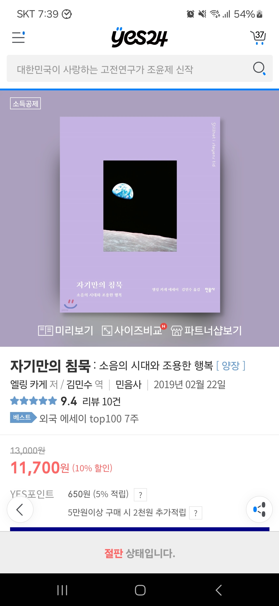

<!-- gid:20240820T153819 -->
[[TIP("이 노트에 대하여")]]
남극 탐험과 일상 산책, 침묵의 시간을 통해 조용한 행복과 내면의 회복력, 사유를 길어 올린다.
[[/TIP]]

<!-- provenance:source:start -->
[[TIP("원본·최신본")]]
이 페이지는 한국어 검색과 읽기를 위한 WikiDocs 미러입니다. [원본·최신본은 가든](https://notes.junghanacs.com/bib/20240820T153819/)에 있습니다. 최신 수정 내용·백링크·태그·히스토리·댓글·출처 정보는 원본 가든에서 확인하세요.

- 작성: `2024-08-20T15:38:00+09:00`
- 최근 수정: `2025-04-05T00:00:00+09:00`
[[/TIP]]
<!-- provenance:source:end -->

[TOC]

## BIBLIOGRAPHY

- 엘링 카게. 2019. <i>자기만의 침묵 : 소음의 시대와 조용한 행복</i>. Translated by 김민수. 믿음사. [https://m.yes24.com/goods/detail/69773001](https://m.yes24.com/goods/detail/69773001).
- ———. 2020. <i>남극으로 걸어간 산책자</i>. [https://m.yes24.com/Goods/Detail/86642930](https://m.yes24.com/Goods/Detail/86642930).

## Related-Notes

-   [산책](https://wikidocs.net/380617)
-   [모르텐알베크 삶으로서의 일 : 일과 삶의 의미 - 삶의철학](https://wikidocs.net/382014)

## History

-   [2025-04-05 Sat 05:09] [갈매기의꿈 상처받지않는영혼 무지의앎](https://wikidocs.net/381326) 이 노트를 다시 보다가 그 때 근방에 이 노트의 흔적을 보고 서재에 담았다.

## 남극으로 걸어간 산책자

(엘링 카게 2020)

-   엘링 카게
-   아무 장비 없이 지구 3극점을두 발로 정복한 남자의 일상 산책여기, 한 산책자가 있다. 한 번에 한 걸음씩 기어코 남극까지 걸어간 산책자가 있다. 1990년, 27세의 노르웨이 청년은 세계 최초로 걸어서 남극에 도착했다. 그리고 3년 뒤, 또 다시 그는 걸어서...

## 자기만의 침묵 : 소음의 시대와 조용한 행복

(엘링 카게 2019)

-   엘링 카게 {김민수}
-   『자기만의 침묵』은 노르웨의의 극지 탐험가이자 작가인 엘링 카게가 남극 탐험 과정에서 경험한 침묵을 바탕으로 철학, 음악, 문학, 미술을 망라하는 다양한 분야의 저명한 사람들이 어떻게 침묵을 정의하고 자기만의 침묵을 만들어 냈는지 탐색한 생활 철학서다.
-   2019

### 책소개

『자기만의 침묵』은 노르웨의의 극지 탐험가이자 작가인 엘링 카게가 남극 탐험 과정에서 경험한 침묵을 바탕으로 철학, 음악, 문학, 미술을 망라하는 다양한 분야의 저명한 사람들이 어떻게 침묵을 정의하고 자기만의 침묵을 만들어 냈는지 탐색한 생활 철학서다. 예수, 아리스토텔레스, 비트켄슈타인, 존 케이지, 뭉크, 올리버 색스 등 철학, 음악, 문학, 미술을 망라하는 다양한 분야의 저명한 사람들이 추구한 침묵 애호는 관념으로서의 침묵을 생활 수단으서의 침묵으로 변화시킨다. 다양한 사례와 자료를 통해 침묵의 가치를 재조명하고 실생활에서 침묵을 만들어 가는 방법을 무겁지 않으면서도 구체적으로 전달하는 이 책은 침묵이 인생을 경험하는 우아한 방법이자 시간을 사용하는 신비로운 체험임을 증언한다.

Based on the silence that Norwegian polar explorer and writer Elling Kage experienced during his Antarctic expeditions, this book is a philosophy of life that explores how prominent figures in philosophy, music, literature, and art have defined silence and created their own silences. The love of silence, pursued by such luminaries as Jesus, Aristotle, Wittgenstein, John Cage, Munch, Oliver Sacks, and many others, transforms silence as an idea into silence as a way of life. Through a variety of examples and resources, this book reaffirms the value of silence and offers concrete, yet not heavy-handed, advice on how to create silence in real life, testifying that silence is an elegant way to experience life and a mystical experience of time.

### 책 속으로

“인간의 모든 문제는 방에 혼자 조용히 앉아 있지 못하는 데서 시작된다.” --- 본문 중에서

“침묵은 본질적으로 풍요롭다. 침묵은 고급이다. 뭔가 특권적이고 호화롭다. 침묵은 새로운 사고방식의 비밀을 풀어줄 열쇠다. 나는 침묵을 금욕적이거나 영적인 것으로 여기지 않는다. 그보다는 더 풍요로운 인생을 살기 위한 실제적인 원천이라고 여긴다.” --- 본문 중에서

“침묵은 당신이 하고 있는 일 속으로 들어가는 것이다. 너무 많이 생각하기보다는 그저 경험하는 것이다. 매순간이 중요한 순간이 되도록 하는 것이다. 다른 사람들, 다른 사물들을 통해 사는 것이 아니다. 세상을 차단하고 당신 자신의 침묵을 빚어내는 것이다. 당신이 뛰고 요리하고 섹스하고 공부하고 일하고 새로운 아이디어를 구상하고 책을 읽고 춤을 출 때마다 그러는 것이다.” --- 본문 중에서

“우리는 샴페인 잔을 손에 들고서 왔다가 가 버린 세월에 대해 그럴싸한 말을 만들어 내기보다는 스물한 번째 생일을 맞이한 날에 스토아 철학자 세네카의 다음과 같은 조언에 귀 기울여야 한다. ‘사용법을 안다면 인생은 길다.’” --- 본문 중에서

“소음은 계급 분화와도 관련이 있다. 부수적인 소음 때문에 방해받는 사람을 제외한 다른 사람이 만들어내는 소음들은 사회에 커다란 격차를 만드는 기반을 제공한다. 일반적으로 낮은 계급의 사람들은 높은 계급의 사람들보다 일터에서 더 많은 소음을 참고 견뎌야 하며, 그들이 사는 집은 방음이 형편없어서 옆집의 소음으로부터 보호받지 못한다. 부자들이 사는 집은 소음은 더 적고 공기는 더 쾌적하며, 그들이 타는 차는 더 조용하게 달린다. 세탁기도 더 조용하게 돌아간다. 부자들은 더 많은 여가를 누리고 더 깨끗하고 건강한 음식을 먹는다. 침묵은 소수의 사람들에게 나머지 대다수 사람들보다 더 오래, 더 건강하게, 더 부유하게 살 기회를 주는 격차의 일부가 되어가고 있다.” --- 본문 중에서

“당신이 경험하는 침묵은 다른 사람이 경험하는 침묵과 다르다는 것을 명심하라. 누구에게나 자기만의 침묵이 있다.” --- 본문 중에서

### 출판사 리뷰

아리스토텔레스, 비트켄슈타인, 존 케이지, 뭉크, 올리버 색스… 그들은 모두 침묵을 사랑했다! 철학, 음악, 문학, 미술을 망라하는 다양한 분야의 명사들이 저마다의 방식으로 추구했던 침묵의 기술을 통해 건강한 삶을 지탱해 주는 조용한 행복의 비밀을 만나 본다.

성장하는 침묵 산업

침묵센터는 최근 성장하고 있는 산업 가운데 하나다. 미국 LA 선셋 대로가 끝나는 곳에 위치한 ‘레이크 쉬라인(Lake Shrine)’ 사원은 “고독한 침묵”을 약속한다. 외국의 풍경만이 아니다. 힐링, 휘게, 욜로, 소확행의 중심에는 고요함이 있다. 고독과 침묵에 대한 수요는 우리 시대의 특징인 ‘소음’에서 발생한다. 소음의 시대. 침묵은 거의 멸종되었다. 정보 과잉의 시대에 우리는 끊임없이 연결되어 있다. 더욱이 그로 인한 스트레스를 호소하는 현대인의 진짜 비극은 바쁨에 대한 욕구에마저 익숙해져 있다는 데에 있다. 필요한 건 자기만의 방만이 아니다. 방에 있어도 소란은 끊이지 않는다. 우리에게는 자기만의 침묵이 필요하다. 그러나 침묵에 접근할 수 있는 길은 모두에게 똑같이 열려 있지 않다. 침묵에 접근할 수 있는 기회는 불평등하고 어떤 이에게 침묵은 사치품에 지나지 않는다. 침묵이란 무엇인가. 어떤 것이 침묵인가. 그리고 그것을 우리는 어떻게 사용할 수 있는가.

탐험가의 생생한 경험기

누구나 침묵할 수 있지만 모두가 침묵할 수 있는 건 아니다. 침묵에 대한 여느 책과 달리 이 책은 작가의 독특한 이력에서 나오는 생생하고 구체적인 침묵의 체험기다. 본문 중간중간 극지의 절대 고독을 전하는 사진 역시 작가가 직접 찍은 것이다. 설상 스쿠터도 개썰매도 식량 저장소도 없이 세계 최초로 북극에 도착한 엘링 카게는 1993년, 역사상 최초로 혼자, 그것도 걸어서 남극에 도착했다. 1994년에는 에베레스트 정상에도 올랐다. 세계 최초로 남극점, 북극점, 에베레스트를 정복하며 [타임] 지로부터 “모험의 한계를 밀어내고 있는 현대의 탐험가”라는 극찬을 받은 그가 한계 상황에서 마주한 것은 침묵의 순간들이다. 존재의 결정체와도 같은 그 완결한 순간의 경험은 산에서 내려온 뒤에도 잊혀지지 않았다. 오히려 그와 함께하는 삶의 무기가 되었다. 어느 탐험가의 체험은 침묵에 대해 우리가 물어야 할 33개의 질문과 대답으로 다시 태어났다. 이것이야말로 경험하는 책이다. 침묵이 우리 시대의 필수 ‘사치품’이라는 사실을 느끼는 데에는 많은 시간이 필요하지 않을 것이다.

### 추천평

“소음을 차단하라. 내면의 침묵이야말로 행복의 열쇠다.”

-   이브닝 스탠더드

“침묵의 중요성에 대한 유창하고 설득력 있는 주장. 인간 경험의 한계를 경험한 저자가 가능한 모든 형태의 침묵을 보여 준다.”

-   커커스 리뷰

“도시 생활자들을 위한 작고 현명한 책. 침묵은 시간을 보내는 가장 우아한 방법이다.”

-   치태 고로드 (chitai-gorod, 러시아 온라인 서점)

“독자들은 이제 매일같이 반복되는 혼란의 소용돌이를 의식의 힘으로 떠날 수 있게 되었다.”

-   퍼블리셔스 위클리

### 2024 만난 날

