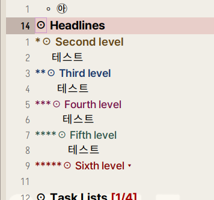

<!-- gid:20240830T133416 -->
[TOC]

[[TIP("이 노트에 대하여")]]
org-indent와 indent-bars를 중심으로 조직모드의 계층 구조를 시각화하는 방법과 읽기 흐름의 차이를 살핀다. 이맥스에서 구조가 보이는 방식이 실제 작업 감각을 어떻게 바꾸는지도 중요하다.
[[/TIP]]

## 히스토리

-   [2025-06-20 Fri 16:36] 지금와서 말하지만 indent-bars 로 정리된지 오래다 조직모드 측면에서도 보라

## 관련메타

-   [템플릿 양식 규격 서식 스펙](https://wikidocs.net/380528)
-   [린터 - 교열 린팅 문장 오류 검사](https://wikidocs.net/380549)

## BIBLIOGRAPHY

- “Emacs: Maintaining Proper Indentation in Indentation-Sensitive Programming Languages.” n.d. Accessed August 30, 2024. [https://www.jamescherti.com/elisp-code-and-emacs-packages-for-maintaining-proper-indentation-in-indentation-sensitive-languages-such-as-python-or-yaml/](https://www.jamescherti.com/elisp-code-and-emacs-packages-for-maintaining-proper-indentation-in-indentation-sensitive-languages-such-as-python-or-yaml/).
- “Jdtsmith/Indent-Bars.” 2025. [https://github.com/jdtsmith/indent-bars](https://github.com/jdtsmith/indent-bars).

## 조직모드 org-indent 스크린샷

### 2023 Indentation

[2023-08-24 Thu 10:23]

이게 나의 베스트다

## 관련노트

-   [jdtsmith 이맥스 구루 편집 패키지 ultra-scroll outli eglot-booster indent-bars magit-blame](https://wikidocs.net/382362)

## jdtsmith/indent-bars

(“Jdtsmith/Indent-Bars” 2025)

-   Smith, J. D. 2025
-   Fast, configurable indentation guide-bars for Emacs

## 둠이맥스 모듈 :ui

-   [둠이맥스 모듈](https://wikidocs.net/381193)

-   :ui indent-guides
-   Line up them indent columns

## 관련링크

### Emacs: Maintaining proper indentation in indentation-sensitive programming languages

(“Emacs: Maintaining Proper Indentation in Indentation-Sensitive Programming Languages” n.d.)
