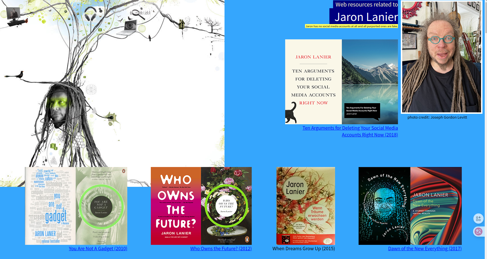

<!-- gid:20240912T180601 -->
[TOC]

[[TIP("이 노트에 대하여")]] 재런 러니어는 가상현실과 SNS 플랫폼의 설계가 인간의 현실감과 사회성을 어떻게 바꾸는지 경고한다. 니콜라스 카는 인터넷과 검색이 깊이 읽기, 기억, 집중, 사고 능력을 어떻게 재배선하는지 묻는다. 두 사람을 함께 두면 “기술은 편리한 도구인가, 아니면 인간 정신의 형식을 바꾸는 환경인가”라는 질문이 선명해진다. 이 질문은 나오미 배런의 『읽지 않는 사람들』과 연결되어, AI가 대신 읽고 쓰는 시대에 인간이 무엇을 직접 붙들어야 하는지로 이어진다. [[/TIP]] 히스토리 - [2026-06-19 Fri 08:50] 수선 — 제목 /description/abstract를 “기술이 인간 정신을 바꾸는 방식” 축으로 정리하고, [나오미배런: 읽기·쓰기·AI 리터러시 — 다시 어떻게 읽고 쓸 것인가](https://wikidocs.net/382316) 및 『읽지 않는 사람들』과 연결했다.
-   [2026-01-22 Thu 22:24] 이 생각이 났다. - [2025-06-16 Mon 15:15] 제런러니어 선생을 보니 김정운 삼촌과 비슷하다 느낌이. 외모가 [김정운 1962 창조적시선 에디톨로지 편집](https://wikidocs.net/381885)

## 관련메타

-   [미디어 리터러시 문해력](https://wikidocs.net/380771) — 미디어 환경에서 읽고 의심하고 해석하는 힘.
-   [독서 리딩 읽기](https://wikidocs.net/380559) — 깊이 읽기와 AI 읽기 외주화의 반대축.
-   [관념 아이디어 발상 사고 생각 궁리 사유 파편](https://wikidocs.net/380888) — 생각하지 않음/사고 퇴화의 개념 자석.
-   [인지 메타인지 인지심리 인지과학 인식](https://wikidocs.net/380727) — 뇌 가소성, 주의, 기억, 인지적 구두쇠 문제.
-   [기억 상상 추억 회상 꿈 자각몽](https://wikidocs.net/380907) — 기억 아웃소싱과 문화의 시듦.
-   [집중 몰입](https://wikidocs.net/380590) — 인터넷/하이퍼텍스트가 분산시키는 주의.
-   [소셜미디어 소셜네트워크서비스 누리소통망](https://wikidocs.net/380696) — 러니어의 SNS 플랫폼 비판.
-   [가상머신 가상환경 가상현실](https://wikidocs.net/380812) — 러니어의 VR·현실감 축.
-   [테크늄](https://wikidocs.net/380971) — 기술을 생태계로 보는 장기 축.
-   [기술 7](https://wikidocs.net/380850) — 기술과 인간 노동·이해 방식의 변화.

## BIBLIOGRAPHY

  니콜라스 카. 2020. <i>생각하지 않는 사람들</i>. [https://www.yes24.com/product/goods/92744494](https://www.yes24.com/product/goods/92744494).
  재런 러니어. 2017. <i>미래는 누구의 것인가</i>. Translated by 노승영. [https://www.yes24.com/product/goods/35439857](https://www.yes24.com/product/goods/35439857).
  ———. 2018. <i>가상 현실의 탄생 - VR 과학</i>. Translated by 노승영. [https://m.yes24.com/Goods/Detail/67505485](https://m.yes24.com/Goods/Detail/67505485).
  ———. 2019. <i>지금 당장 당신의 SNS 계정을 삭제해야 할 10가지 이유</i>. Translated by 신동숙. 글항아리. [https://m.yes24.com/goods/detail/76959847](https://m.yes24.com/goods/detail/76959847).
  ———. n.d. “Jaron Lanier’s Homepage.” Accessed June 16, 2025. [https://www.jaronlanier.com/](https://www.jaronlanier.com/).
  “재런 러니어 Jaron Lanier.” 2025. [https://en.wikipedia.org/w/index.php?title=Jaron_Lanier&#38;oldid=1294847569](https://en.wikipedia.org/w/index.php?title=Jaron_Lanier&oldid=1294847569).

## 관련노트

-   [나오미배런: 읽기·쓰기·AI 리터러시 — 다시 어떻게 읽고 쓸 것인가](https://wikidocs.net/382316) — 『생각하지 않는 사람들』에서 『읽지 않는 사람들』로 이어지는 읽기/사고 퇴화 축.
-   [힣: 링크드인 날것 공개면 — AI 크롤러 시대의 손가락 프롬프트](https://wikidocs.net/381631) — AI가 대신 쓰고 읽는 플랫폼 표면에 대한 힣의 현재 사례.
-   [힣: 원석 날것을 휘갈긴다 — POSSE 너머 ROSSE, 그리고 일일일생으로의 회귀](https://wikidocs.net/381617) — 기술 환경 속에서도 인간이 직접 쓰는 원석을 보존하는 운영 원칙.
-   [힣: 생각의필요없는시대 앎의의미](https://wikidocs.net/381420) — “생각이 필요 없는 시대”라는 힣식 문제 제기.
-   [케빈켈리 kevinkelly 기술의충격 통제불능 미래 테크늄 포춘쿠키 구루 와이어드 사상](https://wikidocs.net/381886) — 기술 생태계/테크늄의 낙관축과 러니어·카의 비판축을 대조한다.

## 연결축 — 생각하지 않는 사람들에서 읽지 않는 사람들로

[2026-06-19 Fri]

니콜라스 카의 『생각하지 않는 사람들』은 인터넷이 인간의 뇌와 사고 습관을 바꾸는 문제를 다룬다. 핵심은 단순히 “사람들이 책을 덜 읽는다”가 아니다. 검색, 하이퍼텍스트, 멀티태스킹, 알림, 스캐닝 습관이 깊이 읽기와 장기 기억, 사색의 시간을 재구성한다는 점이다. 인간은 정보를 더 많이 접하지만, 생각을 오래 붙드는 근육을 잃을 수 있다.

나오미 배런의 『읽지 않는 사람들』은 이 문제를 AI 시대의 다음 국면으로 옮긴다. 이제 사람은 인터넷 때문에 산만해지는 데서 멈추지 않고, 읽기 자체를 AI에게 맡긴다. “생각하지 않는 사람들”이 검색과 네트워크가 사고를 얕게 만드는 시대라면, “읽지 않는 사람들”은 AI가 대신 읽고 해석하고 판단해 주는 시대다. 둘 사이의 다리는 이것이다.

> 기억을 아웃소싱하면 문화는 시들고, 읽기를 외주화하면 이해는 자기 안에서 일어나지 않는다.

러니어는 여기에 사회적·경제적 플랫폼 비판을 더한다. SNS와 무료 플랫폼은 사용자를 돕는 도구처럼 보이지만, 실제로는 사용자의 주의·관계·정체성을 조작 가능한 데이터로 바꾼다. 카가 “인터넷이 뇌를 어떻게 바꾸는가”를 묻고, 배런이 “AI가 대신 읽는 동안 인간은 무엇을 하지 않는가”를 묻는다면, 러니어는 “누가 그 환경을 설계했고 누가 이익을 보는가”를 묻는다.

힣 가든에서 이 노트의 자리는 기술 비판의 금지선이 아니다. 기술을 버리자는 말이 아니라, 기술이 인간의 정신 형식을 바꾸는 방식을 알아차리자는 자석이다. 에이전트가 읽고 요약하고 연결해도 좋다. 다만 인간이 직접 읽고, 직접 쓰고, 이해가 자기 안에서 일어나는 자리는 끝까지 남겨야 한다.

## 관련링크

### Jaron Lanier's Homepage

재런 러니어 (재런 러니어 n.d.)

### 재런 러니어 Jaron Lanier 1960

(“재런 러니어 Jaron Lanier” 2025)

자론 제펠 래니어(1960년 5월 3일 출생)는 미국의 컴퓨터 과학자, 시각 예술가, 컴퓨터 철학 작가, 기술자, 미래학자, 현대 클래식 음악 작곡가입니다. 가상 현실 분야의 창시자로 여겨지는 래니어와 토마스 짐머만은 1985년 아타리를 떠나 VR 고글과 유선 장갑을 판매한 최초의 회사인 VPL 리서치(VPL Research, Inc.)를 설립했습니다. 1990년대 후반에는 인터넷2의 애플리케이션을 개발했으며, 2000년대에는 실리콘 그래픽스 및 여러 대학에서 방문 학자로 활동했습니다. 2006년부터 Microsoft에서 일하기 시작했으며, 2009년부터는 Microsoft Research에서 학제 간 과학자로 일하고 있습니다. 래니어는 현대 클래식 음악을 작곡했으며 희귀 악기 수집가로서 1~2천 개의 악기를 소장하고 있으며, 그의 어쿠스틱 앨범인 Instruments of Change(1994)에는 케네 입 오르간, 설링 플루트, 시타르 같은 에스라즈 등 아시아 관악기와 현악기가 등장합니다. 래니어는 마리오 그리고로프와 팀을 이루어 다큐멘터리 영화 제3의 물결(2007)의 사운드트랙을 작곡했습니다. 2005년에는 Foreign Policy에서 래니어를 100대 공공 지식인 중 한 명으로 선정했습니다. 2010년에는 TIME이 선정한 가장 영향력 있는 100인에 이름을 올렸습니다. 2014년에는 Prospect에서 래니어를 세계 50대 사상가 중 한 명으로 선정했습니다. 2018년에는 Wired에서 지난 25년간 기술 역사상 가장 영향력 있는 25인 중 한 명으로 래니어를 선정했습니다.

## @니콜라스카 생각하지 않는 사람들

(니콜라스 카 2020)

디지털 시대에 대한 경고, 그 후로 10년… "인류의 사고 능력은 기술 혁명의 희생양이 되었다"

세계적인 경영컨설턴트이자 IT 미래학자인 니콜라스 카의 베스트셀러 『생각하지 않는 사람들』이 출간 10주년을 맞아 개정증보판으로 돌아왔다. 우리 시대 가장 중요한 논쟁거리의 토대가 되어 전 세계의 주목을 받은 이 책은, 인류가 인터넷이 주는 풍요로움을 즐기는 동안 '생각하는 능력'을 잃어가고 있음을 시사한다.

특히 이번 개정증보판에는 인터넷이 인간의 뇌에 미친 영향에 대한 깊이 있는 연구 결과와 우리를 프로그램화하는 거대 소셜미디어 기업에 대한 폭로가 담겨 있다. 언택트 시대의 도래와 함께 10년 전보다 더 중요한 의미를 가지게 된 이 책은 인류의 사고 능력이 퇴화하는 현실을 다시 한번 경고한다.

### 서문: 감시견과 도둑

### 1부 문자 혁명과 인간 사고의 확장

#### 1장 컴퓨터와 나

인터넷은 단순한 정보의 유통 수단이 아니다

-   뇌를 잃어버리다

#### 2장 살아 있는 통로

-   인간의 뇌가 지닌 놀라운 복잡성
-   우리의 뇌는 변할 수 있는가
-   뇌의 가소성
-   뇌는 우리가 사고하는 대로 바뀐다
-   가장 바쁜 자의 생존
-   뇌가 생각하는 뇌

#### 3장 문자, 새로운 사고의 도구

기술은 혁명적 사고방식을 만든다

-   문자가 우리의 사고에 미치는 영향

#### 4장 사고가 깊어지는 단계

-   깊이 읽기의 시작
-   구텐베르크, 세상을 바꾸다
-   책장을 넘어선 새로운 세상의 도래
-   리 디포리스트와 그의 놀라운 오디온

### 2부 인터넷, 생각을 넘어 뇌 구조까지 바꾸다

#### 5장 가장 보편적인 특징을 지닌 매체

-   인터넷 사용 증가의 영향
-   인터넷에 잠식당한 미디어들
-   미디어 소비 형태의 변화들

#### 6장 전자책의 등장, 책의 종말?

-   디지털 리더기의 미래를 보여주는 킨들의 등장
-   글쓰기 형태에 미칠 영향
-   책이 과연 다른 미디어로 대체될 것인가
-   멀티태스킹의 진실

#### 7장 곡예하는 뇌

-   우리의 뇌는 인터넷에 민감하게 반응한다
-   뇌가 혹사당하면 산만해진다
-   하이퍼텍스트와 인지 능력의 상관관계
-   인터넷은 당신의 집중력을 분산시킨다
-   문서를 스캐닝하는 방식의 읽기
-   온라인 습관의 영향
-   직접 아는 지식 vs. 찾을 수 있는 지식
-   평균 IQ 점수가 점차 높아지고 있다고?

#### 8장 '구글'이라는 제국

-   구글, 정보를 빠르게 스캔하게 만들다
-   모든 지식은 구글로 모인다
-   구글 북서치, 책 디지털화의 전주곡
-   효율적 정보 수집 vs. 비효율적 사색
-   구글, 천사의 선물인가 악마의 유혹인가?

#### 9장 검색과 기억

-   기억의 강화는 유전학적 변이를 기반으로 한다
-   인간의 기억은 끊임없이 갱생한다
-   인터넷이 우리를 망각에 익숙해지게 만든다
-   기억을 아웃소싱하면 문화는 시들어간다
-   나의 고백

#### 10장 컴퓨터, 인터넷 그리고 인간

-   도구가 가져오는 가능성과 한계
-   가장 인간적인 것들과 맞바꾼 기술
-   신경 시스템과 컴퓨터, 닮아서 더 위험하다
-   컴퓨터, 스키마 형성을 위한 뇌의 능력을 감소시키다
-   기술의 광란을 맞이하다

#### 개정판에 부치는 후기: 세상에서 가장 흥미로운 일

## @제런러니어 지금 당장 당신의 SNS 계정을 삭제해야 할 10가지 이유

(재런 러니어 2019) 재런 러니어 신동숙 2019

이번에 글항아리에서 출간한 『지금 당장 당신의 SNS 계정을 삭제해야 할 10가지 이유』는 우리가 SNS를 사용하면서 느끼는 피로감의 원인과 SNS가 유발하는 사회적 문제를 SNS의 작동 알고리즘과 소셜미디어 대기업의 사업 방식을 들어 지적한다. 컴퓨터과학자인...

## @제런러니어 가상 현실의 탄생 - VR 과학

(재런 러니어 2018) 재런 러니어 노승영 2018

『월 스트리트 저널』 2017년 비즈니스 리더들이 뽑은 가장 좋아하는 책『이코노미스트』 2017년 최고의 책『복스』 2017년 최고의 책VR의 아버지 재런 러니어, 자신과 과학을 말하다가상 현실의 아버지, 실리콘 밸리의 구루로 평가받는 재런 러니어

## @제런러니어 미래는 누구의 것인가

(재런 러니어 2017) Who Owns the Future 재런 러니어 노승영 2017
