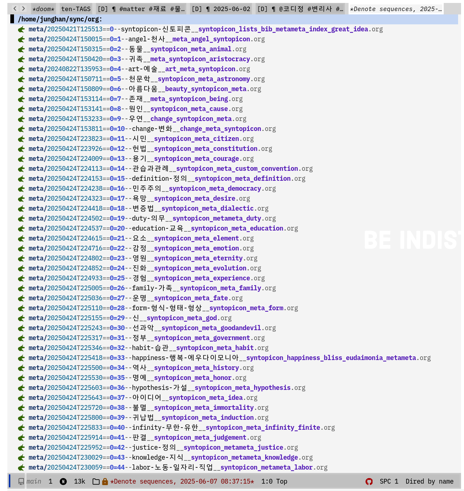

<!-- gid:20241009T113329 -->
[TOC]

[[TIP("이 노트에 대하여")]]
코디정은 변리사이자 유튜브 저자로서 철학, 논리, 번역어 문제를 생활 언어로 풀어내는 사유형 창작자다. 한국어 개념어를 다듬는 감각과 생각의 기술이 함께 드러난다.
[[/TIP]]

## BIBLIOGRAPHY

- 코디정. 2023. <i>괘씸한 철학 번역어 - 한국어</i>. [https://m.yes24.com/Goods/Detail/122282260](https://m.yes24.com/Goods/Detail/122282260).
- ———. 2024. <i>생각의 기술: 바로 써먹는 논리학 사용법</i>. [https://m.yes24.com/Goods/Detail/133975910](https://m.yes24.com/Goods/Detail/133975910).

## Related-Notes

-   [신우승 전기가오리 개념어 번역어 철학](https://wikidocs.net/382037)
-   [철학: 바칼로레아 개념어 한글](https://wikidocs.net/381293)
-   [0 syntopicon: 신토피콘](https://wikidocs.net/380840)

이 용어들을 주목하라

## [책꼽문인용문장수집](https://wikidocs.net/380692)

### 28

[[TIP("인용")]]
그러나 한국어의 경우 이런 속박이 없다. 서양 철학을 번역하는 과정에서, 우리는 최선의 한국어를 부여해서 저자의 메시지를 더 명료하게 나타낼 수 있는 기회를 얻기 때문이다. 자, 우리는 어떤 단어를 선택하면좋을까? 우리에게는 '윤곽'이라는 좋은 단어가 있다. 그러나 일본 학자가 으로 번역함으로써 번역의 기회를 망쳤고, 한국 학자들이 '도식으로 일본어 번역을 음독해서 번역한 후 만족해하면서, 번역의 기회를 낭비했다. 우리는 기회를 되살려야 한다. 그게 어렵지도 않다. 우리밀에 맞게그러면서도 저자의 메시지에 충실하게 다시 번역하면 된다..
[[/TIP]]

### dd

[[TIP("인용")]]
추적 A: 1829~1897. 일본의 번역가 어려서부터 주자학을 익 했고 1862년 막부 파견 유학생으로 네덜란드에서 서양의 학문을 배 있다.1865년 귀국하여 메이지 정부의 관직에서 임한 후, 서양의 하 문을 일본어로 번역하는 데 큰 기여를 했다. 그는 철학, 미술, 소극, 적극 가정, 능동, 수동, 가장 경제학 자유주의 인지, 외연 내포 개 념, 객관, 주관, 감성, 현실, 추상, 의무, 긍정, 부정, 본능, 이상, 감각. 공간, 원조, 목적, 심리학, 재현, 도식, 표현, 원자, 상상력, 분해법, 신 학 전칭, 특징, 단칭 등 종전에 없던 번역어를 만들었고 예부터 전 승된 한자어 중에서 오성 의식 관념 명제 인상, 과학, 시간 관계. 조직, 인식, 직접 주의 표상, 논증 예술 계급, 성립, 논증 등에 새로 운 의미를 부여해서 번역어로 사용했다. \* 기록 , 공동체로, 2002 7-127.
[[/TIP]]

### 요간한 지식1| 철학의기본 분류

[[TIP("인용")]]
철학은 인간 지식에 관한 학분이다. 전통직으로 자연 학, 윤리학, 논리학으로 나눈다. 자연학은 이 세계에 대한 철학(즉, 자연철학), 윤리학은 인간 행동에 대한 철 학(즉, 도덕철학), 논리학은 인간 생각에 관한 철학이 다. 논리학은 생각의 형식만을 탐구하는 철학이다. 그 런데 자연학과 윤리학에는 내용과 형식이 함께 들어있 다. 내용은 경험에 의해서 획득되는 것으로, 경험에 따 라 변하는 것이다. 그러므로 변하지 않는 것이 있다면 그것은 형식이다. 변하지 않는 것을 탐구하는 철학을 일컬어 형이상학이라고 청해 왔으므로, 자연철학과 도 덕철학 중에서 변하지 않는 형식을 탐구하는 부문은 각 각 자연 형이상학과 도덕 형이상학이 된다. 자연철학과 도덕철학 중에는 내용에 관한 부문이 있고, 그런 부문 이 자연철학에 해당한다면 곧 자연과학이 되며, 도덕철 학에 속한다면 인간학, 심리학, 사회학 등 다양하게 표 현될 수 있다.
[[/TIP]]

## 저 : 코디정 - 정우성

에디터, 언어활동가, 변리사. 『괘씸한 철학 번역』(2023)을 포함하여 열 권의 책을 저술했다. 오마이뉴스 시민 기자로 제2회 정문술 과학저널리즘상(인터넷부문) 수상. 숭실대학교 국제법무학과에서 지식재산법을 가르치며(겸임교수), 유튜브 &lt;코디정의 지식 채널&gt;을 운영한다. 본명 정우성.

언어활동가

## 괘씸한 철학 번역어 - 한국어

(코디정 2023)

한국어로 번역된 서양 철학은 어렵다. 한국어로 쓰여 있음에도, 한국인이 읽어도 무슨 말인지 모른다. 도대체 번역 과정에서, 아니면 한국어에 무슨 사건이 있었길래, 한국어로 번역만 되면 철학이 종잡을 수 없는 학문이 되고 마는가? 어째서 철학책을 읽을 때마다 독자는 지혜를 구하기는커녕 자신의 문해력을 한탄해야 하는가? 이 책은 이런 질문에 대한 답변이며, 고발장이자 보고서이다.저자는 임마누엘 칸트의〈순수이성비판〉 영어 번역본과 두 권의 한국어 번역본을 비교하면서 주요 단어들을 엄밀하게 분석한다. 이 분석은 명확성, 난이도, 정합도, 소통 가능성이라는 네 가지 요소에 대해 각각 80회에 걸쳐 수행되었다. 그 과정에서 백 년이 넘는 세월 동안 서양 철학의 본모습을 가린 일본어의 장막이 벗겨진다.서양 철학의 정수를 회복해 주는 것은 별게 아니다. 한국인이 평범한 생활에서 사용하는 보통의 단어로 철학하면 된다. 그런데 수많은 단어가 범람하는 이 시대에, 어디까지가 한국어인가? 저자는, "학생들이 카페에 모여 나누는 대화 속에서, 직장인이 식사하면서 혹은 술을 마시면서 주고받는 언어 속에서, 동네 사람들의 이야기 속에서, 정치인들이나 시민활동가들이 청중에게 호소하는 문장에서 평범하게 사용하는 단어, 그것이 우리 한국어"라고 선언한다. 그러면서 저자는 〈순수이성비판〉에서 서양 철학을 이해하는 데 필수적인 38개의 단어를 선별하여, 영어 번역어를 기준으로, 기존의 일본식 단어를 분석한 후 더 알맞은 우리말을 제안한다.이 책의 목적은 평범한 한국어로 서양 철학의 정수를 회복하는 것에 있다. 그 목적이 실현되는 과정에서 한국어로 철학하기를 방해하는 일본어 족쇄의 존재가 밝혀진다.

<https://sarak.yes24.com/reading-note/junghanacs/By7p9mJMtIlgLXRz>

### 목차

### 철학이란 무엇인가(16쪽)

-   어디까지가 한국어인가(21쪽)
-   새로운 번역을 시도할 때가 되었다(25쪽)
-   이 나라에서는 일본어로 철학을 번역한다(29쪽)
-   언어 유린의 무한 순환 사건의 전모(34쪽)

### 단어 토폴로지(38쪽)

-   Mind 머리냐 마음이냐(50쪽)
-   Spirit 영이냐 정신이냐(56쪽)
-   Soul 정신이냐 영혼이냐(62쪽)
-   Perception 감지냐 지각이냐(68쪽)
-   Apperception 자의식이냐 통각이냐(72쪽)
-   a priori 선천이냐 선험이냐(76쪽)
-   Transcendental 초월이냐 선험이냐 (82쪽)
-   Transcendent 초경험이냐 초험이냐(90쪽)
-   Form 형식이냐 형상이냐(92쪽)
-   Matter 재료냐 질료냐(95쪽)
-   Idea 이데아냐 이념이냐(98쪽)
-   Substance 본질이냐 실체냐(104쪽)
-   Reality 실체냐 실재냐(110쪽)
-   Aesthetic 감수성이냐 감성론이냐(114쪽)
-   Thought 생각이냐 사고냐(120쪽)
-   A being 존재냐 존재자냐(122쪽)
-   Extension 크기냐 외연이냐(126쪽)
-   Intension 세기냐 내포냐(130쪽)
-   Synthesis 종합의 문제(134쪽)
-   Unity 하나됨이냐 통일이냐(138쪽)

### 논리학에서 번역 문제(142쪽)

-   Universal 보편인가 전칭인가(148쪽)
-   Particular 개별인가 특칭인가(151쪽)
-   Singular 단일인가 단칭인가(154쪽)
-   긍정 판단과 부정 판단(157쪽)
-   Infinite 긍정부정인가 무한인가(159쪽)
-   Categorical 무조건인가 정언인가(164쪽)
-   Hypothetical 조건인가 가언인가(168쪽)
-   Disjunctive 선택인가 선언인가(171쪽)
-   Problematic 미정인가 개연인가(175쪽)
-   Assertoric 확정인가 실연인가(179쪽)
-   Apodeictic 필연인가 명증인가(182쪽)

### 어째서 유비추론을 하지 않는가(186쪽)

-   Manifold 다양함이냐 잡다냐(192쪽)
-   Modifications 변환물이냐 변양이냐(196쪽)
-   Apprehension 탐색이냐 포착이냐(200쪽)
-   Reproduction 복제냐 재생이냐(204쪽)
-   Schema 윤곽이냐 도식이냐(212쪽)
-   Noumenon 사유물인가 예지체인가(216쪽)

### 요긴한지식

[2024-10-16 Wed 16:06]

#### 술어논리

[[TIP("인용")]]
서양철학자들은 생각이란 판단이라고 여겼다. 즉 사고력은 판단력이다. 판단이란 주어와 술어의 연결이며, 이는 명제 라고 부른다. 이러한 판단 형식을 탐구하는 학문이 논리학 이다. 논리학 에서 술어 는 문법에서 말하는 서술어를 의미하지 않는다. 주어의 의미를 규정하는 것은 모두 술어이다.

논리학
[[/TIP]]

### 책 속으로

이처럼 우리 한국어는 수많은 말을 갖고 있으니, 부족하기는커녕 의미를 표현할 수 있는 풍부한 자질을 갖고 있는 언어이다. 철학 개념을 표현하는 데 아무런 어려움이 없다. 그저 옵션이 있을 뿐이다. 쉽게 표현할 것인가, 어렵게 표현할 것인가, 아니면 의미를 전하는 행위에 관심을 두지 않을 것인가의 옵션이다. 우리는 어느 쪽을 선택해야 하는가?

\\--- p.20

철학과 이성, 공간과 시간, 객관과 주관 등, 수많은 철학 용어를 우리는 평범하게 사용한다. 의사소통에 아무런 문제가 없다. 그러므로 설령 이 단어들이 어느 일본인이 발명한 것일지라도 이미 우리말이다. 오랜 세월 동안 한국인의 검증이 끝난 단어이기도 하다.

\\--- p.23

문제의 원인은 간단하다. 한국인이 한국어가 아닌 일본어로 철학을 번역하기 때문이다. 내가 이렇게 말하니 어디에선가 이런 반론이 들리는 것 같다. 우리나라에 서양 문물을 수입하는 과정에서 일본 학자의 공헌이 컸다, 아니 매우 크지 않았던가? 일본어로, 일본식 한자로 철학 용어를 번역했다 해서 문제되기보다는 오히려 철학의 보급과 학문의 성장 면에서 고마워해야 하지 않는가? 좋은 반론이다. 맞는 말이다. 일본 학자들이 없었다면 우리는 고생했을 것이다. 그러나 좋은 우리말을 찾기 위해 고생하는 것은 굉장히 의미있는 일이다. 우리는 그런 의미있는 작업을 할 기회를 박탈당한 것이고, 오히려 오류까지 세뇌당했으니, 좀 더 생각해 보면 그 반론이 부당해진다.

\\--- p.30

우리가 쓰지 않는 일본식 단어가 한국 철학번역의 족쇄이다. 서양 사상에 대한 잘못된 이해로 말미암아 발생한 엉터리 번역도 있다. 그런 족쇄를 차고도, 관례를 존중한다는 안일한 명목을 내세우면서, 지난 백 년 동안 편안하게 여긴 결과가 오늘날의 철학번역이다.

\\--- p.32

철학책을 읽다 보면 으레 사전을 찾게 마련이다. 단어의 뜻을 모르니 읽어도 무슨 말인지 모르겠고, 그래서 독자들은 사전에서 도움을 얻고자 한다. 그런데 막상 사전을 읽어도 제대로 도움을 얻지 못한다. 사전의 뜻풀이 자체가 어렵기도 하기 때문이며, 우리가 상식적으로 알고 있는 의미와 다른 경우도 잦기 때문이다. 사전에 대해 이야기해 보자.

\\--- p.35

나는 이처럼 의미의 시공간을 4차원의 좌표를 갖는 공간으로 정의한 다음에, 번역을 검증했다. 단어는 저마다 위상을 갖는다. 즉, 번역에 사용되는 단어는 4개의 좌표 값으로 구성되는 하나의 위상을 갖는다. 이런 생각으로 무엇이 한국인에게 바람직한 철학 용어 번역인지 이 위상 분석에 의해 결정해 보았다. 의미 모호성(명백하거나 의심스럽거나)과 난이도(쉽거나 어렵거나)는 도착 언어, 즉 우리말에 관한 위상이다. 정합도(의미에 맞거나 맞지 않거나)와 오해 가능성(의사소통에 이익이 되거나 장애가 되거나)은 출발 언어와의 관계에 관한 위상이다. 나는 이러한 항목의 위상을 탐구하는 것을 '단어 토폴로지'라 칭하면서, 각 항목을 행렬의 성분으로 갖는 2x2 행렬로 수학적 모델링을 시도했다.

\\--- p.42

이제 이러한 단어 토폴로지 모델에 기초해서 검증 작업을 해보자. 나는 임마누엘 칸트의 〈순수이성비판〉 한국어 번역을 통해 검증 작업을 수행했다. 〈순수이성비판〉이 인류사에서 가장 빛나는 철학서 중 하나이기도 하고, 현대 철학에 입문하는 출입문 역할을 하는 책이기 때문이기도 하지만, 이런 사실보다 이 책을 선택한 까닭은, 사람들이 이 책을 일컬어 가장 난해한 철학책이라고도 하고, 칸트 철학 전공자조차 일반인이 읽을 수 없는 책이라고 태연하게 말하니, 그 말이 과연 사실인지 검증하고 싶기 때문이었다.

\\--- p.46

'선험적'은 '선천적'이라는 단어보다 나을 게 없는 번역어이다. 반세기 전에 사용하던 단어가 요즘 유행하는 단어보다 더 좋은 번역이라니, 당대의 철학자들이 부끄럽다. 그런데 근래 한국칸트학회는 a priori를 라틴어 음역 그대로 '아프리오리'로 번역해야 한다고 주장하면서 그것이 학회의 '필수 표기법'임을 당당하게 발표했다. 오늘날 철학자들이 사회에서 얼마나 멀리 격리되고 말았는지를 대표적으로 증거하는 사례이다. 이 단어의 위상은 다음과 같다.

\\--- p.78

이처럼 transcendental과 transcendent, 둘 다 '경험의 한계를 초월한'이라는 뜻을 갖는다. 인식 주체에 관해서 경험의 한계를 초월함으로써 인류 공통에 적용할 수 있다는 의미로는 transcendental이다. 이것은 긍정적인 의미를 갖는다. 반면 인식 대상에 관해서 경험의 한계를 초월함으로써 우리가 그것에 대한 참된 지식을 얻을 수 없다는 의미로는 transcendent이다. 이 경우에는 부정적인 의미가 된다.

\\--- p.85

Unity는 synthesis와 동일한 문제를 갖는다. 〈순수이성비판〉에서 unity는 '형식적인 단어'로서 단순한 의미의 위상만을 갖는다. 그 내용이 무엇인지 무관하게 '하나가 되었다'는 형식만을 강조하는 단어이다. 다른 의미는 없다. 학자들은 unity를 통일로 번역한다. 그런데 한국어 '통일'은 형식적으로 자명하지 않다. '내용적인 의미'까지 섞여 있기 때문이다. 그런 점에서 unity와 통일의 의미적 위상이 같지 않다.

\\--- p.139

결국 생각이란 문장을 분석하는 사건이 되는 것이다. 만약 인간이 사용하는 문장을 일련의 형식으로 질서있게 분류한다면, 그것은 실로 생각의 형식을 질서있게 분류하는 것과 동일한 의미가 되고, 논리학은 그런 지식체계를 탐구하는 철학이라고 말할 수도 있다. 즉, 인간의 생각을 좀 더 쉽고 명쾌하게 탐구하려는 학문이기 때문에, 논리학에서 사용되는 단어는 일단 쉬워야 한다. 명쾌해야 한다. 단순해야 한다. 그러나 안타깝게도 현실은 그렇지 않다. 기이하게도 학자들은 쉬운 단어와 어려운 단어가 있다면 반드시 어려운 단어를 선택한다.

\\--- p.144

예지체는 그 단어 자체의 의미를 모르겠다(4점). 사전을 찾아 보면 그 단어의 의미를 알 수 있고, 문맥을 통해서도 의미를 파악할 수 있겠으나, noumenon이라는 번역어로 사용된 문맥에서는 평범한 한국인이 예지체의 의미를 명확히 파악하는 일은 불가능해 보인다. 전문가 수준의 어휘력을 갖고 있어야 한다(4점). noumenon의 본래의 의미와 예지체의 의미가 동일성의 범위 안에 있다고 인정하더라도(1점). 모르는 단어로 어떻게 소통이 가능하단 말인가? 상상해 보라. 칸트 전공자 사이의 이너서클에 속하지도 않았다면, 지식인조차 예지체라는 난해한 단어로 철학적 대화를 하는 것은 불가능해 보인다(4점). 그러므로 noumenon의 번역어로서 '예지체'의 단어 위상은 다음과 같다.

\\--- p.218

일본어로 철학을 지속한다면 이 나라에서 철학의 미래는 없을 것이다. 그렇다면 인문학은 사상누각에 불과하다. 그러나 만약 철학자들이 일본어의 족쇄를 끊고 평범한 한국어로 철학하기 시작한다면, 그 한국어로 철학을 공부한 젊은 세대 중에서 틀림없이 인류의 존경을 받는 세계적인 사상가가 나타날 것이다. 그렇게 되기를 희망한다.

\\--- p.224

### 출판사 리뷰

인문학을 읽어야 한다고 말하는 것은 쉽다. 그러나 막상 인문학 책을 펼치면 어렵다. 자신이 공부만큼은 좀 한다고 생각하는 사람조차, 인문고전을 읽을라치면 어려운 단어에 백기를 든다. 그래서 대부분 쉬운 해설서에 만족할 뿐, 혼자 힘으로는 고전을 읽지 못한다. 이 책은 그런 사람들을 위해 출판되었다. 당신이 머리가 나빠서 읽지 못하는 게 아니다. 당신이 사용하는 우리말이 일본어 감옥에 갇혀 있기 때문이다. 이 책은 그 실태를 섬세하게 보여주면서, 혼자 힘으로 인문학에 입문할 수 있는 열쇠를 제공한다.

거의 매년 일본에서는 철학 개념을 해설하는 책들이 출판된다. 그리고 우후죽순처럼 우리말로 번역된다. 이 책은 이런 관행에 정면으로 맞서면서 질문한다. 어째서 한국어로 철학하지 않는가? 어째서 평범한 한국어에서 단어를 찾지 않는가?

일본에서 철학 용어 해설집이 많이 출간되는 이유는 현대 일본인들조차 메이지 시대에 만들어진 자기들의 언어를 어려워하기 때문이다. 사람들의 언어 습관에서 철학 용어가 현명하게 선택된 게 아니라, 일부 지식인이 단어를 발명한 후 사람들이 그것을 매뉴얼처럼 암기해 왔다면, 시대의 변화에 맞춰 올바르게 개선해 봄직하다. 그러나 일본은 개선보다 해설을 택했다. 우리나라에서 그런 해설집이 유행처럼 한국말로 번역되어 출간된 까닭은 우리나라 철학 용어가 일본어 한자를 음역해서 만들어졌다는 점 때문일 것이다. 그래서 우리나라 철학 용어의 대부분이 일본어 한자와 같다. 퍼즐처럼 일대일로 대응한다. 그러므로 일본 책들을 수입하는 것은 유용하고 슬기로운 일처럼 보인다. 이 땅의 지식인들은 그런 퍼즐을 의심하지 않는다.

하지만 우리나라 철학 용어의 상당수가 우리말에 맞지 않아 폐기돼야 한다면, 일본어에 중독된 퍼즐 놀이는 의심스러운 일이 된다. 이 책의 장점은 추상적이거나 선언적인 수준의 비판을 넘어섰다는 점에 있다. 저자는 단어 토폴로지 기법을 통해 일본식 한자어가 이 땅에서 얼마나 철학을 핍박해 왔는지 증명하며, 일본식 번역이 서양 철학의 정수를 담아낼 만큼의 그릇이 되지 못함을 수치로 보여준다. 독자들은 저자가 대안으로 제시한 평범한 한국어를 통해 〈순수이성비판〉의 주요 내용을 쉽게 이해할 수 있게 되는데, 이것이 이 책을 읽는 또 다른 보람이기도 하다.

## 생각의 기술: 바로 써먹는 논리학 사용법

(코디정 2024)

### 소개

흔히 논리학이라고 하면 19세기 이후의 논리학을 생각한다. 그러나 이 책은 아리스토텔레스와 칸트로 대표되는 전통 논리학을 복원하면서 독자들이 쉽게 논리 지식을 얻도록 안내하는 책이다. 수학자들이 제안하고 일부 철학자들이 응답해서 정립된 19세기 이후의 논리학은 그 탐구 범위가 좁다. 2,300년이 넘는 역사를 지닌 전통 논리학과 달리, 수리 논리학이라는 이름을 갖는 그것은 인간 머릿속에서 주관적이고 심리적인 것을 배제한 채, 표현된 문장 중에서 참과 거짓을 '판별하는 학문'으로 논리학을 축소시켰다.

인간은 무엇이든 생각하고, 그 생각을 표현한다. 인생의 모든 것은 생각과 표현으로 이루어지고, 생각과 표현을 통해 생겨난 성과가 행복과 부와 사회적 지위에 영향을 미친다. 따라서 어떻게 생각하고 어떻게 표현할 것인지에 관한 다양한 스킬이 궁리되었다. 하지만 지금껏 알려진 기존 지식은 사람마다 다르고 상황마다 그 유용함이 달라지기 때문에, 잘 정리가 되지 않았다.

그리고 수리 논리학은 '이미 표현된 것'만을 다루고, 어떤 표현이 '참'이고 어떤 표현에 오류가 있는지 안내해 주지만, '인간의 머릿속'에는 무수히 많은 거짓과 오류가 자연스럽게 서식한다는 점에서 실생활에서 활용하기 어렵다. 인간의 생각과 표현에 관한 표준은 없는 것일까? 어떻게 생각이 탄생하고 어떻게 오류가 발생하는 것일까? 어떻게 거짓이 전속력으로 퍼지고 또 어떻게 지식이 확장되는 것일까? 왜 사람들은 말도 안되는 것을 고집하며 감정적으로 반응하기까지 하는 것일까?

이런 질문에 대한 해답을 찾을 수 있다면, 우리는 인간 그 자체에 대한 유용한 통찰을 얻을 수 있다. 우리는 그 통찰을 통해, 더 나은 생각을 하고, 더 효과적인 표현을 고를 수 있으며, 일을 더 잘하고 더 멋진 성과를 낼 수 있다. 더 잘 소통하면서 더 좋은 평판을 얻을 수도 있을 것이다. 이 책은 그런 해답을 논리학이라는 이름으로 제안한다.

#### 저자가 독자에게

-   14쪽

#### Logic Storyline

-   30쪽

### 1강 논리란 무엇인가

-   52쪽

### 2강 논리를 공부해서 무엇을 얻는가

-   60쪽

### 3강 논리의 전체 구조|74쪽

4가지 관점 구조 파악

-   국어력 관점 : 단어 - 문장
-   논리학 :
-   기하학 :
-   논리 현실 관점 :

### 4강 개념이란 무엇인가

#### 사전의 오류 (090)

#### 개념의 역할 (094)

#### 의미의 크기 (098)

#### 의미의 선명함(101)

#### 개념은 소속을 갖는다 (107)

### 5강 생각의 탄생, 판단이란 무엇인가

#### 생각의 탄생 (112)

#### 일반 논리학과 수리 논리학의 차이 (116)

#### 논리적인 사람과 표상적인 사람 (120)

#### 종합명제와 분석명제 (122)

#### 판단의 종류 (125)

### 6강 생각의 도약, 추론이란 무엇인가

#### 지금, 여기의 판단 (140)

#### 내 머릿속에 보관된 과거의 판단들 (146)

#### 생각의 도약 (147)

#### 머릿속에 보관되어 있는 그 무엇(153)

#### 오성과 이성 (156)

### 7강 토대 구조 모형

#### 벤다이어그램의 한계 (166)

#### 토대 구조 모형 (168)

#### 논리학과 형이상학의 만남 (175)

#### 근거의 기울기 (185)

### 8강 인간 지식의 코어, 연역

#### 오해와 편견 (194)

#### 토대와 구조 (198)

#### 미지의 대전제 (217)

#### 확정된 대전제 (219)

### 9강 연역을 보충하는 귀납

#### 귀납이란 무엇인가 (226)

#### 연역추론에서 두 가지 의문 (231)

### 10강 경험은 논리에서 어떤 역할을 하는지

#### 경험 데이터베이스 (279)

#### 경험이 머릿속에서 하는 역할 (283)

#### 성선설 이냐 성악설이냐 (286)

#### 사람이 변하지 않는 이유? (287)

#### 이상한 사람과의 진지한 교제(290) |어떻게 경험의 능력을 키울 것인가(294)

#### 경험의 한계 (299)

### 11강 유추, 경험할 수 없는 것에 대한 인간 지식의 좌충우돌

#### 경험할 수 없는 것들 (309)

#### 아날로지, 유추의 논리 (311)

#### 칸트의 순수이성비판 (324)

#### 음모론의 확산 (327)

#### 유추의 한계 (329)

### 12강 확률의 위안

#### Infallibility (334)

#### 확률의 위안 (338)

#### 현대물리학 (339)

### 13강 변증, 반론의 힘

#### 내 안에서 나타나는 반론의 힘 (362)

#### 타인과의 소통에서 나타나는 반론의 힘 (367)

#### 변증 (382)

### 14강 설득의 기술

#### 에토스 (389)

#### 파토스 (397)

#### 로고스 (402)

### 15강 생각의 집합

#### 어리둥절의 탄생 (409)

#### 걸그룹 (411)

#### 개념 없는 녀석 (413)

#### 대화와 토론의 원칙 (415)

#### 이태원 참사의 원인 (417)

#### 관심이 만들어 내는 생각의 집합 (420)

#### 여집합 (424)

#### 어리둥절하지 않는 사오정 (426)

#### 성과가 적은 사람 (427)

#### 머릿속이 답답함 (433) |생각의 크기와 소통 스킬 (435)

### 16강 좋은 토론과 나쁜 토론

#### 행복의 문제 (442)

#### 다양한 의견 충돌 (446)

#### 두 종교 이야기 (451) |나쁜 공격 (454)

### 17강 끈과 가위

#### 인간과 동물의 차이 (461)

#### 논리 끈 (465)

#### 가위질 (469)

### 부록

#### 쉬어 가는 논리 여행 1 논리학 Q&amp;A

-   132쪽

#### 쉬어 가는 논리 여행 2 논리적으로 독서하는 법

-   244쪽

#### 쉬어 가는 논리 여행 3 논리적인 글쓰기

-   252쪽

#### 쉬어 가는 논리 여행 4 논리학이 주도하는 철학의 계보

-   344쪽

### 책 속으로

우리 머리 안에는 다양한 오류가 숨쉬듯 살아있고, 그것을 논리적으로 없앨 수가 없다. 우리 몸 안에는 정상 세포보다 더 많은 수의 박테리아가 살고 있다고 하지만, 박테리아를 전부 없애 버리면 인간이 죽는다. 머릿속 오류도 마찬가지다. 오류가 일절 없는 참의 세계는 인간 머릿속에서는 가능하지 않다. 논리는 진실을 담듯 오류도 담는 그릇이지, 오류를 없애는 청정제가 아니다. --- p.52

논리를 공부하면 내가 어디까지 주장하는 게 좋을지, 다른 사람들이 납득하고 수용할 수 있는 범위가 어느 정도인지를 예상할 수 있다. --- p.71

개념의 세 가지 특징이 있으니, 이것을 잘 기억해 두자. 첫째, 모든 개념은 크기가 있다. 알맞은 크기의 단어를 사용하자. 둘째, 모든 개념은 사람들 머릿속에서 저마다 선명함이 다르다. 가급적 더 선명한 의미의 단어를 사용하자. 셋째, 모든 개념은 저마다 소속이 있다. --- p.109

다시 말하면 우리가 어떻게 지식을 획득하고, 우리가 어떻게 소통하는지(혹은 소 통해야 하는지) 알고자 한다면, 인간 머릿속으로 들어가야 한다. 그리고 그때 나타나는 학문이 일반 논리학이며, 이때의 논리학이 바로 이 책이 다루는 논리학이다. 전통적으로 논리학은 형식만을 다루며, 이것은 일반 논리학이든 수리 논리학이든 차이가 없다. --- p.118

토대 구조 모형은 벤다이어그램처럼 2차원이 아닌, 3차원 모델이다. 먼저 토대가 있고, 그 위에 판단이 놓인다. 보편적인 개념이나 원리가 토대를 차지하고, 이 토대 위에 개별적인 상황에서 생기는 구체적인 판단이 위치한다. 토대를 이루는 보편이 개별에 대해 우세력을 발휘한다. --- p.169

대전제는 인간 머릿속에 무수히 많고 사람마다 다르다. 그런데 만일 모든 인간이 갖고 있는 불변의 대전제가 있다고 가정한다면, 그때 논리학과 형이상학이 만난다. --- p.191

생산적인 논쟁이 되려면 논쟁의 배후에서 주장을 지배하는 대전제를 인지해야 한다. --- p.219

글의 주체는 '나'가 아니라 '내가 선택한 혹은 선택해야 하는 페르소나Persona'이다. 페르소나란 가면을 뜻하며, 고대 그리스의 연극에서 등장인물이 사용하던 가면에서 유래된 단어다. 심리학자 융은 인간은 천 개의 페르소나를 지니면서 상황에 따라 적절한 페르소나를 쓰고 사회적 관계를 맺는다고 주장하기도 했다. '가면Persona'이 글쓰기의 '인격Person'이다. 앞에서 말한 것처럼, 우리는 글을 써야 하는 상황이 됐으므로 글을 쓴다. 그렇다면 그 상황에 맞는 페르소나를 선정해서, 그 페르소나 관점으로 글을 쓰는 것이다. --- p.259

개념화는 타인이 정의한 의미를 그대로 내 머리 안으로 가져온다는 게 아니다. 그것은 단순 암기에 불과하다. 우선 경험하면서 그 단어를 발견해야 한다. 앞의 사례처럼 주의력이 없으면 그 단어가 발견되지 않을 것이다. 그다음 그 단어를 자기 머릿속으로 가져와야 한다. 그리고 그 의미를 선명하게 만들어서 기억하는 것이다. 훈련이 필요하다. --- p.297

요컨대 변증은 대전제끼리의 우선순위 다툼이다. 이 우선순위 다툼에서 무엇이 이기느냐에 따라 결론이 달라져버리기 때문에 변증은 매우 중요하다. --- p.365

쓸데없는 생각으로 시간을 낭비하는 어리석은 사람은 생각의 집합을 줄여야 하며, 지나치게 좁은 관심사로 인생을 살거나 당면한 문제를 풀지 못하고 쩔쩔매는 사람은 생각의 집합을 키워야 한다. 그렇게 생각의 집합 크기를 줄이거나 키우는 것만으로도 인생이 달라진다. --- p.434

그러므로 우리는 논리를 통해 타인과 소통한다. 논리적으로 잘 표현한다면 소통을 잘하는 것이고, 논리적이지 않으면 소통을 못한다는 것이다. 소통을 잘하는 사람이 타인의 공감을 얻고 능력을 인정받는다. --- p.462

비교 논리는 내게 불리한 상대방의 편향을 자극할 수 있고, '~런 점에서 상황이 다르잖아?'라는 반론을 낳을 수 있다는 점을 잊지 말아야 한다. 비교 논리를 잘못 사용하면, 상대방의 머릿속 논점은 내 주장의 타당성에서 비교 논리의 타당성으로 바뀐다. --- p.478 접어보기 관련 자료

### 출판사 리뷰

이 책은 실용적인 목적으로 저술된 논리학 책이다. 〈코디정의 지식 채널〉을 통해 저자가 공유한 논리학 콘텐츠 시리즈는 유튜브 시청자들에게 많은 신뢰와 사랑을 받았다. 그 영상의 내용이 한 권의 논리학 책으로 묶인 것이 바로 이 책이다. 저자는 참과 거짓을 판별하고 추론의 타당성을 분석하는 기존 논리학이 아니라, 사람들의 머릿속에서 어떻게 생각이 탄생하고, 도약하며, 또 어떻게 참과 거짓이 뒤섞이게 되는지를 탐구하는 논리학을 소개한다. 칸트와 논리학의 환상적인 결합을 소개하는 이 책은 마치 라식 수술을 받은 것 같은 선명한 시야를 독자에게 선물한다.

인생의 모든 일은 머리를 쓰는 일이다. 인간의 지식과 소통도 마찬가지다. 그렇다면 머리를 어떻게 쓰는 것이 좋은 일일까? 이 책은 이런 질문에 답한다. (1) 성실히 일함에도 원하는 성과를 얻지 못하는 사람의 머릿속을, (2) 열심히 공부해도 입시와 자격 시험에서 원하는 성적을 얻지 못하는 사람의 머릿속을, (3) 효과적으로 독서를 못하는 사람의 머릿속을, (4) 타인과의 소통에서 어려움을 겪는 사람의 머릿속을, (5) 타인을 설득하는 일을 함에도 논리력이 부족한 사람의 머 릿속을, (4) 아이디어를 생각해 내는 기획자의 머릿속을, (5) 더 효율적인 결과를 내놓고자 하는 개발자의 머릿속을, (6) 좋은 글을 쓰고 싶은 사람의 머릿속을, (7) 이미 꼰대가 되었음을 본인만 모르는 어느 중년의 머릿속을, (8) 자녀에게 더 좋 은 인생 조언을 하려는 부모의 머릿속을 시원하게 해줄 것이다.

AI가 인간의 머리를 학습하는 시절이다. 도대체 인간의 머리 안에서 생각은 어떻게 이루어지는 것일까? 기계가 인간을 학습하는 이 시대에, 도대체 기계가 자신의 무엇을 모방하고 있는지 호모 사피엔스가 알아야 하지 않을까? 만 년 전 인류가 날카로운 돌멩이를 바라보면서 그것의 효용을 생각했던 것처럼, AI를 삶의 무기로 삼는 호모 사피엔스는 기계 너머의 기술을 생각해야 한다. 그것이 바로 생각의 기술The Art of Thinking이다.

## 신토피콘

[2025-06-07 Sat 08:38]

코디정의 개념에서 신토피콘을 보라

