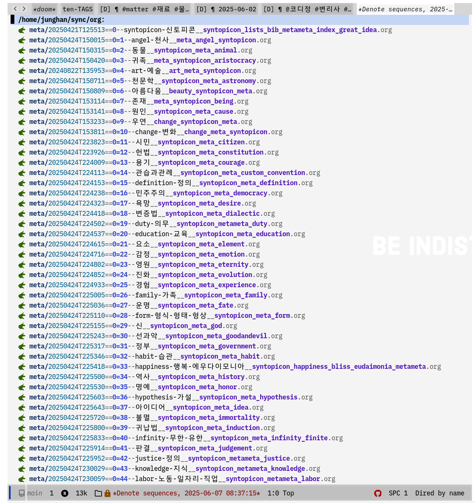

<!-- gid:20241009T113329 -->
[[TIP("이 노트에 대하여")]]
코디정은 변리사이자 유튜브 저자로서 철학, 논리, 번역어 문제를 생활 언어로 풀어내는 사유형 창작자다. 한국어 개념어를 다듬는 감각과 생각의 기술이 함께 드러난다.
[[/TIP]]

<!-- provenance:source:start -->
[[TIP("원본·최신본")]]
이 페이지는 한국어 검색과 읽기를 위한 WikiDocs 미러입니다. [원본·최신본은 가든](https://notes.junghanacs.com/bib/20241009T113329/)에 있습니다. 최신 수정 내용·백링크·태그·히스토리·댓글·출처 정보는 원본 가든에서 확인하세요.

- 작성: `2024-10-09T11:33:00+09:00`
- 최근 수정: `2025-03-06T00:00:00+09:00`
[[/TIP]]
<!-- provenance:source:end -->

[TOC]

## 관련메타

-   ..

## BIBLIOGRAPHY

- 코디정. 2023. <i>괘씸한 철학 번역어 - 한국어</i>. [https://m.yes24.com/Goods/Detail/122282260](https://m.yes24.com/Goods/Detail/122282260).
- ———. 2024. <i>생각의 기술: 바로 써먹는 논리학 사용법</i>. [https://m.yes24.com/Goods/Detail/133975910](https://m.yes24.com/Goods/Detail/133975910).

## Related-Notes

-   [신우승 전기가오리 개념어 번역어 철학](https://notes.junghanacs.com/bib/20240809T165536/)
-   [철학: 바칼로레아 개념어 한글](https://notes.junghanacs.com/notes/20240823T110214/)
-   [0 syntopicon: 신토피콘](https://notes.junghanacs.com/meta/20250421T125513/)

이 용어들을 주목하라

## [책꼽문인용문장수집](https://notes.junghanacs.com/meta/20241004T135542/)

### 28

[[TIP("인용")]]
그러나 한국어의 경우 이런 속박이 없다. 서양 철학을 번역하는 과정에서, 우리는 최선의 한국어를 부여해서 저자의 메시지를 더 명료하게 나타낼 수 있는 기회를 얻기 때문이다. 자, 우리는 어떤 단어를 선택하면좋을까? 우리에게는 '윤곽'이라는 좋은 단어가 있다. 그러나 일본 학자가 으로 번역함으로써 번역의 기회를 망쳤고, 한국 학자들이 '도식으로 일본어 번역을 음독해서 번역한 후 만족해하면서, 번역의 기회를 낭비했다. 우리는 기회를 되살려야 한다. 그게 어렵지도 않다. 우리밀에 맞게그러면서도 저자의 메시지에 충실하게 다시 번역하면 된다..
[[/TIP]]

### dd

[[TIP("인용")]]
추적 A: 1829~1897. 일본의 번역가 어려서부터 주자학을 익 했고 1862년 막부 파견 유학생으로 네덜란드에서 서양의 학문을 배 있다.1865년 귀국하여 메이지 정부의 관직에서 임한 후, 서양의 하 문을 일본어로 번역하는 데 큰 기여를 했다. 그는 철학, 미술, 소극, 적극 가정, 능동, 수동, 가장 경제학 자유주의 인지, 외연 내포 개 념, 객관, 주관, 감성, 현실, 추상, 의무, 긍정, 부정, 본능, 이상, 감각. 공간, 원조, 목적, 심리학, 재현, 도식, 표현, 원자, 상상력, 분해법, 신 학 전칭, 특징, 단칭 등 종전에 없던 번역어를 만들었고 예부터 전 승된 한자어 중에서 오성 의식 관념 명제 인상, 과학, 시간 관계. 조직, 인식, 직접 주의 표상, 논증 예술 계급, 성립, 논증 등에 새로 운 의미를 부여해서 번역어로 사용했다. \* 기록 , 공동체로, 2002 7-127.
[[/TIP]]

### 요간한 지식1| 철학의기본 분류

[[TIP("인용")]]
철학은 인간 지식에 관한 학분이다. 전통직으로 자연 학, 윤리학, 논리학으로 나눈다. 자연학은 이 세계에 대한 철학(즉, 자연철학), 윤리학은 인간 행동에 대한 철 학(즉, 도덕철학), 논리학은 인간 생각에 관한 철학이 다. 논리학은 생각의 형식만을 탐구하는 철학이다. 그 런데 자연학과 윤리학에는 내용과 형식이 함께 들어있 다. 내용은 경험에 의해서 획득되는 것으로, 경험에 따 라 변하는 것이다. 그러므로 변하지 않는 것이 있다면 그것은 형식이다. 변하지 않는 것을 탐구하는 철학을 일컬어 형이상학이라고 청해 왔으므로, 자연철학과 도 덕철학 중에서 변하지 않는 형식을 탐구하는 부문은 각 각 자연 형이상학과 도덕 형이상학이 된다. 자연철학과 도덕철학 중에는 내용에 관한 부문이 있고, 그런 부문 이 자연철학에 해당한다면 곧 자연과학이 되며, 도덕철 학에 속한다면 인간학, 심리학, 사회학 등 다양하게 표 현될 수 있다.
[[/TIP]]

## 저 : 코디정 - 정우성

에디터, 언어활동가, 변리사. 『괘씸한 철학 번역』(2023)을 포함하여 열 권의 책을 저술했다. 오마이뉴스 시민 기자로 제2회 정문술 과학저널리즘상(인터넷부문) 수상. 숭실대학교 국제법무학과에서 지식재산법을 가르치며(겸임교수), 유튜브 &lt;코디정의 지식 채널&gt;을 운영한다. 본명 정우성.

언어활동가

## 괘씸한 철학 번역어 - 한국어

(코디정 2023)

[[TIP("요약")]]
한국어로 번역된 서양 철학은 어렵다. 한국어로 쓰여 있음에도, 한국인이 읽어도 무슨 말인지 모른다. 도대체 번역 과정에서, 아니면 한국어에 무슨 사건이 있었길래, 한국어로 번역만 되면 철학이 종잡을 수 없는 학문이 되고 마는가? 어째서 철학책을 읽을 때마다 독자는 지혜를 구하기는커녕 자신의 문해력을 한탄해야 하는가? 이 책은 이런 질문에 대한 답변이며, 고발장이자 보고서이다.저자는 임마누엘 칸트의〈순수이성비판〉 영어 번역본과 두 권의 한국어 번역본을 비교하면서 주요 단어들을 엄밀하게 분석한다. 이 분석은 명확성, 난이도, 정합도, 소통 가능성이라는 네 가지 요소에 대해 각각 80회에 걸쳐 수행되었다. 그 과정에서 백 년이 넘는 세월 동안 서양 철학의 본모습을 가린 일본어의 장막이 벗겨진다.서양 철학의 정수를 회복해 주는 것은 별게 아니다. 한국인이 평범한 생활에서 사용하는 보통의 단어로 철학하면 된다. 그런데 수많은 단어가 범람하는 이 시대에, 어디까지가 한국어인가? 저자는, "학생들이 카페에 모여 나누는 대화 속에서, 직장인이 식사하면서 혹은 술을 마시면서 주고받는 언어 속에서, 동네 사람들의 이야기 속에서, 정치인들이나 시민활동가들이 청중에게 호소하는 문장에서 평범하게 사용하는 단어, 그것이 우리 한국어"라고 선언한다. 그러면서 저자는 〈순수이성비판〉에서 서양 철학을 이해하는 데 필수적인 38개의 단어를 선별하여, 영어 번역어를 기준으로, 기존의 일본식 단어를 분석한 후 더 알맞은 우리말을 제안한다.이 책의 목적은 평범한 한국어로 서양 철학의 정수를 회복하는 것에 있다. 그 목적이 실현되는 과정에서 한국어로 철학하기를 방해하는 일본어 족쇄의 존재가 밝혀진다.

<https://sarak.yes24.com/reading-note/junghanacs/By7p9mJMtIlgLXRz>
[[/TIP]]

### 목차

#### 철학이란 무엇인가(16쪽)

-   어디까지가 한국어인가(21쪽)
-   새로운 번역을 시도할 때가 되었다(25쪽)
-   이 나라에서는 일본어로 철학을 번역한다(29쪽)
-   언어 유린의 무한 순환 사건의 전모(34쪽)

#### 단어 토폴로지(38쪽)

-   Mind 머리냐 마음이냐(50쪽)
-   Spirit 영이냐 정신이냐(56쪽)
-   Soul 정신이냐 영혼이냐(62쪽)
-   Perception 감지냐 지각이냐(68쪽)
-   Apperception 자의식이냐 통각이냐(72쪽)
-   a priori 선천이냐 선험이냐(76쪽)
-   Transcendental 초월이냐 선험이냐 (82쪽)
-   Transcendent 초경험이냐 초험이냐(90쪽)
-   Form 형식이냐 형상이냐(92쪽)
-   Matter 재료냐 질료냐(95쪽)
-   Idea 이데아냐 이념이냐(98쪽)
-   Substance 본질이냐 실체냐(104쪽)
-   Reality 실체냐 실재냐(110쪽)
-   Aesthetic 감수성이냐 감성론이냐(114쪽)
-   Thought 생각이냐 사고냐(120쪽)
-   A being 존재냐 존재자냐(122쪽)
-   Extension 크기냐 외연이냐(126쪽)
-   Intension 세기냐 내포냐(130쪽)
-   Synthesis 종합의 문제(134쪽)
-   Unity 하나됨이냐 통일이냐(138쪽)

#### 논리학에서 번역 문제(142쪽)

-   Universal 보편인가 전칭인가(148쪽)
-   Particular 개별인가 특칭인가(151쪽)
-   Singular 단일인가 단칭인가(154쪽)
-   긍정 판단과 부정 판단(157쪽)
-   Infinite 긍정부정인가 무한인가(159쪽)
-   Categorical 무조건인가 정언인가(164쪽)
-   Hypothetical 조건인가 가언인가(168쪽)
-   Disjunctive 선택인가 선언인가(171쪽)
-   Problematic 미정인가 개연인가(175쪽)
-   Assertoric 확정인가 실연인가(179쪽)
-   Apodeictic 필연인가 명증인가(182쪽)

#### 어째서 유비추론을 하지 않는가(186쪽)

-   Manifold 다양함이냐 잡다냐(192쪽)
-   Modifications 변환물이냐 변양이냐(196쪽)
-   Apprehension 탐색이냐 포착이냐(200쪽)
-   Reproduction 복제냐 재생이냐(204쪽)
-   Schema 윤곽이냐 도식이냐(212쪽)
-   Noumenon 사유물인가 예지체인가(216쪽)

#### 요긴한지식

[2024-10-16 Wed 16:06]

##### 술어논리

[[TIP("인용")]]
서양철학자들은 생각이란 판단이라고 여겼다. 즉 사고력은 판단력이다. 판단이란 주어와 술어의 연결이며, 이는 명제 라고 부른다. 이러한 판단 형식을 탐구하는 학문이 논리학 이다. 논리학 에서 술어 는 문법에서 말하는 서술어를 의미하지 않는다. 주어의 의미를 규정하는 것은 모두 술어이다.

논리학
[[/TIP]]

## 생각의 기술: 바로 써먹는 논리학 사용법

(코디정 2024)

[[TIP("요약")]]
흔히 논리학이라고 하면 19세기 이후의 논리학을 생각한다. 그러나 이 책은 아리스토텔레스와 칸트로 대표되는 전통 논리학을 복원하면서 독자들이 쉽게 논리 지식을 얻도록 안내하는 책이다. 수학자들이 제안하고 일부 철학자들이 응답해서 정립된 19세기 이후의 논리학은 그 탐구 범위가 좁다. 2,300년이 넘는 역사를 지닌 전통 논리학과 달리, 수리 논리학이라는 이름을 갖는 그것은 인간 머릿속에서 주관적이고 심리적인 것을 배제한 채, 표현된 문장 중에서 참과 거짓을 '판별하는 학문'으로 논리학을 축소시켰다.

인간은 무엇이든 생각하고, 그 생각을 표현한다. 인생의 모든 것은 생각과 표현으로 이루어지고, 생각과 표현을 통해 생겨난 성과가 행복과 부와 사회적 지위에 영향을 미친다. 따라서 어떻게 생각하고 어떻게 표현할 것인지에 관한 다양한 스킬이 궁리되었다. 하지만 지금껏 알려진 기존 지식은 사람마다 다르고 상황마다 그 유용함이 달라지기 때문에, 잘 정리가 되지 않았다.

그리고 수리 논리학은 '이미 표현된 것'만을 다루고, 어떤 표현이 '참'이고 어떤 표현에 오류가 있는지 안내해 주지만, '인간의 머릿속'에는 무수히 많은 거짓과 오류가 자연스럽게 서식한다는 점에서 실생활에서 활용하기 어렵다. 인간의 생각과 표현에 관한 표준은 없는 것일까? 어떻게 생각이 탄생하고 어떻게 오류가 발생하는 것일까? 어떻게 거짓이 전속력으로 퍼지고 또 어떻게 지식이 확장되는 것일까? 왜 사람들은 말도 안되는 것을 고집하며 감정적으로 반응하기까지 하는 것일까?

이런 질문에 대한 해답을 찾을 수 있다면, 우리는 인간 그 자체에 대한 유용한 통찰을 얻을 수 있다. 우리는 그 통찰을 통해, 더 나은 생각을 하고, 더 효과적인 표현을 고를 수 있으며, 일을 더 잘하고 더 멋진 성과를 낼 수 있다. 더 잘 소통하면서 더 좋은 평판을 얻을 수도 있을 것이다. 이 책은 그런 해답을 논리학이라는 이름으로 제안한다.
[[/TIP]]

-   저자가 독자에게
    -   14쪽
-   Logic Storyline
    -   30쪽

### 목차

#### 1강 논리란 무엇인가

-   52쪽

#### 2강 논리를 공부해서 무엇을 얻는가

-   60쪽

#### 3강 논리의 전체 구조|74쪽

4가지 관점 구조 파악

-   국어력 관점 : 단어 - 문장
-   논리학 :
-   기하학 :
-   논리 현실 관점 :

#### 4강 개념이란 무엇인가

##### 사전의 오류 (090)

##### 개념의 역할 (094)

##### 의미의 크기 (098)

##### 의미의 선명함(101)

##### 개념은 소속을 갖는다 (107)

#### 5강 생각의 탄생, 판단이란 무엇인가

##### 생각의 탄생 (112)

##### 일반 논리학과 수리 논리학의 차이 (116)

##### 논리적인 사람과 표상적인 사람 (120)

##### 종합명제와 분석명제 (122)

##### 판단의 종류 (125)

#### 6강 생각의 도약, 추론이란 무엇인가

##### 지금, 여기의 판단 (140)

##### 내 머릿속에 보관된 과거의 판단들 (146)

##### 생각의 도약 (147)

##### 머릿속에 보관되어 있는 그 무엇(153)

##### 오성과 이성 (156)

#### 7강 토대 구조 모형

##### 벤다이어그램의 한계 (166)

##### 토대 구조 모형 (168)

##### 논리학과 형이상학의 만남 (175)

##### 근거의 기울기 (185)

#### 8강 인간 지식의 코어, 연역

##### 오해와 편견 (194)

##### 토대와 구조 (198)

##### 미지의 대전제 (217)

##### 확정된 대전제 (219)

#### 9강 연역을 보충하는 귀납

##### 귀납이란 무엇인가 (226)

##### 연역추론에서 두 가지 의문 (231)

#### 10강 경험은 논리에서 어떤 역할을 하는지

##### 경험 데이터베이스 (279)

##### 경험이 머릿속에서 하는 역할 (283)

##### 성선설 이냐 성악설이냐 (286)

##### 사람이 변하지 않는 이유? (287)

##### 이상한 사람과의 진지한 교제(290) |어떻게 경험의 능력을 키울 것인가(294)

##### 경험의 한계 (299)

#### 11강 유추, 경험할 수 없는 것에 대한 인간 지식의 좌충우돌

##### 경험할 수 없는 것들 (309)

##### 아날로지, 유추의 논리 (311)

##### 칸트의 순수이성비판 (324)

##### 음모론의 확산 (327)

##### 유추의 한계 (329)

#### 12강 확률의 위안

##### Infallibility (334)

##### 확률의 위안 (338)

##### 현대물리학 (339)

#### 13강 변증, 반론의 힘

##### 내 안에서 나타나는 반론의 힘 (362)

##### 타인과의 소통에서 나타나는 반론의 힘 (367)

##### 변증 (382)

#### 14강 설득의 기술

##### 에토스 (389)

##### 파토스 (397)

##### 로고스 (402)

#### 15강 생각의 집합

##### 어리둥절의 탄생 (409)

##### 걸그룹 (411)

##### 개념 없는 녀석 (413)

##### 대화와 토론의 원칙 (415)

##### 이태원 참사의 원인 (417)

##### 관심이 만들어 내는 생각의 집합 (420)

##### 여집합 (424)

##### 어리둥절하지 않는 사오정 (426)

##### 성과가 적은 사람 (427)

##### 머릿속이 답답함 (433) |생각의 크기와 소통 스킬 (435)

#### 16강 좋은 토론과 나쁜 토론

##### 행복의 문제 (442)

##### 다양한 의견 충돌 (446)

##### 두 종교 이야기 (451) |나쁜 공격 (454)

#### 17강 끈과 가위

##### 인간과 동물의 차이 (461)

##### 논리 끈 (465)

##### 가위질 (469)

#### 부록

##### 쉬어 가는 논리 여행 1 논리학 Q&amp;A

-   132쪽

##### 쉬어 가는 논리 여행 2 논리적으로 독서하는 법

-   244쪽

##### 쉬어 가는 논리 여행 3 논리적인 글쓰기

-   252쪽

##### 쉬어 가는 논리 여행 4 논리학이 주도하는 철학의 계보

-   344쪽

## 신토피콘

[2025-06-07 Sat 08:38]

코디정의 개념에서 신토피콘을 보라

