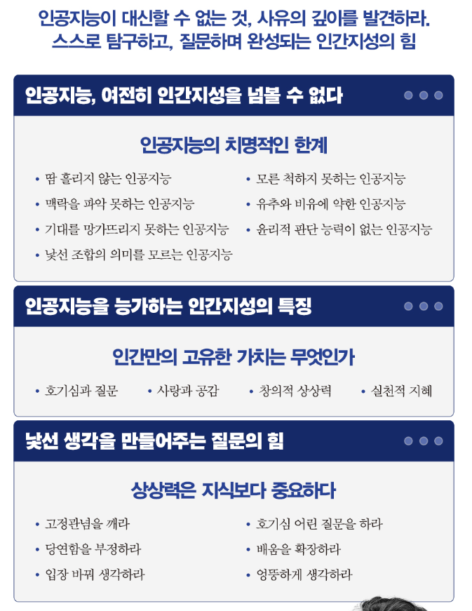

<!-- gid:20241016T111657 -->
[TOC]

[[TIP("이 노트에 대하여")]]
유영만은 지식생태학과 코나투스를 바탕으로 배움, 일, 인공지능 시대의 자기 형성을 연결해 사유한다. 앎을 축적이 아니라 살아 움직이는 생태로 바라보게 한다.
[[/TIP]]

## 히스토리

-   [2025-06-08 Sun 10:07] 최재천 선생님
-   [최재천 1953 통섭 공부 숙론 대화 생태 환경 지성인](https://wikidocs.net/382283)

### 코나투스 일생이론

[2024-10-16 Wed 11:16]

#코나투스 #일생이론 단어 좋다. 자기계발 철학 주제로 지식 및 관련 사례 얻기 좋다. 질문은 같다. 시대의 질문이다.

단어 만들기 고수다. 어쏠로지어떻게 보십니까? 지식생태학자라는 단어에서 학자가 없으면 좋을텐데. 지식이란 단어도 없는게 더 좋을듯. 거리의 키보드 악사로 남으리. 책을 엄청나게 내셨다. 문득 생각이 들었다.

[[4] 1생1권 모두가저자다 인생은한권의책 조테로공유그룹](https://wikidocs.net/381331)

-   A stream of instinctive desire to continue one's existence
-   자신의 존재를 지속하려는 본능적 욕망의 흐름
-   자신만의 #경험 #생각 #언어로 스스로를 확장하라.
-   습관성 자기계발 시대, 삶의 주도권을 지켜내는 일생이론
-   #일생이론 무엇? 어떻게?
-   내면의 코나투스를 이해하라
-   9명의 일생이론 사례

## 관련메타

-   [학습 배움](https://wikidocs.net/380540)

## BIBLIOGRAPHY

- 유영만. 2024. <i>코나투스</i>. [https://m.yes24.com/Goods/Detail/126659289](https://m.yes24.com/Goods/Detail/126659289).
- ———. 2025. <i>모두 인공지능 백신 맞았는데 아무도 똑똑해지지 않았다</i>. [https://www.yes24.com/product/goods/144165120](https://www.yes24.com/product/goods/144165120).

## 코나투스

(유영만 2024)

습관성 자기계발을 멈춰야 '자기'가 '계발'된다. 최고의 나를 구축하는 내면의 힘'코나투스 일생이론'자기계발을 꾸준히 하는데 자기가 계발되기는커녕 '자아'가 '탕진'되는 이유를 한 번이라도 생각해본 적 있는가? 타인의 성공은 나의 성공과 다르다. 틀에 박힌 자기계...

## 모두 인공지능 백신 맞았는데 아무도 똑똑해지지 않았다

(유영만 2025)

내 인생에 지혜를 더하는 시간, '인생명강' 시리즈 "정답을 좇지 말고, 질문을 던져라. 그것이 인간만이 가진 힘이다."

살아가는 데 필요한 모든 교양 지식을 한데 모았다! 대한민국 대표 교수진이 펼치는 흥미로운 지식 체험, '인생명강' 시리즈의 서른한 번째 책이 출간됐다. 역사, 철학, 과학, 의학, 예술 등 전국 대학 각 분야 최고 교수진의 명강의를 책으로 옮긴 인생명강 시리즈는 독자들의 삶에 유용한 지식을 통해 오늘을 살아갈 지혜와 내일을 내다보는 인사이트를 제시한다. 도서뿐만 아니라 온라인 강연·유튜브·팟캐스트를 통해 최고의 지식 콘텐츠를 일상 곳곳에서 만나볼 수 있는 지식교양 브랜드이다.

『모두 인공지능 백신 맞았는데 아무도 똑똑해지지 않았다』에서 유영만 교수는 인공지능 시대를 넘어설 인간 고유의 능력과 가치는 무엇인지 고찰한다. 편리한 인공지능이 제시하는 빠른 정답에 감탄할수록 인간의 문제의식은 실종되고 인공지능에 종속되어 인공지능의 복사본에 불과한 삶을 살아가게 된다. 정답을 찾는 데 그치지 않고 질문을 던지고 문제를 제기하는 문제아가 인공지능 시대를 넘어 인간지성의 새로운 지평을 열어갈 수 있다. '편리한 인공지능'을 넘어서는 '불편한 인간지성'에 대한 비밀을 집대성해서 이 책에 담아 보았다.

### 프롤로그 머뭇거리지 않는 인공지능 앞에서 머뭇거리는 까닭은?

### 1부 편리한 인공지능, 불편한 편파적 진리를 낳는다

#### 01 인공지능, 여전히 인간지성을 넘볼 수 없는 까닭은?

#### 02 궁지에서 경지로 가는 인간 학습, 긍지를 만나다

#### 03 궁리하는 인간지성, 고민하지 않는 인공지능을 이긴다

#### 04 인간지성은 '생성generation'하지 않고 '생성becoming'한다

### 2부 틀 밖의 질문이 뜻밖의 관문을 열어간다

#### 01 인공지능을 능가하는 네 가지 인간지성

#### 02 사랑하면 질문이 쏟아지고 혁명이 시작된다

#### 03 전대미문의 질문이 낯선 관문을 연다

#### 04 질문하는 동안은 동안이다

#### 05 질문은 일의 본질을 재고하게 만드는 동인이다

### 3부 공감하고 상상해야 비상한다

#### 01 진짜 생각은 가슴에 두 손을 대고 반성하는 용기다

#### 02 세계관世界觀보다 세계감世界感이 먼저다

#### 03 상상력은 지식보다 중요하다

#### 04 타자의 아픔을 사랑할 때 혁신이 시작된다

### 4부 지식으로 지시하지 말고 지혜로 지휘하라

#### 01 질문에 반문할 때 지혜가 싹튼다

#### 02 실패 경험이 방법 개발 전문가를 낳는다

#### 03 성공 체험의 덫, 휴브리스

#### 04 머리로 알기 전에 가슴으로 느낌이 온다!

#### 05 실천적 지혜는 딜레마 속에서 탄생된다

### 5부 '성적'을 뒤집으면 '적성'이 된다

#### 01 사(4)찰의 사이클: 관찰, 고찰, 통찰, 성찰

#### 02 원員으로 끝나는 직업과 가家로 끝나는 직업의 차이는?

#### 03 색달라지면 남달라진다

#### 04 역경을 뒤집으면 경력이 살아난다

#### 05 남보다 잘하지 말고 전보다 잘해라

#### 06 학부모가 부모가 되는 유일한 비결은?

#### 07 모든 창작은 이전 작품의 창의적 표절이다

### 에필로그 확신은 부패한다. 질문은 방부제다

### 책 속으로

인공지능을 통해 답을 찾아가는 사람이나 사람이 원하는 답을 찾는 인공지능이나 조급하고 부산하며 불안하기는 마찬가지다. 사람도 정보도 여기서 저기로 건너뛰거나 그 길을 대충 훑고 지나가며, 뭔가에 홀린 듯 또는 정신없이 쫓기듯 안절부절못한다. 머뭇거릴 여유가 없으니 그 의미를 생각할 수 없고, 유유자적하며 생각의 흔적을 남길 수도 없다. 정보에서 의미를 찾아야 의미가 생기고, 정보는 의미가 생겨야 더욱 의미심장해진다. 그 의미의 중력이 무거울수록 우리는 그것을 깊이 파고들어 수평적으로 떠돌아다니는 정보 더미에서 벗어나 수직적 깊이를 추구하며 우뚝 솟아오를 수 있다. --- pp.10-11

인공지능 기술은 날로 발전하면서 인간의 창의성을 위협하는 요인으로 작용하고 있다. 인공지능이 인간보다 창의적인 작품을 만들어내는 날이 올 것이라는 조심스러운 예측도 나오는 상황이다. 실제로 인공지능의 창작 능력이 이미 인간을 능가했다고 보는 사람도 많다. 인공지능이 인간 지능을 능가할 가능성은 다양한 사례를 통해 입증되고 있다. 하지만 인간지성을 능가하는 사례는 아직 발견되지 않았다. 인공지능은 가능하지만, 인공 지성은 가능하지 않기 때문이다. 이 점을 이해하기 위해서는 지능과 지성의 차이를 알아야 한다. --- p.31

인공지능은 맥락을 파악하지 못한다. 인간이 갖고 있는 고유한 능력 중의 하나가 맥락적 사유다. 청중이나 상대방을 대상으로 말하는 와중에도 계속 눈치를 보면서 지금 자신이 하고 있는 이야기가 여기서 먹히고 있는지를 파악한다. 농담을 던졌을 때 상대방이 그것을 농담으로 받아들이는지 진담으로 받아들이는지를 파악한 다음, 기대와는 반대로 농담을 진담으로 받아들이고 있다는 느낌이 들면 바로 수습한다. 자칫 치명적인 문제가 생길 수도 있기 때문이다. 맥락적 사유는 커뮤니케이션의 핵심적인 능력이다. 커뮤니케이션은 전달자의 의도와 의미를 상대방이 어떻게 받아들이는지 살피면서 그 반응에 따라 내가 전달하고 싶은 메시지의 의미나 유형을 바꾸는 과정이기 때문이다. 맥락적 사유는 한마디로 종합적인 상황 판단 능력이다. 상대방이 자신이 한 이야기의 의미를 의도와 다르게 해석한다면 그 이유가 무엇인지 순식간에 판단한 다음, 본래 의도와 다르게 의미를 바꾸거나 보다 구체적인 사례를 들어 설명하는 등 전략을 바꿀 수도 있다. 그런 임기응변력이 바로 맥락적 사유다. 인공지능은 이처럼 예상치 못한 상황을 판단하고, 순간적으로 변하는 상황에 대응하는 능력이 없다. 각본 없는 시나리오를 처리하는 데 미숙하다고 할 수 있다. --- pp.35-36

질문은 사고방식의 혁명을 일으키는 원동력이자 우발적 접촉을 촉진시켜 관계없는 것을 연결시키는 이연연상의 촉발점이다. 질문은 당연함을 부정하는 자극제이자 삶의 방향을 재점검하게 만드는 성찰의 출발점이다. 질문은 모르는 게 무엇인지를 깨닫게 만드는 각성제다. 질문만 던져도 사고방식은 물론 살아가는 방식을 근본적으로 재고해보게 만드는 혁명적 동인을 마련하는 셈이다. --- p.122

아리스토텔레스의 실천적 지혜는 전례나 관례가 있다고 모든 사안을 전례나 관례대로 판단하지 않고, 일의 참된 목적에 비추어 볼 때 주어진 상황에서 가장 올바르게 행동하기 위해서는 어떻게 해야 되는지에 대해 숙고하며 도덕적으로 판단하는 능력이다. 한 마디로 실천적 지혜는 일의 참된 목적에 비추어 내리는 올바른 상황 판단력이다. 인공지능에게는 이런 실천적 지혜가 없다. 인공지능은 흑백 논리로 정답이 정해져 있는 상황에서 복잡하게 얽혀 있는 실타래를 빠르게 풀어낼 수 있다. 그러나 회색지대와 딜레마 상황에서 정답이 정해져 있지않은 모호하고 불확실한 사안에 관해서는 쉽게 판단 을 내리지 못한다. --- p.188

인공지능과 사람의 차이가 점차 줄어들고 있다. 인공지능은 알고리즘을 통해 질문도 수없이 생산해낸다. 하지만 반문하는 인공지능은 없다. 반문이란 자기가 던진 질문이 과연 상황에 맞는지 스스로 평가하고 판단하는 물음이다. 인공지능은 반문할 수 없다. 알고리즘과 패턴에 따라 확률적으로 생산만 한다. 자기 질문의 질적 속성, 타당성, 적절성을 판단하는 질문, 즉 반문은 사람만의 고유한 능력이다. --- p.209

### 출판사 리뷰

"편리함에 길들여질 것인가, 사유하는 인간으로 남을 것인가?" 편리한 인공지능을 넘어 불편한 인간지성으로

인공지능(AI)의 발전은 우리의 삶을 혁신적으로 변화시키고 있다. 하지만 유영만 교수는 '편리한' 인공지능이 가져오는 혜택 속에서 우리가 점점 더 수동적인 존재로 변해가고 있다고 경고한다. 우리는 AI가 제공하는 정답을 그대로 받아들이면서 사유하는 힘을 잃어가고 있으며, 결국 '복사본' 같은 인간으로 전락할 위험에 처해 있다. 그는 이를 극복하기 위해 '불편한' 인간지성을 연마해야 한다고 주장한다. 즉, 빠르고 효율적인 정답이 아니라, 고난을 통해 깨닫고 경험하며 얻어내는 지혜야말로 우리가 진정으로 추구해야 할 목표라는 것이다. 이 과정은 마치 에베레스트를 오르는 것과 같다. 헬리콥터를 타고 정상에 도달하는 것과 스스로 악전고투하며 오르는 것은 전혀 다른 경험이다. 후자가 진정한 성장과 깨달음을 안겨준다. 마찬가지로, 인간은 AI가 제공하는 쉽고 빠른 해결책에 의존하기보다 스스로 탐구하고 도전하며 새로운 관점을 만들어내야 한다.

"감탄은 머리에서 나오지만, 감동은 심장에서 나온다." 인공지능이 대신할 수 없는 것, 사유의 깊이를 발견하다

"감탄이 아니라 감동을 창조하라"라는 그의 메시지는 깊은 울림을 준다. AI가 만들어낸 문장은 논리적이고 정교하지만, 거기에는 인간의 경험과 감정이 담긴 원본 스토리가 빠져 있다. 우리는 AI가 대신할 수 없는 인간만의 창조성을 발휘해야 한다. 이를 위해서는 불편함을 감수하고 사유의 깊이를 더하는 노력이 필요하다. 이에 저자는 편리한 길을 택하면 편협한 사고가 남고, 불편한 길을 걸으면 풍부한 지혜가 남는다고 말한다. 또한 저자는 인공지능이 가져다주는 편리함 속에서도 우리가 인간으로서 지성을 잃지 않도록 끊임없이 질문하고, 고민하고, 몸으로 부딪히는 삶을 살아야 한다고 강조한다. 이 책은 AI 시대를 살아가는 우리가 단순한 기술 소비자가 아니라, 창조적 사유를 가진 주체적인 인간으로 남기 위한 길을 제시한다. AI 시대의 도래 속에서 우리는 과연 어떤 선택을 해야 할 것인가? 이 책이 던지는 질문에 답하기 위해, 우리는 다시금 생각하는 힘을 길러야 한다.

### 요약 이미지

