<!-- gid:20241019T145802 -->
[TOC]

[[TIP("이 노트에 대하여")]]
최용은 번역·교정 도구와 출판 실무를 넘나들며 한국어 글쓰기 환경을 다듬는 전뇌해커형 번역가다. 번역과 편집을 도구 제작으로 연결하는 실천이 인상적이다.
[[/TIP]]

## BIBLIOGRAPHY

  전뇌해커. 2023. “IT 글쓰기와 번역 노트.” 2023. [https://wikidocs.net/book/4103](https://wikidocs.net/book/4103).
  <i>번역 태양신이 나타났다! Gpt-4보다 번역 잘하는 국산 인공지능 🌞 Solar Custom Translate</i>. 2024. [https://www.youtube.com/watch?v=5F0155M0cH4](https://www.youtube.com/watch?v=5F0155M0cH4).
  <i>Solar Mini Translate Plug-in for Omegat 소개</i>. 2024. [https://www.youtube.com/watch?v=5QrFqhwmKOQ](https://www.youtube.com/watch?v=5QrFqhwmKOQ).
  “Ychoi-Kr/Seopyung #전뇌해커.” 2023. [https://github.com/ychoi-kr/seopyung](https://github.com/ychoi-kr/seopyung).

## 관련노트

-   [박응용 위키독스](https://wikidocs.net/382239)
-   [LLM 생성형 AI 애플리케이션 개발](https://wikidocs.net/382255)

## 요약 - 고수

[contacts::최용 전뇌해커 - ychoi-kr - wikibooks](https://wikidocs.net/380486.md#h-bbcdd3ca-8eb3-4989-a803-3bca9dd55fc4/)

## "ychoi-kr/seopyung <span class="org-hashtag">#전뇌해커</span>"

(“Ychoi-Kr/Seopyung #전뇌해커” 2023)

collect book reviews from online stores

## "IT 글쓰기와 번역 노트"

(전뇌해커 2023)

### Omega T 실행과 프로젝트 생성

OmegaT 실행하면 다음과 같은 화면이 나온다. 한글 인터페이스인 경우

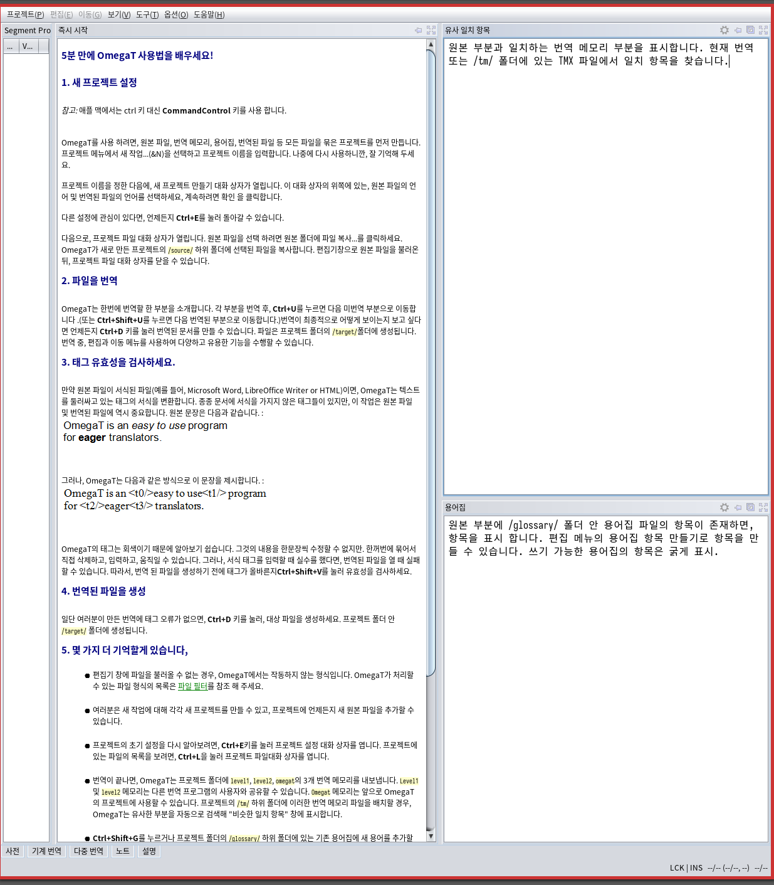

사용 중인 버전 정보는 다음과 같다.

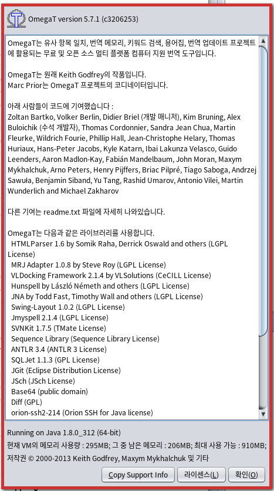

프로젝트 생성 설정 창을 보면 한글 토크나이저는 루신하고 훈스펠이 있다.

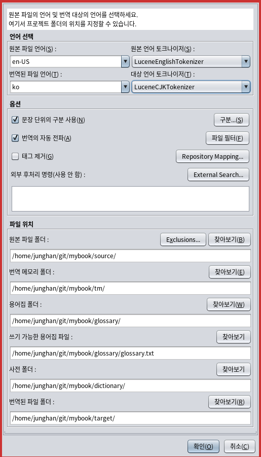

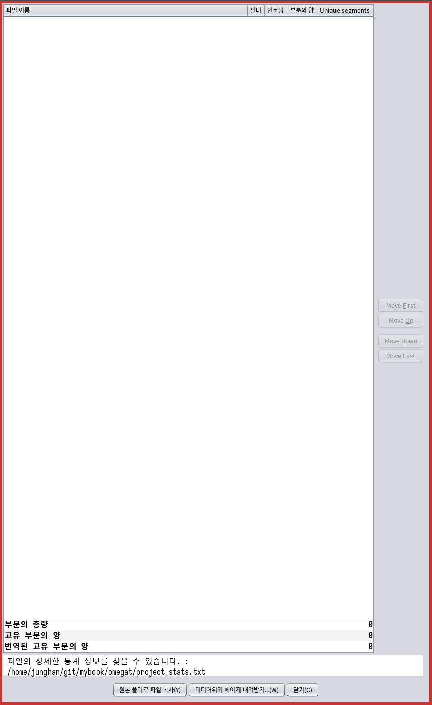

여기서 미디어위키 페이지 내려 받기를 누르고 다음 링크를 입력 후 확인.

<https://gist.githubusercontent.com/phillipj/4944029/raw/75ba2243dd5ec2875f629bf5d79f6c1e4b5a8b46/alice_in_wonderland.txt>

왜 이 파일이 미디어위키 페이지인가? 양식이 있나?! 아무튼 파일을 다운로드 되었다.

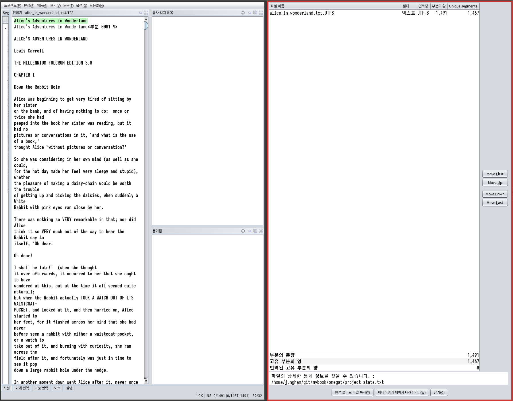

그러면 이제 프로젝트를 닫는다. 프로젝트 - 닫기

### 번역하기

[2023-06-25 Sun 18:28]

여기의 글을 기준으로 기록 합니다&nbsp;[^fn:1].

앞서 만든 프로젝트를 연다. mybook 디렉토리를 살펴 본다. 좋다. 하나의 시스템이다.

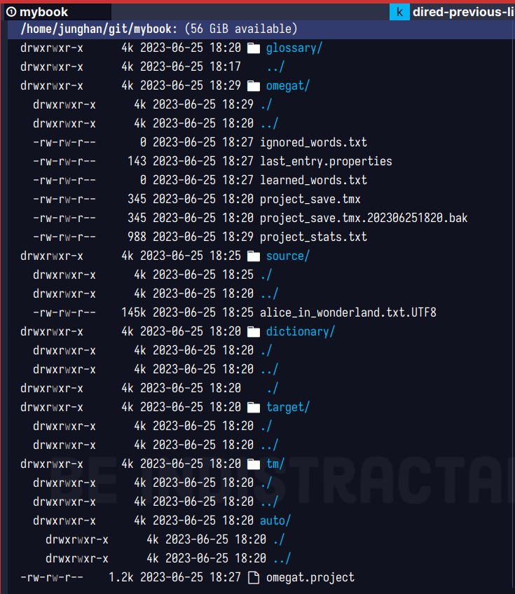

Segment (세그먼트)
: 문단 세그먼트의 원문을 밝은 녹색이다. 세그먼트는 문단에 해당 한다. 아이고, 한글로 설정해 놓았더니 부분 0001 이라고 보인다. 부분이 세그먼트다. 전뇌해커님 문서에서 언급한 바대로 녹색 아래에 똑같은 영어 문장에다가 번역문을 입력하고 `Ctrl + n` 을 누르면 다음 세그먼트로 이동한다.
    
    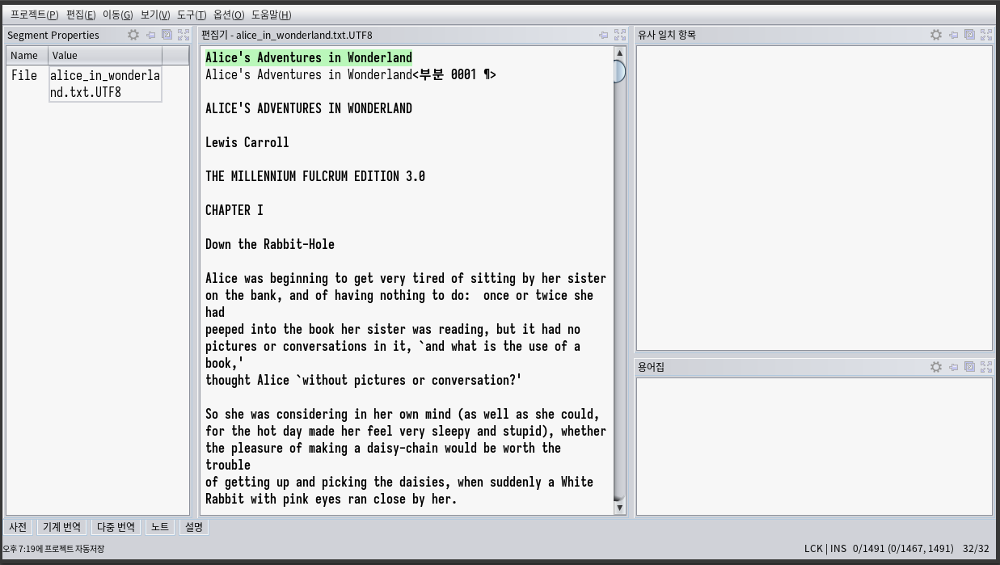

Match (유사 일치)
: 번역 메모리 세그먼트 2 로 이동했다. `유사 일치 항목` 을 활용하면 된다. `Ctrl + r` 로 키 바인딩 되어 있다.
    
    세그먼트 7 까지 이동했다. 여러 줄이 아래와 같이 선택이 된다. 폰트 좋다.
    
    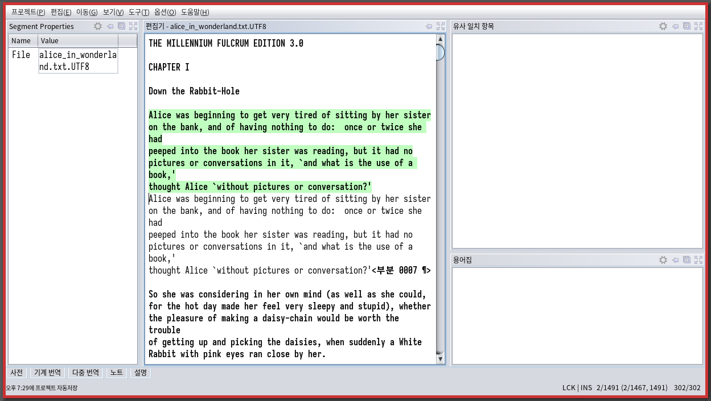

`C-d` 를 누르면 프로젝트 폴더 아래에 **target** 폴더에 번역 결과 파일이 생성 된다.

```text
Translated document created
```

### OmegaT 검색 기능

[2023-06-25 Sun 19:33] <https://wikidocs.net/159716>

일단 검색 창을 열어 보자.

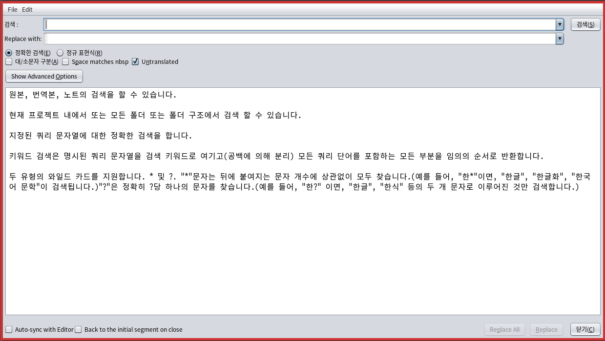

-   원문/번역문을 나눠서 특정 단어가 들어간 세그먼트 검색 가능.
-   정규표현식 지원 class 가 들어간 세그먼트를 찾되 'classification', 'multiclass' 등을 검색 결과에서 제외하고 싶다면, \bclass\b 를 입력하고 정규식 옵션을 켠다.

```text
조금 더 디테일한 전략이 필요할 듯
```

### Glossary : 용어집

[2023-06-25 Sun 19:42] 원문 : 번역문 형태로 관리 공동 작업 할 경우에는 드랍박스에 용어집을 파일을 넣어놓는다고 한다.

`C-S-g` Create Glossary Entry

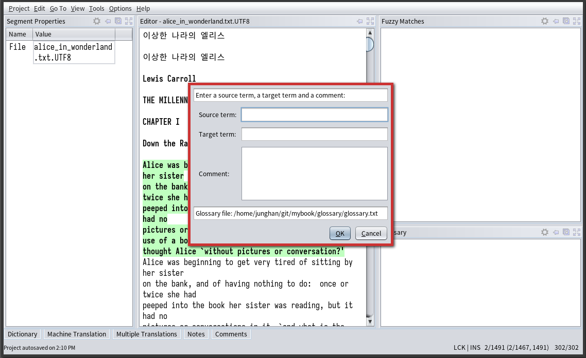

glossary/glossary.txt 파일을 보자. 오케이.

```text
# Glossary in tab-separated format -*- coding: utf-8 -*-
default	기본값 샘플 용어집 엔트리
```

### 사전 : StarDict dictionary

[2023-06-26 Mon 14:15]

스타딕. 영한 사전을 위해서 아래 중에 quick_english-korean 을 다운 받는다.&nbsp;[^fn:2]

다른 사전들과 무엇이 다른지는 아직 모른다.

| Korean Dic                | [tarball](stardict-KoreanDic-2.4.2.tar.bz2)              | Free to use, 8M, 147722 words   |
|---------------------------|----------------------------------------------------------|---------------------------------|
| quick_english-korean      | [tarball](stardict-quick_eng-kor-2.4.2.tar.bz2)          | GPL, 3,5M, 94170 words          |
| quick_korean-english      | [tarball](stardict-quick_kor-eng-2.4.2.tar.bz2)          | GPL, 7.6M, 49757 words          |
| Korean-English Dic        | [tarball](stardict-KoreanEnglishDic-2.4.2.tar.bz2)       | Free to use, 7M, 49757 words    |
| Hanja(Korean Hanzi) Dic   | [tarball](stardict-Hanja_KoreanHanzi_Dic-2.4.2.tar.bz2)  | Free to use, 2.5M, 124831 words |
| Korean Law Dic            | [tarball](stardict-KoreanLawDic-2.4.2.tar.bz2)           | Free to use, 1.1M, 3225 words   |
| Korean Medical Dic        | [tarball](stardict-KoreanMedicalDic-2.4.2.tar.bz2)       | Free to use, 543K, 7721 words   |
| Korean Animal Medical Dic | [tarball](stardict-KoreanAnimalMedicalDic-2.4.2.tar.bz2) | Free to use, 516K, 33845 words  |
| Korean-Russian dictionary | [tarball](stardict-GPL_korean-russian-dic-2.4.2.tar.bz2) | GPL, 1.5M, 29080 words          |

리눅스에서는 압축 풀고 파일만 ~/.stardict/dic/ 폴더에 복사해 넣는다. 내가 사용하는 사전이다. 여기에 quick_english-korean 이 보인다.

```text
/home/junghan/.stardict/dic
jhnuc➜  dic  ᐅ  ls
EnglishEtymology.dict.dz          dictd_www.dict.org_gcide.idx               dictd_www.dict.org_moby-thesaurus.idx.oft
EnglishEtymology.idx              dictd_www.dict.org_gcide.idx.oft           dictd_www.dict.org_moby-thesaurus.ifo
EnglishEtymology.idx.oft          dictd_www.dict.org_gcide.ifo               quick_english-korean.dict.dz
EnglishEtymology.ifo              dictd_www.dict.org_moby-thesaurus.dict.dz  quick_english-korean.idx
dictd_www.dict.org_gcide.dict.dz  dictd_www.dict.org_moby-thesaurus.idx      quick_english-korean.ifo
```

왜?! 오메가 뿐만 아니라 이맥스에서도 스타딕을 활용한다.

프로젝트 설정은 project - Properties 에서 Dictionary 폴더가 있다. 여기에 복사 한다. 다른 사전을 넣어도 활용할 수 있겠다. 지금 세그먼트에 해당하는 단어가 보이는 것 같다.

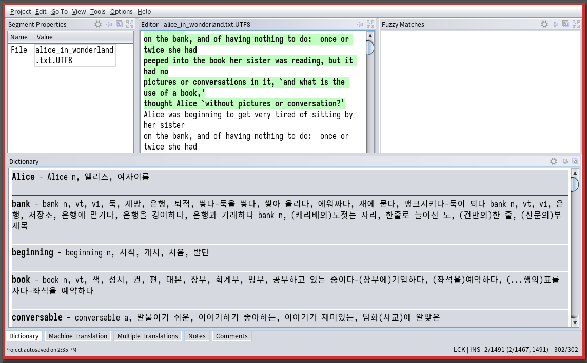

### 기계 번역 (Machine Translation)

[2023-06-26 Mon 14:38] 생산성을 끌어 올리는 방법이다. 내가 이맥스에서 하는 방법과 뭐가 다를까?!

#### 구글 번역 API 활용 (전뇌해커님 영상)

<https://www.youtube.com/watch?v=s__88oLVNFk>

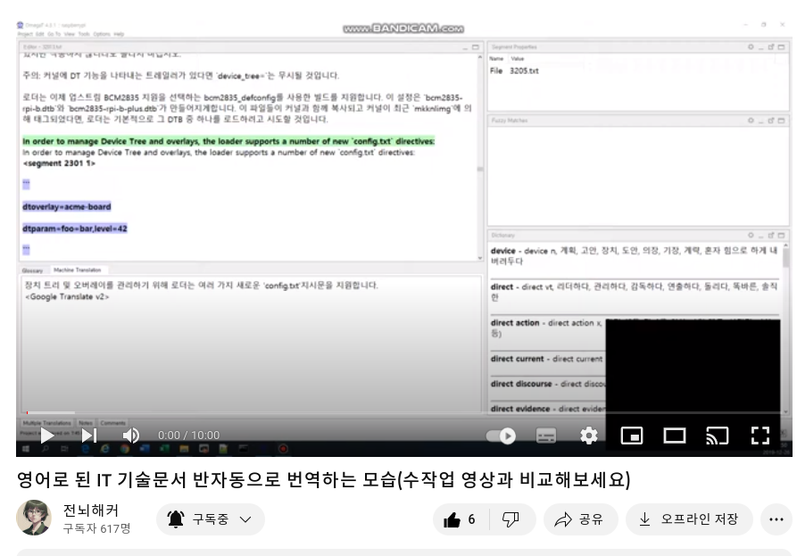

#### 구글 번역 API 발급

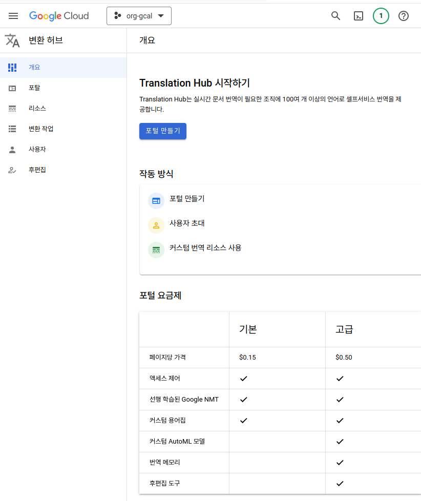

#### 구글 번역 API 할당량 설정 방법

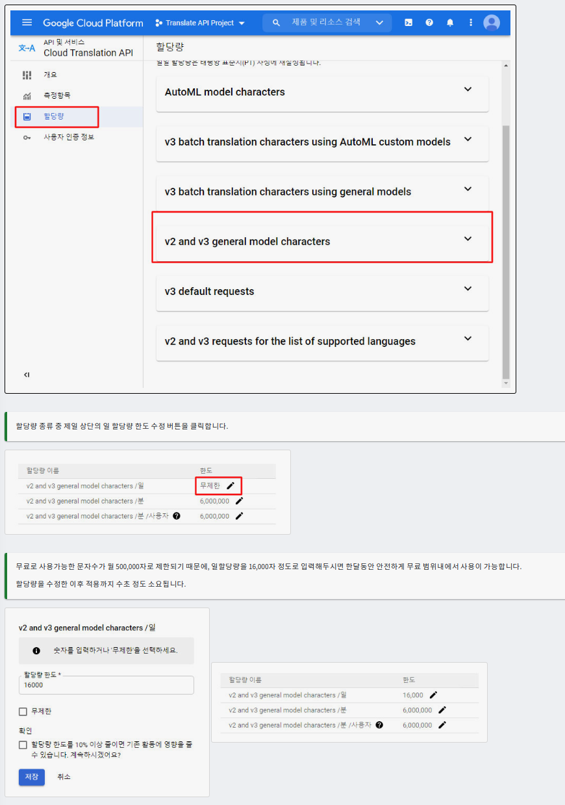

-   정말 좋은 자료 다음 확인 <http://www.themango.co.kr/tmg/mall/admin/manual/manual.php?page=9_4_3>

#### 설정 방법 : Untranslated segments only 켜는 이유는?

```text
네이버 무료 번역 / 유료 번역 API 발급 내용도 있다.
```

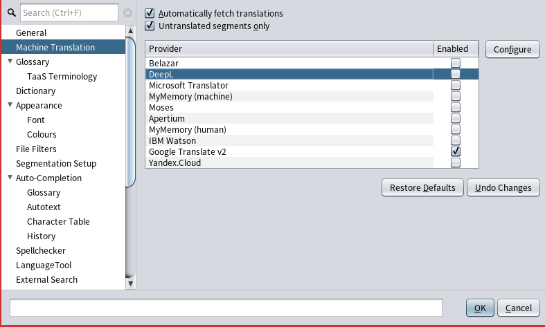

두 가지 이상의 번역 API 함께 활용
: 구글과 DeepL 예시를 보여준다. DeepL 키 등록이 아직 안된다. 한국 사용 불가.

### 기계 번역 결과 비교

[2023-06-26 Mon 15:46] 다음 원문을 여러 번역 서비스로 진행하고 테이블을 확인.

```text
Convolutional layers were designed specifically for images.<a0></a0><a1></a1>
They operate in two dimensions and can capture shape information; they work by
sliding a small window, called a <e2>convolutional filter</e2>, across the image
in both directions.
```

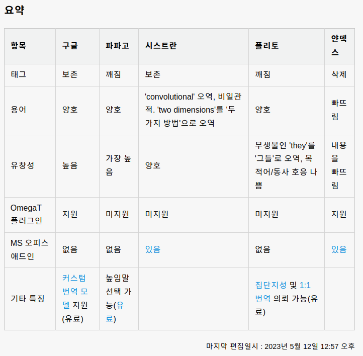

### 세그멘테이션 (Segmentation) 설정

[2023-06-26 Mon 15:49] <https://wikidocs.net/156946>

마침표 말고도 영어에서는 약어 뒤에도 . 을 찍는다. 예를 들어 a.k.a 이 부분은 이맥스에서도 중요하다. 둘 사이에 싱크가 필요하겠네

### 플러그인 : FakeMT : 기계번역서버 설정

[2023-06-26 Mon 15:54] <https://wikidocs.net/157584>

메타 정보가 들어가면 제대로 번역이 안되는 문제와 결과가 높임말로 나오는게 불편해서 기계 번역 서버 설정하는 플러그인 필요.

기계 번역 공급자 서버를 파이썬으로 만들어서 공개함.

### 플러그인 : Okapi Filters Plugin for OmegaT 파일 포멧

[2023-06-26 Mon 16:00] Markdown 형식을 인식한다. 다른 포멧도 인식 할 듯?!

### OpenAI 플러그인 + ChatGPT 와 LangChain 노트

[2023-06-26 Mon 16:03] <https://wikidocs.net/197120>

오 재미있네. 책에 보면 스타일링 관련해서 다양한 테스트를 하셨네ㅎㅎ

### 파파고 플러그인 (공식)

[2023-06-26 Mon 16:07] <https://wikidocs.net/197058>

리눅스에서는 애매하네. 아래와 같이 파일을 만들었다. 동작하는 듯 /opt/omegat/scripts/properties/naver.properties

### <span class="org-todo todo TODO">TODO</span> 용어집 샘플

[2023-06-26 Mon 16:35] <https://wikidocs.net/67062>

아래 테이블을 txt 파일로 저장했다. 오메가 용 파일이라고 보면 된다.

-   [IT 용어 일반](<https://wikidocs.net/67110>)V
-   [프로그래밍, 데이터베이스](<https://wikidocs.net/67069>)
-   [네트워크, 클라우드, 보안, 블록체인](<https://wikidocs.net/67067>)
-   [데이터 과학, 인공지능, 통계, 시각화, 언어학](<https://wikidocs.net/67188>)
-   [IoT(사물 인터넷), 전기, 전자](<https://wikidocs.net/67190>)

### <span class="org-todo todo TODO">TODO</span> Glossary - TaaS API (Terminology)

[2023-06-26 Mon 16:22]

이건 뭐지?!

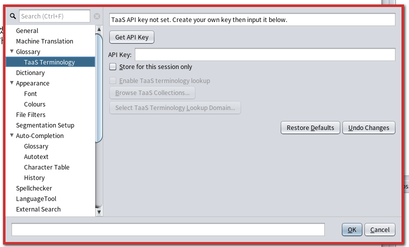

## "Solar Mini Translate Plug-in for OmegaT 소개"

(<i>Solar Mini Translate Plug-in for Omegat 소개</i> 2024)

비디오 요약 (Edge Copilot으로 생성): 이 비디오는 전뇌해커가 개발한 솔라 미니 트랜슬레이트 API를 활용하는 오메가 T 플러그인을 소개하고 사용하는 모습을 보여줍니다. 이 플러그인은 전문 번역가를 위한 트랜슬레이션 메모리 관리 프로그램인 오메가에 연동되어 기계 번역을 제공합니다. 솔라 미니 트랜슬레이트는 구글 트랜슬레이트나 오픈 AI 트랜슬레이트보다 품질이 좋고 응답이 빠르며 안정적이라고 주장합니다. **하이라이트**: 00:00:01 **솔라 미니 트랜슬레이트 API와 오메가 T 플러그인 소개** 솔라 미니 트랜슬레이트는 스마트 파일을 사용하여 번역 품질을 높임 오메가 T는 번역 작업을 도와주는 툴로, 여러 기계 번역 API를 연동할 수 있음 플러그인 설치 방법과 사용법을 github 사이트에서 확인할 수 있음 00:10:08 **오메가 T 플러그인을 사용하여 번역 작업 실시** 원문을 세그먼트로 나누고, 각 세그먼트에 대해 기계 번역 결과를 보여줌 구글, 오픈 AI, 솔라 미니 트랜슬레이트 중에서 가장 적절한 번역을 선택하거나 수정함 번역문을 저장하고, 태그나 코드 등을 적절히 처리함 00:23:15 **번역 작업 결과와 플러그인의 장단점 평가** 2.5.5 섹션을 번역하고, 버퍼드 이미지와 픽셀스에 대한 그림과 설명을 추가함 솔라 미니 트랜슬레이트는 문장 연결이 자연스럽고, 응답이 빠르고, 안정적임 오픈 AI 트랜슬레이트는 문장이 자연스럽기는 하지만, 응답이 늦거나 안 오기도 함 구글 트랜슬레이트는 문장이 잘려 있거나, 번역이 이상하거나, 품질이 낮음 오메가 T 플러그인은 세그먼테이션에 따라 번역 품질이 달라질 수 있으므로, 원문을 가공하거나, 번역 후에 수정하는 과정이 필요함

-   [오메가티 플러그인::2024 "Solar Mini Translate Plug-in for OmegaT 소개](https://wikidocs.net/381359.md#h-44e6bb07-e576-44e0-89c7-367f257327da/)

## "GPT-4보다 번역 잘하는 국산 인공지능 🌞 Solar Custom Translate"

(<i>번역 태양신이 나타났다! Gpt-4보다 번역 잘하는 국산 인공지능 🌞 Solar Custom Translate</i> 2024)

Solar Custom Translate가 새로 나왔길래, 요즘 짬짬이 번역하고 있는 David J. Eck의 ⟪Introduction to Computer Graphics⟫를 번역하는 데 사용해 보았습니다. 속도도 빠르고 번역 품질이 뛰어나며, 사용자의 문체를 바로바로 학습시킬 수 있어 편리합니다. <https://solar-translate.streamlit.app/> 번역서는 ⟪컴퓨터 그래픽스 입문⟫이라는 제목으로 위키독스에 올립니다. <https://wikidocs.net/book/14468> ——— 아래는 Edge 브라우저의 copilot을 사용해서 영상 내용을 요약한 것입니다. 영상 요약 [00:00:00] - [00:55:40]: 이 영상은 GPT-4보다 더 잘 번역할 수 있는 한국 인공지능인 Solar Custom Translate를 시연하는 영상입니다. 이 번역기는 복잡한 마크업, 기술 용어, 자연스러운 회화 등을 다룰 수 있습니다. 또한, 사용자의 스타일과 취향을 학습하여 번역을 더욱 자연스럽게 만들어 줄 수 있습니다. **중요한 내용**: [00:00:00] **Solar Custom Translate의 기본 기능** 텍스트를 복사하여 붙여넣기하여 번역할 수 있습니다. GPT-3.5보다 더 빠르게 번역하며, GPT-4보다 더 정확합니다. 추상 클래스와 같은 기술 용어도 다룰 수 있습니다. [00:04:56] **Solar Custom Translate의 스타일 편집 기능** 결과물을 수정하여 번역의 톤을 변경할 수 있습니다. 마크업과 태그를 자동으로 처리하여 번역할 수 있습니다. 사용자가 수정한 내용을 기억하여 다음 번역에 반영할 수 있습니다. [00:23:11] **Solar Custom Translate와 GPT-4의 비교** Solar Custom Translate는 자연스러운 회화와 높임말을 번역할 수 있습니다. GPT-4는 항상 높임말로 번역하며, 수동으로 편집해야 합니다. Solar Custom Translate는 GPT-4보다 더 빠르고 신뢰성이 높습니다. [00:31:02] **Solar Custom Translate를 사용한 기술 문서 번역** 이 문서는 Java 2D에 대한 내용으로, 복잡한 마크업과 용어가 포함되어 있습니다. Solar Custom Translate는 이 문서를 거의 오류 없이 번역할 수 있습니다. 사용자는 다른 도구를 사용하여 번역을 다듬고 번역선을 제거할 수 있습니다.

## <span class="org-todo done DONE">DONE</span> 생산성 도구 활용 팁 by 전뇌해커

[2023-08-16 Wed 09:02] <https://wikidocs.net/180830>

[^fn:1]: <https://wikidocs.net/67117>
[^fn:2]: <http://download.huzheng.org/ko/stardict-quick_eng-kor-2.4.2.tar.bz2>
