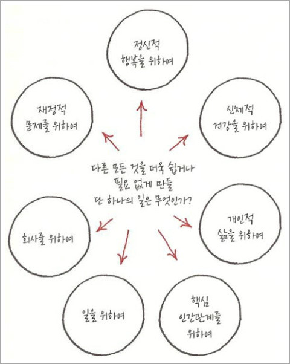

<!-- gid:20241020T174104 -->
[TOC]

[[TIP("이 노트에 대하여")]]
《원씽》은 가장 중요한 한 가지에 집중하게 만드는 질문을 통해 우선순위와 실행의 기준을 세운다. 산만함을 줄이고 방향을 잡을 때 반복해서 꺼내 볼 만하다.
[[/TIP]]

## Related-Notes

-   [질문](https://wikidocs.net/380671)
-   [그렉맥커운 에센셜리즘 최소노력의법칙](https://wikidocs.net/381903)

## BIBLIOGRAPHY

- 그렉 멕커운. 2021. <i>최소 노력의 법칙: 더 쉽고, 더 빠르게 성공을 이끄는 힘</i>. Translated by 김미정. 서울: RHK(알에이치코리아). [https://www.yes24.com/Product/Goods/104469852](https://www.yes24.com/Product/Goods/104469852).
- 제이 파파산, and 게리 켈러. 2013. <i>원씽 - 복잡한 세상을 이기는 단순함의 힘</i>. Translated by 구세희. 비즈니스북스. [https://www.yes24.com/Product/Goods/12332164](https://www.yes24.com/Product/Goods/12332164).

## 히스토리

-   [2025-05-20 Tue 19:30] 오랜만에 재점검 - 랜덤노트
-   [2022-05-19 Thu 17:41] 초점탐색질문의 시작

## 원씽 - 복잡한 세상을 이기는 단순함의 힘

(제이 파파산 and 게리 켈러 2013)

-   One-Thing -- 초점탐색질문

### 스스로에게 던지는 질문

-   '내가 할 수 있는 단 하나의 일'
-   '그 일을 함으로써'
-   '다른 모든 일들을 쉽게 혹은 필요 없게 만들' 바로 그 일은 무엇인가? 

### 여기에 같이 들어갈 팁들이 있다.

-   (그렉 멕커운 2021) 여기서 참고
-   완료 상태를 명확히 하라.
-   하한선과 더불어 상한선도 정해놓고 꾸준히 하는 것을 목표로 하라.
-   원래 시작은 미약하다. 받아들이면 훨씬 즐겁게 할 수 있다.

### 소개

더 적게 일함으로써 상대적으로 깊게 집중하여 더 크게 성공하는 비결을 소개한다. 애플에게는 아이폰이 있었고, 인텔에는 마이크로프로세서가 코카콜라에게는 그들만의 레시피 하나가 있었다. 가장 중요한 단 하나의 가치, 단 한 명의 사람, 단 하나의 아이디어가 당신의 삶을 변화시키고 세상을 바꿀 수도 있다. 따라서 여러 전략을 모색하는 것보다 더욱 중요한 것은, 자신의 인생에서 가장 중요한 '원씽 The One Thing'을 찾는 일이다. 우리에게 지금 당장 필요한 것은 중요한 일을 지속시킬 수 있는 '습관', 그리고 이러한 습관 만들기에 필요한 실질적인 지침이다. 모두가 성공의 원칙이라고 인정했던 잘못된 믿음으로 인해 우리는 바쁘게 일하는 것만이 능사라고 여기지만, 성공을 둘러싼 허상에서 벗어나 자신만의 큰 목표를 세우는 것이 더욱 중요하다. 성공의 열쇠는 우리가 '모든 일'을 다 잘 해낼 때가 아니라 가장 핵심적인 일을 가장 '적합한' 순간에 해낼 때 찾아온다는 것을 잊지 말자. 책에서 말하고 있는 인생의 성공과 행복에 대한 진리는 너무도 단순하다. 당신에게 가장 중요한 '원씽 The One Thing'을 찾아 집중하고 파고들라는 것이다. 커리어가 됐든, 비즈니스가 됐든 가정생활이든, 인간관계이든 삶의 각 분야에서 가장 중요한 가치를 찾아 몰두할 때, 일에서의 성공과 삶에서의 행복을 얻을 수 있다고 저자는 말한다. 이 책은 멀티태스킹을 비롯한 성공에 대한 거짓신화를 바로잡고, '원씽 The One Thing'의 일을 찾아 집중하는 법, 그리고 그 '원씽 The One Thing'을 찾아 어떻게 습관화하고 삶의 부분에 적용할 것인지 그 방법을 제시한다.

### 목차

-   한국의 독자들에게

-   제1장 당신에게 가장 중요한 '단 하나'는 무엇인가
-   제2장 도미노 효과
-   제3장 성공은 반드시 단서를 남긴다

-   제1부 : 거짓말_의심해 봐야 할 성공에 관한 여섯 가지 믿음

-   제4장 모든 일이 다 중요하다
-   제5장 멀티태스킹은 곧 능력이다
-   제6장 성공은 철저한 자기관리에서 온다
-   제7장 의지만 있다면 못할 일은 없다
-   제8장 일과 삶에 균형이 필요하다
-   제9장 크게 벌이는 일은 위험하다

-   제2부 : 진실_복잡한 세상에서 중심을 잃지 않는 법

-   제10장 미래의 크기를 바꾸는 초점탐색 질문
-   제11장 도미노를 세워라
-   제12장 삶의 해답으로 가는 길

-   제3부 : 위대한 결과_인생의 반전을 불러오는 단순한 진리

-   제13장 목적의식을 가지고 살아라
-   제14장 우선순위에 따라 살아라
-   제15장 생산성을 위해 살아라
-   제16장 세 가지 약속
-   제17장 네 종류의 도둑들
-   제18장 위대함으로 가는 변화의 시작

-   부록\_ 단 하나를 실생활에 적용하는 방법
-   감사의 말

### 책 속으로

우리에게 주어진 시간과 에너지는 한정되어 있다. 그것을 너무 넓게 펼치려 애쓰다 보면 노력은 종잇장처럼 얇아지게 된다. 사람들은 일의 양에 따라 성과가 점점 더 쌓이기를 바라는데, 그렇게 하려면 더하기가 아닌 빼기가 필요하다. 더 큰 효과를 얻고 싶다면 일의 가짓수를 줄여야 한다. 한 번에 너무 많은 일을 하려다 보면 설사 그렇게 하는 것이 효과가 있다고 해도, 아무것도 줄이지 않은 채 일을 자꾸 더하기만 하다가 결국엔 부정적인 결과를 맞게 된다. 마감 기한을 수시로 놓치게 되고, 만족스럽지 못한 결과가 나타나며, 스트레스가 높아지고, 업무 시간이 길어지며, 수면 시간이 줄어들고, 영양 상태가 나빠지며, 운동을 못하고, 가족은 물론이고 친구들과 함께 보내는 시간도 줄어든다. 이 모두가 생각보다 얻기 쉬운 것들을 좇으며 쓸데없이 노력을 낭비했기 때문이다. 파고드는 것은 남다른 성과를 내기 위한 간단한 방법이다. 게다가 효과도 좋다. 언제든, 어디에서든, 어떤 경우에서든 통한다. 왜일까? 단 하나의 목적의식, 궁극적으로 본인이 원하는 곳까지 도달한다는 단 하나의 목표만을 갖게 하기 때문이다. ---「제1장, 당신에게 가장 중요한 '단 하나'는 무엇인가」

훌륭한 성공은 동시다발적으로 일어나는 것이 아니라 순차적으로 일어나기 때문이다. 선형으로 시작된 것이 기하급수적으로 변한다. 올바른 결정을 내리고, 그 다음에 또 한 가지 올바른 결정을 내린다. 시간이 흐르면서 이것들이 쌓이다 보면 성공의 잠재력이 봇물 터지듯 발산된다. 도미노 효과는 당신의 업무나 사업처럼 큰 그림을 그려야 하는 일에도 적용되고, 매일 다음번엔 무슨 일을 할까처럼 결정을 내리는 아주 작은 순간에도 적용된다. 성공은 성공 위에 쌓이고, 이런 일이 반복적으로 일어나면 최고로 높은 수준의 성공을 향해 움직일 수 있게 된다. ---「제2장, 도미노 효과」

그래서 그와 동료 연구원들은 262명의 학생들에게 설문지를 주고 그들이 얼마나 자주 멀티태스킹을 하는지 알아보았다. 그런 다음 학생들을 멀티태스킹을 잘하는(즉 자주 하는) 그룹과 못하는 그룹, 둘로 나누고 자주 멀티태스킹을 하는 사람들이 더 좋은 결과를 내리라는 가정을 바탕으로 실험을 시작했다. 하지만 그들의 이러한 생각은 틀린 것으로 판가름 났다. "그들에게 비밀의 능력 같은 것이 있으리라고 생각했습니다. 하지만 멀티태스킹을 잘하는 사람들은 오히려 관련 없는 일에 푹 빠져 쓸데없는 시간을 보내는 것이 관찰됐습니다." 나스의 말이다. 그들의 성과는 모든 면에서 뒤떨어졌다. 그들 스스로나 세상 사람들이 보기에 그들은 멀티태스킹 능력에 매우 뛰어난 것 같았지만 거기에는 한 가지 문제가 있었다. 나스의 말을 빌리면 "멀티태스커들은 그저 모든 일에 엉망"이었던 것이다. 멀티태스킹이란 허상이다. ---「제5장, 멀티태스킹은 곧 능력이다」

스콧 포스톨이라는 사람의 이야기를 들려주고자 한다. 그는 새로운 팀에 필요한 인재들을 뽑는 자리에서 지원자들에게 이 일급기밀 프로젝트를 맡으면 "많은 실수를 저지르며 고생하겠지만 결과적으로 평생 기억에 남을 무언가를 하게 될 기회가 무궁무진할 것"이라고 말했다. 그는 회사 전반에 있는 인재들에게 이 알쏭달쏭한 말을 전했고, 이 도전에 즉각적으로 나선 사람들만 팀원으로 뽑았다. 나중에 그가 드웩의 책을 읽고 그녀에게 말한 것처럼 '성장의 사고방식'(growth-minded)을 가진 사람들을 찾고 있었던 것이다. 이 이야기가 왜 중요할까? 스콧 포스톨의 이름은 들어 본 적이 없다고 해도 그가 그렇게 소집한 팀이 내놓은 결과물을 모를 수는 없을 것이다. 포스톨은 애플의 수석 부사장이었고, 그가 뽑은 팀원들이 만든 것은 바로 아이폰이었다. ---「제9장, 크게 벌이는 일은 위험하다」

'오늘'을 당신이 가진 '모든 내일'과 연결시켜라. 이를 뒷받침하는 연구 결과도 있다. 총 262명의 학생들을 대상으로 시각화가 결과에 어떤 영향을 미치는지 조사했다. 학생들을 두 그룹으로 나누고 한 그룹의 학생들은 원하는 결과를 마음속에 그려 보았고(예를 들어 시험에서 A학점을 받는 것), 다른 한 그룹은 원하는 결과를 얻기 위해 필요한 과정(시험에서 A학점을 받기 위해 필요한 공부 과정 등)을 머릿속에 그렸다. 결론적으로 말하면 과정을 시각화한 학생들이 전반적으로 더 나은 결과를 얻었다. 결과만을 그려 본 학생들보다 먼저 공부를 시작하고 더 자주 함으로써 더 높은 성적을 거둔 것이다. ---「제14장, 우선순위에 따라 살아라」중에서

### 출판사 리뷰

인생의 반전을 불러오는 단순함의 힘 당신의 삶을 소모시키는 멀티태스킹의 허상에서 벗어나라!

아마존 종합 베스트셀러 1위! 《월스트리트 저널》 종합 베스트셀러 1위! 《뉴욕 타임스》《USA 투데이》《워싱턴 포스트》 베스트셀러! 전 세계 독자들이 주목한 2013년 최고의 책!

당신에게는 성공의 첫 번째 도미노가 있는가? 주위를 돌아보면 '무슨 일을 해도 어쩌면 저렇게 잘 풀릴까'라는 생각이 들게 하는 사람이 한 명씩은 꼭 있기 마련이다. 반대로 정말 열심히 살지만 제대로 풀리는 게 없다고 여기는 사람들도 있다. 이들은 타고난 팔자라거나 운이 좋았다는 식으로 다른 사람의 성공을 단정 짓고 자신들의 '운 없음'에 좌절하곤 한다. 하지만 그건 사실이 아니다. 위대한 성과를 내는 남다른 인생과 평범한 인생을 결정짓는 차이는 바로 '꼭 해야 할 일'에만 파고들었느냐, '필요 없는 일'에 에너지를 낭비했느냐에 있다. 성공은 도미노처럼 작동한다. 성공한 사람들은 늘 성공에 '꼭 필요한 일들'의 '순서'를 계획해놓고 '가장 알맞은 타이밍'에 첫 번째 일을 '제대로' 해낸다. 한 번 넘어지기 시작하면 멈추지 않는 도미노처럼 그들은 처음의 성공을 다음 행동과 연결 지음으로써 더 크고 더 위대한 성공을 이끌어낸다. 그들은 첫 번째 도미노만 정확히 찾아 쓰러뜨린다면 줄지어 늘어선 수많은 도미노는 자연히 쓰러지게 된다는 성공의 도미노 효과를 누구보다 잘 알고 있다. 모든 일을 시작하게 하는 단 하나의 도미노, 우리가 '원씽(The One Thing)'이라 부르는 이것을 찾아낼 수만 있다면 누구나 술술 잘 풀리는 인생을 경험할 수 있다.

The One Thing, 복잡한 세상에서 나만의 중심을 잃지 않는 법 《원씽 The One Thing》은 미국에서 가장 큰 투자개발 회사의 대표이자 총 130만 부 이상이 팔린 베스트셀러의 저자 게리 켈러와 제이 파파산이 쓴, 이제까지의 통념을 뒤엎는 신개념 자기계발서이다. 이 책이 말하고 있는 인생의 성공과 행복에 대한 단순한 진리는 바로 '원씽'(The One Thing), 자신에게 가장 중요한 단 하나, 가장 중요한 한 가지 일에 집중하고 파고들라는 것이다. '원씽One Thing'은 세상의 모든 분야에 적용될 수 있는 개념이다. 기업의 입장에서는 회사를 상징하거나 정체성을 드러내는 하나의 제품이나 서비스, 개인의 삶에서는 자신의 인생을 의미 있게 만들어주는 한 가지 목표를 의미한다. 다시 말해 기업의 수익성과 매출, 개인의 직업과 연봉과 같은 단선적인 시각이 아닌 보다 본질을 관통하는 주제이며 목적을 항해 나아가도록 해주는 원천인 것이다. 그래서 저자는 이 책에서 "당신에게 가장 중요한 '단 하나'는 무엇인가?"(What's your ONE Thing?)라고 계속해서 질문을 던진다.

중요하지 않은 것은 버려라. 당신의 에너지를 오직 한 가지에 집중하라! 자신만의 '원씽'을 찾는 방법을 알려주기 위해 씌여진 이 책은 총 3부로 구성되어 있다. 먼저 1부에서는 모두가 성공의 원칙이라고 믿어온 여섯 가지 주장(모든 일이 다 중요하다 _멀티태스킹은 곧 능력이다_ 성공은 철저한 자기관리에서 온다 _의지만 있다면 못할 일은 없다_ 균형 잡힌 삶이 아름답다/크게 벌이는 일은 위험하다)의 허상을 조목조목 비판한다. 이런 잘못된 믿음으로 인해 우리는 바쁘게 일하는 것만이 능사이고, 모든 일을 다 완벽히 잘하기 위해 동시에 여러 가지 일을 하다 결국 아무것도 제대로 하지 못하고 지쳐 떨어지고 만다는 것이다. 또한 이렇게 여러 일을 해내지 못하면 '자기관리'와 '의지'가 부족한 것으로 자책하게 만드는 것 또한 각종 미디어와 자기계발서가 만들어낸 거짓일 뿐이라고 저자는 지적한다. 우리에게 필요한 것은 중요한 일을 지속시킬 수 있는 '습관'일 뿐이며 이러한 습관 만들기에 필요한 실질적인 지침을 소개한다. 2~3부에서는 성공을 둘러싼 허상에서 벗어나 자신만의 큰 목표를 세우도록 우리를 안내한다. 그 첫 단계에 해당하는 '초점탐색 질문'은 '아무리 강렬한 햇빛이라도 초점을 맞추기 전에는 절대로 종이 한 장 태울 수 없다'는 말처럼 최종의 목표인 '원씽'에 다가가기 위해 지금 당장 해야 하는 '원씽'이 무엇인지 알려준다. 그리고 더 큰 성공에 도달하기 위한 도미노를 세우는 데 필요한 요소들을 분석한다. 이 과정을 통해 성공의 열쇠는 우리가 '모든 일'을 다 잘 해낼 때 오는 것이 아니라 가장 핵심적인 일을 가장 '적합한' 순간에 해내는 것임을 깨닫게 해주고 그 핵심적인 일을 찾기 위한 우선순위를 결정하는 법에 대해 명확히 설명해준다.

인생에도 뺄셈이 필요하다 오늘날 대부분의 사람들은 자신의 인생에 중요하지 않은 일들을 하고 필요 없는 관계들을 유지하느라 인생의 대부분의 시간과 에너지를 빼앗기고 있다. 당장 오늘 하루를 돌아보자. 오늘 한 일 중에서 자신이 생각하는 인생의 최종 목표에 반걸음이라도 가까이 가게 해준 것이 있는지, 혹 나의 꿈이 아닌 누군가의 꿈을 이뤄주기 위해 나의 소중한 하루를 희생하지 않았는지 말이다. 당신의 인생에서 가장 중요한 '원씽One Thing'은 무엇인가? 자신이 지금 하고 있는 일이 인생의 '원씽One Thing'에 이르기 위한 도미노 블록 중 하나인가? 이 두 가지 질문에 자신 있게 대답하지 못한다면 지금 바로 저자들의 이야기에 귀를 기울여야 할 것이다. 결코 모든 일을 다 잘하려고 하지 마라. 한꺼번에 많은 일을 해내는 사람이 승자가 되는 것이 아니라 한 가지라도 제대로 해내는 사람이 최종 승자가 된다는 단순명쾌한 진리를 한번 따라가 보자. 그리고 사방에 흩어져 있는 도미노들의 열을 우선순위에 맞춰 세우고 첫 번째 도미노를 쓰러뜨리자. 뒤로 줄줄이 넘어질 준비가 되어 있는 더 큰 성공으로 이어지는 긴 도미노를 발견하게 될 것이다.
