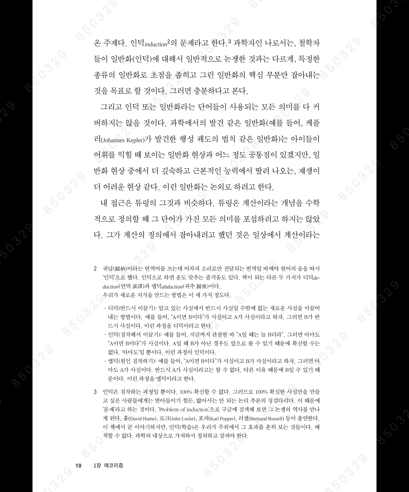

<!-- gid:20241028T052956 -->
[[TIP("이 노트에 대하여")]]
이광근은 컴퓨터과학의 핵심 개념을 한국어로 명료하게 풀어내며 기계학습과 글쓰기까지 학문의 태도로 연결한다. 정확한 용어와 두괄식 설명 감각을 함께 배울 수 있다.
[[/TIP]]

<!-- provenance:source:start -->
[[TIP("원본·최신본")]]
이 페이지는 한국어 검색과 읽기를 위한 WikiDocs 미러입니다. [원본·최신본은 가든](https://notes.junghanacs.com/bib/20241028T052956/)에 있습니다. 최신 수정 내용·백링크·태그·히스토리·댓글·출처 정보는 원본 가든에서 확인하세요.

- 작성: `2024-10-28T05:29:00+09:00`
- 최근 수정: `2025-04-29T00:00:00+09:00`
[[/TIP]]
<!-- provenance:source:end -->

[TOC]

```text
얼추거의맞기(probably approximately correct)
```

## 컴퓨터과학이 여는 세계

(이광근 2017)

컴퓨터/소프트웨어의 근본을 알려주는 교양과학서로 디지털 문명을 탄생시킨 동시대 청년 과학도 이야기이다. 정보이론, 암호, 개인인증 등 컴퓨터과학이 보여주는 풍경 아래 흐르는, 원천 아이디어가 나온 이야기와 의미를 들려준다. 원천지식의 동기와 근본을 꿰뚫는 시각...

### 책소개

컴퓨터/소프트웨어의 근본을 알려주는 교양과학서로 디지털 문명을 탄생시킨 동시대 청년 과학도 이야기이다. 정보이론, 암호, 개인인증 등 컴퓨터과학이 보여주는 풍경 아래 흐르는, 원천 아이디어가 나온 이야기와 의미를 들려준다. 원천지식의 동기와 근본을 꿰뚫는 시각을 튼튼히 한다면 다양한 응용의 한계와 가능성을 쉽게 파악할 수 있고, 남들이 미처 보지 못하는 곳을 볼 수 있을 것이다.

전세계적으로 소프트웨어 교육이 필수가 되고 있으며, 우리나라도 예외는 아니다. 하나 교육의 목표는 우리를 둘러싼 디지털 세상을 바라보는 시야를 형성해 주는 것이지, 몇 가지 프로그래밍 명령어를 가르쳐 주는 데 머물러서는 안 될 것이다. 이 책은 소프트웨어 교육을 둘러싼 움직임에 대한 학계의 한 응답으로 만들어졌다.

### 1. 마음의 도구

### 2. 400년의 축적

### 2.1 보편만능 기계의 탄생

__청년 앨런 튜링 __좌절을 확인하는 데 동원된 소품 __수학계의 꿈 __괴델이 깬 그 꿈 __케임브리지 강의 __컴퓨터의 원천 설계도 __단순한 부품 __궁극의 기계 __튜링기계를 테이프에 표현하기 __튜링기계를 돌리는 규칙표 __급소 __튜링의 불완전성 증명 __멈춤 문제의 증명 __컴퓨터

2.2 400년 __의문 __다른 트랙

1.  그 도구의 실현

3.1 다른 100년

3.2 생각 - 부울의 연구 __1854년 __그리고, 또는, 아닌 __같음 __조립

3.3 스위치 __직렬, 병렬, 뒤집기 __1937년 __스위치 분야의 날개 __디지털 __표현 방식 __판정, 선택, 응답, 기억

3.4 컴퓨터의 실현 __차곡차곡 쌓기 __규칙표 장치 __메모리 장치 __폰 노이만 __튜링 __재료

4 소프트웨어, 지혜로 짓는 세계 4.1 그 도구를 다루는 방법 __알고리즘 __언어

4.2 푸는 솜씨, 알고리즘과 복잡도 __풍경 __알고리즘 예 __비용 __현실적 __비현실적 __P의 경계 __NP 클래스 __오리무중 __P의 바깥 __통밥 __무작위 __불가능 __기본기 __양자 알고리즘

4.3 담는 그릇, 언어와 논리 __간격 __번역 사슬 __생김새 __표현력 __자동 번역 __실행 __언어 정글 __언어 중력 __두 중력권 __기계의 중력 __람다의 중력 __람다 계산법 __논리는 언어의 거울 __거울의 효능 __논리 거울, 짤 프로그램의 구도 잡기 __논리 거울, 짠 프로그램은 무난한가 __요약의 그물 __데이터의 중력

1.  그 도구의 응용

5.1 인간 지능의 확장 __고유 지능 __지식 표현 __지식 생성 __지식 검색 __팀워크 지능 __군중 지능

5.2 인간 본능의 확장 __놀이 본능 __소통 본능 __정보이론 __섀넌과 튜링 __정보량 __복음 __인코딩 __오류 수정 코드

5.3 인간 현실의 확장 __시공간 공유 __역발상 __암호 __열쇠 __완벽한 하인 __진품 감정 __벼랑

1.  마치면서

__아기의 첫 웃음

## 레슬리 밸리언트 2021 "기계 학습을 다시 묻다" 이광근

(레슬리 밸리언트 and 이광근 2021)

얼추거의맞기(probably approximately correct)

복잡하고 틀리기 일쑤인 세계에서 생명체는 어떻게 이렇게 번영한 걸까? 우리의 일상은 알려진 과학으로 설명할 수 있는 범위 바깥에 있다. 그런데도 우리는 그럭저럭 해낸다. 어떻게 행동해야 할지에 대한 이론 없이 그렇게 해낸다. 어떻게 하는 걸까? 이 책에서 컴퓨...

### 소개

복잡하고 틀리기 일쑤인 세계에서 생명체는 어떻게 이렇게 번영한 걸까? 우리의 일상은 알려진 과학으로 설명할 수 있는 범위 바깥에 있다. 그런데도 우리는 그럭저럭 해낸다. 어떻게 행동해야 할지에 대한 이론 없이 그렇게 해낸다. 어떻게 하는 걸까? 이 책에서 컴퓨터과학자인 레슬리 밸리언트는 대가의 솜씨로 학습이 지능과 진화의 엔진임을 설명한다. 그래서 우리가 개별적으로 그리고 하나의 그룹으로 우리가 놓인 복잡한 세계에서 어떻게 생존하고 번영하는지를 설명해준다. 핵심은 “얼추거의맞기(probably approximately correct)”라는 개념이다. 밸리언트는 이 개념으로 현실적인 학습이란 무엇인지 설명한다. 밸리언트의 이론은 진화와 학습이 공통적으로 가지는 계산 과정을 드러낸다. 그리고 어떤 능력이 타고난 것인지 길러진 것인지, 또는 인공지능의 한계가 무엇인지 등 우리가 항상 가지는 질문들에 한줄기 빛을 비춰 준다.

### 1장 에코리즘

-   이름 없는 것을 과학으로

### 2장 예측과 적응

### 3장 계산 가능함이란

3.1 튜링의 패러다임 3.2 깨지지 않은 기계 계산 모델 3.3 계산 법칙의 특성 3.4 현실적인 시간이 드는 계산 3.5 맞닥뜨릴 수 있는 궁극의 한계 3.6 복잡한 행동을 하는 간단한 알고리즘들 3.7 퍼셉트론 알고리즘

### 4장 자연의 기계적인 설명

### 5장 학습 가능함이란

5.1 인지에 대해 5.2 인덕의 문제와 가능성 5.3 인덕의 과학적인 설명: 항아리 예 5.4 인덕 오류의 관리 5.5 얼추거의맞기 학습 가능성을 향하여 5.6 얼추거의맞기 학습 가능성 5.7 오컴 방식으로 학습 결과 감별하기 5.8 학습의 한계는 있을까? 5.9 배우기와 가르치기 5.10 배울 수 있는 목표를 좇는 능력 5.11 얼추거의맞기 학습, 인지의 기본

### 6장 진화 가능함이란

6.1 빈틈이 있다 6.2 그 빈틈을 메꿀 방법 6.3 진화에 목표가 있다? 6.4 진화할 수 있는 목표를 좇는 능력 6.5 진화 대 학습 6.6 진화는 학습의 한 형태 6.7 진화 가능성의 정의 6.8 범위와 한계 6.9 실수 값을 동원하는 진화 6.10 이 이론이 다른 점

### 7장 디덕 가능함이란

7.1 이치 따지기 7.2 근거 없이도 해야 할 이치 따지기 7.3 계산의 벽 극복하기 7.4 융통성 없이 쉽게 부서지는 문제 극복하기 7.5 뜻 정하기 애매함 극복하기 7.6 대상 정하기 어려움 극복하기 7.7 마음의 눈: 세계를 보는 바늘구멍 7.8 튼튼 논리: 알 수 없는 세계에서 이치 따지기 7.9 생각 과정

### 8장 에코리즘으로서의 인간

8.1 들어가며 8.2 타고난 거냐 길러진 거냐 8.3 순진함 8.4 편견과 성급한 판단 8.5 각자 만든 진실 8.6 각자의 느낌 8.7 이성이라는 환상 8.8 기계의 도움을 받는 인간 8.9 뭐가 더 있을까?

### 9장 에코리즘으로서의 기계

9.1 들어가며 9.2 기계 학습 9.3 인공지능 - 어려운 이유? 9.4 인공지능에서 인공적인 것 9.5 독학으로 학습하기 9.6 인공지능 - 다음은 어디? 9.7 인공지능을 두려워해야 할까?

### 10장 질문들

10.1 과학 10.2 에코리즘 방식이 더 깊어지는 미래 10.3 행동 요령 10.4 신비

### 저 : 레슬리 밸리언트

하버드대학 컴퓨터과학 및 응용수학의 제퍼슨 쿨리지(T. Jefferson Coolidge) 교수다. 영국 왕립학회와 미국 과학학술원 회원이다. 국제 수학 연맹에서 수여하는 네반린나상(Nevanlinna Prize)을 받았고, 40여 년간 기계 학습 분야 연구에 기여한 공로로 컴퓨터과학의 노벨상이라 할 튜링상(Turing Award)을 수상했다.

### 역 : 이광근

서울대학교에서 전산과학을 전공하고 미국 일리노이대학교에서 박사학위를 받았다. 벨 연구소(Bell Labs) 연구원을 거쳐, 1KAIST 전산학과 교수를 역임했으며, 과학기술부 창의원구단 단장, 교육과학기술부 선도연구센터 센터장으로 활동했다. MIT, Ecole Normale Superieure Paris, 스탠퍼드 대학, 페이스북 등 유수의 교육 기관에서 방문교수로 있기도 했다. 파리 고등사범학교 초빙 교수를 역임했으며 현재 서울대 컴퓨터공학과 교수로 재직 중이다.

## Related-Notes

## BIBLIOGRAPHY

- 이광근. 2017. <i>컴퓨터과학이 여는 세계</i>. [https://www.yes24.com/Product/Goods/17976737](https://www.yes24.com/Product/Goods/17976737).
- 레슬리 밸리언트, and 이광근. 2021. <i>기계 학습을 다시 묻다</i>. [https://www.yes24.com/Product/Goods/105310306](https://www.yes24.com/Product/Goods/105310306).

## <span class="org-todo done DONE">DONE</span> Screenshot_20250717_221811_24_eBook 에코리즘

(레슬리 밸리언트 and 이광근 2021) ;# 
