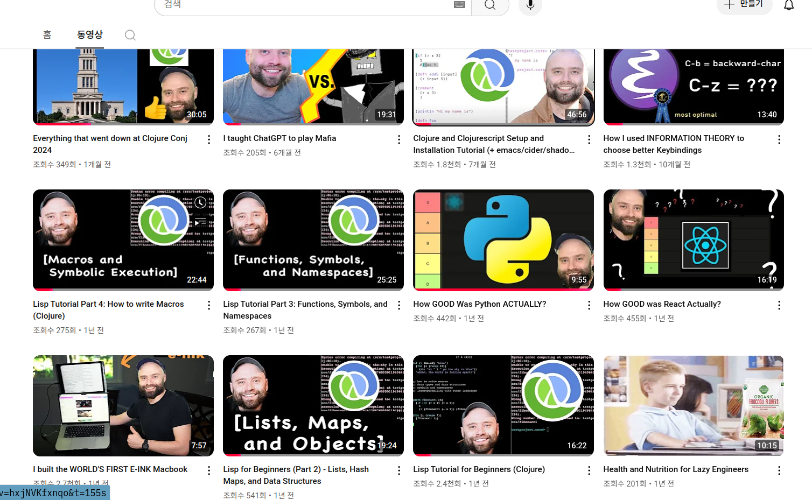

<!-- gid:20241108T122934 -->
[[TIP("이 노트에 대하여")]]
샘 스트라우스는 SammyEngineering 채널을 통해 클로저, 리스프, 이맥스를 초심자 친화적으로 풀어내는 개발자다. 영상과 실습으로 언어 감각을 천천히 익히게 돕는다.
[[/TIP]]

<!-- provenance:source:start -->
[[TIP("원본·최신본")]]
이 페이지는 한국어 검색과 읽기를 위한 WikiDocs 미러입니다. [원본·최신본은 가든](https://notes.junghanacs.com/bib/20241108T122934/)에 있습니다. 최신 수정 내용·백링크·태그·히스토리·댓글·출처 정보는 원본 가든에서 확인하세요.

- 작성: `2024-11-08T12:29:00+09:00`
- 최근 수정: `2025-03-20T00:00:00+09:00`
[[/TIP]]
<!-- provenance:source:end -->

[TOC]

## 히스토리

-   [2025-11-23 Sun 15:19] 샘 뭐하시는가?

## 관련메타

## BIBLIOGRAPHY

- “Better Keybindings with Information Theory.” 2024. [https://github.com/sstraust/shannonmax](https://github.com/sstraust/shannonmax).
- “Clojure.” n.d. Accessed May 29, 2024. [https://clojure.org/index](https://clojure.org/index).
- <i>Clojure and Clojurescript Setup and Installation Tutorial (+ Emacs/Cider/Shadow-Cljs!)</i>. 2024. [https://www.youtube.com/watch?v=SqWxDklYS9s](https://www.youtube.com/watch?v=SqWxDklYS9s).
- <i>How Good Was Python Actually?</i> 2023. [https://www.youtube.com/watch?v=O1ePWcB7ueI](https://www.youtube.com/watch?v=O1ePWcB7ueI).
- <i>Is Functional Programming a Good Idea?</i> 2022. [https://www.youtube.com/watch?v=WYt-KSCMR7k](https://www.youtube.com/watch?v=WYt-KSCMR7k).
- <i>Lisp Tutorial for Beginners (Clojure)</i>. 2023. [https://www.youtube.com/watch?v=hN0HTJXDBfI](https://www.youtube.com/watch?v=hN0HTJXDBfI).
- <i>Lisp Tutorial Part 1: Clojure</i>. 2023. [https://www.youtube.com/watch?v=hN0HTJXDBfI](https://www.youtube.com/watch?v=hN0HTJXDBfI).
- <i>Lisp Tutorial Part 2: Lists, Hash Maps, and Data Structures</i>. 2023. [https://www.youtube.com/watch?v=0VyclDr0Ifk](https://www.youtube.com/watch?v=0VyclDr0Ifk).
- <i>Lisp Tutorial Part 3: Functions, Symbols, and Namespaces</i>. 2024. [https://www.youtube.com/watch?v=-L_aZ1HMZy0](https://www.youtube.com/watch?v=-L_aZ1HMZy0).
- <i>Lisp Tutorial Part 4: How to Write Macros (Clojure)</i>. 2024. [https://www.youtube.com/watch?v=hxjNVKfxnqo](https://www.youtube.com/watch?v=hxjNVKfxnqo).
- “Sammy Engineering.” n.d. Accessed February 3, 2025. [https://www.youtube.com/channel/UC85e2kU04dDJXeSfPL7tUUw](https://www.youtube.com/channel/UC85e2kU04dDJXeSfPL7tUUw).
- “Sammys-Cider-Utils/Make-Unit-Test.El at Master · Sstraust/Sammys-Cider-Utils.” n.d. Accessed March 20, 2025. [https://github.com/sstraust/sammys-cider-utils/blob/master/make-unit-test.el](https://github.com/sstraust/sammys-cider-utils/blob/master/make-unit-test.el).
- <i>Why Lisp Is the Language of Legends</i>. 2022. [https://www.youtube.com/watch?v=V02SQDh47gA](https://www.youtube.com/watch?v=V02SQDh47gA).

## Related-Notes

-   [contacts::Sammy Engineering](https://wikidocs.net/380486.md#h-26476b38-e917-44c9-a512-63b9ed850c65/)
-   [이맥스통합개발환경: 클로저 리스프](https://wikidocs.net/381178)
-   [practicalli 프렉티컬리 클로저](https://wikidocs.net/381855)
-   [마크왓슨 AI Lisp Programming 클로저](https://wikidocs.net/381987)

## Sammy Engineering

-   (“Sammy Engineering” n.d.)
-   <https://youtube.com/@sammytalks7215>

## 유튜브

### How GOOD Was Python ACTUALLY?

(<i>How Good Was Python Actually?</i> 2023)

-   In this feature we talk about the strengths and weaknesses of Python. We discuss: Why is Python so popular? What sets Python apart from other languages? How good is python in comparison to other languages? We talk about python for use in scripting and data science, the performance of Python, and uncover how it’s neatness, accessibility, and ease of use powered its incredible performance.

### Is Functional Programming a Good Idea?

(<i>Is Functional Programming a Good Idea?</i> 2022)

-   In this video I talk about the benefits and challenges of functional programming I compare functional programming versus imperative programming, and the maintainability benefits of having code written in a functional style. I talk about pure functions some of the key methods used in functional programming, including map, reduce, recursive methods, and higher order functions. I’m planning to make a future video about immutable data structures and the techniques that go with them, as well as functional programming vs object oriented programming. Stay tuned!

### Why LISP Is The Language of Legends

(<i>Why Lisp Is the Language of Legends</i> 2022)

-   

-   In this video I describe why LISP is a good programming language, and why so many people have called it special or legendary. I also make some comparisons lisp vs java lisp vs python I talk about the history of lisp, its parentheses and homoiconic syntax, and how to write macros, programs which write other programs. This lets you modify the language of lisp itself 00:00 Intro 0:50 History 2:44 Macros and Magic
-   

### Lisp Tutorial for Beginners (Clojure)

(<i>Lisp Tutorial for Beginners (Clojure)</i> 2023)

### Lisp Tutorial Part 1: Clojure

(<i>Lisp Tutorial Part 1: Clojure</i> 2023)

### Lisp Tutorial Part 2: Lists, Hash Maps, and Data Structures

(<i>Lisp Tutorial Part 2: Lists, Hash Maps, and Data Structures</i> 2023)

-   

-   

### Lisp Tutorial Part 3: Functions, Symbols, and Namespaces

(<i>Lisp Tutorial Part 3: Functions, Symbols, and Namespaces</i> 2024) <https://www.youtube.com/watch?v=-L_aZ1HMZy0>

### Lisp Tutorial Part 4: How to write Macros (Clojure)

(<i>Lisp Tutorial Part 4: How to Write Macros (Clojure)</i> 2024) <https://www.youtube.com/watch?v=hxjNVKfxnqo>

-   Lisp Tutorial Part 4

### <span class="org-todo todo TODO">TODO</span> Clojure and Clojurescript Setup and Installation Tutorial (+ emacs/cider/shadow-cljs!)

(<i>Clojure and Clojurescript Setup and Installation Tutorial (+ Emacs/Cider/Shadow-Cljs!)</i> 2024)

-   <https://github.com/sstraust>
-   <https://wiki.leiningen.org/Packaging>
-   (“Clojure” n.d.)

#### 먼저 개발 환경 측면?

[이맥스통합개발환경: 클로저 리스프](https://wikidocs.net/381178) 측면에서 아주 간단한 접근이다.

```shell
sudo apt-get install leiningen
```

21 버전 설치하는구나. 아무렴.

```text

➜ sudo apt-cache search leiningen
[sudo] junghan 암호:
leiningen - Automation tool and dependency manager for Clojure projects
libclj-stacktrace-clojure - more readable stacktraces in Clojure programs
libtools-namespace-clojure - tools for managing namespaces in Clojure
libversioneer-clojure - version introspection for Leiningen-generated projects
python3-pipdeptree - display dependency tree of the installed Python 3 packages
~ via  v20.14.0 via 🐍 v3.12.3
➜ sudo apt-get install leiningen
패키지 목록을 읽는 중입니다... 완료
의존성 트리를 만드는 중입니다... 완료
상태 정보를 읽는 중입니다... 완료
다음 패키지가 자동으로 설치되었지만 더 이상 필요하지 않습니다:
  gprename hamonikr-fonts libintl-perl libintl-xs-perl libjpeg9 optipng pyqt6-dev-tools
  python3-apsw python3-chm python3-css-parser python3-html2text python3-html5-parser
  python3-ifaddr python3-mechanize python3-py7zr python3-regex python3-repoze.lru
  python3-routes python3-texttable python3-xxhash python3-zeroconf webp
'sudo apt autoremove'를 이용하여 제거하십시오.
다음의 추가 패키지가 설치될 것입니다 :
  default-jdk-headless libclojure-java libcore-specs-alpha-clojure libjsr166y-java
  libnrepl-clojure libnrepl-incomplete-clojure libspec-alpha-clojure
  openjdk-21-jdk-headless
제안하는 패키지:
  openjdk-21-demo openjdk-21-source
다음 새 패키지를 설치할 것입니다:
  default-jdk-headless leiningen libclojure-java libcore-specs-alpha-clojure
  libjsr166y-java libnrepl-clojure libnrepl-incomplete-clojure libspec-alpha-clojure
  openjdk-21-jdk-headless
0개 업그레이드, 9개 새로 설치, 0개 제거 및 14개 업그레이드 안 함.
99.3 M바이트 아카이브를 받아야 합니다.
이 작업 후 116 M바이트의 디스크 공간을 더 사용하게 됩니다.
계속 하시겠습니까? [Y/n]

```

#### 테스트프로젝트

[2025-02-09 Sun 22:15]

```text
lein new testproject
```

</home/junghan/git/local/testproject>

## 깃허브 - 코드

### Better Keybindings with Information Theory

(“Better Keybindings with Information Theory” 2024)

-   maximize your keybinding efficiency in emacs!
-   Sam Straus 샘스트라우스

Straus, S. (2024). Better Keybindings with Information Theory [Computer software]. <https://github.com/sstraust/shannonmax> Original Talk: <https://www.youtube.com/watch?v=MytPttbIUOY>

### sammys-cider-utils/make-unit-test.el at master · sstraust/sammys-cider-utils

(“Sammys-Cider-Utils/Make-Unit-Test.El at Master · Sstraust/Sammys-Cider-Utils” n.d.)

## 스크린샷


