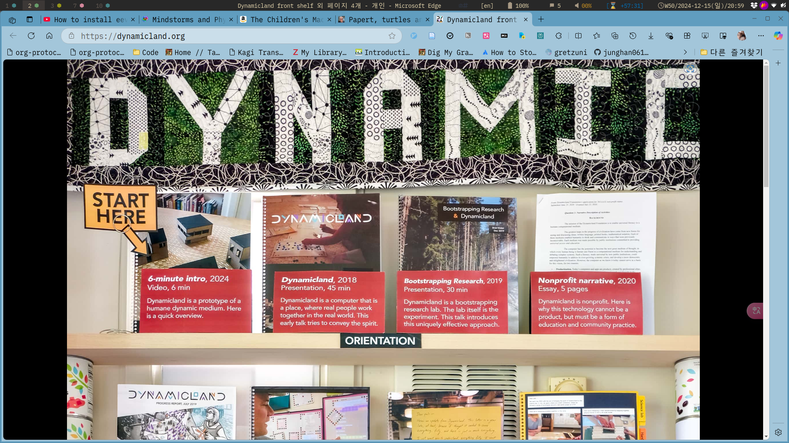

<!-- gid:20241215T204552 -->
[TOC]

[[TIP("이 노트에 대하여")]]
브렛 빅터의 다이나믹랜드는 손과 몸, 공간이 함께 작동하는 새로운 계산 환경과 교육 장면을 상상하게 한다. 스크린 중심 컴퓨팅을 넘어서는 인간-컴퓨터 상호작용의 비전을 보여준다.
[[/TIP]]

## 관련메타

-   [0=20 education 교육](https://wikidocs.net/380871)

## BIBLIOGRAPHY

- 브렛 빅터. n.d.-a. “Bret Victor, Struggling 다이나믹랜드.” Accessed December 15, 2024. [https://worrydream.com/](https://worrydream.com/).
- ———. n.d.-b. “Dynamicland 다이나믹랜드.” Accessed November 11, 2024. [https://dynamicland.org/](https://dynamicland.org/).

## 관련노트

-   [시모어패퍼트: 마인드스톰 터틀그래픽스 교육 어린이 로고](https://wikidocs.net/382178)

## 브렛빅터 Bret Victor, struggling 다이나믹랜드

(브렛 빅터 n.d.-a)

-   브렛 빅터

-   I’ve dedicated my life to creating a humane dynamic medium.
-   저는 인간적인 역동적인 매체를 만드는 데 평생을 바쳐왔습니다.

## Dynamicland 다이나믹랜드

(브렛 빅터 n.d.-b)

-   브렛 빅터
-   Incubating a humane dynamic medium.

홈페이지부터 남다르다.

## 로그

### 2024-12-15

#### @user [Dynamicland front shelf - dynamicland.org](https://dynamicland.org/) 다이나믹랜드에 대해서 소개해줘.

@assistant 다이나믹랜드는 실리콘밸리의 실험적인 컴퓨팅 환경으로, 브렛 빅터(Bret Victor)가 주도하는 프로젝트입니다. 다음은 다이나믹랜드에 대한 주요 특징들입니다:

1.  **물리적 컴퓨팅 환경**: 다이나믹랜드는 물리적 공간에서 컴퓨팅을 수행합니다. 사용자들은 실제 물리적 객체와 상호작용하면서 프로그래밍을 합니다.

2.  **프로젝터와 카메라**: 공간 전체에 프로젝터와 카메라가 설치되어 있습니다. 프로젝터는 코드와 데이터를 표면에 투사하고, 카메라는 사용자의 상호작용을 감지합니다.

3.  **동적 프로그래밍**: 코드와 데이터는 실시간으로 변경되고, 그 변화가 즉시 시각적으로 반영됩니다. 이는 사용자가 코드를 작성하고 그 결과를 즉각적으로 볼 수 있게 합니다.

4.  **협업과 공유**: 다이나믹랜드는 여러 사람이 함께 작업하고 아이디어를 공유할 수 있는 환경을 제공합니다. 물리적 공간에서의 협업이 강조됩니다.

5.  **탐구와 학습**: 이 환경은 학습과 탐구를 촉진합니다. 사용자들은 직접 손으로 만지고, 움직이고, 변경하면서 학습할 수 있습니다.

6.  **철학**: 다이나믹랜드는 컴퓨터가 단순히 도구가 아닌, 인간의 창의성과 상호작용을 증강시키는 환경으로서의 역할을 강조합니다.

다이나믹랜드는 전통적인 컴퓨터 사용 방식에서 벗어나, 컴퓨팅을 더 직관적이고 물리적으로 접근 가능한 방식으로 재구성하려는 시도입니다. 이곳에서의 경험은 프로그래밍과 컴퓨팅에 대한 새로운 접근 방식을 제시하며, 교육, 디자인, 과학 연구 등 다양한 분야에서의 혁신을 촉진할 수 있는 가능성을 보여줍니다.

#### @user 한국에도 비슷한 실험을 하고 있는가 조사해줘

@assistant 한국에서도 다이나믹랜드와 유사한 실험적 컴퓨팅 환경이나 교육 프로젝트가 진행되고 있습니다. 몇 가지 예시를 들어보겠습니다:

1.  **카이스트(KAIST)의 미래교육 연구소**: KAIST 에서는 미래 교육을 위한 다양한 프로젝트를 진행하고 있습니다. 이 중에는 컴퓨팅 교육을 혁신적으로 바꾸기 위한 연구도 포함되어 있습니다. 예를 들어, 물리적 조작을 통해 프로그래밍을 배우는 교육 도구나 환경을 개발하는 연구가 있습니다.

2.  **서울대학교의 HCI 연구**: 서울대학교에서는 인간-컴퓨터 상호작용(HCI) 분야에서 다양한 연구가 이루어지고 있습니다. 이 중 일부는 다이나믹랜드와 유사하게 물리적 상호작용을 통한 컴퓨팅 경험을 제공하는 프로젝트를 포함합니다.

3.  **스크래치(Scratch)와 같은 교육용 프로그래밍 도구**: 스크래치는 MIT 에서 개발되었지만, 한국에서도 활발히 사용되고 있으며, 이는 어린이들이 블록 기반으로 프로그래밍을 배우게 해줍니다. 이는 다이나믹랜드의 철학과 유사하게, 프로그래밍을 더 접근 가능하고 직관적으로 만드는 방향으로 나아가고 있습니다.

4.  **물리적 컴퓨팅 교육**: 일부 학교나 교육 기관에서는 아두이노(Arduino)나 라즈베리 파이(Raspberry Pi) 같은 하드웨어를 활용한 물리적 컴퓨팅 교육을 실시하고 있습니다. 이는 학생들이 직접 하드웨어와 상호작용하면서 프로그래밍을 배우는 방식입니다.

5.  **코딩 교육 스타트업**: 한국에는 코딩 교육을 혁신적으로 바꾸려는 여러 스타트업이 있습니다. 이들 중 일부는 다이나믹랜드의 철학을 반영하여, 학생들이 직접 만지고 움직이면서 프로그래밍을 배우는 환경을 제공합니다.

이러한 프로젝트들은 다이나믹랜드와 같은 철학을 공유하면서도, 한국의 교육 환경과 문화에 맞게 적용되고 있습니다. 그러나 다이나믹랜드와 정확히 동일한 형태의 실험적 공간은 아직까지는 드물다고 할 수 있습니다. 대신, 다양한 형태로 물리적 상호작용과 컴퓨팅을 결합하려는 시도들이 계속되고 있습니다.

@user 다이나믹랜드는 아이들을 위한 단순히 코딩을 가르치는 범위를 넘어서는 시도라고 보여져. 이 곳에 사용료 또는 교육비용은 어떤가? 수익만이 목적이 아닐 것 같은데.

@assistant 다이나믹랜드는 단순히 코딩 교육을 넘어서, 컴퓨팅과 상호작용의 새로운 패러다임을 탐구하는 실험적 공간입니다. 이에 대한 몇 가지 정보를 공유하겠습니다:

1.  **사용료 및 교육비용**: 다이나믹랜드는 비영리 조직으로 운영되며, 일반적인 상업적 교육 기관과는 다릅니다. 따라서, 전통적인 의미의 '교육비용'이나 '사용료'를 받는 방식은 아닙니다. 그러나, 다이나믹랜드는 방문이나 참여를 위한 특정 프로그램이나 이벤트를 통해 기부나 후원을 받을 수 있습니다.

2.  **목적**: 다이나믹랜드의 주요 목적은 다음과 같습니다:
    -   **탐구와 혁신**: 새로운 컴퓨팅 환경을 통해 인간의 창의성과 상호작용을 증강시키는 방법을 탐구합니다.
    -   **교육**: 학습자들이 직접 경험하고, 실험하고, 배우는 환경을 제공하여 교육의 혁신을 도모합니다.
    -   **공유와 협업**: 다양한 배경의 사람들이 모여 아이디어를 공유하고 협업할 수 있는 공간을 만듭니다.
    -   **사회적 영향**: 컴퓨팅과 교육의 접근성을 높이고, 이를 통해 사회적 변화를 일으키려는 목적이 있습니다.

3.  **재정 지원**: 다이나믹랜드는 기부, 후원, 연구 프로젝트, 그리고 다양한 파트너십을 통해 재정을 지원받습니다. 이는 상업적 수익을 목표로 하는 것이 아니라, 프로젝트의 지속 가능성과 확장을 위한 자금 조달입니다.

4.  **참여 방식**: 다이나믹랜드는 다양한 방식으로 사람들의 참여를 장려합니다. 예를 들어, 특정 이벤트나 워크숍에 참여하거나, 연구 프로젝트에 참여하거나, 단순히 방문하여 경험을 공유할 수 있습니다.

다이나믹랜드는 수익 창출이 주 목적이 아니라, 새로운 형태의 컴퓨팅과 교육을 실험하고, 이를 통해 사회에 긍정적인 영향을 미치려는 비전을 가지고 있습니다. 따라서, 참여와 지원은 자발적 기부나 협업을 통해 이루어지는 경우가 많습니다.

@user 브렛 빅터에 대해서 알려줘. 어떤 배경을 가지고 있는지 궁금해.

@assistant 브렛 빅터(Bret Victor)는 컴퓨터 과학자이자 인터페이스 디자이너로, 컴퓨팅과 인간-컴퓨터 상호작용(HCI) 분야에서 혁신적인 아이디어와 프로젝트를 통해 널리 알려져 있습니다. 다음은 브렛 빅터에 대한 주요 배경 정보입니다:

1.  **교육 및 초기 경력**:
    -   브렛 빅터는 MIT 에서 전기공학 및 컴퓨터 과학을 전공했습니다.
    -   초기에는 애플에서 일하며, 사용자 인터페이스와 그래픽 디자인에 관심을 가지게 되었습니다.

2.  **주요 작업 및 철학**:
    -   **인벤티드 온 프린서플(Inventing on Principle)**: 이 강연에서 빅터는 프로그래머가 코드를 작성하는 동안 즉각적인 피드백을 받을 수 있는 환경의 중요성을 강조했습니다. 이는 다이나믹랜드의 철학과도 연결됩니다.
    -   **라이트 테이블(Light Table)**: 빅터는 프로그래밍 환경을 혁신적으로 바꾸기 위한 프로젝트로 라이트 테이블을 제안했습니다. 이는 코드를 시각적으로 탐색하고 이해할 수 있는 도구입니다.
    -   **다이나믹랜드(Dynamicland)**: 다이나믹랜드는 빅터의 가장 큰 프로젝트 중 하나로, 물리적 공간에서의 컴퓨팅을 탐구하는 실험적 환경입니다. 여기서 그는 컴퓨터가 단순히 도구가 아닌, 인간의 창의성과 상호작용을 증강시키는 환경으로서의 역할을 강조합니다.

3.  **영향과 철학**:
    -   빅터는 "도구는 사용자가 무엇을 하고 있는지 이해해야 한다"는 철학을 가지고 있습니다. 이는 사용자가 작업 중에 즉각적인 피드백을 받을 수 있어야 한다는 의미입니다.
    -   그는 프로그래밍과 디자인이 더 직관적이고 접근 가능해야 한다고 주장하며, 이를 실현하기 위한 다양한 프로젝트와 아이디어를 제안해왔습니다.

4.  **다른 기여**:
    -   빅터는 다양한 글과 강연을 통해 그의 아이디어를 공유하고 있습니다. 그의 웹사이트(worrydream.com)에는 이러한 아이디어와 프로젝트에 대한 자세한 설명이 있습니다.
    -   그는 또한 여러 오픈 소스 프로젝트에 참여하거나, 다른 개발자들과 협업하여 새로운 인터페이스와 도구를 개발해왔습니다.

브렛 빅터는 컴퓨팅과 교육의 미래를 재정의하려는 노력으로 유명하며, 그의 작업은 많은 개발자, 디자이너, 교육자들에게 영감을 주고 있습니다. 그의 철학과 프로젝트는 컴퓨터가 인간의 창의성과 상호작용을 어떻게 증강시킬 수 있는지에 대한 새로운 접근 방식을 제시합니다.

@user 마인드스톰의 저자 시모어의 컴퓨터 교육 철학이 반영되어 있는 것인가?

@assistant 네, 브렛 빅터의 작업과 다이나믹랜드 프로젝트는 시모어 패퍼트(Seymour Papert)의 컴퓨터 교육 철학에서 많은 영향을 받았습니다. 시모어 패퍼트는 다음과 같은 주요 철학을 제시했습니다:

1.  **구성주의(Constructivism)**: 패퍼트는 학습이 학습자가 자신의 경험을 통해 지식을 구성하는 과정이라고 보았습니다. 이는 다이나믹랜드에서 사용자들이 직접 물리적 상호작용을 통해 프로그래밍을 배우고, 실험하고, 창작하는 방식과 일맥상통합니다.

2.  **로고(Logo) 프로그래밍 언어**: 패퍼트는 로고 언어를 개발하여 어린이들이 프로그래밍을 통해 수학적 개념을 이해하고, 창의적인 문제 해결 능력을 키우도록 했습니다. 다이나믹랜드는 이와 유사하게, 프로그래밍을 통해 다양한 개념을 탐구하고 실험할 수 있는 환경을 제공합니다.

3.  **마인드스톰(Mindstorms)**: 패퍼트의 책 '마인드스톰'에서는 어린이들이 컴퓨터를 통해 학습하고, 창의력을 발휘하는 방법을 설명합니다. 여기서 그는 "마이크로월드(Microworlds)"라는 개념을 소개했는데, 이는 학습자가 특정 주제를 깊이 탐구할 수 있는 작은 세계를 의미합니다. 다이나믹랜드는 이러한 마이크로월드의 물리적 구현으로 볼 수 있습니다.

4.  **탐구 기반 학습**: 패퍼트는 학습자가 자신의 호기심을 따라 탐구하고, 실험하고, 실패하고, 다시 시도하는 과정을 통해 배우는 것이 중요하다고 보았습니다. 다이나믹랜드에서는 사용자들이 직접 손으로 만지고, 움직이고, 변경하면서 학습하는 환경이 제공됩니다.

5.  **도구로서의 컴퓨터**: 패퍼트는 컴퓨터를 단순한 도구가 아니라, 학습과 창의성을 증강시키는 매체로 보았습니다. 브렛 빅터와 다이나믹랜드는 이 철학을 더욱 발전시켜, 컴퓨터가 인간의 창의성과 상호작용을 증강시키는 환경으로서의 역할을 강조합니다.

브렛 빅터는 시모어 패퍼트의 이러한 철학을 현대적인 컴퓨팅 환경에 적용하고, 이를 통해 학습자들이 더 직관적이고 물리적으로 컴퓨팅을 경험할 수 있도록 하고 있습니다. 다이나믹랜드는 패퍼트의 아이디어를 물리적 공간에서 구현한 사례로 볼 수 있으며, 사용자들이 직접 경험하고, 실험하고, 창작하는 과정을 통해 학습하고 성장할 수 있는 환경을 제공합니다.

@user 다이나믹랜드에서 혹시 터틀기하학과 관련 된 수학 물리 교육을 진행하는가?

@assistant 다이나믹랜드에서는 터틀 기하학(Turtle Geometry)과 관련된 수학 및 물리 교육을 진행하고 있습니다. 다음은 그에 대한 몇 가지 정보입니다:

1.  **터틀 기하학**: 터틀 기하학은 시모어

@user 답변이 중간에 끊겼는데 무슨 문제지?

@assistant 죄송합니다. 다이나믹랜드에서 터틀 기하학과 관련된 수학 및 물리 교육에 대해 설명을 이어가겠습니다:

1.  **터틀 기하학**: 터틀 기하학은 시모어 패퍼트가 로고(Logo) 프로그래밍 언어를 통해 소개한 개념으로, 터틀(거북이)이라는 가상의 객체를 움직여 기하학적 형태를 그리며 수학적 개념을 배우는 방식입니다. 다이나믹랜드에서는 이 터틀 기하학을 물리적 공간에서 실현하고 있습니다.

2.  **물리적 터틀**: 다이나믹랜드에서는 실제 물리적 객체를 사용하여 터틀 기하학을 탐구합니다. 사용자들은 프로젝터와 카메라를 통해 물리적 공간에 터틀을 투사하고, 이를 움직여 다양한 형태를 그리며 수학적 개념을 실험합니다.

3.  **수학적 탐구**: 터틀 기하학을 통해 사용자들은 각도, 거리, 회전, 좌표계 등의 기초적인 수학 개념을 배우고, 이를 통해 더 복잡한 수학적 문제를 해결할 수 있습니다. 예를 들어, 터틀을 사용하여 삼각형, 사각형, 원 등의 형태를 그리며 기하학적 개념을 이해합니다.

4.  **물리적 상호작용**: 다이나믹랜드의 환경에서는 터틀을 실제로 움직이고, 물리적 객체와 상호작용하면서 학습합니다. 이는 학습자들이 직접 손으로 만지고, 움직이고, 변경하면서 학습하는 방식으로, 시모어 패퍼트의 구성주의 교육 철학과 일맥상통합니다.

5.  **교육적 목적**: 터틀 기하학을 통해 학습자들은 수학적 개념을 직관적으로 이해하고, 문제 해결 능력을 키우며, 창의적인 사고를 발휘할 수 있습니다. 또한, 물리적 공간에서의 상호작용은 학습자들이 실험하고, 실패하고, 다시 시도하는 과정을 통해 학습을 촉진합니다.

다이나믹랜드는 터틀 기하학을 통해 수학과 물리 교육을 진행함으로써, 학습자들이 직접 경험하고, 실험하고, 창작하는 과정을 통해 학습하고 성장할 수 있는 환경을 제공합니다. 이는 시모어 패퍼트의 교육 철학을 현대적인 컴퓨팅 환경에 적용한 사례로 볼 수 있습니다.

@user 혹시 다이나믹랜드와 유사한 프로젝트를 국내에서 한국인 대상으로 내가 진행하려면 어떠한 접근이 좋을까?

@assistant 한국에서 다이나믹랜드와 유사한 프로젝트를 진행하려면 다음과 같은 접근 방식을 고려해볼 수 있습니다:

1.  **목표 설정**:
    -   프로젝트의 목적과 목표를 명확히 설정하세요. 다이나믹랜드와 유사하게, 컴퓨팅과 교육의 혁신, 물리적 상호작용을 통한 학습, 창의성 증강 등을 목표로 할 수 있습니다.

2.  **공간 확보**:
    -   물리적 공간이 필요합니다. 이 공간은 프로젝터, 카메라, 다양한 물리적 객체를 설치할 수 있는 넓은 공간이어야 합니다. 학교, 도서관, 커뮤니티 센터 등을 고려해보세요.

3.  **기술적 준비**:
    -   다이나믹랜드와 유사한 기술적 인프라를 구축해야 합니다. 프로젝터, 카메라, 컴퓨터, 그리고 필요한 소프트웨어를 준비하세요. 오픈 소스 소프트웨어나 다이나믹랜드에서 사용하는 기술을 참고할 수 있습니다.

4.  **교육 프로그램 개발**:
    -   다이나믹랜드의 철학을 반영한 교육 프로그램을 개발하세요. 터틀 기하학, 물리적 상호작용을 통한 프로그래밍, 창의적 문제 해결 등을 포함할 수 있습니다.

5.  **협업과 네트워킹**:
    -   교육자, 개발자, 디자이너, 연구자 등과 협업하여 프로젝트를 진행하세요. 국내외의 유사한 프로젝트나 연구소와 네트워킹을 통해 아이디어와 자원을 공유할 수 있습니다.

6.  **자금 조달**:
    -   프로젝트의 지속 가능성을 위해 자금 조달이 필요합니다. 정부 지원, 기업 후원, 크라우드펀딩, 기부 등 다양한 방법을 고려해보세요.

7.  **커뮤니티 형성**:
    -   사용자 커뮤니티를 형성하고, 참여를 유도하세요. 워크숍, 이벤트, 온라인 포럼 등을 통해 사람들을 모으고, 아이디어를 공유할 수 있는 환경을 만드세요.

8.  **문화적 적응**:
    -   한국의 교육 문화와 학습자들의 특성을 고려하여 프로젝트를 적응시키세요. 한국의 교육 시스템과 학습자들의 학습 스타일에 맞게 프로그램을 조정하는 것이 중요합니다.

9.  **연구와 평가**:
    -   프로젝트의 효과를 평가하고, 지속적인 개선을 위해 연구를 병행하세요. 사용자 피드백을 수집하고, 프로젝트의 영향을 분석하여 개선점을 찾으세요.

10. **홍보와 확산**:
    -   프로젝트를 널리 알리기 위해 홍보 활동을 진행하세요. SNS, 블로그, 언론 등을 통해 프로젝트의 목적과 성과를 공유하고, 더 많은 사람들에게 참여를 유도하세요.

11. **지속 가능성**:
    -   프로젝트의 지속 가능성을 위해 장기적인 계획을 세우세요. 교육 프로그램의 확장, 자원의 확보, 커뮤니티의 성장 등을 고려하여 프로젝트를 운영하세요.

이러한 접근 방식을 통해 한국에서 다이나믹랜드와 유사한 프로젝트를 성공적으로 진행할 수 있을 것입니다. 중요한 것은 프로젝트의 목적과 철학을 명확히 하고, 이를 실현하기 위한 구체적인 계획과 실행이 필요하다는 점입니다.

@user
