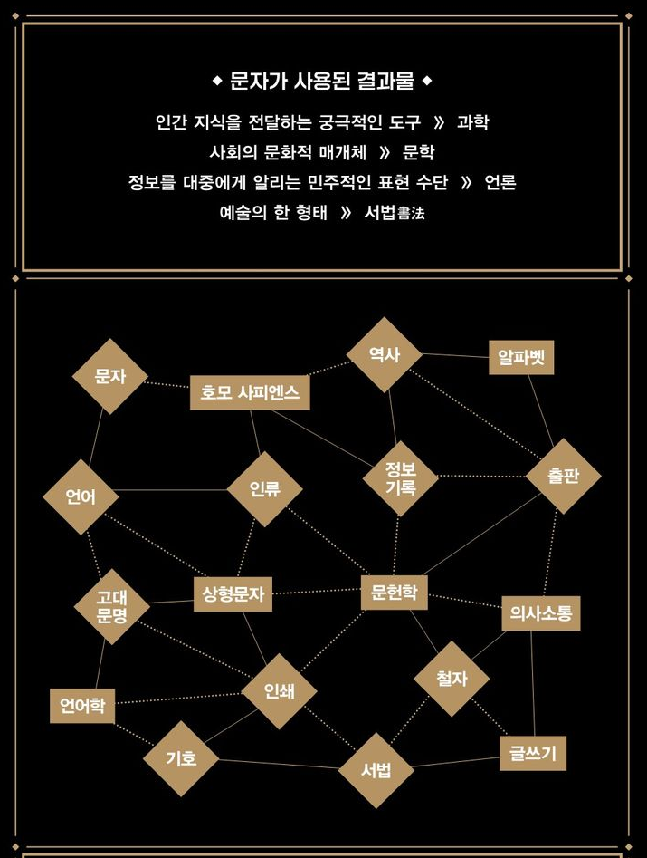

<!-- gid:20241220T132029 -->
[TOC]

[[TIP("이 노트에 대하여")]]
문자의 기원과 발전, 언어의 구조와 역사를 함께 묶어 읽으며 인간 문명이 말과 글을 통해 어떻게 확장되었는지 살핀다.
[[/TIP]]

## BIBLIOGRAPHY

- 데이비드 크리스털. 2020. <i>언어의 역사</i>. [https://www.yes24.com/Product/Goods/90593524](https://www.yes24.com/Product/Goods/90593524).
- 스티븐 로저. 2024. <i>문자의 역사 - 인류 문명사와 함께한 문자의 탄생과 발전</i>. Translated by 강주헌. 퍼블리온. [https://m.yes24.com/Goods/Detail/136298218](https://m.yes24.com/Goods/Detail/136298218).

## 언어의 역사

(데이비드 크리스털 2020)

-   원제 : A Little Book of Language
-   데이비드 크리스털 2020

인간의 언어는 어떤 매력과 반전을 품고 있을까?말과 글의 기원부터 일상생활 속 활용법까지, 언어에 관한 모든 것인간의 모든 생각과 행동은 언어의 지배를 받는다. 그런데도 우리는 그 중요성과 가치를 제대로 인식하지 못한 채 살아간다. 세계적인 언어학자 데이비드 ...

## 문자의 역사 - 인류 문명사와 함께한 문자의 탄생과 발전

(스티븐 로저 2024)

-   A History of Writing
-   스티븐 로저 강주헌 2024
-   밀리의서재

### PART 1 새김눈에서 서판으로

#### 매듭 글자 22

#### 새김눈 24

#### 그림문자 26

#### 눈금 막대기 30

#### 그 밖의 기억 연상 장치와 신호 메시지 31

#### 시각적 상징 33

#### 징표 36

#### 표음문자화와 최초의 서판 41

### PART 2 말하는 그림

#### 이집트 문자 54

#### 설형문자 69

#### 원형 엘람어 문자 81

#### 인더스 문자 84

### PART 3 말하는 문자 체계

#### 비블로스 음절문자 99

#### 아나톨리아 음절문자 103

#### 에게해와 키프로스 음절문자 107

#### 이집트와 가나안의 원형 알파벳 116

#### 페니키아 알파벳 126

#### 아람 문자 계통 130

#### 인도와 동남아시아의 인도계 문자 145

### PART 4 알파에서 오메가까지

#### 그리스 알파벳 168

#### 메로에 문자와 콥트 문자 183

#### 에트루리아 문자 188

#### 라틴 문자 194

#### 이베리아 문자 203

#### 고트 문자 207

#### 룬 문자 208

#### 오감 문자 215

#### 슬라브 문자 219

### PART 5 동아시아 문자의 ‘재탄생’

#### 중국 문자 231

#### 베트남 문자 254

#### 한국 문자 256

#### 일본 문자 266

### PART 6 메소아메리카와 안데스

#### 기원 293

#### 사포테카 문자 299

#### 에피ㆍ올메카 문자 301

#### 마야 문자 303

#### 다른 문자들 313

#### 미스테카 문자 314

#### 아스테카 문자 315

#### 안데스 문자들 318

### PART 7 양피지 키보드

#### 그리스 328

#### 중세 시대의 라틴어 333

#### 인슐라체 346

#### 문장 부호 355

#### 종이 360

#### 인쇄 362

#### 라틴 알파벳에서 영감을 받아 창제된 문자들 388

### PART 8 문자의 미래

#### 양층 언어 408

#### 철자법과 철자 개혁 412

#### 속기와 상징 및 ‘시각 언어’ 424

#### 문자의 미래 428

### 옮긴이의 글 438

### 주석 440 | 참고 문헌 458 | 찾아보기 467

### 스크린샷 문자의역사

## DONE 20250614T115631-문자의역사

![[../images/20250614T115631-문자의역사.png|320]]
