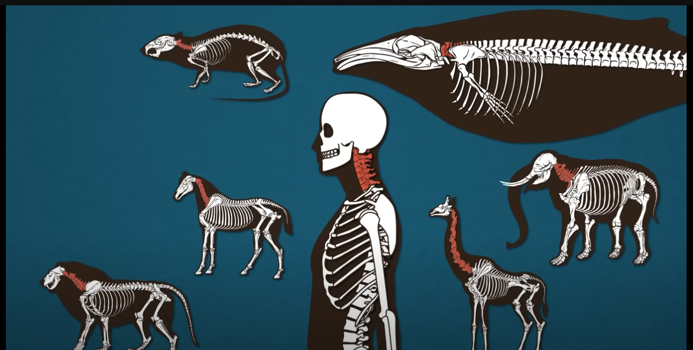
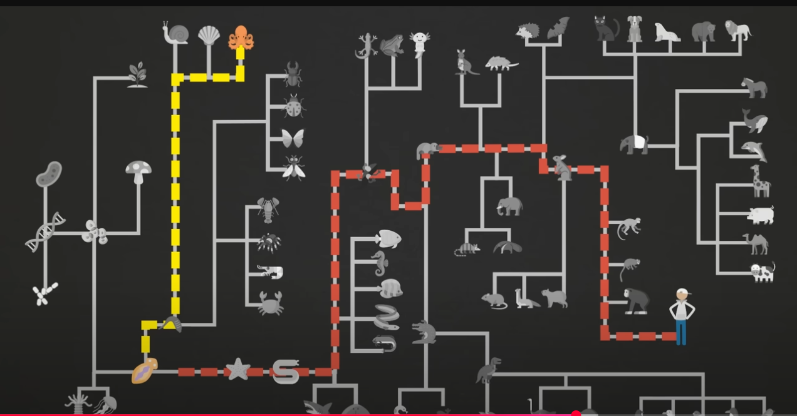

<!-- gid:20241221T095244 -->
[[TIP("이 노트에 대하여")]] 마크 로버는 공학 실험과 유쾌한 제작 과정을 통해 과학을 멀지 않은 놀이이자 배움의 장으로 바꾸는 STEM 창작자다. [[/TIP]] BIBLIOGRAPHY 과학 유튜브 교육 빌드박스 온생명이와 과학 유튜브를 봤다. 온생명이가 매우 흥미로워했다. 마크로버라는 유튜버였다. 문어 미로 탐색 이야기 였다. 진화 맵이 좋았다. 온생명이는 문어의 지능에 굉장이 놀랐다. (삶은 문어를 매우 좋아함) 놀라는 것은 문이 열리는 것이다. 그 때 먼저 인간 목뼈와 팔의 구조를 다른 동물들의 진화 계통과 함께 보여준다.  그 다음에 진화의 맵에서 문어와 인간이 얼마나 다른 계통에서 지능이 진화되어 온 것인지 보여준다. 문어는 외계에서 온 지능이라는 표현을 하더이다.  물론 여기에 모든 생명체에 생명의 알파벳도 훌러덩 넘어간다. ([유시민 과학책 - 생명의 알파벳](https://wikidocs.net/382214.md#h-f2af2aa1-8187-4fc8-85e9-63291567c2dd/)) 아름답다.

별도로 빌드박스라고 DIY 과학실험키드를 보내준다. 물론 국내로 배송은 어려울 것이다. 물론 아내가 천문학 관련 교육을 해줬었다. 줌 강의랄까? ([천문대: 안산 어린이 천문대](https://wikidocs.net/381286))

실시간 줌 강의와 구독자600만 유튜버의 다큐멘터리 스타일의 영상은 목적이 다르다.

아무튼 그의 옆에는 지금도 [시모어패퍼트 마인드스톰](https://wikidocs.net/382178)이 있다. 놀랍게도 그는 맨날 들고 다니지만 펼쳐 본적은 거의 없다. 그냥 들고 다닌다. 잘 때 배게로 사용한다. 원서 구해서 번역 돌려서 이동 할 때 오디오북으로 들었다. 끌리는 대로 들어서 어느 장은 3-4번 들은 부분도 있다. 지금의 기술로 패퍼트를 해석해보려는 것이다. 쉽지 않은 도전이다.

뭘 하기에는 그는 정말 많이 깡통이다. 거의 백지 상태이다. 그래서 하는 것인지도 모른다.

## 2024-12-21

@user [Lasers vs Lightning- Which Is More Powerful? - youtube.com](https://www.youtube.com/watch?v=h5Zwg3Ag-bE) Mark Rober 라는 과학 유튜버를 알려줘

@assistant Mark Rober는 미국의 유명한 유튜버이자 엔지니어입니다. 그는 NASA에서 일한 경험이 있으며, 주로 과학 실험, DIY 프로젝트, 그리고 교육적인 콘텐츠를 제작합니다. 그의 동영상은 재미있고 흥미진진한 실험을 통해 과학적 개념을 설명하는 방식으로 많은 인기를 끌고 있습니다. 특히, 그의 "World's Largest Nerf Gun"이나 "Glitter Bomb Trap" 같은 동영상은 큰 화제가 되었습니다. Mark Rober는 과학을 대중에게 보다 접근하기 쉽게 만들고, 창의력과 문제 해결 능력을 촉진하는 데 큰 기여를 하고 있습니다.

@user NASA를 알려줘

@assistant NASA는 미국의 국립 항공 우주국(National Aeronautics and Space Administration)의 약자입니다. 1958년에 설립된 NASA는 우주 탐사, 과학 연구, 항공 기술 개발을 주요 목표로 하고 있습니다. 여기 몇 가지 주요 정보를 소개합니다:

-   **목적:** 우주 탐사, 과학 연구, 항공 기술 개발을 통해 인류의 지식을 확장하고, 우주에서의 인간 활동을 촉진하며, 지구의 환경을 보호하고 이해하는 것.

-   **주요 성과:**
    -   1969년 아폴로 11호의 달 착륙
    -   허블 우주 망원경의 발사 및 운영
    -   여러 행성 탐사선의 발사 (예: 보이저, 마스 로버)
    -   국제 우주 정거장(ISS)의 건설과 운영

-   **프로그램:**
    -   아폴로 프로그램
    -   스카이랩
    -   스페이스 셔틀 프로그램
    -   마스 탐사 프로그램
    -   아르테미스 프로그램 (다시 달로 인간을 보내고, 미래에는 화성으로의 탐사 계획)

-   **연구 및 개발:** NASA는 기후 변화, 지구 관측, 우주 생물학, 천문학 등 다양한 분야에서 연구를 수행하며, 새로운 기술과 방법론을 개발합니다.

-   **교육 및 대중 참여:** NASA는 과학 교육과 대중의 과학 이해를 증진시키기 위해 다양한 프로그램을 운영하고 있습니다.

NASA는 우주 탐사의 선두 주자로서, 인류의 우주에 대한 이해를 넓히는 데 중요한 역할을 하고 있습니다.

@user
