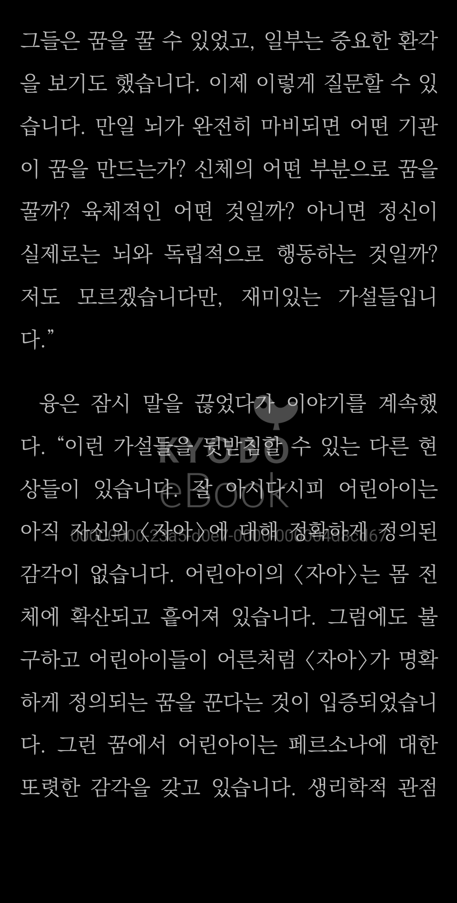

<!-- gid:20241224T103835 -->
[TOC]

[[TIP("이 노트에 대하여")]]
칼 융은 무의식과 원형, 개성화와 공시성의 개념으로 인간 정신을 넓게 해석하며 현대 심리학과 영성 담론에 깊은 흔적을 남겼다.
[[/TIP]]

## BIBLIOGRAPHY

  미구엘 세라노. 2021. <i>헤세와 융 - 상처받은 영혼을 위한 두 거장의 가르침</i>. Translated by 박광자. [https://www.yes24.com/Product/Goods/102163363](https://www.yes24.com/Product/Goods/102163363).
  머리 스타인. 2015. <i>융의 영혼의 지도</i>. Translated by 김창한. 문예. [https://www.yes24.com/Product/Goods/20280418](https://www.yes24.com/Product/Goods/20280418).
  칼 융. 2007. <i>카를 융 기억 꿈 사상</i>. Translated by 조성기. 김영사. [https://m.yes24.com/goods/detail/2804982](https://m.yes24.com/goods/detail/2804982).
  ———. 2023. <i>싱크로니시티 - 공시성 연결 분석심리학</i>. Translated by 정명진. [https://www.yes24.com/Product/Goods/121994007](https://www.yes24.com/Product/Goods/121994007).
  ———. 2024. “Individuation 개성화 자기실현.” [https://en.wikipedia.org/w/index.php?title=Individuation&#38;oldid=1252415210](https://en.wikipedia.org/w/index.php?title=Individuation&oldid=1252415210).

## [책꼽문](https://wikidocs.net/380692)

-   정신과 전문의로 오랜 경험을 했지만, 충족한 결혼은 한 번도 보지 못했습니다. 그런 결혼이 있다고 생각했던 적이 있기는 합니다. 어떤 독일 교수가 자신의 결혼이 그렇다고 장담했기 때문입니다. 베를린에 사는 그를 방문할 때까지는 믿었습니다. 그런데 그의 아내가 비밀 아파트를 갖고 있다는 것을 알게 되었습니 헤세와 융 중에서

## 싱크로니시티 - 공시성 연결 분석심리학

(칼 융 2023)

-   칼 융 정명진

-   과학이 그리는 세상의 그림을 완성시키는 개념, 싱크로니시티! 모든 상황에서 진리인 원칙 같은 것은 절대로 없다. 현대 물리학의 발견을 통해서 자연의 법칙이란 것도 상대적이라는 것이 확인되었다. 그럼에도 아직 모든 것을 인과 관계를 바탕으로 설명하려 든다. 그러다 보니 물리적인 우주 안에서 인간 정신이 하는 주관적 경험은 무시되는 수밖에 없다. 그 결과, 우리가 그리는 세상의 그림이 불완전할 수밖에 없다는 것이 칼 융의 주장이다. 융이 불완전한 세상의 그림을 완성시키기 위해 제시한 개념이 바로 싱크로니시티(공시성)이다. 싱크로니시티는 어떤 정신적 상태가 그것과 의미로 연결된것처럼 보이는 외적 사건이 동시에 일어나는 현상을 말한다. 융은 싱크로니시티를 설명의 한 원리로서 인과 관계와 동급으로 여긴다. 그렇다면, 싱크로니시티는 과학이 그리는 객관적인 세상과 개인의 주관적인 정신의 세계를 통합시키려는 시도라고 볼 수 있다. 융이 제시하는 싱크로니시티의 예를 보자. 환자가 융에게 황금 스카라베를 선물로 받은 간밤의 꿈에 대해 이야기하고 있는데, 융의 뒤쪽에서 창을 가볍게 두드리는 소리가 나서 돌아보았더니 스카라베와 아주 비슷한 풍뎅이였고, 그것을 계기로 치료 과정이 쉽게 시작되었다고 한다. 독일 작가 빌헬름 폰 숄츠의 글에서 끌어낸 예이다. 독일 슈바르츠발트에서 어린 아들의 사진을 찍은 어느 어머니는 사진관에 필름 인화를 맡겼다가 전쟁이 발발하는 바람에 필름을 찾지 못하고 포기했다. 그녀는 몇 년 뒤에 프랑크푸르트에서 필름을 사서 딸의 사진을 찍고 현상을 맡겼다. 그런데 그 필름이 이중으로 노출된 것으로 드러났고, 아래쪽의 사진을 확인했더니 1914년에 찍은 아들의 사진이었다고 한다. 헌 필름이 새 필름에 섞여 유통되었던 것이다. 융의 한 지인은 꿈에서 친구의 갑작스런 죽음을 생생하게 보았다. 당시에 융의 지인은 유럽에 있었고 그의 친구는 미국에 있었다. 훗날 여러 가지 정보를 바탕으로 분석한 결과, 친구의 실제 죽음이 꿈보다 적어도 한 시간 이상 앞섰던 것으로 드러났다. 〈머리말〉 1장 해설적 논문 2장 점성술 실험 3장 공시성 개념의 선구자들 4장 결론 〈부록〉 싱크로니시티에 대하여
-   원서 : Synchronicity: An Acausal Connecting Principle

## Individuation 개성화 자기실현

(칼 융 2024)

-   칼 융
-   The principle of individuation, or principium individuationis, describes the manner in which a thing is identified as distinct from other things. The concept appears in numerous fields and is encountered in works of Leibniz, Carl Jung, Gunther Anders, Gilbert Simondon, Bernard Stiegler, Friedrich Nietzsche, Arthur Schopenhauer, David Bohm, Henri Bergson, Gilles Deleuze, and Manuel DeLanda.
-   

## @머리스타인 융의 영혼의 지도

(머리 스타인 2015)

-   머리 스타인 김창한
-   머리 스타인 박사의 융 심리학 개론서. 융의 분석 심리학 이론을 지도 제작 과정에 빗대어 그 영혼의 맨 위 표면에 해당하는 자아에서 출발해 콤플렉스, 리비도 이론, 그림자, 아니마/아니무스, 자기, 개성화, 동시성 등 점점 더 복잡한 영역들로 탐구해 들어간다.
-   Jung's Map of the Soul

### 책소개

융 심리학의 최고 전문가 머리 스타인 박사가 '융의 영혼의 지도'를 30년 가까이 연구해 내놓은 쉽고도 깊이 있는 개론서

프로이트와 더불어 20세기 가장 유명하고 영향력 있는 심리학자이자 '분석 심리학(Analytical Psychology)' 창시자인 칼 구스타프 융의 이론을, 융 심리학 최고 전문가로 꼽히는 머리 슈타인 박사가 쉬운 언어와 적절한 비유로 설명한 개론서.

'영혼의 지도'라는 제목이 시사하듯이, 저자는 융의 분석 심리학 이론을 지도 제작 과정에 빗대어 그 영혼의 맨 위 표면에 해당하는 자아(ego)에서 출발해 콤플렉스, 리비도(libido) 이론, 그림자(shadow), 아니마/아니무스, 자기(自己, self), 개성화(Individuation), 동시성(synchronicity) 등 점점 더 복잡한 영역들로 탐구해 들어간다.

그 결과는 그저 밋밋한 2차원 평면 지도가 아니라 융 심리학을 입체적이고 역동적으로 보여주는 3D 지도이다. '융의 영혼의 지도를 30년 가까이 연구해 정제한 결실'이라는 자신에 찬 서론이 허언이 아님을 충실한 내용으로 잘 보여주고 있는 책이다. 융은 한국에도 널리 알려진 인물이고, 여러 논문이나 저작, 블로그 등에 다양한 층위의 난이도와 정확성 혹은 부정확성으로 소개되어 있다. 그처럼 불균질적이고 파편화된 지식 시장에서, 머리 슈타인의 『융의 영혼의 지도』는 단연 충실하고 종합적인, 그러면서도 더없이 대중적으로 잘 요약 정리된 융 입문서로 자리 잡을 수 있을 것으로 전망한다.

### 서론

### 1장 표층 (자아의식적)

-   자아와 의식의 관계
-   자아의 위치
-   심리 유형
-   개인적 자유

### 2장 내면의 거주자 (콤플렉스)

-   무의식에 도달하기
-   콤플렉스
-   무의식의 수준
-   정신 이미지
-   성격의 파편
-   콤플렉스의 구조
-   콤플렉스 분출

### 3장 정신 에너지 (리비도 이론)

-   성과 리비도
-   정신 에너지의 변화
-   모델로서의 물리학
-   에너지의 원천
-   정신 에너지 측정
-   몸과 마음의 통합
-   에너지, 운동, 방향
-   변화와 상징

### 4장 정신의 경계 (본능, 원형, 집단 무의식)

-   원형(정신의 보편자)
-   무의식
-   본능
-   원형과 본능의 관계

### 5장 타자와의 드러내고 감추는 관계 (페르소나와 그림자)

-   자아의 그림자
-   그림자 형성
-   페르소나
-   페르소나의 두 원천
-   페르소나 발달
-   페르소나 변화
-   페르소나와 그림자의 통합

### 6장 심층의 내부에 이르는 길 (아니마와 아니무스)

-   아니마와 아니무스의 정의
-   젠더, 그리고 아니마와 아니무스
-   아니마/무스 발달
-   아니마/무스와 함께 의식 고양
-   성과 관계들

### 7장 정신의 초월적 중심과 전일성 (자기)

-   융의 자기 경험
-   자기에 대한 융의 정의
-   자기의 상징
-   정신의 중심적 신비로서의 자기

### 8장 자기의 출현 (개성화)

-   심리학적 수명
-   개성화
-   의식의 다섯 단계
-   개성화의 한 사례 연구
-   자기의 운동

### 9장 시간과 영원에 대해 (동시성)

-   혼돈 속 형태
-   동시성의 관념 발달
-   동시성과 인과성
-   동시성과 원형 이론
-   마음과 물질
-   절대지(絶對知)
-   새로운 패러다임
-   우주론

### 책 속으로

정신에 대한 융의 연구는 매우 개인적인 일이기도 했다. 무의식의 마음을 탐험하는 일은 단지 환자나 실험 대상에 한정되어 이뤄진 것이 아니었다. 그는 자신을 실험 대상으로 삼아 분석하기도 했다. 사실 얼마 동안은 자기 스스로 주요 연구 대상이 되었다. 주의 깊게 자신의 꿈을 관찰하고 적극 상상 active imagination 기법을 발전시킴으로써, 자신의 내면세계라는 숨겨진 공간 깊숙이 들어가는 길을 찾아냈다. 환자들과 자신을 이해하기 위해 융은 인간의 문화, 신화, 종교에 대한 비교 연구를 가능하게 하는 해석 방법을 발전시켰다. --- p.13

이 책은 일종의 안내서다. 내가 기대하는 진짜 독자는 융이 설파한 것을 알고 싶어 하지만 그 광대한 저작과 복잡한 사유에 아직 제대로 입성조차 하지 못한 초보자들이다. 물론 그에 대한 이해의 초보적 단계를 넘어선 사람들 역시 이 책을 읽고 얻는 것이 있기를 바란다. --- p.21

내향적 사고의 사람이 강한 사회화가 필요한, 아니면 가가호호 방문하며 신문 구독신청을 받는 일을 하는 외향적 영역을 담당할 경우 일의 효율성은 현저히 떨어진다. 그래서 그는 어찌할 바를 모른 채 상당한 불안과 스트레스를 자주 받는다. 만일 이러한 내향적 사람이 외향적 태도를 선호하는 문화 또는 내향성을 부정적으로 강화하는 가정에서 태어난다면, 그의 자아는 억지로 외향성을 발전시켜 환경에 적응해야 한다. 이것은 상당히 큰 대가를 요구한다. 내향적인 사람은 외향적인 것에 적응하는 데 만성적이고 크나큰 심리적 스트레스를 감수해야 한다. 그의 자아 적응은 자연스럽게 이뤄지지 않으므로 인위적으로 환경에 적응해야 한다.

그는 적응을 제대로 하지 못하겠지만, 어쩔 수 없이 하긴 해야 한다. 이러한 사람의 자아는 불리한 상황에서 기능하게 되는데, 이는 선천적으로 외향적인 인간이 내향적 문화에서 불리한 조건을 취하는 것과 같은 맥락이다. --- p.48~49

융은 콤플렉스가 무의식에 존재한다는 점을 공고히 한 후에도 콤플렉스에 대한 연구를 더 진척해가기를 원했다. 그는 단어 연상 실험 같은 도구를 이용해 콤플렉스들을 면밀히 측정할 수 있었다. 융은 정확한 측정을 통해 모호한 직관과 추론적 이론을 과학적 자료로 변환할 수 있었는데, 이는 융의 과학적 기질과 무관하지 않았다. 융은 특별한 콤플렉스가 생성하는 지표 수와 이러한 지표를 통해 볼 수 있는 마음의 동요가 주는 심각성을 합산하기만 하면, 이 콤플렉스가 부과하는 감정의 양을 측정할 수 있다고 보았다. 이것은 그에게 이 콤플렉스에 묶여 있는 정신 에너지의 상대량 relative quantity을 알려주는 것이었다. --- p.62

융은 원인과 결과로 추론하는 것이 궁극적이라는 생각에 의문을 던지면서, 현대 물리학이 자신의 동맹자임을 발견했다. 왜냐하면 물리학은 인과적 설명 대신 통계적 확률만 있는 사건과 과정이 있다는 점을 밝혀냈기 때문이다. --- p.290

### 출판사 리뷰

절묘한 묘사와 비유로 융의 학문세계에 대한 벽을 허물며 미지의 정신세계에 대한 친절한 안내자 역할을 해주는 책!

칼 융의 사상과 이론은 현대에도 여전히 막강한 영향력을 행사하고 있고, 대중의 높은 관심과 인기를 얻고 있다. 그러나 심리학뿐 아니라 철학, 신학, 사회학, 인류학, 신경과학, 천문학, 물리학 등 다양한 학문 분야를 아우르고 가로지르는 융 심리학의 깊고 넓은 배경과 바탕은 그의 세계를 이해하려는 일반 독자들에게 막막한 벽과도 같다. 게다가 그의 분석심리학은 한두 해가 아닌 60여 년에 걸친 온축의 결과이고, 그것이 무려 18권의 두텁고 밀도 높은 저작으로 남아 있기에 그의 사상을 조금이라도 용이한 경로로 이해하고자 하는 사람들에게 융은 시쳇말로 '넘사벽'이나 다름없다. 머리 슈타인은 그 벽을 낮춘다. 아니, 허물어준다. 몇십 년 동안 융의 심리학을 깊이 있게 연구하고 이해한 내용을, 누구나 쉽게 이해할 수 있는 언어와 표현, 비유들로 재미있게 설명해준다.

이 책을 읽으며 경험하게 되는 매력 중 하나는 적절하고 절묘한 묘사와 비유다. 예를 들면, 무의식의 세계를 "미스터리의 바다" 로 표현하거나, 융을 내면세계 (inner world)의 크리스토퍼 콜럼버스, 무의식의 세계에 대한 탐험가이자 지도 제작자로 표현한 것, "존 글렌과 닐 암스트롱이 외부 우주의 개척자들이라면, 융은 우리 내부에 존재하는 미지 세계의 개척자, 용감하고 대담한 항해자다"라는 표현, "모든 심리학은 개인적 고백이다"라는 대목 등이다. 융이 여러 저작들에서 표현한 용어를 충실히 따르면서도, 그에 대한 설명은 일반인도 이해하기 쉽도록 다듬었다. 때로 가벼운 에세이처럼, 대개는 별다른 부담 없이 편안하게 읽히는 이 책은, 웬만큼 철저하고 깊이 있게 융을 연구하고 이해한 사람이 아니라면 도저히 이렇게 쉽게 쓰지 못했을 것이라는 점을 곳곳에서 보여준다. 거칠고 딱딱하고 팍팍한 음식을, 잘게 부수고, 부드럽게 빻고, 적당히 양념을 섞어 누구나 서슴없이 맛나게 먹을 수 있도록 재가공하는 과정이 연상되는 대목이다.

융은 한국에도 널리 알려진 인물이고, 여러 논문이나 저작, 블로그 등에 다양한 층위의 난이도와 정확성 혹은 부정확성으로 소개되어 있다. 그처럼 불균질적이고 파편화된 지식 시장에서, 머리 슈타인의 《융의 영혼의 지도》는 단연 충실하고 종합적인, 그러면서도 더없이 대중적으로 잘 요약 정리된 융 입문서로 자리 잡을 수 있을 것으로 전망한다.

## @미구엘세라노 헤세와 융 - 상처받은 영혼을 위한 두 거장의 가르침

(미구엘 세라노 2021)

-   미구엘 세라노 박광자 헤르만 헤세 and 카를 융
-   헤세와 융, 두 사람과 나란히 걷는 아름다운 산책길 그리고 인간과 세계에 대한 대화 인간과 세계에 대해 탐구하던 청년 미구엘 세라노가 노년의 헤르만 헤세와 칼 융을 만나 이야기를 나누고 이를 기록한 책이다. 영혼의 닮은꼴이었던 헤세와 융은 1917년에 처음 만나 깊게 교유했으며 서로의 작품과 학문에 영향을 끼쳤다. '진정한 나 자신으로 사는 것'을 삶의 의미이자 최종 목적지로 여겼던 두 사람은 노년에 이르러 깨달은 바를 영적인 대화로 풀어낸다. 두 사람과 정신적으로 누구보다 깊게 교감한 저자는 꼼꼼한 기록으로 두 지식인의 무르익은 지혜를 생생하게 전해준다.

### [2024-12-28 Sat 06:55] 헤세 융 이야기

명확하지 않다.

## 칼 융 기억 꿈 사상

-   (칼 융 2007)
-   칼 융 조성기
-   『카를 융 기억 꿈 사상』은 심리학의 거장이자 삶을 치유하는 영혼의 의사였지만 살아있는 세상 앞에 나서는 것을 극도로 꺼렸던 카를 융, 최후의 자서전이다.나의 생애는 무의식의 자기 실현의 역사다 - 카를 융이 책은 융의 제자이며 여비서였던 아니엘라 야페가 융의...

### 책소개

『카를 융 기억 꿈 사상』은 심리학의 거장이자 삶을 치유하는 영혼의 의사였지만 살아있는 세상 앞에 나서는 것을 극도로 꺼렸던 카를 융, 최후의 자서전이다.

나의 생애는 무의식의 자기 실현의 역사다 - 카를 융

이 책은 융의 제자이며 여비서였던 아니엘라 야페가 융의 나이 82세가 된 1957년부터 5년 가까이 그와 줄기차게 대담을 한 결과 엮어진 자서전으로 융이 한 문장 한 문장 손을 보았다고 전해진다. 자서전은 팔십이 넘은 나이에도 선명히 남아있는 어린 시절의 기억, 평생을 사로잡은 꿈, 죽음을 앞두고 경험한 환상 등을 생생하게 묘사하며 그것을 분석하고 의식화하는 과정을 세밀하게 그려나가고 있다.

카를 융은 외적인 사건이 내적 체험을 대신할 수는 없다고 이야기한다. 그러한 융의 견해에 따라 자서전은 내적 사건들에 집중하고 있으며 카를 융 자신 생애의 특이성을 다루고 있는 책이다.

### 옮긴이 서문 - 자서전 문학의 백미

### 프롤로그

### 일생을 사로잡은 꿈 - 유년시절

### 이제 반항아가 가까이 오도다 - 학창시절

### 아름다운 시간 - 대학시절

### 상처입은 자만이 다른 사람을 치유할 수 있다!

### 프로이트와의 만남

### 내 안의 여인 아니마

### 연금술을 발견하다

### 아, 내 가슴에 두 영혼이 살고 있다

### 여행

### 환상들

### 사후의 삶에 관하여

### 만년의 사상

### 회고

### 편집자의 말

## #관련노트

-   [조셉자보르스키 싱크로니시티 공시성 칼융 봄 (2024-12-06)](https://wikidocs.net/382176)
-   [이부영 칼융 분석심리학 자아 자기실현 무의식 (2024-12-20)](https://wikidocs.net/382205)
-   [어린이: 니체 피아제 칼융 철학 사상 비교 (2024-12-23)](https://wikidocs.net/381465)
-   [힣: 그의 이름의 기원 칼융 한글 어린이 초인 (2024-12-23)](https://wikidocs.net/381466)

## 로그

### [|2025-05-04 Sun 19:16|](https://wikidocs.net/380411.md#h-2025-05-04/)

#### @user 분석심리학자 칼 융에 대해서 알려줘

@assistant 칼 융(Carl Gustav Jung)은 스위스의 정신과 의사이자 분석심리학의 창시자로, 다음과 같은 주요 개념과 이론으로 유명합니다:

-   **집단 무의식(Collective Unconscious)**: 모든 인간이 공유하는 무의식의 영역으로, 여기에는 원형(archetypes)이 포함됩니다. 원형은 인간의 경험과 상상력에서 반복적으로 나타나는 보편적인 상징이나 이미지입니다.

-   **원형(Archetypes)**: 영웅, 어머니, 현자, 그림자 등 인간의 심리적 경험을 형성하는 기본적인 패턴이나 이미지입니다.

-   **페르소나(Persona)**: 사회적 역할을 수행하기 위해 우리가 외부에 보여주는 가면이나 이미지입니다.

-   **그림자(Shadow)**: 우리가 인정하지 않거나 억압한 성격의 일부로, 종종 부정적인 특성이나 충동을 포함합니다.

-   **자기(Self)**: 개인의 전체성을 나타내며, 개인의 성장과 발전을 통해 통합되는 최종 목표입니다.

-   **개성화(Individuation)**: 개인이 자신의 전체성을 실현하고, 무의식과 의식이 조화를 이루는 과정입니다. 이는 융이 강조한 심리적 성숙의 궁극적인 목표입니다.

-   **동기(Motivation)**: 융은 프로이트의 성적 충동 이론을 넘어서, 인간의 동기를 더 넓은 범위에서 설명했습니다. 예를 들어, 창조성, 영성, 자아실현 등을 포함합니다.

-   **심리적 유형(Psychological Types)**: 융은 인간의 성격을 외향형과 내향형으로 나누고, 사고, 감정, 감각, 직관의 네 가지 기능을 통해 더 세분화했습니다. 이는 오늘날의 MBTI 성격 유형 검사의 기초가 되었습니다.

칼 융의 이론은 심리치료뿐만 아니라 문학, 예술, 철학, 신화 연구 등 다양한 분야에 영향을 미쳤습니다. 그의 작업은 인간의 심리적 깊이와 복잡성을 이해하는 데 큰 기여를 했습니다.
