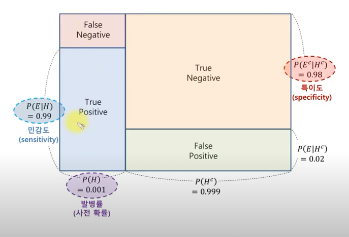

<!-- gid:20250209T211817 -->
[[TIP("이 노트에 대하여")]]
톰 치버스는 베이즈 추론과 통계적 사고를 대중적으로 풀어내며 불확실한 세계에서 더 나은 예측의 습관을 제안한다.
[[/TIP]]

<!-- provenance:source:start -->
[[TIP("원본·최신본")]]
이 페이지는 한국어 검색과 읽기를 위한 WikiDocs 미러입니다. [원본·최신본은 가든](https://notes.junghanacs.com/bib/20250209T211817/)에 있습니다. 최신 수정 내용·백링크·태그·히스토리·댓글·출처 정보는 원본 가든에서 확인하세요.

- 작성: `2025-02-09T21:18:00+09:00`
- 최근 수정: `2025-03-26T00:00:00+09:00`
[[/TIP]]
<!-- provenance:source:end -->

[TOC]

## BIBLIOGRAPHY

- 톰 치버스. 2025. <i>모든 것은 예측 가능하다 - 베이즈 정리</i>. Translated by 홍한결. 김영사. [https://www.yes24.com/Product/Goods/140998072](https://www.yes24.com/Product/Goods/140998072).
- 톰 치버스, and 데이비드 치버스. 2022. <i>숫자에 속지 않고 숫자 읽는 법</i>. Translated by 김성훈. 김영사. [https://www.yes24.com/Product/Goods/108590993](https://www.yes24.com/Product/Goods/108590993).
- <i>베이즈 정리의 의미 - Youtube</i>. n.d. Accessed February 9, 2025. [https://www.youtube.com/watch?v=euH9C61ywEM](https://www.youtube.com/watch?v=euH9C61ywEM).

## 관련노트

-   [추론](https://wikidocs.net/380480)

## History

[2025-06-05 Thu 10:29] Bayesian statistical inference
: 베이즈의 통계적 추론

[2025-02-09 Sun 21:18] 눈에 걸려서

[2025-03-26 Wed 11:05] 내 옆에 있다. 도서관인데

## 저 : 톰 치버스 (Tom Chivers )

영국의 과학 저술가. 〈텔레그래프〉와 〈버즈피드〉에서 일하다가 프리랜서 작가로 전향했다. 2017년에 심리과학협회 미디어상을 받았으며, 2018년과 2020년에 왕립통계학회로부터 '저널리즘 통계 우수상'을 수상했다. 2021년 영국 과학저술가협회가 선정한 올해의 과학작가로 뽑혔으며, 영국 최고의 저널리즘을 기념하는 '영국 언론상'과 〈가제트〉에서 주관하는 '영국 저널리즘상'의 과학저술 분야 후보로 올랐다. 첫 책 《합리주의자의 은하계 안내서》는 2019년 〈더 타임스〉가 선정한 '올해의 과학책'에 뽑혔다.

## 숫자에 속지 않고 숫자 읽는 법

(톰 치버스 and 데이비드 치버스 2022)

-   톰 치버스 and 데이비드 치버스 김성훈
-   "숫자는 어떻게 만들어지고, 어떻게 사용되고, 어떻게 잘못되는가?"뉴스에서 믿을 만한 숫자, 믿지 못할 숫자 가려내는 법여론조사 결과부터 범죄 건수, 경제성장률, 코로나19 확진자 수까지, 숫자로 둘러싸인 세상에서 어떻게 하면 상황을 제대로 이해하고 더 나은 ...

## 모든 것은 예측 가능하다 - 베이즈 정리

(톰 치버스 2025)

-   톰 치버스 홍한결
-   미래의 불확실성에 맞서는 단 하나의 정리베이즈 정리로 알아보는 예측의 과학수학 지식 없이도 이해하는 빅데이터 시대의 필수 교양우리 삶은 크고 작은 예측의 연속이다. 우리는 숨을 쉴 때마다 '공기가 계속 숨 쉴 만할 것이다'라는 기본적이고 암묵적인 예측을 한다....
-   Everything is predictable: How Bayes' Remarkable Theorem Explains the World

미래의 불확실성에 맞서는 단 하나의 정리 베이즈 정리로 알아보는 예측의 과학 수학 지식 없이도 이해하는 빅데이터 시대의 필수 교양

우리 삶은 크고 작은 예측의 연속이다. 우리는 숨을 쉴 때마다 '공기가 계속 숨 쉴 만할 것이다'라는 기본적이고 암묵적인 예측을 한다. 만나기로 한 친구가 제시간에 올지, 편의점에 내가 좋아하는 오렌지 주스가 남아 있을지처럼 조금 더 복잡한 예측도 한다. 모든 예측에는 불확실성이 존재한다는 공통점이 있다. 이처럼 제한된 정보를 가지고 최선의 결정을 내려야 하는 우리의 삶에서, 불확실성을 다루고 더 나은 판단을 내리도록 돕는 강력한 도구가 바로 베이즈 정리다.

베이즈 정리는 18세기 영국의 아마추어 수학자 토머스 베이즈가 발견한 이론으로, 우리가 가진 정보를 바탕으로 사건의 확률을 더 정확하게 예측할 수 있는 강력한 원리다. 단순해 보이지만, 이 정리는 오늘날 스팸 필터에서 법률 시스템, 의료 진단, 뇌과학, 인공지능 등 다양한 분야에서 핵심 도구로 쓰이고 있다. 또한 베이즈 정리는 우리의 마음과 의식이 작동하는 방식 자체를 설명하기도 한다. 이 책은 일상의 친숙한 예시와 함께 베이즈 정리의 개념과 논쟁점, 철학적 의미 등을 경쾌하게 풀어내어, 독자들이 세상을 보다 합리적으로 바라볼 수 있도록 안내한다.

### 들어가는 글 : 꽤 많은 것을 설명해주는 이론

### 1장 : 『공동기도서』에서 알몸 공연까지

-   토머스 베이즈의 삶
-   파스칼과 페르마
-   큰 수의 법칙
-   드무아브르와 정규분포
-   심프슨과 베이즈
-   베이즈의 당구대 비슷한 테이블
-   최초의 베이즈주의자, 흄에 맞서 신을 옹호하다
-   베이즈에서 골턴으로
-   골턴, 피어슨, 피셔와 빈도주의의 부상
-   빈도주의자는 인종차별주의자?
-   베이즈주의의 몰락
-   통계적 유의성
-   위기의 베이즈
-   영광, 영광, 확률이여

### 2장 : 과학 속의 베이즈

-   과학의 재현성 위기와 해결 방안
-   초능력, 치즈로 이루어진 달, 빛보다 빠른 입자
-   포퍼의 백조
-   베이즈와 재현성 위기
-   데니스 린들리의 역설
-   사전확률 구하기
-   아직 끝나지 않은 논쟁

### 3장 : 베이즈 결정이론

-   아리스토텔레스와 조지 불
-   의사결정의 핵심은 베이즈
-   크롬웰의 법칙
-   기대 증거의 보존 법칙
-   효용, 더치북, 게임이론
-   오컴 사전확률
-   초사전확률
-   다중 가설
-   AI와 베이즈

### 4장 : 세상 속의 베이즈

-   인간은 비합리적인가?
-   몬티의 난감한 거래
-   슈퍼예측가(1부)
-   슈퍼예측가(2부)
-   베이즈주의 인식론

### 5장 : 베이즈 뇌 모델

-   플라톤에서 그레고리까지
-   착시 현상
-   현실은 제어된 환각
-   도파민과 첨단 컴퓨터 로봇
-   워들, 테니스, 신속안구운동
-   조현병 환자가 자기 몸을 간지럽힐 수 있는 이유
-   네 손을 정말 제대로 들여다본 적 있니?
-   하느님 제발

### 맺는 글 : 삶 속의 베이즈

## 2022 베이즈 추론

(<i>베이즈 정리의 의미 - Youtube</i> n.d.) \#베이즈추론

-   베이즈 추론은 통계적 추론의 한 방법이다.
-   추론 대상의 사전 확률과 추가적인 정보를 통해 해당 대상의 사후 확률을 추론한다.
-   베이즈 추론은 베이즈 확률론을 기반으로 한다.
-   이는 추론하는 대상을 확률변수로 보아 그 변수의 확률분포를 추정하는 것을 의미한다.
-   수학적 설명
    -   ...

### 베이즈 추론 관련 강의

(<i>베이즈 정리의 의미 - Youtube</i> n.d.)

-   [베이즈 정리의 의미 글](https://angeloyeo.github.io/2020/01/09/Bayes_rule.html)
    -   이 친구가 학부 수준의 수학 이론을 쉽게 정리했다. [BROKEN LINK: Youtuber]에 추가하자. [BROKEN LINK: 공돌이의 수학정리노트]
    -   예제 1: 질병 A 의 발병률은 0.1 퍼센트로 알려져 있다. collapsed:: true
        -   이 질병이 걸린 환자가 질병이 있다고 검진 될 확률 (민감도)는 99 퍼센트
            -   그렇다면, 질병이 없다고 오진 될 확률은 1 퍼센트네?!
        -   질병이없는 사람이 질병이 없다고 검질 될 확률(특이도)는 98 퍼센트
            -   질병도 없는데 있다고 오진 될 확률이 2 퍼센트
        -   질문: 만약 어떤 사람이 질병에 걸렸다고 검진 받았을 때, 이 사람이 정말로 질병에 걸렸을 확률은?
            -   질병에 걸렸다고 검진 될 확률은?
            -   답안
                -

-   예제 2: ...

### #요약

-   위의 강의를 듣고 나서 알게 된 것이지만, 확률론 패러다임의 전환을 말한다고 한다. 연역적 추론에서 귀납적 추론이라고 부제를 달고 있다.
-   귀납법:을 오늘 추가했는데 이렇게 사용될 줄이야.
-   기존의 통계학은 빈도주의라는 말을 하는데 즉 연역적 사고에 기반에서 확률 공간을 정의하고 계산한다. 예를 들어 동전의 앞면 또는 뒷면이 나올 확률은 1/2 이라고 말하는 것이 여기에 해당한다.
-   베이지안주의라고 말하는 새로운(?) 통계학은 경험에 기반한 선험적인, 불확실성을 내포하는 수치를 이용한다. 귀납적 추론으로서 '사전확률' + 추가정보를 활용해서 '사후확률'을 계산하는 것이다.
-   의미가 무엇인가? 추가적인 정보, 근거를 확보하여 더 정확한 추론을 할 수 있다는 것이다.
