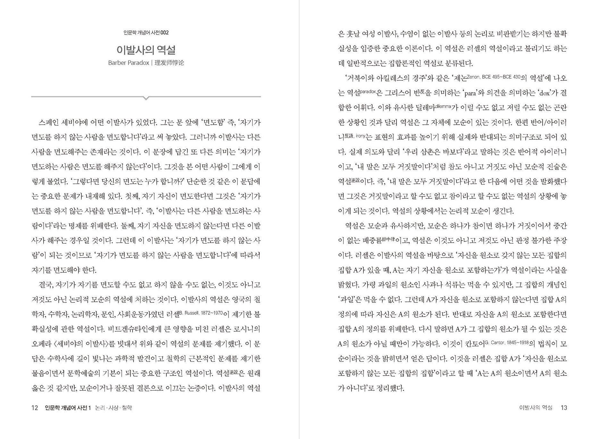
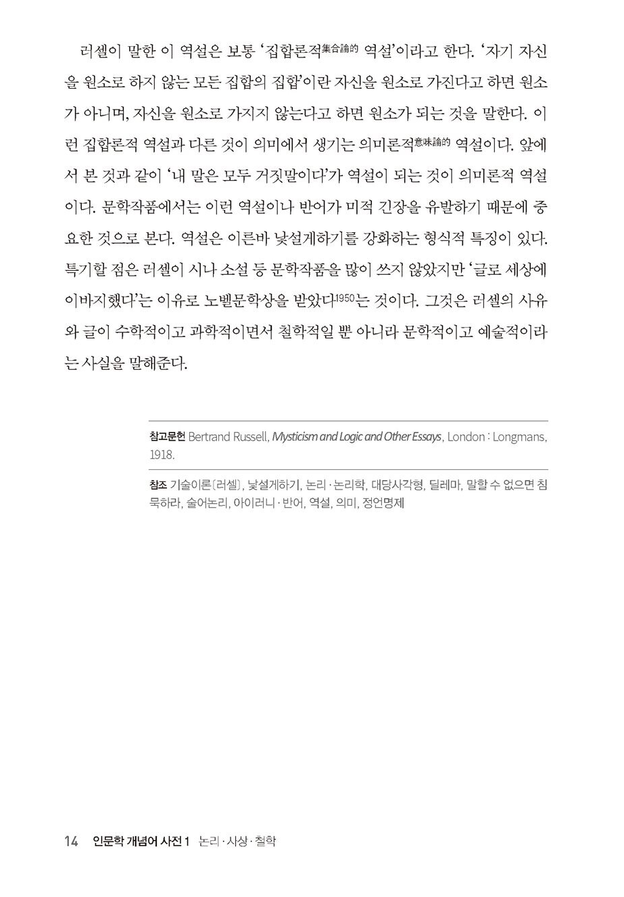

<!-- gid:20250213T073105 -->
[[TIP("이 노트에 대하여")]]
논리·철학·역사·사회·자연·문학·예술의 핵심 개념을 폭넓게 정리해 인문학 전체를 가로질러 읽게 하는 사전이다.
[[/TIP]]

<!-- provenance:source:start -->
[[TIP("원본·최신본")]]
이 페이지는 한국어 검색과 읽기를 위한 WikiDocs 미러입니다. [원본·최신본은 가든](https://notes.junghanacs.com/bib/20250213T073105/)에 있습니다. 최신 수정 내용·백링크·태그·히스토리·댓글·출처 정보는 원본 가든에서 확인하세요.

- 작성: `2025-02-13T07:31:00+09:00`
- 최근 수정: `2026-07-18T16:59:00+09:00`
[[/TIP]]
<!-- provenance:source:end -->

[TOC]

## 히스토리

-   [2026-07-18 Sat 17:00] 겸사 겸사 헤딩 정리를 했다.
-   [2025-06-21 Sat 09:15] 이런 책이 있었구나. 위대하다. 신토피콘이 생각이 나는구나.

## 관련메타

-   [0 syntopicon: 신토피콘](https://wikidocs.net/380840)
-   [1 프로피디아: Propaedia](https://wikidocs.net/380838)
-   [개념어 단어 용어 어휘 전문_키워드 동의어 다의어](https://wikidocs.net/380618)

## BIBLIOGRAPHY

- 김승환. 2022a. <i>인문학 개념어 사전 1 - 논리 사상 철학</i>. [https://www.yes24.com/product/goods/105863757](https://www.yes24.com/product/goods/105863757).
- ———. 2022b. <i>인문학 개념어 사전 2 - 역사 사회 자연</i>. [https://www.yes24.com/product/goods/105863766](https://www.yes24.com/product/goods/105863766).
- ———. 2022c. <i>인문학 개념어 사전 3 - 문학 예술 미학</i>. [https://www.yes24.com/product/goods/105863780](https://www.yes24.com/product/goods/105863780).
- ———. 2022d. “『인문학 개념어 사전』, 인간의 존재론적 본질을 총체적으로 해석하다.” February 13, 2022. [http://www.unipress.co.kr/news/articleView.html?idxno=5500](http://www.unipress.co.kr/news/articleView.html?idxno=5500).

## 관련노트

-   [철학: 바칼로레아 개념어 한글](https://wikidocs.net/381293)
-   [모음: 바칼로레아: 17가지 개념어 - 시대별 철학자](https://wikidocs.net/381292)
-   [조니톰슨 철학 지식 개념어 사전](https://wikidocs.net/382454)
-   [나카무라유지로 술어집 - 지식의 방법 - 현대철학 개념어 40개 키워드](https://wikidocs.net/382426)
-   [신우승 전기가오리 개념어 번역어 철학](https://wikidocs.net/382037)
-   [남경태 개념어 현대철학 철학사](https://wikidocs.net/382028)
-   [나이절워버턴 논리적사고 개념어 철학역사 공부법 예술](https://wikidocs.net/381962)
-   [구본권 디지털개념어사전 공부의미래 메타인지](https://wikidocs.net/381906)

## 서문

-   [2025-06-21 Sat 08:57] 미리보기 페이지를 타이핑함

[[TIP("인용")]]
문학, 역사, 철학, 예술을 중심으로 문화, 사회, 자연, 과학의 중요한 개념을 최대한 정확하게 설명한 사전 형식의 글이다. 약 700여 항목으로 구성되었으며 1권－논리ㆍ사상ㆍ철학, 2권－역사ㆍ사회ㆍ자연, 3권－문학ㆍ예술ㆍ미학으로 나누어 출판되었다. 저자는 일정하게 기술할 때 개념간의 균형을 유지할 수 있다고 판단하고 모든 항목을 2,200자 전후로 기술했다. 이런 형식적 특징과 함께 내용적 특징은 원 개념을 정확하게 기술하면서 역사적으로 축적된 지식과 저자의 해석을 가미했다는 점이다.
[[/TIP]]

인문학 개념어 사전(dictionary of the concept of humanities)은 2008년부터 2053년까지 45년간 문학 역사 철학 예술 문화 사회 자연 과학 종교의 중요한 개념을 서술하고 해석하는 기획이다. 인문학 개념어 사전은 여러 영역을 통섭하는 한편 종단하고 횡단하지 않으면 전체를 알 수 없다는 반성에서 출발했다. 아울러 학술자는 학설과 이론을 정리하는 것도 중요하고, 현장에서 실천하는 것도 의미 있지만, 근본개념과 기본용어를 정확하게 해석하는 것도 중요하다고 생각했다. 매주 하나의 개념을 서술하면서 느낀 점은 어느 것도 쉬운 것이 없고, 아는 만큼 보이고 아는 만큼 들리며, 아는 만큼 쓸 수 있다는 것이다.

글은 한 글자 때문에 뜻이 달라지므로 정확하게 서술하는 것은 무척 어렵다. 어떤 개념을 이해하려면 그 개념의 기원과 본질을 알아야 하고, 그 개념에 내재한 맥락을 이해해야 하며, 사용되는 의미를 파악해야 한다. 한 영역을 잘 안다고 하더라도 여러 영역과의 관계를 알지 못하면 정확한 해석을 할 수 없을 뿐 아니라 함축적인 설명도 할 수 없다. 하나의 개념을 서술하는 것은 무척 어려워서, 한순간도 그 개념에서 떠나지 못했다. 꿈속에서도 써야만 겨우 한 편의 글이 완성되었는데 마치 바위를 깍아서 꽃을 만드는 것 같은 심정이었다.

인문학 개념어 사전은 확장성 기본 텍스트(multi-basic text)이고 다양한 조합과 다각적 응용이 가능하도록 설계되었다. 이를 위해서 몇 가지 규칙을 지켰다. 먼저 그 개념이 생성된 기원과 본질을 서술한 다음 반드시 들어가야 할 의미와 들어가지 않아야 할 의미를 가려냈다. 그리고 사전의 기능을 할 수 있도록 개괄적으로 설명하면서 일관된 체제를 갖추었다. 아울러 서술의 보편성, 객관성, 함축성, 예술성, 완결성을 추구했다. 모든 개념은 서, 기, 승, 전, 결의 5단 구성이며, 한국어 2,200자(영어, 라틴어, 중국어, 한자어 등 제외) 분량으로 서술했다.

가능하면 원전에 근거했으며 영어판본과 중국어판본을 주로 참고했고 한국어 자료와 번역본도 참조했다. 그리고 최대한 보편적으로 기술하여 영어와 중국어 번역이 가능하도록 설계했다. 언어만으로 표현하고자 했기 때문에 그림과 도표는 사용하지 않았다. 특히 쉽고 재미있는 설명보다 정확하고 함축적으로 설명했다. 아울러 공자가 말한 술이부작의 엄격함을 지키고 칸트가 말한 순수이성에 따라 비판적 재인식을 거치고자 노력했다.

인문학 개념어 사전은 매우 부족한 글이다. 그리고 1만 개의 항목을 모두 기술하는 것은 무모한 기획이다. 하지만 인간과 우주 자연을 총체적으로 설명해 보려는 목표를 포기할 수 없다. 하얗게 밤을 지새우며 수많은 고민도 하고 한탄도 했지만, 하나의 개념을 비교적 정확하게 서술했을 때의 기쁨이란 그 무엇과도 비교할 수 없었다. 또한, 인류가 오랫동안 축적한 지식과 가치를 마주할 때 즐거웠고 다양한 인물과 역사적 사건에 담겨 있는 희망, 고통, 기쁨, 공포, 통찰, 고뇌, 열정, 비애, 분노, 사랑을 읽으면서 놀랐다. 한 인간이 45년 걸린 이 작업을 머지 않아서 메타인간(meta-human) 또는 인공지능은 단 45초에 끝낼 것이다. 하지만 21세기의 인간이 사유한 흔적도 의미 있다고 믿는다.

멀고 또 험한 길이지만 수양하는 수도자의 심정으로 하나하나를 학습하고, 연구하고, 또 서술할 것이다. 그리하여 '나는 누구인가? 인간은 무엇인가? 문명과 문화와 사회는 어떤 것인가? 인간은 무엇을 생각하고 무엇을 느낄 수 있는가? 우주는 왜 생겼는가? 시공간은 무엇인가? 인간은 어디에서 와서 어디로 가는 것인가? 인간의 삶은 가치 있는 것인가?'등을 최대한 잘 설명하고자 한다. 무한한 우주와 영원한 신에 경배하면서, 자기 존재에 대해서 깊이 성찰하는 현생인류(homo-sapience)에게 이 책을 헌정한다. 아울러 미래에 지구와 우주에 살게 될 미지의 존재에게 인간의 사유를 전한다.

## 1권 #논리 #사상 #철학

(김승환 2022a)

-   이발사의 역설 12
-   만인에 대한 만인의 투쟁 15
-   천명사상 18
-   동일률·모순율·배중률 21
-   보편문법 24
-   탈식민주의 27
-   소크라테스의 문답법 30
-   현상학적 환원 33
-   이항대립 36
-   기관 없는 신체 39
-   계급의식 42
-   타자 45
-   호접지몽 48
-   인정투쟁 [헤겔] 51
-   노마디즘 54
-   생체권력 57
-   안티 오이디푸스 60
-   인식론 63
-   리좀 66
-   생활세계 69
-   디에게시스 72
-   이성은 감성의 노예 75
-   순수이성 78
-   사단칠정 81
-   주체분열 84
-   욕망기계 87
-   유물론 90
-   주체·주체성 93
-   권력의지/힘에의 의지 96
-   포정해우 99
-   차연 102
-   허위의식 105
-   제행무상 108
-   부정변증법 111
-   정언명제 114
-   공(空)/수냐타 117
-   격물치지 120
-   말할 수 없으면 침묵하라 123
-   상징적 거세 126
-   카르마 129
-   내던져진 존재 132
-   호연지기 135
-   아트만 138
-   중용지도 141
-   양상실재 144
-   실재의 사막 147
-   적멸의 니르바나 150
-   죄수의 딜레마 153
-   카르페 디엠 156
-   타불라 라사 159
-   죽음에 이르는 병 162
-   자기기만 [사르트르] 165
-   판단력비판 - 미(美)란 무엇인가? 168
-   공포와 전율의 아브라함 171
-   탈주의 비상선 [들뢰즈] 174
-   양지양능치양지 177
-   계급투쟁 180
-   색즉시공 183
-   인간소외 186
-   변증법 189
-   교외별전 192
-   브라흐만 195
-   잉여가치 198
-   탈영토 201
-   에피스테메 204
-   데카르트의 악마 207
-   초인/위버멘쉬 210
-   그림이론 [비트겐슈타인] 213
-   지각우선의 지각현상학 216
-   지행합일 219
-   마야 환영 222
-   현존재 다자인 225
-   쾌락주의의 역설 228
-   내재의 평면 231
-   까다로운 주체 234
-   행복연금술 [알 가잘리] 237
-   언어게임 [비트겐슈타인] 240
-   대당사각형 243
-   정복자 지나 246
-   딜레마 249
-   중관사상 252
-   맹목적 생존의지 [쇼펜하우어] 255
-   무극이태극 258
-   삼위일체 261
-   타자윤리 264
-   실천이성 267
-   도가도비상도 270
-   병든 동물 인간 273
-   존재론적 해석학 276
-   코나투스 279
-   타인의 얼굴 [레비나스] 282
-   심신일원론 [스피노자] 285
-   이기론 [주희] 288
-   카발라 신비주의 291
-   성선설 294
-   신이 존재하는 다섯 가지 근거 [토마스 아퀴나스] 297
-   성악설 300
-   긍정의 변증법 [알랭 바디우] 303
-   존재와 사건 [알랭 바디우] 306
-   무위자연 309
-   무목적의 목적 312
-   성즉리 315
-   음양오행 318
-   도 321
-   동굴의 비유 324
-   심즉리 327
-   적극적 허무주의 330
-   계몽주의/계몽의 시대 333
-   신은 죽었다 336
-   휴머니즘/인문주의 339
-   시대정신 342
-   만다라 345
-   운명애·아모르파티 348
-   세계정신 351
-   자기 정체성 354
-   니힐리즘/허무주의 357
-   범신론 [스피노자] 360
-   텅 빈 주체 363
-   물자체 [칸트] 366
-   보편논쟁 369
-   아펙투스 [스피노자] 372
-   거경궁리 375
-   윤회사상 378
-   노동가치설 381
-   단자 모나드 384
-   술어논리 387
-   맥락주의 컨텍스츄얼리즘 390
-   위기지학 위인지학 393
-   분석명제·종합명제 396
-   헤브라이즘 399
-   자유의지 402
-   라플라스의 악마 405
-   자아 408
-   유식사상 411
-   리얼리즘/실재론 [철학] 414
-   아치아견아만아애의 4번뇌 417
-   영원불변한 세상 [파르메니데스] 420
-   역사적 유물론 _유물사관_ 사적 유물론 423
-   자아와 비아 426
-   절대자아 429
-   종말론 432
-   인심도심 435
-   형이상학 438
-   명제 441
-   귀납·연역·귀추 444
-   논리실증주의 447
-   존재·존재자 450
-   경험론/경험주의 453
-   이성론/합리주의 456
-   존재론 459
-   마르크스 462
-   관념론 465
-   윤리·윤리학 468
-   미학·예술철학 471
-   결정론 474
-   철학 477
-   아리스토텔레스 480
-   논리·논리학 483
-   지향성 [현상학] 486
-   인과율·인과법칙 489
-   프래그머티즘/실용주의 492
-   가능세계 495
-   양상논리 498
-   필연·우연 501
-   수양론 504
-   공리주의 507
-   인문학 510
-   이성 513
-   의식 516
-   지성·오성 519
-   범주 522
-   직지인심 견성성불 525
-   아 프리오리/선험·후험 528
-   개념 531
-   초월 [칸트] 534
-   논증·추론 537
-   미학국가/미적 상태 [실러] 540
-   재현 543
-   이데아 546
-   직관 549
-   시간 [베르그송] 552
-   상대시간·상대공간 555
-   객관·객관성 558
-   신뢰성 561
-   진리의미론 [타르스키] 564
-   주관·주관성 567
-   본질 570
-   물리주의 573
-   사건 [김재권] 576
-   동일성 579
-   사건 [데이비슨] 582
-   정신사건 585
-   심신이원론 588
-   미메시스 [플라톤] 591
-   영혼 594
-   정신 597
-   사실 600
-   지각 603
-   충분근거율 606
-   권태 [하이데거] 609
-   있다·있음 [파르메니데스] 612
-   없다·없음 [파르메니데스] 615
-   소박실재론·직접실재론 618
-   테세우스의 배 621
-   프레게의 퍼즐 624
-   감각질 627
-   대상론 [마이농] 630
-   마이농의 정글 633
-   게티어 문제 636
-   게티어 문제 해결 639
-   내재주의 642
-   외재주의 645
-   신빙론 648
-   인식 정당화 651
-   증거론 654
-   회의주의 657
-   경험주의의 독단 [콰인] 660
-   자연적 인식론 663
-   분석성의 독단 [콰인] 666
-   분석과 종합 [콰인] 669
-   자연화된 인식론 [콰인] 672
-   기술이론 [러셀] 675
-   존재론적 개입 [콰인] 678
-   존재론 [콰인] 681
-   분석철학 684
-   빈이름/실체 없는 이름 687
-   상존재 조자인 [마이농] 690
-   개념과 대상 [프레게] 693
-   이다·있다 696
-   존재 [하이데거] 699
-   인문학 개념어 사전 찾아보기 702
-   인문학 개념어 사전 총목록 713

## 2권 #역사 #사회 #자연

(김승환 2022b)

-   비효과·카오스이론 12
-   이기적 유전자 15
-   마키아벨리즘 18
-   구텐베르크·금속활자 21
-   호명 24
-   언어 민족주의 27
-   인쇄자본주의 30
-   중화주의 33
-   심상지리 36
-   룸펜 프롤레타리아 39
-   하얀 가면 42
-   상징자본 45
-   아비투스 48
-   디스토피아 51
-   제2의 자연 54
-   운명론 57
-   문화유전자 밈 60
-   실험의학 63
-   석가모니 고타마 싯다르타 66
-   하위주체 69
-   탈중심주의 72
-   뉴턴역학·고전역학 75
-   패러다임 78
-   오리엔탈리즘 81
-   포퓰리즘 84
-   표현의 자유 87
-   창조계급 90
-   디아스포라 93
-   문화다양성 96
-   우리 안의 파시즘 99
-   내부식민지 102
-   초민족주의 105
-   독사 [부르디외] 108
-   감정연금술 111
-   상징폭력 114
-   상상의 공동체 117
-   근대·근대성 120
-   만국의 노동자여 단결하라 123
-   대중문화이론 126
-   국민국가 / 민족국가 129
-   대화혼 132
-   문화사회 135
-   죽음 충동 138
-   문화자본 [부르디외] 141
-   의학적 시선 144
-   일차원적 인간 147
-   지동설?/?태양중심설 150
-   진화심리학 153
-   집단무의식 156
-   열린 사회 159
-   아니마 아니무스 162
-   연극성 인격장애 165
-   아마추어 지식인 168
-   방어기제 171
-   무정부주의 174
-   민족지 177
-   적자생존 180
-   문화산업 [프랑크푸르트학파] 183
-   비잔틴제국 186
-   시뮬라시옹 시뮬라크르 189
-   상징적 동물 192
-   촘스키의 선전모델 195
-   분서갱유 198
-   천국은 꾸며낸 동화일 뿐이다 201
-   지하드 204
-   트라우마 207
-   군자불기 210
-   게임이론 213
-   마녀사냥 216
-   유토피아 219
-   보이지 않는 손 222
-   개신교 윤리와 자본주의 정신 225
-   문화혁명 228
-   체 게바라 231
-   무사도 234
-   자기 땅에서 유배당한 자들 237
-   동물해방 240
-   이기적 자살 243
-   카리스마 246
-   경국지색 249
-   춘추대의 252
-   대타자·소타자 255
-   화이관 258
-   주이상스 261
-   소중화주의 264
-   실재계 267
-   문화적 헤게모니 270
-   의사소통행위이론 273
-   세계체제론 276
-   아버지의 이름 279
-   주체재분열 282
-   국가주의 285
-   종교개혁 288
-   악의 평범성 291
-   결혼동맹 294
-   상호부조론 - 진화의 요인 297
-   집합 300
-   젠더수행성 303
-   사회학적 상상력 306
-   아노미 [뒤르켐] 309
-   양자역학 312
-   동일성의 폭력 [레비나스] 315
-   불확정성의 원리 318
-   빅뱅이론 / 우주팽창이론 321
-   젠더 324
-   실제의 공동체 327
-   내성 / 분트의 자기성찰 330
-   혁명 333
-   제국주의 336
-   호모루덴스 339
-   성찰적 근대화 342
-   나폴레옹 345
-   십자군전쟁 348
-   콜럼부스 351
-   산업혁명 354
-   칭기즈 칸 357
-   공통조상 360
-   히틀러 363
-   진시황 366
-   중립진화 369
-   공자 372
-   대동아공영권 375
-   운명의 수레바퀴 378
-   탈아입구 탈아론 381
-   메이지유신 384
-   한자문화권 387
-   불안장애 390
-   공포증 포비아 393
-   정신분열증 396
-   커피하우스 399
-   신경증 402
-   심인반응 405
-   자연선택 408
-   정신증 411
-   우울증 우울장애 414
-   아시아적 생산양식 417
-   돌연변이 420
-   전체주의의 기원 423
-   신해혁명 426
-   공황장애 429
-   리비도 432
-   원본능·자아·초자아 435
-   프로이트 438
-   원죄 [기독교] 441
-   학문 444
-   제2차 세계대전 447
-   하데스 음부 450
-   사대주의 453
-   러시아혁명 456
-   거울단계 459
-   티베트 사자의 서 462
-   인류의 출현 465
-   창조론 468
-   빙하기 471
-   로마제국 474
-   신석기혁명·농경사회 477
-   복잡계 480
-   메소포타미아문명 483
-   특수상대성이론 486
-   무함마드?/?마호메트 489
-   석기시대 492
-   천동설 495
-   드레퓌스 사건 498
-   파리코뮌 501
-   제1차 세계대전 504
-   현생인류 아프리카기원설 507
-   예수 그리스도 510
-   중일전쟁/청일전쟁 513
-   만유인력·중력 516
-   문명 519
-   러일전쟁 522
-   인공지능 AI 525
-   빅데이터 528
-   행동주의·파블로프의 개 531
-   일반상대성이론 534
-   프랑스대혁명 537
-   사물인터넷 540
-   블랙홀 543
-   진화론 546
-   정신분석 549
-   열역학·에너지보존법칙 552
-   원자 555
-   호모 에렉투스 558
-   역사 561
-   지식의 고고학 564
-   DNA/디옥시리보 핵산 567
-   딥러닝/심층학습 570
-   위험사회 573
-   극기복례 576
-   문화제국주의 579
-   비단길 582
-   집단기억 585
-   기억 588
-   초끈이론 591
-   문화상대주의 594
-   기억투쟁 597
-   망각 600
-   현재·과거·미래 603
-   문화적 기억 606
-   정한론 609
-   인간 [신체] 612
-   중국어 방 논증 615
-   마음 618
-   지능 621
-   튜링테스트 624
-   무한 627
-   민족 630
-   자본주의 633
-   분자 636
-   시간 639
-   민족주의 642
-   원형감옥 645
-   유전자 648
-   공간 651
-   시공간 654
-   과학주의 657
-   호모 사피엔스/현생인류 660
-   죽음의 공포 663
-   영원 666
-   4차 산업혁명 669
-   저승·내세 672
-   이율배반 675
-   통 속의 뇌 678
-   엔트로피 681
-   의미론 684
-   검증주의 687
-   인지심리학 690
-   인지과학 693
-   기능주의 [철학] 696
-   자연주의 [철학] 699
-   인문학 개념어 사전 찾아보기 702
-   인문학 개념어 사전 총목록 713

## 3권 #문학 #예술 #미학

(김승환 2022c)

-   아우라 12
-   리얼리즘 [예술] 15
-   상징 18
-   외설 21
-   비극 24
-   예술가 27
-   다문화주의 30
-   연극·드라마 33
-   포스트모더니즘 36
-   풍자 39
-   문화 42
-   묘사 45
-   알레고리/풍유 48
-   문학 51
-   반영론 54
-   예술치료 57
-   단일신화 60
-   욕망의 삼각형 63
-   제4의 벽 66
-   혁명적 낭만주의 69
-   다원예술 72
-   발자크의 리얼리즘 75
-   낯설게하기 78
-   거대서사의 붕괴 81
-   리좀 84
-   공공예술 87
-   기운생동 90
-   페미니즘 93
-   문화권력 96
-   포르노 99
-   내러티브 102
-   실존주의 105
-   황금비율 108
-   로코코 111
-   예술 114
-   문화다양성 117
-   문화충격 120
-   개념예술 123
-   시 126
-   안빈낙도 129
-   문화생태계 132
-   공산주의적 인간형 135
-   문화순혈주의 138
-   감정연금술 141
-   소설 144
-   정경교융 147
-   물아일체 150
-   카타르시스 153
-   대중문화이론 156
-   문화자본 [부르디외] 159
-   문이재도 162
-   도시의 전설 165
-   증강현실 168
-   의상 171
-   문학사·예술사·문화사 174
-   아방가르드 177
-   독립예술 180
-   민족문화 183
-   에이브럼즈의 삼각형이론 186
-   문화예술교육 189
-   헬레니즘 192
-   신경미학 195
-   무릉도원 198
-   질풍노도 201
-   사무사 204
-   판단력비판－미(美)란 무엇인가? 207
-   아케이드 프로젝트 210
-   숭고 213
-   바움가르텐의 진선미 216
-   모리스의 사회주의 생활예술 219
-   술이부작 222
-   의식의 흐름 225
-   예술지상주의 228
-   문제적 개인 231
-   산책자 보들레르 234
-   사회주의 리얼리즘 237
-   해의반박 방약무인 240
-   삼일치법칙 243
-   나르시시즘 246
-   비극의 탄생 249
-   르네상스 252
-   기승전결 255
-   시인추방론 258
-   기표·기의/소쉬르 261
-   모방론 264
-   상징주의 267
-   이마고/자아영상 270
-   해석학적 미학 273
-   모티브·모티프 276
-   내포·외연 279
-   의경 282
-   낭만적 숭고 285
-   무목적의 목적 288
-   미/아름다움 291
-   아프로디테의 황금사과 294
-   러시아 형식주의 297
-   후기구조주의 300
-   내포작가/내포저자 303
-   계몽주의/계몽의 시대 306
-   기호 가치 309
-   휴머니즘/인문주의 312
-   의도적 오류 315
-   에로티즘 [바타이유] 318
-   시중유화 화중유시 321
-   숭고 [칸트] 324
-   퀴어이론 327
-   구조주의 330
-   환유 333
-   화자/서술자 336
-   로망스 339
-   원형 [칼 융] 342
-   미학과 정치 [랑시에르] 345
-   유희충동 348
-   상징계 351
-   상상계 354
-   안티고네와 이스메네 357
-   텍스트 360
-   환상/환상성 363
-   환상문학 [토도로프] 366
-   멜랑콜리 [프로이트] 369
-   역설 372
-   보여주기와 말하기 375
-   리얼리즘/실재론 [철학] 378
-   쾌락원칙 381
-   무의식 384
-   안티고네 [소포클레스] 387
-   고전주의 390
-   낭만주의 393
-   자연주의 [예술] 396
-   인상주의 인상파 399
-   초현실주의 402
-   다다이즘 405
-   시언지 시연정 408
-   은유 411
-   모더니즘 [예술] 414
-   예술가 천재론 [셸링] 417
-   시점 420
-   객관적 상관물 423
-   희극/코미디 426
-   오이디푸스 왕 429
-   하마르티아 432
-   프로타고니스트·안타고니스트 435
-   리듬/운율 438
-   서사시 441
-   성장소설/빌둥스로만 444
-   믿을 수 있는 화자와 믿을 수 없는 화자 447
-   플롯 450
-   기대지평 453
-   미적 거리 456
-   수용미학 459
-   전형적 인물과 전형적 상황 462
-   상호텍스트 465
-   신화·전설 468
-   아이러니·반어 471
-   바로크 474
-   이미지·이미지즘 477
-   표현주의 480
-   미학·예술철학 483
-   서정시 486
-   캐릭터·인물 489
-   문명 492
-   저자의 죽음 495
-   한시/중국고전시 498
-   개연성 501
-   미학교육 [실러] 504
-   감정이입 507
-   뉴크리티시즘/신비평 510
-   감성 513
-   상상 516
-   비평/평론 519
-   장르 522
-   주제·제재·소재 525
-   감정·정서 528
-   픽션·논픽션 531
-   문체 534
-   독자반응이론 537
-   이상적 독자 540
-   미메시스 [아우어바흐] 543
-   미학국가/미적 상태 [실러] 546
-   재현 549
-   해석공동체 552
-   원형비평·신화비평 555
-   비유 558
-   정신분석비평 561
-   배경 564
-   스토리·이야기 567
-   추상표현주의 570
-   사건 [소설] 573
-   갈등 576
-   구체화 [잉가르덴] 579
-   역사소설 582
-   전기·자서전 585
-   소설 [동양소설] 588
-   초점화 [서사] 591
-   비교문학 594
-   표현 597
-   개성 600
-   유머·해학 603
-   선시 606
-   메타언어·대상언어 609
-   미메시스 [아리스토텔레스] 612
-   수필·에세이 615
-   운문 618
-   지역문화 621
-   동화·페어리 테일 624
-   산문 627
-   미디어아트 630
-   팝아트 633
-   수사 636
-   자유시 639
-   감동 642
-   유미주의 645
-   허구 648
-   감각 651
-   콘텍스트/맥락 654
-   서사 657
-   문예사조 660
-   주지주의 663
-   열린 텍스트 666
-   작가·독자 669
-   희곡 672
-   제유 675
-   민족적 낭만주의 678
-   교훈주의 681
-   애매성 684
-   민족문학 687
-   지역문학 690
-   문장 693
-   욕망 696
-   메타버스 699

## 관련링크

### 『인문학 개념어 사전』, 인간의 존재론적 본질을 총체적으로 해석하다

(김승환 2022d)

김승환 2022

-   문학·역사·철학·예술 분야 중요한 용어 정리
-   최대한 정확·객관적 설명한 사전형식 글로 기술
-   현생인류가 미래의 메타인류에게 보내는 메시지
-   『인문학 개념어 사전 1: 논리·사상·철학』, 『인문학 개념어 사전 2: 역사·사회·자연』, 『인문학 개념어 사전 3: 문학·예술·미학』 (김승환 지음, 소명출판, 2022년 1월 15일, 각 718쪽)

모든 인문학 개념어들을 집대성한 책이 나왔다. 김승환 충북대 명예교수(충북문화재단 대표이사)가 최근 인문학 개념어를 해석한 &lt;인문학 개념어 사전 1, 2, 3&gt;을 펴냈다. 그동안 전공자가 자기 분야의 인문학 개념을 정리하거나 해석한 책은 많았지만, 인문학 전반의 거의 모든 개념을 객관적으로 기술한 책은 처음이다.

'인문학 개념어 사전'은 각 권의 서문과 함께 항목별 원전의 출처를 밝혔으며 참조 어휘에 대해 덧붙였다. 각 권 뒤편에 인문학 개념어 사전 찾아보기 및 인문학 개념어 사전 총목록표가 담겼다. 1권에는 '이발사의 역설'을 시작으로 '만인에 대한 만인의 투쟁', '탈식민주의', '소크라테스의 문답법', '노마디즘' 등 논리·사상·철학 분야의 용어 230개 항목이 담겼으며, 2권에서는 '나비효과·카오스이론', '이기적 유전자', '마키아벨리즘', '구텐베르크·금속활자', '언어 민족주의', '인쇄자본주의', '제2의 자연' 등 역사·사회·자연 분야 용어를, 3권에서는 '아우라', '리얼리즘', '상징', '외설', '비극', '예술가' 등 문학·예술·미학 분야의 용어를 기술했다.

#### 인간이란 무엇인가?

이 책은 '인간이란 무엇인가?'에 대한 답이다. 이 물음에 정답은 있을 수 없다. 하지만 모든 사람은 '인간이란 무엇인가?'를 묻는다. 그 물음을 더 정확하게 말하면 '나는 무엇이고 나는 누구인가?'일 것이다. 존재론적 불안을 안고 사는 유한한 존재 인간 누구나 이 물음을 묻고 또 묻는다. '나는 누구인가?, 인간은 무엇인가?, 문명과 문화와 사회는 어떤 것인가?, 인간은 무엇을 생각하고 무엇을 느낄 수 있는가?, 우주는 왜 생겼는가? 시공간은 무엇인가? 인간은 어디에서 와서 어디로 가는 것인가? 인간의 삶은 가치 있는 것인가?'

저자 역시 없는 답을 찾아 사막을 걷듯이 헤맨다. 인간존재를 이해하려면 인간의 생각과 표현인 문학, 철학, 예술을 알아야 하고 인간 삶의 궤적을 이해하려면 실제 사건인 역사를 알아야 한다.

그뿐일까? 인간 자체가 어떻게 구성되었는지는 생물학, 화학이 답을 해주고 인간을 둘러싼 물리적 조건은 물리학이 답을 해준다. 인간이 함께 사는 방법에 관해서는 사회학, 심리학, 정치학이 필요하다. 결국 '인간이란 무엇인가?'를 알고자 하면 인문학을 중심으로 과학, 사회학, 종교 등 거의 모든 영역을 알아야 한다. 그러니까 『인문학 개념어 사전』의 저술 의도는 인간의 존재론적 본질을 총체적으로 해석하는 것이다.

저자는 "미래에 지구와 우주에 살게 될 미지의 존재에게 인간의 사유를 전한다"는 초시간적 대화의 상황을 설정하고 각 개념을 기술할 때 인간의 보편성, 필연성, 객관성을 최우선 했다고 말한다. 그것은 사유의 총체성이다.

총체적 관점에서 설계되고 13년간 기술된 『인문학 개념어 사전』은 문학, 역사, 철학, 예술을 중심으로 문화, 사회, 자연, 과학의 중요한 개념을 최대한 정확하게 설명한 사전 형식의 글이다. 약 700여 항목으로 구성되었으며 1권－논리·사상·철학, 2권－역사·사회·자연, 3권－문학·예술·미학으로 나누어 출판되었다. 저자는 일정하게 기술할 때 개념 간의 균형을 유지할 수 있다고 판단하고 모든 항목을 2,200자 전후로 기술했다. 이런 형식적 특징과 함께 원 개념을 정확하게 기술하면서 역사적으로 축적된 지식과 저자의 해석을 가미했다는 점이 내용적 특징이다.

저자는 총체적 기술에 대한 필연적이고 내적인 소망을 피력하고 있다. 그 말은 이런 총체적 기술이 아닌, 분과 학문의 관점에서 인간을 설명하는 것은 종합적이지 않고 통일적이지 않다는 뜻이다. 그것은 또한 총체적 기술만이 훌륭한 인간학 또는 인문학이라고 할 수는 없겠지만 적어도 총체적 시각에서 인간을 기술하는 것은 반드시 필요하다는 생각일 것이다. 총체적이란 하나의 관점이 아닌 다원적이고 유기적인 관점이라는 뜻이다. 그러므로 『인문학 개념어 사전』은 인간을 이해하기 위하여 꼭 필요한 개념을 설정하고, 그 개념을 보편적이면서 총체적으로 기술한 책이라고 할 수 있다.

#### 『인문학 개념어 사전』의 관점

한 개념에는 독창적 사상과 일반적 지식이 결합되어 있다. 이때 중요한 것은 '왜 이런 개념이 생겨났을까?'에 대한 반성이다. 그래서 저자는 이렇게 말한다. 칸트의 개념을 기술할 때는 칸트가 되어야 했고, 주희(朱熹)의 개념을 기술할 때는 주희가 되어야 했다. 심지어 히틀러가 되어 「나의 투쟁」을 읽기도 했다. 가령 칸트의 순수이성을 기술할 때는 칸트의 『순수이성비판』을 읽기도 하지만, '왜 칸트가 순수이성을 생각하게 되었을까?'에서 시작하여 전후의 맥락과 형성의 과정을 자기만의 방식으로 사유하는 것이다.

결국 플라톤으로 거슬러 가고, 비트겐슈타인에게도 내려오는 종횡의 사유가 필요했다. 콰인(W.V. Quine)으로 한용운을 해석하다가 하이젠베르크로 모차르트를 이해해야 했다. 당연히 어려운 일이어서 하나의 개념도 완벽하게 알 수는 없었다. 그래서 가능한 시간과 공간을 넘는 객관성과 보편성의 용광로에서 용해하여 기술했다.

저자는 '아우라'라는 단어를 예로 들었다. 이 용어를 심도 있게 생각하게 된 것은 '모나리자' 그림의 원작을 직접 관람한 때다. '모나리자'는 유명한 작품이라 복제품이나 사진이 많은데도 불구하고 사람들은 왜 원작을 보고 싶어 할까라는 궁금증이 생겼다. 작가는 실제 원작 앞에서 '모나리자'가 내뿜고 있는, 진본만이 갖고 있는 형언할 수 없는 '특별하면서 신비한 그 무엇'을 느낀다. 이것이 바로 '아우라'라고 생각했다.

이후 저자는 미국의 한 대학에서 한 학기 동안 발터 벤야민의 '기술복제시대의 예술작품'이라는 책에 대한 집중 강의를 듣게 된다. 실제 아우라는 그리스어로 숨결, 바람이라는 뜻이며, 혹은 독특한 그 무엇이라는 의미로 히브리어와 유대교 신비주의에서 온 개념으로 독일에 살던 유대인 벤야민이 예술용어로 처음 사용하면서 널리 알려지게 된 것이다. 벤야민은 예술에서 인식하고 있는 아우라는 '인간이나 사물이 가진 고유의 영적인 것을 의미하면서, 그 존재 특유의 가치를 포함한다'고 했다. 하지만 벤야민은 '대량생산이 근대 자본주의 사회의 본질이고 그 본질을 잘 나타내는 양식이 영화와 사진'이라면서 '진본이나 원본과 같은 고전적인 가치는 더는 중요하지 않게 되었다'며 자본주의 시대의 실상을 강조했다.

저자가 '인문학 개념어 사전'에서 설명하는 것은 '아우라'라는 단어가 어디서부터 탄생되었는지, 어떤 학자가 이 용어를 어떻게 사용하게 됐는지, 현재의 상황은 어떤 변화를 거치고 있는지 객관적인 시선으로 서술하고 있다.

"차라리 내 생각을 주관적으로 쓴다면 더 쉬울 거 같아요. 하지만 이번 원고는 내 생각은 글을 시작하거나 마무리할 때 잠깐씩 들어가고 원 텍스트에 온전히 집중해 객관적으로 기술하려고 노력했어요. 번역본은 여러 단계를 거쳐 텍스트가 변형될 수 있기 때문에 웬만하면 직접 원전을 보느라 외국어 공부를 많이 했습니다."

저자는 글에 재미와 멋을 배제했다. 쉽게 쓰지 않겠다는 원칙을 지켰다. 의도적으로 문체에 멋을 부리다 원 개념과 달라질 것을 우려한 것이다. 저자가 이처럼 방대한 분량의 원고 집필과 공부를 하고 있는 목표가 독특하다.

"처음에는 관심있는 역사와 문학에 등장하는 예술용어를 공부한다는 마음으로 출발했지만 매일 매일 규칙적으로 어마어마한 독서량과 생각이 투자되면서 마음이 달라지더라구요. 인류의 한 존재가 생각하고 체험한 것을 훗날 인류가 아닌 다른 존재에게 전달하고 싶다는게 목적입니다. 무슨 뚱딴지 같은 얘기인가 할 수 있겠지요. 이 우주가 공간과 시간의 끝에 다다랐을 때, 인류가 어떤 생각과 체험을 했는지 그 총체적 사유를 다시 시작되는 어떤 미지의 존재에게 전달해야겠다는 생각을 했습니다."

세상에는 수많은 인문학 용어들이 나타났다 사라지곤 한다. 이 많은 용어 중 개념의 통일이 안 된 경우가 너무 많다는 것이 저자의 생각이다. 예를 들면 "'사과'에 대해 리얼리즘을 추구하는 문학에서는 당장 눈앞에 있는, 현실의 사과를 반영하는 것만 인정하지만 관념적 언어로는 눈에 보이지 않는 과거와 미래의 사과도 사과"라며 "여러 경우의 사과가 각각 어떤 개념으로 작용하는지가 관심의 대상인 셈"이라고 말했다.

#### 『인문학 개념어 사전』의 구성과 기획, 확장

『인문학 개념어 사전』은 확장성 기본 텍스트(multi-basic text)이고 다양한 조합과 다각적 응용(應用)이 가능하도록 설계되었다. 이를 위해서 몇 가지 규칙을 지켰다. 먼저 그 개념이 생성된 기원과 본질을 서술한 다음 반드시 들어가야 할 의미와 들어가지 않아야 할 의미를 가려냈다. 그리고 사전의 기능에 충실하도록 개괄적으로 설명하면서 일관된 체제를 갖추었다. 아울러 서술의 보편성, 객관성, 함축성, 예술성, 완결성을 추구했다. 모든 개념은 서, 기, 승, 전, 결의 5단 구성이며 한국어 2,200자(영어, 라틴어, 중국어, 한자어 등 제외) 분량으로 서술했다.

하나의 관점에서 어떤 개념을 보면 올바로 보이지 않는다. 가령 문학의 리얼리즘(Realism)과 고전철학의 리얼리즘은 의미가 다르다. 그러므로 맥락과 차이를 분별해야 한다. 이 책의 주제는 인간학이고 인간학은 자연학이다. 그래서 인문학과 천문학(자연학)은 하나일 수밖에 없다. 그런데 근대에 들어 학문도 전문화되고 세분화되면서 종합적이고 통섭적인 관점이 사라졌다. 그리하여 문학, 역사학, 철학, 논리학 등 분과학문으로 나뉘어졌다. 저자는 이런 상황을 극복하고자 인문학과 천문학(자연학)에 대한 총체적 기술을 목표로 설정했다. 인류가 축적한 지식을 객관 타당하게 정리하고 보편적으로 기술하는 것이 이 책의 의도이다.

이 책은 사전의 기능을 우선한다. 하지만 저자만의 관점이나 이론도 있기 때문에 사전의 기능을 넘어선다. 그러므로 인문학을 총체적으로 기술하는 것이면서 인문학 관점에서 인간과 자연을 설명하는 '인문학총람'의 성격이 있다. 저자가 말하고 있듯이 『인문학 개념어 사전』은 인간학을 중심으로 하는 인문학의 가장 중요한 항목으로 구성되어 있다.

저자는 향후 작업에 대해 "앞으로도 심층적이고 세분화된 항목을 찾아 계속해서 기술할 예정이다. 출간한 용어를 포함해 960항목을 썼는데, 1만 항목을 기술하는 것이 최종 목표"라며 "과연 가능할지 모르겠다. 하나의 관점에서 1만 항목을 기술하는 일은 유례없을 것이지만, 독자나 타인을 위한다기보다는 1차적으로 내 자신을 위한 공부, 내 스스로를 깨우치려는 공부, 즉 위기지학(爲己之學)이라는 목표가 만들어져 가능할 수 있다. 자신을 위한 목표란 한 생애에 자기 존재를 이해하고 깊이 깨우치는 길일 것이기에 중요한 동기가 된다"고 말했다.

#### 디지털 시대의 글쓰기와 글읽기

『인문학 개념어 사전』은 디지털시대의 텍스트 생산에 적합한 체계로 구성되었다. 이 기본텍스트는 다양하게 조합되고 응용될 수 있다. 이렇게 기획되고 기술된 이유는 사유의 디지털화가 되어야만 인문학과 주변 영역을 총체적으로 통섭할 수 있기 때문이다. 천 개의 고원에서 유영하는 사유에서는 경계가 없고, 중심이 없다. 그리고 텍스트의 생명력은 현실과 가상을 오고 갈 때 강화된다.

이 방대한 작업을 진행하며 서문에서 "때로는 망망대해를 혼자 걸어가는 느낌이다. 하지만 한 사람이 일관되게 작업하지 않으면 완성되지 않을 일이다. 수십 년 걸려 이 작업이 완성된다면 머지않아 메타 인간 또는 인공지능(AI)은 단 45초에 끝낼 것"이라며 "그렇다면 이 작업은 무슨 의미가 있는 것인가 묻게 된다. 지식생산의 과정에서 메타 인간의 45초와 현생 인류의 45년은 같은 값이지만, 그 의미는 완전히 다르다. 이 책은 현실의 현생 인류가 미래의 메타 인류에게 보내는 메시지"라고 거듭 강조했다.

그는 "무한한 우주와 영원한 신에 경배하면서 자기 존재에 대해 깊이 성찰하는 현생인류에게 이 책을 헌정한다"면서 "미래에 지구와 우주에 살게 될 미지의 존재에게 이번 책으로 인간의 사유를 전한다"고 밝혔다. 이 책은 현실의 현생인류가 미래의 메타인류에게 보내는 메시지다.

## 출판사 리뷰

인간의 존재론적 본질을 총체적 해석

이 책은 '인간이란 무엇인가?'에 대한 답이다. 인간 누구나 쉬우면서도 어려운 이 문제를 생각한다. 하지만 완전한 답은 없다. 저자 역시 없는 답을 찾아 사막을 걷듯이 헤맨다. 인간존재를 이해하려면 인간의 생각과 표현인 문학, 철학, 예술을 알아야 하고 인간 삶의 궤적을 이해하려면 실제 사건인 역사를 알아야 한다.

그뿐일까? 인간 자체가 어떻게 구성되었는지는 생물학, 화학이 답을 해주고 인간을 둘러싼 물리적 조건은 물리학이 답을 해준다. 인간이 함께 사는 방법에 관해서는 사회학, 심리학, 정치학이 필요하다. 결국 '인간이란 무엇인가?'를 알고자 하면 인문학을 중심으로 과학, 사회학, 종교 등 거의 모든 영역을 알아야 한다. 그러니까 『인문학 개념어 사전』의 저술 의도는 인간의 존재론적 본질을 총체적으로 해석하는 것이다.

인간이란 무엇인가?

이 물음에 정답은 있을 수 없다. 하지만 모든 사람은 '인간이란 무엇인가?'를 묻는다. 그 물음을 더 정확하게 말하면 '나는 무엇이고 나는 누구인가?'일 것이다. 존재론적 불안을 안고 사는 유한한 존재 인간 누구나 이 물음을 묻고 또 묻는다. '나는 누구인가?, 인간은 무엇인가?, 문명과 문화와 사회는 어떤 것인가?, 인간은 무엇을 생각하고 무엇을 느낄 수 있는가?, 우주는 왜 생겼는가? 시공간은 무엇인가? 인간은 어디에서 와서 어디로 가는 것인가? 인간의 삶은 가치 있는 것인가?' 등을 최대한 잘 설명하는 것이다.

저자는 "미래에 지구와 우주에 살게 될 미지의 존재에게 인간의 사유를 전한다"는 초시간적 대화의 상황을 설정하고 각 개념을 기술할 때 인간의 보편성, 필연성, 객관성을 최우선 했다고 말한다. 그것은 사유의 총체성이다.

총체적 관점에서 설계되고 13년간 기술된 『인문학 개념어 사전』은 문학, 역사, 철학, 예술을 중심으로 문화, 사회, 자연, 과학의 중요한 개념을 최대한 정확하게 설명한 사전 형식의 글이다. 약 700여 항목으로 구성되었으며 1권－논리·사상·철학, 2권－역사·사회·자연, 3권－문학·예술·미학으로 나누어 출판되었다. 저자는 일정하게 기술할 때 개념간의 균형을 유지할 수 있다고 판단하고 모든 항목을 2,200자 전후로 기술했다. 이런 형식적 특징과 함께 내용적 특징은 원 개념을 정확하게 기술하면서 역사적으로 축적된 지식과 저자의 해석을 가미했다는 점이다.

저자는 총체적 기술에 대한 필연적이고 내적인 소망을 피력하고 있다. 그 말은 이런 총체적 기술이 아닌, 분과 학문의 관점에서 인간을 설명하는 것은 종합적이지 않고 통일적이지 않다는 뜻이다. 그것은 또한 총체적 기술만이 훌륭한 인간학 또는 인문학이라고 할 수는 없겠지만 적어도 총체적 시각에서 인간을 기술하는 것은 반드시 필요하다는 생각일 것이다. 총체적이란 하나의 관점이 아닌 다원적이고 유기적인 관점이라는 뜻이다. 그러므로 『인문학 개념어 사전』은 인간을 이해하기 위하여 꼭 필요한 개념을 설정하고, 그 개념을 보편적이면서 총체적으로 기술한 책이라고 할 수 있다.

『인문학 개념어 사전』의 관점

한 개념에는 독창적 사상과 일반적 지식이 결합되어 있다. 이때 중요한 것은 '왜 이런 개념이 생겨났을까?'에 대한 반성이다. 그래서 저자는 이렇게 말한다. 칸트의 개념을 기술할 때는 칸트가 되어야 했고, 주희(朱熹)의 개념을 기술할 때문 주희가 되어야 했다. 심지어 히틀러가 되어 「나의 투쟁」을 읽기도 했다. 가령 칸트의 순수이성을 기술할 때는 칸트의 『순수이성비판』을 읽기도 하지만, '왜 칸트가 순수이성을 생각하게 되었을까?'에서 시작하여 전후의 맥락과 형성의 과정을 자기만의 방식으로 사유하는 것이다.

결국 플라톤으로 거슬러 가고, 비트겐슈타인에게도 내려오는 종횡의 사유가 필요했다. 콰인(W.V. Quine)으로 한용운을 해석하다가 하이젠베르크로 모차르트를 이해해야 했다. 당연히 어려운 일이어서 하나의 개념도 완벽하게 알 수는 없었다. 그래서 가능한 시간과 공간을 넘는 객관성과 보편성의 용광로에서 용해하여 기술했다.

『인문학 개념어 사전』의 구성

『인문학 개념어 사전』은 확장성 기본 텍스트(multi-basic text)이고 다양한 조합과 다각적 응용(應用)이 가능하도록 설계되었다. 이를 위해서 몇 가지 규칙을 지켰다. 먼저 그 개념이 생성된 기원과 본질을 서술한 다음 반드시 들어가야 할 의미와 들어가지 않아야 할 의미를 가려냈다. 그리고 사전의 기능에 충실하도록 개괄적으로 설명하면서 일관된 체제를 갖추었다. 아울러 서술의 보편성, 객관성, 함축성, 예술성, 완결성을 추구했다. 모든 개념은 서, 기, 승, 전, 결의 5단 구성이며 한국어 2,200자(영어, 라틴어, 중국어, 한자어 등 제외) 분량으로 서술했다.

『인문학 개념어 사전』의 기획

하나의 관점에서 어떤 개념을 보면 올바로 보이지 않는다. 가령 문학의 리얼리즘(Realism)과 고전철학의 리얼리즘은 의미가 다르다. 그러므로 맥락과 차이를 분별해야 한다. 이 책의 주제는 인간학이고 인간학은 자연학이다. 그래서 인문학과 천문학(자연학)은 하나일 수밖에 없다. 그런데 근대에 들어 학문도 전문화되고 세분화되면서 종합적이고 통섭적인 관점이 사라졌다. 그리하여 문학, 역사학, 철학, 논리학 등 분과학문으로 나뉘어졌다. 저자는 이런 상황을 극복하고자 인문학과 천문학(자연학)에 대한 총체적 기술을 목표로 설정했다. 인류가 축적한 지식을 객관타당하게 정리하고 보편적으로 기술하는 것이 이 책의 의도이다.

『인문학 개념어 사전』의 독자

『인문학 개념어 사전』의 독자는 모든 사람이다. 그러나 내용은 쉽지 않다. 그래서 특정한 사람들을 위한 책으로 오인될 수 있지만 그렇지 않다. 내용이 어려운 것은 개념 자체가 어렵기 때문이다. 그리고 함축적으로 기술되었기 때문이다. 책의 느낌이 무거운 것은 인류의 운명을 다루었기 때문이다. 『인문학 개념어 사전』은 기본 텍스트이기 때문에 이 텍스트를 풀어서 쉽게 쓸 수도 있고 필요한 항목을 자기방식으로 정렬하여 읽을 수도 있다. 모든 사람을 잠재적 독자로 설정한 것은 인간은 누구나 자기 존재를 알고 싶어 하는 본성에 근거했다. 자기 존재와 인간과 자연에 대하여 생각하면서 읽고 읽으면서 사유하는 책, 이것이 독자를 위한 제언이다.

『인문학 개념어 사전』의 확장

이 책은 사전의 기능을 우선한다. 하지만 저자만의 관점이나 이론도 있기 때문에 사전의 기능을 넘어선다. 그러므로 인문학을 총체적으로 기술하는 것이면서 인문학 관점에서 인간과 자연을 설명하는 '인문학총람'의 성격이 있다. 저자가 말하고 있듯이 『인문학 개념어 사전』은 인간학을 중심으로 하는 인문학의 가장 중요한 항목으로 구성되어 있다. 앞으로도 심층적이고 세분화된 항목을 계속하여 기술할 예정이다. 2053년까지 1만 항목을 기술하는 것이 최종 목표다.

과연 가능할 것인가? 하나의 관점에서 1만 항목을 기술한다면 역사적으로 유례가 없을 것이다. 물론 저자는 이런 목표가 중요한 것이 아니라, 위기지학(爲己之學) 즉 자신을 위한 목표가 중요하다고 말한다. 자신을 위한 목표란 한 생애에 자기 존재를 이해하고 깊이 깨우치는 길일 것이다.

디지털시대의 글쓰기와 글읽기

『인문학 개념어 사전』은 디지털시대의 텍스트 생산에 적합한 체계로 구성되었다. 이 기본텍스트는 다양하게 조합되고 응용될 수 있다. 이렇게 기획되고 기술된 이유는 사유의 디지털화가 되어야만 인문학과 주변 영역을 총체적으로 통섭할 수 있기 때문이다. 천 개의 고원에서 유영하는 사유에서는 경계가 없고, 중심이 없다. 그리고 텍스트의 생명력은 현실과 가상을 오고 갈 때 강화된다.

저자는 서문에서 이렇게 말한다. "45년 걸린 이 작업을 머지않아서 메타인간(Meta-human) 또는 인공지능(AI)은 단 45초에 끝낼 것이다." 그렇다면 이 작업은 무슨 의미가 있는 것인가? 지식생산의 과정에서 메타인간의

## 저 김승환 교수

충북대 국어교육학과 졸업한 그는 서울대 대학원 국문과 석사와 박사과정을 밟았다. 1995년 폴란드 바르샤바대학교(Warsaw University) 객원교수, 2001년 미국 듀크대학교(Duke Uinversity) 객원교수, 미국 USC대학교 방문교수, 중국 수인대학 강의교수 등을 역임했다. 한국민예총, 한국작가회의, 민교협 등에서 활동했고 1986년부터 2020년까지 충북대 국어교육과 교수를 지냈다. 퇴직 후 충북문화재단 대표이사로 활동 중이다.

## 형식 - 샘플

### 1권 이발사역설1

[ []]

### 1권 이발사역설2

[ []]
