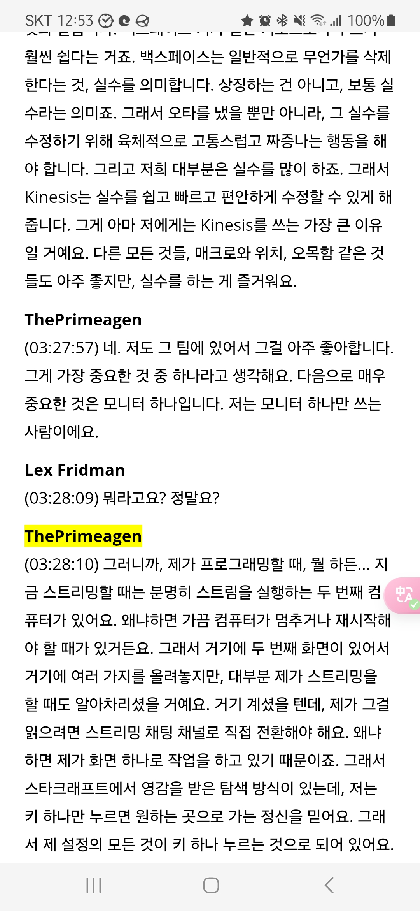

<!-- gid:20250326T125758 -->
[[TIP("이 노트에 대하여")]]
에디터 선택, 단일 모니터, 반복 축소, AI 도구 활용처럼 사소해 보이는 문제를 작업 철학의 수준까지 끌어올린다. 개발자의 집중과 속도를 어떻게 지킬 것인가가 핵심 화두다.
[[/TIP]]

<!-- provenance:source:start -->
[[TIP("원본·최신본")]]
이 페이지는 한국어 검색과 읽기를 위한 WikiDocs 미러입니다. [원본·최신본은 가든](https://notes.junghanacs.com/bib/20250326T125758/)에 있습니다. 최신 수정 내용·백링크·태그·히스토리·댓글·출처 정보는 원본 가든에서 확인하세요.

- 작성: `2025-03-26T12:57:00+09:00`
- 최근 수정: `2025-03-26T12:57:00+09:00`
[[/TIP]]
<!-- provenance:source:end -->

[TOC]

## BIBLIOGRAPHY

- 마이클 폴슨. 2025. “ThePrimeagen - Overview ADHD Neovim.” 2025. [https://github.com/ThePrimeagen](https://github.com/ThePrimeagen).
- Lex Fridman. 2025. “Transcript for ThePrimeagen: Programming, AI, ADHD, Productivity, Addiction, and God.” March 23, 2025. [https://lexfridman.com/theprimeagen-transcript/](https://lexfridman.com/theprimeagen-transcript/).
- <i>Theprimeagen: Programming, Ai, Adhd, Productivity, Addiction, and God</i>. 2025. [https://www.youtube.com/watch?v=tNZnLkRBYA8](https://www.youtube.com/watch?v=tNZnLkRBYA8).

## History

-   [2025-03-26 Wed 12:57] 대략 전문을 보는데 완전 어쏠로그네.

## Related-Notes

-   [렉스프리드먼 Lex Fridman](https://wikidocs.net/382282)
-   [렉스프리드만 팟케스트 ThePrimeagen Emacs vs. NeoVIM (feat. ADHD)](https://wikidocs.net/381620)

## 모니터 한개만 쓰는 사람

-   [집중력: 듀얼 모니터가 필요한가](https://wikidocs.net/381038)

저는 모니터를 하나만 쓰는 사람 입니다.

## ThePrimeagen - Overview

(마이클 폴슨 2025)

-   

-   마이클 폴슨
-   ThePrimeagen has 226 repositories available. Follow their code on GitHub.
-   2025

## [렉스프리드먼 Lex Fridman](https://wikidocs.net/382282) 팟케스트

### ThePrimeagen: Programming, AI, ADHD, Productivity, Addiction, and God | Lex Fridman Podcast #461

(<i>Theprimeagen: Programming, Ai, Adhd, Productivity, Addiction, and God</i> 2025)

-   {{ThePrimeagen}}
-   

-   

-   2025

### Transcript for ThePrimeagen: Programming, AI, ADHD, Productivity, Addiction, and God | Lex Fridman Podcast #461

(Lex Fridman 2025)

-   Transcript for {{ThePrimeagen}}
-   Lex Fridman
-   This is a transcript of Lex Fridman Podcast \\#461 with ThePrimeagen. The timestamps in the transcript are clickable links that take you directly to that point in the main video. Please note that the transcript is human generated, and may have errors. Here are some useful links: Go back to this episode’s main page Watch the full YouTube version of the podcast Table of Contents Here are the loose “chapters” in the conversation. Click link to jump approximately to that part in the transcript: 0:00 – Introduction 0:42 – Love for programming 10:15 – Hardest part of programming 12:31 –
-   2025
