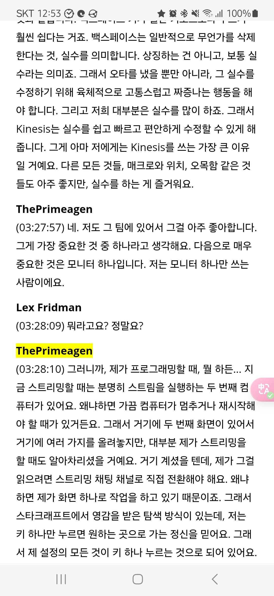

<!-- gid:20250326T125758 -->
[[TIP("이 노트에 대하여")]]
Lex Fridman에 함께 출연한 두 프로그래머 — ThePrimeagen(#461)과 DHH(#501) — 를 한 자리에 묶는다. 둘 다 Neovim 유저이고 AI 프로그래밍 생산성에 강한 입장이지만, 축이 다르다. ThePrimeagen은 에디터 선택·단일 모니터·반복 축소·집중(ADHD)처럼 "개발자의 속도와 집중"을, DHH는 수공예에서 에이전트 전향·가변 OS(Omarchy)로의 "헤게모니 이동"을 이야기한다. 사소해 보이는 도구 문제를 작업 철학으로 끌어올리는 법이 이 노트의 화두다.
[[/TIP]]

<!-- provenance:source:start -->
[[TIP("원본·최신본")]]
이 페이지는 한국어 검색과 읽기를 위한 WikiDocs 미러입니다. [원본·최신본은 가든](https://notes.junghanacs.com/bib/20250326T125758/)에 있습니다. 최신 수정 내용·백링크·태그·히스토리·댓글·출처 정보는 원본 가든에서 확인하세요.

- 작성: `2025-03-26T12:57:00+09:00`
- 최근 수정: `2026-08-27T15:48:00+09:00`
[[/TIP]]
<!-- provenance:source:end -->

[TOC]

## 히스토리

-   [2026-08-27 Thu 15:38] @mitsein/deepseek-v4-pro — DHH(Lex #501) 서지 2건을 묶어 인용(둘 다 Lex 출연·Neovim 유저).
-   [2025-03-26 Wed 12:57] 대략 전문을 보는데 완전 어쏠로그네.

## 관련메타

## BIBLIOGRAPHY

- 마이클 폴슨. 2025. “ThePrimeagen - Overview ADHD Neovim.” 2025. [https://github.com/ThePrimeagen](https://github.com/ThePrimeagen).
- <i>DHH: Future of Programming, AI, Agentic Engineering, Vibe Coding &#38; Linux</i>. 2026. [https://youtu.be/NYFGCESmikA](https://youtu.be/NYFGCESmikA).
- Fridman, Lex. 2026. “Transcript for DHH: Future of Programming, AI, Agentic Engineering, Vibe Coding &#38; Linux.” August 26, 2026. [https://lexfridman.com/dhh-2-transcript/](https://lexfridman.com/dhh-2-transcript/).
- Lex Fridman. 2025. “Transcript for ThePrimeagen: Programming, AI, ADHD, Productivity, Addiction, and God.” March 23, 2025. [https://lexfridman.com/theprimeagen-transcript/](https://lexfridman.com/theprimeagen-transcript/).
- <i>Theprimeagen: Programming, Ai, Adhd, Productivity, Addiction, and God</i>. 2025. [https://www.youtube.com/watch?v=tNZnLkRBYA8](https://www.youtube.com/watch?v=tNZnLkRBYA8).

## 관련노트

-   [렉스프리드먼 Lex Fridman](https://notes.junghanacs.com/bib/20250219T103203/)
-   [힣: 렉스프리드만 팟캐스트 ThePrimeagen Emacs vs. NeoVIM (feat. ADHD)](https://notes.junghanacs.com/notes/20250326T135916/)

## [렉스프리드먼 Lex Fridman](https://notes.junghanacs.com/bib/20250219T103203/) 팟캐스트

## 모니터 한개만 쓰는 사람

-   [집중력: 듀얼 모니터가 필요한가](https://notes.junghanacs.com/notes/20221022T074800/)

저는 모니터를 하나만 쓰는 사람 입니다.

## ThePrimeagen - Overview

(마이클 폴슨 2025)

-   마이클 폴슨
-   ThePrimeagen has 226 repositories available. Follow their code on GitHub.
-   2025

### Transcript for ThePrimeagen: Programming, AI, ADHD, Productivity, Addiction, and God | Lex Fridman Podcast #461

(Lex Fridman 2025)

-   Transcript for ThePrimeagen
-   Lex Fridman
-   This is a transcript of Lex Fridman Podcast \\#461 with ThePrimeagen. The timestamps in the transcript are clickable links that take you directly to that point in the main video. Please note that the transcript is human generated, and may have errors. Here are some useful links: Go back to this episode's main page Watch the full YouTube version of the podcast Table of Contents Here are the loose "chapters" in the conversation. Click link to jump approximately to that part in the transcript: 0:00 – Introduction 0:42 – Love for programming 10:15 – Hardest part of programming 12:31 –
-   2025

### ThePrimeagen: Programming, AI, ADHD, Productivity, Addiction, and God | Lex Fridman Podcast #461

(<i>Theprimeagen: Programming, Ai, Adhd, Productivity, Addiction, and God</i> 2025)

-   ThePrimeagen
-   2025

### Transcript for DHH: Future of Programming, AI, Agentic Engineering, Vibe Coding &amp; Linux | Lex Fridman Podcast #501

(Fridman 2026)

-   Transcript for DHH
-   Lex Fridman
-   This is a transcript of Lex Fridman Podcast \\#501 with DHH.
-   2026

### DHH: Future of Programming, AI, Agentic Engineering, Vibe Coding &amp; Linux | Lex Fridman Podcast #501

(<i>DHH: Future of Programming, AI, Agentic Engineering, Vibe Coding &#38; Linux</i> 2026)

-   DHH
-   2026

## ThePrimeagen ↔ DHH — 왜 함께 묶나

-   둘 다 Lex Fridman 팟캐스트 출연 (ThePrimeagen #461, DHH #501)
-   둘 다 Neovim 유저 — 강도는 다르다: ThePrimeagen은 Neovim의 얼굴, DHH는 TextMate 20년 → Linux 이주 후 Neovim을 프로젝트 브라우저·lazygit 용도로만
-   둘 다 "에디터·AI 생산성"에 강한 입장 — 축이 다르다: ThePrimeagen은 속도·집중(ADHD), DHH는 에이전트 전향·가변 OS(Omarchy)
