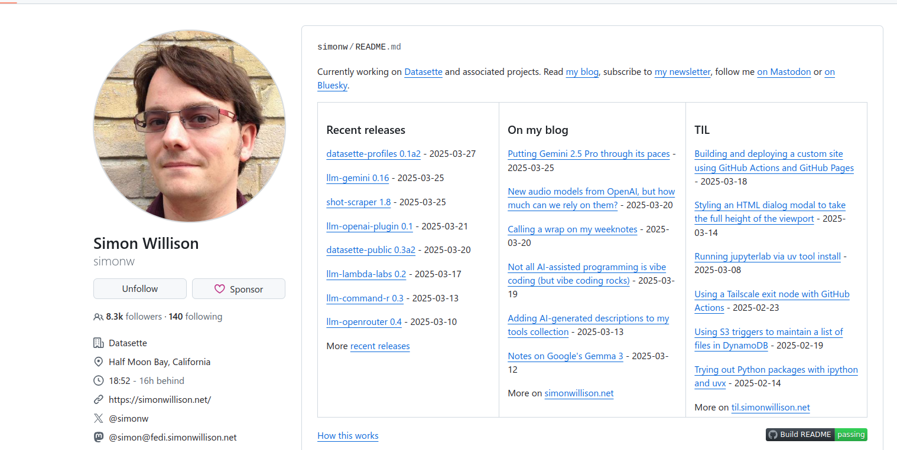

<!-- gid:20250327T071914 -->
[[TIP("이 노트에 대하여")]]
새 모델 발표를 따라가기만 하지 않고 직접 써보고 코드와 글로 남기는 태도가 윌리슨의 강점이다. 데이터 출판, 로컬 우선 도구, LLM 활용법이 한 흐름으로 이어진다.
[[/TIP]]

<!-- provenance:source:start -->
[[TIP("원본·최신본")]]
이 페이지는 한국어 검색과 읽기를 위한 WikiDocs 미러입니다. [원본·최신본은 가든](https://notes.junghanacs.com/bib/20250327T071914/)에 있습니다. 최신 수정 내용·백링크·태그·히스토리·댓글·출처 정보는 원본 가든에서 확인하세요.

- 작성: `2025-03-27T07:19:00+09:00`
- 최근 수정: `2025-03-27T00:00:00+09:00`
[[/TIP]]
<!-- provenance:source:end -->

[TOC]

## BIBLIOGRAPHY

- darjeeling. 2025. “Llm을 활용한 코드 작성시 유의할 14가지.” March 12, 2025. [https://news.hada.io/topic?id=19705](https://news.hada.io/topic?id=19705).
- Simon Willison. 2025. “Simon Willison’s Newsletter.” March 26, 2025. [https://simonw.substack.com/](https://simonw.substack.com/).
- ———. n.d.-a. “Here’s How I Use LLMs to Help Me Write Code - Darjeeling.” Accessed March 26, 2025. [https://simonwillison.net/2025/Mar/11/using-llms-for-code/](https://simonwillison.net/2025/Mar/11/using-llms-for-code/).
- ———. n.d.-b. “Llm: A Cli Utility and Python Library for Interacting with Large Language Models.” Accessed March 26, 2025. [https://llm.datasette.io/en/stable/index.html](https://llm.datasette.io/en/stable/index.html).
- “Simonw/Llm.” 2025. [https://github.com/simonw/llm](https://github.com/simonw/llm).
- Willison, Simon. n.d.-a. “GitHub Issues for Notes 깃허브 활용한 노트 관리.” Accessed June 2, 2025. [https://simonwillison.net/2025/May/26/notes/](https://simonwillison.net/2025/May/26/notes/).
- ———. n.d.-b. “Llm, Ttok and Strip-Tags—CLI Tools for Working with ChatGPT and Other LLMs.” Accessed March 27, 2025. [https://simonwillison.net/2023/May/18/cli-tools-for-llms/](https://simonwillison.net/2023/May/18/cli-tools-for-llms/).
- xguru. 2025. “Simon Willison의 O3-Mini에 대한 노트.” February 2, 2025. [https://news.hada.io/topic?id=19018](https://news.hada.io/topic?id=19018).

## 관련메타

-   [대형언어모델](https://wikidocs.net/380813)
-   [인공지능](https://wikidocs.net/380588)

## History

-   [2025-06-04 Wed 19:41] 좋은 글들이 많아.
-   [2025-03-27 Thu 07:19]

## Simon Willison’s Newsletter | Substack

(Simon Willison 2025)

-   Simon Willison
-   AI, LLMs, web engineering, open source, data science, Datasette, SQLite, Python and more. Click to read Simon Willison’s Newsletter, a Substack publication with tens of thousands of subscribers.
-   2025

## 아티글

### LLM 을 활용한 코드 작성시 유의할 14가지

(darjeeling 2025)

-   darjeeling
-   1. 합리적인 기대치 설정 (Set reasonable expectations)주요 내용:LLM 은 본질적으로 고급 자동완성 도구임을 인지해야 하며, 전적으로 의존할 경우 오류나 부정확한 결과가 발생할 수 있음.활용법:자신의 코딩 능력을 보완하는 보조 도구로 활용하며, 과도한 기대를 버리고 실수를 검증하는 태도가 필요함.2. 학습 데이터의 종료 시점을 고려

#### Here’s how I use LLMs to help me write code - darjeeling

(Simon Willison n.d.-a)

-   Willison, Simon
-   Online discussions about using Large Language Models to help write code inevitably produce comments from developers who’s experiences have been disappointing. They often ask what they’re doing wrong—how come some …

### GitHub issues for notes 깃허브 활용한 노트 관리

(Willison n.d.-a) Willison, Simon

GitHub issues is **almost** the best notebook in the world. Free and unlimited, for both public and private notes. Comprehensive Markdown support, including syntax highlighting for almost any language. Plus …

### Simon Willison 의 o3-mini 에 대한 노트

(xguru 2025)

-   

-   xguru
-   OpenAI 의 o3-mini 모델이 새로 공개되었고, 다른 o 시리즈 모델과 마찬가지로 평가하기가 약간 어려움이제 기존 GPT-4o, o1, o1 Pro 등에 이어 사용 목적에 따라 어떤 모델을 선택할지 결정해야 하는 상황o3-mini System Card (PDF)에 따르면 일부 평가 지표에서 o3-mini 가 GPT-4o, o1보다 우수하지만, 모든 항목
-   2025

### LLM: A CLI utility and Python library for interacting with Large Language Models

(Simon Willison n.d.-b)

-   

-   Simon Willison
-   

-   

### llm, ttok and strip-tags—CLI tools for working with ChatGPT and other LLMs

(Willison n.d.-b)

-   

-   Willison, Simon
-   I’ve been building out a small suite of command-line tools for working with ChatGPT, GPT-4 and potentially other language models in the future. The three tools I’ve built so far …
-   

## 리포

[2025-03-27 Thu 10:53]

훌륭하다.



### simonw/llm

(“Simonw/Llm” 2025)

-   Simon Willison
-   Access large language models from the command-line
-   2025

#### LLM 프로젝트 개요

LLM은 Simon Willison이 개발한 커맨드라인 도구이자 Python 라이브러리로, 다양한 대형 언어 모델과 상호작용할 수 있게 해줍니다.

##### 주요 특징

-   **이중 인터페이스**: CLI(커맨드라인) + Python API
-   **다중 모델 지원**: OpenAI GPT, Anthropic Claude, Google Gemini, Meta Llama 등
-   **로컬 모델 지원**: Ollama 플러그인을 통한 로컬 LLM 실행
-   **SQLite 로깅**: 모든 프롬프트와 응답을 SQLite DB에 자동 저장
-   **임베딩 생성**: 텍스트 임베딩 생성 및 저장 기능
-   **멀티모달 지원**: 이미지, 오디오, 비디오 처리
-   **플러그인 시스템**: 확장 가능한 아키텍처

##### 설치 방법

```bash
# pipx를 이용한 설치 (권장)
pipx install llm

# Homebrew
brew install llm

# pip
pip install llm
```

##### 기본 사용법

```bash
# 간단한 프롬프트 실행
llm "Explain how transformers work"

# 특정 모델 지정
llm -m claude-3-5-sonnet "질문"
llm -m gpt-4o "질문"

# 대화형 세션
llm chat -m claude-3-5-sonnet

# 로컬 모델 사용 (Ollama)
llm install llm-ollama
llm -m llama3.2 "질문"
```

##### Python API 사용

```python
import llm

# 모델 가져오기
model = llm.get_model("gpt-4o-mini")
response = model.prompt("Your prompt here")
print(response.text())

# 대화 세션
conversation = model.conversation()
conversation.prompt("첫 번째 질문")
conversation.prompt("후속 질문")

# 비동기 지원
async_model = llm.get_async_model("claude-3-5-sonnet")

# 임베딩 생성
embedding = model.embed("텍스트 내용")
```

##### 활용 사례

1.  **로컬 LLM 통합**: Ollama와 연동하여 로컬 GPU에서 모델 실행
2.  **배치 처리**: 대량의 텍스트 데이터 자동 처리
3.  **RAG 시스템**: 임베딩 생성 및 시맨틱 검색
4.  **워크플로우 자동화**: n8n 등의 도구와 Python API 통합
5.  **비용 최적화**: 로컬 모델과 API 모델을 상황에 따라 선택적 사용

##### 플러그인 개발

```python
import llm
from llm import hookimpl

@hookimpl
def register_models(register):
    register(CustomModel())

class CustomModel(llm.Model):
    def execute(self, prompt, **kwargs):
        # 커스텀 로직 구현
        return response
```

##### 참고 링크

-   공식 문서: <https://llm.datasette.io>
-   Python API 문서: <https://llm.datasette.io/en/stable/python-api.html>
-   GitHub 저장소: <https://github.com/simonw/llm>
-   플러그인 디렉토리: <https://llm.datasette.io/en/stable/plugins/directory.html>

## 로그

### [|2025-03-27 Thu 07:19|](https://wikidocs.net/380405.md#h-2025-03-27/)

#### @user Simon Willison 에 대해서 알려줘 Datasette 를 만든 사람이며 아래 블로그를 운영하고 있어.

<https://simonwillison.net/>

@assistant Simon Willison 은 Datasette 를 만든 개발자로, 데이터베이스를 웹으로 쉽게 공유할 수 있게 해주는 도구입니다. 그는 또한 블로그 <https://simonwillison.net/%C2%A0%EB%A5%BC> 운영하며, 기술 관련 글과 프로젝트를 공유합니다.

#### @user 그의 대표적인 글들을 소개해줘.

@assistant Simon Willison 의 블로그에서 그의 대표적인 글을 소개하면 다음과 같습니다:

1.  **"What to blog about" (2022년 11월 6일)**: 블로그를 시작할 때 무엇을 작성해야 할지 고민하는 사람들에게 TIL(오늘 배운 것)과 프로젝트 설명을 추천합니다. 이 글은 블로그 작성의 압박을 줄이고, 배우고 만든 것을 공유하는 방법에 대해 이야기합니다[3].

2.  **TIL 시리즈**: Simon Willison 은 2020년 4월부터 TIL 을 시작하여 현재 346개 이상의 글을 작성했습니다. 이 시리즈는 그가 배운 것을 간단하게 공유하는 형식으로, 대부분 10분 이내에 작성되었습니다[3].

3.  **Datasette 와 관련된 글**: 그는 Datasette 와 관련된 다양한 프로젝트와 기술에 대한 글도 많이 작성하고 있습니다. Datasette 는 데이터베이스를 쉽게 웹으로 공유할 수 있게 해주는 도구입니다[4][5].

4.  Citations: [1] <https://en.wikipedia.org/wiki/Simon_Willison> [2] <https://github.com/simonw/simonwillisonblog> [3] <https://simonwillison.net/2022/Nov/6/what-to-blog-about/> [4] <https://github.com/simonw> [5] <https://substack.com/@simonw>

@user
