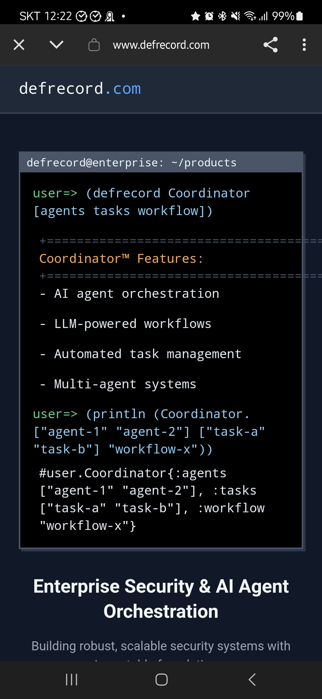

<!-- gid:20250327T134019 -->
[[TIP("이 노트에 대하여")]]
기업용 에이전트 오케스트레이션부터 법률 RAG, 기술서 기반 지식베이스까지 주제가 넓지만 중심에는 literate workflow가 놓여 있다. 프로그래밍 언어와 문서 시스템, AI 도구를 한 몸처럼 다루려는 시도가 보인다.
[[/TIP]]

<!-- provenance:source:start -->
[[TIP("원본·최신본")]]
이 페이지는 한국어 검색과 읽기를 위한 WikiDocs 미러입니다. [원본·최신본은 가든](https://notes.junghanacs.com/bib/20250327T134019/)에 있습니다. 최신 수정 내용·백링크·태그·히스토리·댓글·출처 정보는 원본 가든에서 확인하세요.

- 작성: `2025-03-27T13:40:00+09:00`
- 최근 수정: `2025-03-27T13:40:00+09:00`
[[/TIP]]
<!-- provenance:source:end -->

[TOC]

## BIBLIOGRAPHY

- “Defrecord/Kbol - Knowledge Base from Technical Books.” 2025. [https://github.com/defrecord/kbol](https://github.com/defrecord/kbol).
- “Defrecord/Legal-Rag-Hy.” 2025. [https://github.com/defrecord/legal-rag-hy](https://github.com/defrecord/legal-rag-hy).
- “Defrecord/Llm-Lab.” 2025. [https://github.com/defrecord/llm-lab](https://github.com/defrecord/llm-lab).
- Jason Walsh. n.d. “Defrecord Repositories.” Accessed March 26, 2025. [https://github.com/orgs/defrecord/repositories](https://github.com/orgs/defrecord/repositories).
- Jason Walsh, and Aidan Pace. n.d. “Defrecord.Com - Enterprise Security &#38; Ai Agent Orchestration.” Accessed March 26, 2025. [https://www.defrecord.com/](https://www.defrecord.com/).
- Jay Alammar. n.d. “Defrecord/Anthropic-Quickstarts: Computer Use.” Accessed March 27, 2025. [https://github.com/defrecord/anthropic-quickstarts](https://github.com/defrecord/anthropic-quickstarts).

## History

-   [2025-03-27 Thu 13:40] 클로저 하이랭 조직모드 이맥스 인공지능 이 세트를 가지고 뭔가를 한다. 멋지다. 파악하자.

## Related-Notes

-   [알렉스밀러 Alex Miller 클로저 프로그래밍 - 두뇌 퍼즐](https://wikidocs.net/382324)
-   [AidanPace aygp-dr 하이랭 조직모드 인공지능](https://wikidocs.net/382393)
-   [제이슨월시 Jason Walsh 이맥스 조직모드 클로저 하이랭 인공지능 구루](https://wikidocs.net/382338)

## defrecord.com - Enterprise Security AI Agent Orchestration

(Jason Walsh and Aidan Pace n.d.)

-   Jason Walsh

### 스크린샷

-   

### defrecord.com - Enterprise Security AI Agent Orchestration

(Jason Walsh and Aidan Pace n.d.)

-   Jason Walsh
-   조직모드와 연계한 그림을 그리고 있는 이유가 무엇인가?

### defrecord repositories

(Jason Walsh n.d.)

## 링크

### defrecord/kbol - Knowledge Base from Technical Books

(“Defrecord/Kbol - Knowledge Base from Technical Books” 2025)

-   Jason Walsh
-   Knowledge Base from Technical Books
-   2025

### defrecord/llm-lab

(“Defrecord/Llm-Lab” 2025)

-   Jason Walsh
-   LLM Tools Lab: Testing environment for exploring LLM CLI tools (llm (0.21), ttok, strip-tags) with multiple providers (Ollama, Claude, Gemini, Bedrock, and OpenAI).
-   2025

### defrecord/legal-rag-hy

(“Defrecord/Legal-Rag-Hy” 2025)

-   

-   A jurisdiction-aware Retrieval-Augmented Generation system for legal research built with Hy and org-mode literate programming
-   2025

-   architecture

### defrecord/anthropic-quickstarts: Computer Use

(Jay Alammar n.d.)

-   Jay Alammar
-   A collection of projects designed to help developers quickly get started with building deployable applications using the Anthropic API
