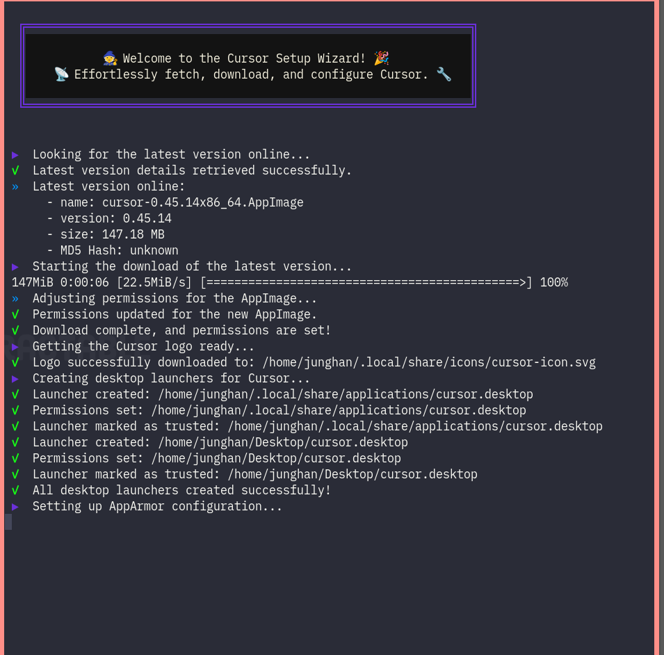

<!-- gid:20250328T174028 -->
[[TIP("이 노트에 대하여")]]
이들 도구는 단순 자동완성을 넘어 파일 읽기, 명령 실행, 컨텍스트 주입을 묶은 작업 환경으로 발전하고 있다. 생산성의 문제와 함께 프롬프트 설계, 코드 검색, diff 적용 같은 내부 구조를 이해하는 것이 중요하다.
[[/TIP]]

<!-- provenance:source:start -->
[[TIP("원본·최신본")]]
이 페이지는 한국어 검색과 읽기를 위한 WikiDocs 미러입니다. [원본·최신본은 가든](https://notes.junghanacs.com/bib/20250328T174028/)에 있습니다. 최신 수정 내용·백링크·태그·히스토리·댓글·출처 정보는 원본 가든에서 확인하세요.

- 작성: `2025-03-28T17:40:00+09:00`
- 최근 수정: `2025-05-28T00:00:00+09:00`
[[/TIP]]
<!-- provenance:source:end -->

[TOC]

## History

-   [2026-01-02 Fri 13:42] 합친다.
-   [2025-05-28 Wed 14:46] 커서만큼 주목 받지 않았지만 다른 방식으로 접근 [깃허브 코파일럿](https://wikidocs.net/382085) 이 녀석은 범용이지 이맥스 관점에서 봐야한다.
-   [2024-10-19 Sat 16:47] Free, ultrafast Copilot alternative 그래 좋아.
-   [2025-05-28 Wed 14:35] 통합개발환경 풍년에서 커서의 위치
-   [2025-03-28 Fri 17:40] junghan0611 깃허브 계정으로 가입함.

## 관련메타

-   [통합개발환경 코딩도구 개발도구](https://wikidocs.net/380799)
-   [VSCODE](https://wikidocs.net/380502)
-   [페어 프로그래밍](https://wikidocs.net/380597)

## BIBLIOGRAPHY

- “Anysphere.” n.d. Accessed May 28, 2025. [https://anysphere.inc/](https://anysphere.inc/).
- “Codeium · Free AI Code Completion &#38; Chat 코디움 Windsurf 윈드서프.” n.d. Accessed November 14, 2024. [https://codeium.com](https://codeium.com).
- “Cursor - the AI Code Editor.” n.d. Accessed March 27, 2025. [https://www.cursor.com/](https://www.cursor.com/).
- darjeeling. 2025. “Openai가 Windsurf를 4조에 인수.” May 6, 2025. [https://news.hada.io/topic?id=20733](https://news.hada.io/topic?id=20733).
- “Exafunction/Codeium.El 코디움 Windsurf.” 2024. [https://github.com/Exafunction/codeium.el](https://github.com/Exafunction/codeium.el).
- “Jorcelinojunior/Cursor-Setup-Wizard: 🧙 Automates the Installation and Updating of the Cursor .Appimage for Linux Users, Resolving Common Issues during Setup and Effortlessly Handling Configurations, Updates, and Related Tasks.” n.d. Accessed March 28, 2025. [https://github.com/jorcelinojunior/cursor-setup-wizard](https://github.com/jorcelinojunior/cursor-setup-wizard).
- Shankar, Shrivu. 2025. “How Cursor (AI IDE) Works.” February 8, 2025. [https://blog.sshh.io/p/how-cursor-ai-ide-works](https://blog.sshh.io/p/how-cursor-ai-ide-works).
- xguru. 2025. “왜 Openai는 Windsurf를 인수하려고 할까?” April 22, 2025. [https://news.hada.io/topic?id=20456](https://news.hada.io/topic?id=20456).

## 관련노트

-   [aider 페어 프로그래밍 코딩도구](https://wikidocs.net/381524)
-   [MatthewZMD 이맥스 고수](https://wikidocs.net/382333)
-   [LanceBergeron lanceberge/elysium 이맥스 엘리시움 지피엘 AI 코딩 플러그인](https://wikidocs.net/381629)

## 관련링크

### Anysphere - 커서 개발사

(“Anysphere” n.d.)

### Cursor - The AI Code Editor

(“Cursor - the AI Code Editor” n.d.)

-   Built to make you extraordinarily productive, Cursor is the best way to code with AI.

### Cursor (AI IDE)는 어떻게 동작하는가 ide 풍년 도구 위치

(“Cursor - the AI Code Editor” n.d.) 누구를 위한 것인가?!

#### How Cursor (AI IDE) Works

(Shankar 2025)

-   Shankar, Shrivu
-   Turning LLMs into coding experts and how to take advantage of them.
-   2025

## 2025 커서에 왜 관심을 가지는가?!

### 커서의 기능이 무엇인가?

<https://www.cursor.com/features>

### 설치 방법

위자드 사용해.

#### jorcelinojunior/cursor-setup-wizard: 🧙 Automates the installation and updating of the Cursor

.AppImage for Linux users, resolving common issues during setup and effortlessly handling configurations, updates, and related tasks. (“Jorcelinojunior/Cursor-Setup-Wizard: 🧙 Automates the Installation and Updating of the Cursor .Appimage for Linux Users, Resolving Common Issues during Setup and Effortlessly Handling Configurations, Updates, and Related Tasks.” n.d.)

## 관련링크

(“Codeium · Free AI Code Completion &#38; Chat 코디움 Windsurf 윈드서프” n.d.) (darjeeling 2025) (xguru 2025)

## codeium: AI Codinmg Autocomplete

[2024-10-18 Fri 11:11] (“Exafunction/Codeium.El 코디움 Windsurf” 2024)

무료이고 별도로 이맥스 패키지가 있다. 근데 말이다. 지피텔로 되지 않겠니? 그럴 것 같은데? 파악해보자. 아무렴 일단 설정은 해두었다. 기본 말이다. 무료니까. 의존성이 없다. 어짜피 VSCODE 의존 할 것도 없으니 말이다.

-   Free, ultrafast Copilot alternative for Emacs

## Related-Notes

-   [코파일럿](https://wikidocs.net/380670)
-   [깃허브](https://wikidocs.net/380497)
