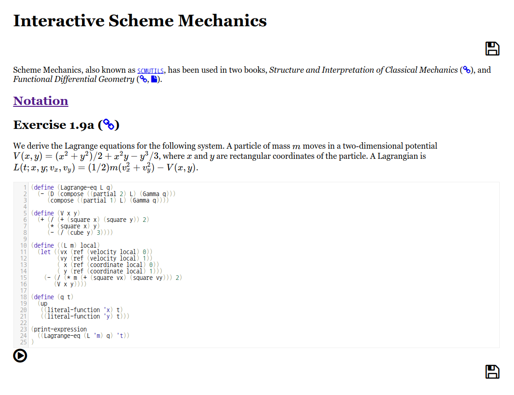

<!-- gid:20250331T070243 -->
[[TIP("이 노트에 대하여")]]
하버드에서 활동하는 프로그래밍언어 연구자로서 코드가 코드를 만들고, 실행 가능한 튜토리얼이 학습 환경이 되는 장면을 탐구한다. 메타프로그래밍을 AI 시대의 프로그래밍 감각과 이어 준다.
[[/TIP]]

<!-- provenance:source:start -->
[[TIP("원본·최신본")]]
이 페이지는 한국어 검색과 읽기를 위한 WikiDocs 미러입니다. [원본·최신본은 가든](https://notes.junghanacs.com/bib/20250331T070243/)에 있습니다. 최신 수정 내용·백링크·태그·히스토리·댓글·출처 정보는 원본 가든에서 확인하세요.

- 작성: `2025-03-31T07:02:00+09:00`
- 최근 수정: `2025-03-31T00:00:00+09:00`
[[/TIP]]
<!-- provenance:source:end -->

[TOC]

## BIBLIOGRAPHY

- Nada Amin. 2025a. “Interactive Scheme Mechanics - Livecode - Sicmutils.” 2025. [https://io.livecode.ch/learn/namin/scheme-mechanics](https://io.livecode.ch/learn/namin/scheme-mechanics).
- ———. 2025b. “Namin (Nada Amin) 메타프로그래밍 인공지능 프로그래밍언어 하버드 교수.” 2025. [https://github.com/namin](https://github.com/namin).
- ———. n.d. “Io.Livecode.Ch - Turning Code Repositories into Interactive Tutorials and Books.” Accessed March 30, 2025. [https://io.livecode.ch/](https://io.livecode.ch/).
- “Namin/Io-Chatgpt.Livecode.Ch.” 2025. [https://github.com/namin/io-chatgpt.livecode.ch](https://github.com/namin/io-chatgpt.livecode.ch).
- “Namin/Io.Livecode.Ch.” 2025. [https://github.com/namin/io.livecode.ch](https://github.com/namin/io.livecode.ch).

## Related Notes

-   [제이슨월시 Jason Walsh 이맥스 조직모드 클로저 하이랭 인공지능 구루](https://wikidocs.net/382338)

## History

-   [2025-03-31 Mon 07:02] 이분 또한 흐름이다.

## [|2025-03-31 Mon 07:02|](https://wikidocs.net/380406.md#h-2025-03-31/)

@user Nada Amin Harvard University 교수에 대해서 소개해줘

@assistant **\*나다 아민** 는 하버드 대학교 SEAS(John A. Paulson 공학 및 응용과학 학교)에서 컴퓨터 과학 부교수로 재직 중입니다. 이전에는 영국 케임브리지 대학교에서 프로그래밍 언어 전임강사로 일했습니다. 그녀는 스위스 로잔 연방공과대학교(EPFL)에서 프로그래밍 언어 분야로 박사 학위를 받았으며, 구글에서 컴파일러 인프라를 지원하는 소프트웨어 엔지니어로도 활동했습니다[1][2].

**연구 관심사** 는 프로그래밍 언어와 인공지능의 결합, 특히 대규모 언어 모델을 활용한 프로그램 및 증명 합성, 정밀 의학 등이 포함됩니다[1]. **교육 경력** 으로는 하버드 대학교에서 프로그래밍 언어 관련 과목을 가르치고 있으며, 케임브리지 대학교에서도 메타프로그래밍 강의를 진행한 바 있습니다[1][3].

**학력** 은 MIT에서 컴퓨터 과학 학사 및 석사 학위를 받았으며, EPFL에서 박사 학위를 취득했습니다[2][3].

-   Citations: [1] <https://cv.namin.org> [2] <https://namin.seas.harvard.edu/about> [3] <https://openreview.net/profile?id=~Nada_Amin1> [4] <https://popl25.sigplan.org/profile/nadaamin> [5] <https://www.thecrimson.com/article/2019/1/12/amin-joins-cs-faculty/>

@user 그녀가 말하는 메타프로그래밍은 무엇인가?

@assistant 나다 아민이 말하는 **메타프로그래밍** 은 프로그램이 자기 자신이나 다른 프로그램을 데이터로 취급하여 프로그램을 작성하거나 수정하는 기술입니다. 이는 런타임에 수행해야 할 작업의 일부를 컴파일 타임에 미리 처리하는 방식으로도 설명될 수 있습니다[1][2]. 메타프로그래밍은 프로그래밍 언어의 반사적 속성을 활용하여 코드의 유연성과 재사용성을 높이는 데 사용됩니다[5].

예를 들어, 자바스크립트에서는 Proxy와 Reflect 객체를 통해 메타프로그래밍을 구현할 수 있으며, 이를 통해 객체의 동작을 동적으로 제어하거나 수정할 수 있습니다[5].

-   Citations: [1] <https://ko.wikipedia.org/wiki/%EB%A9%94%ED%83%80%ED%94%84%EB%A1%9C%EA%B7%B8%EB%9E%98%EB%B0%8D> [2] <https://velog.io/@iberis/13%EC%9E%A5-%EB%A9%94%ED%83%80%ED%94%84%EB%A1%9C%EA%B7%B8%EB%9E%98%EB%B0%8D-%EC%9E%90%EB%B0%94%EC%8A%A4%ED%81%AC%EB%A6%BD%ED%8A%B8-%EC%99%84%EB%B2%BD-%EA%B0%80%EC%9D%B4%EB%93%9C-7%ED%8C%90> [3] <https://velog.io/@husbumps/javascript-the-definitive-guide-7e-chapter-14> [4] <https://junstar92.tistory.com/505> [5] <https://soobing.github.io/javascript/metaprogramming/>

@user

## 관련링크

### io.livecode.ch - turning code repositories into interactive tutorials and books

(Nada Amin n.d.)

-   

-   Nada Amin
-   io.livecode.ch is a prototype for turning code repositories into interactive tutorials and books, with code snippets that can be edited and run on the web. io.livecode.ch는 코드 저장소를 웹에서 편집하고 실행할 수 있는 코드 스니펫을 사용하여 대화형 튜토리얼과 책으로 전환하기 위한 프로토타입입니다. The backend is powered by docker.io and is language-agnostic, but designed for runtimes with small startup costs and memory requirements.
-   

### namin (Nada Amin) 메타프로그래밍 인공지능 프로그래밍언어 하버드 교수

(Nada Amin 2025b)

-   

-   Nada Amin
-   

-   2025

### Interactive Scheme Mechanics - livecode - sicmutils

(Nada Amin 2025a)

-   

-   Nada Amin
    
    이게 뭣인가
    
    

### namin/io-chatgpt.livecode.ch

(“Namin/Io-Chatgpt.Livecode.Ch” 2025)

-   

-   Nada Amin
-   a ChatGPT plugin to interact with io.livecode.ch, which can be used as a template to create custom ChatGPT plugins and GPT actions
-   2025

### namin/io.livecode.ch

(“Namin/Io.Livecode.Ch” 2025)

-   

-   Nada Amin
-   interactive programming tutorials, powered by Github and Docker
-   2025
