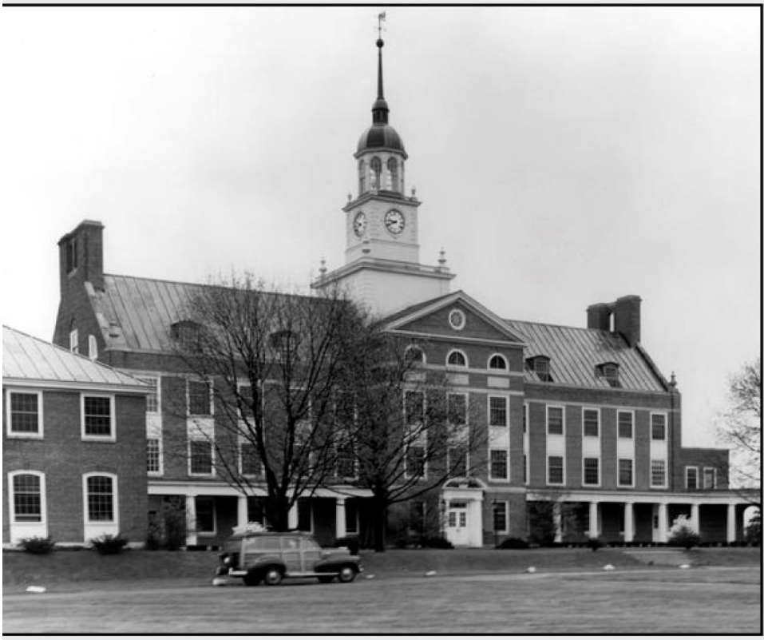

<!-- gid:20250405T075750 -->
[TOC]

[[TIP("이 노트에 대하여")]]
즉각적 효용만을 기준으로 지식을 평가하면 가장 깊은 발견의 가능성을 잃게 된다는 주장을 펼친다. 과학과 교육, 연구의 자유를 왜 지켜야 하는지 간결하지만 강하게 설득한다.
[[/TIP]]

## History

-   [2026-03-18 Wed 16:54] 문득 생각나서, 쓸모 없음에 쓸모에 대해서 얼마나 생각해보았는가? 모른다는 것 뿐 더 안다고 할게 없다. 실제 모르지 않는가!
-   [2025-04-05 Sat 07:57] 이 책 딱 내 입맛이야.

## 관련메타

-   ...

## BIBLIOGRAPHY

  에이브러햄 플렉스너, and 로버르트 데이크흐라프. 2020. <i>쓸모없는 지식의 쓸모 : 세상을 바꾼 과학자들의 순수학문 예찬</i>. Translated by 김아림. 책세상. [https://m.yes24.com/goods/detail/89959176](https://m.yes24.com/goods/detail/89959176).

## Related-Notes

-   [에른스트페터피셔 과학한다는 것 - 과학 철학 - 슈뢰딩거 고양이](https://notes.junghanacs.com/bib/20250405T075918/)

## 쓸모없는 지식의 쓸모 : 세상을 바꾼 과학자들의 순수학문 예찬

(에이브러햄 플렉스너 and 로버르트 데이크흐라프 2020) Usefulness of Useless Knowledge 에이브러햄 플렉스너 and 로버르트 데이크흐라프 김아림 경제적 이해와 무관한 호기심, 상상력의 무한한 가치를 예찬하는 기초학문의 산실, 프린스턴 고등연구소의 철학을 담은 과학 에세이다. 프린스턴 고등연구소 초대소장인 플렉스너의 클래식 에세이와 현 프린스턴 고등연구소 소장이자 끈 이론의 권위자인 로버르트 데이크흐라프의 오마주 에세이로 구성되어 있다. 2020

### 책소개

변화와 혁신을 추동하는 호기심, 자유, 상상력의 힘에 대하여!

아인슈타인, 튜링, 노이만 등 천재 과학자들의 업적을 이끈 프린스턴 고등연구소 초대소장 에이브러햄 플렉스너의 선구적 통찰을 만나다 "실용적 성과만을 추구하는 지금 이 시대에 경종을 울리는 고전 에세이"_에릭 슈미트

『쓸모없는 지식의 쓸모』는 경제적 이해와 무관한 호기심, 상상력의 무한한 가치를 예찬하는 기초학문의 산실, 프린스턴 고등연구소의 철학을 담은 과학 에세이다. 이 책은 프린스턴 고등연구소 초대소장인 플렉스너의 클래식 에세이와 현 프린스턴 고등연구소 소장이자 끈 이론의 권위자인 로버르트 데이크흐라프의 오마주 에세이로 구성되어 있다. 데이크흐라프는 21세기에도 여전히 유효한 플렉스너의 독보적 사유를 환기한다. 프린스턴 고등연구소는 20세기 학문의 중심을 미국으로 만드는 데 혁혁히 공로한 학자들의 유토피아로 플렉스너가 1930년에 설립한 민간 연구소다. 학위도, 연구비를 벌기 위한 프로젝트도 없는 이 연구소는 학자들의 자율적 연구를 보장한다. 연구소에 소속된 학자들은 실용적 결과물을 산출해야 한다는 압박감 없이 오직 호기심과 상상력에 근거한 연구를 수행한다. 상대성이론을 정립한 아인슈타인, 컴퓨터의 이론적 기반을 만든 쿠르트 괴델, 혈구형태학으로 현대 의학에 지대한 영향을 끼친 파울 에를리히 등 20세기 천재 과학자들은 프린스턴 고등연구소에서 자신만의 독자적인 학문을 추구했다. 그 결과 프린스턴 고등연구소의 학자들은 지금 이 세계를 바꿀만한 혁신적인 이론을 만들었다. 『쓸모없는 지식의 쓸모』는 프린스턴 고등연구소만의 철학과 설립 이념을 소개하며, 최근 수십 년 동안 과학 발전이 눈에 띄게 축소하고 있는 현실에서 우리가 나아가야 할 방향을 알려주는 책으로, 구글 회장 에릭 슈미트, 물리학자 카를로 로벨리 등 21세기를 선도하고 있는 주요 인물들에게 커다란 영감을 준 바 있다.

### 내일의 세계\_ 로버르트 데이크흐라프

### 쓸모없는 지식의 쓸모\_ 에이브러햄 플렉스너

### 참고문헌

### 책 속으로

프린스턴 고등연구소는 초대소장이었던 에이브러햄 플렉스너(Abraham Flexner)의 발명품이었다. 이곳은 학생도, 행정 의무도 없는 '학자들의 천국'으로, 학계 스타들이 일상 문제나 실용적인 응용과는 가능한 한 멀리 떨어진 채 깊은 생각에 온전히 집중할 수 있는 장소였다. 또한 '방해나 제약 없이 쓸모없는 지식 추구하기'라는 플렉스너의 상상이 구현된 장소였다. 그 지식이 고작 수십 년 활용될 뿐이라 해도 상관없었다. --- p.11

20세기 이후로 상상력은 여러 분야의 과학자들과 학자들이 성공을 거두는 추동력이었다. 아인슈타인은 다음과 같이 유명한 말을 남겼다. "상상력이 지식보다 중요하다. 지식은 우리가 지금 알고 이해하는 모든 것에 한정되어 있지만, 상상력은 온 세상을 포용하며 그 모든 것은 우리가 앞으로 알고 이해하는 무언가가 될 것이다." --- p.36

상상력이란 언덕 너머 미지의 뒤편까지 보는 힘이다. 그리고 호기심은 언덕 너머에 무엇이 있는지 알고 싶어 올라가려는 인간의 타고난 충동이다. 수백만 년의 진화를 거치는 동안 우리의 두뇌는 그런 위험한 행동을 통해 보상받도록 형성되었다. 최근 신경과학자들은 우리가 미지의 영역으로 모험하도록 자극하는 도파민 활성화 회로의 일부를 발견했다. --- p.47

과학의 대중 참여에는 훨씬 더 중요한 목표가 있다. 그 목표는 정확성과 진실 추구, 비판적 질문, 건전한 회의론, 사실과 불확실성의 존중, 자연과 인간 정신의 풍요로움과 경이로 이루진 과학 문화를 수용하면서 사회 역시 근본적으로 이득을 얻는다는 것이다. --- p.52

"유용한 무언가를 만들 수도 있고 그렇지 않을 수도 있는 호기심이야말로 현대 사상의 가장 눈에 띄는 점일 겁니다. 그건 결코 새롭게 생겨난 특징이 아니지요. 갈릴레오와 베이컨, 뉴턴 경의 시기에도 존재했습니다. 호기심은 그 무엇에도 절대로 방해받지 않아야 합니다. 교육기관은 호기심을 기르는 데 이바지해야 하며, 호기심이 지식의 직접적인 실용성과 적용의 고려로 왜곡되는 일을 줄여야만 합니다. 이 과정은 인류의 복지에 기여할 뿐 아니라 인류에게 동등하게 중요한 지적인 흥미를 만족시키는 일에 도움을 줍니다. 이것은 현대인의 지적 생활을 지배하는 열정이라 할 수 있습니다." --- pp.65~66

나는 실험실에서 일어나는 모든 사건이 결국 예상치 못한 실용적인 쓸모로 바뀔 것이라거나 마침내 생겨난 실용적인 쓸모야말로 사실상 정당하다고 주장하는 것이 아니다. 그보다는 '쓸모'라는 단어를 폐기하고, 인간 정신이 자유를 누리게 하자고 간청하는 것이다. 그러면 분명 누구에게도 피해를 주지 않는 괴짜들이 자유로워질 것이다. 물론 귀중한 돈을 조금 낭비할 것이다. 하지만 그보다 훨씬 중요한 것은 우리가 사람들 마음속의 족쇄를 부수고 자유롭게 할 수 있다는 사실이다. --- pp.79~80

인류의 진정한 적은 용감하고 책임 없는 사상가가 아니다. 인류의 진짜 적은 인간의 정신이 날개를 펼치지 못하도록 틀에 가둬 주조하는 사람이다. --- p.86 접어보기

### 출판사 리뷰

오직 자유로운 연구만을 수행하는 학자들의 유토피아 프린스턴 고등연구소의 철학과 근본 이념에 관한 두 편의 에세이 프린스턴 고등연구소에 소속된 학자들은 기초학문을 연구하며 양자 역학, 상대성이론, 컴퓨터, 핵무기 등 21세기를 뒤흔든 학문적 성취를 이루었다. 그들이 인류 지성사에 남을 업적을 성취할 수 있었던 것은 호기심과 상상력을 따라 기초학문 연구에 매진할 수 있는 정신적 자유를 보장받았기 때문이다. 그들은 어떤 쓸모나 효용을 고려하지 않고 지적 충동에 따라 움직였다. 역설적이게도 유용성을 전혀 고려하지 않은 그들의 연구는 세상을 전복시킬 만한 폭발적 파급력을 가진 것이었다. 예컨대 마이크로프로세서, 레이저, 나노기술에 전적으로 의존하는 오늘날, 미국 국민총생산의 30퍼센트는 양자 역학에 의해 탄생한 발명에 기초한다. 앞으로 첨단기술 산업이 급속히 발전하고, 양자 컴퓨터의 등장이 예측되는 상황에서 그 비율은 더욱 증가할 것이다. 프린스턴 고등연구소 젊은 학자의 호기심에 근거한 학문적 성취가 현대 경제의 주축으로 자리한 것이다. 학자의 지적 호기심을 존중하는 프린스턴 고등연구소의 학문적 풍토는 전 세계에서 가장 뛰어난 학자들을 이끌었다. 지적 도전에 이끌린 젊은 학자들은 프린스턴 고등연구소에서 완전히 새로운 사고방식으로 기술을 활용하도록 훈련받았다. 뛰어난 학자들의 선구적인 연구는 예측할 수 없는 간접적인 방식으로 새로운 도구나 기술을 발전시켰다. 그 기술이 사회로 옮겨지고 변형되어 부수적 결과물을 생산했고, 이는 21세기의 모습을 만드는 토대가 되었다.

왜 기초학문을 연구해야 하는가?

우리가 지향해야 할 학문적 태도와 가치는 무엇인가? 80여 년을 사이에 둔 위대한 과학자들의 지적 대화!

현 프린스턴 고등연구소의 소장 데이크흐라프는 1930년에 플렉스너가 역설한 '무용한 지식의 유용성'이 21세기에 여전히 시의적절한 이유를 설명한다. '무용한 지식의 유용성'이 지식 생태계 전반에 폭넓게 적용되어야 하는 이유는 기초학문 연구가 그 자체로 지식을 발전시키기 때문이다. 지식은 사용할수록 늘어나는 유일한 자원인데, 지식의 토대가 충분히 연구되었을 때 지식의 무한한 확장이 가능하다.

과학의 역사에서 궁극적으로 인류에게 유익하다고 판명된 위대한 발견들은 대부분 유용성이 아닌 단지 호기심을 충족하려는 욕망에서 비롯되었다. 그러나 과학자들이 자기들만의 상아탑에 갇혀 대중을 배척하는 것은 과학의 위기로 이어질 수 있다. 현재 기초 과학은 대중이 그것이 지지할 가치가 있다는 사실을 설득하고 확신시키기 위해 힘겹게 싸워야 하는 상황에 직면해 있다. 과학의 대중화는 과학의 눈을 통해 세상을 보는 일의 가치를 대중이 이해해야만 실현될 수 있다. 《쓸모없는 지식의 쓸모》의 두 저자는 지금 현장에서 일하고 있는 과학자들만큼 과학의 가치를 전달하기에 적합한 사람은 없다고 강조한다.

공유되는 지식은 미래의 기술과 혁신, 경제 성장이 이루어질 비옥한 땅이다. 과학의 대중 참여에는 훨씬 더 중요한 목표가 있다. 그 목표는 비판적으로 질문하고, 건전하게 회의하며, 진리를 추구하고, 사실과 불확실성을 존중하며, 자연과 인간 정신의 풍요로움과 경이로 이루진 과학 문화를 수용할 때 사회 역시 근본적으로 이득을 얻는다는 것이다. 이들의 대화를 이어나갈 또 다른 위대한 과학자들이 이 책을 읽어주길 소망한다.

### 저 : 로버르트 데이크흐라프 (Robbert Dijkgraaf)

현 프린스턴 고등연구소 소장. 끈 이론과 과학 교육 발전에 크게 기여한 수리 물리학자이다. 네덜란드 왕립 예술과학아카데미 의장을 지냈고, 현재 아카데미 간 협력단체(InterAcademy Partnership) 의장을 맡고 있다. 저명한 공공정책 전문가이자 과학과 예술의 옹호자이다.

### 역 : 김아림

서울대학교 생물교육과를 졸업했고, 동대학원 과학사 및 과학철학 협동 과정에서 석사 학위를 받았습니다. 대학원에서는 생물철학과 영미철학을 공부했습니다. 인문사회, 과학 등 다양한 분야에 관심이 있으며, 출판사 편집부에서 근무한 경험이 있습니다. 현재 번역 에이전시 엔터스 코리아에서 출판 기획 및 전문 번역가로 활동 중입니다.

### 추천평

-   에릭 슈미트 (Eric Schmidt, 구글 회장) "플렉스너와 데이크흐라프는 호기심, 자유, 상상력이 추동하는 순수학문이 사회를 변혁하고, 전 세계적 문제에 해법을 제공하는 혁명적인 기술의 필수적인 씨앗이라고 주장한다. 단기적인 성과를 추구하는 지금 이 시대에 경제적, 실용적 성취에서 벗어난 순수한 사유의 중요성을 호소하는 그들의 이야기는 단연 시의적절하다."

-   카를로 로벨리 (Carlo Rovelli, 물리학자) "이 책은 21세기에도 여전히 의미 있는 고전 과학 에세이다. 데이크흐라프의 에세이는 플렉스너의 에세이를 역사적인 맥락 속에 매끄럽게 연결하는 멋진 글로, 독보적인 관점에서 20세기의 가치를 평가하고, 21세기의 맥락에서 20세기의 가치를 환기한다."

### 프린스턴 고등연구소

## 저 : 에이브러햄 플렉스너 (Abraham Flexner)

1866년 미국 켄터키주 루이빌에서 9남매 중 한 명으로 태어났다. 부모님은 체코의 서부 지역인 보헤미아에서 온 유대인 이민자였다. 하버드 대학교, 존스홉킨스 대학교 등에서 수학했다. 과학과 인문학 분야의 기초 연구를 선도하는 세계적 연구기관으로 알베르트 아인슈타인(Albert Einstein), 쿠르트 괴델(Kurt Godel), 앨런 튜링(Alan Turing) 등 세기의 지성인들에게 학문적 보금자리를 제공한 프린스턴 고등연구소를 설립, 1930~1939년 초대소장으로 재직했다. 미국의 의학 및 고등교육 개혁에 앞장섰고, 지식의 진보와 교육기관의 학문적 원칙 및 이상을 확립하는 데 지대한 영향을 미쳤다.

한영

Born in Louisville, Kentucky, in 1866, one of nine children. His parents were Jewish immigrants from Bohemia, a western region of the Czech Republic. Educated at Harvard University and Johns Hopkins University. Founded Princeton Institute for Advanced Study, a world leader in basic research in the sciences and humanities, and served as its first director from 1930 to 1939, providing an academic home for some of the century's greatest minds, including Albert Einstein, Kurt Godel, and Alan Turing. Spearheaded reforms in American medicine and higher education, and was influential in advancing knowledge and establishing academic principles and ideals for educational institutions.

영한

1866년 켄터키주 루이빌에서 아홉 자녀 중 한 명으로 태어났으며, 부모는 체코 서부 보헤미아 출신 유대인 이민자였습니다. 하버드 대학교와 존스홉킨스 대학교에서 교육을 받았습니다. 과학 및 인문학 기초 연구 분야의 세계적 리더인 프린스턴 고등 연구소를 설립하고 1930년부터 1939년까지 초대 소장으로 재직하면서 알버트 아인슈타인, 커트 고델, 앨런 튜링 등 세기의 위대한 지성을 위한 학문적 터전을 제공했습니다. 미국 의학 및 고등 교육 개혁을 주도하고 지식 발전과 교육 기관의 학술 원칙과 이상 확립에 영향력을 발휘했습니다.
