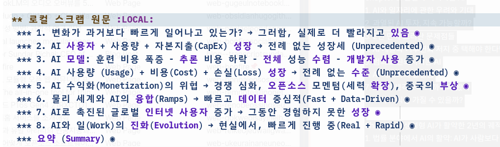

<!-- gid:20250410T114550 -->
[TOC]

[[TIP("이 노트에 대하여")]]
미래 기술과 인공지능 트렌드 보고서를 모아 기술 변화의 속도, 채택 양상, 산업 전환을 장기적으로 가늠하게 해준다.
[[/TIP]]

## BIBLIOGRAPHY

  박영숙, and 벤 고르첼. 2017. <i>인공지능 혁명 2030</i>. Translated by 엄성수. 더블북. [https://www.yes24.com/Product/Goods/42687692](https://www.yes24.com/Product/Goods/42687692).
  xguru. 2025. “Mary Meeker의 Trends Report - ‘Ai’.” June 2, 2025. [https://news.hada.io/topic?id=21241](https://news.hada.io/topic?id=21241).

## History

-   [2025-06-08 Sun 16:47] 합치자 - [2025-04-10 Thu 11:45] 이 분의 유튜브도 하시던데 (박영숙 and 벤 고르첼 2017) 이 책도 이 분의 작품 - [벤고르첼 Hyperon AGI Metta 인공지능 전문가](https://wikidocs.net/382194)
-   [모음 도서: 페어프로그래밍 코파일럿 깃허브 프롬프트](https://wikidocs.net/382084)
-   [트렌드 보고서](https://wikidocs.net/380728)

## @MaryMeeker 인공지능 트렌드 보고서

(xguru 2025)

[2025-06-08 Sun 17:05]

-   [Mary Meeker의 Trends Report - "AI" | GeekNews - news.hada.io](https://news.hada.io/topic?id=21241) 한글 요약
-   5년만에 나온 메리 미커의 트렌드 리포트. 이번엔 **AI** 가 중심. 총 340페이지
-   **AI 사용과 확산 속도** 가 인터넷보다 훨씬 빠르며, **기계가 인간을 앞지르는 시점** 이 도래하고 있음
-   **글로벌 인터넷 인프라\*(55억명 사용), 30년 이상 축적된 \*디지털 데이터셋**, **ChatGPT** 를 필두로 한 대형 언어 모델(LLM)의 등장과 사용성/속도 혁신이 이를 이끌고 있음
-   **신생 AI 기업** 들은 혁신, 투자, 제품 출시, 자본 조달 등에서 매우 공격적으로 움직이고 있으며, 기존 빅테크 기업들도 **AI 중심 투자** 와 성장을 가속화하고 있음
-   **중국과 미국의 AI 경쟁** 등 **글로벌 기술 패권 다툼** 이 치열하게 전개되고 있으며, 이 리포트가 기술·재무·사회·물리·지정학적 변화에 대한 논의에 기여하기를 바람

### 문서 Outline

1.  변화가 과거보다 빠르게 일어나고 있는가? → 그러함, 실제로 더 빨라지고 있음
2.  AI 사용자 + 사용량 + 자본지출(CapEx) 성장 = → 전례 없는 성장세 (Unprecedented)
3.  AI 모델 컴퓨트(Compute) 비용은 높아지고, 추론(Inference) 비용은 하락 = → 성능은 수렴(Performance Converging), 개발자 사용(Developer Usage) 증가
4.  AI 사용량 (Usage) + 비용(Cost) + 손실(Loss) 성장 = → 전례 없는 수준 (Unprecedented)
5.  AI 수익화(Monetization)의 위협 = → 경쟁 심화, 오픈소스 모멘텀(세력 확장), 중국의 부상
6.  물리 세계와 AI의 융합(Ramps) = → 빠르고 데이터 중심적(Fast + Data-Driven)
7.  AI로 촉진된 글로벌 인터넷 사용자 증가 = → 그동안 경험하지 못한 성장
8.  AI와 일(Work)의 진화(Evolution) = → 현실에서, 빠르게 진행 중(Real + Rapid)

### Overview

-   "세상이 전례 없이 빠른 속도로 변화하고 있다"는 표현조차 과소평가일 정도로, 변화의 속도와 범위가 급격히 확장되고 있음
-   **기술 혁신** 과 빠른 **채택(adoption)**, 그리고 **글로벌 리더십(leadership) 변화** 가 이 모든 변화의 근간(Underpinnings)을 이룸

-   Google의 창업 미션(1998): '세계의 정보를 체계화하여 모두가 접근하고 쓸 수 있게 한다'
-   Alibaba의 창업 미션(1999): '어디서나 쉽게 비즈니스를 할 수 있도록 한다'
-   Facebook의 창업 미션(2004): '사람들이 더 많이 공유하고, 세상이 더 개방적이고 연결될 수 있게 한다'

-   오늘날에는 **AI(Artificial Intelligence)**, **가속화된 컴퓨팅 파워(Computing Power)**, 그리고 **경계 없는 자본(Borderless Capital)** 이 결합하여 정보 조직, 연결, 접근성을 비약적으로 향상시키며 거대한 변화를 주도함

-   스포츠에서 **선수의 기록** 이 데이터 _입력_ 훈련으로 끊임없이 개선되듯, 기업들도 **방대한 데이터셋** 을 컴퓨터가 학습하며 점점 더 스마트하고 경쟁적으로 변화함
-   **대형 모델(Large Models) 혁신**, **토큰 단가(cost-per-token) 하락**, **오픈소스 확산(Open-Source Proliferation)**, **반도체 성능(Chip Performance) 향상** 등이 기술의 경제성, 파워, 접근성을 모두 극적으로 높임

-   **OpenAI의 ChatGPT** 는 사용자, 사용량, 수익화 지표에서 역사상 가장 빠른 '오버나이트 성공(overnight success)' 사례 (설립 후 9년 만에 달성)
-   AI 활용은 **소비자, 개발자, 기업, 정부** 모두에게서 폭발적으로 증가
-   Internet 1.0 혁명 때는 기술이 미국에서 시작되어 점진적으로 확산됐지만, **ChatGPT** 는 전 세계 동시다발적으로 도입되어 빠르게 성장

-   기존 **플랫폼 대기업(incumbents)** 과 새로운 **도전자(challengers)** 는 에이전틱 인터페이스(agentic interfaces), 엔터프라이즈 코파일럿(enterprise copilots), 실세계 자율 시스템(real-world autonomous systems), 주권 모델(sovereign models) 등 **AI 인프라의 새로운 계층** 을 선점하기 위해 경쟁 중
-   **AI, 컴퓨트 인프라, 글로벌 연결성(global connectivity)** 의 급진적 발전은 일(Work)의 방식, 자본 배치(Capital Deployment), 리더십의 기준 자체를 기업과 국가 전반에 걸쳐 근본적으로 재편

-   동시에 각국의 글로벌 리더십 변화가 진행되고 있으며, 주요 강대국들은 서로의 경쟁력과 비교우위를 적극적으로 견제중
-   세계 각국이 경제, 사회, 영토적 야망(Economic / Societal / Territorial Aspiration)에 따라 다시 가속화되고 있음

-   이제 두 가지 거대한 힘, 즉 **기술(Technological)** 과 **지정학(Geopolitical)** 이 점점 더 깊이 얽혀가고 있음
-   Meta Platforms CTO **Andrew Bosworth** 는 최근 'Possible' 팟캐스트에서 "지금 AI는 마치 **우주 경쟁(Space Race)** 과도 같고, 특히 중국 등 주요 국가들은 매우 높은 역량을 갖췄으며 비밀이 거의 없고 모두가 꾸준히 발전하고 있다"고 언급

-   **AI 리더십(AI Leadership)** 이 곧 **지정학적 리더십(Geopolitical Leadership)** 으로 이어질 수 있음 (그 반대는 성립하지 않음)
-   이 현상은 큰 불확실성(Uncertainty)을 동반하지만, 전 T. Rowe Price 회장 **Brian Rogers** 의 "통계적으로 세상은 그리 자주 끝나지 않는다"는 말처럼, 낙관적 시각이 중요함

-   투자자 입장에서 항상 모든 일이 잘못될 수 있다고 가정하지만, 무엇이 제대로 잘 될 수 있는지에 대한 기대가 진정한 **희망(Optimism)** 의 원천
-   AI가 대신 일을 해주는 모습은 **이메일, 웹 검색의 초기** 마법과도 같으며, **더 빠르고, 더 싸고, 더 나은(Better / Faster / Cheaper)** 효과가 훨씬 더 빠르게 확산
-   물론 위험(Danger)과 불확실성도 크지만, 장기적으로 **강력한 경쟁(Competition)**, 혁신(Innovation), 저렴하고 쉽게 접근 가능한 컴퓨트(Accessible Compute), 빠르게 확산되는 AI 기술, 신중하고 치밀한 리더십(Thoughtful and Calculated Leadership)이 **상호확증억제(Mutually Assured Deterrence)** 와 같이 균형을 만들어낼 것이라는 기대가 있음

-   어떤 이들에게는 AI의 진화가 **바닥치기 경쟁(Race to the Bottom)** 이 될 수 있지만, 또 다른 이들에게는 **정상으로의 경쟁(Race to the Top)** 의 시작
-   **자본주의(Capitalism)** 와 **창조적 파괴(Creative Destruction)** 의 투기적이고 역동적인 힘이 거대한 지각변동을 일으키고 있음
-   특히 **미국(USA)**, **중국(China)**, 그리고 글로벌 테크 리더들의 치열한 경쟁이 이미 **'게임 온(Game On)'** 상태임

-   본 리포트는 다양한 서드파티 데이터, 리서치, 벤치마크를 바탕으로 현재와 같은 **역동적 시기(Dynamic Time)** 의 트렌드를 입체적으로 보여주고자 함
-   궁극적으로 이 논의에 기여하고자 하는 것이 본 리포트의 목표

-   PDF 파일로도 공개되어 있습니다 [https://www.bondcap.com/report/pdf/Trends\\_Artificial\\_Intelligence.pdf](https://www.bondcap.com/report/pdf/Trends_Artificial_Intelligence.pdf)

### 한글 정리본 스크린샷

[2025-06-08 Sun 17:12]

아래와 같이 문서로는 담았으나 깃뉴스 한글 정리한 것임. 링크 남김

-   [Mary Meeker의 Trends Report - "AI" | GeekNews - news.hada.io](https://news.hada.io/topic?id=21241) 한글 요약

## @박영숙 @제롬글렌 세계미래보고서
