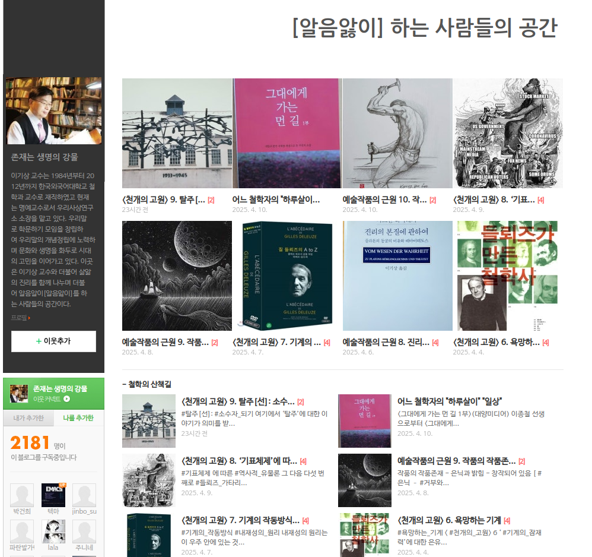

<!-- gid:20250411T061631 -->
[[TIP("이 노트에 대하여")]]
우리말 철학과 하이데거 해석을 길어 올리며, 철학을 번역어가 아니라 삶과 학문의 언어로 다시 세우려는 흐름을 묶는다.
[[/TIP]]

<!-- provenance:source:start -->
[[TIP("원본·최신본")]]
이 페이지는 한국어 검색과 읽기를 위한 WikiDocs 미러입니다. [원본·최신본은 가든](https://notes.junghanacs.com/bib/20250411T061631/)에 있습니다. 최신 수정 내용·백링크·태그·히스토리·댓글·출처 정보는 원본 가든에서 확인하세요.

- 작성: `2025-04-11T06:16:00+09:00`
- 최근 수정: `2026-07-13T10:34:00+09:00`
[[/TIP]]
<!-- provenance:source:end -->

[TOC]

## 히스토리

-   [2026-07-13 Mon 10:14] [제임스조이스 김종건 — 피네간의 경야 율리시스 문학 읽기](https://wikidocs.net/381858)를 담으며 생각한다.
-   [2026-01-31 Sat 14:00] [이맥스 조직모드: 강제 줄바꿈(soft line break), 빈줄 삭제(blank-line)](https://wikidocs.net/381688) 노트 업데이트. 낭독하여 책을 담는 중.
-   [2026-01-25 Sun 10:25] 박찬국 노트와 합체
-   [2026-01-24 Sat 11:25] 신간 추가와 유튜브 강의 링크 연결
-   [2025-05-07 Wed 07:41] [김정선 내 문장이 그렇게 이상한가요? - 우리말 글쓰기 교정](https://wikidocs.net/382423)에서 말하는 -적을 제거해야 한다.
-   [2025-04-11 Fri 13:46] 박찬국 선생님 노트가 없었구나
-   [2025-04-11 Fri 06:16] 앎의 만남

### DONE 18:51 이기상 철학노트 관련 질문

[이기상 박찬국 서양철학 우리말 철학사전 알음앓이 문화 학문 하이데거 다석 생명](https://wikidocs.net/382373)

[[TIP("노트")]]
선생님 저서 철학노트을 도서관에서 빌려서 보고 있습니다. 1장부터 시작하는 철학사와 '영성'에 시대에 대한 이야기까지 담은 이 책을 바라보니 '지식' 교양서가 풍년인 요즈음에 '앎'이 담긴 책이리에 더 귀한 말씀 같습니다. 20년이 지나다 보니 지난 세월의 말씀도 궁금하여 이곳 블로그에 혹시 비슷한 목차로 정리된 글을 볼수 있을까합니다만 어디를 보아야 할지요"
[[/TIP]]

### DONE Screenshot_20250522_070807_Firefox

![[../images/Screenshot_20250522_070807_Firefox.jpg|320]]

## 관련메타

-   [힣: 앎 삶 헤게모니 페러다임 자기혁신 자기진화 메타휴먼 공진화 지식구조](https://wikidocs.net/381383)
-   [1c 생명](https://wikidocs.net/380846)
-   [1d 인간의삶 인생 평생 4](https://wikidocs.net/380847)
-   [1j5 철학 10.5](https://wikidocs.net/380961)
-   [삶의철학 라이프스타일 문화](https://wikidocs.net/380534)

## BIBLIOGRAPHY

- 이기상. 2002. <i>철학노트</i>. [https://www.yes24.com/product/goods/278214](https://www.yes24.com/product/goods/278214).
- ———. 2004. <i>이 땅에서 우리말로 철학하기 - 살림지식총서</i>. 살림. [https://www.yes24.com/product/goods/392605](https://www.yes24.com/product/goods/392605).
- ———. 2006. <i>존재와 시간 - 인간은 죽음을 향한 존재 해설서</i>. 살림출판사. [https://www.yes24.com/product/goods/3058327](https://www.yes24.com/product/goods/3058327).
- 박찬국. 2013. <i>하이데거의 존재와 시간 읽기</i>. [https://www.yes24.com/product/goods/34896834](https://www.yes24.com/product/goods/34896834).
- ———. 2014. <i>초인수업</i>. [https://www.yes24.com/Product/Goods/14864710](https://www.yes24.com/Product/Goods/14864710).
- ———. 2017. <i>삶은 왜 짐이 되었는가 #하이데거</i>. [https://www.yes24.com/product/goods/49855929](https://www.yes24.com/product/goods/49855929).
- ———. 2021. <i>도덕의 계보</i>. [http://www.yes24.com/Product/Goods/102488221](http://www.yes24.com/Product/Goods/102488221).
- 이기상. 2026. <i>인공지능시대와 철학의 쓸모</i>. [https://www.yes24.com/product/goods/175520086](https://www.yes24.com/product/goods/175520086).
- ———. n.d.-a. “우리말로 학문하기 모임과 우리말 철학사전 : 네이버 블로그.” Accessed April 11, 2025. [https://blog.naver.com/saiculture/222268486826](https://blog.naver.com/saiculture/222268486826).
- ———. n.d.-b. “존재와 시간 새 판을 내며 - 있음과 때.” Accessed May 21, 2025. [https://blog.naver.com/saiculture/223866059461](https://blog.naver.com/saiculture/223866059461).
- ———. n.d.-c. “하이데거의 실존과 언어 12. 도구, 손안에 . : 네이버블로그.” Accessed April 10, 2025. [https://blog.naver.com/saiculture/222259344432](https://blog.naver.com/saiculture/222259344432).
- 마르틴 하이데거. 2025. <i>존재와 시간</i>. Translated by 이기상. 까치글방. [https://www.yes24.com/Product/Goods/146124013](https://www.yes24.com/Product/Goods/146124013).
- “이기상 교수님 존재와 시간 1강.” n.d. Accessed January 24, 2026. [https://youtube.com/watch?v=ZkmXKTPmGOw&#38;si=o76jUBdYBIvYozSg](https://youtube.com/watch?v=ZkmXKTPmGOw&si=o76jUBdYBIvYozSg).
- 우리사상연구소, and 이기상. 2007. <i>우리말 철학사전 1 과학 인간 존재</i>. 지식산업사. [https://www.yes24.com/product/goods/210137](https://www.yes24.com/product/goods/210137).

## 관련노트

-   [류영모 함석헌 — 다석 씨알 우리말 철학](https://wikidocs.net/382269)
-   [모음: 세계문학 컬렉션 축역본 진형준](https://wikidocs.net/382375)
-   [정양모 신부 성서학자 예수 공부 다석학회](https://wikidocs.net/382271)
-   [장회익 자연철학 온생명 스승 물리학](https://wikidocs.net/381920)
-   [김종철 장회익 이현주 새들은과외수업을받지않는다 생태학 온생명 녹색평론 자연](https://wikidocs.net/382022)
-   [후설 하이데거 메를로퐁티 현상학](https://wikidocs.net/382379)

## 이기상 (李基相)

가톨릭대학 신학부를 졸업하고 벨기에 루뱅대학교 신학대학원에서 석사과정을 수료했고, 독일 뮌헨 예수회 철학대학에서 철학 석사 학위와 박사 학위를 취득했다. 1984년부터 한국외국어대학교 철학과 교수로 재직 중이다. '우리말로 학문하기 모임'의 초대 회장을 역임했으며, 현재 '우리사상연구소' 소장이다.

1992년 열암학술상을 수상했고, 1994년 한국출판문화상 번역상을 수상했다. 지은 책으로는 『하이데거의 실존과 언어』(1991), 『하이데거의 존재와 현상』(1992), 『철학노트』(2002), 『하이데거의 존재사건학』(2003), 『쉽게 풀어쓴 하이데거의 생애와 사상 그리고 그 영향』(2010), 『콘텐츠와 문화철학』(2009), 『지구촌시대와 문화콘텐츠』(2009) 외 다수가 있고, 옮긴 책으로는 F. W. 폰 헤르만의 『하이데거의 예술철학』(1997), 마르틴 하이데거의 『존재와 시간』(1998)과 『형이상학의 근본개념들』(2001) 외 여러 권이 있다.

## 블로그

### 블로그 대문 알음앓이

### 우리말로 학문하기 모임과 우리말 철학사전 : 네이버 블로그

(이기상 n.d.-a) 이기상

### 하이데거의 실존과 언어 12. 도구, 손안에 .. : 네이버블로그

(이기상 n.d.-c)

## 인공지능시대와 철학의 쓸모

(이기상 2026)

하이데거의 대가 이기상, 인공지능 시대에 철학의 자리를 묻다

인공지능이 인간의 사고와 언어, 창작의 영역까지 확장하는 시대에 철학은 어디에 서 있어야 하는가. 《인공지능 시대와 철학의 쓸모》는 하이데거 철학을 오랫동안 연구해 온 이기상이 기술 설명이나 미래 예측을 넘어, 존재·언어·문화라는 근본 질문을 통해 인공지능 시대에도 여전히 요청되는 철학의 자리를 성찰한 책이다. 이 책은 철학이 무엇을 사유해 왔고 무엇을 놓쳐왔는지를 돌아보며, 기술의 속도에 휩쓸리지 않고 인간이 어떻게 생각하고 어떻게 살아야 하는지를 차분하게 묻는다.

### 1장 인공지능은 철학의 종말을 꿈꾸는가?

#### 꿈속에서도 매달린 '존재' 물음

요즘(2023년) '존재', '있음'을 어떻게 이해할 것인가를 갖고 계속 씨름 중이다. 그래서 그런지 어젯밤은 꿈속에서도 이 문제에 매달려 끙끙거렸다. 서양철학의 시작인 그리스철학에서 '존재'가 어떻게 이해되어 중세, 근대를 거쳐 현대에까지 이르렀는지 철학사를 더듬으며 그 변천의 역사를 떠올려 보았다. '존재'를 명명한 '이름'이 얼마나 중요한지 새삼 깨달았다. 그 말은 '존재'라는 현상, 사태에 대한 철학자의 '이름짓기'가 대단히 결정적이라는 말이다. 파르메니데스, 헤라클레이토스, 플라톤, 아리스토텔레스를 통해 '존재'가 다양하게 논의되며 이론화되었다. 나중에는 그런 '개념'이 있으니까 그런 '현상'이 있다고 주장하며 역으로 '이름'을 갖고 '존재'를 증명하려는 역전된 형태를 보이기까지 한다.

여기에서 대표적인 사례가 소위 '신 존재 증명'이다. 유명한 안셀무스의 존재론적 신 존재증명이 공공연하게 주장되고 인정을 받았다. 근대철학의 아버지라는 데카르트마저 '개념'에서부터 '존재'를 추론해내는 신 존재증명을 활용해서 우리가 사는 현실세계가 꿈의 세계가 아님을 보장해주는 신의 존재를 그렇게 이끌어낸다. 합리적 진리 찾기의 길을 처음으로 밝혔다는 데카르트마저도 '존재(있음)'을 이성과 개념의 차원에서 증명하려고 했으며 그것이 확실한 방법론적 길이라고 확신했다.

그런데 이런 철학적 행태에 찬물을 끼얹은 사람이 있으니 그가 바로 그 유명한 칸트다. 존재는 이성이나 지성, 사유나 생각으로 확인하며 증명해낼 수 있는 차원의 것이 아니라고 딱 잘라 말했다. 간단한 예를 들면 코는 냄새를 맡는데 제 역할을 다한다 그런 코를 보고 소리를 들으라든가 풍경을 보라고 한다면 그런 일을 해낼 수 있겠는가 존재 증명도 마찬가지다. 어떤 것이 실제로 있느냐 없느냐는 우리의 감각이 동원된 감관에서 관장하는 일이다. 그것을 생각이나 사유, 지성이나 이성, 상상력에게 증명해내라고 한다면 시도 자체가 잘못된 것이다. 칸트는 감성이 할 일을 지금까지 지성이나 이성에게 맡겼다는데 '신 존재 증명'의 근본적인 오류가 있다는 것을 밝혀냈다. 이 점을 분명히 하기 위해 이때의 '존재(있음)'은 'Sein'이 아닌 'Dasein'이라는 개념을 사용한다.

칸트 이후 이제 개념, 관념, 이념을 갖고 신 존재를 증명하려는 시도는 사라진다. 이제는 다른 길을 찾아야 했다. 물론 감각적으로 경험할 수 있는 것만을 존재의 울타리 안에 담는다면 존재로는 더 이상 설 자리가 없을 것이다. 예를 들어 숫자도 분명 존재하는 것 아닌가 눈앞에 이 탁자가 있는 것처럼 그렇게 존재하지는 않지만 말이다.

하이데거가 존재의 물음을 다시 제기해야 한다고 말한 그 절박함을 깨달을 수 있겠다. 우리는 그동안 너무 자명하다고 해서 아무 문제 없이 '존재', '존재자'라는 용어와 개념을 사용해 왔는데 그것이 어떻게 보면 가장 큰 문제일 수 있는 것이다. 그래서 하이데거는 존재의 물음을 근본에서부터 다시 제기해야 하며 기존의 모든 통념적인 자명함을 깨부수고 처음부터 다시 시작해야 한다고 주장하는 것이다.

플라톤과 아리스토텔레스 철학의 권위에 의존해 많은 것이 더 이상의 논의가 필요 없는 것으로 간주되며 우리의 강단 철학을 평정했고 그것이 모든 학문의 기초라고 자신 있게 외치며 지금껏 지내왔던 것이다.

이제 근본적으로 다시 문제를 제기한다. 존재란 무엇인가? 있음이란 무엇인가? 자명한 개념을 무조건 믿어서는 안 된다. 사유도 최후의 보루가 아니다 사유의 법칙이라는 논리학도 그 근본을 다시 파헤쳐 보아야 한다. [근거율, 모순율, 동일율, 배중율, 충분한 근거율 등] 말놀이의 법칙도 다시 살펴보아야 한다. 말과 사태와의 관련, 언어와 본질[존재]와의 연관, 낱말과 사물[사태]와의 연관 등등. 언어공동체와 존재이해의 지평 사이에 연관성도 고찰해보아야 한다.

#### 서양과 동아시아에서 일어난 서로 다른 '존재사건'

'존재'와 '있음 증명'이 벌어지고 있는 철학의 역사에서 동서양의 대응이 아주 다르게 전개되었음에 주목해야 한다. 당연히 그 의미에 대한 논의도 그렇고 그 반대급부인 무, 없음, 공에 대한 이해와 해석도 마찬가지다. 서양의 형이상학이 지구촌 모든 문화권의 존재이해의 지평에 대한 검열과 통제권이 주어진 것이 아니라는 것에 주목해야 한다.

여기서 우리는 하이데거의 애재자인 막스 뮐러의 다음과 같은 글에 주목해야 한다고 본다. [막스 뮐러의 글 "오늘날 형이상학이란 무엇인가 형이상학이 자기 이해에 대한 세 가지 고찰" (1985)]

존재, 시간, 세계와 같은 개념 또는 사태는 그 안에 이미 '들어서 있음' 및 그것들과 '친숙해 있음'과 더불어 구별과 거리, 즉 일정한 '물러섬'이 따를 때에만 이해될 수 있다. 이 말은 다른 세계들과 다른 시대들은 그들 나름대로의 독특한 존재의 이해와 더불어 생성되는 것이지, 어떤 필연적인 순서 속에, 계속적이거나 변증법적인 '전개' 속에서 분리되어 있는 것이 아니라는 말이다. 그들의 '출생'은 각기 다른 '운명'에서부터 시작되었고, 그 운명은 그들에게 나름대로의 새로운 자유에서 떠맡을 것을 호소한다.

존재, 시간, 그리고 그것들의 내어줌, 그때그때의 세계 등등은 '존재하는 것'(sind)이 아니고, 하이데거가 말하고 있듯이 '주어지고 있는'(es gibt) 것이다. 이 말은 그것들 안에서 역사적으로 개개의 존재자는 모두 나름대로 다른 존재자이며 그것들 안에서 시간은 나름대로 다른 역사적인 시간으로서 개방되고 있다는 것을, 존재는 우리에게 역사적으로 나름대로 다른 형태로 결단하도록 자신을 내어주고 있다는 것을 뜻한다. 이 잊혀진 주어지고 있다. 비로소 이것 또는 저것으로 하여금 각기 다른 존재의 의미로 존재하게[있게]끔 해 준다.

막스 뮐러는 하이데거가 이렇게 단초를 잡긴 했지만 유럽 이외의 세계들과의 비교를 통해 이것을 상세하게 설명하기까지는 이르지 못했다고 지적한다. 그렇지만 어쨌거나 하이데거는 서양의 존재이해의 커다란 시대들을 구별지어 처음으로 '메타역사학적'인 기술을 시도했다. 이 '내어줌'과 '주어지는 것'이 다시 기억된다 해도, 'Es(그것)'는 아직 사유되어야 할 것으로 남아있다. 이 사유되어야 할 'Es'는 원칙적으로 파악할 수 없는 신비이며, 그것이 바로 그 자신의 파악될 수 없음 속에서 잊혀짐을 벗어나서 '신비'로서 보존되고 존중되어야 한다. 이러한 '테두리' 안에서 비로소 모든 존재자의, 유한한 존재자의 아니 유한한 존재자 그 이상이 나름대로 다르게 '등장'할 수 있다. 즉 사물들이, 인간들이, 신들의 등장, 그리고 그것들 안에서 나름대로의 '시간-공간' 및 나름대로의 다른 '존재 의미'를 통해서 'Es'의 신비가 드러나고 있다. 즉 'Es'는 감추어져 있음 속에서 자신을 드러내 보인다.

이 모든 것이 역사다. 역사 또한 존재자가 아니며 역사 그 자체는 자신의 근거들에서부터는 자신의 참된 존재가 인식될 수 없다. 그것은 대상적인 것이 아니다 그것은 올바른 판단들 속에서 명백하게 파악될 수 없고 연역적으로는 그것의 가능 조건에서 확실하게 파악될 수가 없다. 역사는 '이해된다'고 우리는 말한다. 그것의 방법은 해석학이다. 그 시대, 그 시대의 세계 내부적인 역사가 있고 그것과 더불어 세계 내부적인 해석학이 있다.

해석하기 방법적인 출현과 관련하여 우리는 19세기에서는 슐라이 어마허, 베크, 드로이젠, 딜타이 등을 그리고 20세기에서는 요하킴 바하, 한스 게오르크, 카다모 등을 들 수 있다. 역사 또는 세계 내에서의 역사들 외에도 다양하고 나름대로의 다른 존재의 떠오름과 존재의 짐으로서의 또는 의미 이해인 존재 이해의 출생과 죽음으로서의 역사 자체 아니 차라리 세계들의 여러 역사들이 주어져 있다. 하이데거의 견해는 명백하지 않은 존재의 역사에 대한 그의 미래적인 사유의 자기 이해에서 각기 나름대로의 독특한 존재 이해와 세계 이해를 다른 것과 구별지어 파악해야 하는 그러한 해석학으로 넘어가는 듯이 보인다.

개개의 커다란 시대와 세계의 있음은 모든 것을 의미하며 개개의 다른 여기와 저기를 뜻한다. 끊임없이 번역과 전수의 전의가 필연적이다. 이해는 여기에서 언제나 유비적이다. 그런데 예전의 표현양식을 빌어 낯선 것 속으로의 감정이입에서도 해석과 의미부여에서의 불합치를 결코 제거할 수 없다는 것을 알고 있어야 한다. 여기에서 차이는 항상 동일성에 비해 더 큰 것으로 존립해 있고 유비적인 이해에서도 아직 남아있음. 낯설음이 더 지배적이고 결코 완전히 극복될 수 없다. "유사함이 크면 클수록 또한 그만큼 차이점도 크다" 라고 1215년에 라테란 공의회는 신학적인 형이상학의 표현 방식을 기록하고 있다. 이렇게 자기 자신으로 되던져짐 속에서 비로소 자신의 독특한 동일성은 다른 것과의 경계를 의식하고 이제 비로소 자기 자신으로 이해된다. 이제 비로소 역사적인 자기 이해가 힘을 펴기 시작한다.

각기 다른 문화권에서 역사적으로 펼쳐져 온 '존재 역운'의 '존재사건'에 주목하고 그 문화권의 존재의 신비가 간직하고 있는 있음의 의미를 그에 맞갚게 응답하여 이해하는 밝혀 보임이 지구촌 시대에 사유하는 철학자에게 남겨진 과제일 것이다. 그런 의미에서 21세기 사유하는 철학이 가야 할 길은 어쩔 수 없이 다양한 문화권과 대화하며 펼치는 소통과 공감의 열린 장이다.

#### 21세기 철학의 쓸모는?

인공지능이 우리의 삶 곳곳을 파고들고 있다. 챗봇과 챗GPT의 인기와 관심이 하늘로 지속하고 있다. 지식 백과사전의 자리는 이미 오래전에 인공지능이 차지하더니 이제는 임기응변적, 순발성 생각까지도 인공지능이 맡고 대화와 토론, 상담과 문의 등 모든 사고와 언어의 영역을 AI가 또 맡고 있다. 예술 표현까지도 AI가 기막힌 조합과 합성, 기발 난 디자인으로 예술가들을 놀라게 하고 있다 정말 인간만의 고유한 역할이 사라지고 있는 판국인 듯 싶다. 이제 학문과 예술 어느 영역에서도 표절과 베낌을 구별해내기 어려운 지경에 이르렀다.

철학의 역할에 대한 물음이 제기될 수밖에 없는 상황이다. 그래서 이미 20세기의 하이데거가 철학의 종말을 예언했던 것인가? 그러면서도 하이데거는 사유의 길로써 새로운 철학의 구실을 남겨놓지 않았던가? '계산적 사유(Rechnen)'는 종말을 구하겠지만 '뜻새김의 사유(Besinnen)'가 앞으로 철학이 나아가야 할 길이라고 말하지 않았던가? 아니면 이미 챗봇과 인공지능이 그 역할까지 대신할 수 있는 것은 아닌가?

어쨌거나 21세기 이제 철학 또는 사유의 역할이 무엇인지 물음을 던져보는 것이 꽤 의미가 있을 수밖에 없게 되었다. 종합대학에서 철학이 외면당하고 철학상담이니 철학치료니 하며 별 이상한 이름을 내걸고 자구책을 마련한 지도 꽤 되었다. 그나마도 별 관심을 끌지 못하고 철학은 역사의 뒤안길로 사라져가고 있다.

[[TIP("질문")]]
하루가 다르게 무섭게 변해가는 세상에 살고 있다는 것을 실감하며 사는 매일매일이다. 오늘은 불현듯 내가 매일 글을 정리하며 블로그와 페이스북에 올리며 지식정보 공유를 표방한 것에 대해 의구심이 일어난다. 이젠 간단하게 챗봇에 검색어를 쳐서 물어보면 웬만한 지식정보는 신속하게 즉시 제공받는 시대 아닌가? 물음은 사유의 경건함이라는 말이 무색해진 오늘날이다. 지식, '앎'은 '알음앓이'이며 '앓음알이'라고 내세운 나의 '철학관'도 의미를 잃어버린 듯 싶다. 갑자기 모든 목표를 잃은 듯 싶은 오늘 아침이다. 철학이 무엇일까? 내가 하는 짓거리들은 다 무엇인가?
[[/TIP]]

2023년 어느 날 '씨알재단'에서 기획하고 있는 청소년 씨알교육을 위한 모임에서 가서 강의를 했다. 다석사상에 입각한 청소년 교육 프로그램을 만들어보자는 취지의 만남이었다. 청소년들이 체감하며 동참할 수 있는 시대와 환경에 맞는 획기적인 교육 프로그램을 만들어보자는 뜻깊은 시도이다. 평소 청소년 철학 교육에 관심을 가졌던 나이기에 그동안 내가 알음앓이 해왔던 경험을 공유하며 좋은 기획을 세우는데 도움이 되기 위해 나도 참석했다.

정부 프로그램에 기획서를 올려 지원금을 받아보자는 의도이기에 나는 내심 굉장히 회의적이다. 내 나름 그런 기획들을 많이 짜내어 여러 번 시도해보았지만 한 번도 성공해본 적이 없었기 때문이다. 그럼에도 이번에는 어느 정도 뒷배경이 있다고 하여 얄팍한 희망을 걸어보긴 한다.

그런데 하루가 다르게 무섭게 변해가는 교육환경, 인공지능 발달을 보니 기획서 짜고 실제로 실행단계에 가면 모든 게 다 변해버린 상황이 되는 것이 아닌가 걱정이 된다. 오늘 아침에 갑자기 그런 생각이 들며 내가 하는 모든 일에 큰 회의감이 소용돌이처럼 밀려온다. 철학의 종말뿐만 아니라 인류문명의 종말이 가까워온 것 같은 위기의식이 갑자기 밀려든다. 이런 상황에서 청소년들에게 무엇을 권장해야 할까? 어떤 인생살이를 가르쳐야 할까? 내 자식들이라면 어떤 삶을 살라고 권할까?

내가 인생의 말미에 마지막으로 의미있게 정리해놓고 가려고 생각한 모든 기획들이 갑자기 아무 의미가 없는 것으로 드러난다. 내가 하고 있는 짓거리들도 종당 별 쓸모가 없는 것이라는 생각이 든다. 그러면 이제라도 내가 의미있게 해야 하며 할 수 있는 일이란 것은 무엇일까 결국 나 자신을 돌아보며 내일 사라져도 후회 없을 그런 작은 일이라도 하며 사는 것이 중요한 것 아닐까 평소에 큰일을 한답시고 뒷켠으로 밀쳐두었던 작지만 그래도 소소한 행복감을 주었던 것들을 이제는 더 이상 뒤로 미루지 말고 그런 것들을 하며 하루하루 즐겁고 행복하게 살아가는 것이 중요한 것 아닐까?

그동안 너무 거창하게 인류, 국가, 사회, 대학, 교육 등만을 생각하며 거기서 생겨나오는 문제들 고민하며 풀려고 했던 것이 다 쓸모없는 짓거리처럼 느껴진다.

청소년들에게도 이런 나의 인생체험에 바탕한 교육 프로그램을 마련해야 되는 것 아닌가?

거창하지 않은 소소한 자기만의 인생살이 기획과 실천!!  다석의 '하루살이 삶'을 이런 의미로 풀어나갈 수 있겠다. 

몸살이, 맘살이, 뜻살이, 얼살이 차원의 하루하루 뜻있는 나날들의 삶!! 

이제 지식정보는 거창한 '앓음알이' 없이도 쉽게 인공지능을 통해서 얻을 수 있지 않은가? 거기에는 더 이상 '앓음'이 필요 없지 않는가? 

이제는 정말 '삶의 기술(ars vivendi)'을 나누어주는 것이 중요할 것 같다.

#### NEXT 언어의 본질 : 본질의 언어 - 하이데거와 다석 류영모

-   [2026-01-31 Sat 14:09] 일단 음성으로 넣는 중. 퇴고할 것!

한참을 곱씹으면 그 심오한 뜻이 가슴에 때린다. 언어란 무엇인가? 언어의 본질은 무엇인가? 존재하는 낱낱이 사물들의 본질을 잡아내 그것을 낱말로 옮겨 놓는 것이 아닌가? 그러니 언어의 본질은 곧 본질의 언어가 아니겠는가? 본질을 잡아서 그것을 언어로 표현하는 것이 얼마나 힘든가 그를 위해서 지금 이 시간에도 많은 시인들과 철학자들이 머리를 감싸고 끙끙거리고 있지 않는가

언어의 마술사라는 별명을 가진 하이데거는 평생 그렇게 언어와 씨름했다. 그래서 그가 한 유명한 말이 언어는 존재의 집이며 인간의 거처라는 말이 아닌가. 그래서 하이데거가 자신의 존재를 걸고 신중하게 길어낸 낱말에는 그의 상하는 진지함을 가지고 임해야 한다고 본다 그래서 나도 나름 하이데거의 개념과 시름할 때는 잠을 설치면서 그 뜻과 의미를 찾아내려고 끙끙거린다.

비슷한 시대에 지구 반대편에서 같은 문제로 고민한 사상가가 있었으니 그 사람이 바로 다석 류영모 헌생이다. 다석 역시 일생 우리말과 씨름하며 하늘 땅 아래의 모든 산물과 사태들을 우리말로 제대로 표현하려고 혼심의 힘을 다 쏟아냈다. 다석은 말은 하느님의 마루뜻을 담은 그릇으로 보았다. 신성한 하느님의 말숨으로 여겼다. 다석이 잡아서 길로 담아낸 말씀들은 존재하는 씨알의 말씀으로써 존재의 말을 비로소 낱말애로 세운 말씀들이다. 그래서 존재, 본질, 말, 찾기에 전 존재를 건. 투신에서 하이데거와 다석은 서로 통한다.

#### 로고스와 길

#### 어떤 글쓰기를 해야 하나? : 세계하다, 사물하다

#### 언어에 관한 세기적 대화 : 하이데거와 일본인 교수

#### 서양의 미학과 동아시아의 예술

### 2장 인류가 만든 새로운 존재의 집, 문화

#### 철학, 어디로 갈 것인가?

#### 문화는 우리의 숨통이며 희망이다

#### 21세기의 문화인 - 제 잘난 멋에 사는 사람

#### 철학은 앓는 소리

#### 21세기 철학의 자리는?

#### 하이데거와 데리다 그리고 해체주의

#### 사건 Ereignis - 어떻게 번역할 것인가?

#### Ereignis ⇒ '사건'이냐 '생생한 고유화'이냐!?

#### '존재의 사건'은 존재 주어짐의 사건

### 3장 글로벌 시대의 문화인이란?

#### 글로벌 시대 글로벌 인문교육의 필요성

#### 인간은 문화적인 동물이다

#### 글로벌 시대의 보이지 않는 문화전쟁

#### 문화콘텐츠로 다양한 세계[문화와 문명] 가로지르며 사이 맺기

#### 문화인을 위한 문화콘텐츠

#### 문화생활은 멋들어진 삶, 멋스러운 삶이다

#### 새로운 것의 발견과 이름 붙임

#### 통합적 문화인 함양

### 4장 일상과 과학, 그리고 실존

#### 일상의 중요성

#### 현존재 분석론[철학]의 출발점으로서의 일상성

#### 일상의 세계와 '그들'의 논리

#### 과학의 세계, 일상의 세계, 실존의 세계

### 5장 인간을 둘러싼 다양한 세계

#### 철학의 영원한 주제 '세계'

#### 철학과 세계: 코스모스, 피지스, 문두스

#### '세계'라는 현상

#### '삶의 그곳'으로서의 세계

#### 세계관이란?

#### 예술의 세계, 종교의 세계

#### '세계'라는 현상과 그에 대한 개념파악의 시도

### 6장 21세기 철학의 디딤돌 - 들뢰즈와 하이데거

#### 들뢰즈/가타리가 놓여 있는 철학사적 배치

#### 보편적 기계론: 존재하는 모든 것이 다 기계다

#### 기계적 배치와 언표적 배치

#### 욕망하는 기계

#### 기계의 작동방식

#### 선線의 사유

### 7장 예술철학 - 사물, 인간, 자연의 어울림

#### 사물을 만나다 : 몸과 마음, 정신이 만들어내는 교향악

#### 짱돌하다, 홀씨하다 : 개개 아름의 '자기로 존재하기'

#### 사물과 예술작품, 그리고 그 차이

#### 김아타의 사물과의 대화 : 예술가의 '존재수행'

#### 사물과 표현

#### 하이데거의 '사물하다(Dingen)', '세계하다(Welten)'에 맞선 김아타의 '짱돌하다', '자연하다'

#### 우주 속에서 '하양' '빨강' '까망'과 놀이하는 김아타

### 8장 한국인과 예술철학

#### 이제석 '감성의 떨림으로 사이하다'

#### 강익중 '다름을 아우르며 사이하다'

#### 이태석 '한얼로 어우르며 사이하다'

#### 오세영 화백, 한국인으로서 존재진리에 화답하다

### 9장 지구 생명 관리인 - 인간

#### 생명학 정립의 필요성

#### 생명의 진리: 삶의 진리, 삶앎의 진리, 살림살이의 진리

#### 지구 생명 시대의 생명 문화 공동체

#### 인간은 생명의 관리인, '살림지기

### 출판사 리뷰

## 존재와 시간 SEIN UND ZEIT

(마르틴 하이데거 2025) 마르틴 하이데거 이기상 2025

-   [후설 하이데거 메를로퐁티 현상학](https://wikidocs.net/382379) 여기에 정리
-   [2025-05-22 Thu 11:10] 다만, 아래 글을 읽에서 영감을 얻음. 언어 역할

### &lt;존재와 시간&gt; 새 판을 내며 &lt;존재와 시간&gt; &lt;있음과 때&gt;를 궁리한다

(이기상 n.d.-b)

마르틴 하이데거 이기상 2025

### 책소개

철학의 지형도를 뒤흔든 위대한 역작 초판 발행 사반세기 만의 독점 계약 한국어판 제2판 출간!

이기상 교수의 엄밀한 번역으로 옮긴 하이데거의 정수 "존재의 본질이란 무엇인가" ― 가장 근본적인 질문을 파고든 시대의 대작

20세기의 대표적인 철학자 마르틴 하이데거의 역작이자 20세기의 가장 중요한 철학 저작으로 손꼽히는 『존재와 시간』이 번역문을 다듬고 표지와 본문의 디자인을 새롭게 단장하여 제2판으로 출간되었다. 『존재와 시간』이 독일에서 1927년에 처음으로 출간된 즉시 하이데거는 철학의 최전선에 섰으며, 철학사의 새로운 이정표를 세웠다는 평가를 받았다. 철학을 넘어 오늘날의 문학, 예술, 언어 등 문화 전반에 결정적인 영향을 미친 현대의 고전이자 필수 원전으로 자리매김한 이 책은 철학자들은 물론 대중에게도 널리 읽히며 오랜 사랑을 받았다.

제2판은 1998년 초판을 번역하며 이 명저를 국내에 소개함과 동시에 한국 철학계에도 한 획을 그었던 한국외국어대학교 이기상 명예교수가 독일의 데 그루이터(De Gruyter) 출판사의 2006년 제19판을 기준으로 전문을 세심하게 살피고 문장들을 가다듬었다.

[[TIP("노트")]]
특히 이번 제2판에서는 존재를 사건으로서, 즉 동사형으로 이해하려는 시각으로, "존재"라는 표현 대신에 "있음", "있다"라는 번역어를 택했으며, "세계-내-존재"라고 번역한 개념을 "세계-안에-있음"으로 옮겼다.
[[/TIP]]

### 책 머리에

### 서론 | 존재의 의미에 대한 물음의 설명

#### 제1장 존재물음의 필연성, 구조 그리고 우위

-   제1절 존재에 대한 물음을 분명히 다시 제기해야 할 필연성
-   제2절 존재에 대한 물음의 형식적 구조
-   제3절 존재물음의 존재론적 우위
-   제4절 존재물음의 존재적 우위

#### 제2장 존재물음의 정리작업에서의 이중의 과제. 탐구의 방법과 그 개요

-   제5절 현존재의 존재론적 분석론은 존재 일반의 의미를 해석하기 위한 지평을 파헤쳐 드러냄이다
-   제6절 존재론의 역사를 해체해야 하는 과제
-   제7절 탐구의 현상학적 방법
-   제8절 논구의 개요

### 제1편 | 현존재에 대한 예비적 기초분석

#### 제1장 현존재를 예비적으로 분석해야 하는 과제의 설명

-   제9절 현존재 분석론의 주제
-   제10절 현존재 분석론을 인간학, 심리학, 생물학과 구별하여 한정함
-   제11절 실존론적 분석론과 원시적 현존재의 해석. "자연적 세계개념" 획득의 어려움

#### 제2장 현존재의 근본구성틀로서의 세계-안에-있음 일반

-   제12절 안에-있음 그 자체에 방향을 잡아 세계-안에-있음을 대강 그려봄
-   제13절 어떤 한 기초 지어진 양태에서의 안에-있음의 범례화. 세계인식

#### 제3장 세계의 세계성

-   제14절 세계 일반의 세계성이라는 이념
-   제15절 주위세계에서 만나게 되는 존재자의 존재
-   제16절 세계내부적인 존재자에서 알려지는 주위세계의 세계적합성
-   제17절 지시와 기호
-   제18절 사용사태와 유의미성. 세계의 세계성
-   제19절 연장된 사물로서의 "세계"에 대한 규정
-   제20절 "세계"에 대한 존재론적인 규정의 기초
-   제21절 데카르트의 "세계" 존재론에 대한 해석학적 토의
-   제22절 세계내부적인 손안의 것의 공간성
-   제23절 세계-안에-있음의 공간성
-   제24절 현존재의 공간성과 공간

#### 제4장 더불어 있음과 자기 자신으로 있음으로서의 세계-안에-있음. "그들"

-   제25절 현존재는 누구인가 하는 실존론적인 물음의 단초
-   제26절 타인들의 공동현존재와 일상적인 더불어 있음
-   제27절 일상적인 자기 자신으로 있음과 "그들"

#### 제5장 안에-있음 그 자체

-   제28절 안에-있음에 대한 주제적 분석이 가지는 과제
-   제29절 처해 있음으로서의 거기에-있음
-   제30절 처해 있음의 한 양태로서의 공포
-   제31절 이해로서의 거기에-있음
-   제32절 이해와 해석
-   제33절 해석의 파생양태인 발언
-   제34절 현-존재와 말. 언어
-   제35절 잡담
-   제36절 호기심
-   제37절 애매함
-   제38절 빠져 있음과 내던져져 있음

#### 제6장 현존재의 존재는 염려

-   제39절 현존재의 구조전체의 근원적인 전체성에 대한 물음
-   제40절 현존재의 한 탁월한 열어밝혀져 있음인 불안이라는 근본적 처해 있음
-   제41절 현존재의 존재는 염려
-   제42절 현존재를 염려로 보는 실존론적 해석을 현존재의 존재론 이전의 자기해석에서부터 확증함
-   제43절 현존재, 세계성, 실재성
-   제44절 현존재, 열어밝혀져 있음, 진리

### 제2편 | 현존재와 시간성

-   제45절 현존재에 대한 예비 기초분석의 성과와 이 존재자에 대한 근원적인 실존론적 해석의 과제

#### 제1장 현존재의 가능한 전체존재와 죽음을 향한 존재

-   제46절 현존재적인 전체존재를 존재론적으로 파악하고 규정하는 것이 불가능해 보임
-   제47절 타인의 죽음의 경험 가능성과 전체 현존재의 파악 가능성
-   제48절 미완, 종말, 전체성
-   제49절 죽음의 실존론적 분석과 이 현상에 대한 가능한 다른 해석과의 제한구별
-   제50절 죽음의 실존론적-존재론적 구조를 앞서 그려봄
-   제51절 죽음을 향한 존재와 현존재의 일상성
-   제52절 일상적인 죽음을 향한 존재와 죽음의 완전한 실존론적 개념
-   제53절 죽음을 향한 본래적인 존재의 실존론적 기획투사

#### 제2장 본래적 존재가능의 현존재적인 증명과 결단성

-   제54절 본래적 실존적 가능성을 입증하는 문제
-   제55절 양심의 실존론적-존재론적 기초들
-   제56절 양심의 부름의 성격
-   제57절 양심은 곧 염려의 부름
-   제58절 불러냄의 이해와 탓
-   제59절 실존론적 양심해석과 통속적 양심해석
-   제60절 양심에서 증거된 본래적인 존재가능의 실존론적 구조

#### 제3장 현존재의 본래적인 전체존재가능과 염려의 존재론적 의미로서의 시간성

-   제61절 현존재의 본래적인 전체존재를 제한규정함에서부터 시간성을 현상적으로 밝혀내는 데에로 나아가는 방법적인 단계를 앞서 윤곽 지음
-   제62절 현존재의 실존적 본래적 전체존재가능은 앞질러 달려가보는 결단성
-   제63절 염려의 존재의미를 해석하기 위해서 획득한 해석학적 상황과 실존론적 분석론 일반의 방법적 성격
-   제64절 염려와 자기성
-   제65절 염려의 존재론적 의미로서의 시간성
-   제66절 현존재의 시간성과 거기에서 발원하는 실존론적 분석을 근원적으로 반복해야 하는 과제

#### 제4장 시간성과 일상성

-   제67절 현존재의 실존론적 구성틀의 근본구성계기와 그 구성틀에 대한 시간적 해석을 앞서 윤곽 지음
-   제68절 열어밝혀져 있음 일반의 시간성
-   제69절 세계-안에-있음의 시간성과 초월의 문제
-   제70절 현존재적 공간성의 시간성
-   제71절 현존재 일상성의 시간적 의미

#### 제5장 시간성과 역사성

-   제72절 역사 문제의 실존론적-존재론적 개진
-   제73절 역사의 통속적 이해와 현존재의 생기
-   제74절 역사성의 근본구성틀
-   제75절 현존재의 역사성과 세계-역사
-   제76절 현존재의 역사성에서 유래하는 역사학의 실존론적 근원
-   제77절 이상의 역사성 문제의 제시와 딜타이의 탐구 및 요르크 백작의 이념과의 연관

#### 제6장 시간성과 통속적 시간개념의 근원으로서의 시간내재성

-   제78절 전술한 현존재의 시간적 분석의 불완전함
-   제79절 현존재의 시간성과 시간의 배려
-   제80절 배려된 시간과 시간내재성
-   제81절 시간내재성과 통속적 시간개념의 발생
-   제82절 시간과 정신의 관련에 대한 헤겔의 견해에 대비하여 시간성, 현존재, 세계시간의 실존론적-존재론적 연관을 구별함
-   제83절 현존재의 실존론적-시간적 분석론과 존재 일반의 의미에 대한 기초존재론적 물음

#### 옮긴이의 주

#### 초판 옮긴이의 말

#### 제2판 옮긴이의 말

### 책 속으로

존재의 의미에 대한 물음이 제기되어야 한다. 만일 그 물음이 하나의 기초적인 물음 또는 바로 그 기초적인 물음 그 자체라면, 그러한 물음은 그에 합당한 투명성을 필요로 한다. 따라서 간략하게나마 하나의 물음에 도대체 무엇이 속하는지가 논의되어야 한다. 그래야 거기에서부터 존재물음을 하나의 탁월한 물음으로 드러내 보일 수 있을 것이다. --- p,21

……으로 향함과 파악함에서 현존재는 예컨대 그가 우선 그 안에 들어박혀 있는 그의 내면영역에서부터 비로소 밖으로 나오는 것이 아니라, 오히려 그는 그의 일차적인 존재양식에 따라 언제나 이미 "바깥"에, 각기 그때마다 이미 발견된 세계에서 만나는 존재자 곁에 있는 것이다. 그리고 인식해야 할 존재자 곁에 규정하며 머물러 있음은 예를 들어 내면의 영역을 떠나는 것이 아니고, 오히려 이러한 대상 곁에 "밖에 나가 있음"에서 현존재는 바르게 이해된 의미로 "안에" 있는 것이니, 다시 말해 그 자신이 세계-안에-있음으로서 인식하는 그 존재자이다. 그리고 또한 인식된 것을 인지함(받아들임)도 파악하기 위해서 밖으로 나갔다가 획득한 먹이를 가지고 의식의 "용기" 안으로 되돌아오는 것이 아니라, 인지함, 보존함, 간직함에서 인식하는 현존재는 현존재로서 바깥에 남아 있다. --- p,100-101

말이란 세계-안에-있음의 처해 있는 이해 가능성을 의미부여에 맞추어 분류하는 것이다. 말의 구성적 계기에 속하는 것으로는, 말의 '거기에 대해서(관련체)', 말해진 것 그 자체, 함께 나눔과 표명이 있다. 이것들은 단지 경험적으로 언어에서 주워 모은 속성들이 아니라, 현존재의 존재구성틀에 뿌리 박고 있는 실존론적 성격들이며, 이 성격들이 비로소 언어와 같은 어떤 것을 존재론적으로 가능하게 한다. --- p,243

어느 누구도 타인에게서 그의 죽음을 빼앗을 수는 없다. 물론 누군가가 "타인을 위해서 죽을" 수는 있다. 그렇지만 이것은 언제나 "어느 특정한 일에서" 타인을 위해 자기를 희생함을 말한다. 그러나 누구를 위한 그러한 죽음은 결코, 그로써 타인에게서 그의 죽음을 조금이라도 덜어주었음을 의미하지 않는다. 모든 현존재는 각기 죽음을 그때마다 스스로 자기 위에 받아들이지 않으면 안 된다. 죽음은, 그것이 "있는" 한, 본질적으로 각기 그때마다 나의 죽음이다. --- p,350

현존재는 존재가능으로서 죽음의 가능성을 건너뛸 수는 없다. 죽음은 단적인 현존재의 불가능성의 가능성인 것이다. 이렇듯 죽음은 가장 고유한, 무연관적, 건너뛸 수 없는 가능성으로 밝혀진다. 그러한 가능성으로서 죽음은 일종의 탁월한 앞에 닥침이다. --- p,364

현존재는 그의 존재의 근거가 그 자신의 고유한 기획투사에 의해서 처음으로 발원하기 때문에 그의 존재의 근거인 것은 아니다. 그렇지만 현존재가 자기 자신의 존재로서 근거의 존재인 것은 분명하다. 이 근거는 언제나 단지 그 존재자의 존재가 근거가 됨[근거존재]을 떠맡아야 하는 그런 존재자의 근거일 뿐이다. --- p,413

### 출판사 리뷰

세계 사상계의 흐름을 바꾼 사상가 마르틴 하이데거, 20세기의 기념비적 작품 『존재와 시간』

하이데거는 "존재"에 관한 철학적인 문제를 깊이 파고들어 결국 서구의 전통적인 철학의 방향을 바꾸었다. 세계대전이 발발하고 나치즘이 득세하던 대혼란의 시기, 그리고 산업혁명으로 탄생한 기계문명으로 인간소외의 문제가 부상하던 시대였다. 신칸트학파의 거장 하인리히 리케르트 밑에서 철학을 공부하고 현상학의 창시자인 에드문트 후설의 조교로 일하며 자신의 철학을 벼린 그는 가장 근본적인 질문, 즉 "있음"의 문제에 천착했다.

"오늘날 우리는 우리가 '존재하는'이라는 낱말로 본디 무엇을 의미하고 있는가 하는 물음에 대답을 할 수 있는가?" 『존재와 시간』의 가장 처음에 하이데거는 중요한 질문을 던진다. 그리고 답한다. "결코 그렇지 못하다." 이어 그는 그다음 질문을 던진다. "오늘날 우리는 '존재'라는 표현을 이해하지 못해 당혹스러움에라도 빠져 있는가?" 그에 대한 답도 마찬가지이다. "결코 그렇지 않다." 하이데거는 고대 그리스의 플라톤과 아리스토텔리스 이후로 서양 철학이 "존재" 자체를 문제로 삼지 않았음을 지적한다. 너무나도 자명하게 여겨져서 망각되어왔다는 것이다. 하이데거는 데카르트의 유명한 명제 "나는 사유한다"와 더불어 탄생한 근대철학이 "존재(있음)"와 그 존재의 구조를 묻지 않은 채 남겨두었다고 비판한다. 그리고 그 근본적인 문제에서부터 사유를 다시 시작한다.

인간은 사물이나 동물은 가지지 못하는 것을 그 존재양식에 가지고 있는데, 바로 언제나 일정한 관계와 의미 속에서만 존재한다는 점이다. 인간은 사회관계 속의 위치에 의해서 그 존재방식이 규정되는 존재, 즉 현존재이다. 하이데거는 인간과 다른 존재들을 구분하는 근원적이고 고유한 이 핵심을 "세계"라고 일컬었다. 그리고 오직 현존재만이 세계를 가지며, 그 세계 속에 인간이 가능성으로서 존재한다고 선언했다.

하이데거 철학의 권위자 이기상 교수의 가장 정확하고 원전의 의미를 살린 번역으로 담아낸 하이데거 철학의 핵심

하이데거의 거대한 사유를 담은 『존재와 시간』은 독일인 사이에서도 언제 독일어로 번역되느냐 하는 농담이 있을 정도로 복잡하고 난해하기로 유명하다. 자명하게 여겼던, 그래서 오히려 탐구되지 않던 존재 그 자체를 직접적으로 파고들었기 때문에 이른바 존재론의 근원적인 문제를 다루는 그의 사상은 낯설 수밖에 없을 것이다. 게다가 하이데거 자신이 주요 개념들을 아무런 해설 없이 선언적으로 사용하는 등 설명에 인색한 탓에, 독자는 하이데거의 의도가 무엇인지를 문맥과 철학사적 배경을 동원하며 해석해야만 한다.

한국외국어대학교 철학과 이기상 명예교수는 벨기에 루뱅 대학교에서 하이데거의 철학을 처음 만난 후 그의 철학을 이해하는 데에 일생을 바쳤다. 뮌헨 예수회 철학대학교에서 하이데거와 『존재와 시간』을 연구하여 철학 석사학위와 박사학위를 취득했고, 그후에는 하이데거를 국내에 소개하는 데에 힘쓰며 하이데거 철학의 권위자로 자리매김했다. 역자는 하이데거 및 독일철학 특유의 어감을 살리면서도, 본래의 의미를 우리말로 정확하게 옮겼다는 평을 받아왔다. 특히 『존재와 시간』은 독일어보다 먼저 한글로 번역되었다는 찬사를 받으며 한국 철학계에도 기념비적인 작품이 되었다.

『존재와 시간』 발간 100주년을 앞두고 간행된 제2판에서 역자는 원서를 다시 살피며 심혈을 기울여 전문을 가다듬었다. 또한 주요 개념들에 역주를 달아 하이데거의 철학을 낱낱이 소개했으며, 그 사상을 더욱 깊이 이해하고자 하는 독자를 위해서 쉽게 참조할 수 있도록 원서의 쪽수를 포함했다. "『존재와 시간』이야말로 철학이다"라는 혹자의 말처럼, 하이데거의 명실상부한 대표작이자 그의 사상의 정수를 담은 이 책은 하이데거 철학을 이해하기 위한 첫걸음이 될 뿐 아니라 존재와 철학의 의미를 사유하는 기회를 제공할 것이다.

## 이 땅에서 우리말로 철학하기 - 살림지식총서

(이기상 2004) 이기상 2004

-   [2025-04-13 Sun 18:47] 경기도사이버도서관에 있다.

이 땅에서 우리말로 철학하기는 몸으로 부대끼며 사는 삶의 세계에 바탕한 우리의 고유한 철학을 세워보려는 시도이다. 이 땅에서 우리말로 철학하여 우리의 역사와 문화, 현재의 삶의 세계와 문법을 우리의 철학으로 체계화시켜서 제시하기 위한 첫 걸음을 내딛고 있는 것.

## 존재와 시간 - 인간은 죽음을 향한 존재 해설서

(이기상 2006) 이기상 2006

하이데거 철학의 권위자이자 '우리 말로 학문하기 모임'의 회장이기도 한 이기상 교수가 &lt;존재와 시간&gt;의 난해한 개념들을 일상적인 우리 말로 쉽게 설명했다. 하이데거의 철학이 21세기에 더욱 유효한 이유를 제시하기도 한다.

마르틴 하이데거 and 이기상 2006

-   [2025-04-13 Sun 18:47] 경기도사이버도서관에 있다.

### 책소개

고전들을 시대의 흐름에 맞게 복원한 'e시대의 절대 사상' 시리즈의 한 권. 고전의 내용이 지나치게 주관적으로 해석되어 전달되는 위험을 피할 수 있도록 그 분야에 대해 가장 정통하면서도 오랜 연구 업적을 쌓은 학자들이 자신의 경험을 응축시켜 새로운 고전의 길을 열고자 했다. 마치 한 편의 잘 짜여진 다큐멘터리 프로그램을 보듯, 고전이 탄생할 수 있었던 시대적 배경과 작가의 주변 환경, 그리고 고전에 담긴 지혜를 재미있게 습득할 수 있도록 내용을 구성했고, 난해한 전문 용어나 개념어들은 최대한 알기 쉽게 설명하였다.

이 책은 20세기의 가장 위대한 철학서이자 어렵기로도 악명 높은 『존재와 시간』을 쓴 하이데거에 대한 내용을 담고 있다. 그는 『존재와 시간』에서 2500년의 서양철학사를 해체하고 재구성하고 있기 때문에, 서양 철학에 대한 밑그림이 없이는 한 페이지도 넘기기 어렵다. 하이데거 철학의 권위자이자 '우리말로 학문하기 모임'의 회장이기도 한 이기상 교수는 『존재와 시간』의 난해한 개념들을 일상적인 우리말로 쉽게 설명하면서, 하이데거의 철학이 21세기에 더욱 유효한 이유를 제시하고 있다.

### 들어가는 글

### 1부 시대·작가·사상

#### 1장 하이데거 철학과의 만남

#### 2장 하이데거와 20세기

### 2부 『존재와 시간』: 존재를 둘러싼 거인들의 싸움

#### 1장 존재의 의미와 존재물음의 필요성

#### 2장 존재의 의미를 묻는 방법

#### 3장 인간에 대한 새로운 규정

#### 4장 과학, 일상, 실존의 세계

#### 5장 세계 시간과 현존재의 시간성

#### 6장 진리에 대한 새로운 해석

#### 7장 의의와 영향

### 3부 관련서 및 연보

## 철학노트

(이기상 2002) 이기상 2002

한국외대 철학과 교수로 있는 저자의 철학 강의 노트이다. 개론서라고도 할 수 있는데 그 동안의 강의 경험을 바탕으로 철학의 목적과 방향, 분야와 방법론 등에 대해 해설하였다.

### 제1장 인간과 우주 그리고 철학

-   삶과 철학
-   철학과 물음
-   존재 해석을 둘러싼 거인들의 싸움
-   눈은 언어로 짜여진 의미의 그물망
-   눈 바로 세우기, 언어 바로 세우기
-   개체의 역사, 종족의 역사
-   네 단계의 우주 진화의 역사
-   세계화 시대에 한국인의 역할

### 제2장 인간의 경험과 철학의 전개

-   1. 개인의 삶 속에서 펼쳐지는 철학적인 물음들
-   2. 개인의 경험단계와 철학사에서의 철학적 화두
-   3. 일상과 철학적 물음
-   4. 일상의 경험이 철학의 출발점
-   5. 놀라움은 철학함의 계기
-   6. 의심은 자기 자신에 대한 의식의 시작
-   7. 의미물음과 철학의 전제 없는 출발
-   8. 본래성과 비본래성
-   9. 진리의 다양한 모습

### 제3장 다양한 삶의 세계들 : 일상, 과학, 실존, 예술 그리고 종교의 세계

-   1. 일상의 왜곡과 그 반란
-   2. 이론과 생활세계
-   3. 일상의 세계와 그 논리
-   4. 일상을 지배하는 '그들"의 눈
-   5. 과학의 세계와 일상의 세계
-   6. 불안과 실존의 세계
-   7. 양심과 본래의 나
-   8. 예술의 세계: 밝힘과 은닉, 빛과 그늘
-   9. 종교의 세계: 탈존과 비춤

### 제4장 철학의 발단 : 철학의 두 뿌리

-   1. 철학의 대중성과 전문성
-   2. 계몽과 인간 및 사회의 변화
-   3. 학문으로서의 철학
-   4. 계몽으로서의 철학
-   5. 학문과 계몽 사이의 엎치락뒤치락
-   6. 철학의 발단 as 학문: 우주론, 자연론
-   7. 철학의 발단 as 계몽: 소피스트
-   8. 최초의 위대한 철학자: 소크라테스

### 제5장 철학과 삶의 실천적 맥락

-   1. 철학과 의미물음
-   2. 의미물음과 신, 세계 그리고 나
-   3. 철학과 종교
-   4. 철학과 예술
-   5. 철학과 이데올로기

### 제6장 철학과 과학

-   1. 과학의 탐조등
-   2. 철학과 학문 그리고 과학
-   3. 앎은 앓음이며 알음
-   4. 물음, 불음, 풀음
-   5. 자연과학과 실증주의
-   6. 검증원리와 반증이론
-   7. 과학은 개별과학
-   8. 개별과학의 특징
-   9. 개별과학과 과학적 합리성
-   10. 철학과 개별과학
-   11. 학문으로서의 철학의 특징

### 제7장 철학의 근본 물음: 플라톤의 동굴의 비유

-   1. 동굴의 비유
-   2. 비유에 대한 전반적인 해설
-   3. 경험비판
-   4. 참된 인식은 어떻게 가능한가?
-   5. 플라톤의 신화: 회상과 참여의 신화
-   6. 실천의 중요성
-   7. 대상과 세계와 이데아의 세계
-   8. 철학적 물음의 주된 방향들

### 제8장 고대와 중세의 존재론적 패러다임

-   1. 철학함에서 세 가지 패러다임의 변천
-   2. 철학의 화두: 실체, 주체, 매체
-   3. 플라톤에서 철학의 두 가지 근본의미
-   4. 존재론적 모형의 주체: 존재자
-   5. 존재론적 철학함의 방법 또는 방법론
-   6. 철학과 인간의 육체
-   7. 아리스토텔레스의 방법론
-   8. 중세의 안정된 세계관

### 제9장 근대의 인식론적 패러다임

-   1. 근대화의 과정: 네 번의 혁명
-   2. 근대에서 개인의 발견
-   3. 철학함의 인식론적 모형, 존재론과 회의론
-   4. 데카르트의 위대함
-   5. 데카르트와 아우구스티누스의 차이
-   6. 칸트의 '코페르니쿠스'적 전환
-   7. 사물 자체와 현상
-   8. 칸트와 신존재 증명
-   9. 칸트와 독일인의 자존심

### 제10장 현대의 언어론적 패러다임

-   1. 초월론적 주체에서 신체적 주체로
-   2. 철학함의 언어론적 모형과 비트겐슈타인
-   3. 비트겐슈타인의 언어에 대한 관심: 이상언어와 일상언어
-   4. 철학은 과학의 선발대? 후발대?
-   5. 철학은 언어비판
-   6. 형이상학과 의미비판
-   7. 초월론적 자가당착
-   8. 사다리와 세계: 검증과 반증
-   9. 철학과 파리병
-   10. 생활세계적 이성
-   11. 무를 경험하는 능력은 영성
-   12. 이성에서 영성으로
-   13. 영성의 시대를 준비하며

## 우리말 철학사전: 1 과학 인간 존재

(우리사상연구소 and 이기상 2007) 우리사상연구소 and 이기상 2007

우리에게 결여된 것은 '주체적인 사유자세'였다. 한마디로 철학함이 없이, 유행되는 철학이론들만을 수입해서 앵무새처럼 되뇌이며 팔았을 뿐이다" 최근 &lt;우리말 철학사전&gt;을 펴낸 우리사상연구소(소장 성염)의 문제의식은 치열하다. &lt;철학사전&gt;은 철학도에게 가장 필수적인 도구임에도 우리 말로 주체적으로 사유하여 정리한 철학사전이 없었다는 반성은 대표적이다.

## 강의 강좌 유튜브

### 이기상 교수님 존재와 시간 1강

(“이기상 교수님 존재와 시간 1강” n.d.)

## @박찬국

(Park,Chan-Kook,朴贊國)

모든 것이 변하는 시대에 변하지 않을 삶의 의미를 찾는 철학자. 서울대학교 철학과 교수로 서울대학교 철학과를 졸업하고 동 대학원에서 석사학위를, 독일 뷔르츠부르크대학교에서 박사학위를 받았다. 니체와 하이데거의 철학을 비롯한 실존철학이 주요 연구 분야로 원효학술상, 운제철학상, 반야학술상 등을 받았다. 최근에는 불교와 서양철학 비교를 중요한 연구 과제 중의 하나로 삼고 있다.

동서양의 사상을 편견 없이 넘나들며 인간과 세계를 탐구한다. 삶을 한 차원 더 끌어올리는 철학적 사유를 대중과 함께 나누는 강연과 글쓰기에도 힘쓰고 있다. 이 책에서는 주어진 운명과 무력감의 고통에 빠진 현대인에게 마음의 생명력을 키우고 삶의 주도권을 되찾을 수 있게 하는 니체의 통찰을 전하고 있다.

지은 책으로는 『사는 게 고통일 때, 쇼펜하우어』, 『참을 수 없이 불안할 때, 에리히 프롬』, 『이런 철학은 처음이야』, 『사는 게 힘드냐고 니체가 물었다』, 『삶은 왜 짐이 되었는가』, 『원효와 하이데거의 비교연구』, 『니체와 불교』 등이 있고, 옮긴 책으로는 『헤겔 철학과 현대의 위기』, 『마르크스주의와 헤겔』, 『실존철학과 형이상학의 위기』, 『니체 I, II』, 『근본개념들』 외 다수가 있다.

## 하이데거의 존재와 시간 읽기

(박찬국 2013) 박찬국 2013

『존재와 시간』이 탐구하는 궁극적 물음은 ‘존재한다’는 말이 무엇을 의미하는가에 대한 것이다. 하이데거는 데카르트 이래의 근대의식철학에 의해서 은폐되었던 인간의 존재방식을 사태 자체에 입각하면서 여실하게 드러낸다. 그는 인간의 존재방식을 세계-내-존재로서 파악한다. 그리고 그러한 세계-내-존재의 본질을 마음씀으로 파악한 후 이러한 마음씀이 시간성에 근거하고 있음을 밝힌다. 이 책은 이렇게 인간의 존재방식을 냉정하게 분석하면서도 다른 한편으로는 비본래적인 실존으로부터 본래적인 실존으로의 회심(回心)을 촉구하는 실존적인 호소의 성격을 갖는다.

### 서론: 존재의 의미에 대한 물음과 현존재 분석

1.  존재에 대한 물음을 분명하게 다시 제기해야 할 필요성
2.  존재물음을 위한 실마리로서의 현존재 분석
    1.  존재물음의 형식적 구조
    2.  존재물음을 위한 실마리로서의 현존재 분석

### 제1장 현존재의 예비적 기초분석

#### 현존재의 본질로서의 실존

#### 세계-내-존재로서의 인간

1.  세계-내-존재의 의미
2.  세계의 세계성

#### 세계-내-존재의 방식으로 존재하는 존재자에 대한 분석 ― 일상적인 현존재에 대한 분석

1.  일상적인 공동존재에 대한 분석
2.  격차성과 세상 사람
3.  세론과 일상적 현존재의 무책임성

#### 내-존재에 대한 분석

1.  심정성
2.  이 해
3.  말(Rede)
4.  퇴락(頹落)으로서의 일상적 존재
5.  퇴락과 내던져져 있음

#### 현존재의 존재로서의 마음씀

1.  불안과 현존재의 구조 전체의 근원적 전체성에 대한 물음
2.  퇴락과 불안
3.  불안이 불안해하는 것은 내던져진 세계-내-존재 자체이다
4.  불안이 불안해하는 이유는 세계-내-존재-가능성 때문이다
5.  현존재의 단독자화와 불안
6.  섬뜩한 기분으로서의 불안
7.  마음씀으로서의 현존재의 존재

### 제2장 현존재와 시간성

#### 현존재의 가능한 전체 존재와 ‘죽음을 향한 존재’

1.  현존재의 전체 존재를 존재론적으로 포착하고 규정하는 것은 외견상으로는 불가능하다
2.  다른 사람의 죽음을 경험할 가능성과 전체적 현존재의 포착 가능성
3.  ‘죽음을 향한 존재’로서의 현존재
4.  죽음의 실존론적 존재론적 구조의 소묘

#### 죽음을 향한 본래적 존재로서의 죽음으로의 선구

#### 양심과 결의성

1.  본래적 실존적 가능성을 증언하는 문제
2.  양심의 실존론적-존재론적 기초
3.  마음씀의 부름으로서의 양심
4.  불러냄의 이해와 책임
5.  도덕적 책임을 비롯한 모든 현실적인 책임 있음의 실존론적 근거로서의 근원적인 책임 있음
6.  ‘양심을 가지려는 의지’로서의 ‘양심의 불러냄을 이해함’
7.  ‘가장 고유한 책임 존재를 향해 침묵 속에서 불안을 인수하는 기투’로서의 결의성
8.  선구적 결의성

#### 마음씀의 존재론적 의미로서의 시간성

1.  장 래
2.  ‘기재(旣在, Gewesen)’
3.  현 재
4.  마음씀의 근원적 통일로서의 시간성

#### 시간성과 일상성

1.  본래적 장래와 비본래적 장래 ― 죽음으로의 선구와 예기
2.  비본래적 현재와 본래적 현재 ― 현전화와 순간
3.  비본래적인 기재와 본래적 기재 ― 망각과 반복
4.  근원적인 시간과 파생적인 시간

#### 시간성과 역사성

1.  역사문제의 실존론적-존재론적 제시
2.  역사성의 근본구조

#### 시간성과 세계시간

1.  비본래적 시간성과 시간에 관한 진술
2.  자신을 위한 시간을 상실하는 것으로서의 비본래적 실존
3.  공공적 시간의 발생
4.  세계시간으로서의 공공적 시간

#### 통속적 시간

1.  시간계산과 시계사용의 발생
2.  ‘지금들의 연속’으로서의 시간, 즉 통속적 시간의 발생
3.  통속적 시간이해를 규정하는 존재이해 ― 존재를 ‘눈앞의 존재’와 동일시하는 이해
4.  시간은 무한하다는 테제의 발생
5.  시간의 유한성의 망각으로서의 통속적 시간해석
6.  통속적 시간이해와 근원적 시간으로서의 시간성
7.  현존재의 실존론적-시간적 분석과 존재 일반의 의미에 대한 기초 존재론적 물음

## 도덕의 계보

(박찬국 2021) 박찬국 2021

## 초인수업 초인수업: 나를 넘어 나를 만나다

(박찬국 2014) 박찬국 2014

## 삶은 왜 짐이 되었는가 #하이데거

(박찬국 2017)

박찬국 2017

우리의 일상을 지배하는 불안과 고독, 우울과 무기력은 어디에서 오는 것일까? 하이데거는 현대사회의 위기를 직시하고 그것을 회복하기 위한 길을 사유하는 데 자신의 삶을 바친 사상가다. 하이데거는 우리 삶이 충만해지기 위해서는 자연과 사물 등 존재하는 모든 것에 대해 경이와 기쁨을 느끼는 인간 고유의 감정을 회복해야 한다고 말한다.

하이데거 철학의 대표적인 권위자인 서울대 철학과 박찬국 교수는 강의 형식의 친절한 설명과 신뢰감 있는 정교한 해설을 통해 하이데거 철학의 정수를 소개한다. 공허하고 삭막해져만 가는 삶의 문제들을 진단하고 그 대안을 제시하는 이 책을 통해 분주한 삶 속에서 우리가 놓치고 있던 것들에 대해 생각해보는 시간이 될 것이다.

### 프롤로그 궁핍한 시대의 사상가, 하이데거

### 1장 고향 상실의 시대

-   고향의 풍요로움, 대도시의 빈곤
-   신들은 떠나버리고 대지는 파괴되었다
-   인간은 기술문명의 주인인가 노예인가
-   이 시대를 지배하는 것은 이성이 아니라 광기다

### 2장 과학과 기술에 대한 우상 숭배

-   과학과 기술은 과연 인간의 도구인가
-   우상이 되어버린 과학기술
-   네크로필리아가 지배하는 세상
-   기술적 세계이해를 넘어서

### 3장 우리의 삶은 왜 이토록 공허한가

-   존재가 존재자에게서 빠져 달아나버렸다
-   ‘존재자가 존재한다’는 것의 의미
-   비교의식, 잡담과 호기심이 지배하는 삶
-   존재 상실의 공허함이 지배하는 시대

### 4장 근본기분이란 무엇인가

-   우리는 항상 기분 속에 존재한다
-   경이와 침묵 그리고 존재의 빛
-   정보언어와 시어
-   근본기분을 일깨우기

### 5장 장미는 이유 없이 존재한다

-   계산적 사유와 시적 사유
-   가만히 살펴보니 냉이꽃 한 송이가 피어 있다
-   비교의식이 지배하는 삶

### 6장 인간은 왜 불안을 느끼는가

-   이반 일리치의 죽음
-   실존이란 무엇인가
-   불안과 죽음의 관계
-   불안은 일상을 어떻게 붕괴시키는가
-   불안이라는 연옥불을 통과해야

### 7장 인간이란 어떤 존재인가

-   인간만이 삶을 짐으로 여긴다
-   개만 닮아라, 그러면 세상이 평화로워지리라
-   인간과 동물의 차이
-   고독감, 무력감, 허무감을 어떻게 극복할 것인가

### 8장 언어란 무엇인가

-   하이데거의 세계이해
-   세계와 사물 사이의 관계
-   언어는 존재의 집이다
-   근원적 세계의 파괴와 경악이라는 근본기분
-   존재자들의 지배자에서 존재의 파수꾼으로

### 9장 건축의 본질과 시적 사유

-   건축의 본질이란 무엇인가
-   그리스 신전은 그저 그렇게 서 있을 뿐이다
-   시적 사유가 진정한 건축을 가능케 한다

### 10장 자연은 위대한 사원이다

-   단순 소박한 자연에서의 삶
-   헨리 데이빗 소로와 하이데거
-   자연은 위대한 사원이다
-   자연과학은 자연을 왜곡한다

### 에필로그 시인으로서의 삶을 향해

## 작업로그

### [|2025-04-11 Fri 06:16|](https://wikidocs.net/380408.md#h-2025-04-11/)

@user 아래 내용에서 하이데거의 준비성이란게 실제 있는 말이야?

도구 선택 기준에서 그는 "숙달의 리듬"을 강조한다 . 대장장이의 망치처럼 도구가 신체의 연장선이 되어야 진정한 창작이 가능하다는 믿음이다. 이는 하이데거의 "준비성(ready-to-hand)" 개념과 맥을 같이하며, 기술과 인간의 경계를 흐리는 실천적 철학을 보여준다

@assistant 하이데거의 철학에서 "준비성"은 실제로 존재하는 개념입니다. 그러나 "준비성"이라는 용어는 정확히 하이데거의 철학에서 사용된 것은 아닙니다. 하이데거는 "기성사실성(ready-to-hand)"이라는 개념을 사용하여, 도구가 사용자에게 자연스럽게 사용될 수 있는 상태를 설명합니다. 이는 도구가 사용자의 신체 연장선이 되어 창작이 가능하다는 의미와 맥을 같이합니다[1][4].

따라서, "준비성"이라는 용어는 정확한 번역이 아니며, 하이데거의 철학에서는 "기성사실성"이 더 적절한 표현입니다.

-   Citations: [1] <https://brunch.co.kr/@@enjc/11> [2] <https://diephilosophin.tistory.com/280> [3] <https://blog.naver.com/erykah/223258741693> [4] <https://brunch.co.kr/@cometonaugh/145> [5] <https://blog.naver.com/1019milk/222240464109>

@user
