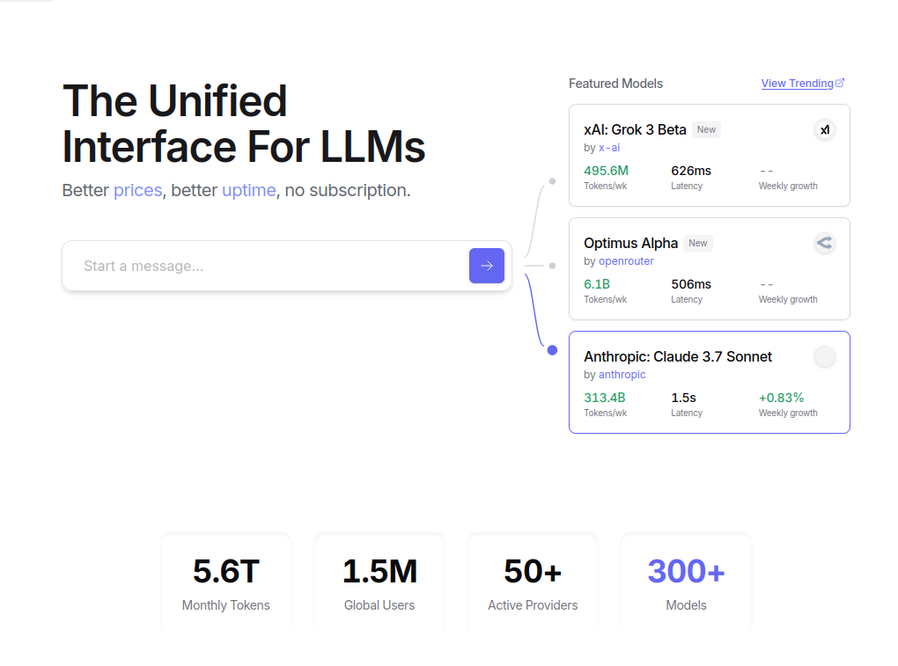
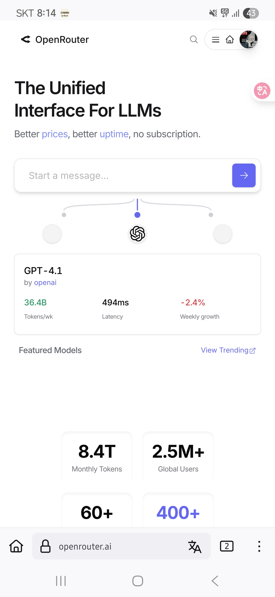

<!-- gid:20250411T145352 -->
[TOC]

[[TIP("이 노트에 대하여")]]
OpenRouter는 여러 LLM 제공자를 하나의 API와 가격 비교 층으로 묶어 모델 선택과 실험을 유연하게 해주는 게이트웨이다.
[[/TIP]]

## BIBLIOGRAPHY

  “Berriai/Litellm.” 2025. [https://github.com/BerriAI/litellm](https://github.com/BerriAI/litellm).
  “OpenRouter: A Unified Interface for LLMs.” n.d. Accessed October 23, 2024. [https://openrouter.ai](https://openrouter.ai).
  “Quasar Alpha - API, Providers, Stats.” n.d. Accessed April 11, 2025. [https://openrouter.ai/openrouter/quasar-alpha](https://openrouter.ai/openrouter/quasar-alpha).
  Willison, Simon. n.d. “GitHub Issues for Notes 깃허브 활용한 노트 관리.” Accessed June 2, 2025. [https://simonwillison.net/2025/May/26/notes/](https://simonwillison.net/2025/May/26/notes/).

## 관련노트

-   [모음: LLM: 백엔드 - openrouter openai xai togetherai gemini](https://notes.junghanacs.com/notes/20241023T220201/)
-   [캐글 허깅페이스 - 데이터과학 머신러닝 커뮤니티 플랫폼](https://notes.junghanacs.com/bib/20250509T135957/)

## 히스토리

-   [2025-06-27 Fri 14:26] 오픈라우터 도입 - vscode, litellm 연동까지 - [2025-04-11 Fri 14:53] 오픈라우터 권장하네? [MatthewZMD emigo 이맥스 페어프로그래밍 패키지](https://notes.junghanacs.com/notes/20250411T151002/)

잠시만 코딩 하기 이전에 말이야. 조금 더 맞춰봐.

### OpenRouter: A unified interface for LLMs 통합 인터페이스

(“OpenRouter: A Unified Interface for LLMs” n.d.)

LLM router and marketplace



### Quasar Alpha - API, Providers, Stats

(“Quasar Alpha - API, Providers, Stats” n.d.)

[2025-04-11 Fri 17:15] 아직 공개 안된 오픈라우터에서 제공한다는 모델이다. This is a cloaked model provided to the community to gather feedback. It’s a powerful, all-purpose model supporting long-context tasks, including code generation. Run Quasar Alpha with API 관련메타 - [통합 병합 합자 융합 종합 조합](https://notes.junghanacs.com/meta/20250411T171203/) 이 단어가 주는 느낌 말이다.

## 아카이브

### <span class="org-todo done DONE">DONE</span> Screenshots for 20250626

#### Screenshot_20250626_201429_Firefox



## 관리키

## 용어 참고

### @user 제한에 BYOK 사용량 포함 무슨 말이야?

@assistant "제한에 BYOK 사용량 포함"은 사용자가 직접 관리하는 키(Bring Your Own Key, BYOK)를 사용하는 경우에도 사용량 제한이 적용된다는 의미입니다. 즉, 자신의 암호화 키를 사용하더라도 사용량 한도를 초과하면 추가 비용이 발생하거나 서비스 이용이 제한될 수 있다는 뜻입니다.

(Willison n.d.)

(“Berriai/Litellm” 2025)

## <span class="org-todo done DONE">DONE</span> 17:00 <span class="org-hashtag">#aider</span> <span class="org-hashtag">#openrouter</span>

```text
# Change directory into your codebase
cd /to/your/project

# Or any other open router model
aider --model openrouter/<provider>/<model>

# List models available from OpenRouter
aider --list-models openrouter/
```

-   openrouter/deepseek/deepseek-coder
-   openrouter/deepseek/deepseek-r1
