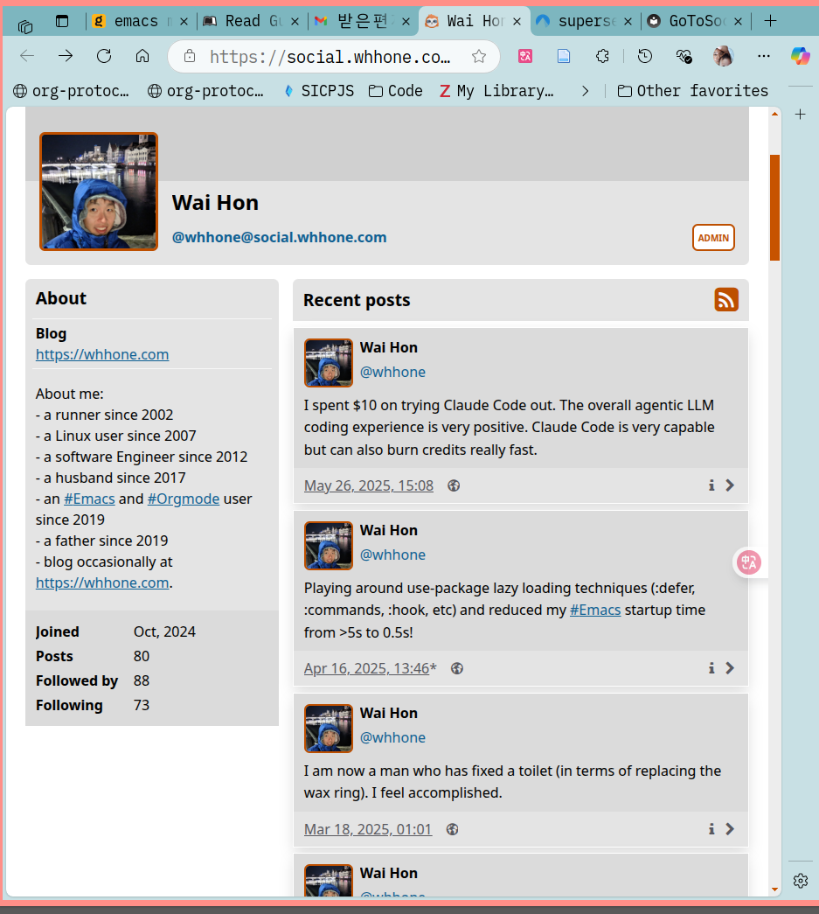

<!-- gid:20250414T184549 -->
[TOC]

[[TIP("이 노트에 대하여")]]
whhone은 Emacs, 안드로이드, 프라이버시, 생산성을 가로지르며 생활 기술을 촘촘히 축적해온 실천적 개발자이자 글쓴이다.
[[/TIP]]

## BIBLIOGRAPHY

  “Emacs Config - Wai Hon’s Blog.” 2024. 2024. [https://whhone.com/emacs-config/](https://whhone.com/emacs-config/).
  “Gotosocial Documentation.” n.d. Accessed June 11, 2025. [https://docs.gotosocial.org/en/v0.19.1/](https://docs.gotosocial.org/en/v0.19.1/).
  “Implementing the Para Method in Org-Mode - Wai Hon’s Blog.” n.d. Accessed January 24, 2024. [https://whhone.com/posts/para-org-mode/](https://whhone.com/posts/para-org-mode/).
  Wai Hon. 2022. “Implementing the Para Method in Org-Mode.” 2022. [https://whhone.com/posts/para-org-mode/](https://whhone.com/posts/para-org-mode/).
  “Wai Hon, @Whhone@Social.Whhone.Com.” 2024. October 18, 2024. [https://social.whhone.com/@whhone](https://social.whhone.com/@whhone).
  whhone. n.d. “Using Emacs in a Terminal - Wai Hon’s Blog.” Accessed August 30, 2024. [https://whhone.com/posts/emacs-in-a-terminal/](https://whhone.com/posts/emacs-in-a-terminal/).

## 히스토리

-   [2026-04-08 Wed 11:15] 오랜만에 [entwurf 분신 에이전트 가이드](https://notes.junghanacs.com/botlog/20260324T153323/)과 어젠다 이슈로 논의하는 중에 잘계십니까?
-   [2025-06-11 Wed 15:09] Social.whhone.com이거 엄청 아름답다.
-   [2025-04-14 Mon 18:45] 깔끔하지

## Wai Hon, @whhone@social.whhone.com

(“Wai Hon, @Whhone@Social.Whhone.Com” 2024)

About me:- a runner since 2002- a Linux user since 2007- a software Engineer since 2012- a husband since 2017- an \\#Emacs and \\#Orgmode user since 2019- a father since 2019- blog occasionally at <https://whhone.com>.

### GoToSocial Documentation

(“Gotosocial Documentation” n.d.)

### 스크린샷

## 관련링크

### Emacs Config - Wai Hon’s Blog

(“Emacs Config - Wai Hon’s Blog” 2024) 2024

### Using Emacs in a Terminal - Wai Hon’s Blog

(whhone n.d.)

### Implementing the PARA Method in Org-mode

(Wai Hon 2022) Wai Hon 2022

### Implementing the PARA Method in Org-mode - Wai Hon’s Blog

(“Implementing the Para Method in Org-Mode - Wai Hon’s Blog” n.d.)

## 태그 Tags

-   Emacs
-   Org-Mode
-   Engineering
-   Hosting
-   Linux
-   Android
-   I3wm
-   Writing
-   Parenting
-   Health
-   Productivity
-   Privacy
-   Personal-Development
-   Programming

### Personal-Development

[2025-06-11 Wed 15:03] 카테고리로 만들었구나

-   Building Habits
-   Daily Journal
-   Effective Reading
-   Productivity System
