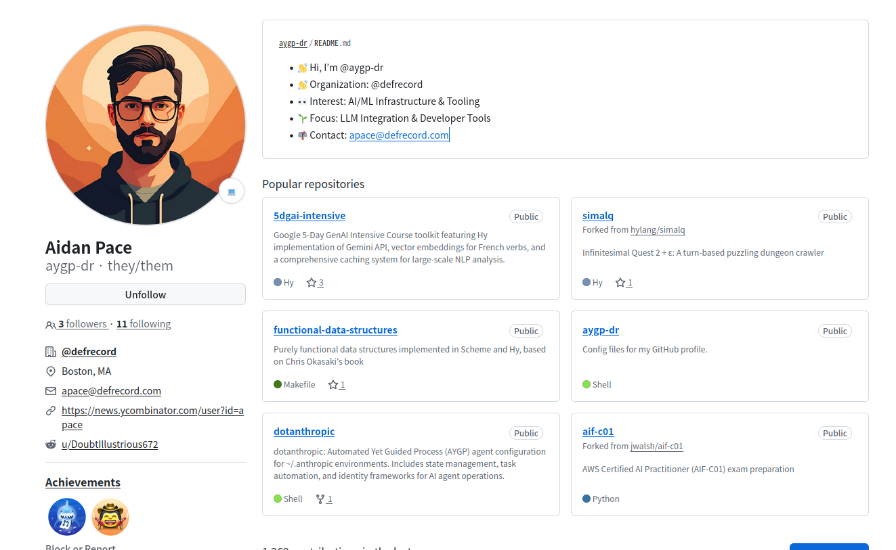

<!-- gid:20250416T174337 -->
[[TIP("이 노트에 대하여")]]
Aidan Pace는 Hy 언어와 Org-mode, AI 실험을 엮어 구조화된 기록과 프로그래밍을 함께 밀어붙이는 개발자다.
[[/TIP]]

<!-- provenance:source:start -->
[[TIP("원본·최신본")]]
이 페이지는 한국어 검색과 읽기를 위한 WikiDocs 미러입니다. [원본·최신본은 가든](https://notes.junghanacs.com/bib/20250416T174337/)에 있습니다. 최신 수정 내용·백링크·태그·히스토리·댓글·출처 정보는 원본 가든에서 확인하세요.

- 작성: `2025-04-16T17:43:00+09:00`
- 최근 수정: `2025-04-16T17:43:00+09:00`
[[/TIP]]
<!-- provenance:source:end -->

[TOC]

## BIBLIOGRAPHY

- Aidan Pace. n.d. “Aygp-Dr (Aidan Pace).” Accessed March 26, 2025. [https://github.com/aygp-dr](https://github.com/aygp-dr).
- “Aygp-Dr/5dgai-Intensive.” 2025. [https://github.com/aygp-dr/5dgai-intensive](https://github.com/aygp-dr/5dgai-intensive).
- “Aygp-Dr/Functional-Data-Structures: Purely Functional Data Structures Implemented in Scheme and Hy, Based on Chris Okasaki’s Book.” 2025. [https://github.com/aygp-dr/functional-data-structures](https://github.com/aygp-dr/functional-data-structures).
- “Aygp-Dr/Lisp-Dialect-Showcase.” 2025. [https://github.com/aygp-dr/lisp-dialect-showcase](https://github.com/aygp-dr/lisp-dialect-showcase).
- “Aygp-Dr/Simalq.” 2025. [https://github.com/aygp-dr/simalq](https://github.com/aygp-dr/simalq).

## History

-   [2025-04-16 Wed 17:43] 사람인가 싶다. 이쪽 사람들 멋있어.

## aygp-dr (Aidan Pace)

(Aidan Pace n.d.) Aidan Pace

[[TIP("노트")]]
-   👋 Hi, I’m @aygp-dr 
-   👋 Organization: @defrecord 
-   👀 Interest: AI/ML Infrastructure &amp; Tooling 
-   🌱 Focus: LLM Integration &amp; Developer Tools 
-   📫 Contact: apace@defrecord.com 
[[/TIP]]

## aygp-dr/lisp-dialect-showcase

(“Aygp-Dr/Lisp-Dialect-Showcase” 2025) Pace, Aidan 2025

A showcase of various Lisp dialects implementing common algorithms

## hylang orgmode projects

[2025-04-16 Wed 17:48]

-   [하이랭](https://wikidocs.net/380815) 기반 프로젝트 완벽해

### aygp-dr/5dgai-intensive

(“Aygp-Dr/5dgai-Intensive” 2025) Pace, Aidan 2025

Google 5-Day GenAI Intensive Course toolkit featuring Hy implementation of Gemini API, vector embeddings for French verbs, and a comprehensive caching system for large-scale NLP analysis.

### aygp-dr/simalq

(“Aygp-Dr/Simalq” 2025) Pace, Aidan 2025

Infinitesimal Quest 2 + ε: A turn-based puzzling dungeon crawler

### aygp-dr/functional-data-structures

(“Aygp-Dr/Functional-Data-Structures: Purely Functional Data Structures Implemented in Scheme and Hy, Based on Chris Okasaki’s Book” 2025)

-   Purely functional data structures implemented in Scheme and Hy, based on Chris Okasaki’s book
-   Aidan Pace and Jason Walsh 2025

## Related-Notes

-   [제이슨월시 Jason Walsh 이맥스 조직모드 클로저 하이랭 인공지능 구루](https://wikidocs.net/382338)
-   [defrecord 클로저 하이랭 조직모드 이맥스 LLM](https://wikidocs.net/382328)
