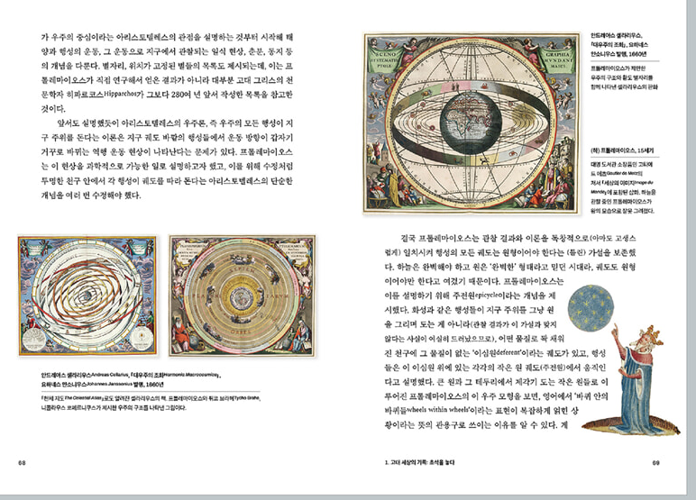

<!-- gid:20250520T070850 -->
[TOC]

[[TIP("이 노트에 대하여")]]
과학사의 중요한 원전과 해설서를 함께 묶어 지식이 형성되는 장면과 계보를 차분히 따라간다.
[[/TIP]]

## History

-   [2025-09-17 Wed 07:55] 지식의 원전 추가
-   [2025-05-20 Tue 07:08] 이책 정말 예쁘다. - 과학책 역사

## 관련메타

-   [0zzzr 보편특수범용특이](https://wikidocs.net/380947)

## BIBLIOGRAPHY

  브라이언 클레그. 2025. <i>책을 쓰는 과학자들 - 위대한 과학책의 역사</i>. Translated by 제효영. 을유문화사. [https://www.yes24.com/Product/Goods/140932400](https://www.yes24.com/Product/Goods/140932400).
  존 캐리. n.d. <i>지식의 원전</i>. Accessed September 16, 2025. [https://www.yes24.com/product/goods/134325535](https://www.yes24.com/product/goods/134325535).

## 지식의 원전

(존 캐리 n.d.)

-   The Faber Book of Science
-   존 캐리

### 책소개

세기의 지성사, 원전을 읽다 위대한 발견의 순간과 지식을 깨달아가는 희열!

레오나르도 다빈치 이후 500여 년간 인류가 축적해 온 근대적 지식의 발견의 순간을 파노라마처럼 보여주는 책이다. 익히 들어 익숙한 뉴튼, 갈릴레이, 아인슈타인, 퀴리 부부의 연구기록뿐 아니라 리처드 파인만, 칼 세이건 등 총 102개 인간 근원적 지식 발견의 순간들이 담겼다. 천재 과학자들이 그들의 지식 발견의 첫 순간을 직접 기록한, 말 그대로 '원전(原典)' 모음집이다. 이미 알려진 세상의 지식이 어떤 동기와 어떤 과정을 거쳐 지금의 결과로 이어져 왔는지, 그 최초 발견자의 직접 기록을 통해 왜곡 없이 독자들에게 전달해 준다. 더불어, 출간 20주년을 맞아 컬러 도판 102점을 추가하여 생생함을 더했다.

'알게 된다는 것'의 희열을 향해 때로는 정신 나간 얼간이로 치부당하면서도 목표를 향해 끝까지 나간 이들의 연구는 르네상스 이후 세상을 뒤바꿔 버린 것들이다. 개인적 생활사 속에서 라듐의 발견 순간을 풀어간 퀴리 부인 이야기, 문명의 우열론을 가리며 진화를 설명해 가는 다윈의 기록, 도킨스의 유전자 에세이, 소금 한 알갱이로 우주의 삼라만상을 논하는 칼 세이건의 기록 등 세기를 대표하는 천재들의 지적 유희를 책 한 권을 통해 경험하게 될 것이다. 일반 독자들도 무리 없이 읽어낼 수 있는 흥미로운 문헌을 골라 과학을 우리 바로 옆에 끌어앉혔다.

### 목차

-   서문 | 원전으로 읽는 인간 지식의 근원 9

-   1. 다빈치, 과학의 서곡 | 레오나르도 다빈치 Leonardo da Vinci 31
-   2. 인체로의 여행 | 안드레아스 베살리우스 Andreas Vesalius 37
-   3. 갈릴레오와 망원경 | 갈릴레오 갈릴레이 Galileo Galilei 42
-   4. 마녀 사냥 | 제프리 케인스 Geoffrey Keynes 54
-   5. 사냥거미 | 로버트 훅 Robert Hooke 외 61
-   6. 최초의 수혈 | 헨리 올덴버그 Henry Oldenburg 외 64
-   7. 물 속의 작은 생물 | 안톤 반 레이우엔훅 Anton van Leeuwenhoek 68
-   8. 사과와 색 | 아이작 뉴턴 Isaac Newton 외 71
-   9. 붉은생쥐와 들귀뚜라미 | 길버트 화이트 Gilbert White 77
-   10. 산소를 발견한 생쥐 두 마리 | 조지프 프리스틀리 Joseph Priestley 83
-   11. 천왕성의 발견 | 알프레드 노이스 Alfred Noyes 88
-   12. 빅뱅과 식물들의 사랑 | 에라스무스 다윈 Erasmus Darwin 94
-   13. 얼룩무늬 괴물 길들이기 | 에드워드 제너 Edward Jenner 외 100
-   14. 인구증가의 위협 | 토머스 맬서스 Thomas Malthus 105
-   15. 기린의 목이 길어진 사연 | 장 바티스트 라마르크 Jean-Baptiste Lamarck 외 110
-   16. 파리에서의 의학공부 | 헥터 베를리오즈 Hector Berlioz 119
-   17. 위장에 뚜껑 달린 사나이 | 윌리엄 버몬트 William Beaumont 122
-   18. 끔찍한 망치들? 새로운 지질학 | 찰스 라이엘 Charles Lyell 127
-   19. 걱정의 발견 | 애덤 필립스 Adam Phillips 138
-   20. 사진의 대중화 | 사무엘 모스 Samuel F. B. Morse 외 141
-   21. 개미들의 전쟁 | 헨리 데이비드 소로 Henry David Thoreau 148
-   22. 촛불에 대하여 | 마이클 패러데이 Michael Faraday 153
-   23. 열적 죽음 | 존 업다이크 John Updike 160
-   24. 아담의 배꼽 | 스티븐 제이 굴드 Stephen Jay Gould 163
-   25. 바닷속 에덴의 정원 | 에드먼드 고스 Edmund Gosse 178
-   26. 녹(綠)의 찬미 | 존 러스킨 John Ruskin 184
-   27. 악마의 사도 | 찰스 다윈 Charles Darwin 189
-   28. 선사의 발견 | 대니얼 J. 부어스틴 Daniel J. Boorstin 208
-   29. 고리와 링? 케쿨레의 꿈 | 아우구스트 케쿨레 August Kekule 218
-   30. 백악(白堊) 한 조각 | 토머스 헨리 헉슬리 Thomas Henry Huxley 221
-   31. 시베리아가 키운 예언자 | 버나드 자페 Bernard Jaffe 232
-   32. 사회주의와 박테리아 | 데이비드 보다니스 David Bodanis 248
-   33. 신이 창조한 분자 | 제임스 클러크 맥스웰 James Clerk Maxwell 259
-   34. 전구의 발명 | 프랜시스 젤 Francis Jehl 262
-   35. 커스터드에 담긴 진실 | 니콜라스 커티 Nicholas Kurti 267
-   36. 산아제한의 도구 | 앵거스 맥라렌 Angus McLaren 270
-   37. 머리가 잘려나가는 교미 | L. O. 하워드 L. O. Howard 273
-   38. 조각처럼 만들어지는 세상 | 윌리엄 제임스 William James 276
-   39. X-레이의 발견 | 빌헬름 콘라드 뢴트겐 Wilhelm Conrad Roentgen 외 278
-   40. 햇빛이 들지 않는 파리 | 앙리 베크렐 Henri Becquerel 287
-   41. 라듐의 색깔 | 이브 퀴리 Eve Curie 290
-   42. 죄 없는 라듐 | 라비니아 그린로 Lavinia Greenlaw 304
-   43. 모기의 위장 속에서 발견하다 | 로널드 로스 Ronald Ross 307
-   44. 시인과 과학자 | 휴 맥다이어미드 Hugh MacDiarmid 317
-   45. 세 개의 파브르 관찰기 | 장 앙리 파브르 Jean Henri Fabre 321
-   46. 수놈의 대학살 | 모리스 마테를링크 Maurice Maeterlinck 341
-   47. 도착(倒錯)에 대하여 | 지그문트 프로이트 Sigmund Freud 외 345
-   48. 키티 호크 | 오빌 라이트 Orville Wright 352
-   49. 울새 둥지 속의 뻐꾸기 | W. H. 허드슨 W. H. Hudson 359
-   50. 세상은 인간을 위해 만들어졌는가? | 마크 트웨인 Mark Twain 366
-   51. 신경 그리기 | 산티아고 라몬 이 카할 Santiago Ramon y Cajal 374
-   52. 핵의 발견 | C. P. 스노 C. P. Snow 385
-   53. 어느 자연주의자의 죽음 | 브루스 프레더릭 커밍스 Bruce Frederick Cummings 389
-   54. 상대성에 관하여 | 알베르트 아인슈타인 Albert Einstein 외 396
-   55. '불확정성의 원리'와 다른 세상 | P. W. 브리지먼 P. W. Bridgman 외 410
-   56. 지뢰와 기관총 | 막스 보른 Max Born 415
-   57. 빛은 왜 직선으로 이동하는가? | P. W. 앳킨스 P. W. Atkins 422
-   58. 수수께끼의 시 | 윌리엄 엠프슨 William Empson 428
-   59. 바닷속 푸른 빛 | 윌리엄 비비 William Beebe 430
-   60. 해삼 | 존 스타인벡 John Steinbeck 439
-   61. 일반인에게 과학을 설명하기 | J. B. S. 홀데인 J. B. S. Haldane 441
-   62. 안구 만들기 | 찰스 셰링턴 Charles Sherrington 453
-   63. 바람 속의 푸른곰팡이 | 사라 리드만 Sarah Riedman 외 464
-   64. 검은 스쿼시 코트에서 | 로라 페르미 Laura Fermi 473
-   65. 어떤 죽음, 그리고 원자폭탄 | 리처드 파인만 Richard Feynman 488
-   66. 어느 탄소원자 이야기 | 프리모 레비 Primo Levi 494
-   67. 조류(潮流) | 레이첼 카슨 Rachel Carson 503
-   68. 뜨겁게 유동하는 지구 | 찰스 오피서 Charles Officer 외 511
-   69. 시인과 외과 의사 | 제임스 커컵 James Kirkup 외 518
-   70. 사랑과 죽음이 시작되다 | 조셉 우드 크루치 Joseph Wood Krutch 526
-   71. 원시의 늪 속에서 | 잭쿼타 호크스 Jacquetta Hawkes 537
-   72. 크라카타우, 재앙 그 이후 | 에드워드 O. 윌슨 Edward O. Wilson 544
-   73. 고릴라 | 조지 샬러 George Schaller 554
-   74. 두꺼비 | 조지 오웰 George Orwell 565
-   75. 러시아 나비들 | 블라디미르 나보코프 Vladimir Nabokov 568
-   76. 중세의 사면발이 | 존 스타인벡 John Steinbeck 573
-   77. 게코의 배 | 이탈로 칼비노 Italo Calvino 575
-   78. 달에서 | 닐 암스트롱 Neil Armstrong 외 580
-   79. 중력 | 존 프레더릭 님스 John Frederick Nims 585
-   80. 어느 물리학자의 원자학 강의 | 오토 프리슈 Otto Frisch 외 589
-   81. 우주먼지에서 생물로 | 나이절 칼더 Nigel Calder 외 607
-   82. 블랙홀 | 아이작 아시모프 Isaac Asimov 612
-   83. 방사능 낙진으로 된 행성 | J. E. 러브록 J. E. Lovelock 617
-   84. 에드워드 시대의 은하 일기 | 에드워드 라리씨 Edward Larrissy 621
-   85. 일상의 햇빛 | 아서 클라크 Arthur C. Clarke 623
-   86. 소금 알갱이 하나에 대한 생각 | 칼 세이건 Carl Sagan 636
-   87. 뇌의 용량 | 앤서니 스미스 Anthony Smith 642
-   88. 발명과 활용 | 루스 베네딕트 Ruth Benedict 648
-   89. 잘못된 예측 | 피터 메더워 Peter Medawar 650
-   90. 영리한 동물들 | 루이스 토머스 Lewis Thomas 654
-   91. 조작된 과학 | 마틴 가드너 Martin Gardner 658
-   92. 부자연스러운 자연 | 루이스 월퍼트 Lewis Wolpert 663
-   93. 인형을 사랑하는 아기 | D. W. 위니코트 D. W. Winnicott 666
-   94. 아내를 모자로 착각하는 남자 | 올리버 색스 Oliver Sacks 671
-   95. 도로시 호지킨을 인터뷰하다 | 루이스 월퍼트 Lewis Wolpert 680
-   96. 생명체의 설계도 | 프랜시스 크릭 Francis Crick 692
-   97. 세포 하나에 들어있는 정보 | 리처드 도킨스 Richard Dawkins 702
-   98. 흩뿌려진 생명 | 미로슬로프 홀럽 Miroslav Holub 710
-   99. 또 다른 관점에서 본 온실효과 | 프리먼 다이슨 Freeman Dyson 715
-   100. 프랙탈과 카오스 | 폴 데이비스 Paul Davies 외 719
-   101. 유전자의 언어 | 스티브 존스 Steve Jones 734
-   102. 우리의 지구가 죽어가고 있다 | 아이작 아시모프 Isaac Asimov 737
-   옮긴이의 말 | '지식 발견'이라는 희열에 대해 748
-   개정판 옮긴이의 말 | 장구한 지식의 역사를 이어가다 751
-   인명 찾아보기 753

### 책 속으로

그 녀석은 인간의 의지와 관련이 있는 것이지만, 가끔은 자기 자신의 의지를 드러내기도 한다. 남자들이 그것을 발기시키고 싶어도 완강히 거부하면서 늘어져 있기도 하고, 때로는 제 주인에게 의견을 물어보지도 않고 제멋대로 굴기도 한다. 가끔 남자들이 자고 있을 때 깨어나 있질 않나, 써먹으려고 할 때 거부하거나 반대로 주인의 허락 없이도 활동을 하고 싶어하질 않나, 이 녀석은 늘어져 있든 깨어나 있든 모든 게 자기 좋을 대로다. 이런 것을 보면, 이 피조물은 마치 인간과는 별도의 삶과 지능을 가지고 있는 것 같다. --- 「레오나르도 다빈치 〈다빈치, 과학의 서곡〉」 중에서

이 성스러운 법정은 내가 가지고 있었던 잘못된 생각, 즉 태양은 움직이지 않는 우주의 중심이며, 지구는 우주의 중심이 아니라 태양 주위를 돌고 있다는 잘못된 생각을 완전히 버릴 것과, 말이든 글이든 어떠한 방법으로도 이런 잘못된 사상을 옹호하거나 설파하지 말 것을 내게 선고하고, 이런 잘못된 사상이 성서에 위배된다는 것을 일깨워 주었습니다. --- 「갈릴레오 갈릴레이 〈갈릴레오와 망원경〉」 중에서

화학실험실의 다양한 기구들과 물리 실험장치 모두가 짧은 시간 내에 방사능을 띠게 되어 검은 종이 뒤의 감광판을 현상시킬 정도가 된다. 먼지, 방안의 공기, 그리고 입고 있는 옷 모두 방사능을 띠게 되고, 방안의 공기는 전기전도성이 된다. 우리가 일하는 실험실에서 이 악마의 활동은 극에 달해, 더 이상 어떠한 실험도구도 방사능을 띠지 않는 것은 없었다. --- 「마리 퀴리 〈라듐의 색깔〉」 중에서

우리는 실험을 관찰할 때 착용할 검은 안경을 지급 받았다. 검은 안경이라니! 20마일 떨어진 곳에서 검은 안경을 쓴다면 실험을 제대로 볼 수도 없을 것이다. 이 거리에서 나의 눈에 해로운 것은 (밝은 빛은 눈에 손상을 주지 않는다) 자외선밖에 없었다. 나는 트럭의 앞 유리 뒤로 갔는데, 자외선은 유리를 통과할 수 없으므로 그곳은 안전한 곳이었다. 거기서 나는 그 끔찍한 광경을 볼 수 있었다. --- 「리처드 파인만 〈어떤 죽음, 그리고 원자폭탄〉」 중에서

흰색과 검은색 페인트를 섞으면 회색의 페인트를 얻게 된다. 회색 페인트와 회색 페인트를 섞는다고 다시 원래의 흰색과 검은색 페인트를 얻을 수는 없다. 멘델 이전에 유전을 보는 시각은 페인트를 섞는 것과 다르지 않았다. 물론 현재에도 많은 사회 문화에서 유전을 '피'가 섞이는 것으로 보고 있다. 젠킨은 점차로 궁지에 몰릴 수밖에 없는 가정에 대해서 주장하는 것이다. 여러 세대를 거치면서 혼합유전이라는 가정하에서 변이는 점차로 궁지에 몰리게 되어 사라지고, 점차로 획일성이 지배할 것이다. --- 「리처드 도킨스 〈세포 하나에 들어 있는 정보〉」 중에서

### 출판사 리뷰

다빈치의 노트, 다윈의 진화 기행문, 퀴리의 라듐 일기, 도킨스의 유전자 에세이… 500년 지성사에서 건져 올린 102개의 황금 원전

인간의 신체에 대한 궁금증을 드러내는 다빈치의 노트를 시작으로, 지나친 문명 발달로 인해 인류가 위협받는 현 세태를 개탄하는 아이작 아시모프의 기고문까지 102개의 원전을 묶은 책이다. 일기와 기행문, 연구 기록, 문헌, 과학적 사료 등을 엮은 이 책을 통해 인류 지성의 발전사를 한 권으로 확인할 수 있다. 즉 지식 발견의 주체자들이 직접 쓴 최초의 원전 기록을 그대로 독자에게 소개한다. 다빈치는 생애 약 8천 페이지에 달하는 노트를 쓴 것으로 알려져 있다. 이 책에는 그중 〈부검〉, 〈해저의 흔적〉, 〈새들의 눈〉 등 다섯 편의 단상이 실렸다. 제목에서도 알 수 있듯이 그는 해부학과 지구과학, 동물학 등 현대에는 하나의 전공이 된 학문 분야를 완전히 자유롭게 오가며 호기심 어린 눈으로 탐구하고 사유했다는 것을 알 수 있다. 특히 신체 조직의 수축과 이완, 혈액의 이동에 관한 기록, 의지와 상관없이 반응하는 남성의 성기에 관한 기록은 다빈치의 천재성은 물론 관찰력과 유머감각까지 보여주고 있다.

진화론의 아버지 찰스 다윈은 인간과 다른 모든 동물이 신에 의해 창조된 존재가 아닌 뇌가 없고 척추만 있는 연체동물(몰러스크mollusc)로부터 진화했다는 자신의 생각에 다음과 같이 기록했다. "이렇게 꼴사납고, 파괴적이며, 무시무시한 대자연의 추한 모습이라니…… 필시 악마의 사도가 쓴 책일 거야." 그런 그가 『종의 기원』(1859)을 출간하게 된 것은, 1831년부터 약 5년간 영국 군함을 개조한 비글호를 타고 브라질과 티에라델푸에고섬, 오스트레일리아 등을 탐험한 경험이 큰 영향을 미친 것으로 보인다. 다윈은 이 탐험에서 유목민과 현대인의 차이 혹은 인간과 동물 간의 유사성, 지질학적 차이에 따른 동식물 등을 관찰하고 기록으로 남겼다. 이 책에도 '진화 기행문'의 일부가 실렸다. 이 기록들은 후에 '진화론'의 필요조건들로 제시된다.

"하루 온종일 끓는 광석을 쇠막대로 저어야 하는 열악한 환경 속에서도 아름다운 색의 '라듐'을 발견하고는 매우 행복한 상태로 매일매일 실험실에서 보냈다"라고 하는 퀴리 부인의 일기는 후대에 남은 그들에 대한 명성에도 불구하고, 그들이 '라듐'의 특성에 의해서 수많은 시행착오와 좌절 속에서도 오직 연구에만 몰두해 왔다는 것을 알려준다. 이처럼 최초 발견자들의 원 기록은 그 원리를 궁금해하던 애초의 상황부터 중간 과정, 순간순간의 정신적 단상, 그리고 마침내 발견을 이룬 희열에 이르기까지를 다루고 있다. 그뿐만 아니라 담담히 풀어가는 명석한 이론 설명을 포함해, 독자들에게 최대한의 정확성을 발휘해 지식을 전달한다. 무엇보다 생생한 그들의 목소리가 우리 역시 그 체험의 현장에 함께 있는 것 같은 느낌이 들게 한다.

단 한 권으로 읽는 인류 지식의 발전 과학 지식 뛰어넘는 '대중교양서 읽기'

태산같이 쌓인 500년 인류지성사의 원전을 발견하고 수집, 편집하여 102개의 꼭지를 엮게 된, 옥스포드대학교 영문학 교수 존 캐리는 이 책의 의의에 대해서 말한다. "학자가 아닌 일반 독자들이 쉽게 과학적 지식을 이해하기 바란다." 수없이 쏟아지는 지식교양서들이 모두 이 단순한 목표를 의도로 삼아 책을 내고 있다. 이 책이 가진 최고의 미덕은, 편저자의 특별한 '주의'나 '주장'은 배제한 채 지성사에 커다란 획을 그은 최초의 발견 기록들, 그 순수한 최초의 원전을 있는 그대로 독자들에게 소개하고 있다는 점이다.

전문적인 과학 양서들이 이미 넘치도록 출간되고 있지만, 고백하건대 우리는 파편화되거나 결과론적인 지식만을 언급하고 있다는 점도 인정해야 할 것이다. 여기서 '지식'이라는 광범위한 단어에 의문이 들 것이다. 물론 이 책 속에 실린 각 원전의 기록자, 혹은 각 원전이 담고 있는 내용은 거의 지식 중에서도 '과학 지식'이 기본 맥으로 설정되어 있다. 그러나 과학이 어찌 '자연과학'이라는 범주 안에 머물러 있을 수 있겠는가. 그것은 곧 인류 사회와 연계되는 것이며, 그 때문에 이 육중한 책 속에는 과학을 중심으로 삼되, 기술의 발명과 인류 미래 제시, 과학자가 지닌 휴머니즘 세계관, '생물' 범주가 아닌 생명체에 대한 단상에 이르기까지 과학을 뛰어넘는 다양한 각도의 지식을 설명하고 있다.

그리하여 존 캐리는 원전 속에서 기본 원리를 배우고 이해하는 과정을 일반 독자들이 직접 체험하기를 바랐다. 이는 마치 강사를 거치지 않고, 최초의 발견자(학자)가 직접 독자와 대면하여 설명해 주는 것과 같다. 편저자가 서문에서 설명하고 있듯, 그는 이 책에서 소개한 원전을 고른 기본 조건으로 '흥미롭고 잘 쓰여 있는지'와 더불어 '깊이 있는 지적교육을 받지 않은 독자들도 명확히 이해할 수 있는 기록인지'를 중요시하였다. 이는 지적 수준이 높은 몇몇 소수를 위한 책이 아니라 철저히 대중교양서를 지향하고 있으며, 일부 전문가들의 향유물이 아닌 수많은 독자가 공유하길 바라는 마음으로, 원전 기록에 의한 최초의 발견 순간을 있는 그대로 보여주려는 것이다.

과학자, 의사, 수학자, 문학 박사… 7인의 전문가가 완성한 고급 번역본

『지식의 원전』이 대중교양서를 지양하는 것은 사실이지만, 기본과학이론에 대한 지식 없이는 독자에게 온전히 그 의미와 가치를 전달하기 어려웠을 것이다. 방대한 인류지성사를 한 권에 담은 '대중교양서'를 내놓게 되었다는 자부심을 감히 가질 수 있었던 이유 중 하나는, 번역의 질 때문이라는 점도 일러두고 싶다. 여기서 번역의 질이란 매끄러운 문장으로 잘 읽히도록 바꾸었다는 포장의 의미가 아니라, 여러 분야로 세분화되는 지식의 각 분야와 이에 따른 전문용어의 나열 속에 국내 독자들에게 최대한으로 정확한 원전 내용을 그대로 전달해야 하는 특성을 얼마만큼 만족시켰느냐의 관점이다. 물리, 수리, 생물, 화학, 천문, 의학, 지질학 등 다방면의 장르를 아우르고 있는 본 저서의 각 장을 번역하기 위해선 아무리 도통한 과학자 겸 번역자라도 한 사람의 힘으로는 무리일 수밖에 없다.

현재 한국과학기술연구원(KIST)에 몸 담고 있는 이광렬 박사는 약 30년 전 영국 캐임브리지대학교 내 서점에서 이 책을 처음으로 접했다. 대충 훑어보던 중, 인류지성사 전체를 두루 아우르는 장대함, 그와 더불어 '일반인들을 위한 지식 전달'에 충분히 부합될 만한 최상의 원고라 생각했다. 이광렬 박사는 한국으로 가져와 (세부 전공 분야는 모두 다른) 동료 과학계 친우들을 불러 모았고, 3년이란 긴 시간 동안 서로의 의견을 공유해가면서 이 책을 번역하기 시작했다. KIST 첨단소재기술연구본부의 이광렬 박사의 주도로 시작된 이 번역에는, KIST 차세대반도체연구소의 정병기 박사, 아주대학교 자연과학대학 물리학과의 이순일 교수, 전 가톨릭대학교 수학과의 방금성 교수, 정형외과 전문의 박정수 박사가 투입되어 각자의 전공에 맞게 자신 있는 분야의 꼭지들을 나누어 작업하였다. 그리고 앞서 설명한 대로 이 책에는 과학과 문학을 연계하여 때로는 영시로, 때로는 문학가의 단상류로 지식을 설명한 내용도 상당 부분 담겨 있다. 이를 위해 애버딘대학교 영문학과의 정경심 박사의 번역, 그리고 국내 출간된 지식교양서를 다수 번역했던 김문영 번역가까지 총 7명의 전문가가 한 권의 책을 위해 수고했다.

이들 전문가 집단의 번역은 국내 독자들이 웬만해서는 쉽게 이해하기 어려울 거라 판단되는 키워드나 원리 설명 등이 있으면 '역자 주'를 통해서, 혹은 원전 기록에 약간의 친절한 설명을 곁들여 막힘없이 읽힐 수 있도록 배려했다. 그 흔적은 언뜻 보아도 금세 그 신뢰도를 느끼게끔 한다. 이는 곧 책의 원 편저자가 처음부터 기획 의도로 삼았던 '대중을 위한 지식 전달'이라는 목표에도 성공적으로 부합하는 결과를 가져다주었다.

### 편저 : 존 캐리 (John Carey)

옥스퍼드대학 영어영문학과 교수로 재직하였으며, 비평가, 출판평론가 및 방송인 등 여러 방면에서 활발히 활동했다. 시인 존 던, 에밀리 디킨슨, 소설가 윌리엄 새커리에 관한 연구서를 포함한 많은 저서가 있고, 대표 저술로는 『지식인과 대중The Intellectuals and the Masses』 『시의 역사A Little History of Poetry』 등이 있으며, 이 책 『지식의 원전』 외에 2500년 역사의 현장 기록을 엮은 『역사의 원전』 등이 있다.

## 책을 쓰는 과학자들 - 위대한 과학책의 역사 Scientifica Historica

(브라이언 클레그 2025) 브라이언 클레그 제효영 2025

40권이 넘는 대중 과학서를 저술하며 명성을 쌓은 브라이언 클레그의 저서로, 고대부터 현대까지 2500년에 걸쳐 인류에 큰 영향을 끼친 과학책들과 그 책을 쓴 과학자들을 조명한다. 해당 책들의 특징과 시대 배경, 과학사에서의 위치, 한계 등을 두루 살펴보는데, 도서들의 표지와 삽화, 저자 이미지, 역사적 자료 등 280여 점의 방대한 고화질 도판으로 이해를 돕는다. 이 책은 과학책의 역사를 다루지만 단순한 연대기적 나열에 그치지 않고, 오랜 시간 축적된 저자의 역량이 발휘된 간명하고 짜임새 있는 전개와 유려한 서술로 과학사를 종합적으로 이해할 수 있도록 돕는다.

### 머리말

### 고대 세상의 기록: 초석을 놓다

### 출판의 르네상스: 책의 혁명

### 근대의 고전: 19세기의 안정

### 고전을 벗어난 과학책: 뒤집힌 세상

### 다음 세대: 지식의 변화

### 위대한 과학책 150권

### 감사의 말

### 책 속으로

로마인들에 관한 한 가지 놀라운 사실은 과학 발전에는 거의 기여한 게 없다는 것인데, 1세기에 코덱스codex를 최초로 개발하여 과학책의 발전에 있어서만은(과학책만이 아닌 책 전체에) 엄청나게 기여했다. 코덱스는 여러 낱장을 한 다발로 묶어서 한 장씩 넘겨 가며 한 쪽씩 수월하게 읽고 원하는 부분도 쉽게 찾을 수 있도록 만든, 현재 우리가 아는 전형적인 책이었다. 과학이 글로 기록되고 책을 통해 널리 퍼지려면 반드시 사본이 여러 권 만들어져야 하는데, 코덱스는 두루마리보다 사본을 제작하기도 훨씬 수월했다. 코덱스의 등장 이후 종교 기관을 중심으로 책의 사본을 제작하는 일이 하나의 산업으로 발전했다. 과학 이론도 책을 통해 처음 등장한 곳을 벗어나 먼 곳까지 알려졌다. 책의 사본을 만드는 일은 이렇게 처음 꽃망울이 맺힌 후 인쇄기의 발명으로 만개했다. 극소수만 활용할 수 있는 값비싼 소통 수단이던 글은 인쇄 기술의 등장과 함께 과학이 대중에게 더 가까이 다가가는 수단으로 쓰이기 시작했다. --- p.14

길버트의 책은 중력에 관한 부분에는 오류가 있지만 자석을 과학적으로 상세하게 탐구한 최초의 책이라는 점에서 중요하다. 『자석에 관하여』에는 길버트가 지구상의 위치에 따라 지구의 자력으로 발생하는 영향이 달라진다는 사실을 설명하기 위해 수행한 다양한 실험이 나오는데, 그는 이러한 실험을 위해 '테렐라Terrella'라는 구 모양의 자석도 제작했다. 길버트의 이러한 시도는 인공물로 자연을 탐구할 수 있다고 한 베이컨의 주장을 확실하게 뒷받침했고, 이는 과학 실험이 온전히 받아들여지기 위해 꼭 필요한 단계였다. 길버트의 저서는 오늘날의 기준에서 최초의 진정한 과학책이라 할 수 있다. --- p.132~133

뉴턴은 총 세 권으로 구성된 『프린키피아』의 마지막 권을 일반 독자들도 쉽게 읽을 수 있도록 쓰려고 했으나, 영국 왕립학회 회원들의 반대로 결국 제3권도 앞선 두 권처럼 비과학자들은 이해하기 힘든 책이 되었다. 질량의 개념부터 그가 수립한 중력의 법칙(지금 쓰이는 것처럼 방정식 형식으로 제시되지는 않았다)까지 『프린키피아』에서 다루어지는 다양한 주제 중에서도 가장 탁월한 내용은 우리가 지표면에서 경험하는 중력을 지구가 태양 주위를 도는 힘, 그리고 달이 지구 주위를 도는 힘과 하나로 연결해 설명한 것이다. --- p.160

1859년, 아마도 지금까지 세상에 나온 모든 과학책을 통틀어 가장 유명한 책이 마침내 나왔다. 자연 선택으로 일어나는 진화의 개념을 대중에게 소개한 찰스 다윈의 책, 『종의 기원』이다. (…) 모든 게 밝혀진 지금은 진화가 자연 선택으로 이루어진다는 것이 너무 당연한 일로 여겨진다. 기초적인 과학 지식이 있고 생물의 유전 정보가 한 세대에서 다음 세대로 어떻게 전달되는지를 알면, 환경에 더 적합한 자손이 그렇지 않은 자손보다 생존에 더 유리할 것임을 누구나 예상할 수 있다. 더 유리한 유전적 변화가 생긴 개체가 번식해서 후대가 생기고, 환경에 적응하면서 생긴 그 유리한 특징이 다음 세대로 전달되리라는 것 역시 충분히 예상 가능하다. 그러나 다윈이 살던 시대에는 이러한 유전학적 지식이 없었으므로, 생각의 도약도 훨씬 어려웠다. --- p.206~207

한 가지 분명한 사실은 『침묵의 봄』이 과학책의 새로운 장을 열었다는 점이다. 과학책에 담긴 메시지가 격렬한 논쟁을 지폈다는 점, 과학자가 자신의 전문 분야가 아닌 주제로 저술한 과학책이라는 점은 모두 과학책의 새로운 특징이었다. 또한 카슨은 과학책이 이야기를 풀어 가는 방식, 즉 독자가 내용을 계속 따라올 수 있도록 이야기를 펼쳐 내는 능력의 중요성을 보여 주었다. 『침묵의 봄』이 나온 직후부터 그러한 능력은 양질의 과학책이 갖추어야 할 요소가 되었다. --- p.267

### 출판사 리뷰

"내가 더 멀리 보았다면, 거인들의 어깨 위에 서 있었기 때문이다." ― 아이작 뉴턴

서로에게 어깨를 내어 주며 세상을 탐구했던 위대한 거인들 그들이 과학책으로 일구어 온 2500년 지성의 연대기

고대 그리스 수학자이자 공학자 아르키메데스는 『모래알을 세는 사람』(기원전 3세기)에서 우주의 크기를 추정하기 위한 시도를 했고, 이후로 우주에 대한 탐구가 계속 이어져 코페르니쿠스는 『천구의 회전에 관하여』(1543년)에서 지구가 아닌 태양이 중심에 있는 우주 구조를 제시했으며, 더 나아가 케플러는 『새로운 천문학』(1609년)에서 각 행성은 태양을 중심으로 타원 궤도를 돈다고 밝히며 정확한 우주 모형을 수립했다. 과학의 발전은 이렇듯 새로운 시도를 통한 발견과 이를 토대로 한 또 다른 도전 및 탐구가 겹겹이 쌓여 이루어지는, 서로에게 어깨를 내어 주며 만들어 낸 장구한 연대기라 할 수 있다. 그리고 이러한 과학사의 중심에는 생각과 발견의 저장고인 '책'이 있다. 우리는 책을 통해 수백·수천 년 전, 수천 킬로미터 떨어진 곳에서 쓰인 글과 만난다. 책이 없었다면 인류의 지식은 체계적으로 이어지지 못했을 것이다. 이렇듯 시공간을 넘어 소통하게 해 주는 책은 과학을 존재하게 하는 핵심이다.

저자 브라이언 클레그는 이 책에서 40권이 넘는 대중 과학책을 쓴 작가로서의 오랜 경험과 필력을 십분 발휘해, 고대부터 현대까지 2500년에 이르는 과학책 역사의 줄기를 따라 각 시기 인류에 큰 영향력을 끼친 과학서들의 특징과 시대 배경, 과학사의 줄기에서 차지하는 위치, 한계를 돌아본다. 단순히 과학의 연대기를 나열하는 데 그치지 않고 책이라는 매체를 통해 과학사를 종합적으로 이해할 수 있게 도와준다는 점에서 과학에 관심 있는 독자라면 꼭 한번 읽어 볼 만한 책이다. 또한 과학책들의 표지와 삽화, 저자 이미지, 역사적 자료 등 280여 점의 방대한 고화질 도판을 실어 이해를 돕는다. 도판만 훑어봐도 그 흐름이 느껴지는 체계적인 아카이브다.

최초의 과학서부터 현대 최신 과학 도서까지 세상을 바꾼 혁신적인 과학책들과 그 책을 쓴 과학자들

과학책은 사람의 목숨을 살리기도 한다. 19세기 헝가리 의사 이그나즈 제멜바이스가 쓴 『산욕열의 원인, 이해, 예방』(1861)은 출산하는 여성들의 수많은 목숨을 살렸다. 당시 유럽은 여성 열 명 중 거의 네 명이 출산하다 사망할 정도로 산모의 사망률이 높았다. 제멜바이스는 이 책에서 그 이유가 의사들이 손을 씻지 않고 산모를 검진하기 때문이라고 체계적으로 밝히며, 의사들이 소독제로 손을 씻으면 분만이 안전하게 끝날 확률이 훨씬 높아진다는 확실한 근거를 제시했다. 출간 후 수십 년 뒤였지만, 그의 권고가 실행되자 산모 사망률은 대폭 감소했다. 제멜바이스는 이 책 출간 당시 많은 비판을 받고 정신적 문제에 시달리다 사망했지만, 그가 쓴 책은 계속 남아 전해졌고 산모 감염률을 크게 낮췄다. 이렇듯 혁신적인 과학책들은 직접적으로 사람의 목숨을 구하기도 하고, 세상을 바라보는 관점을 완전히 뒤바꿔 놓으며 인식의 지각변동을 일으킨다.

이 책은 『히포크라테스 전집』, 유클리드의 『원론』, 코페르니쿠스의 『천구의 회전에 관하여』, 아이작 뉴턴의 『프린키피아』, 찰스 다윈의 『종의 기원』, 제임스 클러크 맥스웰의 『전자기학』, 리처드 도킨스의 『이기적 유전자』 등 과학사에서 빼놓을 수 없는 저명한 책들을 비롯해 각 시기 인상적인 활약을 하며 인류의 여정과 함께한 과학서들을 총망라한다. 저자는 오늘날 사람들은 책의 죽음을 단언하기도 하지만, 과학책은 인류의 발전을 비추는 환한 등대 역할을 오랫동안 해 왔고 앞으로도 계속 그런 역할을 할 것이라고 확신한다. 본 도서를 통해 고대부터 현대까지 이어진 지성의 연대기를 따라가다 보면 과학의 발전을 이끌어 온 과학자들, 그리고 그들이 쓴 책에 대한 저자의 헌사가 무색하지 않음을 느낄 수 있다.

『책을 쓰는 과학자들』을 우리말로 옮긴 제효영 번역가는 "과학 지식은 과학을 업으로 삼는 소수만의 전유물로 고여 있지 않고 세상으로 흘러나와 신선한 공기와도 같은 더 많은 사람의 시선이 닿아야만 완성되고 계속 발전한다."라고 말하며, 과학책을 읽는 독자의 역할을 강조한다. 이 책에 담긴 책들도 독자와 호흡하며 오랫동안 이어져 왔다. 각 시기 독자들이 어떤 과학책을 원했는지, 과학자들이 이에 어떻게 부응했는지 비중 있게 살펴본다는 점도 이 책의 중요한 특징이다. 책을 쓰는 과학자들과 책을 읽는 사람들이 일궈 온 위대한 여정이 이 한 권에 담겨 있는 것이다.

### 예시 - 예쁘다

