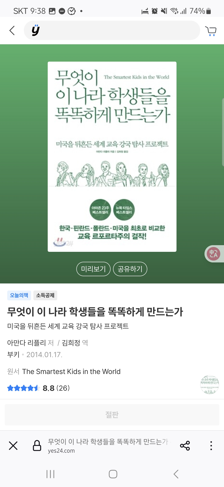
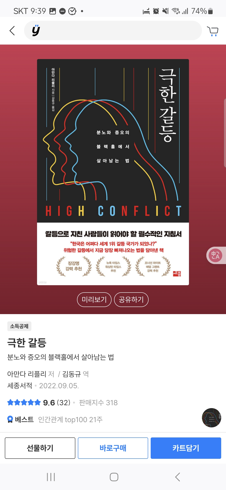

<!-- gid:20250523T110942 -->
[TOC]

[[TIP("이 노트에 대하여")]] 아만다 리플리가 세계 교육 강국의 사례를 취재하며 교육 시스템의 차이를 어떻게 드러내는지 본다. [[/TIP]] History - [2025-05-23 Fri 11:09] 돌아다니다가 Related-Notes - [교육](https://wikidocs.net/380656)
-   [데이비드엡스타인 늦깎이 천재들의 비밀 - 조기교육 전문화 비판](https://wikidocs.net/382437)

## BIBLIOGRAPHY

  “아만다 리플리와 『무엇이 이 나라 학생들을 똑똑하게 만드는가』를 소개해줘.” n.d. Accessed May 21, 2025. [https://www.perplexity.ai/search/amanda-ripeulriwa-mueosi-i-nar-5OS5GV.JSaezyU3WW8Jtxw](https://www.perplexity.ai/search/amanda-ripeulriwa-mueosi-i-nar-5OS5GV.JSaezyU3WW8Jtxw).

## 로그

### [|2025-05-23 Fri 11:10|](https://wikidocs.net/380415.md#h-2025-05-23/)

#### 아만다 리플리와 『무엇이 이 나라 학생들을 똑똑하게 만드는가』를 소개해줘

(“아만다 리플리와 『무엇이 이 나라 학생들을 똑똑하게 만드는가』를 소개해줘” n.d.)

Who is Amanda Ripley and what is her book "The Smartest Kids in the World" about?

아만다 리플리(Amanda Ripley)는 미국의 저널리스트이자 논픽션 작가로, _타임(Time)_, _애틀랜틱(The Atlantic)_, _워싱턴 포스트(The Washington Post)_ 등 유수의 매체에 기고하며 사회, 교육, 인간 행동 등 다양한 주제를 심층적으로 다뤄왔습니다. 그녀는 코넬 대학교(Cornell University)에서 정부학을 전공했으며, _The Smartest Kids in the World_ 를 비롯한 여러 권의 책을 집필했습니다. 이 책은 뉴욕타임스 베스트셀러에 오르며 큰 반향을 일으켰습니다[1][4][6].

##### 『무엇이 이 나라 학생들을 똑똑하게 만드는가』(The Smartest Kids in the World) 개요

이 책은 아만다 리플리가 미국 교육의 한계와 현실에 충격을 받고, 세계 교육 강국들의 비밀을 밝히기 위해 3년에 걸쳐 진행한 대규모 프로젝트의 결과물입니다. 저자는 핀란드, 한국, 폴란드 등 국제학업성취도평가(PISA)에서 상위권을 차지한 국가들을 직접 방문하고, 400여 명의 교육 관계자를 인터뷰하며, 미국 학생 3명이 교환학생으로 각국에서 1년간 생활하는 과정을 밀착 취재했습니다[5][7][8].

-   **현장 르포르타주**  저자는 단순히 통계와 데이터에 의존하지 않고, 교환학생들의 실제 경험을 통해 각국 교육 시스템의 차이와 특징을 생생하게 전달합니다. 이를 통해 미국, 한국, 핀란드, 폴란드의 교육 현실을 객관적으로 비교 분석합니다[5][7].

-   **교육 강국의 공통점**  핀란드, 한국, 폴란드 모두 불과 수십 년 전만 해도 평균 이하의 교육 성과를 보였으나, 교사 수준의 향상, 교육에 대한 사회적 합의, 부모와 정부의 적극적 역할 등으로 급격한 변화를 이뤄냈습니다. 학생 개인의 노력만으로는 세계적 수준의 교육 성취가 불가능하며, 교사·학생·부모의 삼위일체적 협력이 필수임을 강조합니다[8].

-   **실제 사례 중심**
    -   미국 오클라호마 출신의 킴은 핀란드로,
    -   미네소타 출신의 에릭은 한국으로,
    -   펜실베이니아 출신의 톰은 폴란드로 교환학생을 떠나 각국의 교육 문화를 직접 체험합니다. 이들의 경험을 통해 각 나라 교육의 강점과 한계, 학생들의 삶과 고민을 구체적으로 보여줍니다[3][5][7].

-   **한국 교육의 재조명**  저자는 한국 교육의 장점과 가능성, 그리고 한계와 문제점까지 객관적으로 조명합니다. 엄격한 목적의식, 치열한 입시 경쟁, 교사의 수준, 부모의 기대 등 한국 교육의 특수성을 미국과 비교하여 분석합니다[2][8].

-   **교육에 대한 새로운 시각 제시**  책은 각국의 사례를 통해 "무엇이 학생들을 진짜 똑똑하게 만드는가?"라는 질문에 대해, 교육 시스템의 구조, 교사의 질, 사회적 가치관, 부모의 역할 등 다차원적 요소가 결합되어야 함을 강조합니다.

---

##### 추천사 및 영향

이 책은 출간 직후 미국 사회에 큰 반향을 일으켰으며, 언론, 교육계, 정치권, 학부모 등 다양한 층에서 깊은 논의를 촉발했습니다. 특히 한국 사회에도 번역 출간되어 교육의 본질과 미래에 대해 다시 생각하게 하는 계기를 제공했습니다[7][8].

##### 참고 문헌

-   [1] Amanda Ripley - Wikipedia 
-   [2] 알라딘: 무엇이 이 나라 학생들을 똑똑하게 만드는가 
-   [3] Barnes &amp; Noble: The Smartest Kids in the World 
-   [4] Amanda Ripley 공식 홈페이지 
-   [5] 교보문고: 무엇이 이 나라 학생들을 똑똑하게 만드는가 
-   [6] Aspen Institute: Amanda Ripley 
-   [7] 예스24: 무엇이 이 나라 학생들을 똑똑하게 만드는가 
-   [8] 문화체육관광부 추천도서: 무엇이 이 나라 학생들을 똑똑하게 만드는가

---

-   사용 모델: Perplexity (2025-05-21)
-   답변 작성 시각: 2025-05-21 21:37 KST
-   토큰 수: 약 1,300 tokens

-   Citations:
-   [1] <https://en.wikipedia.org/wiki/Amanda_Ripley>
-   [2] <https://www.aladin.co.kr/shop/wproduct.aspx?ItemId=35490151>
-   [3] <https://www.barnesandnoble.com/w/the-smartest-kids-in-the-world-amanda-ripley/1114708889>
-   [4] <https://www.amandaripley.com/about>
-   [5] <https://ebook-product.kyobobook.co.kr/dig/epd/ebook/E000003139539>
-   [6] <https://www.aspeninstitute.org/people/amanda-ripley/>
-   [7] <https://m.yes24.com/goods/detail/11987447>
-   [8] <https://www.mcst.go.kr/web/s_culture/book/bookView.jsp?pDetailSeq=526>
-   [9] <https://www.goodreads.com/author/show/1186320.Amanda_Ripley>
-   [10] <https://excelined.org/people/amanda-ripley/>
-   [11] <https://elementaryspeaking.com/2016/09/04/book-review-the-smartest-kids-in-the-world-and-how-they-got-that-way-amanda-ripley/>
-   [12] <https://www.goodreads.com/book/show/13259960-the-smartest-kids-in-the-world>
-   [13] <https://www.amandaripley.com>
-   [14] <https://greatergood.berkeley.edu/profile/amanda_ripley>
-   [15] <https://www.linkedin.com/in/amanda-ripley-50a22112>
-   [16] <https://einhorncollaborative.org/through-the-prism-with-amanda-ripley/>
-   [17] <https://www.congress.gov/117/meeting/house/112836/witnesses/HHRG-117-MH00-Bio-RipleyA-20210624.pdf>
-   [18] <https://www.aladin.co.kr/shop/wproduct.aspx?ISBN=9788960513693>
-   [19] <http://blog.naver.com/goni1026/220844949086>
-   [20] <https://www.youtube.com/watch?v=kmbDxybvCkc>

Answer from Perplexity: <https://www.perplexity.ai/search/amanda-ripeulriwa-mueosi-i-nar-5OS5GV.JSaezyU3WW8Jtxw?utm_source=copy_output>

## DONE 아만다 리플리 Screenshot_20250521_213828_Firefox

;# 

![[../images/Screenshot_20250521_213828_Firefox.jpg|320]]

## DONE Screenshot_20250521_213912_Firefox

;# 

![[../images/Screenshot_20250521_213912_Firefox.jpg|320]]
