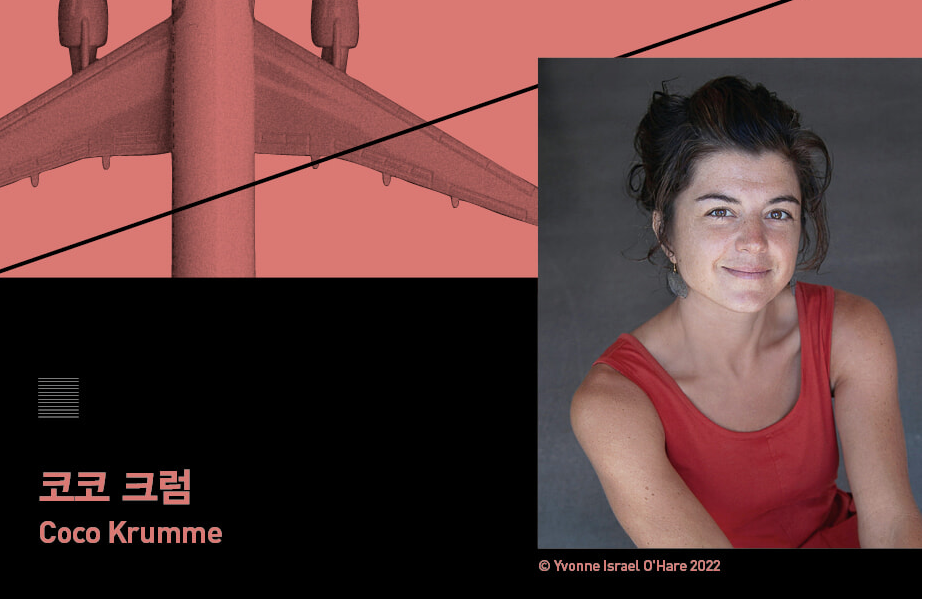

<!-- gid:20250524T133025 -->
[TOC]

[[TIP("이 노트에 대하여")]]
최적화 집착이 개인의 선택과 사회 시스템을 어떻게 왜곡하는지 추적하며, 효율성보다 삶의 방향과 가치 판단이 왜 중요한지 묻는다.
[[/TIP]]

## History

-   [2025-05-24 Sat 13:30] 놀라운 책이다

## Related-Notes

-   [칼뉴포트 딥워크 슬로우워크 디지털미니멀리즘](https://wikidocs.net/382039)
-   [올리버버크먼 4000주 불완전주의 삶의유한함 받아들임](https://wikidocs.net/382132)
-   [데릭시버스 삶철학 마인드셋 탐구 질문](https://wikidocs.net/381910)

## BIBLIOGRAPHY

- 코코 크럼. 2025. <i>최적화라는 환상 : 최고의 효율, 최선의 선택은 과연 이 세상에 존재하는가</i>. Translated by 송예슬. 위즈덤하우스. [https://m.yes24.com/goods/detail/145019354](https://m.yes24.com/goods/detail/145019354).
- “유전자 변형 생물 Genetically Modified Organism, GMO.” 2025. [https://ko.wikipedia.org/w/index.php?title=%EC%9C%A0%EC%A0%84%EC%9E%90_%EB%B3%80%ED%98%95_%EC%83%9D%EB%AC%BC&#38;oldid=39121399](https://ko.wikipedia.org/w/index.php?title=%EC%9C%A0%EC%A0%84%EC%9E%90_%EB%B3%80%ED%98%95_%EC%83%9D%EB%AC%BC&oldid=39121399).
- “노먼 볼로그 Norman Borlaug, 1914 미국의 농학자 식물병리학자.” 2025. [https://ko.wikipedia.org/w/index.php?title=%EB%85%B8%EB%A8%BC_%EB%B3%BC%EB%A1%9C%EA%B7%B8&#38;oldid=39569795](https://ko.wikipedia.org/w/index.php?title=%EB%85%B8%EB%A8%BC_%EB%B3%BC%EB%A1%9C%EA%B7%B8&oldid=39569795).

## 최적화라는 환상 : 최고의 효율, 최선의 선택은 과연 이 세상에 존재하는가

(코코 크럼 2025)

-   OPTIMAL ILLUSIONS: The False Promise of Optimization

코코 크럼 송예슬 2025

최적화로 흥한 나라, 효율성의 성지 미국에서최적화의 실체와 대안을 찾아 헤매다최적화는 현대 세상을 작동시키는 원칙이다. 우리는 생산성과 최적의 성과에 집착하며 일상에서도 효율성을 추구한다. 어떻게 하나의 수학적 개념이 이토록 거대한 문화의 형태를 갖추게 되었을까? 그리고 효율성을 얻는 바람에 우리가 잃고 있는 것은 무엇일까? 응용 수학자이자 데이터 과학자인 저자는 실리콘 밸리를 대표하는 기업가 샘 올트먼, 라이프 스타일 구루이자 정리 전문가인 곤도 마리에부터 GMO 재배를 반대하는 농부, 멸종 위기 버펄로 복원에 인생을 건 토착민까지 다양한 사람들의 다채로운 이야기를 훑으면서 미국의 건국 원칙에 뿌리를 내리고 현대 사회에 나타나고 있는 최적화의 놀라운 역사를 추적한다. 온 세상을 집어삼킨 최적화라는 메타포를 집요하게 파고들고, 그 안에서 우리가 벌이고 있는 거대한 도박의 실체를 들추며, 휘둘리거나 끌려가지 않고 나아가려면 어떤 태도를 취해야 하는지 생각해보자고 촉구한다.

### 1장 다시 찾은 평면 세계

### 2장 라스베이거스를 떠나며

### 3장 고지대 사막의 교회

### 4장 메타포의 붕괴

### 5장 가짜 신들

### 6장 최적화의 배반

### 7장 골드러시가 끝나고

### 8장 바빌로니아

### 감사의 말

### 주

### 출판사 리뷰

전 세계를 장악한 최적화 절실히 필요해진 새로운 접근 방식

-   "놀랍도록 시의적절한 책!"_칼 뉴포트
-   "응용 수학자가 모든 것을 최적화하려는 시대정신에 도전한다."_애덤 그랜트

최적화의 메카 실리콘 밸리를 탈출한 수학자가 데이터 바깥세상을 횡단하며 길 위에서 목격하고 생각한 것들

최적화는 현대 세상을 작동시키는 원칙이다. 우리는 어느 때보다 저렴하고 신속하게 물건을 만들고 운송할 수 있다. 최적화된 모델은 항공기 운항 일정부터 데이트 상대 매칭 사이트까지 모든 것을 떠받들고 있다. 이제 최적화는 우리의 물질적 현실은 물론 우리가 거기서 생산해내는 것들을 구성하게 된 기술과 사고방식에까지 깊이 스며들어 있다. 어떻게 하나의 수학적 개념이 이토록 거대한 문화의 형태를 갖추게 되었을까? 그리고 효율성을 얻는 바람에 우리가 잃고 있는 것은 무엇일까? 코코 크럼은 수학적 모델에 매혹되어 MIT에서 수학을 공부했고 실리콘 밸리에서 데이터 과학자로 일했으며 과학 컨설팅 업체를 차려서 운영했다. 한때 열정을 불태우며 "더 많은 데이터를, 더 많은 모델을, 더 많은 해법을" 추구했으나 왠지 모르게 그 낭만이 차츰 시들해졌다. 세상이 최적화에 열광할수록 크럼의 내면에서 불신이 깊어졌다.

나의 환멸은 테크 업계의 과잉에 뿌리를 내린 것이었으나 거기서 시작되거나 끝나는 감정이 아니었다. 나는 회사 일정의 짐스러움을 개탄했고, 10년 가까이 당당하게 구식 플립 폰을 고집했다. 실리콘 밸리 탈출을 궁리하면서 한편으로는 그 세계를 어떻게 하면 무너뜨릴 수 있을지 고민하기 시작했다. (10쪽)

크럼은 불현듯 2020년, 정답처럼 추종해왔던 '최적화'와 '효율성'이라는 가치에 의구심을 품고 미국 전역을 돌아다니며 사람들을 만나기 시작했다. 『최적화라는 환상』은 그 흥미로운 탐구와 모험의 결과물이다. 이 책에서 크럼은 실리콘 밸리를 대표하는 기업가 샘 올트먼, 라이프 스타일 구루이자 정리 전문가인 곤도 마리에부터 GMO 재배를 반대하는 농부, 멸종 위기 버펄로 복원에 인생을 건 토착민까지 다양한 사람들의 다채로운 이야기를 훑으면서 미국의 건국 원칙에 뿌리를 내리고 현대 사회에 나타나고 있는 최적화의 놀라운 역사를 추적한다.

-   세상의 모든 것을 숫자로 바꾸면 영원히 성장하리라는 착각
-   효율성과 수익성의 탈을 쓴 최적화의 불도저가 '여유'와 '장소'와 '규모'를 파묻어버렸다!

"더 많이. 더 좋게. 더 빨리." 이 표현이 비즈니스뿐 아니라 일상까지 장악해버렸다. 매년 업그레이드되는 신형 스마트폰은 더 빠른 속도, 더 선명한 화질을 약속한다. 수많은 다이어트와 건강 관련 업체는 단기간에 원하는 몸무게와 체형을 가질 수 있다고 장담한다. 작은 가게를 하는 사업가는 언제 규모를 키워서 확장할 거냐는 질문을 반드시 받는다. 이렇듯 최적화는 우리가 세상을 바라보는 렌즈가 되었다. 그 결과 우리는 모든 것을 쪼개서 바라보고, 비교 우위와 실적과 생산성을 따지고, 온갖 루틴을 어떻게든 효율적으로 다듬는다. 자연을 활용하고 주변 세상을 설계하며, 관찰에서 통제로 초점을 옮겨놓았다. 무엇보다 우리는 계속 상승하는 운명을, 더 높은 것을 향해 앞으로 나아가는 진보를 기대하며 영원한 성장을 꿈꾸게 되었다.

이러한 최적화의 기세는 미국에서 단연 두드러지게 나타났다. 미국은 최적화로 흥한 나라, 효율성의 성지라 해도 과언이 아니다. 헨리 포드를 필두로 등장한 효율성 전문가 군단과 민중 영웅들은 규모의 경제를 통해 더욱더 잘살 수 있다는 믿음을 미국 정치인과 대중에게 심어놓았다. 그 산물 중 하나가 극도로 대형화된 미국 농업이다. 크럼이 최적화를 탐구하기 위해 처음으로 찾은 곳이 엄청난 양의 설탕을 생산하는 다코타 평원의 사탕무 농장인 이유다. 인력을 대신할 기계, 튼튼한 종자, 병충해를 막아줄 화학 물질 덕분에 농지는 끝없이 확장되었고 먹거리는 한없이 풍성해졌다. 그 대가로 기계가 토양을 고갈시키고, 화학 물질이 인간의 건강에 해롭고, 비료가 식수를 더럽힌다는 사실은 너무나 쉽게 외면당했다.

우리는 효율성과 수익성이라는 하나의 목표를 좇으며 최적화의 혜택을 누렸다. 경제가 성장했고 인구가 늘었으며 세상이 발전했지만, 뭔가가 허전하다. 사탕무 수확물로 뒤덮인 다코타 평원이 왠지 공허해 보인다. 바로 그것이 최적화의 이면이다. 우리는 여유(slack), 장소(place), 규모(scale)를 잃었다. 외부에서 받는 충격을 완화해줄 여유를, 다양한 농법을 적용할 만한 장소(토지)를, 작든 크든 단기적이든 장기적이든 각자의 상황에 따라 선택되는 규모의 감각을 상실했다. 우리가, 사회 전체가, 알았든 몰랐든, 이 흥정에 기꺼이 응했다. 한때 우리는 그 달콤한 과실을 정신없이 누렸으나 지금은 그 대가가 서서히 그늘을 드리우고 있다.

누구에게 묻느냐에 따라 답은 달라질 테지만, 지금 우리는 불안의 시대, 나르시시즘의 시대, 제4의 전환 또는 제국의 몰락을 지나고 있다. 신자유주의 질서와 성장이 끝나가고, 권위주의가 발흥하고, 암흑기 또는 기후 재앙의 서막이 올랐다. 종말의 감각이 깨어나고 있다. 〈포브스〉에 따르면, 밀레니얼 세대를 중심으로 '아포칼립스 이전(pre-apocalypse)'을 주제로 한 텔레비전 프로그램이 인기를 끌고 있다고 한다. 최적화가 우리의 시간과 관심을, 심지어는 미래를 몽땅 집어삼켰다. 우리의 배와 일정을 두둑이 채웠으나 왜라는 질문에 관해서는 공백을 남겨놓았다. (13쪽)

"최적화를 강화하는 것도, 최적화에서 탈출하는 것도 답이 될 수 없다면 어떡해야 할까?" 무한한 개발과 지속적 성장이 멈춘 시대, '최적화라는 환상'을 똑바로 바라보자는 결심

과도한 효율성에 대한 환멸은 굳이 수학자가 아니어도 많이들 공감할 것이다. 시간과 돈을 최대한 낭비 없이 생산적으로 쓰려고 갖은 애를 쓰지만, 어느 순간 압도감에 숨이 막히고 최적화로 해결할 수 없는 문제들에 부딪힐 때 불만감이 솟구친다. '지금 내가 옳은 일을 하고 있나? 옳은 일은 대체 뭐지?' 이 감정은 하늘 높이 치솟는 우울증과 불안증 발병률, 점점 가시화되는 공급망과 사회의 붕괴, 고비용의 대도시 직장 생활, 급격히 추락하는 결혼율과 출산율 같은 증상으로 나타난다. 고삐 풀린 성장이 우리를 위한 게 아니며, 값싼 생산물과 고층 건물처럼 숱한 최적화의 산물에도 불구하고 우리가 어느 정도 주체성을 상실했다는 감각이 만연하지만, 뾰족한 대안은 보이지 않는다. 최적화의 신도들은 오히려 효율성을 강화해 이런 불만감을 잠재울 수 있다고 주장한다.

반면 그 반대편에 있는 사람들은 효율성에서 탈출하거나 그것을 총체적으로 무효화해야 한다고 반박한다. 그런데 문제는, 두 방법 모두 최적화의 우위를 영속화한다는 것이다. 첫 번째 방법은 탈최적화의 방법으로서 도리어 최적화를 공고히 하며, 두 번째 방법은 현시점에 가진 칩을 과거의 기준에다 몽땅 욱여넣는다는 점에서 최적화의 우위를 지속한다. 최적화를 강화하는 것도, 최적화에서 탈출하는 것도 답이 될 수 없다면 어떡해야 할까? 우리의 생계와 삶의 질, 사람들과 맺는 관계와 세상을 이해하는 방식은 모두 최적화에 기대고 있다. 하지만 최적화를 영영 떠날 수 없다고 해서, 끓어오르는 불만감, 병들고 피폐해져가는 자연과 세상을 외면하는 것은 답이 아니다. 이런 맥락에서 크럼은 최적화에 휘둘리거나 끌려가지 않고 나아가려면 어떤 시각을 가져야 하는지, 어떤 태도를 취해야 하는지부터 진지하게 생각해봐야 한다고 주장한다.

우리가 불법 점거한 저택과 항공 물류 허브가 지어지는 땅 밑에 층층이 쌓인 폐허들을 인정하지 않는다면 앞으로 나아갈 수 없다. 이제 우리가 해야 할 일은 완전한 화해나 해체가 아니라, 바라보는 시각을 선택하는 것인지도 모르겠다. (278쪽)

크럼은 이 책에서 온 세상을 집어삼킨 '최적화'라는 세계관에 집요하게 물음표를 던진다. 그리고 그 끝에 맹목적인 수용도 급진적인 저항도 답이 아니며 우리를 둘러싼 '최적화'의 언어 자체를 내려놓자고 과감하게 제안한다. 숨가쁠 정도로 빠른 기술 발전에, 성장과 개발을 향해 맹렬히 달려가는 욕망에 브레이크를 걸어야 한다고 생각하는 사람들에게 『최적화라는 환상』은 막연한 문제의식을 다채로운 경험과 사례를 통해 선명하게 구체화하는 지적 즐거움의 시간을, 깨뜨리려는 생각조차 하지 못했던 틀에 박힌 관점 전환의 기회를 제공할 것이다.

## 저 : 코코 크럼 (Coco Krumme)

응용 수학자이자 작가. 예일대학교를 졸업하고 MIT에서 박사 학위를 받았다. 실리콘 밸리에서 데이터 과학자로 일했고 캘리포니아대학교 버클리 캠퍼스, 미시간대학교 등에서 데이터 과학을 가르쳤으며 과학 컨설팅 업체 '리워드 코(Leeward Co)'를 차려서 운영했다. 현재는 인터넷도 잘 터지지 않는 태평양 북서부 외딴섬의 허름한 오두막에 살고 있다. 《최적화라는 환상》은 코코 크럼의 첫 책이다.

 코코님

### 역 : 송예슬

대학에서 영문학과 국제정치학을 공부했고 대학원에서 비교문학을 전공했다. 바른번역 소속 번역가로 활동하며 의미 있는 책들을 우리말로 옮기고 있다. 옮긴 책으로는 『GEN Z』 『눈에 보이지 않는 지도책』 『사울 레이터 더 가까이』 『스트라진스키의 장르문학 작가로 살기』 『언캐니 밸리』 등이 있다.

## DONE 노먼 볼로그 Norman Borlaug, 1914 미국의 농학자 식물병리학자

(“노먼 볼로그 Norman Borlaug, 1914 미국의 농학자 식물병리학자” 2025) 노먼 볼로그(Norman Borlaug, 1914년 3월 25일 \textasciitilde{} 2009년 9월 12일)는 미국의 농학자이며 식물병리학자이다. 세계적인 식량 증산에 기여하여 녹색 혁명을 이끈 공로로 1970년에 노벨 평화상을 수상하였다. 그는 이제까지 노벨 평화상, 미국 대통령 자유 메달, 미국 의회 금메달을 모두 받은 다섯 명 중 한 명이다. 1942년 미네소타 대학에서 식물병리학과 유전학으로 박사학위를 받았으며 이후 멕시코에서 높은 수확을 올리고 병해에 강한 키 작은 밀의 변종을 만드는 일을 했다. 20세기 중반동안 볼로그는 이러한 고수확 작물을 개발하고 멕시코, 파키스탄 그리고 인도 등에 소개하고 재배법을 가르쳤다. 그 결과로 멕시코에서는 1963년부터 밀 수출국으로 변했으며 파키스탄과 인도에서는 1965년에서 1970년사이에 밀 생산량이 두배로 증가하였다. 이러한 식량문제의 해결은 이들 국가와 국민들이 가진 커다란 어려움 "배고픔"을 해결하는 데 결정적인 역할을 하게 되었다. 이러한 성공은 녹색혁명으로 널리 알려진다. 이후 수십억 명의 사람들이 그 혜택으로 기아와 배고픔에서 해방되었다. 이렇게 식량 증산으로 세계 평화에 공로한 기여로 1970년 볼로그는 노벨 평화상을 수상하였다. 만년에도 아시아와 아프리카 지방에서 식량증산을 위한 방법을 찾고 적용하는 데 힘을 쏟았다. 그러나 그의 작업은 환경보호론과 사회경제적인 면에서 비판을 받고 있기도 하다. 1986년에는 세계식량상을 제정하여 세계에서 식량의 질적, 양적 그리고 유용성을 개선하는 데 기여한 인물에게 상을 수여하고 있다.

-   유전자 변형 생물 genetically modified organism, GMO (Slipbox) (“유전자 변형 생물 Genetically Modified Organism, GMO” 2025)
