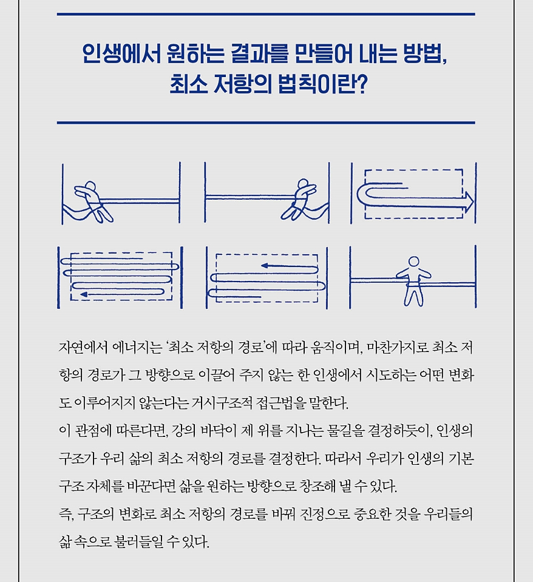

<!-- gid:20250604T185009 -->
[TOC]

[[TIP("이 노트에 대하여")]]
삶의 문제를 의지보다 구조의 문제로 보며, 창조적 삶을 위해 정체성과 행동 패턴을 어떻게 재구성할지 제안한다.
[[/TIP]]

## History

-   [2025-06-07 Sat 02:58] 최소 작용 원리
    -   최소 작용의 원리\*: 물리학에서, 이 방정식은 최소 작용의 원리(Principle of Least Action)를 수학적으로 표현한 것입니다. 즉, 물리적 시스템은 작용(액션)을 최소화하는 경로를 따른다는 원리입니다.
-   [2025-06-04 Wed 18:50] 최소 저항의 법칙
-   [알렉스룽구 의미 있는 삶을 위하여: 의식성장을 통한 진정한 삶의 여정](https://wikidocs.net/382470)
-   [그렉맥커운 에센셜리즘 최소노력의법칙](https://wikidocs.net/381903)
-   [피터센게 학습하는 조직 - 기업 경영](https://wikidocs.net/382050)

## 저 : 로버트 프리츠 (Robert Fritz)

세계적인 경영 컨설턴트이자 교수, 작곡가, 영화감독, 작가이다.

&lt;포춘&gt; 500대 기업을 포함하여 정부와 비영리 단체를 망라하는 조직들에서 구조적 접근법을 도입할 수 있게 도왔다. 그의 컨설팅 영역은 개인의 창조 프로세스에서 시작하여 조직의 비즈니스 전략으로까지 확장되었다. 그는 개인과 조직이 지속적인 고효율을 창출하는 방법에 관한 혁명적 변화를 이끌고 있다. 지난 25년 동안 27개국 8만 명 이상의 사람들이 그가 개발한 교육 프로그램을 이수했다.

프리츠는 테크놀로지 포 크리에이팅(Technologies for Creating®, Inc.)과 프리츠 컨설팅그룹의 창립자이자 초이스 포인트(Choice point, Inc.)의 공동 설립자이다. 피터 센게와 함께 창조 프로세스의 원칙을 사용하여 조직을 구축하도록 돕는 회사 이노베이션 어소시에이츠(Innovation Associates)를 공동 설립했다. 지은 책으로는 《최소 저항의 법칙》《예술로서의 삶》《아이덴티티》 등이 있다. 부인이자 동료 로절린드와 함께 버몬트에서 살고 있다.

## 최소 저항의 법칙

-   The path of least resistance

(로버트 프리츠 1989)

로버트 프리츠 1989

### 책소개

진정 중요한 것을 우리 삶 속으로 불러오는 독창적인 방법! 50년간 창조성의 비밀을 탐구한 현대의 고전 마침내 완역 출간!

오늘날 창조성 분야에서 가장 독창적인 사상가 중 한 명인 로버트 프리츠의 대표작 《최소 저항의 법칙》이 국내 최초 완역 출간되었다. 피터 센게를 비롯한 경영 대가들의 참고도서 목록에서나 만날 수 있던 이 책은 창조적 삶을 살고자 하는 소수들로부터 조용하지만 강력한 지지를 받고 있었다. 마침내 선보이는 이번 한국어판은 한국 독자를 위한 저자의 특별 서문과 하이어셀프 대표 알렉스 룽구의 추천사를 수록하고 있다.

로버트 프리츠의 독창적인 사상은 '구조가 행동을 결정한다'는 시스템 사고의 관점에서 사람의 생애에 나타나는 장기적인 패턴을 설명하는 '구조적 접근법'에 있었다. 그는 사람들의 삶에서 두 가지의 유형화된 패턴을 발견했다. 그것은 바로 진동과 해소였다. 그로부터 그는 '왜 이런 패턴들이 존재하는지', '진동을 해소로 변화시킬 방법은 무엇인지'를 연구하기 시작했다. 그는 점점 구조에 관한 더 깊은 질문으로 나아갔으며, 결국 구조 컨설팅 분야를 창시하기에 이르렀다. 《최소 저항의 법칙》은 구조와 인간 행위의 관계에 관해 그가 쓴 첫 번째 중요 저술이며, 세계적 베스트셀러이기도 하다.

-   추천의 글 - 한국어판 서문 - 개정판 서문 - 들어가며

### 1부 기본 원칙

-   1 장 최소 저항의 경로
-   2 장 반동-순응 지향성
-   3 장 문제 해결은 창조가 아니다
-   4 장 창조
-   5 장 창조의 지향성
-   6 장 긴장은 해소되고 싶어 한다
-   7 장 보상 전략
-   8 장 구조적 긴장
-   9 장 비전
-   10 장 지금의 현실

### 2부 창조 프로세스

-   11 장 창조 사이클
-   12 장 발아와 선택
-   13 장 일차 선택, 부차적 선택, 근본적 선택
-   14 장 동화
-   15 장 모멘텀
-   16 장 전략적 순간
-   17 장 완성

### 3부 초월

-   18 장 미래의 신호, 시대의 신호
-   19 장 초월의 힘

-   감사의 글

### 책 속으로

인간의 정신에는 우리 안에서 가장 높은 곳에 도달하려는 본능을 지닌 무언가가 있다. 창조하고, 새로운 것을 만들고, 우리의 삶과 세상을 만드는 정신이다. 그리고 그것이 이 책을 한국 독자들에게 소개하게 되어 매우 기쁜 이유이기도 하다. 자신의 삶이 이 책에 있는 원리와 일치한다는 것을 많은 이들이 경험적으로 느끼게 될 것이기 때문이다. 또한 여러분은 이 원리가 한국 문화의 가장 좋은 부분에 이미 붙박여 있음도 깨닫게 될 것이다. ---「'한국어판 서문' 」중에서

책을 읽으면서 머리를 망치로 맞은 듯한 충격을 받았고, 당시에는 로버트 프리츠 선생님이 제 삶의 중요한 멘토가 될 것임을 모른 채 그저 그 아이디어에 매료돼 무작정 용기를 내 그를 만나러 미국 버몬트행 비행기 표를 끊었습니다. 버몬트의 아름다운 숲속에 위치한 프리츠의 목장에서 워크숍을 들으며 로버트와 그의 아내 로절린드가 얼마나 진정성 있게 그 철학을 꿰뚫고 있는지 그리고 그것을 어떻게 주위와 함께 나누고 있는지, 그 활약상을 직접 목격하고 배울 수 있었습니다. 제가 프리츠의 책과 워크숍에서 직접 경험하고 배운 내용들은 정말 많지만 제 삶에 직접 적용하여 효과가 있었던 세 가지 정수들을 여기서 안내해 드리려고 합니다. ---「'추천의 글 : 고생 중독의 삶에서 창조하는 삶으로' 」중에서

프리츠는 이 상황을 "당신이 당신의 모든 문제를 해결해도 원하는 것은 갖고 있지 않을 것이다"라는 말로 명확하게 설명하고 있습니다. 우리는 늘 외적 현상에 반응하느라 펄쩍펄쩍 뛰어다니는 고생을 하면서 자꾸 그 다양한 외부 현상 안에 갇혀 있다고 생각합니다. 내 모든 주의를 문제 해결에만 기울이면 어쩔 수 없이 문제만 보이기 때문입니다. 이것은 우리 의식이 그야말로 '문제의 덫'에 걸려 있는 상태입니다. 원하는 삶을 직접 구축하지 않는 한, 문제를 해결한다고 해서 원하는 삶을 살 수 있는 것은 아닙니다. 그냥 새로운 문제가 나타날 때까지 기다리는 것뿐입니다. 우리는 문제로부터의 일시적 자유로 생기는 안도감을 행복이라고 혼동하지만 그런 '안도 행복'은 오래 가지 않습니다. 왜냐하면 문제가 잠깐 없어졌을 뿐 여전히 원하는 삶을 살고 있지 않기 때문입니다. ---「'추천의 글' 」중에서

《최소 저항의 법칙》에서 내가 묘사하는 또 다른 세상이 있다. 바로 '구조의 본성'과 관련된 세상이다. 우리들 대부분은 구조에 대한, 그리고 구조가 우리 삶에 어떻게 영향을 끼치는지에 관한 주제를 접해 본 적이 없다. 많은 사람에게 이러한 통찰은 새로운 눈이 번쩍 뜨이는 것이나 마찬가지일 것이다. 구조의 영역을 탐사하면 우리 삶에서 자꾸만 반복되는 패턴의 일부가 이해되기 시작한다. 그러면서 점차 이 패턴들이 어떻게 해서 생기며, 우리는 왜 원하지 않는 패턴을 제거하지 못하는지, 우리가 원하는 환경으로 이끌어 줄 새로운 구조는 어떻게 구축할 수 있는지 차차 이해하게 될 것이다. ---「'개정판 서문' 」중에서

두 번째 통찰도 마찬가지로 필수적인 것이다. '인생의 기본 구조가 최소 저항의 경로를 결정한다'는 것. 마치 보스턴 주변의 지형이 소가 지나가는 최소 저항 경로를 결정한 것과 같이, 강의 바닥이 제 위를 지나는 물길을 결정하는 것과 같이, 인생의 구조가 우리 삶의 최소 저항의 경로를 결정한다. 우리가 그 구조를 알아채고 있든 그렇지 않든 상관없이 그건 거기에 있다. 강의 구조는 물이 그걸 따라 흐르든 말든 변함없이 존재한다. 강바닥이 변하지 않는 한 물은 자연이 택해 온 경로를 따라 늘 흐르던 대로 흘러갈 것이다. 삶의 기본 구조가 바뀌지 않고 유지되는 한, 십중팔구 우리의 삶도 지금껏 따라왔던 것과 똑같은 방향으로 따라가게 될 것이다. 세 번째 통찰은 '삶의 근본적인 기본 구조를 바꿀 수 있다'는 것이다. 엔지니어들이 강바닥의 지형을 변화시킴으로써 강물의 줄기를 휘어 원하는 방향으로 흐르게 할 수 있는 것처럼, 우리도 인생의 기본 구조 자체를 바꿈으로써 삶을 원하는 방향으로 창조해 낼 수 있다. 게다가 새로운 기본 구조가 자리 잡게 되면, 강의 굽이치는 물살처럼 삶의 전반적인 추진력이 쇄도하여 우리가 진정으로 원하는 결과를 이루어 내게 해준다. 그 결과로 향하는 직접적인 경로가 바로 '최소 저항의 경로'가 되는 것이다. 사실 삶의 밑바탕이 되는 기본 구조에서 적절한 변화가 일어나면 최소 저항의 경로는 본인이 정말로 가고 싶은 길 외에는 그 어디로도 이끌지 않는다. ---「'1장. 최소 저항의 경로' 」중에서

상황을 삶의 중심으로 삼으면, 선택은 단 두 가지밖에 없는 것처럼 느껴진다. 상황에 순응하거나 상황에 대적해 맞대응, 즉 반동하는 것이다. '총아'가 되거나 '반항아'가 되거나. 반동하거나 순응하는 것은 단순히 인생을 어떻게 살 것인가 하는 방침이 아니다. 삶의 방식, 삶의 지향이 된다. 나는 이것을 '반동-순응 지향성(The Reactive-Responsive Orientation)'이라고 부른다. 이 지향성 안에서 우리는 상황에 맞춰 나름의 선택을 하고 자기 자신 혹은 미래의 자신을 만들어 간다. 대부분의 시간을 순응 모드로 지내면서 가끔씩 반동적으로 변하는 사람들이 있고, 주로 반동적으로 지내지만 이따금 순응적으로 변하는 사람들이 있다. 많은 사람에게 인생은 순응과 반동 사이에서 왔다 갔다 움직이는 무한 루프다. 즉, 진동하는 것이다. 그리고 진동은 더 잦은 진동을 일으킨다. 반동-순응 지향성은 우리가 무력하다는 것을 기본 전제로 한다. 우리가 습관적으로 환경에 반동하거나 순응한다고 할 때 상황을 그렇게 만드는 힘은 어디에 존재하는 걸까? 분명한 것은 그것이 우리의 외부, 즉 환경에 존재한다는 것이다. 그 힘이 우리 내부에 속해 있는 것이 아니기 때문에 우리는 무력하고 환경은 전능하게 되는 것이다. ---「'2장. 반동-순응 지향성' 」중에서

창조 프로세스는 환경에 반동-순응하는 것과 다른 구조를 지닌다. 이 구조는 진동하지 않고 지향성이 안정적이다. 환경에 대한 반동 또는 순응이 지향성일 수 있는 것처럼 창조 역시 마찬가지로 지향성이 될 수 있다. 반동-순응 지향성에 있는 사람들도 때로 창조를 하며, 창조 지향성에 있는 사람들도 환경에 반동-순응할 때가 있다. 지향성을 결정하는 것은 우리가 시간을 주로 어디에 쓰느냐에 달려 있다. 다수의 사람들에게는 삶의 많은 부분이 그가 살아가는 환경에 맞춰 조직된다. 그러나 어떤 사람들에게는 삶의 많은 부분이 그가 만들고 싶어 하는 창조 중심으로 조직된다. 두 지향성 사이에는 극적인 차이가 존재한다. 반동-순응 지향성에서 우리는 늘 환경의 변덕에 시달린다. 창조 지향성에서는 우리 스스로가 인생에서 우위를 점하는 창조적 영향력이 되며, 환경은 창조 프로세스에서 사용하는 영향력 중 하나에 불과하다. ---「'5장. 창조의 지향성' 」중에서

이렇게 스스로를 창조물과 분리하는 일은 창조 작업의 근원을 이해할 수 있게 해준다. 바로 사랑이다. '무언가를 창조하는 이유는 그것이 존재하는 것을 지켜보기만 해도 좋을 정도로 사랑하기 때문이다.' 진부하게 들릴지 모르겠지만 이 사랑은 진짜다. "자신이 하는 일을 사랑하세요, 조건 없이!"라는 말이나 주고받는 워크숍 같은 데서는 나올 수 없는 사랑이다. 단지 존재하는 것을 지켜보고 싶어 할 정도로 사랑하지 않을 바엔 창조를 할 이유가 없지 않을까? ---「'5장. 창조의 지향성' 」중에서

구조적 충돌의 본질적인 '해소되지 않음'이라는 성질을 벌충하기 위해 고안된 주요 전략이 세 가지 있다. '허용 가능한 충돌의 영역에 머물기', '충돌 조종', '의지력 조종'이 그것이다. 구조적 충돌 속에 있을 때는 일시적으로 욕망에 가 닿을 수 있을지 몰라도 계속 붙잡고 있기는 더욱더 어려워진다. 대단한 사랑도 고통스러운 관계로 변하고, 환상적인 일자리의 기회는 실망으로 변하며, 사업상의 승리는 재앙이 되고 만다. 최소 저항의 경로는 욕망하는 결과를 향해 나아가다가 멀어져 버리기 때문에, 우리는 장차 가지게 될 욕망들을 다루기 위해 이 세 가지 전략 중 하나 이상을 개발할 가능성이 있다. 그러나 그것들 모두가 진정한 창조의 방해물이다. 어느 것을 택하든 현재의 구조적 충돌을 강화하며 진동으로 이끌 뿐이다. 그런데도 그것들은 모두 우리 사회 전반과 우리의 인생 전반에 걸쳐 널리 퍼져 있다. ---「'7장. 보상 전략' 」중에서

인생의 구조를 바꾸는 것은 가능하지만, 앞에서 본 것처럼 변화를 바라고 하는 대부분의 시도들은 구조적 충돌 내에서 작동하는 전략일 뿐이다. 구조적 충돌은 해결되거나 해소되지 않으며 우리가 그 구조 내에서 취한 행동들은 오로지 보상과 진동으로만 이어진다. 이 구조의 힘이 압도적일 때, 행위의 패턴을 바꾸려고 하는 시도들은 에너지 낭비에 그친다. 구조를 바꾸려면 작동 중인 또 다른 구조가 있어야 하며, 이 새 구조가 오래된 구조보다 우위에 있어야 최소 저항의 경로가 바뀌고 에너지가 새 경로를 따라 쉽사리 이동할 수 있다. 구조적 충돌보다 우위에 있는 상위(Senior) 구조는 아래와 같은 특성을 지닌다. 1). 구조적 충돌을 내부로 자체 편입시킨다. 2). 복잡한 구조를 단순한 구조로 바꾼다. 크리에이터들은 창조 프로세스에서 이런 종류의 구조를 형성하는 방법을 알고 있으며, 구조의 경향성을 조율하여 '자신들이 창조하는 결과물'에 유리하게 해소하는 방법도 안다. 이런 구조에서는 작동 중인 여러 힘이 함께 작용하여 결과물을 창조하는 프로세스들을 강화시키며, 원하는 결과에 에너지를 집중시키고, 긴장이 해소를 향해 나아가는 추진력, 즉 모멘텀을 창출하게 한다. 이 상위 구조를 나는 '구조적 긴장'이라 부른다. ---「'8장. 구조적 긴장' 」중에서

### 출판사 리뷰

"망치로 머리를 맞은 듯한 충격을 주는 책!"_알렉스 룽구 창조적 삶을 살고자 하는 모든 사람을 위한 필독서

자기 인생의 혁신가들이 삶의 터닝포인트에서 만난 책! 27개국 8만 명 이상이 수료한, 인생을 바꾸는 창조 프로그램

로버트 프리츠는 보스턴 음악대학 작곡과에 재학 중이던 60년대에 작곡 예술의 핵심을 차지하는 구조적 원리가 인간 발달에 적용될 때 심오한 중요성을 갖는다는 것을 깨닫고 '구조적 접근법'을 연구하기 시작했다. 70년대 중반에 이르러 그는 음악, 회화, 무용, 영화, 문학 창작자들이 사용하는 창조적 과정이 사람들이 일상의 삶을 구축하는 과정에 정확히 같은 방식으로 적용될 수 있다는 통찰을 얻고, 개인에게 적용 가능한 '창조 프로세스'를 지도하기 시작했다. 80년대가 되자 그는 개인과 조직의 근본구조를 이해하고 그로부터 원하는 결과를 창출하는 방법을 다루는 구조 컨설팅을 창안해 냈고, 이 모든 성과를 《최소 저항의 법칙》에 담아 출간했다.

이 책에서 설명하는 '최소 저항의 법칙'이란, 자연에서 에너지가 최소 저항의 경로에 따라 움직이듯, 인생에서 시도하는 어떠한 변화도 최소 저항의 경로가 그 방향으로 이끌어 주지 않는 한 이루어지지 않는다는 거시구조적 접근법을 말한다. 이 관점에 따른다면, 강바닥이 제 위를 지나는 물길을 결정하듯이, 인생의 구조가 우리 삶의 최소 저항의 경로를 결정한다. 따라서 인생에서 원하는 결과를 만들어 내기 위해서는 인생의 근본구조 자체를 바꿔야 한다.

이는 기존의 자기계발에서 강조되던, 동기부여, 잠재의식 프로그래밍, 긍정적 사고의 강화 같은 '의지력 조종 전략'과는 완전히 다른 접근법으로, 새로운 구조의 창조를 통해 최소 저항의 경로를 바꿔 진정 중요한 것들을 우리 삶 속으로 불러온다는 아이디어였다. 그의 책은 출간 즉시 큰 호응을 얻었고, 지금까지 27개국 8만 명 이상이 그의 창조 교육 과정을 이수했다.

"문제 해결로는 우리 삶에 좋은 것을 불러올 수 없다" 의미 있는 인생을 창조하기 위한 삶의 법칙

《최소 저항의 법칙》에 따르면, 사람들의 삶에는 각자 고유한 패턴이 있지만 그럼에도 크게 두 가지의 일반적인 패턴으로 유형화될 수 있는데 그것은 바로 '진동'과 '해소'였다. 삶의 구조가 인생을 진동(oscillation)으로 이끄는 경우, 사람들은 대개 전진했다가 후퇴하는 경험을 끊임없이 반복한다. 인생을 바꾸고자 하는 시도는 구조의 작용 때문에 처음에는 효과를 보더라도 곧이어 듣지 않게 되고, 변화를 경험하기는 하되 지속적이지 않다. 이처럼 진동하는 구조에 갇힌 경우, 개선은 일시적이고 늘 원점으로 돌아가게 된다.

반대로 해소(resolution)의 구조는 우리를 최종 목적지로 이끌어 간다. 《최소 저항의 법칙》이 안내하는 창조 프로세스를 배우면 우리는 진동의 구조에서 벗어나 해소의 구조를 만들 수 있다. 구조적 사고법을 통해 우리는 먼저 제대로 된 질문을 할 수 있게 된다. '원치 않는 이 문제를 해결할 방법은 뭐지?'라고 묻는 대신, '내가 만들고 싶은 결과를 창조해 내려면 어떤 구조를 채택해야 하지?'라고 묻는 것이다. 즉, 문제 해결 지향성에서 창조 지향성으로 전환하게 된다. 이 작지만 획기적인 관점의 전환이 혁신의 시작이 된다.

"내 삶의 완전한 전환점이 된 책이다." _ 알렉스 룽구, 《의미 있는 삶을 위하여》 저자

"정말로 원하는 것은 무엇인가[비전]―지금 무엇이 진행되고 있는가[현실]" 논리적이고 체계적이며 강력한 창조 프로세스의 모든 것

그렇다면 진동하는 구조에 갇혔을 때 우리는 인생의 구조를 어떻게 바꿀 수 있을까? 《최소 저항의 법칙》에 따르면, 구조 내에서 변화를 바라고 시도한 대부분의 행동들은 다시 진동으로 이어지며 그저 에너지 낭비에 그치게 된다. 구조를 바꾸려면 기존의 구조보다 우위에서 작동중인 또 다른 구조가 필요하다. 이 상위 구조를 저자는 '구조적 긴장'이라고 부른다. 이 상위 구조가 진동 구조의 충돌을 내부로 편입해서, 원하는 결과물을 향해 나아가는 단순한 긴장-해소의 구조로 바꾸게 된다. 구조적 긴장은 1)창조하고자 하는 결과물의 비전과 2)현재 처한 현실에 대한 명확한 시각으로 이루어지며, 이 둘 사이의 불일치가 창조 프로세스에서 가장 중요한 구조적 긴장의 구조를 형성한다.

오늘날 대부분의 개인과 조직들이 추구해야 할 비전 대신에 풀어야 할 문젯거리들과 그 해결책에 대해서만 골몰하는 까닭은 정말로 원하는 것을 모르기 때문이다. 그리고 그것은 가능하다고 생각하는 것에서 원하는 것을 분리해 내는 습관이 없어서 그렇다. 가능성에 근거하느라 자신의 비전을 검열하거나 억제하는 것이다. 이는 실제로 자신에게 진실을 잘못 전달하는 일이며 창조 프로세스에서 발아의 에너지를 무력화시켜 결국 진동하는 구조에 머무르게 만든다.

원하는 것을 정확히 인식하는 것만큼 중요한 것은 현실을 있는 그대로 인식하는 법을 배우는 것이다. 대부분의 개인과 조직은 '어떻게 하여 지금에 이르렀는가'라고 끊임없이 질문한다. 하지만 제대로 된 질문은 '지금 무엇이 진행되고 있는가'이다. 지금 처한 곳에 어떻게 있게 되었는지를 골몰하는 것은 역설적으로 '우리는 정확히 지금 있는 곳에 있다'라는 진실에 대한 시각을 흐리게 만든다. 현실을 정확히 파악하고 스스로에게 사실적으로 보고하는 것에 능숙해진 사람들은 다음 단계로 나아가 창조하고 싶은 것을 창조할 기회를 갖게 된다.

이처럼 자신이 있는 곳(현실)과 어디에 있고 싶은지(비전)을 살피고 나서 창조하고자 하는 결과를 공식적으로 선택(구조적 긴장의 재구축)하는 것을 《최소 저항의 법칙》에서는 창조 프로세스의 중심축(pivotal) 기법이라고 부른다. 이는 발아와 선택, 동화와 모멘텀 그리고 완성으로 이어지는 창조의 사이클과 함께, 진동의 구조에서 벗어나 원하는 결과를 창조하는 해소의 구조로 나아가는 과정에서 강력한 힘을 발휘한다.

세계적 혁신 사상가 피터 센게의 '시스템 사고' 이론의 밑바탕이 된 책! 의식성장 리더 Higher Self Korea '알렉스 룽구' 강력 추천!

세계적 경영 혁신가 피터 센게는 "오늘날 비즈니스와 예술, 과학과 일상의 창조적 프로세스에 관한 한 가장 독창적인 사상가는 의심의 여지 없이 로버트 프리츠이며 그의 작업은 내게 깊은 영향을 미쳤다"라고 평가했으며, 100만 부 이상 판매된 경영의 고전 《학습하는 조직The Fifth Discipline》의 여러 페이지에 걸쳐 《최소 저항의 법칙》을 인용했다.

23만 구독자의 의식성장 채널 하이어셀프코리아의 알렉스 룽구도 자신의 책 《의미 있는 삶을 위하여》의 서두에서 로버트 프리츠를 자신의 멘토로 소개하고 사고방식과 철학, 탐구 방법론에서 그에게 빚지고 있음을 밝힌 바 있다. 알렉스 룽구는 《최소 저항의 법칙》의 추천사를 통해 다시 한번 창조 프로세스의 중요성을 강조한다. "로버트 프리츠는 삶을 꾸리는 것을 창조 과정에 비교합니다. 미술가가 '문제 해결'로 그림을 그리지 못하는 것처럼 우리도 진정 원하는 삶을 문제 해결로 얻을 수 없다는 점을 강조합니다. 원하는 삶의 형태를 구체적으로 설계했다면 그 삶을 예술품처럼 아름답게 만들면 됩니다. 로버트를 만나기 전, 저에게 '창조'는 모호하고 거의 신비주의처럼 와닿을 때가 많았습니다. 그런 저에게 그는 이 모호한 창조 과정을 처음으로 군더더기 없이, 논리적이고 체계적으로 설명해 주었습니다."

"피터 드러커의 책이 경영 실전서라면. 로버트 프리츠의 책은 창조 실전서이다." _ 메튜 쥬터, IRA회장

### 최소저항의법칙

## 정체성 수업 - 자신에게 몰두하는 일은 왜 인생을 망치는가 Identity

(로버트 프리츠 2023)

-   로버트 프리츠 박은영 2023

"자기에 대한 생각을 부추기는 문화의 미몽에서 깨어나게 만든 책"&ensp;알렉스 룽구, 『의미 있는 삶을 위하여』 저자창조성 분야의 세계적 사상가 로버트 프리츠 40년 연구의 결정판!'인생이라는 예술'을 창조할 힘과 자유를 주는 18강의 생각 수업『정체성 수업』은 ...

## 삶을 예술로 만드는 법: 창조 크리에이팅 수업

-   Your Life as Art

(로버트 프리츠 2024) 로버트 프리츠 신혜연 2024

"크리에이터가 되는 것보다 더 좋은 삶은 없다" 27개국 8만 명의 크리에이터를 구원한 인생 창작법 창작자의 경전 『최소 저항의 법칙』로버트 프리츠 최신작 『삶을 예술로 만드는 법』은 화가가 그림을 그리고, 작곡가가 곡을 쓰고, 시인이 시를 짓는 것처럼, 예술에서 쓰이는 창조의 원리를 적용해서 인생을 예술 작품처럼 만드는 방법에 관한 책이다. 저자 로버트 프리츠는 세계적 베스트셀러 『최소 저항의 법칙』 이후 꾸준히 발전시켜 온 창조성에 관한 자신만의 독창적 이론을 『삶을 예술로 만드는 법』에 이르러 원숙한 목소리로 유감없이 펼쳐 보인다. 이 책은 제목 그대로 '어떻게 삶을 예술로 만들 수 있는가'란 물음에 답하기 위해, 창조 프로세스의 실제와 그 메커니즘, 지향성, 인간 정신과의 긴밀한 관계를 밝혀낸다. 또 낡은 고정관념을 뒤흔들어 새로운 인식의 지평을 열고, 세상을 이해하는 방식을 완전히 바꿔, 삶의 역동성을 회복할 통찰력을 제공하는 혁명적인 책이다.

## 관련메타

-   [고전역학 - 뉴턴 라그랑주 해밀턴 - 최소작용의원리](https://wikidocs.net/380743)

## BIBLIOGRAPHY

- 로버트 프리츠. 1989. <i>최소 저항의 법칙</i>. Rev. and expanded. New York: Fawcett Columbine. [https://www.yes24.com/Product/Goods/108391965](https://www.yes24.com/Product/Goods/108391965).
- ———. 2023. <i>정체성 수업 - 자신에게 몰두하는 일은 왜 인생을 망치는가</i>. Translated by 박은영. [https://www.yes24.com/Product/Goods/118499339](https://www.yes24.com/Product/Goods/118499339).
- ———. 2024. <i>삶을 예술로 만드는 법: 창조 크리에이팅 수업</i>. Translated by 신혜연. [https://www.yes24.com/Product/Goods/125392174](https://www.yes24.com/Product/Goods/125392174).
