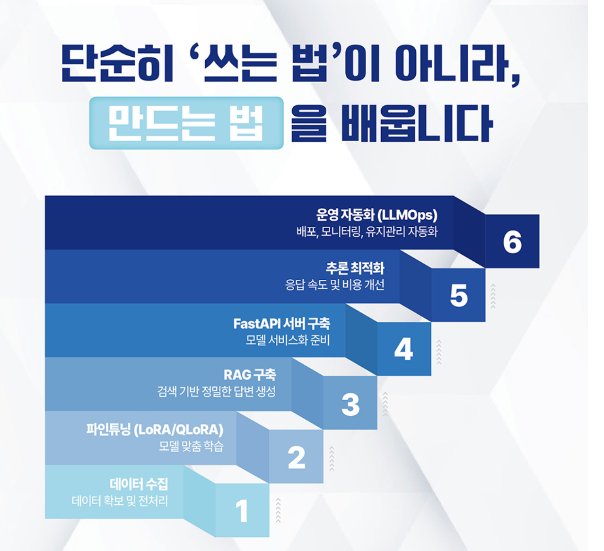

<!-- gid:20250629T112345 -->
[TOC]

[[TIP("이 노트에 대하여")]] RAG, 파인튜닝, LLMOps를 아우르며 대형언어모델을 실험에서 제품으로 옮기는 엔지니어링 실천을 정리한다. [[/TIP]] 히스토리 - [2025-06-29 Sun 11:23] 책 좋더라. 저자 서브스택도 좋더라. 관련노트 - [데니스로스먼 RAG 생성형 AI - 라마인덱스 검색 딥레이크 파인콘 파이프라인](https://wikidocs.net/382330)
-   [2b1d2d 크리스토퍼브루소 매슈사프 LLM 인 프로덕션 - 제품화 전략 류광](https://wikidocs.net/382495)

## 관련메타

-   [인공지능](https://wikidocs.net/380588)
-   [엣지 온디바이스 온프레미스](https://wikidocs.net/380721)
-   [서버 클라이언트 워크스테이션 클러스터](https://wikidocs.net/380788)

## BIBLIOGRAPHY

  폴 이우수틴. 2024. “Decoding ML.” October 22, 2024. [https://decodingml.substack.com/](https://decodingml.substack.com/).
  ———. 2025. “Build Your Second Brain Ai Assistant: Using Llms and Rag.” February 6, 2025. [https://decodingml.substack.com/p/build-your-second-brain-ai-assistant](https://decodingml.substack.com/p/build-your-second-brain-ai-assistant).
  ———. n.d.-a. “Decodingml/Llm-Twin-Course: 🤖 𝗟𝗲𝗮𝗿𝗻 for 𝗳𝗿𝗲𝗲 How to 𝗯𝘂𝗶𝗹𝗱 an End-to-End 𝗽𝗿𝗼𝗱𝘂𝗰𝘁𝗶𝗼𝗻-𝗿𝗲𝗮𝗱𝘆 𝗟𝗟𝗠 &#38; 𝗥𝗔𝗚 𝘀𝘆𝘀𝘁𝗲𝗺 Using 𝗟𝗟𝗠𝗢𝗽𝘀 Best Practices:  𝘴𝘰𝘶𝘳𝘤𝘦 𝘤𝘰𝘥𝘦 + 12 𝘩𝘢𝘯𝘥𝘴-𝘰𝘯 𝘭𝘦𝘴𝘴𝘰𝘯𝘴.” Accessed June 28, 2025. [https://github.com/decodingml/llm-twin-course](https://github.com/decodingml/llm-twin-course).
  ———. n.d.-b. “Decodingml/Second-Brain-Ai-Assistant-Course: Learn to Build Your Second Brain Ai Assistant with Llms, Agents, Rag, Fine-Tuning, Llmops and Ai Systems Techniques.” Accessed June 28, 2025. [https://github.com/decodingml/second-brain-ai-assistant-course](https://github.com/decodingml/second-brain-ai-assistant-course).
  폴 이우수틴, and 막심 라본. 2025. <i>LLM 엔지니어링 - RAG, 파인튜닝, Llmops로 완성하는 실무 중심의 LLM 애플리케이션 개발</i>. Translated by 조우철. [https://www.yes24.com/product/goods/145962625](https://www.yes24.com/product/goods/145962625).
  “Packtpublishing/Llm-Engineers-Handbook.” 2025. [https://github.com/PacktPublishing/LLM-Engineers-Handbook](https://github.com/PacktPublishing/LLM-Engineers-Handbook).

## LLM 엔지니어 핸드북 - RAG 파인튜닝 LLMOps

-   LLM Engineer's Handbook
-   폴 이우수틴 and 막심 라본 조우철 2025

(폴 이우수틴 and 막심 라본 2025) 프로덕션 수준의 LLM 애플리케이션을 개발하고 배포하는 데 필요한 엔지니어링 방법들을 상세히 안내한다. LLM 라이프사이클을 체계적으로 살펴보며, 데이터 엔지니어링부터 지도 학습 파인튜닝, 모델 평가, 추론 최적화, RAG 파이프라인 개발까지 핵심 개념과 실용적인 기술들을 다룬다.

### 책소개

LLM 엔지니어링의 모든 것을 망라한 실전 가이드

『LLM 엔지니어링』은 프로덕션 수준의 LLM 애플리케이션을 개발하고 배포하는 데 필요한 엔지니어링 방법들을 상세히 안내한다. LLM 라이프사이클을 체계적으로 살펴보며, 데이터 엔지니어링부터 지도 학습 파인튜닝, 모델 평가, 추론 최적화, RAG 파이프라인 개발까지 핵심 개념과 실용적인 기술들을 다룬다. 이 과정에서 'LLM Twin'이라는 실제 프로젝트를 통해 개인의 글쓰기 스타일과 성격을 모방하는 AI를 구현하며, 데이터 수집과 전처리, 모델 파인튜닝 등 LLM 엔지니어링의 실전 노하우를 깊이 있게 익힐 수 있다. 이 책이 제시하는 실질적인 로드맵을 따라 데이터 수집부터 모델 최적화까지의 전 과정을 단계별로 학습해보며, LLM 엔지니어링 역량을 한 단계 더 높이길 바란다.

-   LLMOps, 최신 RAG 구조, DPO, 양자화 추론 등 최신 기술 트렌드 반영
-   RAG, LoRA, QLoRa, ZenML, Qdrant, LLMOps, MLOps

### CHAPTER 1 LLM Twin 개념과 아키텍처 이해

#### 1.1 LLM Twin 개념

#### 1.2 LLM Twin의 제품 기획

#### 1.3 특성, 학습, 추론 파이프라인 기반 ML 시스템 개발

#### 1.4 LLM Twin의 시스템 아키텍처 설계

#### 요약

#### 참고 문헌

### CHAPTER 2 도구 및 설치

#### 2.1 파이썬 생태계와 프로젝트 설치

#### 2.2 MLOps와 LLMOps 도구

#### 2.3 비정형 데이터와 벡터 데이터를 저장하기 위한 데이터베이스

#### 2.4 AWS 사용 준비

#### 요약

#### 참고 문헌

### CHAPTER 3 데이터 엔지니어링

#### 3.1 LLM Twin의 데이터 수집 파이프라인 설계

#### 3.2 LLM Twin의 데이터 수집 파이프라인 구현

#### 3.3 원시 데이터를 데이터 웨어하우스로 수집

#### 요약

#### 참고 문헌

### CHAPTER 4 RAG 특성 파이프라인

#### 4.1 RAG 이해

#### 4.2 고급 RAG 개요

#### 4.3 LLM Twin의 RAG 특성 파이프라인 아키텍처

#### 4.4 LLM Twin의 RAG 특성 파이프라인 구현하기

#### 요약

#### 참고 문헌

### CHAPTER 5 지도 학습 파인튜닝

#### 5.1 지시문 데이터셋 생성

#### 5.2 지시문 데이터셋 자체 생성

#### 5.3 SFT 기법

#### 5.4 실전 파인튜닝

#### 요약

#### 참고 문헌

### CHAPTER 6 선호도 정렬을 활용한 파인튜닝

#### 6.1 선호도 데이터셋 이해

#### 6.2 선호도 데이터셋 생성

#### 6.3 선호도 정렬

#### 6.4 DPO 구현

#### 요약

#### 참고 문헌

### CHAPTER 7 LLM 평가

#### 7.1 모델 평가

#### 7.2 RAG 평가

#### 7.3 TwinLlama-3.1-8B 평가

#### 요약

#### 참고 문헌

### CHAPTER 8 추론 최적화

#### 8.1 모델 최적화 전략

#### 8.2 모델 병렬 처리

#### 8.3 모델 양자화

#### 요약

#### 참고 문헌

### CHAPTER 9 RAG 추론 파이프라인

#### 9.1 LLM Twin의 RAG 추론 파이프라인 이해

#### 9.2 LLM Twin의 고급 RAG 기법 탐구

#### 9.3 LLM Twin의 RAG 추론 파이프라인 구현

#### 요약

#### 참고 문헌

### CHAPTER 10 추론 파이프라인 배포

#### 10.1 배포 유형 선택 기준

#### 10.2 추론 배포 유형 이해

#### 10.3 모놀리식 아키텍처와 마이크로서비스 아키텍처 비교

#### 10.4 LLM Twin의 추론 파이프라인 배포 전략 탐구

#### 10.5 LLM Twin 서비스를 배포하기

#### 10.6 급증하는 사용량 처리를 위한 오토스케일링

#### 요약

#### 참고 문헌

### CHAPTER 11 MLOps와 LLMOps

#### 11.1 DevOps, MLOps, LLMOps

#### 11.2 LLM Twin 파이프라인을 클라우드에 배포하기

#### 11.3 LLM Twin에 LLMOps 적용

#### 요약

#### 참고 문헌

### APPENDIX MLOps 원칙

#### 원칙 1: 자동화 또는 운영화

#### 원칙 2: 버전 관리

#### 원칙 3: 실험 추적

#### 원칙 4: 테스트

#### 원칙 5: 모니터링

#### 원칙 6: 재현 가능성

### 역: 조우철

-   <https://github.com/inrap8206/LLM-Engineers-Handbook>

## 관련링크

#### Decoding ML | Paul Iusztin | Substack

(폴 이우수틴 2024)

Iusztin, Paul 2024

Join for proven content on designing, coding, and deploying production-grade AI systems with software engineering and MLOps best practices to help you ship AI applications. Every week, straight to your inbox. Click to read Decoding ML, a Substack publication with tens of thousands of subscribers.

#### Build Your Second Brain AI Assistant: Using LLMs and RAG

(폴 이우수틴 2025) Build Your {{Second Brain AI}} Assistant Iusztin, Paul 2025

Open-source course teaching you how to design, build and deploy a Notion-like AI assistant using agents, advanced RAG, fine-tuning, LLMOps and LLM systems.

#### Decodingml/Llm-Twin-Course: 🤖 \\(Learn\\) for \\(free\\) How to \\(build\\) an End-to-End $production$-\\(ready\\) \\(LLM\\) \\(\mathsfbfRAG\\) \\(system\\) Using \\(LLMOps\\) Best Practices: \textasciitilde \\(source\\) \\(code\\) + 12 $hands$-\\(on\\) \\(lessons\\)

(폴 이우수틴 n.d.-a)

#### Decodingml/Second-Brain-Ai-Assistant-Course: Learn to Build Your Second Brain AI Assistant with LLMs, Agents, RAG, Fine-Tuning, LLMOps and AI Systems Techniques.

(폴 이우수틴 n.d.-b)

#### PacktPublishing/LLM-Engineers-Handbook

(“Packtpublishing/Llm-Engineers-Handbook” 2025) 폴 이우수틴 2025

The LLM's practical guide: From the fundamentals to deploying advanced LLM and RAG apps to AWS using LLMOps best practices

## 아카이브

#### 20250628T110547-llmops-book

## Glossary

DPO
: 직접 선호 최적화 Direct Preference Optimization
