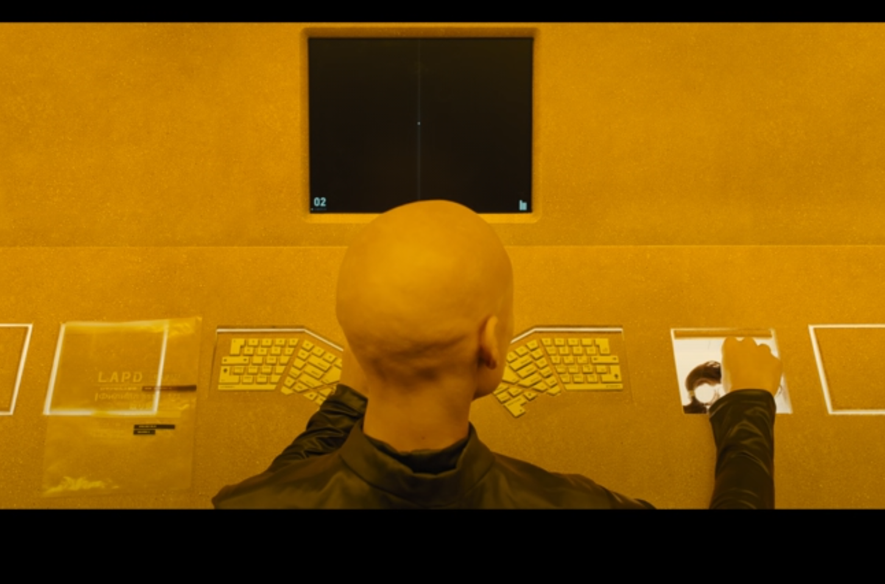

<!-- gid:20250720T100124 -->
[TOC]

[[TIP("이 노트에 대하여")]]
필립 K. 딕의 세계와 리들리 스콧의 영화가 만나는 지점에서 인간과 안드로이드, 기억과 정체성의 경계를 묻는다.
[[/TIP]]

## 히스토리

-   [2025-07-20 Sun 10:01] 블레이드 러너

## 관련메타

-   [음악 연극 뮤지컬 영화 미술](https://wikidocs.net/380710)

## BIBLIOGRAPHY

## 로그

### [|2025-07-20 Sun 10:01|](https://wikidocs.net/380424.md#2025-07-20-sun/)

@user 블레이드 러너 영화 시리즈에 대해서 소개해줘

@assistant **\*블레이드 러너 시리즈** 는 필립 K. 딕의 소설 "안드로이드는 전기양의 꿈을 꾸는가?"를 바탕으로 한 SF 영화 시리즈입니다.

### 주요 작품

**1. 블레이드 러너 (1982)**

-   감독: 리들리 스콧
-   주연: 해리슨 포드, 숀 영, 루트거 하우어
-   2019년 LA를 배경으로 인조인간(리플리컨트)을 추적하는 블레이드 러너의 이야기

**2. 블레이드 러너 2049 (2017)**

-   감독: 드니 빌뇌브
-   주연: 라이언 고슬링, 해리슨 포드
-   전편의 30년 후를 배경으로 한 속편

### 특징

-   **사이버펑크의 고전**: 디스토피아적 미래 도시의 비주얼
-   **철학적 주제**: 인간성, 정체성, 기억에 대한 깊이 있는 탐구
-   **영화사적 의의**: SF 영화의 걸작으로 평가받으며 후대 작품들에 큰 영향

특히 첫 번째 작품은 개봉 당시보다 시간이 지나면서 더욱 높은 평가를 받게 된 컬트 클래식입니다.

@user 소설 원작의 작가과 그 작품에 대해서 소개해줘

@assistant **\*필립 K. 딕(Philip K. Dick, 1928-1982)** 은 20세기 가장 영향력 있는 SF 작가 중 한 명입니다.

### 작가 소개

-   미국 출신 SF 소설가
-   생전에는 상업적 성공보다는 컬트적 인기
-   사후 문학적 가치가 재평가되며 현재는 SF 문학의 거장으로 인정

### 대표작 "안드로이드는 전기양의 꿈을 꾸는가?" (1968)

**원제**: _Do Androids Dream of Electric Sheep?_

#### 주요 내용

-   핵전쟁 이후 황폐해진 지구
-   인조인간(안드로이드)과 인간을 구별하는 검사관 릭 데커드
-   공감 능력을 통한 인간성의 정의 탐구

#### 영화와의 차이점

-   소설은 종교적, 철학적 요소가 더 강함
-   "머서교"라는 종교와 "무드 오르간" 등 독특한 설정
-   영화보다 더 복잡한 윤리적 딜레마 제시

### 다른 주요 작품들

-   **마이너리티 리포트** → 톰 크루즈 주연 영화화
-   **토털 리콜** → 아놀드 슈워제네거 주연 영화화
-   **맨 인 더 하이 캐슬** → 아마존 드라마 시리즈화

딕의 작품들은 현실과 환상, 인간성에 대한 깊이 있는 질문을 던지며 현대 SF의 토대가 되었습니다.

@user

## 아카이브

### DONE 10:00 블레이드 러너 - 키보드 - 마우스는 필요 없다

