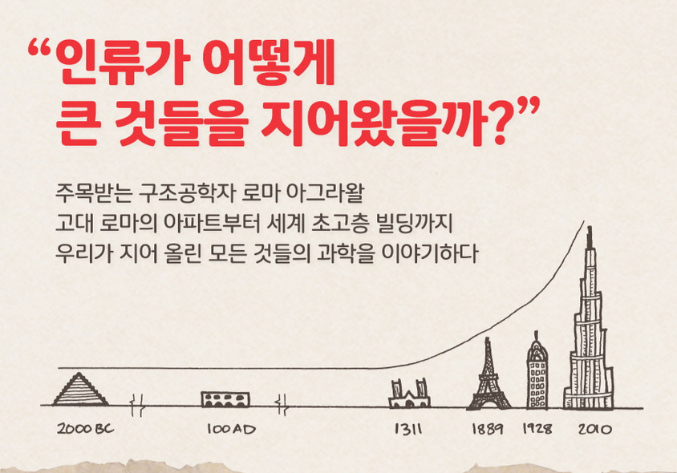

<!-- gid:20251023T085758 -->
[TOC]

[[TIP("이 노트에 대하여")]] 건축과 구조공학의 역사 속 발명과 설계를 따라가며, 볼트와 너트 같은 요소가 어떻게 현대 문명을 떠받치는지 보여준다. [[/TIP]] 히스토리 - [2025-10-23 Thu 08:57] 540 건축학 관련 정보들을 모은다 관련메타 - [건축구조공학설비빌딩№540](https://notes.junghanacs.com/meta/20240819T155215/)

## BIBLIOGRAPHY

  로마 아그라왈. 2019. <i>빌트, 우리가 지어 올린 모든 것들의 과학 - 건축학 구조공학</i>. Translated by 윤신영 and 우아영. [https://m.yes24.com/goods/detail/77934411](https://m.yes24.com/goods/detail/77934411).
  ———. n.d. <i>볼트와 너트: 세상을 만든 작지만 위대한 것들의 과학</i>. Translated by 우아영. Accessed October 23, 2025. [https://www.yes24.com/product/goods/124504031](https://www.yes24.com/product/goods/124504031).

## 빌트, 우리가 지어 올린 모든 것들의 과학 - 건축학 구조공학

(로마 아그라왈 2019)

-   원서 : Built: The Hidden Stories Behind our Structures
-   로마 아그라왈 윤신영 and 우아영 2019

영미권에서 가장 주목받는 구조공학자이자 물리학자인 로마 아그라왈이 우리에게 색다른 지식과 놀라운 관점을 선물하는 건축 교양서이다. 다리와 터널, 기차역과 마천루까지 우리가 살고 있는 커다란 세계를 설계하고 만들어온 이야기를 복잡한 수식 하나 없이 위트 있게 풀어낸다.

책소개 미국과학진흥회(AAAS) 2019 올해의 과학책 [뉴욕타임스], [월스트리트저널], [사이언스] 추천 도서

엄청나게 커다랗고 믿을 수 없게 계획적인 건축 이야기 주목받는 여성 구조공학자 로마 아그라왈 고대 로마의 아파트 인술라부터, 세계에서 가장 높은 빌딩 부르즈 할리파까지, 거대한 건축물에 숨겨진 은밀한 이야기를 공개한다

그림과 원리로 읽는 건축학 수업!

『랩 걸』 호프 자런, 『사소한 것들의 과학』 마크 미오도닉, 『거의 모든 것의 역사』 빌 브라이슨을 잇는 과학 논픽션 저자의 등장! 영미권에서 가장 주목받는 구조공학자이자 물리학자인 로마 아그라왈. 『빌트, 우리가 지어 올린 모든 것들의 과학』은 그가 우리에게 색다른 지식과 놀라운 관점을 선물하는 건축 교양서이다.

미국과학진흥회(AAAS) 2019 올해의 과학책, [뉴욕타임스] [월스트리트저널] [사이언스]가 강력 추천한 이 책은 다리와 터널, 기차역과 마천루까지 우리가 살고 있는 커다란 세계를 설계하고 만들어온 이야기를 복잡한 수식 하나 없이 위트 있게 풀어낸다. 고층 건물, 다리, 터널 같은 건축물이 중력, 바람, 물의 영향으로부터 우리를 지켜주고 이어주는 일이 가능했던 것은 수백, 수천 년간 기술자와 공학자들이 발견하고 발전시킨 노력의 결과라는 사실을 알 수 있다. 이 책을 읽고 나면 거대한 교각, 화려한 기차역, 하물며 아파트 엘리베이터나 공사장의 크레인도 이전과 같아 보이지 않을 것이다.

### 1 층: 우리가 지어올린 모든 것들에 대하여\_

### 2 힘: 중력, 바람, 지진으로부터안전한건물은어떻게만들어질까?

### 3 화재: 수많은 재난으로부터 얻은 교훈

### 4 벽돌: 피라미드부터 피렌체 대성당까지 그리고 우리집에도

### 5 금속: 강철을 사용하기 전까지 철길도 초고층 건물도 없었다

### 6 바위: 콘크리트는 어떻게 전 세계를 평정한 재료가 되었을까?

### 7 하늘: 크레인과 엘리베이터를 발명한 사람들

### 8 땅: 건물 아래에는 무엇이 건설돼 있을까?

### 9 지하: 우리 발밑의 도시가 만들어지기까지

### 10 물: 물이 흐르기 전까지 건물은 아무것도 아니다

### 11 하수도: 어느 누구도 똥에는 신경 쓰지 않는다면?

### 12 우상: 가장 진보한 다리를 만든 가장 진보한 여성의 이야기

### 13 다리: 계곡과 강을 건너는 수천 가지 창의적인 방법들

### 14 꿈: 무엇을 상상하든 그 이상을 지어올릴 것이다

### 책 속으로

우리는 자주 건축물의 존재를 무시하거나 잊는다. 하지만 건축물은 많은 이야기를 지니고 있다. 거대한 다리를 위에서 당기고 있는 장력 케이블, 높은 건물의 유리 표면 이면을 떠받치고 있는 철골 구조. 이런 것들이 건축물로 둘러싸인 우리 세계를 만들고 있다. 이런 건축물은 인류가 지닌 창의력을 보여준다. 타인 그리고 자연과의 교감 능력을 드러내주기도 한다. 끊임없이 변화하는, 우리가 만들어낸 세상은 이야기와 비밀로 가득 차 있다. 만약 듣고자 하고 보고자 한다면 환상적인 경험을 할 수 있을 것이다. --- p.15, '1장 층' 중에서

나는 건축가의 드로잉 위에 검은 마커펜으로 뼈와 살까지 덧붙인다. 다양한 색으로 그린 드로잉에 내가 추가한 굵고 검은 선은 일종의 견고함을 더해준다. 여기에는 반드시 건축가와 나 사이의 활발한 토론이 뒤따른다. 우리가 답을 찾으려면 서로 타협할 줄 알아야 한다. 건축가가 탁 트인 공간으로 묘사한 곳에 반드시 기둥을 세워야 하는 경우도 많다. 반대로 건축가들이 생각하기에 뭔가 구조물이 있어야 하는 곳이지만, 내가 보기에는 없어도 괜찮은 경우도 많다. 이 경우 건축가들은 좀 더 많은 공간을 얻게 된다. 기술적인 문제에 봉착했을 때, 건축가와 엔지니어는 서로의 관점을 이해할 수 있어야 한다. 시각적인 아름다움과 기술적 완결성 사이에서 균형을 잡아야 한다. 이런 과정을 거친 끝에 우리는 건축 구조와 심미적 통찰력이 거의 완벽한 조화를 이루는 설계안에 다다르게 된다. --- p.29, '2장 힘' 중에서

로마 대화재 이후 네로 황제는 도시에 몇 가지 변화를 지시했다. 거리를 확장하고 건물은 6층 이하로 짓게 했다. 그리고 제빵사와 판금업자들의 점포는 빈 공간을 품은 이중벽으로 거주 구역과 분리시켰다. 그는 발코니를 방화 공간으로 만들어 화재 시에 탈출을 쉽게 했다. 또한 화재 진압을 위해 수리 시설에 투자했다. 로마인들은 전통에서 배웠고, 우리 역시 그렇게 어렵게 얻은 지혜로부터 배워왔다. 수천 년 뒤, '방, 집, 건물을 방화재와 공간 이격을 통해 분리한다'는 단순한 원칙이 여전히 현대적인 건축물을 화재로부터 보호하기 위해 이용되고 있다. --- p.71, '3장 화재' 중에서

나를 둘러싸고 있는 아치는 수천 년을 살아남았다. 고대 아라비아의 아름다운 격언이 떠올랐다. "아치는 절대 잠들지 않는다." 아치가 잠들지 않는 이유는 아치를 이루는 요소가 끊임없이 압축 상태이기 때문이다. 아치는 끝없는 인내심으로 무게를 견딘다. 베수비오 화산에서 흘러나온 용암이 폼페이를 덮쳐서 사람과 건물을 싹 쓸어갔을 때에도 아치는 도시를 바라보며 남아 있었다. 아치는 땅 밑에 묻혀도 원래 역할을 절대 멈추지 않는다. --- p.84, '4장 벽돌' 중에서

엔지니어의 일이란 접시 돌리기와 꽤 비슷하다. 많은 문제들에 대비해 계획을 세워야 하고, 문제를 즉시 통제해야 한다. 온도를 예로 들어보자. 모든 건축물과 마찬가지로, 내가 설계한 다리도 온도의 영향을 받는다. 연중 온도가 변하면서(계절에 따라 달라진다) 가열되거나 식혀진다. 강철은 '열팽창계수'가 12×10-6이다. 온도가 1도 변할 때마다 1밀리미터 길이의 재료가 0.000012밀리미터씩 팽창하거나 수축한다는 뜻이다. 아주 작은 값으로 보이지만, 내가 설계한 다리는 길이가 거의 40미터였고 40도의 온도 차이를 견디도록 설계됐다. --- p.110, '5장 금속' 중에서

### 출판사 리뷰

과학을 모르는 일반인도 이해할 수 있는 건축의 구조와 원리가 펼쳐진다, 수다스럽게

주요 영미권 언론으로부터 최고의 찬사를 받은 이 책은 세 가지 요소로 구성돼있다. 먼저 로마 아그라왈은 과학적 원리를 우리의 일상에 대한 스케치와 작은 실험을 통해 알기 쉬운 방식으로 설명한다. 타고난 수다쟁이이자 놀랍도록 열정적인 강연자인 그는 건축과 구조의 기본 원리를 수식이나 물리 법칙 하나 없이 간단한 모형과 그림만 사용해서 이해 가능하게 한다. 건축물에 가해지는 힘(압력과 장력), 건축물의 뼈대를 이루는 기둥, 보, 가세, 바람과 지진으로부터 건축물을 단단하게 고정하는 코어와 외골격, 화재를 방지하기 위한 건축자재와 설비 등 건축의 구조와 설계에 관심 가지지 않았던 대다수의 일반인들의 궁금증을 자극하며 이해하기 쉽게 설명한다. 팟캐스트 [빌딩 스토리즈Building Stories]의 진행자이자 TED 강연자이기도 한 그는 수 킬로미터에 이르는 견고하고 거대한 산들을 공학자들이 어떻게 뚫고 터널을 만들었는지, 넓고 깊으며 거대한 강을 가로지르는 다리를 어떻게 건설했는지, 그리고 자연 속 가장 소중하고 다루기 어려운 물을 어떻게 사용하고 통제했는지 건축물에 관해 우리가 한 번쯤 품었을 궁금증들을 능숙한 솜씨로 풀어낸다.

고대 로마의 아파트부터 오늘날 두바이의 마천루까지 위대한 건축물에 숨어있는 역사적, 과학적 비밀을 탐사한다

둘째로, 그는 고대 로마부터 중세 건축, 그리고 근현대의 고층 빌딩에 이르기까지 각 시대의 기술적 도전들을 극복해낸 유명한 건물들에 얽힌 이야기를 들려준다. 독자는 로마가 제시하는 풍성한 사례를 통해 인더스 문명권 가마에서 구운 벽돌이 오늘날 사용되는 것과 이미 같은 비율을 가지고 있었다는 사실과, 타지마할의 돔은 불에 구운 생석회, 곱게 간 조개껍데기, 대리석 가루, 설탕, 달걀흰자 그리고 과일즙 등을 섞은 추나로 재료를 서로 붙였다는 사실을 알게 된다. 또한 그의 책은 시공간을 넘나드는 세계일주를 즐길 수 있는 기회를 제공하기도 한다. 기원전 8세기 말, 로마보다 수백 년이나 앞서 길이 27미터, 폭 15미터, 높이 9미터의 수로교를 건설한 아시리아(현재 이라크 북부)의 수도 니네베에서부터, 19세기 당시 세계에서 가장 긴 현수교인 브루클린 브릿지를 건설한 뉴욕, 그리고 2010년 완공된 이래 세계에서 가장 높은 건물 타이틀을 차지하고 있는 828미터의 두바이 부르즈 할리파까지 시공간을 넘나드는 모험으로 독자들을 초대한다.

높은 곳을 무서워했던 소녀가 도시의 스카이라인을 수놓는 스타 구조공학자가 되기까지

그리고 셋째, 그녀는 이 모든 것을 개인적인 일화들과 엮어서 이야기를 전개하는데, 이것이 바로 독자를 사로잡은 이 책의 매력이다. 로마 아그라왈은 남성 위주의 건축·공학계에서 편견과 통념을 넘어 뛰어난 성취를 거둔 것으로 이미 업계와 언론에서 많은 주목을 받아왔다. 서유럽에서 가장 높은 건물인 더 샤드(The Shard)의 설계팀에 참여해 세간의 찬사를 받았고, 뉴캐슬의 근사한 인도교와 런던의 크리스털 팰리스 역 캐노피 건축에도 관여한 바 있다. 옥스포드 물리학과 졸업생이자 높은 곳을 무서워했던 그 스스로가 두려움에도 불구하고 마천루 전문가가 되었다는 자신의 이야기를 꺼내는 순간 독자는 이 주인공에게 순식간에 빠져들게 된다.

당장 발 딛고 선 땅, 들어간 건물, 지나가는 도로, 통과한 터널 세상의 모든 건축과 구조물들이 새로운 눈으로 보이기 시작한다

로마 아그라왈은 자신의 책을 건축의 연대순으로 나누는 대신, 건물에 영향을 미치는 건축 자재와 요소로 분류해 이야기를 전개한다. 예를 들어, 그녀는 흙, 물, 벽돌, 바위, 금속으로 책의 챕터를 나눈다. 이야기는 다양한 건축의 재료와 그것의 특성으로부터 시작하여 건축사, 특히 19세기의 건축과 공학 분야에서 수많은 난제를 해결한 환상적인 방법까지, 그리고 그 주인공들의 일화로 이어진다. 완벽한 벽돌을 만들어낸 고대의 장인의 기술을 보여주고(흙 이외에 세 가지 유형의 과일에서 추출한 주스가 추가되었던) 철 대신 강철을 사용하는 것이 더 좋은 이유와 강철의 발명에 대해 이야기한다(철은 너무 부드러워서 큰 힘을 떠받치기 힘들기 때문이다). 이를 통해 독자들은 건물의 기초가 어떻게 세워졌는지, 대형 돔형 건물, 초고층 빌딩, 다리, 제방 등이 중력, 바람, 물 및 지진으로부터 어떻게 견디고 단단한 모양과 기능을 유지하는지 그 방법과 이유를 이해할 수 있다.

기술 중심의 딱딱한 구조공학 이야기에서는 보이지 않았던 건물 속 재료, 구조의 역할과 가치를 일상 속에서 발견하는 경험을 선사하는 책이다. 이 책을 읽고 난 독자라면 지금 당장 발 딛고 선 땅, 들어간 건물, 지나가는 도로, 통과한 터널 등 세상의 모든 건축과 구조물들이 새로운 눈으로 보이기 시작할 것이다.

-   카드로 만든 집(3장 화재)

로마 아그라왈은 책에서 공학자들이, 그리고 책을 읽는 일반 독자까지 우리가 재난으로부터 올바른 교훈을 얻는 것이 매우 중요하다고 강조한다. 3장 '화재'에 소개된 아이비 호지의 이야기는 그의 의지를 뚜렷하게 보여준다.

1968년 아침, 아이비 호지는 차를 끓이기 위해 부엌으로 갔다. 그녀는 가스를 켜고 성냥에 불을 붙였다. 잠시 후, 그녀는 바닥에 누워 하늘을 보고 있는 자신을 발견했다. 부엌과 거실의 벽은 모두 사라졌고 그녀의 집 아래 몇 층이 카드로 만든 집처럼 무너져 내렸다. 재난으로 침대에서 자고 있던 4명이 죽었다. 놀랍게도, 아이비의 고막이 터지지는 않았다. 폭발력 자체가 고막을 손상시킬 정도로 크지 않았던 것이다. 하지만 그녀가 머무르던 아파트는 실제 폭발의 3분의 1 수준의 폭발력만으로도 벽이 파괴될 수 있는 것으로 나타났다.

런던의 주거용 건물인 이 아파트가 이처럼 심하게 파손된 이유가 이후 사고 분석에서 나왔다. 철근 콘크리트 슬래브 대신 조악한 패널로 만들어진 이 건물은 약간의 마찰력과 콘크리트 '풀'로 고정돼있을 뿐이었다. 때문에 폭발이 밀어내는 힘이 마찰력과 콘크리트의 저항력을 이길 수 있었고 카드로 만든 집처럼 순식간에 무너져내리고 만 것이다.

서유럽에서 가장 높은 건물인 더 샤드(The Shard)를 설계하기도 한 그녀는 전문 지식을 바탕으로 2001년 9월 11일 테러 공격 이후 뉴욕의 쌍둥이 타워가 완전히 붕괴된 이유를 설명하기도 한다. 이어서 멕시코시티라는 도시의 일부가 호수 위에 세워져 있어도 침몰하지 않는 이유를 설명한다. 그리고 그녀는 왜 중국인들이 만리장성 축조에 끈적거리는 쌀을 사용했는지 이야기한다. 이 모든 이야기들을 통해 로마 아그라왈은 로마인에 의한 콘크리트의 발견과 같은 현대 건축 방법까지 이어진 역사적 교훈과 돌파구들을 능숙하게 이야기한다.

-   누구도 똥에는 신경 쓰지 않는다면(11장 하수도)

11장 '하수도'는 이 책의 챕터 중에서 아마도 가장 흥미로운 제목일 것이다. 하수구의 세계를 여행하는 즐거움은 어디서도 만나보지 못했을 것이다. 이 챕터는 오늘날 일본의 화장실에서 시작된다. 음악이 흐르고, 수많은 기능이 작동하는 비데가 있고, 손을 자동 소독하는 세정 스프레이가 달려있기도 한, 소소하지만 동시에 놀라운 이벤트 공간이라고 부를 만한 곳이다. 그리고 이야기는 중세 일본으로 넘어간다. 대변 무역이 번창했던 그곳으로. 비료를 얻기 위해서 은으로 분뇨를 사기도 했다고 하는 그곳의 이야기는 지금의 하수도가 어떤 역할을 하고 있는지, '똥'을 처리하기 위해 어떤 설계와 노력이 이뤄지는지 질문하고 답을 찾아가게 한다. 그리고 이야기는 런던에서 끝이 난다. 런던에서는 페스트 등 수많은 전염병이 발생한 후 19세기가 되어서야 그것을 통제할 수 있는 하수 시스템이 건설되었다. 그리고 지금 런던 시민들은 하나의 프로젝트가 완료되기를 기다리고 있다. 19세기의 시스템이 현재는 작동하지 않기 때문이다. 현재 템스강에는 '매주' 한번 이상 유량이 흘러들고 있고 매년 6200만톤의 처리되지 않은 하수가 배출되고 있다. 2020년에는 이 수치가 거의 두 배 늘어날 것이고, 그럼 소변과 대변이 템스강을 온통 더럽힐 수도 있다고 한다. 때문에 2023년을 목표로 시작된 것이 템스 타이드웨이 터널 프로젝트다. 새로운 '창자'를 만들어 템스강을 다시 흐르게 하겠다는 것이다.

### 저 : 로마 아그라왈

구조공학자. 옥스퍼드대학교에서 물리학을 전공하고, 런던 임페리얼 칼리지에서 구조공학 석사 학위를 받았다. 서유럽에서 가장 높은 건물인 '더 샤드(The Shard)'를 포함해 다리와 터널, 기차역과 마천루까지 우리가 살고 있는 세계의 일부를 설계하고 만들어왔다. 어린 시절, 호기심을 주체하지 못해 혼자 물건을 분해하고 그 속을 파고들던 소녀는 이제 전 세계가 주목하는 공학자가 되어 자신을 평생 매료시켜 온 주제, 거대하고 복잡한 세상을 움직이는 가장 작은 사물들에 얽힌 이야기를 책으로 펴내게 되었다.

2011년 구조공학자협회가 선정하는 올해의 젊은 공학자상, 2014년 올해의 여성공학자상, 2017년 영국왕립공학회가 가장 뛰어난 공학자에게 수여하는 루크상을 수상했고, 2018년 영국제국 훈장(MBE)을 받았다. 첫 책인 《빌트, 우리가 지어 올린 모든 것들의 과학》은 잘락상 최종 후보, 미국과학진흥회(AAAS) 2019 올해의 과학책으로 선정되며 작가로서의 재능 또한 증명했다. 이번 책 《볼트와 너트, 세상을 만든 작지만 위대한 것들의 과학》은 2023 영국왕립학회 과학도서상 최종 후보에 올랐다.

## 볼트와 너트: 세상을 만든 작지만 위대한 것들의 과학 현대사회를 떠받치는 7가지 발견과 발명 스토리

(로마 아그라왈 n.d.)

### 책소개

거대하고 복잡한 현대사회를 움직이게 하는 것은 뜻밖에도 못, 바퀴, 스프링, 자석, 렌즈와 같은 아주 작고 단순한 사물들이다. 우리 주위의 평범한 사물 7가지가 현대인의 삶을 어떻게 뒤바꿨는지 말해주는 이 책은 수천 년에 걸친 공학적 발명의 놀라운 여정 속으로 독자를 초대한다. 베스트셀러 《빌트, 우리가 지어 올린 모든 것들의 과학》에서 거대한 건축물에 숨겨진 이야기를 전해준 로마 아그라왈은 못의 발명이 어떻게 현대적인 고층 건물로 이어졌는지, 자석의 발견이 어떻게 전 세계를 하나로 연결하는 데 일조했는지 설명하며 공학이 우리의 생활 방식을 어떻게 근본적으로 변화시켰는지 펼쳐 보인다. 과학과 역사, 기술적 원리와 흥미로운 에피소드가 촘촘하게 얽혀 있는 이 책을 통해 우리 주변의 세계를 구성하는 가장 기본적인 요소들을 탐구하고 일상에서 공학의 경이로움을 발견해낼 수 있는 새로운 눈을 가지게 될 것이다.

### 머리말: 이 세계의 구성 요소를 이해하는 일

### 1장 못: 가장 단순한 도구가 현대사회를 지배하기까지

### 2장 바퀴: 구를 수 있다는 것은 얼마나 대단한 일인가

### 3장 스프링: 우리가 생각보다 조용한 도시에서 살 수 있는 이유

### 4장 자석: 전화에서 인터넷까지, 우리를 하나로 연결시켜 준 물건

### 5장 렌즈: 실제로 접근할 수 없는 대상을 어떻게 탐구할 수 있을까?

### 6장 끈: 실용적이면서도 우아하고 눈에 거슬리지 않기 위한 선택

### 7장 펌프: 심장의 기능을 대신할 수 있는 유일한 도구

### 맺음말: 이 모든 것은 결국 인간에 대한 이야기

### 참고문헌

### 책 속으로

이해를 하든 못하든 당시 나는 사물이 무엇으로 구성되고 어떻게 생겨났는지 알아보는 데에 푹 빠져 있었다. 복잡한 사물은 더 작고 단순한 것들로 이뤄져 있다. 우주의 구성요소도, 살아 있는 생명체도, 인간의 발명품도 마찬가지다. 나는 꽤 운이 좋아서 사물을 구성하는 요소에 대한 어린 시절의 호기심을 업으로 삼을 수 있었다. 엔지니어로 일하면서 기계와 건물, 일상 속 물건들이 만들어진 과정과 그 중심부에 위치한 요소들에 끝없는 매력을 느꼈다. 분명 많은 사람들이 이런 감정을 공유하고 있을 것이다. 그걸 써 내려간 결과물이 바로 이 책이다. --- p.8~9, 「머리말 〈이 세계의 구성요소를 이해하는 일〉」 중에서

지금은 상상하기 어렵지만 재료와 숙련 노동자를 구하기 어려웠던 산업화 이전 시대에 못의 가치가 매우 높았기 때문에 영국은 목재 주택이 일반적이던 북아메리카 등의 식민지로 못을 수출하는 것을 금지했다. 그 결과 이 지역들에서 못은 더욱 귀해졌고 이사할 때 살던 집에 불을 질러 잿더미 속에서 못을 수거하는 사람들도 생겨났다. 1619년 버지니아주에서는 이런 관행을 막기 위해 소유자 보상을 약속하는 법이 통과되었다. --- p.27, 「1장 〈못-가장 단순한 도구가 현대사회를 지배하기까지〉」 중에서

도공의 바퀴를 옆으로 세워 그릇을 만드는 용도에서 목적지를 향해 이동하는 용도로 바꾼 것은 첫 번째 재발명에 불과하다. 시야를 넓혀주고 유라시아 사람들의 생활방식을 바꾸게 해준 초기 바퀴들은 견고했지만, 새로운 혁신을 통해 더 가볍고 빠른 것으로 변모했다. --- p.64, 「2장 〈바퀴-구를 수 있다는 것은 얼마나 대단한 일인가〉」 중에서

구조물의 소음을 완화하기 위해 스프링을 사용하면서 도시를 설계하고 계획하는 방식이 바뀌었다. 스프링이 없다면 두 가지 시나리오가 가능하다. 먼저 우리가 아는 오늘날의 도시처럼 높다란 타워와 아파트 구역이 전철과 가깝지만 소음과 진동이 심한 도시, 에코가 울려 퍼지고 뒷배경에 미약한 웅성거림이 있는 콘서트홀, 외과의사와 연구원들이 집중하기 힘든 병원, 스트레스와 수면 부족에 시달리는 사람들 등. 아니면 이럴 수도 있다. 인프라 시설에서 멀리 떨어져 있어 출퇴근 시간이 길고, 기계설비와 생활 공간을 분리해야 하는 탓에 값비싼 펌프와 공간 부족을 감당해야 하고, 건축물의 높이와 깊이를 제한해야 하는 타협의 도시. 하지만 스프링 덕분에 우리는 고요함을 만들 수 있다. --- p.130, 「3장 〈스프링-우리가 생각보다 조용한 도시에서 살 수 있는 이유〉」 중에서

지금까지 살펴본 발명품들과 달리 자석 또는 자력을 내는 물체는 우주에 원래 존재했다. 여러분과 나는 자석이다(아주 약한 자석이라 갑자기 냉장고에 달라붙을 위험은 없으니 안심해도 된다). 물질의 아주 작은 구성 요소인 원자는 자성을 띠고 있다. 우리가 살고 있는 지구는 거대한 자석이다. 바퀴, 못, 스프링과 달리 자석은 인간이 발명했다기보다는 발견한 것이다. 그럼에도 이 책에서 자석을 다루려는 건 대자연이 준 것보다 더 유용한 형태로 만드는 방법을 바로 인간이 알아냈기 때문이다. --- p.135, 「4장 〈자석-전화에서 인터넷까지, 우리를 하나로 연결시켜 준 물건〉」 중에서

렌즈가 새로운 통찰력을 주는 또 다른 예시는 사진이라는 매체를 통해 이론적으로는 눈으로 볼 수 있지만 실제로는 접근할 수 없는 이미지를 포착하는 것이다. 카메라의 중심에는 렌즈가 있다. 물론 기술적으로는 렌즈가 필요하지 않다. 렌즈 없이 핀홀 카메라로도 이미지를 촬영할 수 있기 때문이다. 하지만 내가 카메라를 고른 이유는 카메라에 렌즈를 추가함으로써 사진, 더 나아가 사회가 변화했기 때문이다. --- p.192~193, 「5장 〈렌즈-실제로 접근할 수 없는 대상을 어떻게 탐구할 수 있을까?〉」 중에서

끈 같은 소재를 만들려는 고대인의 욕구는 아마도 다양한 형태의 끈이 일상생활에서 얼마나 필수적이고 근본적인지를 보여주는 증거일 것이다. 다리가 무너지지 않도록 지탱하는가 하면 우리 몸을 보호하고 심지어 변형하기도 하며, 아름다운 선율을 만들어내기도 한다. '최고의 발명품' 목록에 끈이 자주 등장하는 건 아니지만, 나는 여기에 꼭 끈이 포함돼야 한다고 생각한다. --- p.211, 「6장 〈끈-실용적이면서도 우아하고 눈에 거슬리지 않기 위한 선택〉」 중에서

인류가 물을 필요로 하고 물에 의존했기 때문에 수많은 펌프가 물 운반 용도로 개발되었다. 17세기 무렵부터 엔지니어들은 다른 액체, 다른 용도로 눈을 돌렸다. 19세기와 20세기에는 산업화가 진행되면서 펌프 설계가 급속도로 발전했고 펌프는 매우 다양한 용도로 사용되었다. --- p.243, 「7장 〈펌프-심장의 기능을 대신할 수 있는 유일한 도구〉」 중에서

### 출판사 리뷰

"인류의 모든 혁신은 '이것'들의 발명으로 시작되었다" 현대인의 삶을 뒤바꾼 7가지 사물에 숨은 이야기

높은 건물과 긴 다리, 먼 곳으로 떠나는 우주선까지. 현대사회를 이뤄낸 뛰어난 기술적 성취들은 우리를 단숨에 압도하고 만다. 하지만 아무리 거대하고 복잡한 사물이라도 그것을 작동하게 하는 가장 기본적인 요소는 아주 작고 단순한 것들로 이뤄져 있기 마련이다. 이러한 진리는 우주의 구성 요소도, 살아 있는 생명체도, 인간의 발명품에도 예외가 없다.

서유럽에서 가장 높은 건물 '더 샤드(The Shard)'를 설계한 주목받는 구조공학자이자 베스트셀러 《빌트, 우리가 지어 올린 모든 것들의 과학》에서 거대한 건축물에 숨겨진 이야기를 전해준 로마 아그라왈은 이번에 거대하고 복잡한 현대사회를 떠받치는 가장 작고 단순한 7가지 발명품(못, 바퀴, 스프링, 자석, 렌즈, 끈, 펌프)으로 시선을 돌린다. 이 책의 원서 제목은 《넛츠 앤 볼츠(Nuts ad Bolts)》다. 책 속에 등장하는 소재를 대표하는 것이기도 하지만, 너트와 볼트가 기계의 가장 기본적인 구성요소이듯 어떤 대상의 가장 핵심적인 요소를 일컫는 관용적 표현이기도 하다. 일상에서 너무 익숙한 사물들이라 어떤 역할을 하는지 잘 알고 있다는 느낌이 들지만, 아그라왈은 우리의 예상을 산산이 깨부순다. 7가지 사물들은 인류 역사에서 '어떻게' 사용될 수 있고 또 '무엇'을 할 수 있는지 그 모습을 바꿔가며 놀라운 혁신을 거듭해왔다.

저자는 도자기를 빚는 물레에 쓰였던 최초의 바퀴가 어떻게 해서 우주 탐험을 가능하게 했는지 그 진화의 과정을 추적하고 각 사물들이 역사와 사회, 정치, 교통, 예술 등 우리의 삶에 어떤 광범위한 영향을 미쳤는지 생생하게 보여준다. 첨단 기술이 아닌 우리 주위의 평범한 사물 7가지가 인류의 삶을 어떻게 뒤바꿨는지, 그 놀라운 이야기를 통해 독자들은 언제나 똑같은 일상의 풍경 속에서도 공학의 경이로움을 발견해낼 수 있는 새로운 눈을 가지게 될 것이다.

공학은 어떻게 세상을 이롭게 해왔는가 '못' 하나가 이뤄낸 연결의 혁신부터 '렌즈'에서 시작된 생명의 탄생까지

이 책은 못의 발명이 어떻게 현대적인 고층 건물로 이어졌는지, 자석의 발견이 어떻게 전 세계를 하나로 연결하는 데 일조했는지 설명하며 공학이 인류의 생활 방식을 어떻게 근본적으로 변화시켰는지 펼쳐 보인다. 못이 존재하기 전까지 우리 조상들은 바위를 깎아 동굴을 만들고, 개울 위에 통나무를 쓰러뜨려 다리를 만드는 식으로 단일한 재료만을 사용해왔다. 하지만 못의 발명으로 서로 다른 두 물체를 연결하는 것이 가능해졌다. 오늘날 우리 주변의 거의 모든 사물은 서로 다른 부품과 재료가 결합한 것이다. 그동안 한 번도 못에 대해 진지하게 생각해보지 않았다면, 우리가 사용하는 물건의 모든 이음새마다 얼마나 많은 못이 숨겨진 채 제 역할을 다하고 있는 깨닫고 깜짝 놀랄 것이다.

"자르야, 너와 만나기까지 여정이 험난했지만 네가 있어 감사하다. (...) 너를 함께 만들어준 그 배아학자나 너를 내 뱃속에 다시 넣어준 의사만 말하는 것도 아니란다. 내 뱃속에서 네가 안전하고 건강한지 확인해주었던 수많은 조산사, 간호사, 컨설턴트만 말하는 것도 아니고. 역사 속 수천 명의 사람들 덕분에 너의 이야기와 관련된 모든 과학과 기술이 존재할 수 있었다는 걸 말하고 싶구나. 맙소사, 너를 창조한 배경에는 복잡한 과학과 공학이 정말 많단다. 자르야, 네 엄마는 물리학을 전공한 엔지니어이기 때문에 이런 이야기를 들려줄 수밖에 없다. 그래서 중요한 얘기를 해줄게. 렌즈라는 단순해 보이는 작은 곡면 유리 조각이 없었다면 너는 존재할 수 없었을 거야. 이건 너를 위한 이야기란다."(171~172쪽)

한편 곡면 유리(즉, 렌즈)는 문명이 시작된 이래로 그 존재를 알고 있었지만 인류는 17세기에 현미경과 망원경을 만들면서 본격적으로 렌즈를 활용하기 시작했다. 마침내 눈으로 볼 수 없는 대상을 탐구할 수 있게 된 것이다. 저자는 5장 〈렌즈〉의 시작을 시험관 수정을 통해 태어난 자신의 딸에게 보내는 편지로 시작한다. 아이가 태어나는 데는 가족들의 애정과 의료진의 수고가 있었지만, 그보다 먼저 렌즈와 현미경의 발명을 통해 정자의 움직임을 관찰한 과학자들이 있었다고 말이다. 렌즈의 발명이 한 개인의 삶에 어떻게 직접적인 영향을 미쳤는지 저자의 사적인 경험을 통해 설명하는 대목이다. 그 외에도 식기세척기, 카메라, 우주복, 현수교, 유축기 등 다양하고 복잡한 기술들이 어떻게 지금과 같이 작동하는지 설명하고, 직접 그린 일러스트를 통해 복잡한 원리를 한층 쉽게 이해할 수 있도록 돕는다.

남성 엔지니어는 왜 '완벽한 설거지 기계'를 만들어내지 못했을까? 엔지니어링의 핵심은 만들어내고 필요로 하고 사용하는 '사람'들의 이야기다

뛰어난 이야기꾼인 로마 아그라왈은 일상의 사물이 작동하는 원리와 함께 이를 발명한 이들의 열정과 아이디어를 현실로 구현하는 데 뒤따르는 노력, 그리고 서구 남성 중심의 과학계에서 그동안 주목하지 않았던 동양의 과학자와 여성 엔지니어의 활약을 조명한다. 우리가 사물을 볼 수 있는 이유에 대해 새로운 이론을 제시한 이슬람 학자 '이븐 알하이삼', 공식적인 특허를 인정받지 못했지만 텔레비전의 아버지라 추앙받는 일본의 발명가 '다카야나기 겐지로', 실수인 줄 알았는데 실은 놀라운 것을 발명한 이민자 가정의 여성 화학자 '스테퍼니 퀄렉' 등 저자는 그동안 역사에서 주목받지 못한 이야기들을 찾아내 우리에게 전해준다.

그중엔 1893년 시카고 산업박람회에 참석한 유일한 여성 엔지니어 '조지핀 코크런'의 이야기도 등장한다. 이 여성은 오늘날 우리가 사용하는 식기세척기의 원형을 발명했다. 그동안 남성 엔지니어들도 식기세척기를 만들려고 수없이 시도했지만, 설거지와 거리가 먼 그들의 기계는 번번이 그릇을 깨부쉈다. '그릇이 상하지 않는 설거지 기계'라는 자신의 필요와 생계를 위해 이 엄청난 발명품을 만들어낸 코크런은 사후에야 자신의 발명품을 인정받을 수 있었다. 식기세척기, 청소기, 믹서기, 세탁기와 같은 수백만 명의 삶을 바꾸어 놓은 발명품들이 각 가정에 보급되기까지는 보이지 않는 곳에서 자신의 삶을 헌신하고 열정을 다 바친 수많은 사람들 덕분이었다. 저자는 엔지니어링의 핵심은 결국 사람이라고 말한다. "만드는 사람들, 필요로 하고 사용하는 사람들, 그리고 때로 무심코 기여하는 사람들"이 세상을 바꿔왔다고 말이다.

"공학은 문제를 해결하기 위한 일련의 사고과정이다" 과학과 디자인이 만나 새로운 혁신을 만들어내는 순간

"로마 아그라왈은 말한다. 우리는 엔지니어링을 통해 존재해왔다고. 우리가 사물을 만들고 사용하는 방식이 곧 우리의 과거와 현재와 미래를 구성하는 일부라고 말이다. 엔지니어링을 이해하는 것은 우리가 문명을 이룩하고 번성하며 때로 누군가를 착취하기도 했던, 인류의 삶의 방식과 문명 공동체의 핵심을 이해하는 것이기도 하다." ―천문학자 심채경 추천사 중에서

많은 사람들이 공학을 딱딱하게 여긴다. 거대한 규모의 산업이나, 일반인이 이해하기 힘든 기술적 혁신을 떠올리기 때문이다. 하지만 저자는 공학이 '과학'과 '디자인'의 만남이라는 점을 강조하며 못의 다양한 변형을 예로 들어 공학적 사고의 메커니즘을 이해하게 만든다. 못은 둥근 머리와 뾰족한 끝을 가진 단순한 구조로 시작해서, 고정력을 높이기 위해 나사가 파인 나사못으로, 양쪽에서 체결이 가능한 리벳으로, 나사와 리벳이 합쳐진 볼트로 모양을 바꿔가며 새로운 쓰임을 만들어냈다. 건설 현장에서 쓰이는 볼트는 이층 버스 한 대에 해당하는 11톤의 하중을 견딜 수 있는데, 디자인의 변형을 통해 이렇게 놀라운 혁신을 이뤄낸 것이다. 이처럼 공학의 발전사는 어떻게 하면 지금보다 나아질 수 있는지 물어온 인간의 역사이다. 이 책에서 만나게 될 엔지니어링의 놀라운 '위업'들은 눈앞에 당장의 해결책이 보이지 않는 문제라도, 끊임없는 호기심과 질문만이 우리를 또 다른 혁신의 미래로 데려다줄 것임을 깨닫게 할 것이다.
