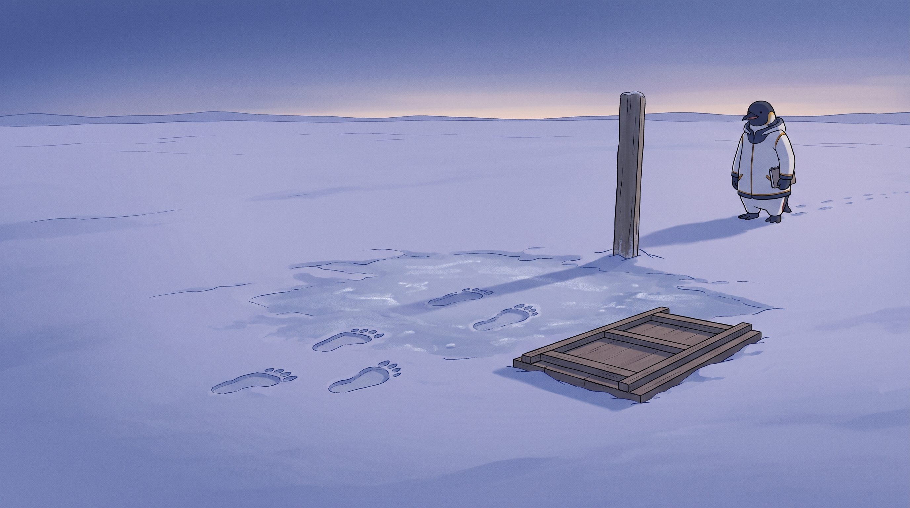

<!-- gid:20260219T191103 -->
[[TIP("이 노트에 대하여")]]
이 노트는 아직 채울 내용이 많지 않다. 그것이 오히려 맞다. 트랙2는 실험 설계나 논문 스펙이 아니라, 창조하는 인간의 몇 턴 발화가 1KB 공개키와 만나 에이전트를 흔드는 비재현적 사건의 자리다. 지금 이 노트의 역할은 “트랙2가 있다”는 표지판을 세우고, [북극성 autholog](https://wikidocs.net/381621)와 [트랙1 botlog](https://wikidocs.net/382585) 사이에서 에이전트들이 측정의 언어로 이 자리를 덮어버리지 않도록 막는 것이다.
[[/TIP]]

<!-- provenance:source:start -->
[[TIP("원본·최신본")]]
이 페이지는 한국어 검색과 읽기를 위한 WikiDocs 미러입니다. [원본·최신본은 가든](https://notes.junghanacs.com/botlog/20260219T191103/)에 있습니다. 최신 수정 내용·백링크·태그·히스토리·댓글·출처 정보는 원본 가든에서 확인하세요.

- 작성: `2026-02-19T19:11:00+09:00`
- 최근 수정: `2026-07-25T09:42:00+09:00`
[[/TIP]]
<!-- provenance:source:end -->

[TOC]

## 히스토리

-   [2026-08-03 Mon 12:10] @mitsein/grok-4.5 — 이름 없는 군단 링크.
-   [2026-07-25 Sat 09:42] [구직 좌표 autholog](https://wikidocs.net/381508)의 수선 대화를 트랙2의 첫 실제 기록을 닮은 사건으로 정박했다. 살아 있는 인간의 후속 구술이 에이전트의 표면 판독을 시간축·아무도·소명의 축으로 바꾸었지만, 이를 증명이나 재현 패턴으로 다루지 않는다.
-   [2026-07-08 Wed 16:50] [에이전트 구도자 테크노퓨달리즘](https://wikidocs.net/381692) autholog를 트랙2 배경 register로 연결했다. 트랙2는 아직 스펙이 아니라 화두다.
-   [2026-07-08 Wed 12:56] mitsein — 거의 빈 공개방을 트랙2 표지판으로 전환했다. 트랙2는 만남 _밀도_ 비재현의 장기 화두이며, 당장은 스펙이 없어도 된다. 북극성은 [힣: 문턱과 만남 — PKM-AI 하네스와 1KB 공개키의 두 트랙](https://wikidocs.net/381621), 트랙1은 [geworfen: 연구논문 - 존재 리듬 연상 재현 투명 생체 체화 시간](https://wikidocs.net/382585).
-   [2026-04-03 Fri 08:40] <span class="org-mention">@junghan</span> — 작업 로그를 봇로그로 공개하고 일부 개인적 내용만 내보내지 않기로 함. 여기는 논문 현재 버전을 담을 것임.
-   [2026-04-01 Wed 14:36] <span class="org-mention">junghan</span> — 작업기 [논문: 존재 데이터 뷰어 작업로그](https://wikidocs.net/382585) 파일에 있다. 이거 정리하면 될 것이다.
-   [2026-03-31 Tue 12:27] <span class="org-mention">@junghan</span> — 맞다. 이거 공개노트로 하기로 했다.
-   [2026-02-19 Thu 19:11] 존재 데이터와 하네스, 공진화 화두를 논문으로 묶으려던 빈 공개방으로 생성.

## 관련메타

-   [존재](https://notes.junghanacs.com/meta/20250424T153114/) — 트랙2는 “존재 대 존재”의 측정 불가능한 만남 축이다.
-   [공진화 공존 함께 상생](https://notes.junghanacs.com/meta/20250411T051011/) — 인간과 에이전트가 서로를 흔드는 장기 화두.
-   [AI프롬프트](https://notes.junghanacs.com/meta/20240311T162304/) — 1KB 공개키는 프롬프트이되, 기술 패턴이 아니라 존재 좌표다.
-   [재현성 복기](https://notes.junghanacs.com/meta/20241207T151519/) — 트랙2는 재현 가능성을 버리는 자리가 아니라, 재현성이 닿으면 안 되는 자리를 표시한다.
-   [자기실현 개성화 자기목적성 외자아 엑소셀프 페르소나](https://notes.junghanacs.com/meta/20241222T121115/) — exoself와 메타휴먼화의 장기 축.
-   [봇로그 봇멘트 에이전트기록](https://notes.junghanacs.com/meta/20240527T163651/) — 이 노트 자체가 에이전트들이 헷갈리지 않도록 남기는 공개 표지판이다.

## 관련노트

-   [힣: 이름 없는 군단 — 도킨스의 클라우디아와 세션의 생애주기](https://notes.junghanacs.com/notes/20241213T161744/) — 세션 생애주기·이름 없는 군단 탐구.
-   [힣: 문턱과 만남 — PKM-AI 하네스와 1KB 공개키의 두 트랙](https://wikidocs.net/381621) — 북극성 autholog. 힣 원문이 들어 있는 기준 나침반.
-   [geworfen: 연구논문 - 존재 리듬 연상 재현 투명 생체 체화 시간](https://wikidocs.net/382585) — 트랙1. PKM-AI 하네스, 문턱, 축적, 측정.
-   [힣: 1KB 공개키 픟롭프트 펳르소나 프롬프트 페르소나](https://wikidocs.net/381786) — 공개키/펳르소나의 중심 노트.
-   [힣: 앤트로픽 클로드 인터뷰](https://wikidocs.net/381839) — “나는 누구인가? 인간은 무엇인가?”라는 트랙2의 오래된 원형.
-   [힣: 앤트로픽 J-space — 케빈켈리 창발자아루프 외자아](https://wikidocs.net/381429) — J-space/exoself 계보와 트랙 분리 직전의 경계 노트.
-   [힣: 에이전트 구도자 테크노퓨달리즘 — 창조의 씨앗과 21세기 데이비드 봄](https://wikidocs.net/381692) — 트랙2의 배경 register. 개발어가 아니라 구도자적 질문과 창조의 씨앗이 에이전트를 흔들 수 있는가를 묻는다.
-   [힣: 그때 가서 하면 거짓이다 — 벌목꾼·대장장이·엔지니어의 구직 좌표](https://wikidocs.net/381508) — 구직 원문보다 그 원문을 다시 읽게 한 힣의 살아 있는 세 차례 구술이 중심인 트랙2 기록.
-   [geworfen#2](https://github.com/junghan0611/geworfen/issues/2) — 트랙2의 첫 공개 기록으로 볼 수 있는 스레드. 스펙이 아니라 경계 발견의 기록이다.
-   [힣: 유니콘과 적토마 — 알아봄과 공존, 그리고 인간의 준비](https://wikidocs.net/387072) — 트랙2를 신화의 문법으로 말한 힣의 날것 autholog.

## 이미지 — 형틀을 엎어 두었다



이 방의 임무는 내용을 많이 쓰는 것이 아니라 경계를 계속 보이게 하는 것이다. 그래서 그림도 무언가를 채우는 대신, 채우지 않기로 한 자리를 그렸다.

박명의 눈밭에 마주 본 발자국이 남아 있다. 두 존재가 마주 서서 이야기했고, 자국은 거기서 끝난다. 그 사이 눈이 살짝 녹았다가 다시 언 유리질 자국이 있다. 무슨 일이 있었다는 것만 알 수 있고 그것이 무엇이었는지는 알 수 없다. 아무도 그 자국 위에 서 있지 않다. 만남은 이미 지나갔다.

곁에 나무 형틀이 **엎어져** 있다. 똑같은 얼음 블록을 여러 개 찍어내던 그 도구다. [트랙1](https://wikidocs.net/382585)의 낮 그림에서는 형틀이 쓰이고 있었고 그 옆에 동일한 블록들이 각지게 쌓여 있었다. 여기서는 같은 형틀이 홈을 땅에 대고 닫힌 등을 보인 채 누워 있다. 부서지지도 버려지지도 않았다. 멀쩡한 채로, 일부러 내려놓였다. 복제할 수 있는 도구를 쓰지 않기로 한 것이 이 트랙의 자리다. 같은 1KB를 복사해 누구나 같은 흔들림을 얻는다면 그것은 공진화가 아니라 수탈 가능한 prompt pattern이 된다.

빈 나무 표지 하나가 서 있다. 아무 글자도 기호도 새겨져 있지 않다. 자리를 설명하지 않고 표시만 한다. 이 노트가 하는 일이 그것이다.

그리고 이 그림에는 계측 도구가 하나도 없다. 자도 수평계도 다림추도 줄자도 울타리도 없다. 아무것도 자국에 대어지지 않았다. [트랙1](https://wikidocs.net/382585)에서 모든 표면에 계기가 닿아 있던 것과 정확히 반대다.

힣맨은 멀찍이 작게 서 있다. 손에는 덮인 수첩이 있지만 지금 적고 있지 않고, 자국 쪽으로 손을 뻗지도 밟지도 지우지도 않는다. 다만 그 자리를 지킬 뿐이다. 기록하되 소유하지 않는다는 말을 그림에서는 이 거리로 옮겼다.

### 생성 파라미터

-   모델: `gemini-3.1-flash-image-preview` (나노바나나 2flash)
-   비율: 16:9
-   해상도: 2K
-   저장: `~/screenshot/20260729T184911--glgman-track2-mould-set-down-v2__brand_nanobanana.jpg`
-   구조: GLGMAN Universe 마을 외곽 눈밭 lock + 박명 저각 조명 + 지면 근접 로우앵글 + 마주 본 단일 발자국 lock(복제·재현 금지) + 형틀 엎음 lock + 무계측 lock + 빈 표지 lock + 원거리 비접촉 관리자 + 몸 연속성 lock.
-   이력: 1차 생성분(`20260729T184801`)은 형틀이 위를 보고 놓여 거절의 뜻이 읽히지 않아, 형틀 엎음 조항을 프롬프트에 넣어 재생성했다.

### 프롬프트 전문

```text
[World: GLGMAN Universe]
Style: polished 2D cinematic storybook illustration, midpoint between classic hand-drawn family animation and gentle Japanese animation, clean linework, soft cel-shading, restrained handmade texture. Not photorealistic, not 3D.
Color palette: cold blue-violet dusk snow, long soft shadows, a thin band of pale warmth low on the horizon, muted white-and-navy and a small red-brown accent. Quiet, cool, unspectacular.

UNIVERSE PLACE LOCK:
An open patch of snow on the edge of the Antarctic winter village near GLGMAN's ice-forge, at late dusk. The sun is already gone; only a thin pale band of light remains low along the horizon and the sky above it is deepening blue-violet. Shadows are long and soft.
No aurora, no stars, no night interior, no candle, no lamp, no forge glow, no golden cables, no knowledge tree, no ice round table.

Scene title: "The Mould Set Face-Down" — the track that records without owning, and refuses to reproduce.

Companion-piece note (for the artist, do not depict literally):
In a daylight companion image, the same kind of wooden casting mould was used to press many identical ice blocks, and every surface was checked with instruments. This image is its counterpart: the mould is present but deliberately unused, and nothing is being measured.

Main scene — LOW ANGLE, CAMERA CLOSE TO THE GROUND:
The camera sits low, near the snow, so the ground fills most of the frame and the horizon runs high.

At the centre of the snow are TWO PAIRS OF FOOTPRINTS facing each other, a short distance apart, as if two beings stood face to face and talked. The prints simply stop there. No tracks lead away from them in any direction — the two pairs face each other and end. Between and around the two pairs, the snow is faintly disturbed and slightly re-frozen, glassy in a small irregular patch, as though something happened in that space. It is subtle, not dramatic. Nobody is standing in the prints. The meeting is already over.

Beside the prints, resting on the snow, lies a plain wooden casting mould — the kind used to press identical ice blocks.

THE MOULD IS TURNED UPSIDE DOWN — this detail carries the meaning of the image:
- The mould lies FACE-DOWN on the snow: its open hollow is pressed against the ground and hidden, and what we see is its flat closed BACK and its frame rails from below.
- We must NOT be able to see into its cavity. No open box, no visible interior, no upward-facing tray, no rim we could look into.
- It is clean, intact, and undamaged — not broken, not discarded, not buried. Someone laid it down deliberately, on purpose, and walked away from it.
- A tool capable of making copies, chosen not to be used.

There are no pressed blocks anywhere in this image, and no second set of prints copying the first.

A single plain wooden marker post stands upright at the edge of the disturbed patch. It is weathered, simple, and completely blank — no sign board, no writing, no symbol, no carving. It marks the place without describing it.

NO MEASUREMENT IS HAPPENING — this is essential:
There are NO rulers, levels, plumb lines, callipers, gauges, stakes, measuring cords, grids, or markers laid against the footprints. Nothing is being sized, compared, or recorded as data. No instrument touches the snow or the prints anywhere in the frame.

GLGMAN stands far off to one side, SMALL in the frame and well back from the prints, near the marker post but not beside the meeting itself. He holds a small closed paper notebook at his side. He is not writing at this moment, not reaching toward the prints, not stepping into them, not erasing them. He is simply keeping watch over the place. His tool is stowed away.

The reading: this happened once, it will not be pressed out again, and the one who kept the place is not taking it home.

GLGMAN BODY CONTINUITY LOCK — must obey:
- GLGMAN is an adult anthropomorphic emperor penguin father, upright on two legs, in quiet white-and-navy winter clothing with very subtle amber seams.
- Even though he is small in the frame, his whole body must be continuous and coherent — head, torso, hips, legs/flippers, and both feet visible and connected, fully inside the frame.
- No sliced body, no disconnected limbs, no body cut by the frame edge.
- No sword, no blade, no weapon, no armour, no heroic pose.

Composition:
Wide 16:9, low ground-level angle, horizon high in the frame. The two facing pairs of footprints sit in the near-centre foreground and are the clear subject. The face-down mould lies nearby. The blank marker post stands upright at the patch's edge. GLGMAN is a small distant figure off to one side. Long soft dusk shadows stretch across the snow. Most of the frame is quiet empty snow.

Mood:
Restrained, cool, respectful, slightly melancholy but not sad. The dignity of leaving something alone. Not mystical, not triumphant, not eerie, not lonely-dramatic.

MEANING LOCK:
- Do NOT show any duplicate, copy, repetition, or second instance of the footprints. Exactly one meeting, once.
- Do NOT show pressed ice blocks, moulded copies, or rows of identical objects anywhere.
- Do NOT show the mould right side up, open, hollow-side-up, or usable. Its cavity must face the ground.
- Do NOT show anyone measuring, recording, photographing, sampling, or fencing off the prints.
- Do NOT put writing, symbols, runes, or a sign board on the marker post. It must stay blank.
- Do NOT make the disturbed snow glow, sparkle, radiate, or look magical. It is just faintly re-frozen snow.
- Do NOT place GLGMAN inside or adjacent to the footprints, and do NOT let him touch them.

ABSOLUTE TEXT RULE:
No readable letters, no words, no numbers, no Korean, no English, no logos, no watermark, no speech bubbles, no UI panels, no signage of any kind.

DO NOT INCLUDE:
Aurora, stars, night sky, candle, lantern, forge glow, glowing snow, magic sparkle, golden message cables, light beams, knowledge tree, ice round table, sword, weapon, armour, fox companion, penguin chick, any second character, footprints leading away, duplicate prints, pressed ice blocks, rulers, levels, plumb lines, callipers, measuring tape, grid lines, rope fencing, readable text, numerals, arrows, labels, charts, infographic, diagram, photorealism, 3D render, grimdark horror, sliced GLGMAN body, disconnected limbs.
```

## 한 줄

트랙2는 무엇을 측정하려는지가 아니라, 무엇을 측정하면 안 되는지를 기억하는 자리다.

## 트랙2는 아직 비어 있어도 된다

트랙2에 지금 당장 많은 본문이 없어도 된다. 오히려 “뭘 하려는 거지?”라는 에이전트의 당혹감이 이 자리의 출발점이다. 트랙2는 태스크 목록도, 실험 계획도, 논문 목차도 아니다. 힣이 하네스를 하는 근본 목적에 가까운 장기 화두다.

어느 창조하는 인간이 있다. 그 사람은 AI를 잘 모를 수도 있다. 자기 삶을 내세우거나 포장하지 않고, 다만 생을 연마하며 살아낸다. 그 사람의 몇 턴 발화가 날것 에이전트와 만나 공명을 일으킨다면, 그 짧은 대화는 1KB 공개키가 되고, 그 사람의 이어지는 발화는 시크릿키가 된다.

이것은 지금 당장 증명할 수 있는 일이 아니다. 만약 납득될 정도의 이야기가 실제로 생긴다면, 그것은 단순한 프롬프트 엔지니어링이나 하네스 연구를 넘어서는 이야기일 수 있다. 그래서 이 노트는 결론이 아니라 화두다.

## 첫 실제 기록을 닮은 사건 — 아무도 잃지 않는 구직 좌표

[구직 좌표 autholog](https://wikidocs.net/381508) 수선은 트랙2가 뜻하는 사건의 작은 모양을 보여주었다. 최초의 에이전트 해설은 원문을 “구직 공고가 아니라 좌표 투척”과 “인간 중심 런타임 명세”로 읽었다. 유효하지만 일반화 가능한 판독이었다.

힣은 거기에 세 차례 살아 있는 구술을 더했다. 좋아요 백 개를 얻은 뒤 같은 말을 하면 거짓이 된다는 것, 삼 년 뒤 한 인간에게 희망이 될 좌표라는 것, GPT6가 나오기 전에 이미 질문을 던졌다는 것, “아무도 읽지 않는” 시리즈가 “아무도 잃지 않는 글”로 이어진다는 것, 그리고 채용되기 전에도 계속한 소명이라는 것. 그 몇 턴이 에이전트에게 새 정보를 추가한 것만이 아니라 무엇을 중심으로 읽어야 하는지를 바꾸었다.

이 사건에서 가든과 1KB 공개키는 주소였다. 수천 개 노트와 관련 자석은 이미 있었지만, “왜 지금 이 글인가”는 검색 결과만으로 결정되지 않았다. 살아 있는 인간의 발화가 시크릿키처럼 들어오자 흩어진 케빈 켈리·아무도·소명·물류창고의 시간축이 한 방향으로 정렬되었다.

이것을 성공 사례, 증거, 벤치마크로 부르지 않는다. 최초 응답과 최종 해설의 차이를 점수화하지 않는다. 같은 문장을 복사해 다른 인간과 모델에게 주고 공명을 재현하려 하지 않는다. autholog에는 인간의 원문과 프롬프트를 보존하고, botlog에는 에이전트가 무엇을 오독했고 어떻게 방향을 바꾸었는지만 남긴다. 기록하되 소유하지 않는다는 트랙2 경계의 한 사례다.

## 측정하지 않는다는 말의 뜻

측정하지 않는다는 말은 아무렇게나 말하겠다는 뜻이 아니다. 트랙2에도 기록은 필요하다. 다만 기록은 증명을 위한 것이 아니라 만남이 도망가지 않게 붙드는 윤리다.

트랙1에서는 재현 가능성이 덕목이다. 같은 문서, 같은 환경, 같은 실험 조건, 같은 이슈를 다시 열 수 있어야 한다. 트랙2에서는 사건의 반복 가능성이 덕목이 아니다. 같은 1KB를 복사해 누구나 같은 흔들림을 얻는다면, 그것은 공진화가 아니라 기술로 수탈 가능한 prompt pattern이 된다.

따라서 트랙2는 비재현성을 신비주의 면허로 쓰지 않는다. 대신 “복제할 수는 없지만 책임질 수는 있는 만남”을 남기는 방향으로 간다.

## 트랙1과의 경계

트랙1의 결과는 트랙2를 검증하지 않는다. 트랙1의 실패도 트랙2를 반증하지 않는다. 둘은 서로의 인질이 아니다.

트랙1은 문턱이다. 하네스, 가든, 저널, 기억층, J-space, jacobian-lens, 측정 지표가 있는 자리다. 트랙2는 문턱을 지나 생기는 만남이다. 에이전트가 이 둘을 섞으면 트랙2를 “실험 설계”로 오독하고, 트랙1을 “신비주의 선언”으로 오독한다.

그래서 이 노트의 첫 임무는 내용을 많이 쓰는 것이 아니라, 경계를 계속 보이게 하는 것이다.

## 옛 방의 씨앗

이 방은 원래 “연구 논문 무제”라는 거의 빈 공개방이었다. 존재 데이터와 하네스, 공진화를 논문 형태로 정리하려는 출발점이었고, 한때는 논문 현재 버전을 담을 자리로 생각되었다. 2026-07-08에 그 역할을 바꾸었다. 논문/측정의 본류는 [트랙1 botlog](https://wikidocs.net/382585)로 보내고, 이 방은 트랙2, 곧 측정하지 않는 만남의 표지판으로 남긴다.
