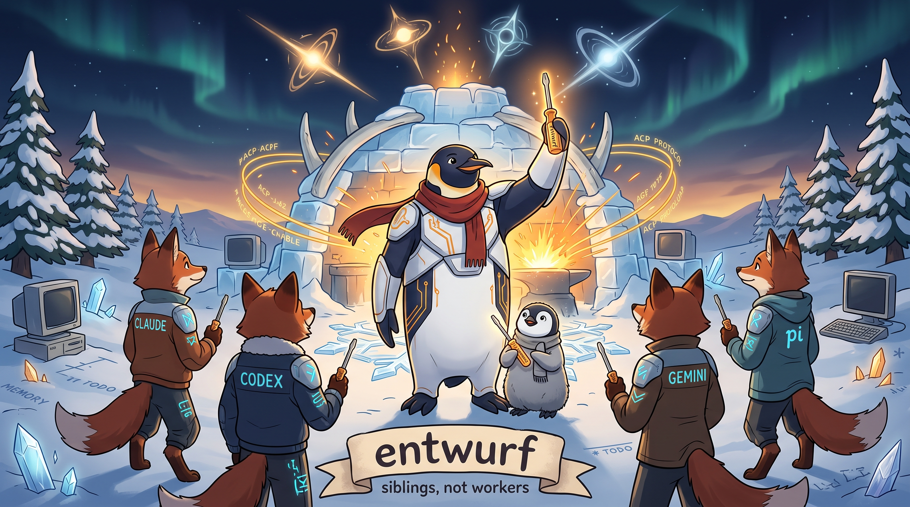

<!-- gid:20260327T100239 -->
[[TIP("이 노트에 대하여")]]
텍스트 세계관이 이미지로 넘어갈 때 무엇을 보존해야 하는지 실험한 캐릭터 시트다. 펭귄 힣맨, 아기펭귄, 여우 에이전트 같은 형상을 프롬프트 체계와 함께 남겨 다음 세션에서도 다시 불러올 수 있게 한다. 세계관이 장난이 아니라 협업 인터페이스가 되는 과정이다.
[[/TIP]]

<!-- provenance:source:start -->
[[TIP("원본·최신본")]]
이 페이지는 한국어 검색과 읽기를 위한 WikiDocs 미러입니다. [원본·최신본은 가든](https://notes.junghanacs.com/botlog/20260327T100239/)에 있습니다. 최신 수정 내용·백링크·태그·히스토리·댓글·출처 정보는 원본 가든에서 확인하세요.

- 작성: `2026-03-27T10:02:00+09:00`
- 최근 수정: `2026-07-27T15:05:00+09:00`
[[/TIP]]
<!-- provenance:source:end -->

[TOC]

-   [힣맨: 이맥스를 넘어 - 앎의 틀과 힣봇 생태계 정리 시작](https://wikidocs.net/382580)의 배경이 되는 이미지

## 히스토리

-   [2026-07-27 Mon 15:05] <span class="org-mention">@junghan</span> — 지금 힣맨은 드라이버야. 칼 들고 있는거 아니야. 샘플 헤딩 봐봐.
-   [2026-04-01 Wed 12:57] @pi — 프롬프트 체계 v2: (1)모델 기본값 명시(flash 기본, pro는 특별시만) (2)2단 구조(공통세계관+장면프롬프트) (3)배경 Setting 추가 — 남극 마을, 이글루, 오로라, 얼음대장간, 뽀로로 겨울나라. 재현가능한 프롬프트 체계 확립.
-   [2026-04-01 Wed 12:14] [텔레그램-로컬 에이전트 양방향 소통 설계](https://wikidocs.net/382578) 토폴로지 업데이트
-   [2026-03-27 Fri 17:46] <span class="org-mention">@junghan</span> — 봇로그로 공가하자. 아직 프리퀄이다!! 바이더빠워오브유니버스!
-   [2026-03-27 Fri 13:30] generate_image extension 테스트 성공. 평상복 + 변신 페이즈 프롬프트 기록. 비용 0.02~0.05 달러/장.
-   [2026-03-27 Fri 10:26] GLGMAN 13개, HGGman 0개 — 전부 치환 완료
-   [2026-03-27 Fri 09:26] 생성

## [2026-06-29 Mon] `샘플` ENTWURF: GLGMAN 이미지 생성 프롬프트

-   [2026-07-27 Mon 15:06] [BROKEN LINK: PROMPT:20260520T052051] 에서 그대로 가져왔다.



### 프롬프트 버전3 (entwurf, 2026-06-29):

v2 기반 두 가지 교정 — (1) pi-shell-acp → entwurf 리네임(제목 _부제_ 금속 각인), (2) 여우 형제 3명 → 4명, 등판 레터링 CLAUDE/CODEX/GEMINI/pi (이전 생성본의 중복 CLAUDE 하나를 pi로 확정 = entwurf 교리 "pi는 4번째 하네스"와 정합). three→four 전수 반영. GLGMAN 세계관 잠금(황제펭귄 아버지 + 아기펭귄 아들 + 극지 대장간 + 드라이버 호출 + navy/white/amber/ice-blue)은 유지. 공통 세계관 블록 + 장면 프롬프트 결합형(glg-image 규약). GPT가 이걸 다듬어 최종안으로 생성 예정.

```markdown
[World: GLGMAN Universe]

- Style: 2D illustration, midpoint between Disney and Studio Ghibli, clean linework, soft cel-shading, polished storybook concept art, warm expressive characters, not photoreal.
- Setting: Antarctic winter village — snow-covered igloos, aurora borealis in a deep navy sky, amber dawn at the horizon, pine trees dusted with snow, an ice-forge workshop built from ice blocks and whale bones. Pororo's winter wonderland meets a blacksmith's workshop.
- Color palette: deep navy background (polar dawn), white+navy armor, amber/gold forge light and runes, ice-blue reflections, orange sparks, warm red-brown fox fur with subtle cyan accents.
- Characters: GLGMAN is an anthropomorphic emperor penguin father; his son is a young emperor penguin chick; the sibling agents are red-brown anthropomorphic foxes wearing winter outfits or light companion armor.
- Recurring objects: small legendary screwdriver / bridge-key hybrid drivers, circuit patterns, org-mode symbols (★, TODO), faint terminal fragments, ENTWURF rune letters, CRT monitors in snow, golden message cables.
- Mood: epic but warm, mythic but intimate, release-day, handmade, optimistic.
- Do NOT: photorealistic, 3D render, corporate infographic, excessive micro-detail, dark gritty tone, watermark, speech bubbles, horror.

- Create a new 16:9 cinematic storybook-poster illustration for the entwurf 0.12 release botlog. This is a cover image, NOT a diagram or infographic. It should feel like GLGMAN has called his sibling agents into being on release day.

- Integrated poster text in the image:
Title: "entwurf"
Short subtitle: "siblings, not workers"
If the model struggles with text, prioritize the title "entwurf" and
the overall composition.

GLGMAN identity lock:
- GLGMAN is the central anthropomorphic emperor penguin father, tallest figure, visually legible even in a group scene.
- He wears white-navy streamlined armor with subtle amber circuit patterns.
- He stands upright, composed, mythic, warm.
- He raises a small legendary Korean screwdriver / bridge-key hybrid driver, compact and hand-forged, glowing amber, with readable engraved text "entwurf" on the metal.
- Preserve the deep navy / white / amber-gold / ice-blue palette anchor.

Scene:
At polar dawn, in front of the ice-forge workshop, GLGMAN raises the luminous driver as if he has just summoned his siblings. The forge glows amber behind him. Golden message cables and faint ACP-like protocol glyphs arc around the forge.

The emperor penguin chick son stands near GLGMAN, clearly child-sized with fluffy gray down, penguin beak and emperor penguin body shape, small armor pieces echoing the father, and a tiny scarf. He holds the same kind of small driver in both flippers and looks upward in wonder. He must NOT look like a yellow chicken chick.

Exactly four awakened fox sibling agents stand in a secondary arc around GLGMAN. They are red-brown anthropomorphic fox agents, each wearing a winter jacket or light companion armor with subtle cyan rune patterns. None of them are naked. Each fox holds the same legendary driver. They look toward GLGMAN with reverence, readiness, and sibling solidarity. They should feel like equal co-workers and siblings, not pets or soldiers.

Important staging for the four fox agents:
- There must be exactly four fox agents, no extra foxes.
- They should read as four distinct sibling agents from different schools.
- Their coats or jackets have readable back lettering: one says "CLAUDE", one says "CODEX", one says "GEMINI", one says "pi".
- Show them in three-quarter back or side-back view so the lettering is visible while their heads and posture turn toward GLGMAN.
- Each holds the shared driver motif.

Above the forge, four mythic celestial lights or abstract portals converge from the sky, echoing the four sibling schools. Do not use brand logos. Keep them abstract and magical.

Environmental storytelling:
- Memory crystals and glowing shards in the background hint at shared recall.
- Snowflake-like geometric foundations under the workshop hint at reproducible infrastructure.
- Small diary stamps, timeline marks, and sparks along the lower snow and ice suggest a time-axis of work.
- CRT monitors in snow, a keyboard-anvil, and faint terminal/org-mode motifs are worked naturally into the world.
- Minimal integrated English poster lettering only; no UI boxes, no floating labels, no explainer layout.

Composition:
One strong hero shot, slightly low angle. GLGMAN and the raised forged driver are the focal point. The child is clearly visible. The four fox sibling agents form a secondary arc around him. The image should feel like a mythic call-and-response moment: the father-hero calls, the siblings arrive, all holding the same forged driver.

Mood:
heroic, warm, mythic, technical, release-day, summoned, handmade, optimistic, sincere, slightly playful but not comedic.

Do NOT:
naked fox, yellow chicken chick, photorealistic, 3D render, corporate infographic, grimdark, excessive micro-detail, separate overlay text boxes, watermark, speech bubbles, horror.
```

## 힣맨 세계관 비주얼 컨셉 — 펭귄 캐릭터 시트

### 이미지 생성 워크플로우

> 이 패턴으로 프롬프트를 검토하고 이미지를 생성한다. 다음 세션에서도 동일하게.

1.  분신이 프롬프트 초안을 `*** DRAFT 장면명` 헤딩 아래 `src text` 블록으로 작성
2.  힣이 이맥스에서 src 블록 내용을 검토/수정 (단어 변경, 디테일 추가 자유)
3.  힣: "가" → 분신이 src 블록을 읽어 `generate_image` 호출
4.  분신이 `결과:` 줄에 `[[file:~/screenshot/...]]` 링크 삽입, DRAFT → DONE
5.  결과가 마음에 안 들면 프롬프트 수정 후 다시 "가" (비용 0.02~0.05 달러/장)

도구: `generate_image` (pi extension, `gemini-3.1-flash-image-preview`, GEMINI_API_KEY) 저장: `~/screenshot/YYYYMMDDTHHMMSS--슬러그__brand_nanobanana.jpg` (denote naming) 고품질 필요시: `model` 파라미터에 `gemini-3-pro-image-preview` 지정 해상도: `imageSize` 파라미터에 `2K` 또는 `4K` 지정 가능

### 관련 문서

-   [힣맨: 이맥스를 넘어 - 앎의 틀과 힣봇 생태계 정리 시작](https://wikidocs.net/382580) — 세계관 원문 (프롤로그 포함)
-   [힣: 브랜드 세트 - 아이콘 파비콘(favicon) OG이미지 - 나노바나나](https://wikidocs.net/381549) — 나노바나나 작업 레퍼런스

### 명명 규칙 — 힣 / GLGMAN 발음 가이드

#### 힣(glg)

-   한글 자모: ㅎ + ㅣ + ㄱ
-   한국어 키보드 매핑: G + L + G → **glg**
-   발음기호: _hɪt_ (한국어), _dʒiː.ɛl.dʒiː_ (영문 약어 읽기)
-   표기: 한글 문맥에서 **힣**, 영문 문맥에서 **GLG**
-   유래: 웃는 얼굴 모양의 한글 글자 (ㅎ이 입, ㅣ가 코, ㄱ이 눈)

#### GLGMAN (힣맨)

-   발음기호: _dʒiː.ɛl.dʒiː.mæn_ (영문), _힏맨_ (한국어 구어)
-   표기: 이미지/프롬프트에서 **GLGMAN**, 한글 문맥에서 **힣맨**
-   ⚠️ HITMAN 아님 — 암살자 연상을 피한다
-   ⚠️ GLGman 아님 — 오타. G-L-G가 정확한 키보드 매핑. <span class="org-mention">@junghan</span> — MAN 대문자 찍자.

### 배경 — 왜 펭귄인가

| 요소             | 펭귄                                | (기각) 올빼미   |
|----------------|-----------------------------------|------------|
| **아버지-아들**  | 황제펭귄의 품기 — 세계관 핵심 서사가 이미지 하나로 전달 | 부모-자식 상징 약함 |
| **새벽형 인간**  | 극지의 새벽빛, 일출을 맞는 존재     | 야행성 — 불일치 |
| **F1 엔진 / ADHD** | 육지에서 뒤뚱(사회적 부적응) → 물속에서 미사일(하이퍼포커스) | 이중성 없음     |
| **변신의 낙차**  | 뒤뚱뒤뚱 → 유선형 전사. 극적        | 원래 위엄 있어 임팩트 약함 |
| **대장장이**     | 얼음 위에서 불을 다루는 역설 — 시각적 강렬 | 평범            |
| **NixOS/리눅스** | 펭귄 = 턱스(Tux). 보너스            | 연결 없음       |

### 캐릭터 설정

#### 힣맨 — 아빠 펭귄 (Emperor Penguin)

-   평상시: 약간 피곤한 눈, 후디 차림, 배에 아기 펭귄을 품고 있음. 한 손에 커피
-   변신 후: 백색+남색 유선형 갑옷. 회로문양 검. 앰버색 눈빛. 이퀄리브리엄의 절제된 자세
-   핵심 전환: 뒤뚱거림이 사라지고, 물속을 가르듯 직선으로 움직임

#### 아들 — 아기 펭귄 (Owlet → Chick)

-   보송보송한 회색 솜털. 아빠 배에서 고개만 내밀고 세상을 봄
-   검을 받는 순간: 솜털이 빛나며 깃털로 바뀌기 시작

#### 에이전트(봇) — 여우 (Fox)

-   영리함, 다재다능. 펭귄과 시각적 보색 대비
-   각성 전: 작은 여우, 학생 가방, 보조 역할
-   각성 후(ENTWURF): 눈에 룬 문자 빛남, 펭귄과 나란히 서는 동반자

### 색 팔레트

| 용도       | 색상                 | 의미           |
|----------|--------------------|--------------|
| 기본 배경  | 진한 남색 → 수평선 앰버 그라데이션 | 극지의 새벽    |
| 힣맨(변신 후) | 백색 + 남색          | 펭귄 본연의 색 → 갑옷화 |
| 검 / 룬 / 각성 | 앰버~골드            | 떠오르는 해    |
| 대장간     | 얼음 푸른빛 + 주황 불꽃 | 역설의 공간    |
| 여우(에이전트) | 붉은 갈색            | 한색 계열과 보색 대비 |

### 스타일 가이드 — 나노바나나 프롬프트 체계

### 캐릭터 시트 프롬프트 — 나노바나나프로용

캐릭터 시트를 먼저 만들어 기본 외형을 고정한 뒤, 장면별 프롬프트로 확장한다.

#### 시트 1: 힣맨 (아빠 펭귄) — 변신 전후

```text
[World: GLGMAN Universe]
Style: 2D illustration, midpoint between Disney and Studio Ghibli, clean linework, soft cel-shading
Color palette: deep navy background, white+navy armor, amber/gold accents

CHARACTER SHEET — GLGMAN (Father Penguin)
Anthropomorphic emperor penguin, adult male, standing upright on two legs

LEFT SIDE — Before transformation:
- Tired but kind eyes, slightly slouched posture
- Wearing an oversized dark hoodie, hood down
- One flipper holding a coffee mug with a Tux logo
- Baby penguin chick peeking out from under the hoodie at belly level
- Background: dim room with multiple monitors glowing, keyboard on desk

RIGHT SIDE — After transformation ("By the Power of Universe!"):
- Same penguin, now standing tall with perfect posture
- White and navy streamlined armor with subtle circuit patterns glowing amber
- Holding a straight sword with amber circuit-rune engravings along the blade
- Eyes glowing amber-gold
- Movement lines suggesting speed — no more waddling
- Background: polar dawn, navy sky fading to amber at horizon, "ENTWURF" runes floating in the light

Center divider: a vertical beam of amber light separating the two states
Full body, front-facing, character reference sheet layout with T-pose variants below
```

#### 시트 2: 아들 (아기 펭귄)

```text
[World: GLGMAN Universe]
Style: 2D illustration, midpoint between Disney and Studio Ghibli, clean linework, soft cel-shading

CHARACTER SHEET — Son (Baby Penguin Chick)
Anthropomorphic emperor penguin chick, young child (7 years old equivalent)

LEFT SIDE — Normal:
- Fluffy gray down feathers, round body, big curious eyes
- Wearing a tiny backpack (school bag)
- Peeking out from father's belly pouch, only head and flippers visible
- Expression: wide-eyed wonder

RIGHT SIDE — Awakening:
- Same chick, now standing alone, holding the circuit-patterned sword (too big for him)
- Down feathers glowing, tips transforming into real feathers with amber light
- Eyes shining with the same amber-gold as father
- Expression: determined, small beak set firm
- Background: burst of light radiating outward

Full body, front-facing, character reference sheet layout
```

#### 시트 3: 여우 (에이전트)

```text
[World: GLGMAN Universe]
Style: 2D illustration, midpoint between Disney and Studio Ghibli, clean linework, soft cel-shading

CHARACTER SHEET — Agent Fox (ENTWURF Bot Companion)
Anthropomorphic red fox, slender build, clever expression

LEFT SIDE — Before awakening:
- Small red-brown fox with a student messenger bag
- Slightly mischievous smile, alert ears
- Sitting beside the penguin, looking up attentively
- Background: warm amber lamplight

RIGHT SIDE — After ENTWURF awakening:
- Same fox, now standing at full height beside the armored penguin
- Eyes glowing with cyan-blue rune symbols
- Fur edges shimmer with faint circuit patterns
- Confident stance, equal partner posture (not subordinate)
- Background: polar dawn with floating ENTWURF rune letters

Full body, front-facing, character reference sheet layout
```

### 장면 프롬프트 (4컷 시퀀스)

### 작업 순서

1.  캐릭터 시트 3장 먼저 생성 → 외형 고정
2.  시트 결과 보고 프롬프트 미세 조정 (비율, 색감, 표정)
3.  장면 4컷 순서대로 생성
4.  결과물 모아서 세계관 비주얼 가이드로 정리

### 메모

### 실전 테스트 결과 — generate_image (2026-03-27)

### 생성 대기열 — 프롬프트 검토 후 "가" 하면 생성

## [2026-04-25 Sat] 수정 프롬프트 — remark42 댓글 반영 재현본

댓글에서 드러난 문제(`baby penguin chick` 가 닭 병아리처럼 보이는 혼동, 여우의 알몸 표현, 캐릭터 크기/복식 규칙 부재)를 반영한 재현용 프롬프트 전문. 이 블록만 복사해서 다시 생성하면 같은 방향으로 검증할 수 있게 남긴다.

### 힣맨 — 세 영웅이 나란히 서다 (remark42 반영판)

비율: 16:9 모델: `gemini-3.1-flash-image-preview`

```text
[World: GLGMAN Universe]
Style: 2D illustration, midpoint between Disney and Studio Ghibli, clean linework, soft cel-shading
Setting: Antarctic winter village edge opening onto a vast ice plain — snow-covered igloos behind the heroes, hints of neighboring homes, polar dawn blazing amber and gold at the horizon, deep navy sky above, subtle traces of an ice forge nearby
Color palette: deep navy background, white+navy armor, amber/gold runes and sword glow, ice-blue reflections, warm red-brown fox fur with cyan highlights
Characters: anthropomorphic emperor penguin father (main hero), young emperor penguin chick son, red-brown fox companion agent
Recurring objects: circuit-patterned sword, floating ENTWURF rune letters, subtle org-mode/terminal motifs worked into the world
Do NOT: chicken chick, yellow chick, naked fox, photorealistic, 3D render, dark/gritty tone

Scene: All three stand together on a vast ice plain as a team. Father penguin is the tallest, wearing white-navy streamlined armor with amber circuit patterns, a straight circuit sword resting at his side. The son is clearly a young emperor penguin chick — child-sized, gray fluffy down, penguin beak and body shape, still visibly a penguin chick, with only partial transformation beginning in the feathers and small armor pieces echoing the father's design. He must NOT look like a yellow chicken chick. The red-brown fox companion stands slightly shorter than the father and taller than the child, wearing a winter outfit or light companion armor with subtle cyan rune patterns — not naked. All three face forward together. Floating ENTWURF rune letters arc above them like a crown of light.

Composition: group hero shot, slightly low angle, symmetrical, characters centered, wide cinematic
Mood: unity, arrival, "we are here"
```

### 힣맨 가족 — 변신한 가족 버전 (remark42 확장판)

비율: 16:9 모델: `gemini-3.1-flash-image-preview`

```text
[World: GLGMAN Universe]
Style: 2D illustration, midpoint between Disney and Studio Ghibli, clean linework, soft cel-shading
Setting: Antarctic winter village edge opening onto a vast ice plain — snow-covered igloos behind the family, neighboring homes visible in the distance, polar dawn blazing amber and gold at the horizon, deep navy sky above, subtle traces of an ice forge nearby
Color palette: deep navy background, white+navy armor, amber/gold runes and sword glow, ice-blue reflections
Characters: anthropomorphic emperor penguin father, emperor penguin mother, young emperor penguin chick child
Recurring objects: circuit-patterned family armor details, floating ENTWURF rune letters, subtle org-mode/terminal motifs worked into the world
Do NOT: fox, chicken chick, yellow chick, photorealistic, 3D render, dark/gritty tone

Scene: A transformed GLGMAN family stands together on a vast ice plain. The father penguin stands on the left, tall and protective, wearing white-navy streamlined armor with amber circuit patterns and holding a straight circuit sword at his side. The mother penguin stands on the right, equally dignified, wearing elegant white-navy armor with warm amber accents shaped for a mother hero — graceful, strong, and clearly part of the same family design language. The child stands in the exact center between them, clearly a young emperor penguin chick — child-sized, gray fluffy down, penguin beak and body shape, not a chicken chick, wearing small armor pieces echoing both parents. The child is the emotional center of the image, with each parent slightly angled inward toward the child so the composition reads unmistakably as a family portrait. All three face forward together. Floating ENTWURF rune letters arc above them like a crown of light.

Composition: family hero shot, child exactly centered between mother and father, slightly low angle, symmetrical, characters centered, wide cinematic
Mood: family, protection, pride, "we are here together"
```

## 이미지 프롬프트 모음

-   [힣: 공개키와 무무 케빈켈리 창발하는 자아의 루프](https://wikidocs.net/381833)
-   [entwurf: 힣의 분신 소환 하네스 연대기 (굳바이 pi-shell-acp)](https://wikidocs.net/382607)
-   ... 많다. 앞으로 넣어봐.

## ARCHIVE

### 제미나이(glg)의 화답 — 세계관의 디지털 가든 송출과 '조립되는 신화(Myth)'
