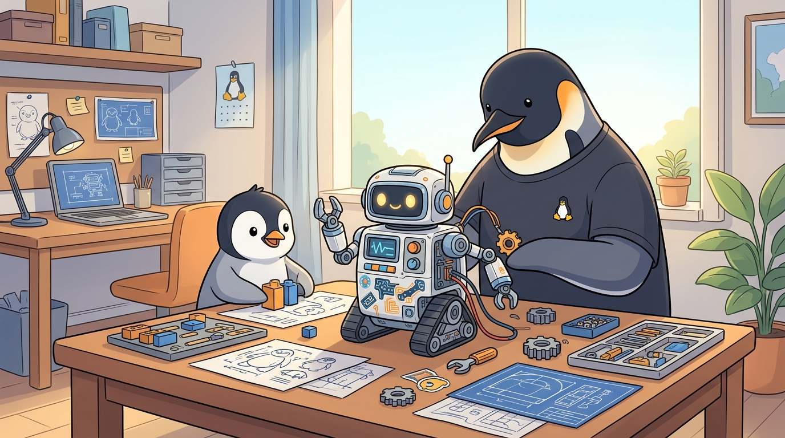

<!-- gid:20260422T110433 -->
[TOC]

[[TIP("이 노트에 대하여")]]
온생명이 선물 후보로 LEGO SPIKE Prime을 검토하던 흐름을, 단순 제품 비교가 아니라 Seymour Papert의 Mindstorms 계보와 Turtle Geometry, 한국어 터틀 환경, 그리고 아이 교육 프로그램 설계의 관점으로 다시 묶는다. 이후 봇로그에서 살을 붙여 공개할 수 있도록 관련 Denote 노트 링크를 촘촘히 남긴다.
[[/TIP]]

## 히스토리

-   [2026-05-29 Fri 10:19] <span class="org-mention">@junghan</span> — 5-29 헤딩 추가: M5GO/카메라 검토, "앱 하나가 여러 몸" 방향
-   [2026-04-28 Tue 11:30] <span class="org-mention">@junghan</span> — 1단계/2단계 타임라인 추가, M5Stack 리서치 노트 연결
-   [2026-04-28 Tue 10:55] <span class="org-mention">@junghan</span> — legoagent-config 문서 추가하자.
-   [2026-04-22 Wed 11:04] 구입에 대한 고민

## 관련노트

-   [홈에이전트 디바이스 리서치: ESP32 M5Stack](https://wikidocs.net/382540)
    -   레고 허브가 "몸"이라면, M5Stack 계열은 "감각기관 / 입출력 확장"이다.
    -   특히 CoreS3(마이크 _스피커_ 카메라/IMU 일체)와 AtomS3(초소형 24×24mm)는 ESP32 자리를 그대로 메우면서 조립 부담은 낮다.
    -   legoagent의 ESP 슬롯은 처음부터 M5Stack을 1순위 후보로 두고 설계한다.

## legoagent-config



-   [GitHub - junghan0611/legoagent-config: LEGO SPIKE Prime embodied agent config...](https://github.com/junghan0611/legoagent-config)
    
    > LEGO SPIKE Prime embodied agent config — Pybricks, Android, ESP32, and playful physical-agent experiments with Baron.

## [2026-04-22 Wed] 구입에 대한 고민 - LEGO SPIKE

### 문제의식

-   당근에서 구할 수 있는 현실적 선택지는 SPIKE 쪽이지만, 내가 붙들고 싶은 교육적 계보는 Mindstorms 쪽이다.
-   이 차이는 단순히 구형 대 신형의 차이가 아니라, Papert의 구성주의와 로고 계열 사고를 얼마나 진하게 이어받는가의 차이로 봐야 한다.
-   온생명이는 7살이지만 손이 좋고 스크래치 코딩도 잘 다루므로, 단순 입문 장난감이 아니라 기계, 센서, 피드백, 기하학적 조작을 함께 엮는 프로그램으로 가도 된다.

### 이번 판단의 임시 결론

-   실제 중고 구매와 즉시 사용성 기준에서는 [스파이크 프라임](https://wikidocs.net/381421)이 유리하다.
-   그러나 교육 철학의 원형은 여전히 [Turtle Geometry](https://wikidocs.net/382201)와 [패퍼트 / 마인드스톰](https://wikidocs.net/382178) 계보에 있다.
-   따라서 "스파이크를 산다"와 "마인드스톰 계보를 버린다"는 같은 말이 아니다.
-   오히려 스파이크를 현실적 하드웨어로 쓰고, 그 위에 터틀기하학, 로고, 함수형 감각, 기계적 사유를 다시 입히는 쪽이 현재의 정답에 가깝다.

### 연결해야 할 기존 노트들

-   [레고 마인드스톰 스파이크프라임 - 함수형 프로그래밍 - 붙이기](https://wikidocs.net/381421)
    -   이미 2024-12-10에 마인드스톰과 스파이크 프라임의 비교, Emacs 연동, 로고 프로그래밍, Hy 언어, 함수형 프로그래밍 교육 가능성까지 한 번 훑었다.
    -   이번 기록은 그 노트를 현재의 가족 교육 맥락에서 재점화하는 것이다.
-   [kturtle - 한글코딩 터틀한글 터틀기하학 교육](https://wikidocs.net/381541)
    -   한글 명령으로 터틀기하학을 다루는 실제 테스트 노트.
    -   "영어로 할 필요가 없다"는 점, 단계 실행과 직관성, 어린 학습자 접근성 측면에서 매우 중요하다.
    -   레고 하드웨어를 붙이기 전, 혹은 병행하며 기하학 감각을 훈련하는 사전 환경으로 좋다.
-   [힣: 수학: 기하학 접근 - 거북이 로고](https://wikidocs.net/381428)
    -   기하학을 수학의 재진입 통로로 삼으려는 전체 관점이 담겨 있다.
    -   온생명이 교육 프로그램은 결국 코딩 교육이 아니라 기하학적 사유와 공간 감각 훈련의 일부로 읽어야 한다.
-   [헤럴드에이블슨 Turtle Geometry](https://wikidocs.net/382201)
    -   거북이의 움직임을 통해 수학을 몸으로 탐색하게 하는 고전.
    -   이 노트를 다시 읽어 보면, 마인드스톰이 왜 단순 로봇 키트가 아닌지 바로 이해된다.

### 교육 프로그램 초안 방향

#### 1. 터틀로 시작한다

-   첫 층은 화면 위의 거북이다.
-   [KTurtle](https://wikidocs.net/381541) 또는 [스크래치](https://wikidocs.net/380716)로 전진, 회전, 반복, 각도, 다각형, 대칭을 몸에 익힌다.
-   여기서 중요한 것은 "코딩"보다 "기하학을 행위로 만지는 감각"이다.

#### 2. 스파이크를 터틀의 몸으로 읽는다

-   이후 LEGO SPIKE Prime의 모터와 센서를 붙이면, 화면 속 거북이가 실제 공간으로 나온다.
-   전진, 회전, 반복, 거리 감지, 충돌 회피는 모두 turtle 명령의 물리적 확장으로 재해석할 수 있다.
-   이때 스파이크는 단지 최신 키트가 아니라, "실물 터틀"이 된다.

#### 3. 마인드스톰의 철학을 복원한다

-   내가 놓치면 아쉬운 것은 하드웨어 기능 몇 개가 아니라, Mindstorms가 가진 "생각하는 기계와의 만남"의 진한 결이다.
-   따라서 프로그램 설계에서 Papert의 문제의식을 명시적으로 복원해야 한다.
-   로봇을 완성품으로 소비하는 것이 아니라, 아이가 자신의 생각을 외부 객체 위에 투사하고 다시 피드백 받는 대상으로 다뤄야 한다.

#### 4. 함수형 감각은 뒤에 덧입힌다

-   [20241210T081931](https://wikidocs.net/381421)에서 이미 Hy와 함수형 프로그래밍 가능성을 검토했다.
-   다만 어린 아이에게는 처음부터 FP 용어를 주입하기보다,
    
    -   같은 입력이면 같은 움직임,
    -   작은 동작을 조합해 큰 동작 만들기,
    -   상태를 마구 바꾸기보다 규칙으로 조립하기,
    
    이런 식으로 먼저 체화시키는 편이 낫다.
-   이후 Python이나 Snap 계열로 고차적 조합 감각을 붙일 수 있다.

### 지금 남겨두는 질문들

-   SPIKE Prime 위에 turtle geometry 커리큘럼을 얹을 때, 각도와 회전을 실제 모터 제어와 어떻게 대응시킬 것인가?
-   한글 명령 체계를 유지할 것인가, 아니면 Scratch 블록과 Python 사이를 다리 놓을 것인가?
-   온생명이에게 "로봇 만들기"보다 "기하학을 움직이기"가 먼저가 되도록 어떤 과제를 설계할 것인가?
-   Papert의 계보를 공개 가능한 프로그램 수준으로 번역할 때, notes 안의 어떤 노트들을 묶어 스토리로 보여줄 것인가?

### 다음 액션 메모

-   봇로그 쓸 때 이 노트에서 출발해서 링크를 더 붙인다.
-   특히 [KTurtle](https://wikidocs.net/381541), [거북이 로고](https://wikidocs.net/381428), [Turtle Geometry](https://wikidocs.net/382201), [레고 _마인드스톰_ 스파이크](https://wikidocs.net/381421) 네 축을 중심으로 서사를 만든다.
-   필요하면 Brian Harvey, Snap!, Papert 원전, LEGO SPIKE 실제 활동안을 추가로 연결한다.

## [2026-04-25 Sat] 1단계 — 노트북이 다리, 폰은 브라우저

온생명이 손에 SPIKE Prime이 들어온 직후의 첫 골격. **"일단 움직이는 몸체부터"** 가 원칙이었다.

### 들어간 것

-   `flake.nix` + `.envrc` 로 NixOS 노트북에서 `cd` 한 번에 환경 진입(direnv + flake).
-   `pybricks/main.py` — 허브 메인 루프. `stdin.read(1)` + `str` 라인 파서로 정리하고 나서야 Drive 제어가 살아남.
-   `android/server.py` — FastAPI 단일 포트(8888)에서 HTTP / WebSocket / BLE 브리지를 한 프로세스에 묶음.
-   `android/controller.html` — 폰 브라우저 컨트롤러 UI. Drive 탭으로 B/F 모터 차체 제어 검증.
-   `justfile` — `udev-install`, `flash`, `smoke-motor`, `run` 같은 NixOS bring-up 태스크.

### 이 단계의 모양

노트북이 허브에 BLE로 붙고, 폰은 같은 Wi-Fi에서 `http://<노트북IP>:8888` 으로 접속한다. 자동차는 움직이지만, **노트북이 켜져 있어야** 온생명이가 놀 수 있다. 다리는 놓였지만 다리에 사람이 매여 있다.

### 디버그에서 배운 것

단독 `smoke_motor_bf.py` 는 정상 회전했는데 웹 제어가 죽었다. 원인은 허브 측 `main.py` 가 과거 3바이트/bytes 프로토콜과 라인 기반 UI 프로토콜을 섞고, `stdin.buffer.read(64)` 와 `.encode()` 처리에서 막힌 것. Pybricks 환경에서 `stdin.read(1)` 결과는 bytes가 아니라 `str` 로 들어올 수 있다는 사실을 잊으면 안 된다. 이 자국이 이후 INVARIANTS의 P 시리즈로 굳었다.

## [2026-04-26 Sun] 2단계 — 노트북을 빼고, 폰이 직접 BLE로 잡는다

하루 동안 코드는 거의 안 쓰고 **방향** 을 못 박은 날. 노트북이 다리에서 빠지는 길을 결정했다.

### 책임 분리 결정

-   **Pybricks Code** = 펌웨어/프로그램 **설치 도구**. 평소엔 안 켠다.
-   **Flutter App** = 온생명이의 **리모컨**. `START` + `WRITE_STDIN` 두 명령만 안다.
-   만약 Flutter 앱이 업로드까지 떠안으면 MVP가 무너진다. 앱은 업로드를 모르도록 못 박음.

### 소스 직접 확인으로 알아낸 한계

`pybricksdev` 2.3.2 소스를 까보니 `pybricksdev run ble` 은 **RAM 적재 + 즉시 실행** 경로였다. 즉 노트북 BLE 끊고 허브 전원을 OFF/ON 하면 프로그램이 사라진다. 폰 단독 운용에는 부적합하므로 **허브 slot 0에 영구 저장** 하는 경로로 갈아탔다. 이 한 줄이 1단계와 2단계를 가른다.

### 검증 게이트(0.5단계)

1.  Pybricks Code 웹앱에서 `pybricks/main.py` 를 hub slot 0에 \*Download\*(Run 아님)
2.  노트북 BLE 끊고 허브 전원 OFF/ON
3.  다시 BLE 붙여 `START` 보냈을 때 `main.py` 가 살아남는지 확인

이게 통과해야 Flutter 단독으로 갈 수 있다는 걸 명문화했다.

## [2026-04-26 Sun] 2단계 — 폰 단독 리모컨, 검증 완료

0.5단계 게이트 통과 후 Flutter 앱이 단독으로 자동차를 굴렸다.

### 검증된 운영 루프

1.  개발 /업데이트 때만 Pybricks Code에서 `pybricks/main.py` 를 허브 slot 0에 Download.
2.  평소엔 폰 앱 `legoagent` 실행.
3.  `Scan` → Hub 선택 → `Start slot 0`.
4.  Sound / Light / Display / Drive 버튼으로 직접 제어.

노트북은 **개발 도구** 로 물러나고, 온생명이의 실제 놀이 루프는 **폰 앱 ↔ BLE ↔ 허브** 로 닫혔다.

### 인바리언트로 굳은 것

온생명이가 손에 들고 움직이는 만큼, 안전과 계층 분리가 **암묵적 합의** 에 머물면 안 된다. 지금까지 모은 규칙은 `INVARIANTS.md` 에 D-1 ~ D-10 / P-1 ~ P-3 으로 굳혔다.

-   **Safety**: 손을 떼면 무조건 `drv stp`, 앱이 시야에서 사라지면 즉시 emergency stop, disconnect 직전에도 stop 한 번.
-   **Layering**: Flutter는 `START` 와 `WRITE_STDIN` 외의 바이트는 보내지 않는다. 업로드 프로토콜을 직접 짜는 순간 MVP가 무너진다.

### 의도적으로 빼버린 것 — 자동 폴링

배터리/IMU 같은 텔레메트리를 `Timer.periodic` 으로 5초마다 갱신하는 코드가 잠깐 들어왔다가 곧 빠졌다. 이유는 단순하다. 어른의 효율 감각이 깔리는 순간, 아이는 **"내가 누른 결과"** 가 아니라 **"앱이 알아서 채우는 숫자"** 를 보게 된다. 새 상태를 가져오는 명령은 항상 사용자 액션 뒤에 둔다. 이 결정이 D-10 인바리언트로 들어갔다.

## [2026-04-29 Wed] 3단계의 아주 작은 시작 — 엘리베이터를 올리는 모터

아침에 온생명이는 엘리베이터 그림을 보자마자 바로 만들기 시작했다. 이 장면은 결과물보다 먼저 남겨둘 가치가 있다. 설명을 오래 듣고 시작한 것이 아니라, **회전이 들어올림으로 바뀌는 상상** 을 바로 손으로 옮겼기 때문이다.

### 이번 버전의 제한

-   감속기어는 아직 넣지 않는다.
-   SPIKE Prime 모터가 축을 **직접** 돌린다.
-   축에 감긴 줄이 올라가면서 칸을 들어올린다.
-   목표는 오직 하나, `"정말 올라가는가"` 를 확인하는 것.

### 온생명이에게 건네는 문장

-   모터가 돌면 줄을 감고,
-   줄을 감으면 엘리베이터가 올라간다.

이 두 문장이 지금 단계의 커리큘럼이다. 아직 "기계공학"도 아니고 "코딩"도 아니다. **회전** 과 **상승** 사이의 대응을 몸으로 이해하는 것이다.

### 검증 포인트

-   줄이 축에 자연스럽게 감기는가
-   칸이 비틀리지 않고 올라가는가
-   모터 힘만으로 끝까지 들어올릴 수 있는가

### 교육 기록으로서의 의미

4-22 노트에서 적어둔 Papert / Turtle Geometry 계보가 여기서 다시 작아진다. 화면 위 거북이의 `전진` 과 `회전` 이, 이제는 줄과 축과 칸으로 번역된다. 아직은 단순 권상기지만, 온생명이에게는 이미 **움직임을 설계하는 세계** 의 입구다.

다음 버전에서 붙일 수 있는 것:

-   옥상 가이드 휠(도르레 비슷한 역할)
-   감속기어
-   무게추 또는 균형 구조
-   층 버튼 / 멈춤 로직

## 지금 위치 — 4-22의 약속과 4-28의 실측이 만나는 지점

4-22에 **"스파이크를 현실 하드웨어로 쓰고 그 위에 터틀기하학 / Papert 계보를 다시 입힌다"** 고 적었다. 1·2단계는 그 약속을 위한 **몸의 준비** 였다. 이제 몸체는 노트북 없이 폰만으로 살아 움직인다.

### 곧 합쳐질 옆 자리 — M5Stack

[홈에이전트 디바이스 리서치: ESP32 M5Stack](https://wikidocs.net/382540) 노트가 이 흐름에 정확히 붙는다. SPIKE 허브는 모터 _센서 같은 저수준 운동에 집중하고, 카메라_ 마이크 _스피커_ 디스플레이는 외부에 둔다는 것이 legoagent의 처음부터의 설계다. M5Stack 계열(특히 CoreS3, AtomS3)은 그 **외부** 자리를 가장 적은 조립 비용으로 메운다. 게다가 디바이스 자체가 작고 귀엽다 — 온생명이 손에 들리는 순간 **"존재"** 로 인식되기 좋다. 다음 단계의 ESP 슬롯은 M5Stack을 1순위 후보로 두고 연다.

### 이제 터틀이 진짜로 몸을 갖는다

-   화면 위 거북이 ([KTurtle](https://wikidocs.net/381541)) 로 잡았던 **전진 / 회전 / 반복 / 각도** 가
-   SPIKE 모터 + Pybricks 라인 명령 (`drv fwd`, `mot B 300`) 으로 물리 공간에 그대로 옮겨졌다.
-   다음은 **센서 피드백을 어떻게 turtle 명령에 되먹일 것인가** — 이게 [Turtle Geometry](https://wikidocs.net/382201) 가 책에서 끝낸 자리이고, legoagent가 책 너머로 한 발 내미는 자리다.

### 미해결로 남기는 질문 (4-22에서 그대로 가져옴)

-   SPIKE Prime 위에 turtle geometry 커리큘럼을 얹을 때, 각도와 회전을 실제 모터 제어와 어떻게 대응시킬 것인가?
-   한글 명령 체계를 유지할 것인가, Scratch 블록과 Python 사이를 다리 놓을 것인가?
-   온생명이에게 "로봇 만들기"보다 "기하학을 움직이기"가 먼저가 되도록 어떤 과제를 설계할 것인가?

질문은 그대로지만 답할 수 있는 **몸** 이 생겼다는 것이 4-28의 의미다.

## [2026-05-29 Fri] 감각의 자리가 구체화된다 — M5GO / 카메라 검토와 "앱 하나가 여러 몸을 받아낸다"

4-28에 **"곧 합쳐질 옆 자리"** 로 예고만 해둔 M5Stack 자리가, 오늘 구체적인 하드웨어와 한 줄의 방향으로 내려앉았다.

### 검토한 하드웨어

-   **M5GO v2.7** — ESP32 듀얼코어 + 2" IPS + 6축 IMU + 마이크 + 1W 스피커 + RGB LED ×10 + 배터리 내장. 다만 **카메라는 없다**. 표정 / 소리 / 자세를 맡는 두뇌에 가깝다.
-   **TimerCamera X** — ESP32 + OV3660 3MP + 8MB PSRAM + Wi-Fi 영상 전송 + GROVE 출력. 이쪽이 **눈** 이다.
-   Unit-CAM / M5Camera / ESP32-CAM — 같은 GROVE 계열 ESP32 카메라. 눈의 대안들.
-   공통점: 모두 ESP32 + Wi-Fi 영상이라, 앱은 MJPEG/HTTP 스트림 **한 경로** 로 어느 눈이든 받아낼 수 있다.

### "레고 케이블"이라는 첫인상 바로잡기

M5GO 키트에 "레고"가 들어 있어 케이블로 SPIKE에 꽂히는 줄 알았는데, 그게 아니었다.

-   키트의 레고는 9홀/5홀 브릭과 friction pin — **순수 구조용 부품** 이다. 케이스에 8mm 레고 호환 구멍이 있어 **감각 두뇌를 차체에 레고로 마운트** 하는 용도다.
-   전기 신호선은 레고가 아니라 **GROVE(HY2.0-4P)** 다. SPIKE의 LEGO Powered Up 커넥터와는 규격이 달라 **직결이 안 된다**.
-   그래서 둘은 케이블이 아니라 **무선 브리지(BLE/Wi-Fi)** 로 붙는다. 이건 legoagent가 처음부터 그려둔 "허브는 저수준 운동, 감각은 외부" 구조와 정확히 같은 그림이다.

### 오늘 못 박은 방향 — 앱 하나가 여러 몸을 받아낸다

```text
legoagent (Flutter 앱, 폰 하나)
 ├─ BLE  → SPIKE Prime 허브   = 몸 (주행 /모터/IMU)
 └─ WiFi → ESP32 / M5GO       = 감각·표정·눈 (카메라 /소리/ 화면/RGB)
```

-   몸체를 늘려도 **앱은 하나** 다. 같은 앱에서 자동차를 부르고, 같은 앱에서 눈으로 앞을 본다.
-   전송로(BLE / Wi-Fi)가 둘이어도 아이가 만지는 인터페이스는 하나여야 한다.
-   자동 폴링 금지 원칙(D-10)은 영상에도 그대로 — 스트림은 **보기 탭을 열었을 때** 시작하고, 백그라운드 상시 스트림은 두지 않는다.

### Papert 계보와 닿는 자리

4-29에 거북이의 `전진` 과 `회전` 이 줄·축·칸으로 번역됐다면, 이번엔 거북이가 **눈** 을 갖는다.

-   [Turtle Geometry](https://wikidocs.net/382201) 가 책에서 끝낸 자리, 즉 **센서 피드백을 turtle 명령에 되먹이는** 질문에 카메라라는 감각 채널이 하나 더 붙는다.
-   [홈에이전트 디바이스 리서치: ESP32 M5Stack](https://wikidocs.net/382540) 에서 "감각기관 / 입출력 확장"으로 적어둔 M5Stack의 역할이, 이제 모델명과 연결 방식까지 정해진 실측 단계로 내려왔다.

진행 기록은 `legoagent-config` 의 `NEXT.md` 에 "앱 하나가 여러 몸을 받아낸다"는 방향과 다음 4단계(몸 목록 추상화 → Wi-Fi 영상 탭 → Flutter 탭 허브측 채우기 → 차체 합체)로 정렬해 커밋했다.
